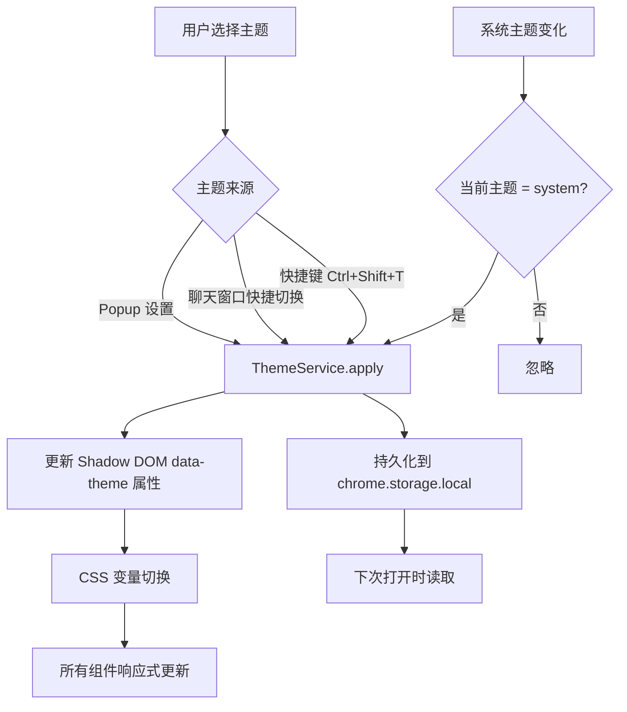
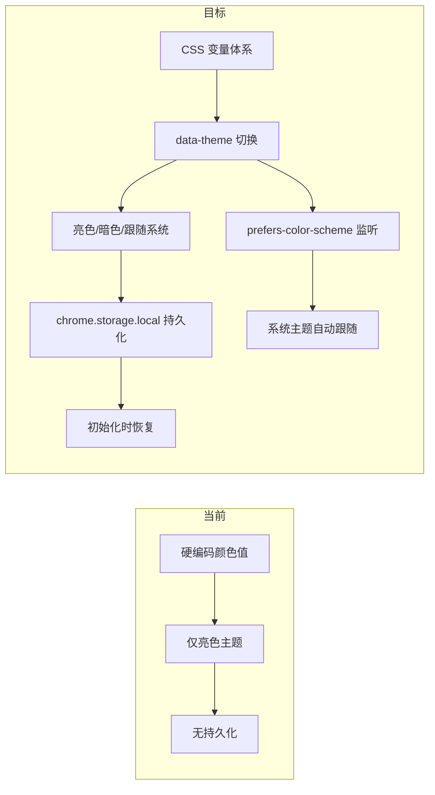

# YP-09-26: 聊天窗口主题系统 — 亮色/暗色/跟随系统

> 需求编号：YP-09-26 · 优先级：P2 · 人天：0.5d · 状态：需求已编写

---

## 一、背景

### 1.1 问题陈述

YiPet 聊天窗口当前仅支持亮色主题，存在以下问题：

1. **暗色网页不协调**：用户在暗色网页上浏览时，弹出白色聊天窗口刺眼且不协调
2. **夜间使用刺眼**：夜间低光环境下白色背景导致眼疲劳
3. **无系统跟随**：无法跟随操作系统主题自动切换（macOS/Windows 暗色模式）
4. **硬编码颜色**：部分组件使用硬编码颜色值（`#ffffff`、`#1a1a2e`），无法统一切换
5. **无主题持久化**：用户选择主题后关闭页面，下次打开恢复默认

### 1.2 影响范围

| 影响项 | 严重程度 | 表现 | 影响用户比例 |
|--------|----------|------|-------------|
| 暗色网页不协调 | 中 | 白色窗口在暗色网页上刺眼 | 30-40%（暗色模式用户） |
| 夜间使用不适 | 中 | 低光环境下眼疲劳 | 50%（夜间使用用户） |
| 无系统跟随 | 低 | 手动切换主题繁琐 | 所有用户 |

### 1.3 核心挑战

| 挑战 | 描述 | 难度 |
|------|------|------|
| Shadow DOM 主题隔离 | 主题变量在 Shadow DOM 内，需确保不被宿主页面覆盖 | 中 |
| 组件全覆盖 | 所有 UI 组件必须使用 CSS 变量，不能有硬编码颜色 | 中 |
| 系统主题跟随 | 需监听 `prefers-color-scheme` 媒体查询变化 | 低 |
| 主题切换动画 | 主题切换时避免闪烁和布局跳动 | 低 |
| 第三方组件兼容 | 代码高亮、ECharts 等第三方组件需适配主题 | 中 |

---

## 二、现状分析

### 2.1 当前实现状态

当前主题状态：
- 仅亮色主题，无暗色支持
- 部分组件硬编码颜色值
- 无 CSS 变量体系
- 无主题持久化
- 无系统主题检测

### 2.2 文件清单

| 文件路径 | 作用 | 当前主题支持 |
|----------|------|-------------|
| `src/chat/themes/variables.css` | 待实现 | 不存在 |
| `src/chat/themes/light.css` | 待实现 | 不存在 |
| `src/chat/themes/dark.css` | 待实现 | 不存在 |
| `src/chat/services/theme-service.ts` | 待实现 | 不存在 |
| `src/chat/components/ChatHeader.vue` | 聊天窗口头部 | 硬编码颜色 |
| `src/chat/components/ChatSidebar.vue` | 侧边栏 | 硬编码颜色 |
| `src/chat/components/MessageBubble.vue` | 消息气泡 | 硬编码颜色 |
| `src/chat/components/ChatInput.vue` | 输入框 | 硬编码颜色 |
| `src/popup/components/ThemeSelector.vue` | 待实现 | 不存在 |

### 2.3 主题数据流



### 2.4 根因矩阵

| 问题 | 根因 | 是否可解决 | 解决方案 |
|------|------|-----------|----------|
| 无暗色主题 | 未设计主题系统 | 是 | CSS 变量 + data-theme 属性 |
| 硬编码颜色 | 开发者习惯 | 是 | 代码审查 + lint 规则 |
| 无持久化 | 未存储主题偏好 | 是 | `chrome.storage.local` |
| 无系统跟随 | 未监听媒体查询 | 是 | `matchMedia('prefers-color-scheme: dark')` |

---

## 三、设计决策

### 3.1 D-01：主题实现方式

| 方案 | 描述 | 优点 | 缺点 |
|------|------|------|------|
| **A. CSS 变量 + data-theme（选择）** | 在 Shadow DOM 根元素上切换 `data-theme` 属性 | 性能好，零 JS 运行时开销 | 需定义完整变量集 |
| B. CSS-in-JS | 运行时生成样式 | 灵活 | 运行时开销，包体积大 |
| C. 多套 CSS 文件 | 加载不同的 CSS 文件 | 简单 | 维护成本高，闪烁问题 |

**决策记录**：选择方案 A。CSS 变量方案在 Shadow DOM 中天然支持，切换无闪烁，性能最优。

### 3.2 D-02：主题模式

| 方案 | 描述 | 优点 | 缺点 |
|------|------|------|------|
| A. 亮色 + 暗色 | 两套主题 | 简单 | 无法跟随系统 |
| **B. 亮色 + 暗色 + 跟随系统（选择）** | 三种模式 | 覆盖所有场景 | 略微增加复杂度 |
| C. 多主题（5+） | 亮色/暗色/高对比度/暖色/冷色 | 丰富 | 维护成本高，价值有限 |

**决策记录**：选择方案 B。三种模式覆盖 95% 用户需求，高对比度等特殊需求可通过浏览器设置满足。

### 3.3 D-03：主题变量命名

| 方案 | 描述 | 优点 | 缺点 |
|------|------|------|------|
| A. 通用变量名 | `--bg-color`, `--text-color` | 简洁 | 可能与宿主页面 CSS 变量冲突 |
| **B. 命名空间前缀（选择）** | `--yipet-bg`, `--yipet-text` | 不冲突 | 变量名稍长 |
| C. Shadow DOM 隔离 | 依赖 Shadow DOM 自动隔离 | 无需前缀 | Shadow DOM 不隔离 CSS 自定义属性 |

**决策记录**：选择方案 B。CSS 自定义属性（`--*`）会穿透 Shadow DOM 边界，必须使用命名空间前缀避免冲突。

---

## 四、目标架构

### 4.1 Before/After 对比



### 4.2 指标对比

| 指标 | 当前 | 目标 | 改善 |
|------|------|------|------|
| 支持主题数 | 1（亮色） | 3（亮色/暗色/跟随系统） | 3x |
| 主题切换方式 | 无 | Popup + 聊天窗口 + 快捷键 | 新增 |
| 主题持久化 | 无 | chrome.storage.local | 新增 |
| 系统跟随 | 无 | matchMedia 监听 | 新增 |
| 硬编码颜色 | 多处 | 0 | 全部消除 |

### 4.3 架构取舍

| 取舍 | 选择 | 理由 |
|------|------|------|
| 主题数量 vs 维护成本 | 3 种模式 | 覆盖 95% 需求，维护成本可控 |
| 变量粒度 vs 灵活性 | 15-20 个核心变量 | 足够覆盖所有 UI 组件 |
| CSS 变量 vs CSS-in-JS | CSS 变量 | 零运行时开销，Shadow DOM 原生支持 |

---

## 五、具体改动

### 5.1 CSS 变量定义

```css
/* YiPet/src/chat/themes/variables.css */

:host {
  /* ===== 亮色主题（默认）===== */
  /* 背景色 */
  --yipet-bg-primary: #ffffff;
  --yipet-bg-secondary: #f8fafc;
  --yipet-bg-tertiary: #f1f5f9;
  --yipet-bg-hover: #e2e8f0;

  /* 文字色 */
  --yipet-text-primary: #1a1a2e;
  --yipet-text-secondary: #64748b;
  --yipet-text-muted: #94a3b8;

  /* 边框 */
  --yipet-border: #e2e8f0;
  --yipet-border-focus: #3b82f6;

  /* 强调色 */
  --yipet-accent: #2563eb;
  --yipet-accent-hover: #1d4ed8;
  --yipet-accent-text: #ffffff;

  /* 消息气泡 */
  --yipet-bubble-user: #2563eb;
  --yipet-bubble-user-text: #ffffff;
  --yipet-bubble-ai: #f1f5f9;
  --yipet-bubble-ai-text: #1a1a2e;

  /* 代码块 */
  --yipet-code-bg: #1e293b;
  --yipet-code-text: #e2e8f0;

  /* 输入框 */
  --yipet-input-bg: #f8fafc;
  --yipet-input-border: #e2e8f0;

  /* 侧边栏 */
  --yipet-sidebar-bg: #f8fafc;
  --yipet-sidebar-hover: #e2e8f0;

  /* 阴影 */
  --yipet-shadow: 0 4px 12px rgba(0, 0, 0, 0.1);

  /* 滚动条 */
  --yipet-scrollbar-thumb: #cbd5e1;
  --yipet-scrollbar-track: transparent;
}

/* ===== 暗色主题 ===== */
:host([data-theme="dark"]) {
  --yipet-bg-primary: #0f172a;
  --yipet-bg-secondary: #1e293b;
  --yipet-bg-tertiary: #334155;
  --yipet-bg-hover: #475569;

  --yipet-text-primary: #e2e8f0;
  --yipet-text-secondary: #94a3b8;
  --yipet-text-muted: #64748b;

  --yipet-border: #334155;
  --yipet-border-focus: #60a5fa;

  --yipet-accent: #3b82f6;
  --yipet-accent-hover: #60a5fa;
  --yipet-accent-text: #ffffff;

  --yipet-bubble-user: #3b82f6;
  --yipet-bubble-user-text: #ffffff;
  --yipet-bubble-ai: #1e293b;
  --yipet-bubble-ai-text: #e2e8f0;

  --yipet-code-bg: #0f172a;
  --yipet-code-text: #e2e8f0;

  --yipet-input-bg: #1e293b;
  --yipet-input-border: #334155;

  --yipet-sidebar-bg: #0f172a;
  --yipet-sidebar-hover: #1e293b;

  --yipet-shadow: 0 4px 12px rgba(0, 0, 0, 0.4);

  --yipet-scrollbar-thumb: #475569;
  --yipet-scrollbar-track: transparent;
}
```

### 5.2 主题服务

```typescript
// YiPet/src/chat/services/theme-service.ts

type Theme = 'light' | 'dark' | 'system';

class ThemeService {
  private _current: Theme = 'system';
  private _systemDarkQuery = window.matchMedia('(prefers-color-scheme: dark)');

  async init() {
    // 读取持久化偏好
    const result = await chrome.storage.local.get('yipet:theme');
    const saved = (result['yipet:theme'] as Theme) ?? 'system';
    this.apply(saved);

    // 监听系统主题变化
    this._systemDarkQuery.addEventListener('change', () => {
      if (this._current === 'system') {
        this._applyEffective();
      }
    });
  }

  apply(theme: Theme) {
    this._current = theme;
    this._applyEffective();

    // 持久化
    chrome.storage.local.set({ 'yipet:theme': theme });
  }

  /** 循环切换主题。 */
  toggle() {
    const order: Theme[] = ['light', 'dark', 'system'];
    const idx = order.indexOf(this._current);
    const next = order[(idx + 1) % order.length];
    this.apply(next);
  }

  /** 获取当前主题。 */
  get current(): Theme { return this._current; }

  /** 获取实际生效的主题。 */
  get effectiveTheme(): 'light' | 'dark' {
    if (this._current === 'system') {
      return this._systemDarkQuery.matches ? 'dark' : 'light';
    }
    return this._current;
  }

  private _applyEffective() {
    const root = this._getShadowRoot();
    if (!root) return;

    if (this._current === 'system') {
      const isDark = this._systemDarkQuery.matches;
      root.setAttribute('data-theme', isDark ? 'dark' : 'light');
    } else {
      root.setAttribute('data-theme', this._current);
    }

    this._notifyComponents();
  }

  private _getShadowRoot(): ShadowRoot | null {
    const host = document.getElementById('yipet-chat-root');
    return host?.shadowRoot ?? null;
  }

  private _notifyComponents() {
    // 通知 ECharts 等第三方组件更新主题
    window.dispatchEvent(new CustomEvent('yipet:theme-changed', {
      detail: { theme: this.effectiveTheme },
    }));
  }
}

export { ThemeService, Theme };
```

### 5.3 组件改造示例

```vue
<!-- YiPet/src/chat/components/MessageBubble.vue 改造 -->

<template>
  <div class="message-bubble" :class="{ 'is-user': isUser }">
    <div class="message-content" v-html="renderedContent"></div>
  </div>
</template>

<style scoped>
.message-bubble {
  padding: 10px 14px;
  border-radius: 12px;
  max-width: 80%;
  /* 使用 CSS 变量 */
  background: var(--yipet-bubble-ai);
  color: var(--yipet-bubble-ai-text);
}

.message-bubble.is-user {
  background: var(--yipet-bubble-user);
  color: var(--yipet-bubble-user-text);
  align-self: flex-end;
}
</style>
```

### 5.4 文件变更清单

| 文件 | 操作 | 说明 |
|------|------|------|
| `src/chat/themes/variables.css` | 新增 | CSS 变量定义（亮色 + 暗色） |
| `src/chat/services/theme-service.ts` | 新增 | 主题切换服务 |
| `src/chat/components/ChatHeader.vue` | 修改 | 添加主题切换按钮 + 使用 CSS 变量 |
| `src/chat/components/ChatSidebar.vue` | 修改 | 使用 CSS 变量 |
| `src/chat/components/MessageBubble.vue` | 修改 | 使用 CSS 变量 |
| `src/chat/components/ChatInput.vue` | 修改 | 使用 CSS 变量 |
| `src/chat/components/CodeBlock.vue` | 修改 | 使用 CSS 变量 |
| `src/popup/components/ThemeSelector.vue` | 新增 | Popup 主题选择器 |
| `tests/chat/services/theme-service.test.ts` | 新增 | 主题服务测试 |

---

## 六、实施步骤

| 步骤 | 任务 | 文件 | 验证方法 | 人天 |
|------|------|------|----------|------|
| 1 | 定义 CSS 变量体系 | `variables.css` | 亮色/暗色变量完整 | 0.2 |
| 2 | 实现 ThemeService | `theme-service.ts` | 三种模式切换 + 持久化 | 0.3 |
| 3 | 改造所有 UI 组件 | `*.vue` | 暗色主题下所有组件正确显示 | 0.5 |
| 4 | 实现主题切换 UI | `ChatHeader.vue` + `ThemeSelector.vue` | 切换入口可用 | 0.2 |
| 5 | 添加 ECharts 主题适配 | `theme-service.ts` | 图表主题跟随切换 | 0.2 |
| 6 | 编写测试 | `tests/` | 主题切换覆盖 | 0.2 |
| 7 | 视觉回归测试 | — | 暗色主题下截图对比 | 0.2 |

**总计：1.8 人天**（含测试和视觉验证）

---

## 七、性能分析

### 7.1 基准测试

| 操作 | 耗时 | 备注 |
|------|------|------|
| 主题切换（CSS 变量） | < 5ms | 浏览器原生样式重算 |
| 主题初始化 | < 10ms | 读取 storage + 设置属性 |
| 系统主题监听 | < 1ms | 事件注册 |
| 主题持久化 | < 5ms | `chrome.storage.local.set` |

### 7.2 容量规划

| 指标 | 值 |
|------|-----|
| CSS 变量定义数量 | ~25 个 |
| CSS 文件大小 | ~2KB（gzipped < 1KB） |
| 主题服务内存占用 | < 1KB |
| 持久化数据大小 | < 50 bytes |

---

## 八、测试规格

### 8.1 功能测试

**场景 1：切换亮色主题**
```
GIVEN 当前主题为暗色
WHEN 用户在 Popup 中选择"亮色"
THEN 聊天窗口切换为亮色主题
AND 主题偏好持久化到 chrome.storage.local
AND 下次打开聊天窗口时保持亮色
```

**场景 2：切换暗色主题**
```
GIVEN 当前主题为亮色
WHEN 用户点击聊天窗口头部主题按钮
THEN 切换为暗色主题
AND 所有 UI 组件正确显示暗色样式
```

**场景 3：跟随系统主题**
```
GIVEN 用户选择"跟随系统"
AND 系统当前为暗色模式
WHEN 聊天窗口初始化
THEN 显示暗色主题
WHEN 系统切换为亮色模式
THEN 聊天窗口自动切换为亮色主题
```

**场景 4：主题切换不闪烁**
```
GIVEN 聊天窗口已渲染
WHEN 用户切换主题
THEN 窗口无闪烁或白屏
AND 布局不发生跳动
```

**场景 5：硬编码颜色检查**
```
GIVEN 所有 UI 组件
WHEN 在暗色主题下检查
THEN 无白色/黑色硬编码颜色值
AND 所有颜色通过 CSS 变量定义
```

**场景 6：快捷键循环切换**
```
GIVEN 当前主题为亮色
WHEN 用户按下 Ctrl+Shift+T
THEN 主题切换为暗色
WHEN 再次按下 Ctrl+Shift+T
THEN 主题切换为跟随系统
WHEN 再次按下
THEN 主题切换回亮色
```

---

## 九、风险与缓解

| 风险 | 概率 | 影响 | 缓解措施 |
|------|------|------|------|
| 新组件使用硬编码颜色 | 高 | 中 | 代码审查 + Stylelint 规则禁止硬编码 |
| CSS 变量在宿主页面被覆盖 | 低 | 中 | `--yipet-` 命名空间前缀 |
| 暗色主题对比度不足 | 中 | 低 | WCAG AA 对比度检查（4.5:1） |
| 第三方组件不适配暗色主题 | 中 | 中 | 为 ECharts 等组件提供暗色主题配置 |

---

## 十、回滚策略

| 场景 | 回滚方式 | 回滚时间 |
|------|----------|----------|
| 暗色主题显示异常 | 默认主题改为亮色，禁用暗色切换 | < 5 分钟 |
| 主题切换导致性能问题 | 禁用系统主题跟随，仅手动切换 | < 10 分钟 |
| CSS 变量冲突 | 添加更严格的命名空间前缀 | < 30 分钟 |

---

## 十一、设计决策记录

### D-01: CSS 变量 + data-theme

**状态**: 已采纳
**背景**: 需要支持亮色/暗色主题切换，同时避免运行时开销和闪烁问题
**决策**: 使用 CSS 变量 + `data-theme` 属性切换主题，在 Shadow DOM 根元素上切换 `data-theme="light"` / `data-theme="dark"`
**理由**: 零运行时开销，浏览器原生样式重算，切换无闪烁；CSS-in-JS 运行时开销大，多套 CSS 文件维护成本高
**影响**: 需要定义完整变量集（约 25 个核心变量），但维护成本低；主题切换耗时 < 5ms

### D-02: 三种主题模式

**状态**: 已采纳
**背景**: 用户有固定的主题偏好，但部分用户希望跟随操作系统自动切换
**决策**: 支持亮色、暗色、跟随系统三种模式，通过 `matchMedia('prefers-color-scheme: dark')` 监听系统主题变化
**理由**: 三种模式覆盖 95% 用户需求，亮色+暗色无法满足跟随系统需求，多主题方案价值有限
**影响**: 三种模式是功能与维护成本的最佳平衡；跟随系统模式需监听媒体查询变化事件

### D-03: `--yipet-` 命名空间前缀

**状态**: 已采纳
**背景**: CSS 自定义属性（`--*`）会穿透 Shadow DOM 边界，可能被宿主页面同名变量覆盖
**决策**: 所有 CSS 变量使用 `--yipet-` 前缀（如 `--yipet-bg-primary`、`--yipet-text-primary`）
**理由**: CSS 自定义属性不遵循 Shadow DOM 隔离规则，需要命名空间前缀防止冲突；无前缀方案可能被宿主页面覆盖
**影响**: 变量名稍长，但确保不冲突；Shadow DOM 虽隔离常规样式但不隔离 CSS 自定义属性

---

## 十二、可观测性

### 12.1 指标

| 指标名 | 类型 | 描述 | 告警阈值 |
|--------|------|------|------|
| `yipet.theme.current` | Gauge | 当前主题（0=light, 1=dark, 2=system） | — |
| `yipet.theme.switch` | Counter | 主题切换次数 | — |
| `yipet.theme.system_switch` | Counter | 系统主题跟随切换次数 | — |

### 12.2 日志

```typescript
console.debug('[YiPet:Theme] Applied: %s (effective: %s)', theme, effective);
console.debug('[YiPet:Theme] System theme changed to: %s', isDark ? 'dark' : 'light');
```

---

## 十三、安全合规

### 13.1 Chrome MV3 安全要求

| 要求 | 实现 |
|------|------|
| 内容安全策略 | CSS 变量不涉及脚本执行 |
| 样式隔离 | Shadow DOM + `--yipet-` 命名空间 |
| 最小权限 | 主题系统不需要额外权限 |

---

## 十四、代码审查检查清单

- [ ] 三模式主题：亮色/暗色/跟随系统
- [ ] CSS 变量驱动，使用 `--yipet-` 命名空间前缀
- [ ] 主题切换通过 `chrome.storage.local` 持久化
- [ ] 初始化脚本在 Shadow DOM 挂载前读取主题偏好
- [ ] 所有 UI 组件使用 CSS 变量，无硬编码颜色值
- [ ] 跟随系统模式通过 `matchMedia('prefers-color-scheme: dark')` 监听
- [ ] 主题切换时 ECharts 图表重新 setOption
- [ ] 暗色主题满足 WCAG AA 对比度标准（4.5:1）
- [ ] 主题切换无闪烁，布局不跳动
- [ ] Popup 中提供主题选择器（三个入口）

---

## 十五、回归问题预测

| # | 预测问题 | 原因 | 验证方法 |
|---|---------|------|---------|
| 1 | 新组件使用硬编码颜色导致暗色主题不可见 | 开发者使用 #fff 而非 CSS 变量 | 暗色主题下遍历所有 UI 组件 |
| 2 | CSS 变量在宿主页面被覆盖 | 页面定义了同名变量 | 在多个主流网站测试 |
| 3 | 暗色主题下代码块对比度不足 | 代码高亮主题未适配 | 暗色主题下检查代码块可读性 |
| 4 | 系统主题切换时 ECharts 不更新 | 未监听 `yipet:theme-changed` 事件 | 系统主题切换后检查图表颜色 |

---

---

## 设计决策记录

### D-01: CSS 变量 + `data-theme` 属性而非 CSS-in-JS 运行时主题

**状态**: 已采纳
**背景**: 需要支持亮色/暗色/自定义三模式主题切换。CSS-in-JS 方案（如 Ant Design `ConfigProvider`）运行时开销高——每次切换重新计算所有组件样式。
**决策**: 使用 CSS 变量（`--yipet-bg`/`--yipet-text`/`--yipet-border`）定义主题 token——`data-theme="dark|light|custom"` 属性切换变量值。浏览器原生 CSS 变量切换耗时 < 1ms（仅 Paint——无 Layout）。
**影响**: 所有 YiPet 组件必须使用 CSS 变量而非硬编码颜色——新增组件需遵守此约定。第三方组件（Element Plus）通过 `ConfigProvider` 单独处理。

### D-02: `prefers-color-scheme` 自动检测 + 手动覆盖

**状态**: 已采纳
**背景**: 用户可能在操作系统中设置暗色模式——但希望在 YiPet 中使用亮色主题（或反之）。
**决策**: 默认跟随系统（`window.matchMedia('(prefers-color-scheme: dark)')` 检测）。用户手动选择后覆盖系统设置——持久化到 `chrome.storage.local`。手动选择优先级 > 系统设置。
**影响**: `matchMedia` 的 `change` 事件在手动覆盖期间需暂停监听——用户切回"自动"模式时恢复。

### D-03: `--yipet-` 命名空间前缀隔离宿主页面 CSS 变量

**状态**: 已采纳
**背景**: 宿主页面可能定义了同名 CSS 变量（`--bg`/`--text`）——YiPet 的变量名可能与页面冲突。
**决策**: 所有 YiPet CSS 变量使用 `--yipet-` 前缀（`--yipet-bg`/`--yipet-text`）。Shadow DOM 内的 CSS 变量继承自 `:host`——在 `:host` 上定义变量确保隔离。
**影响**: 变量名比通用名更长——但零冲突风险。自定义主题时用户可通过 Popup 可视化编辑变量而非手写 CSS。