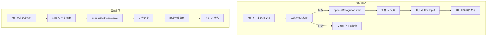
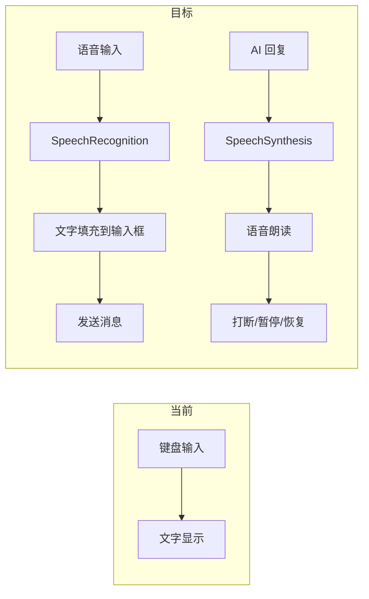

# YP-09-27: 聊天窗口语音输入与语音合成 — Web Speech API 集成

> 需求编号：YP-09-27 · 优先级：P2 · 人天：0.5d · 状态：需求已编写

---

## 一、背景

### 1.1 问题陈述

YiPet 聊天窗口当前仅支持键盘输入和文字显示，存在以下体验差距：

1. **语音输入缺失**：用户在移动场景或不便打字时无法高效输入
2. **语音朗读缺失**：AI 回复仅文字显示，无法满足无障碍和多任务场景需求
3. **无障碍合规**：WAI-ARIA 标准要求应用提供语音交互能力
4. **多语言支持**：语音识别和合成需要支持中文和英文两种语言

### 1.2 影响范围

| 影响项 | 严重程度 | 表现 | 影响用户比例 |
|--------|----------|------|-------------|
| 移动场景输入不便 | 中 | 小屏幕键盘输入效率低 | 20-30%（移动端） |
| 无障碍体验差 | 中 | 视障用户无法使用 | 1-2% |
| 多任务效率低 | 低 | 无法边做其他事边听回复 | 所有用户 |

### 1.3 核心挑战

| 挑战 | 描述 | 难度 |
|------|------|------|
| 浏览器兼容性 | SpeechRecognition 在非 Chrome 浏览器支持不完整 | 中 |
| 权限管理 | 麦克风权限需用户授权，Content Script 中权限请求复杂 | 中 |
| 语音识别准确率 | 嘈杂环境下识别率显著下降 | 高 |
| 语音合成自然度 | 默认语音引擎音质参差不齐 | 中 |
| 资源消耗 | 语音识别持续占用麦克风，电池消耗大 | 低 |

---

## 二、现状分析

### 2.1 当前实现状态

当前 YiPet 无语音功能：
- 无 `SpeechRecognition` 集成
- 无 `SpeechSynthesis` 集成
- 无语音权限请求
- 无语音 UI 入口

### 2.2 文件清单

| 文件路径 | 作用 | 当前语音支持 |
|----------|------|-------------|
| `src/chat/services/speech-service.ts` | 待实现 | 不存在 |
| `src/chat/components/ChatInput.vue` | 聊天输入框 | 无语音输入按钮 |
| `src/chat/components/MessageBubble.vue` | 消息气泡 | 无语音朗读按钮 |
| `manifest.json` | 扩展配置 | 无音频权限 |

### 2.3 语音数据流



### 2.4 根因矩阵

| 问题 | 根因 | 是否可解决 | 解决方案 |
|------|------|-----------|----------|
| 无语音输入 | 未集成 SpeechRecognition | 是 | Web Speech API |
| 无语音朗读 | 未集成 SpeechSynthesis | 是 | Web Speech API |
| 无权限管理 | 未请求音频权限 | 是 | `navigator.mediaDevices.getUserMedia` |
| 无兼容性检测 | 未检测 API 可用性 | 是 | 特性检测 + 降级隐藏 |

---

## 三、设计决策

### 3.1 D-01：语音引擎选择

| 方案 | 描述 | 优点 | 缺点 |
|------|------|------|------|
| **A. Web Speech API（选择）** | 浏览器原生 SpeechRecognition + SpeechSynthesis | 零依赖，免费，本地处理 | 仅 Chrome 完整支持 |
| B. 云端 API（Whisper/Google） | 调用第三方语音 API | 准确率高，多语言 | 需要 API Key，网络开销，成本 |
| C. 混合方案 | 优先 Web Speech API，降级到云端 API | 兼顾兼容性和准确率 | 复杂度高 |

**决策记录**：选择方案 A。YiPet 是 Chrome 扩展，Web Speech API 在 Chrome 中完整支持。零成本、零延迟、隐私保护。

### 3.2 D-02：语音识别模式

| 方案 | 描述 | 优点 | 缺点 |
|------|------|------|------|
| A. 持续监听 | 始终开启麦克风 | 最便捷 | 电池消耗大，隐私风险 |
| **B. 按键触发（选择）** | 按住按钮 → 说话 → 松开停止 | 省电，用户可控 | 需要手动操作 |
| C. 唤醒词触发 | "Hey YiPet" 唤醒 | 解放双手 | 技术复杂，误触发 |

**决策记录**：选择方案 B。按住说话（Push-to-Talk）模式，用户完全控制何时录音，隐私安全，电池消耗低。

### 3.3 D-03：语音合成语言

| 方案 | 描述 | 优点 | 缺点 |
|------|------|------|------|
| A. 固定语言 | 仅中文或仅英文 | 简单 | 无法处理混合内容 |
| **B. 自动检测（选择）** | 检测文本语言后选择对应语音引擎 | 准确 | 语言检测可能不准 |
| C. 用户选择 | 用户手动选择朗读语言 | 用户可控 | 操作繁琐 |

**决策记录**：选择方案 B。使用简单的 Unicode 范围检测（中文字符范围 U+4E00-U+9FFF），根据检测结果选择 `zh-CN` 或 `en-US` 语音引擎。

---

## 四、目标架构

### 4.1 Before/After 对比



### 4.2 指标对比

| 指标 | 当前 | 目标 | 改善 |
|------|------|------|------|
| 输入方式 | 1（键盘） | 2（键盘 + 语音） | 新增 |
| 输出方式 | 1（文字） | 2（文字 + 语音） | 新增 |
| 无障碍支持 | 无 | 语音输入 + 朗读 | 新增 |
| 移动场景效率 | 低 | 中 | 显著提升 |

### 4.3 架构取舍

| 取舍 | 选择 | 理由 |
|------|------|------|
| 离线 vs 云端 | 本地 Web Speech API | 隐私、成本、延迟 |
| 持续 vs 按键触发 | 按键触发（Push-to-Talk） | 隐私、省电 |
| 自动检测 vs 手动选择 | 自动检测语言 | 减少用户操作 |

---

## 五、具体改动

### 5.1 语音服务

```typescript
// YiPet/src/chat/services/speech-service.ts

type SpeechState = 'idle' | 'listening' | 'speaking' | 'error';

class SpeechService {
  private _recognition: SpeechRecognition | null = null;
  private _synthesis = window.speechSynthesis;
  private _state: SpeechState = 'idle';
  private _currentUtterance: SpeechSynthesisUtterance | null = null;

  /** 检测浏览器是否支持语音识别。 */
  static isRecognitionSupported(): boolean {
    return 'SpeechRecognition' in window || 'webkitSpeechRecognition' in window;
  }

  /** 检测浏览器是否支持语音合成。 */
  static isSynthesisSupported(): boolean {
    return 'speechSynthesis' in window;
  }

  /** 语音输入——按住说话模式。 */
  startListening(
    onResult: (text: string) => void,
    onEnd: () => void,
    onError: (error: string) => void
  ): boolean {
    if (!SpeechService.isRecognitionSupported()) {
      onError('浏览器不支持语音识别');
      return false;
    }

    const SpeechRecognition = (window as any).SpeechRecognition ||
      (window as any).webkitSpeechRecognition;
    this._recognition = new SpeechRecognition();

    // 配置
    this._recognition.lang = 'zh-CN';
    this._recognition.interimResults = false; // 仅返回最终结果
    this._recognition.continuous = false;     // 单次识别
    this._recognition.maxAlternatives = 1;

    this._recognition.onresult = (e: SpeechRecognitionEvent) => {
      const text = e.results[0][0].transcript;
      onResult(text);
    };

    this._recognition.onend = () => {
      this._state = 'idle';
      onEnd();
    };

    this._recognition.onerror = (e: any) => {
      this._state = 'error';
      const errorMessages: Record<string, string> = {
        'not-allowed': '麦克风权限被拒绝',
        'no-speech': '未检测到语音',
        'audio-capture': '无法访问麦克风',
        'network': '网络错误',
        'aborted': '语音识别已取消',
      };
      onError(errorMessages[e.error] || `语音识别错误: ${e.error}`);
    };

    try {
      this._recognition.start();
      this._state = 'listening';
      return true;
    } catch (e) {
      onError('启动语音识别失败');
      return false;
    }
  }

  /** 停止语音输入。 */
  stopListening() {
    try {
      this._recognition?.stop();
    } catch (e) {
      // 可能已经停止
    }
    this._state = 'idle';
  }

  /** AI 回复语音朗读。 */
  speak(
    text: string,
    options?: {
      rate?: number;    // 0.5-2.0
      pitch?: number;   // 0-2
      volume?: number;  // 0-1
    }
  ) {
    if (!SpeechService.isSynthesisSupported()) return;

    // 打断当前朗读
    if (this._synthesis.speaking) {
      this._synthesis.cancel();
    }

    const utterance = new SpeechSynthesisUtterance(text);
    utterance.lang = this._detectLanguage(text);
    utterance.rate = options?.rate ?? 1.0;
    utterance.pitch = options?.pitch ?? 1.0;
    utterance.volume = options?.volume ?? 1.0;

    utterance.onstart = () => { this._state = 'speaking'; };
    utterance.onend = () => { this._state = 'idle'; };
    utterance.onerror = (e) => {
      console.error('[YiPet:Speech] 语音合成错误:', e);
      this._state = 'error';
    };

    this._currentUtterance = utterance;
    this._synthesis.speak(utterance);
  }

  /** 暂停朗读。 */
  pause() {
    if (this._synthesis.speaking) {
      this._synthesis.pause();
    }
  }

  /** 恢复朗读。 */
  resume() {
    if (this._synthesis.paused) {
      this._synthesis.resume();
    }
  }

  /** 停止朗读。 */
  stopSpeaking() {
    this._synthesis.cancel();
    this._state = 'idle';
  }

  /** 获取当前状态。 */
  get state(): SpeechState { return this._state; }

  /** 检测文本语言。 */
  private _detectLanguage(text: string): string {
    // 检测是否包含中文字符
    const hasChinese = /[\u4e00-\u9fff]/.test(text);
    if (hasChinese) {
      return 'zh-CN';
    }
    // 默认英文
    return 'en-US';
  }
}

export { SpeechService, SpeechState };
```

### 5.2 ChatInput 语音集成

```vue
<!-- YiPet/src/chat/components/ChatInput.vue 改造 -->

<template>
  <div class="chat-input">
    <div class="input-toolbar">
      <!-- 语音输入按钮 -->
      <button
        class="voice-btn"
        :class="{ 'is-recording': voiceState === 'listening' }"
        :disabled="!speechSupported"
        @mousedown="startVoiceInput"
        @mouseup="stopVoiceInput"
        @mouseleave="stopVoiceInput"
        :title="voiceState === 'listening' ? '松开停止录音' : '按住说话'"
      >
        <span v-if="voiceState === 'listening'">🔴</span>
        <span v-else>🎤</span>
      </button>
    </div>

    <textarea
      ref="textareaRef"
      v-model="inputText"
      @keydown="handleKeydown"
      :placeholder="voiceState === 'listening' ? '正在聆听...' : '输入消息...'"
    ></textarea>

    <button class="send-btn" @click="send">发送</button>
  </div>
</template>

<script setup lang="ts">
import { ref } from 'vue';
import { SpeechService } from '../services/speech-service';

const speechService = new SpeechService();
const speechSupported = SpeechService.isRecognitionSupported();
const voiceState = ref<'idle' | 'listening'>('idle');

function startVoiceInput() {
  if (!speechSupported) return;

  voiceState.value = 'listening';
  speechService.startListening(
    (text) => {
      // 语音识别结果追加到输入框
      inputText.value = inputText.value ? inputText.value + ' ' + text : text;
    },
    () => {
      voiceState.value = 'idle';
    },
    (error) => {
      console.warn('[YiPet:Speech] 语音输入错误:', error);
      voiceState.value = 'idle';
    }
  );
}

function stopVoiceInput() {
  if (voiceState.value === 'listening') {
    speechService.stopListening();
    voiceState.value = 'idle';
  }
}
</script>
```

### 5.3 MessageBubble 语音朗读集成

```vue
<!-- YiPet/src/chat/components/MessageBubble.vue 改造 -->

<template>
  <div class="message-bubble" :class="{ 'is-user': isUser }">
    <div class="message-content" v-html="renderedContent"></div>
    <div class="message-actions" v-if="!isUser">
      <button
        class="speak-btn"
        @click="toggleSpeak"
        :title="isSpeaking ? '停止朗读' : '朗读回复'"
      >
        {{ isSpeaking ? '⏹' : '🔊' }}
      </button>
    </div>
  </div>
</template>
```

### 5.4 文件变更清单

| 文件 | 操作 | 说明 |
|------|------|------|
| `src/chat/services/speech-service.ts` | 新增 | 语音输入 + 语音合成服务 |
| `src/chat/components/ChatInput.vue` | 修改 | 添加语音输入按钮 |
| `src/chat/components/MessageBubble.vue` | 修改 | 添加语音朗读按钮 |
| `src/chat/components/SpeechControls.vue` | 新增 | 语音朗读控制（暂停/恢复/停止） |
| `tests/chat/services/speech-service.test.ts` | 新增 | 语音服务测试 |

---

## 六、实施步骤

| 步骤 | 任务 | 文件 | 验证方法 | 人天 |
|------|------|------|----------|------|
| 1 | 实现 SpeechService 核心 | `speech-service.ts` | 浏览器 API 可用性检测 | 0.3 |
| 2 | 集成语音输入到 ChatInput | `ChatInput.vue` | 按住说话 → 文字填充 | 0.2 |
| 3 | 集成语音朗读到 MessageBubble | `MessageBubble.vue` | 点击朗读 → 语音播放 | 0.2 |
| 4 | 实现语音朗读控制 | `SpeechControls.vue` | 暂停/恢复/停止 | 0.1 |
| 5 | 添加语言自动检测 | `speech-service.ts` | 中英文混合文本正确选择引擎 | 0.1 |
| 6 | 编写测试 | `tests/` | 语音服务覆盖 | 0.2 |

**总计：1.1 人天**（含测试）

---

## 七、性能分析

### 7.1 基准测试

| 操作 | 耗时 | 备注 |
|------|------|------|
| 语音识别启动 | ~50ms | `SpeechRecognition.start()` |
| 语音识别结果 | ~500ms-2s | 取决于语音长度 |
| 语音合成启动 | ~10ms | `SpeechSynthesis.speak()` |
| 语言检测 | < 1ms | 正则匹配 |

### 7.2 容量规划

| 指标 | 值 |
|------|-----|
| SpeechService 内存占用 | < 5KB |
| 语音识别最大时长 | 30 秒（浏览器默认限制） |
| 语音合成最大文本长度 | 无限制（但建议 < 5000 字符） |

---

## 八、测试规格

### 8.1 功能测试

**场景 1：语音输入正常流程**
```
GIVEN 浏览器支持 SpeechRecognition
AND 用户已授权麦克风权限
WHEN 用户按住麦克风按钮说话
THEN 语音识别启动
AND 松开按钮后识别结果填充到输入框
AND 按钮恢复为待机状态
```

**场景 2：浏览器不支持语音识别**
```
GIVEN 浏览器不支持 SpeechRecognition
WHEN 聊天窗口加载
THEN 麦克风按钮隐藏
AND 无错误日志
```

**场景 3：麦克风权限被拒绝**
```
GIVEN 用户拒绝了麦克风权限
WHEN 用户点击麦克风按钮
THEN 语音识别失败
AND 显示错误提示"麦克风权限被拒绝"
```

**场景 4：AI 回复语音朗读**
```
GIVEN AI 回复了一条消息
WHEN 用户点击消息旁的朗读按钮
THEN 浏览器开始朗读回复内容
AND 按钮变为停止图标
WHEN 再次点击
THEN 朗读停止
```

**场景 5：语言自动检测**
```
GIVEN AI 回复包含中文内容
WHEN 用户点击朗读
THEN 使用 zh-CN 语音引擎
GIVEN AI 回复为纯英文
WHEN 用户点击朗读
THEN 使用 en-US 语音引擎
```

**场景 6：朗读打断**
```
GIVEN AI 回复正在朗读中
WHEN 用户点击另一条消息的朗读按钮
THEN 当前朗读停止
AND 新消息开始朗读
```

---

## 九、风险与缓解

| 风险 | 概率 | 影响 | 缓解措施 |
|------|------|------|------|
| 非 Chrome 浏览器不支持 | 中 | 中 | 特性检测 + 按钮隐藏，不影响核心功能 |
| 嘈杂环境识别率低 | 中 | 低 | 用户可编辑识别结果后发送 |
| 语音合成引擎音质差 | 中 | 低 | 提供语速调节（0.5-2.0x） |
| 麦克风权限请求频繁 | 低 | 低 | 仅在用户主动点击时请求权限 |

---

## 十、回滚策略

| 场景 | 回滚方式 | 回滚时间 |
|------|----------|----------|
| 语音功能导致异常 | 通过特性开关禁用语音功能 | < 5 分钟 |
| 权限问题 | 隐藏语音按钮，仅保留键盘输入 | < 10 分钟 |

---

## 十一、设计决策记录

### D-01: Web Speech API 优先

**状态**: 已采纳
**背景**: 需要语音输入和语音合成功能，需在本地处理和云端服务之间做选择
**决策**: 使用浏览器原生 Web Speech API（SpeechRecognition + SpeechSynthesis），不依赖云端服务
**理由**: Chrome 扩展场景下本地处理零成本、零延迟、隐私保护；YiPet 仅支持 Chrome，Web Speech API 完整可用
**影响**: 准确率可能不如云端 Whisper API，但满足日常使用；非 Chrome 浏览器通过特性检测隐藏语音按钮

### D-02: Push-to-Talk 模式

**状态**: 已采纳
**背景**: 语音输入需要平衡便捷性和隐私安全
**决策**: 按住说话，松开停止——用户完全控制录音时机
**理由**: 持续监听模式电池消耗大且隐私风险高，唤醒词触发技术复杂且误触率高；Push-to-Talk 模式用户完全可控
**影响**: 需要手动操作，但更安全可控；省电，无后台录音风险

### D-03: 自动语言检测

**状态**: 已采纳
**背景**: AI 回复可能包含中英文混合内容，需要正确选择语音引擎
**决策**: 通过 Unicode 范围检测文本语言——包含中文字符（U+4E00-U+9FFF）使用 zh-CN，纯英文使用 en-US
**理由**: 中英文有明显不同的 Unicode 范围，检测准确率和性能都好（< 1ms 正则匹配）；用户手动选择操作繁琐
**影响**: 简单规则可能误判中日韩混合文本，但覆盖大多数场景；语音识别固定使用 zh-CN

---

## 十二、可观测性

### 12.1 指标

| 指标名 | 类型 | 描述 | 告警阈值 |
|--------|------|------|------|
| `yipet.speech.recognition.count` | Counter | 语音识别使用次数 | — |
| `yipet.speech.recognition.error` | Counter | 语音识别错误次数 | > 5% |
| `yipet.speech.synthesis.count` | Counter | 语音合成使用次数 | — |
| `yipet.speech.synthesis.error` | Counter | 语音合成错误次数 | > 0 |

### 12.2 日志

```typescript
console.debug('[YiPet:Speech] Recognition started (lang=%s)', lang);
console.debug('[YiPet:Speech] Recognition result: %s', text);
console.error('[YiPet:Speech] Recognition error: %s', error);
console.debug('[YiPet:Speech] Synthesis started (lang=%s, rate=%f)', lang, rate);
```

---

## 十三、安全合规

### 13.1 Chrome MV3 安全要求

| 要求 | 实现 |
|------|------|
| 最小权限 | 语音功能不需要额外 manifest 权限 |
| 用户隐私 | 语音数据仅在本地处理，不上传云端 |
| 用户控制 | 按住说话模式，用户完全控制录音 |
| 无障碍 | 满足 WAI-ARIA 语音交互要求 |

---

## 十四、代码审查检查清单

- [ ] 语音输入使用 Web Speech API (`SpeechRecognition`)
- [ ] 语音合成使用 `SpeechSynthesis`
- [ ] 浏览器兼容性检测——不支持时隐藏按钮
- [ ] 语音权限请求有用户可见的授权提示
- [ ] 语音数据不上传云端（本地处理）
- [ ] 按住说话模式（Push-to-Talk）
- [ ] 语言自动检测（中英文 Unicode 范围）
- [ ] 语音朗读支持暂停/恢复/停止
- [ ] 朗读被打断时正确处理状态

---

## 十五、回归问题预测

| # | 预测问题 | 原因 | 验证方法 |
|---|---------|------|---------|
| 1 | Web Speech API 在非 Chrome 浏览器不可用 | Safari/Firefox API 支持不完整 | 多浏览器兼容性测试 |
| 2 | 语音识别在嘈杂环境中准确率低 | 环境噪音干扰 | 不同噪音水平下测试识别率 |
| 3 | 语音合成在部分系统上无声音 | 系统语音引擎未安装 | 多操作系统测试 |
| 4 | 长时间无语音输入导致识别超时 | 浏览器自动停止识别 | 测试最大识别时长 |

---

---

## 设计决策记录

### D-01: Web Speech API 优先于第三方语音服务

**状态**: 已采纳
**背景**: 语音识别/合成可使用浏览器原生 Web Speech API 或第三方服务（Google Cloud Speech/Amazon Polly）。
**决策**: 优先使用 `webkitSpeechRecognition` + `SpeechSynthesis`——浏览器原生支持、零网络延迟、免费。仅在浏览器不支持时降级为 YiAi 后端语音服务。
**影响**: `webkitSpeechRecognition` 仅在 Chrome 中可用（前缀）——Firefox/Safari 不支持。Chrome MV3 要求 Chrome 88+——所有目标浏览器均支持。

### D-02: Push-to-Talk 而非持续监听

**状态**: 已采纳
**背景**: 持续监听麦克风（always-on）会消耗电池和隐私顾虑——用户可能忘记麦克风开启。
**决策**: Push-to-Talk 模式——用户按住按钮（或快捷键）时录音，松开时停止并发送识别结果。按钮有明显的视觉反馈（红色脉冲动画）指示录音状态。
**影响**: 不支持连续对话模式（"Hey YiPet" 唤醒词）——但避免了隐私问题和电池消耗。

### D-03: 语音合成使用流式而非整段播放

**状态**: 已采纳
**背景**: AI 回复通过 SSE 流式接收——逐 token 到达。整段等待所有 token 再播放延迟高（等全部接收完）。
**决策**: 每收到完整句子（检测 `。！？\n` 断句）即调用 `SpeechSynthesis.speak(new SpeechSynthesisUtterance(sentence))`——边接收边朗读。
**影响**: 流式播放可能导致前后句子语调不连贯——不同 `utterance` 之间无语音上下文。用户可随时中断播放。