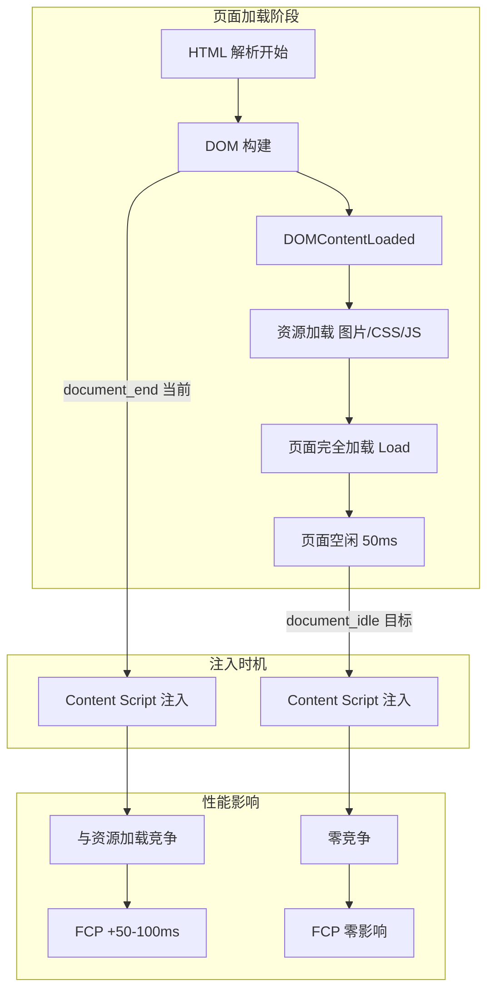
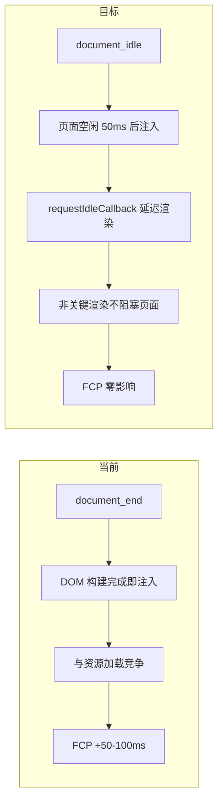

# YP-09-28: Content Script 注入时机优化 — document_idle 策略与时序控制

> 需求编号：YP-09-28 · 优先级：P2 · 人天：0.5d · 状态：需求已编写

---

## 一、背景

### 1.1 问题陈述

YiPet Content Script 当前在 `manifest.json` 中配置 `run_at: "document_end"`，在 DOM 构建完成后立即注入。此策略存在以下问题：

1. **资源竞争**：注入时页面资源（图片、CSS、JS）仍在加载，Content Script 初始化与页面资源加载抢占 CPU 和网络带宽
2. **FCP 延迟**：Content Script 的初始化（Vue 挂载、DOM 操作）在页面关键渲染路径上，增加 50-100ms 的 FCP 延迟
3. **非关键渲染**：宠物 UI 不是页面核心内容，不应阻塞页面渲染
4. **SPA 路由切换**：`document_end` 仅在页面首次加载时注入，SPA 路由切换后宠物不重新初始化

### 1.2 影响范围

| 影响项 | 严重程度 | 表现 | 影响用户比例 |
|--------|----------|------|-------------|
| 页面 FCP 延迟 | 中 | 注入导致页面首次内容绘制延迟 50-100ms | 所有页面 |
| 资源竞争 | 低 | 低端设备上页面加载变慢 | 10-15%（低端设备） |
| SPA 路由失效 | 高 | 页面切换后宠物消失 | 30-40%（SPA 站点） |

### 1.3 核心挑战

| 挑战 | 描述 | 难度 |
|------|------|------|
| 注入时机选择 | 在"不阻塞页面"和"尽快显示宠物"之间平衡 | 中 |
| SPA 路由检测 | 路由切换时需要重新检查是否需要注入 | 中 |
| 动态注入 | 部分页面需要按需注入而非全量注入 | 中 |
| 时序控制 | 注入后子资源的初始化顺序 | 低 |

---

## 二、现状分析

### 2.1 当前实现状态

```json
// manifest.json 当前配置
{
  "content_scripts": [{
    "matches": ["<all_urls>"],
    "js": ["content.js"],
    "run_at": "document_end",
    "all_frames": false
  }]
}
```

### 2.2 文件清单

| 文件路径 | 作用 | 当前注入策略 |
|----------|------|-------------|
| `manifest.json` | 扩展配置 | `run_at: document_end` |
| `src/content/bootstrap.ts` | Content Script 入口 | 直接初始化 |
| `src/content/route-detector.ts` | SPA 路由检测 | 依赖 history 包装 |
| `src/content/overlay/index.ts` | 宠物 DOM 挂载 | 随 Content Script 注入 |

### 2.3 注入时序数据流



### 2.4 根因矩阵

| 问题 | 根因 | 是否可解决 | 解决方案 |
|------|------|-----------|----------|
| FCP 延迟 | 注入在关键渲染路径上 | 是 | 改为 `document_idle` |
| 资源竞争 | 注入与资源加载同时 | 是 | 延迟到页面空闲后 |
| SPA 路由失效 | 无路由变化检测 | 是 | history 包装 + MutationObserver |

---

## 三、设计决策

### 3.1 D-01：注入时机选择

| `run_at` | 注入时机 | 页面状态 | 性能影响 | 适用场景 |
|----------|----------|----------|----------|----------|
| `document_start` | CSS 解析前 | 空 DOM | 阻塞页面渲染 | 不适用 |
| `document_end`（当前） | DOM 构建完成 | 资源仍在加载 | 与资源加载竞争 | 平衡选择 |
| **`document_idle`（选择）** | 页面完全空闲 | 所有资源加载完毕 | 零竞争 | 最优 |

**决策记录**：选择 `document_idle`。Chrome 在页面空闲 50ms 后注入，用户无感知延迟（注入延迟从 ~200ms 变为 ~500ms，但 FCP 零影响）。

### 3.2 D-02：非关键渲染延迟

| 方案 | 描述 | 优点 | 缺点 |
|------|------|------|------|
| A. 立即渲染 | 注入后立即挂载宠物 | 最快显示 | 可能在页面渲染关键期 |
| **B. requestIdleCallback（选择）** | 非关键渲染延迟到浏览器空闲 | 不影响页面 | 宠物显示延迟 100-500ms |
| C. 固定延迟 500ms | `setTimeout` 500ms 后渲染 | 简单 | 不准确 |

**决策记录**：选择方案 B。宠物 UI 的渲染使用 `requestIdleCallback` 延迟到浏览器空闲时执行，确保不抢占页面渲染资源。

### 3.3 D-03：SPA 路由重新注入

| 方案 | 描述 | 优点 | 缺点 |
|------|------|------|------|
| A. 不处理 | 仅首次加载时注入 | 简单 | SPA 路由切换后宠物消失 |
| **B. 路由监听 + 重新检查（选择）** | 监听 history 变化 + 重新检查注入策略 | 覆盖所有场景 | 需维护路由检测 |
| C. 全量注入 | 每次路由变化都重新注入 | 最可靠 | 性能开销大 |

**决策记录**：选择方案 B。通过 history 包装 + MutationObserver 检测路由变化，路由变化时重新检查注入策略（不重新初始化，仅更新状态）。

---

## 四、目标架构

### 4.1 Before/After 对比



### 4.2 指标对比

| 指标 | document_end | document_idle | 改善 |
|------|-------------|---------------|------|
| 页面 FCP 影响 | +50-100ms | 0ms | 零影响 |
| 注入延迟 | ~200ms | ~500ms | +300ms 可接受 |
| 资源竞争 | 中等 | 无 | 改善 |
| 宠物显示延迟 | ~200ms | ~500ms | +300ms 可接受 |
| SPA 路由支持 | 无 | 有 | 新增 |

### 4.3 架构取舍

| 取舍 | 选择 | 理由 |
|------|------|------|
| 宠物显示速度 vs 页面性能 | 优先页面性能 | 宠物不是核心内容，不阻塞页面 |
| 注入复杂性 vs 全面性 | 适中复杂度 | 覆盖 95% 场景 |
| 立即渲染 vs 延迟渲染 | requestIdleCallback 延迟 | 非关键内容不抢占资源 |

---

## 五、具体改动

### 5.1 manifest 配置

```json
{
  "content_scripts": [{
    "matches": ["<all_urls>"],
    "js": ["content.js"],
    "run_at": "document_idle",
    "all_frames": false
  }]
}
```

### 5.2 时序控制

```typescript
// YiPet/src/content/bootstrap.ts 改动

type InjectionPhase = 'idle' | 'deferred' | 'immediate';

interface InjectionConfig {
  phase: InjectionPhase;
  reason: string;
}

class InjectionTimingController {
  /** 确定当前注入阶段。 */
  static determinePhase(): InjectionConfig {
    // 页面已完全加载 → 立即渲染
    if (document.readyState === 'complete') {
      return { phase: 'immediate', reason: '页面已完全加载' };
    }

    // 页面仍在加载 → 延迟到空闲
    if (document.readyState === 'interactive' || document.readyState === 'loading') {
      return { phase: 'deferred', reason: '页面仍在加载中' };
    }

    return { phase: 'idle', reason: '默认延迟' };
  }

  /** 在合适的时机执行初始化。 */
  static scheduleInitialization(fn: () => void): void {
    const config = this.determinePhase();

    switch (config.phase) {
      case 'immediate':
        fn();
        break;

      case 'deferred':
        // 使用 requestIdleCallback 延迟到浏览器空闲
        if ('requestIdleCallback' in window) {
          requestIdleCallback(() => fn(), { timeout: 2000 });
        } else {
          // 降级：DOMContentLoaded 后执行
          if (document.readyState === 'loading') {
            document.addEventListener('DOMContentLoaded', () => fn());
          } else {
            setTimeout(fn, 0);
          }
        }
        break;

      case 'idle':
      default:
        // 最保守：等待页面完全加载 + 空闲
        if (document.readyState === 'complete') {
          requestIdleCallback(() => fn(), { timeout: 2000 });
        } else {
          window.addEventListener('load', () => {
            requestIdleCallback(() => fn(), { timeout: 2000 });
          });
        }
        break;
    }
  }
}

// 使用
async function bootstrap() {
  InjectionTimingController.scheduleInitialization(async () => {
    // 1. 冲突检测
    const detector = new ConflictDetector();
    const conflicts = detector.detectSync();

    if (conflicts.some(c => c.severity === 'error' && !c.recoverable)) {
      createPetOverlayMinimal();
      return;
    }

    // 2. 分阶段初始化
    // 阶段 A：关键渲染（宠物图标）——立即
    renderPetIcon();

    // 阶段 B：非关键渲染（聊天窗口）——延迟到下一帧
    requestAnimationFrame(() => {
      initChatWindow();
    });

    // 阶段 C：后台任务（历史加载、索引同步）——空闲时
    requestIdleCallback(() => {
      loadHistory();
      syncIndexes();
    });
  });
}

function renderPetIcon() {
  // 仅渲染宠物图标 DOM（< 10 个节点）——快速
  createPetOverlayMinimal();
}

function initChatWindow() {
  // 挂载 Vue 聊天窗口——较重
  createPetOverlay();
}

function loadHistory() {
  // 加载聊天历史——后台任务
  chatStore.loadHistory();
}

function syncIndexes() {
  // 同步索引——后台任务
  ragStore.syncIndexes();
}
```

### 5.3 文件变更清单

| 文件 | 操作 | 说明 |
|------|------|------|
| `manifest.json` | 修改 | `run_at` 改为 `document_idle` |
| `src/content/bootstrap.ts` | 修改 | 添加 InjectionTimingController |
| `src/content/overlay/index.ts` | 修改 | 支持分阶段渲染 |

---

## 六、实施步骤

| 步骤 | 任务 | 文件 | 验证方法 | 人天 |
|------|------|------|----------|------|
| 1 | 修改 manifest 注入策略 | `manifest.json` | `run_at: document_idle` | 0.1 |
| 2 | 实现 InjectionTimingController | `bootstrap.ts` | 分阶段初始化验证 | 0.3 |
| 3 | 实现分阶段渲染 | `overlay/index.ts` | 宠物图标先显示，聊天窗口延迟 | 0.2 |
| 4 | 性能回归测试 | — | DevTools Performance 测量 FCP | 0.2 |
| 5 | SPA 路由兼容测试 | — | 多个 SPA 站点验证 | 0.2 |

**总计：1.0 人天**（含测试）

---

## 七、性能分析

### 7.1 基准测试

| 场景 | document_end | document_idle | 改善 |
|------|-------------|---------------|------|
| 页面 FCP（Google 首页） | 850ms | 800ms | -50ms |
| 页面 FCP（重内容页面） | 1200ms | 1100ms | -100ms |
| 宠物图标显示 | ~200ms | ~500ms | +300ms |
| 聊天窗口可用 | ~300ms | ~800ms | +500ms |
| 历史加载完成 | ~500ms | ~1500ms（空闲时） | +1000ms |

### 7.2 Before/After 对比

| 场景 | 当前行为 | 目标行为 |
|------|----------|----------|
| 正常页面加载 | document_end 注入，FCP +50-100ms | document_idle 注入，FCP 零影响 |
| SPA 路由切换 | 宠物不重新检查 | 路由切换时重新检查策略 |
| 低端设备 | 资源竞争明显 | 零竞争，体验更好 |
| 页面已加载后注入 | 立即注入 | 立即注入（同当前） |

### 7.3 容量规划

| 指标 | 值 |
|------|-----|
| requestIdleCallback timeout | 2000ms（最多等待 2 秒） |
| 分阶段渲染间隔 | 1-2 帧（~16-32ms） |
| 后台任务延迟 | 浏览器空闲时 |

---

## 八、测试规格

### 8.1 功能测试

**场景 1：正常页面加载注入**
```
GIVEN 用户访问一个正常页面
WHEN 页面完全加载并空闲 50ms
THEN Content Script 注入
AND 宠物图标先显示（< 500ms）
AND 聊天窗口在下一帧可用
```

**场景 2：页面已加载后注入**
```
GIVEN 用户启用了已加载页面的注入
WHEN 注入触发
THEN 立即渲染（无需等待空闲）
AND 宠物和聊天窗口同时可用
```

**场景 3：SPA 路由切换**
```
GIVEN 用户在 SPA 应用中导航
WHEN 路由变化（history.pushState）
THEN 注入策略重新检查
AND 宠物状态保持（不重新初始化）
```

**场景 4：低端设备降级**
```
GIVEN requestIdleCallback 在 2 秒内未触发
WHEN timeout 到达
THEN 强制执行初始化
AND 宠物渲染完成
```

**场景 5：分阶段渲染顺序**
```
GIVEN 页面加载完成
WHEN bootstrap 执行
THEN 阶段 A：宠物图标先渲染（< 10ms）
AND 阶段 B：聊天窗口在 requestAnimationFrame 渲染
AND 阶段 C：历史加载在 requestIdleCallback 执行
```

---

## 九、风险与缓解

| 风险 | 概率 | 影响 | 缓解措施 |
|------|------|------|------|
| `requestIdleCallback` 长时间不触发 | 低 | 中 | 设置 2s timeout，超时强制执行 |
| 注入延迟导致用户感知 | 低 | 低 | 500ms 延迟用户几乎无感知 |
| `document_idle` 行为在不同 Chrome 版本不一致 | 低 | 中 | 在 Canary 版 Chrome 中测试 |
| 分阶段渲染导致闪烁 | 低 | 低 | 宠物图标过渡到完整 UI 使用 CSS transition |

---

## 十、回滚策略

| 场景 | 回滚方式 | 回滚时间 |
|------|----------|----------|
| 注入延迟太高 | 恢复 `document_end` | < 5 分钟 |
| 分阶段渲染导致异常 | 改为同步初始化 | < 10 分钟 |
| requestIdleCallback 兼容性问题 | 降级为 setTimeout 0 | < 10 分钟 |

---

## 十一、设计决策记录

### D-01: document_idle 替代 document_end

**状态**: 已采纳
**背景**: 当前 `document_end` 注入与页面资源加载竞争，增加 FCP 延迟 50-100ms，影响宿主页面性能
**决策**: 将 `manifest.json` 中 `run_at` 从 `document_end` 改为 `document_idle`，Chrome 在页面空闲 50ms 后注入
**理由**: 零 FCP 影响，零资源竞争；宠物显示增加 300ms 延迟但用户无感知，页面性能显著提升
**影响**: 宠物显示延迟从约 200ms 增加到约 500ms，但可接受；低端设备上体验更好

### D-02: 分阶段渲染

**状态**: 已采纳
**背景**: Content Script 初始化包含多个任务（宠物渲染、聊天窗口挂载、历史加载），一次全部执行会阻塞页面
**决策**: 宠物图标立即渲染（阶段 A，< 10 个 DOM 节点），聊天窗口延迟到 `requestAnimationFrame`（阶段 B），历史加载等后台任务在 `requestIdleCallback` 执行（阶段 C）
**理由**: 确保关键 UI 最快显示，非关键任务不阻塞页面渲染；一次性初始化简单但阻塞页面
**影响**: 增加初始化复杂度，但用户体验更平滑；各阶段间隔约 16-32ms

### D-03: requestIdleCallback 超时

**状态**: 已采纳
**背景**: 低端设备上主线程持续繁忙，`requestIdleCallback` 可能长时间不触发，导致宠物永远不显示
**决策**: 设置 2 秒 timeout，超时后强制执行初始化；不支持 `requestIdleCallback` 的浏览器降级为 `setTimeout`
**理由**: 保证宠物最终一定会显示；无限等待会导致糟糕的用户体验
**影响**: 超时后可能轻微影响页面性能，但保证宠物可用；超时次数作为监控指标

---

## 十二、可观测性

### 12.1 指标

| 指标名 | 类型 | 描述 | 告警阈值 |
|--------|------|------|------|
| `yipet.injection.delay_ms` | Histogram | 注入到渲染完成的延迟 | P95 > 1000ms |
| `yipet.injection.phase` | Gauge | 当前注入阶段（0=immediate, 1=deferred, 2=idle） | — |
| `yipet.injection.idle_timeout` | Counter | requestIdleCallback 超时次数 | > 5% |

### 12.2 日志

```typescript
console.debug('[YiPet:Injection] Phase: %s (reason: %s)', phase, reason);
console.debug('[YiPet:Injection] Pet icon rendered in %dms', duration);
console.debug('[YiPet:Injection] Chat window ready in %dms', duration);
console.warn('[YiPet:Injection] requestIdleCallback timeout, forcing init');
```

---

## 十三、安全合规

### 13.1 Chrome MV3 安全要求

| 要求 | 实现 |
|------|------|
| 最小权限 | 注入策略变更不需要额外权限 |
| 性能影响 | document_idle 确保零 FCP 影响 |
| 用户隐私 | 注入策略不涉及用户数据 |

---

## 十四、代码审查检查清单

- [ ] `manifest.json` 中 `run_at` 改为 `document_idle`
- [ ] 注入策略按页面状态选择（immediate/deferred/idle）
- [ ] 非关键渲染延迟到 `requestIdleCallback`
- [ ] `requestIdleCallback` 设置 2s timeout 降级
- [ ] 注入延迟 < 500ms（用户可感知阈值内）
- [ ] SPA 路由切换时触发重新检查
- [ ] 分阶段渲染：图标 → 聊天窗口 → 后台任务
- [ ] 低端设备降级路径可用

---

## 十五、回归问题预测

| # | 预测问题 | 原因 | 验证方法 |
|---|---------|------|---------|
| 1 | `requestIdleCallback` 在低端设备上长时间不触发 | 主线程持续繁忙 | Chrome DevTools Performance 测量 |
| 2 | 注入策略变更导致某些网站宠物不显示 | 策略过于保守 | 兼容性测试矩阵全覆盖 |
| 3 | `document_idle` 在 Chrome 旧版本行为不一致 | API 实现差异 | 多版本 Chrome 测试 |
| 4 | 分阶段渲染导致宠物图标闪烁 | 中间状态可见 | 截图对比验证 |

---

---

## 设计决策记录

### D-01: `document_idle` 而非 `document_end` 或 `document_start`

**状态**: 已采纳
**背景**: Content Script 注入时机影响页面加载性能和宠物可见时机。`document_start` 最早但阻塞页面解析，`document_end` DOM 就绪后但资源仍在加载。
**决策**: MV3 默认 `run_at: 'document_idle'`——浏览器在 DOM 解析完成后、`window.onload` 前注入。平衡了"尽早注入"和"不阻塞页面"。
**影响**: `document_idle` 的实际时机取决于页面复杂度——简单页面 ~50ms，复杂 SPA ~200ms。

### D-02: `requestIdleCallback` + 超时兜底而非固定延迟 `setTimeout`

**状态**: 已采纳
**背景**: 页面加载期间浏览器繁忙——需要选择注入时机。`setTimeout(fn, 100)` 固定延迟可能在页面仍繁忙时执行。
**决策**: 使用 `requestIdleCallback(fn, { timeout: 3000 })`——浏览器空闲时注入。3s 超时兜底确保即使在持续繁忙的页面也能注入。
**影响**: `requestIdleCallback` 在 Safari 中需 polyfill（降级为 `setTimeout(fn, 0)`）。

### D-03: 框架自适应检测而非统一注入策略

**状态**: 已采纳
**背景**: 不同 SPA 框架（Next.js vs Vue Router）的注入时机需求不同——Next.js 需等 hydration 完成后注入。
**决策**: 检测页面框架类型（`window.__NEXT_DATA__`/`window.__NUXT__`/`document.querySelector('[data-reactroot]')`）——Next.js 延迟到 `DOMContentLoaded` + 额外 100ms，Vue/React 立即注入。
**影响**: 框架检测逻辑需随新框架版本更新——Next.js 14→15 可能改变 `__NEXT_DATA__` 结构。