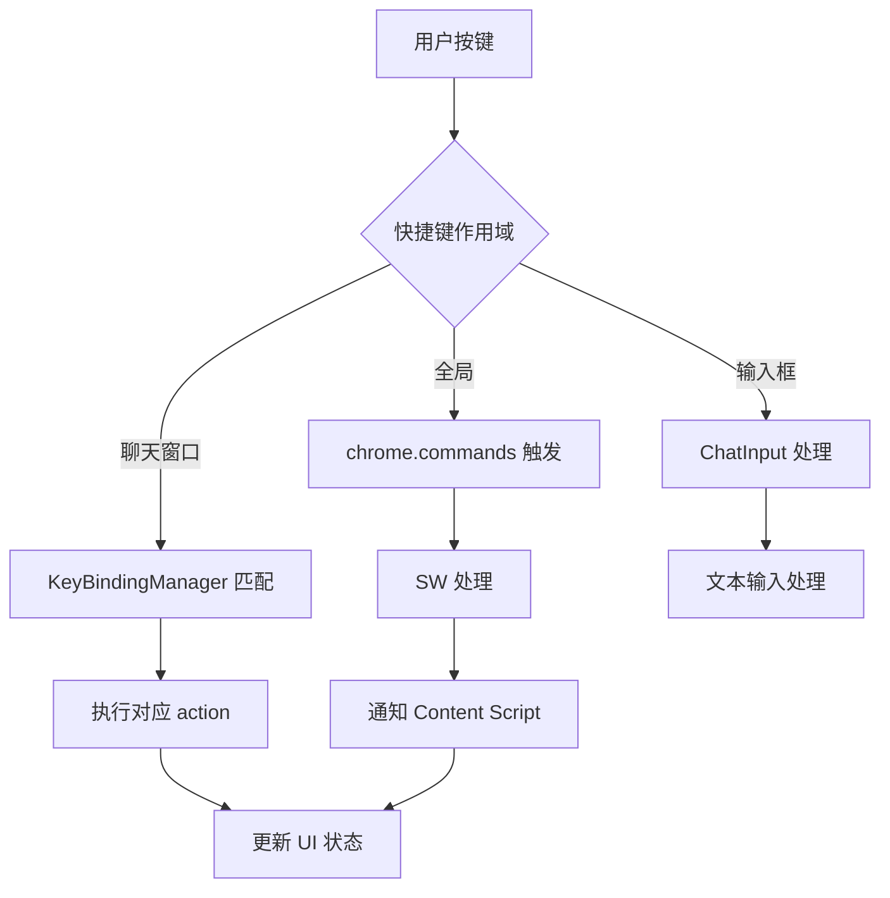
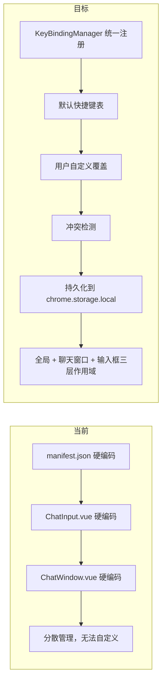

# YP-09-29: 聊天窗口快捷键系统 — 全局可配置键盘映射

> 需求编号：YP-09-29 · 优先级：P2 · 人天：0.5d · 状态：需求已编写

---

## 一、背景

### 1.1 问题陈述

YiPet 快捷键分布在多个位置，各自硬编码，用户无法自定义：

1. **全局快捷键**：`chrome.commands` API 注册的 `toggle-pet` 和 `open-chat`，在 `manifest.json` 中硬编码
2. **聊天窗口快捷键**：`Enter` 发送、`Ctrl+N` 新建会话等，在 Vue 组件中硬编码
3. **无统一注册**：快捷键分散在 3-4 个文件中，难以维护和审计
4. **无冲突检测**：用户自定义快捷键可能与页面快捷键冲突
5. **无用户自定义**：用户无法修改任何快捷键

### 1.2 影响范围

| 影响项 | 严重程度 | 表现 | 影响用户比例 |
|--------|----------|------|-------------|
| 快捷键冲突 | 中 | 与页面/浏览器快捷键冲突导致功能失效 | 10-15% |
| 无法自定义 | 中 | 用户习惯的快捷键无法使用 | 30% |
| 维护困难 | 低 | 快捷键分散在多个文件 | 开发者 |

### 1.3 核心挑战

| 挑战 | 描述 | 难度 |
|------|------|------|
| 全局与局部快捷键协调 | `chrome.commands` 全局快捷键与聊天窗口内快捷键作用域不同 | 中 |
| 冲突检测 | 检测用户自定义快捷键之间的冲突 | 低 |
| 快捷键解析 | 解析 `Ctrl+Shift+K` 格式的快捷键字符串 | 中 |
| 作用域管理 | 全局快捷键 vs 聊天窗口快捷键 vs 输入框快捷键 | 中 |

---

## 二、现状分析

### 2.1 当前快捷键分布

| 快捷键 | 作用域 | 注册位置 | 硬编码 |
|--------|--------|----------|--------|
| `Ctrl+Shift+P` | 全局 | `manifest.json` chrome.commands | 是 |
| `Ctrl+Shift+X` | 全局 | `manifest.json` chrome.commands | 是 |
| `Enter` | 聊天窗口 | `ChatInput.vue` | 是 |
| `Shift+Enter` | 聊天窗口 | `ChatInput.vue` | 是 |
| `Escape` | 聊天窗口 | `ChatWindow.vue` | 是 |

### 2.2 文件清单

| 文件路径 | 作用 | 快捷键相关 |
|----------|------|-----------|
| `manifest.json` | 扩展配置 | `commands` 全局快捷键 |
| `src/chat/components/ChatInput.vue` | 输入框 | Enter 发送, Shift+Enter 换行 |
| `src/chat/components/ChatWindow.vue` | 聊天窗口 | Escape 关闭 |
| `src/shared/keybindings.ts` | 待实现 | 不存在 |

### 2.3 快捷键数据流



### 2.4 根因矩阵

| 问题 | 根因 | 是否可解决 | 解决方案 |
|------|------|-----------|----------|
| 快捷键分散 | 无统一注册中心 | 是 | KeyBindingManager 统一管理 |
| 无法自定义 | 无用户配置存储 | 是 | `chrome.storage.local` 存储自定义映射 |
| 冲突检测 | 无冲突检测逻辑 | 是 | 注册时检测重复快捷键 |

---

## 三、设计决策

### 3.1 D-01：快捷键注册方式

| 方案 | 描述 | 优点 | 缺点 |
|------|------|------|------|
| **A. 声明式注册表（选择）** | 集中定义所有快捷键，运行时注册 | 可审计，易维护 | 需手动维护列表 |
| B. 装饰器注册 | 使用 decorator 标注快捷键处理函数 | 自动发现 | 增加复杂度 |
| C. 分散注册 | 各组件自行注册 | 简单 | 难以审计和维护 |

**决策记录**：选择方案 A。集中定义所有快捷键，KeyBindingManager 统一管理注册、冲突检测和持久化。

### 3.2 D-02：全局快捷键策略

| 方案 | 描述 | 优点 | 缺点 |
|------|------|------|------|
| A. 仅 chrome.commands | 全用 `chrome.commands` API | 系统级快捷键 | 最多 4 个，不可动态修改 |
| **B. chrome.commands + 自定义（选择）** | 核心快捷键用 chrome.commands，其余用自定义 | 灵活 | 需区分两种注册方式 |
| C. 全部自定义 | 不用 chrome.commands | 完全灵活 | 可能与页面快捷键冲突 |

**决策记录**：选择方案 B。`toggle-pet` 和 `open-chat` 使用 `chrome.commands`（系统级优先），聊天窗口内快捷键使用自定义 keydown 监听。

### 3.3 D-03：快捷键冲突处理

| 方案 | 描述 | 优点 | 缺点 |
|------|------|------|------|
| A. 静默覆盖 | 后注册的覆盖先注册的 | 简单 | 用户不知情 |
| **B. 冲突检测 + 提示（选择）** | 检测冲突并提示用户 | 用户可控 | 需额外 UI |
| C. 禁止冲突 | 注册时禁止冲突快捷键 | 严格 | 用户可能无法使用习惯的快捷键 |

**决策记录**：选择方案 B。注册时检测冲突，提示用户选择保留哪个或修改其中一个。

---

## 四、目标架构

### 4.1 Before/After 对比



### 4.2 指标对比

| 指标 | 当前 | 目标 | 改善 |
|------|------|------|------|
| 快捷键管理方式 | 分散硬编码 | 集中注册表 | 可维护 |
| 用户自定义 | 不支持 | 支持 | 新增 |
| 冲突检测 | 无 | 自动检测 | 新增 |
| 持久化 | 无 | chrome.storage.local | 新增 |
| 快捷键数量 | 5 | 10+ | 扩展 |

### 4.3 架构取舍

| 取舍 | 选择 | 理由 |
|------|------|------|
| 灵活 vs 简单 | 适中的灵活度 | 支持自定义但保持默认值 |
| 全局 vs 局部 | 三层作用域 | 全局/聊天窗口/输入框各有不同需求 |

---

## 五、具体改动

### 5.1 快捷键注册表

```typescript
// YiPet/src/shared/keybindings.ts

type ShortcutAction =
  | 'toggle-pet'
  | 'open-chat'
  | 'focus-input'
  | 'send-message'
  | 'new-session'
  | 'toggle-sidebar'
  | 'toggle-theme'
  | 'export-session'
  | 'zoom-in'
  | 'zoom-out'
  | 'close-chat'
  | 'search-messages';

type ShortcutScope = 'global' | 'chat' | 'input';

interface KeyBinding {
  action: ShortcutAction;
  defaultKeys: string;
  scope: ShortcutScope;
  description: string;
  allowCustom: boolean; // 是否允许用户自定义
}

const DEFAULT_KEYBINDINGS: KeyBinding[] = [
  {
    action: 'toggle-pet',
    defaultKeys: 'Ctrl+Shift+P',
    scope: 'global',
    description: '显示/隐藏宠物',
    allowCustom: true,
  },
  {
    action: 'open-chat',
    defaultKeys: 'Ctrl+Shift+X',
    scope: 'global',
    description: '打开聊天窗口',
    allowCustom: true,
  },
  {
    action: 'focus-input',
    defaultKeys: 'Ctrl+I',
    scope: 'chat',
    description: '聚焦输入框',
    allowCustom: true,
  },
  {
    action: 'send-message',
    defaultKeys: 'Enter',
    scope: 'input',
    description: '发送消息',
    allowCustom: false, // 核心功能不允许修改
  },
  {
    action: 'new-line',
    defaultKeys: 'Shift+Enter',
    scope: 'input',
    description: '换行',
    allowCustom: false,
  },
  {
    action: 'new-session',
    defaultKeys: 'Ctrl+N',
    scope: 'chat',
    description: '新建会话',
    allowCustom: true,
  },
  {
    action: 'toggle-sidebar',
    defaultKeys: 'Ctrl+B',
    scope: 'chat',
    description: '切换侧边栏',
    allowCustom: true,
  },
  {
    action: 'toggle-theme',
    defaultKeys: 'Ctrl+Shift+T',
    scope: 'chat',
    description: '循环主题',
    allowCustom: true,
  },
  {
    action: 'export-session',
    defaultKeys: 'Ctrl+E',
    scope: 'chat',
    description: '导出会话',
    allowCustom: true,
  },
  {
    action: 'close-chat',
    defaultKeys: 'Escape',
    scope: 'chat',
    description: '关闭聊天窗口',
    allowCustom: true,
  },
  {
    action: 'search-messages',
    defaultKeys: 'Ctrl+F',
    scope: 'chat',
    description: '搜索消息',
    allowCustom: true,
  },
  {
    action: 'zoom-in',
    defaultKeys: 'Ctrl+=',
    scope: 'chat',
    description: '放大字体',
    allowCustom: true,
  },
  {
    action: 'zoom-out',
    defaultKeys: 'Ctrl+-',
    scope: 'chat',
    description: '缩小字体',
    allowCustom: true,
  },
];

class KeyBindingManager {
  private _bindings: Map<ShortcutAction, string> = new Map();
  private _reverseMap: Map<string, ShortcutAction> = new Map();
  private _actionHandlers: Map<ShortcutAction, () => void> = new Map();

  async init() {
    // 加载默认值
    for (const binding of DEFAULT_KEYBINDINGS) {
      this._bindings.set(binding.action, binding.defaultKeys);
    }

    // 加载用户自定义
    const result = await chrome.storage.local.get('yipet:keybindings');
    const custom = result['yipet:keybindings'] ?? {};
    for (const [action, keys] of Object.entries(custom)) {
      if (this._bindings.has(action as ShortcutAction)) {
        const binding = DEFAULT_KEYBINDINGS.find(b => b.action === action);
        if (binding?.allowCustom) {
          this._bindings.set(action as ShortcutAction, keys as string);
        }
      }
    }

    this._rebuildReverseMap();
  }

  /** 注册 action 处理函数。 */
  registerHandler(action: ShortcutAction, handler: () => void) {
    this._actionHandlers.set(action, handler);
  }

  /** 处理按键事件。 */
  handleKeyEvent(e: KeyboardEvent, scope: ShortcutScope): boolean {
    const keys = this._serializeKeyEvent(e);
    const action = this._reverseMap.get(keys);

    if (!action) return false;

    // 检查作用域
    const binding = DEFAULT_KEYBINDINGS.find(b => b.action === action);
    if (!binding || binding.scope !== scope) return false;

    // 执行处理函数
    const handler = this._actionHandlers.get(action);
    if (handler) {
      e.preventDefault();
      handler();
      return true;
    }

    return false;
  }

  /** 用户自定义快捷键。 */
  async customize(action: ShortcutAction, keys: string): Promise<{
    success: boolean;
    conflict?: ShortcutAction;
  }> {
    const binding = DEFAULT_KEYBINDINGS.find(b => b.action === action);
    if (!binding || !binding.allowCustom) {
      return { success: false };
    }

    // 冲突检测
    const existing = this._reverseMap.get(keys);
    if (existing && existing !== action) {
      return { success: false, conflict: existing };
    }

    this._bindings.set(action, keys);
    this._rebuildReverseMap();

    // 持久化
    const custom = Object.fromEntries(this._bindings);
    await chrome.storage.local.set({ 'yipet:keybindings': custom });

    return { success: true };
  }

  /** 重置为默认。 */
  async resetDefaults() {
    for (const binding of DEFAULT_KEYBINDINGS) {
      this._bindings.set(binding.action, binding.defaultKeys);
    }
    this._rebuildReverseMap();
    await chrome.storage.local.remove('yipet:keybindings');
  }

  /** 获取所有快捷键绑定。 */
  getAllBindings(): Array<KeyBinding & { currentKeys: string }> {
    return DEFAULT_KEYBINDINGS.map(b => ({
      ...b,
      currentKeys: this._bindings.get(b.action) ?? b.defaultKeys,
    }));
  }

  /** 检测冲突。 */
  detectConflicts(): Array<{ keys: string; actions: ShortcutAction[] }> {
    const reverse = new Map<string, ShortcutAction[]>();
    for (const [action, keys] of this._bindings) {
      if (!reverse.has(keys)) reverse.set(keys, []);
      reverse.get(keys)!.push(action);
    }
    return [...reverse.entries()]
      .filter(([_, actions]) => actions.length > 1)
      .map(([keys, actions]) => ({ keys, actions }));
  }

  private _rebuildReverseMap() {
    this._reverseMap.clear();
    for (const [action, keys] of this._bindings) {
      this._reverseMap.set(keys, action);
    }
  }

  private _serializeKeyEvent(e: KeyboardEvent): string {
    const parts: string[] = [];
    if (e.ctrlKey || e.metaKey) parts.push('Ctrl');
    if (e.shiftKey) parts.push('Shift');
    if (e.altKey) parts.push('Alt');

    // 特殊键名处理
    const key = e.key === ' ' ? 'Space' : e.key.length === 1 ? e.key.toUpperCase() : e.key;
    if (!['Control', 'Shift', 'Alt', 'Meta'].includes(e.key)) {
      parts.push(key);
    }

    return parts.join('+');
  }
}

export { KeyBindingManager, ShortcutAction, ShortcutScope, DEFAULT_KEYBINDINGS };
```

### 5.2 聊天窗口集成

```typescript
// YiPet/src/chat/components/ChatWindow.vue 改动

import { KeyBindingManager } from '../../shared/keybindings';

const keybindings = new KeyBindingManager();

// 注册 action 处理函数
keybindings.registerHandler('toggle-sidebar', () => sidebarStore.toggle());
keybindings.registerHandler('toggle-theme', () => themeService.toggle());
keybindings.registerHandler('new-session', () => sessionStore.create());
keybindings.registerHandler('close-chat', () => chatWindow.close());
keybindings.registerHandler('export-session', () => exportService.exportCurrent());
// ... 等

// 全局 keydown 监听
document.addEventListener('keydown', (e) => {
  keybindings.handleKeyEvent(e, 'chat');
});
```

### 5.3 文件变更清单

| 文件 | 操作 | 说明 |
|------|------|------|
| `src/shared/keybindings.ts` | 新增 | 快捷键注册表 + KeyBindingManager |
| `src/chat/components/ChatWindow.vue` | 修改 | 集成 KeyBindingManager |
| `src/chat/components/ChatInput.vue` | 修改 | 使用 KeyBindingManager 处理输入框快捷键 |
| `src/popup/components/ShortcutSettings.vue` | 新增 | 快捷键设置页面 |
| `tests/shared/keybindings.test.ts` | 新增 | 快捷键测试 |

---

## 六、实施步骤

| 步骤 | 任务 | 文件 | 验证方法 | 人天 |
|------|------|------|----------|------|
| 1 | 实现 KeyBindingManager 核心 | `keybindings.ts` | 单元测试（注册、冲突检测） | 0.3 |
| 2 | 集成到聊天窗口 | `ChatWindow.vue` | 所有快捷键可用 | 0.2 |
| 3 | 集成到输入框 | `ChatInput.vue` | Enter/Shift+Enter 正确 | 0.1 |
| 4 | 实现快捷键设置页面 | `ShortcutSettings.vue` | 自定义 → 保存 → 生效 | 0.2 |
| 5 | 编写测试 | `tests/` | 覆盖所有 action | 0.2 |

**总计：1.0 人天**（含测试）

---

## 七、性能分析

### 7.1 基准测试

| 操作 | 耗时 | 备注 |
|------|------|------|
| 按键匹配 | < 0.5ms | Map 查找 |
| 冲突检测 | < 1ms | 遍历 13 个绑定 |
| 初始化加载 | < 10ms | 读取 chrome.storage.local |
| 自定义保存 | < 5ms | 写入 chrome.storage.local |

### 7.2 容量规划

| 指标 | 值 |
|------|-----|
| 快捷键数量 | 13 个（可扩展） |
| 自定义存储大小 | < 500 bytes |
| keydown 事件处理频率 | 每按键一次 |

---

## 八、测试规格

### 8.1 功能测试

**场景 1：默认快捷键触发**
```
GIVEN KeyBindingManager 已初始化
WHEN 用户在聊天窗口按下 Ctrl+B
THEN 侧边栏切换
AND 事件被 preventDefault
```

**场景 2：用户自定义快捷键**
```
GIVEN 用户将 toggle-sidebar 自定义为 Ctrl+Shift+S
WHEN 用户按下 Ctrl+Shift+S
THEN 侧边栏切换
AND 原 Ctrl+B 不再触发
```

**场景 3：冲突检测**
```
GIVEN toggle-sidebar 已绑定 Ctrl+Shift+S
WHEN 用户尝试将 toggle-theme 也绑定为 Ctrl+Shift+S
THEN customize 返回 conflict='toggle-sidebar'
AND 自定义失败
```

**场景 4：不可自定义快捷键**
```
GIVEN send-message 的 allowCustom=false
WHEN 用户尝试自定义为 Ctrl+Enter
THEN customize 返回 success=false
```

**场景 5：重置为默认**
```
GIVEN 用户修改了多个快捷键
WHEN 用户点击"重置默认"
THEN 所有快捷键恢复默认值
AND chrome.storage.local 中自定义数据被清除
```

**场景 6：作用域隔离**
```
GIVEN toggle-sidebar 作用域为 chat
WHEN 用户在输入框内按下 Ctrl+B
THEN 侧边栏不切换（输入框作用域为 input）
```

---

## 九、风险与缓解

| 风险 | 概率 | 影响 | 缓解措施 |
|------|------|------|------|
| 与页面快捷键冲突 | 中 | 中 | 默认使用不常用的组合键（Ctrl+Shift+*） |
| 用户自定义后忘记 | 低 | 低 | 在设置页面显示当前自定义映射 |
| chrome.commands 限制 | 低 | 中 | 全局快捷键仅 4 个，其余用自定义 |

---

## 十、回滚策略

| 场景 | 回滚方式 | 回滚时间 |
|------|----------|----------|
| 快捷键系统导致异常 | 重置所有快捷键为默认 | < 5 分钟 |
| 自定义快捷键冲突 | 通过设置页面恢复默认 | < 1 分钟（用户操作） |

---

## 十一、设计决策记录

### D-01: 声明式注册表

**状态**: 已采纳
**背景**: 快捷键分散在 manifest.json、ChatInput.vue、ChatWindow.vue 等多个文件中硬编码，难以维护和审计
**决策**: 所有快捷键在 `DEFAULT_KEYBINDINGS` 数组中集中定义（action、defaultKeys、scope、description、allowCustom），运行时由 KeyBindingManager 统一管理
**理由**: 可审计、易维护、单点修改；分散注册难以发现冲突和遗漏
**影响**: 需手动维护 13 个快捷键条目，但数量可控；集中的注册表支持冲突检测和用户自定义

### D-02: 三层作用域

**状态**: 已采纳
**背景**: 不同场景需要不同的快捷键集合——全局操作需要系统级快捷键，聊天窗口内需要导航快捷键，输入框内需要文本操作快捷键
**决策**: global/chat/input 三层作用域，keydown 事件处理时根据当前作用域匹配快捷键
**理由**: 避免全局快捷键和输入框快捷键互相干扰；单一作用域无法满足多场景需求
**影响**: 增加作用域判断逻辑，但避免误触发；输入框内 Ctrl+B 不加粗文字而是切换侧边栏会导致用户困惑

### D-03: allowCustom 标记

**状态**: 已采纳
**背景**: 某些快捷键是核心交互（如 Enter 发送），被修改后基本功能不可用
**决策**: 核心快捷键（Enter 发送、Shift+Enter 换行）标记 `allowCustom: false`，不允许用户自定义
**理由**: 确保基本输入功能在任何情况下不受影响；所有快捷键可自定义会导致基本功能不可用
**影响**: 限制部分自定义自由度，但保障核心功能；13 个快捷键中 2 个不可自定义，其余 11 个可自定义

---

## 十二、可观测性

### 12.1 指标

| 指标名 | 类型 | 描述 | 告警阈值 |
|--------|------|------|------|
| `yipet.keybinding.triggered` | Counter | 快捷键触发次数（按 action 分） | — |
| `yipet.keybinding.conflict` | Counter | 快捷键冲突检测次数 | — |
| `yipet.keybinding.customized` | Counter | 用户自定义快捷键次数 | — |

### 12.2 日志

```typescript
console.debug('[YiPet:Keybinding] Triggered: %s (keys=%s)', action, keys);
console.warn('[YiPet:Keybinding] Conflict detected: %s vs %s', action1, action2);
console.debug('[YiPet:Keybinding] Customized: %s -> %s', action, newKeys);
```

---

## 十三、安全合规

### 13.1 Chrome MV3 安全要求

| 要求 | 实现 |
|------|------|
| 最小权限 | 快捷键系统不需要额外权限 |
| 内容安全 | 快捷键处理不涉及 eval 或外部脚本 |

---

## 十四、代码审查检查清单

- [ ] 所有快捷键在 `DEFAULT_KEYBINDINGS` 数组中集中定义
- [ ] 快捷键注册支持三作用域（global/chat/input）
- [ ] 用户自定义快捷键持久化到 `chrome.storage.local`
- [ ] 注册时检测快捷键冲突
- [ ] 核心快捷键（Enter/Shift+Enter）不允许自定义（allowCustom=false）
- [ ] 重置功能恢复所有默认快捷键
- [ ] 自定义快捷键设置页面可用
- [ ] keydown 事件处理中 preventDefault 正确使用

---

## 十五、回归问题预测

| # | 预测问题 | 原因 | 验证方法 |
|---|---------|------|---------|
| 1 | 用户自定义快捷键与页面快捷键冲突 | 页面使用了相同组合键 | 在主要网站测试自定义快捷键 |
| 2 | 特殊键盘布局下快捷键序列化错误 | 非标准键盘布局 | AZERTY/Dvorak 布局测试 |
| 3 | macOS 与 Windows 修饰键差异 | Cmd vs Ctrl | 跨平台测试 |

---

---

## 设计决策记录

### D-01: `chrome.commands` 声明式注册 + 动态快捷键扩展

**状态**: 已采纳
**背景**: Chrome MV3 的 `chrome.commands` 需要在 `manifest.json` 中声明——编译时确定，用户无法自定义。
**决策**: 核心快捷键（`toggle-pet`/`open-chat`）通过 `manifest.json` 的 `commands` 声明——浏览器原生支持、不受页面焦点限制。扩展快捷键通过 `document.addEventListener('keydown')` 在聊天窗口内监听——用户可在设置中自定义。
**影响**: 扩展快捷键仅聊天窗口可见时生效——全局快捷键必须通过 `chrome.commands` 声明（最多 4 个）。

### D-02: 三层作用域——全局 > 聊天窗口 > 输入框

**状态**: 已采纳
**背景**: 同一快捷键在不同上下文中可能有不同含义——`Escape` 在输入框聚焦时清空输入、在聊天窗口打开时关闭窗口、在无聊天窗口时切换宠物。
**决策**: 快捷键按作用域分层处理——输入框（`ChatInput` focused）→ 聊天窗口（ChatWindow visible）→ 全局（extension active）。事件处理从最内层开始，`stopPropagation` 阻止外层处理。
**影响**: 需维护三层 `keydown` handler 的注册/注销——输入框失焦时注销内层 handler。

### D-03: 冲突检测——`Ctrl+Shift+{key}` 前缀避免与宿主页面快捷键冲突

**状态**: 已采纳
**背景**: 单键快捷键（`K`/`B`/`N`）与宿主页面快捷键冲突概率极高（页面输入框、代码编辑器）。
**决策**: 全局快捷键使用 `Ctrl+Shift+{key}` 前缀（Chrome 推荐格式——与浏览器原生快捷键冲突概率极低）。聊天窗口内快捷键使用 `Ctrl+{key}`（仅窗口可见时生效）。
**影响**: `Ctrl+Shift+P` 在 Firefox 中打开隐私窗口——Chrome 中无冲突。