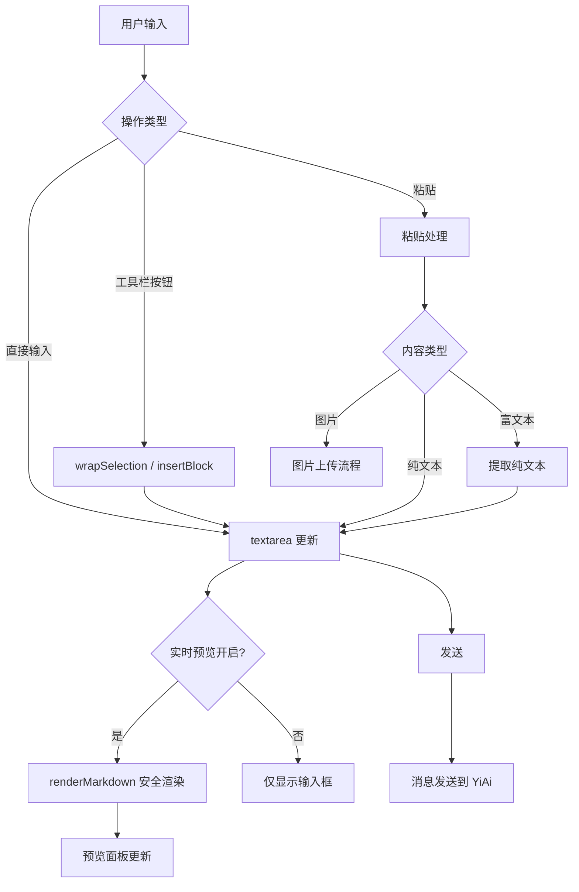
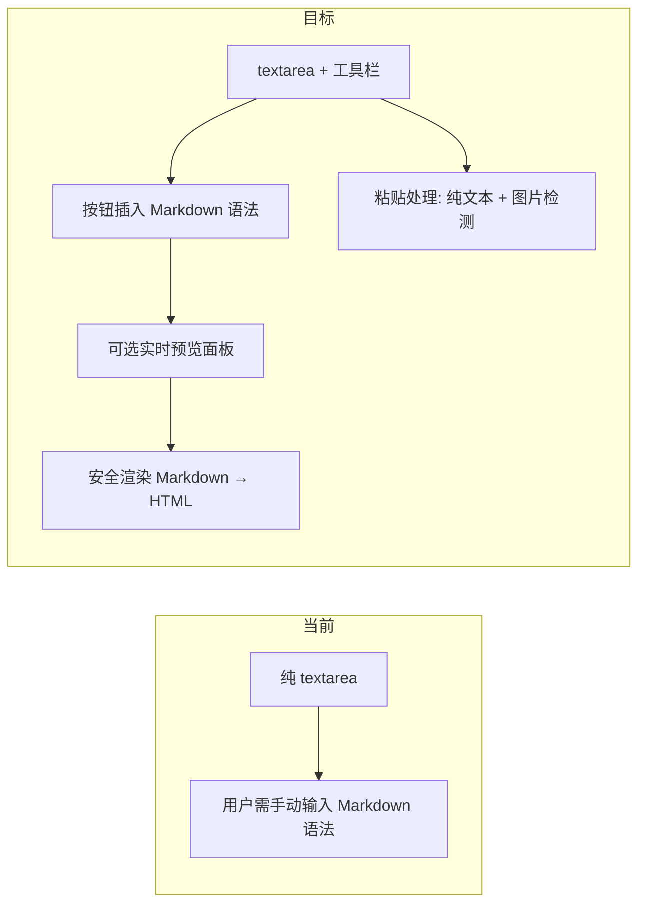

# YP-09-30: 聊天消息富文本编辑 — Markdown 工具栏与实时预览

> 需求编号：YP-09-30 · 优先级：P2 · 人天：0.5d · 状态：需求已编写

---

## 一、背景

### 1.1 问题陈述

YiPet 聊天输入框为纯文本 `<textarea>`，用户可直接输入 Markdown 语法。但存在以下问题：

1. **非技术用户门槛高**：不熟悉 `**粗体**`、`` `代码` `` 等 Markdown 语法
2. **无格式化辅助**：无工具栏提供快捷格式化操作
3. **无实时预览**：用户发送前无法预览渲染效果
4. **粘贴富文本风险**：从网页粘贴内容可能携带恶意 HTML
5. **图片粘贴支持**：用户无法通过 Ctrl+V 粘贴图片

### 1.2 影响范围

| 影响项 | 严重程度 | 表现 | 影响用户比例 |
|--------|----------|------|-------------|
| 非技术用户门槛 | 中 | 不知道如何格式化消息 | 40-50% |
| 无预览导致反复编辑 | 中 | 发送后发现格式错误 | 30% |
| 富文本粘贴风险 | 高 | 粘贴恶意 HTML 可能 XSS | 所有用户 |

### 1.3 核心挑战

| 挑战 | 描述 | 难度 |
|------|------|------|
| 工具栏设计 | 提供足够功能但不过度复杂 | 中 |
| 光标位置管理 | 插入 Markdown 语法后光标位置正确 | 中 |
| 实时预览性能 | 每次输入都重新渲染 Markdown | 中 |
| 安全防护 | 粘贴富文本时净化 HTML | 中 |

---

## 二、现状分析

### 2.1 当前实现状态

当前 ChatInput 为纯 `<textarea>`：
- 无工具栏
- 无实时预览
- 无格式化辅助
- 粘贴内容直接作为纯文本

### 2.2 文件清单

| 文件路径 | 作用 | 当前富文本支持 |
|----------|------|---------------|
| `src/chat/components/ChatInput.vue` | 聊天输入框 | 纯 textarea |
| `src/chat/rendering/safe-markdown.ts` | 安全渲染 | 仅用于 AI 回复渲染 |

### 2.3 编辑数据流



### 2.4 根因矩阵

| 问题 | 根因 | 是否可解决 | 解决方案 |
|------|------|-----------|----------|
| 无格式化工具 | 纯 textarea 无工具栏 | 是 | 工具栏按钮 + wrapSelection |
| 无实时预览 | 未实现预览功能 | 是 | 安全渲染管道 + 预览面板 |
| 粘贴富文本风险 | 未处理粘贴内容 | 是 | 提取纯文本 + 安全渲染 |

---

## 三、设计决策

### 3.1 D-01：编辑器方案

| 方案 | 描述 | 优点 | 缺点 |
|------|------|------|------|
| **A. textarea + 工具栏（选择）** | 纯 textarea + Markdown 工具栏 | 轻量，安全，无依赖 | 无所见即所得 |
| B. TipTap/Quill 富文本 | 所见即所得富文本编辑器 | 用户体验好 | 体积大（50-200KB），安全风险 |
| C. CodeMirror/ Monaco | 代码编辑器级 | 功能强大 | 体积大（500KB+），过度设计 |

**决策记录**：选择方案 A。聊天场景不需要所见即所得，Markdown 工具栏 + 实时预览是轻量且安全的最佳方案。

### 3.2 D-02：粘贴处理策略

| 方案 | 描述 | 优点 | 缺点 |
|------|------|------|------|
| A. 纯文本提取 | 粘贴时提取纯文本 | 最安全 | 丢失格式 |
| **B. 纯文本 + 图片检测（选择）** | 粘贴时提取纯文本，检测图片单独处理 | 安全 + 实用 | 需额外图片上传逻辑 |
| C. HTML 净化 | 粘贴时净化 HTML 转 Markdown | 保留格式 | 安全风险，转换不准确 |

**决策记录**：选择方案 B。纯文本提取确保安全，同时支持图片粘贴（Ctrl+V 截图）。

### 3.3 D-03：实时预览策略

| 方案 | 描述 | 优点 | 缺点 |
|------|------|------|------|
| A. 始终显示 | 预览面板始终可见 | 实时反馈 | 占用空间 |
| **B. 按需切换（选择）** | 点击预览按钮切换显示/隐藏 | 空间灵活 | 需额外操作 |
| C. 无预览 | 仅发送后查看渲染结果 | 最简洁 | 无法提前检查格式 |

**决策记录**：选择方案 B。默认不显示预览（节省空间），用户可点击按钮切换。

---

## 四、目标架构

### 4.1 Before/After 对比



### 4.2 布局设计

```
┌─ 工具栏 ──────────────────────────────────────────────────┐
│ [B] [I] [~] [H1] [H2] | [`] [```] | [•] [1.] [>] [🔗] | [👁预览] │
├────────────────────────────────────────────────────────────┤
│ 输入区域 (textarea)                                         │
│                                                            │
├─ 预览面板 (切换显示) ────────────────────────────────────────┤
│ 渲染后的 HTML（实时更新）                                     │
└────────────────────────────────────────────────────────────┘
```

### 4.3 架构取舍

| 取舍 | 选择 | 理由 |
|------|------|------|
| 轻量 vs 功能 | textarea + 工具栏 | 聊天场景不需要富文本编辑器 |
| 安全 vs 格式保留 | 纯文本提取 | 安全优先 |
| 实时预览 vs 简洁 | 按需切换显示 | 平衡空间和功能 |

---

## 五、具体改动

### 5.1 工具栏实现

```typescript
// YiPet/src/chat/components/ChatInput.vue 改造

interface ToolbarAction {
  icon: string;
  title: string;
  action: () => void;
  separator?: boolean;
}

const TOOLBAR_ACTIONS: ToolbarAction[] = [
  { icon: 'B', title: '粗体 (Ctrl+B)', action: () => wrapSelection('**') },
  { icon: 'I', title: '斜体 (Ctrl+I)', action: () => wrapSelection('*') },
  { icon: '~', title: '删除线', action: () => wrapSelection('~~') },
  { separator: true },
  { icon: 'H1', title: '一级标题', action: () => prefixLine('# ') },
  { icon: 'H2', title: '二级标题', action: () => prefixLine('## ') },
  { separator: true },
  { icon: '`', title: '行内代码', action: () => wrapSelection('`') },
  { icon: '</>', title: '代码块', action: () => insertBlock('```\n', '\n```') },
  { separator: true },
  { icon: 'UL', title: '无序列表', action: () => prefixLine('- ') },
  { icon: 'OL', title: '有序列表', action: () => prefixLine('1. ') },
  { icon: '>', title: '引用', action: () => prefixLine('> ') },
  { separator: true },
  { icon: '🔗', title: '链接', action: () => insertTemplate('[文本](url)') },
  { separator: true },
  { icon: '👁', title: '切换预览', action: () => togglePreview() },
];

function wrapSelection(wrapper: string) {
  const textarea = textareaRef.value!;
  const { selectionStart, selectionEnd, value } = textarea;
  const selected = value.slice(selectionStart, selectionEnd);

  const wrapped = selected
    ? wrapper + selected + wrapper
    : wrapper + wrapper; // 无选中时光标定位在中间

  const newText = value.slice(0, selectionStart) + wrapped + value.slice(selectionEnd);
  emit('update:modelValue', newText);

  // 恢复光标位置
  nextTick(() => {
    const newCursor = selected
      ? selectionStart + wrapped.length
      : selectionStart + wrapper.length;
    textarea.setSelectionRange(newCursor, newCursor);
    textarea.focus();
  });
}

function prefixLine(prefix: string) {
  const textarea = textareaRef.value!;
  const { selectionStart, value } = textarea;

  // 找到当前行起点
  const lineStart = value.lastIndexOf('\n', selectionStart - 1) + 1;
  const newText = value.slice(0, lineStart) + prefix + value.slice(lineStart);
  emit('update:modelValue', newText);

  nextTick(() => {
    textarea.setSelectionRange(selectionStart + prefix.length, selectionStart + prefix.length);
    textarea.focus();
  });
}

function insertBlock(before: string, after: string) {
  const textarea = textareaRef.value!;
  const { selectionStart, selectionEnd, value } = textarea;
  const selected = value.slice(selectionStart, selectionEnd);

  const newText = value.slice(0, selectionStart) +
    before + selected + after +
    value.slice(selectionEnd);
  emit('update:modelValue', newText);

  nextTick(() => {
    const newCursor = selectionStart + before.length + selected.length;
    textarea.setSelectionRange(newCursor, newCursor);
    textarea.focus();
  });
}

function insertTemplate(template: string) {
  const textarea = textareaRef.value!;
  const { selectionStart, selectionEnd, value } = textarea;
  const selected = value.slice(selectionStart, selectionEnd);

  // 如果有选中文字，替换模板中的"文本"
  const filled = selected ? template.replace('文本', selected) : template;
  const newText = value.slice(0, selectionStart) + filled + value.slice(selectionEnd);
  emit('update:modelValue', newText);

  nextTick(() => {
    textarea.focus();
  });
}
```

### 5.2 粘贴处理

```typescript
// 粘贴处理——纯文本提取 + 图片检测
function onPaste(e: ClipboardEvent) {
  const items = e.clipboardData?.items;
  if (!items) return;

  for (const item of items) {
    // 图片粘贴
    if (item.type.startsWith('image/')) {
      e.preventDefault();
      const file = item.getAsFile();
      if (file) handleImagePaste(file);
      return;
    }
  }

  // 富文本粘贴——提取纯文本
  const html = e.clipboardData?.getData('text/html');
  if (html) {
    e.preventDefault();
    const text = extractPlainText(html);
    insertAtCursor(text);
  }
}

function extractPlainText(html: string): string {
  const div = document.createElement('div');
  div.innerHTML = html;
  return div.textContent || '';
}

function insertAtCursor(text: string) {
  const textarea = textareaRef.value!;
  const { selectionStart, selectionEnd, value } = textarea;
  const newText = value.slice(0, selectionStart) + text + value.slice(selectionEnd);
  emit('update:modelValue', newText);
}
```

### 5.3 实时预览

```vue
<template>
  <div class="chat-input-container">
    <div class="toolbar">
      <button v-for="btn in TOOLBAR_ACTIONS" :key="btn.title"
        :title="btn.title" @click="btn.action">
        {{ btn.icon }}
      </button>
    </div>

    <textarea
      ref="textareaRef"
      :value="modelValue"
      @input="onInput"
      @paste="onPaste"
      @keydown="handleKeydown"
      :placeholder="placeholder"
    ></textarea>

    <!-- 实时预览面板 -->
    <div v-if="showPreview" class="preview-panel markdown-body"
      v-html="previewHtml">
    </div>
  </div>
</template>

<script setup lang="ts">
import { computed, ref } from 'vue';
import { renderMarkdown } from '../rendering/safe-markdown';

const showPreview = ref(false);

const previewHtml = computed(() => {
  if (!showPreview.value || !props.modelValue) return '';
  return renderMarkdown(props.modelValue);
});

function togglePreview() {
  showPreview.value = !showPreview.value;
}
</script>
```

### 5.4 文件变更清单

| 文件 | 操作 | 说明 |
|------|------|------|
| `src/chat/components/ChatInput.vue` | 修改 | 添加工具栏 + 粘贴处理 + 预览面板 |
| `src/chat/components/ChatInputToolbar.vue` | 新增 | 工具栏子组件 |
| `src/chat/components/ChatInputPreview.vue` | 新增 | 预览面板子组件 |
| `tests/chat/components/ChatInput.test.ts` | 新增 | 工具栏 + 粘贴测试 |

---

## 六、实施步骤

| 步骤 | 任务 | 文件 | 验证方法 | 人天 |
|------|------|------|----------|------|
| 1 | 实现工具栏按钮逻辑 | `ChatInput.vue` | 各按钮正确插入 Markdown 语法 | 0.3 |
| 2 | 实现粘贴处理 | `ChatInput.vue` | 纯文本提取 + 图片检测 | 0.2 |
| 3 | 实现实时预览面板 | `ChatInputPreview.vue` | 预览内容同步更新 | 0.2 |
| 4 | 实现安全渲染集成 | `ChatInput.vue` | 使用 renderMarkdown 渲染预览 | 0.1 |
| 5 | 编写测试 | `tests/` | 工具栏 + 粘贴 + 预览覆盖 | 0.2 |

**总计：1.0 人天**（含测试）

---

## 七、性能分析

### 7.1 基准测试

| 操作 | 耗时 | 备注 |
|------|------|------|
| 工具栏按钮点击 | < 5ms | 纯字符串操作 |
| 粘贴处理 | < 5ms | 纯文本提取 |
| 实时预览渲染 | < 10ms | 使用安全渲染管道 |
| 预览面板切换 | < 5ms | CSS display 切换 |

### 7.2 容量规划

| 指标 | 值 |
|------|-----|
| 工具栏按钮数量 | 12 个 |
| 预览面板最大高度 | 200px |
| 预览防抖延迟 | 100ms（避免频繁渲染） |

---

## 八、测试规格

### 8.1 功能测试

**场景 1：粗体按钮**
```
GIVEN 用户选中"hello"文字
WHEN 点击粗体按钮
THEN 文字变为"**hello**"
AND 光标位置在闭合 ** 后
```

**场景 2：无选中时插入**
```
GIVEN 光标在空白处
WHEN 点击粗体按钮
THEN 插入"****"
AND 光标定位在中间
```

**场景 3：粘贴富文本**
```
GIVEN 用户从网页复制了包含 HTML 的文本
WHEN 粘贴到输入框
THEN 仅提取纯文本
AND 所有 HTML 标签被移除
AND 图片被检测并单独处理
```

**场景 4：实时预览**
```
GIVEN 用户输入 Markdown 文本
WHEN 点击预览按钮
THEN 预览面板显示渲染后的 HTML
AND 内容随输入实时更新
```

**场景 5：代码块插入**
```
GIVEN 光标在空白处
WHEN 点击代码块按钮
THEN 插入"```\n\n```"
AND 光标定位在中间空行
```

**场景 6：链接模板插入**
```
GIVEN 用户选中了"点击这里"
WHEN 点击链接按钮
THEN 插入"[点击这里](url)"
AND 光标定位在 url 处
```

---

## 九、风险与缓解

| 风险 | 概率 | 影响 | 缓解措施 |
|------|------|------|------|
| 粘贴富文本携带恶意 HTML | 中 | 高 | 始终提取纯文本，不使用 innerHTML |
| 大图片粘贴导致性能问题 | 低 | 中 | 限制图片 size < 5MB |
| 预览渲染频繁导致卡顿 | 低 | 低 | 100ms 防抖 |

---

## 十、回滚策略

| 场景 | 回滚方式 | 回滚时间 |
|------|----------|----------|
| 工具栏导致输入异常 | 禁用工具栏，仅保留 textarea | < 5 分钟 |
| 预览面板性能问题 | 禁用实时预览 | < 5 分钟 |

---

## 十一、设计决策记录

### D-01: textarea + 工具栏

**状态**: 已采纳
**背景**: 用户需要格式化消息但纯 textarea 不支持，同时需要保持轻量和安全
**决策**: 保持 textarea 输入，添加 Markdown 工具栏（粗体、斜体、标题、代码、列表、引用、链接 12 个按钮）
**理由**: 聊天场景不需要所见即所得，轻量安全无多余依赖；TipTap 等富文本编辑器体积大（50-200KB）且安全风险高
**影响**: 无所见即所得体验，但实时预览面板弥补；工具栏按钮通过 wrapSelection/prefixLine/insertBlock 操作光标和文本

### D-02: 纯文本粘贴

**状态**: 已采纳
**背景**: 从网页粘贴内容可能携带恶意 HTML（`<script>` 标签、事件处理器），直接注入 DOM 有 XSS 风险
**决策**: 粘贴时始终提取纯文本（`textContent`），富文本格式全部丢弃；图片 paste 单独检测并处理
**理由**: 安全第一，防止 XSS；HTML 转 Markdown 转换不准确且有安全风险
**影响**: 丢失富文本格式，但聊天场景格式不重要；图片粘贴通过 Clipboard API 的 `image/*` 类型检测单独处理

### D-03: 按需预览

**状态**: 已采纳
**背景**: 实时预览面板持续可见会占用聊天窗口空间，需要平衡空间和功能
**决策**: 预览面板默认隐藏，用户通过工具栏按钮切换显示/隐藏；预览使用安全渲染管道（marked + DOMPurify）
**理由**: 节省空间，默认模式为编辑；始终显示预览会占用宝贵的聊天窗口空间
**影响**: 需额外点击操作，但空间更灵活；预览渲染有 100ms 防抖避免频繁渲染

---

## 十二、可观测性

### 12.1 指标

| 指标名 | 类型 | 描述 | 告警阈值 |
|--------|------|------|------|
| `yipet.input.toolbar_click` | Counter | 工具栏按钮点击次数 | — |
| `yipet.input.preview_toggle` | Counter | 预览切换次数 | — |
| `yipet.input.paste_image` | Counter | 图片粘贴次数 | — |

### 12.2 日志

```typescript
console.debug('[YiPet:Input] Toolbar action: %s', title);
console.debug('[YiPet:Input] Paste detected: type=%s', type);
console.debug('[YiPet:Input] Preview toggled: %s', showPreview ? 'on' : 'off');
```

---

## 十三、安全合规

### 13.1 Chrome MV3 安全要求

| 要求 | 实现 |
|------|------|
| XSS 防护 | 粘贴时提取纯文本，预览使用安全渲染管道 |
| 内容安全 | 不使用 eval，不加载外部脚本 |
| 数据隐私 | 预览渲染在本地执行 |

---

## 十四、代码审查检查清单

- [ ] 工具栏按钮正确插入 Markdown 语法
- [ ] 光标位置在插入后正确恢复
- [ ] 粘贴富文本时提取纯文本
- [ ] 粘贴图片时检测并单独处理
- [ ] 图片粘贴限制 size < 5MB
- [ ] 预览面板使用安全渲染管道（renderMarkdown）
- [ ] 预览面板切换不影响输入框内容
- [ ] 空选中时按钮行为正确（光标定位在中间）

---

## 十五、回归问题预测

| # | 预测问题 | 原因 | 验证方法 |
|---|---------|------|---------|
| 1 | 粘贴携带恶意 HTML 的富文本 | 源页面格式未清洗 | 从网页粘贴内容后检查 HTML 是否被移除 |
| 2 | 大图片粘贴导致消息体过大 | 图片 base64 编码膨胀 | 限制图片 size < 5MB |
| 3 | 光标位置在复杂操作后不正确 | 异步 nextTick 时序问题 | 连续操作多个按钮后检查光标位置 |

---

---

## 设计决策记录

### D-01: `textarea` + 工具栏而非 `contentEditable` 富文本编辑器

**状态**: 已采纳
**背景**: 聊天输入可以使用 `contentEditable`（所见即所得的富文本编辑）或 `textarea` + Markdown 工具栏。`contentEditable` 的选区管理和跨浏览器一致性是长期痛点。
**决策**: 使用 `textarea` + Markdown 工具栏——输入纯文本，工具栏按钮插入 Markdown 语法（`**粗体**`/`` `代码` ``）。预览模式渲染 Markdown 为 HTML。
**影响**: 不支持内嵌图片（Markdown 不支持本地图片）——图片通过独立的上传功能（YP-09-33）处理。

### D-02: Markdown 工具栏按钮插入语法而非渲染预览

**状态**: 已采纳
**背景**: 工具栏可以实时渲染 Markdown（WYSIWYG）或仅插入 Markdown 语法标记。WYSIWYG 需要 contentEditable——有上述痛点。
**决策**: 工具栏按钮插入 Markdown 语法标记——选中文本时包裹（`**选中的文本**`），无选中时插入占位符（`**粗体**` 光标置于中间）。用户可切换"预览"模式查看渲染效果（切换回编辑模式继续修改）。
**影响**: 用户需了解基本 Markdown 语法——对于非技术用户有学习曲线。

### D-03: 纯文本粘贴而非保留格式粘贴

**状态**: 已采纳
**背景**: 用户从网页/Word 粘贴内容时——可能携带 HTML 格式（字体/颜色/大小）。保留格式粘贴会污染 Markdown 纯文本。
**决策**: `paste` 事件中调用 `event.preventDefault()` + `document.execCommand('insertText', false, plainText)` 强制纯文本粘贴。HTML 标签和样式被剥离。
**影响**: 用户从表格/代码块粘贴时格式丢失——但对于 Markdown 聊天场景是可接受的行为。