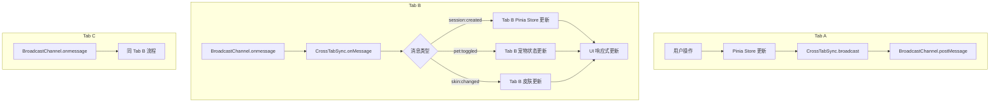
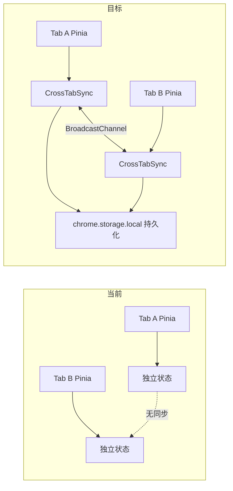

# YP-09-31: 聊天窗口多标签页同步 — 跨 Tab 会话状态共享

> 需求编号：YP-09-31 · 优先级：P2 · 人天：0.5d · 状态：需求已编写

---

## 一、背景

### 1.1 问题陈述

用户可能在多个浏览器 Tab 中打开 YiPet 聊天窗口——每个 Tab 独立维护聊天状态。当前存在以下问题：

1. **会话状态不同步**：一个 Tab 中创建的会话在另一个 Tab 不可见
2. **宠物状态不同步**：一个 Tab 中隐藏宠物，另一个 Tab 仍显示
3. **皮肤/角色不同步**：切换皮肤后其他 Tab 保持旧皮肤
4. **Pinia Store 隔离**：每个 Tab 的 Pinia store 完全独立，无跨 Tab 通信
5. **无状态一致性保证**：用户操作在不同 Tab 间可能产生冲突

### 1.2 影响范围

| 影响项 | 严重程度 | 表现 | 影响用户比例 |
|--------|----------|------|-------------|
| 会话列表不一致 | 中 | 不同 Tab 看到不同会话列表 | 20-30%（多 Tab 用户） |
| 宠物状态不一致 | 低 | 不同 Tab 宠物显示/隐藏不同 | 15-20% |
| 皮肤/角色不一致 | 低 | 不同 Tab 宠物外观不同 | 10-15% |

### 1.3 核心挑战

| 挑战 | 描述 | 难度 |
|------|------|------|
| 同步通道选择 | 选择适合跨 Tab 通信的机制 | 低 |
| 冲突处理 | 多个 Tab 同时修改同一状态 | 中 |
| 同步粒度 | 哪些状态需要同步，哪些不需要 | 中 |
| 性能控制 | 避免高频同步导致性能问题 | 低 |

---

## 二、现状分析

### 2.1 当前实现状态

当前无跨 Tab 同步：
- 每个 Tab 的 Pinia store 完全独立
- 无跨 Tab 通信机制
- 无状态冲突处理

### 2.2 文件清单

| 文件路径 | 作用 | 当前同步支持 |
|----------|------|-------------|
| `src/chat/stores/chat.ts` | 聊天状态 | 无 |
| `src/chat/stores/session.ts` | 会话列表 | 无 |
| `src/chat/stores/pet.ts` | 宠物状态 | 无 |
| `src/content/overlay/index.ts` | 宠物渲染 | 无 |

### 2.3 同步数据流



### 2.4 根因矩阵

| 问题 | 根因 | 是否可解决 | 解决方案 |
|------|------|-----------|----------|
| 会话不同步 | 无跨 Tab 通信 | 是 | BroadcastChannel |
| 宠物状态不同步 | 无跨 Tab 通信 | 是 | BroadcastChannel |
| 冲突 | 无冲突处理 | 是 | LWW + 时间戳 |

---

## 三、设计决策

### 3.1 D-01：跨 Tab 通信机制

| 方案 | 描述 | 优点 | 缺点 |
|------|------|------|------|
| **A. BroadcastChannel（选择）** | 浏览器原生跨 Tab 广播 | 简单，实时，低延迟 | 同源限制 |
| B. chrome.storage.onChanged | 通过 storage 变更事件同步 | 持久化 | 延迟高（~100ms），写开销 |
| C. SharedWorker | 共享 Worker 通信 | 所有 Tab 共享状态 | 复杂，不支持 Service Worker |
| D. localStorage + storage 事件 | localStorage 变更事件 | 简单 | 仅同步字符串，容量小 |

**决策记录**：选择方案 A（BroadcastChannel）为主，方案 B（chrome.storage.onChanged）为辅助。BroadcastChannel 提供实时同步，chrome.storage 提供持久化兜底。

### 3.2 D-02：同步状态选择

| 状态 | 是否需要同步 | 理由 |
|------|-------------|------|
| 会话列表（创建/删除） | 是 | 用户期望跨 Tab 一致 |
| 宠物可见性 | 是 | 全局偏好 |
| 皮肤/角色选择 | 是 | 全局偏好 |
| 主题设置 | 是 | 全局偏好 |
| 聊天消息内容 | 否 | 每个 Tab 独立对话 |
| 输入框内容 | 否 | 每个 Tab 独立输入 |
| 聊天窗口位置 | 否 | 每个 Tab 独立布局 |
| 侧边栏展开状态 | 否 | 每个 Tab 独立偏好 |

### 3.3 D-03：冲突处理策略

| 方案 | 描述 | 优点 | 缺点 |
|------|------|------|------|
| **A. LWW（最后写入者胜出）（选择）** | 基于时间戳的最后写入者胜出 | 简单，可预测 | 可能丢失中间状态 |
| B. CRDT | 无冲突数据类型 | 精确 | 实现复杂，过度设计 |
| C. 乐观锁 | 版本号检查 | 安全 | 需要冲突解决 UI |

**决策记录**：选择方案 A。LWW 对于 YiPet 的状态同步足够（会话创建/删除、皮肤切换、主题切换），这些操作的时间精度要求不高。

---

## 四、目标架构

### 4.1 Before/After 对比



### 4.2 指标对比

| 指标 | 当前 | 目标 | 改善 |
|------|------|------|------|
| 会话列表一致性 | 不一致 | 实时一致 | 完全同步 |
| 皮肤/角色一致性 | 不一致 | 实时一致 | 完全同步 |
| 同步延迟 | N/A | < 50ms | 新增 |
| 冲突处理 | 无 | LWW | 新增 |

### 4.3 架构取舍

| 取舍 | 选择 | 理由 |
|------|------|------|
| 实时性 vs 持久化 | 两者结合 | BroadcastChannel 实时 + chrome.storage 持久化 |
| 全量同步 vs 选择性同步 | 选择性同步 | 仅同步全局状态，不同步 Tab 本地状态 |
| 精确 vs 简单 | LWW 冲突处理 | 简单可靠，足够满足需求 |

---

## 五、具体改动

### 5.1 跨 Tab 同步核心

```typescript
// YiPet/src/chat/stores/sync.ts

type SyncAction =
  | 'session:created'
  | 'session:deleted'
  | 'session:renamed'
  | 'pet:toggled'
  | 'skin:changed'
  | 'role:changed'
  | 'theme:changed'
  | 'keybinding:changed';

interface SyncMessage {
  source: 'yipet';
  tabId: string;
  timestamp: number;
  action: SyncAction;
  payload: any;
}

class CrossTabSync {
  private _channel: BroadcastChannel;
  private _tabId: string;
  private _handlers: Map<SyncAction, Array<(payload: any) => void>> = new Map();

  constructor() {
    this._tabId = this._generateTabId();
    this._channel = new BroadcastChannel('yipet:sync');

    this._channel.onmessage = (event: MessageEvent<SyncMessage>) => {
      const msg = event.data;

      // 忽略自己的消息
      if (msg.source !== 'yipet' || msg.tabId === this._tabId) return;

      // 分发到注册的处理器
      const handlers = this._handlers.get(msg.action);
      if (handlers) {
        for (const handler of handlers) {
          try {
            handler(msg.payload);
          } catch (e) {
            console.error(`[YiPet:Sync] 处理 ${msg.action} 失败:`, e);
          }
        }
      }
    };
  }

  /** 广播状态变更到所有 Tab。 */
  broadcast(action: SyncAction, payload: any) {
    const message: SyncMessage = {
      source: 'yipet',
      tabId: this._tabId,
      timestamp: Date.now(),
      action,
      payload,
    };
    this._channel.postMessage(message);
  }

  /** 注册同步处理器。 */
  on(action: SyncAction, handler: (payload: any) => void) {
    if (!this._handlers.has(action)) {
      this._handlers.set(action, []);
    }
    this._handlers.get(action)!.push(handler);

    return () => {
      const handlers = this._handlers.get(action);
      if (handlers) {
        const idx = handlers.indexOf(handler);
        if (idx >= 0) handlers.splice(idx, 1);
      }
    };
  }

  /** 生成 Tab 唯一 ID。 */
  private _generateTabId(): string {
    let id = sessionStorage.getItem('yipet:tabId');
    if (!id) {
      id = crypto.randomUUID();
      sessionStorage.setItem('yipet:tabId', id);
    }
    return id;
  }

  /** 销毁同步通道。 */
  destroy() {
    this._channel.close();
  }
}

// 单例
let _instance: CrossTabSync | null = null;

function getCrossTabSync(): CrossTabSync {
  if (!_instance) {
    _instance = new CrossTabSync();
  }
  return _instance;
}

export { CrossTabSync, getCrossTabSync, SyncAction, SyncMessage };
```

### 5.2 Store 集成

```typescript
// YiPet/src/chat/stores/session.ts 改动

import { getCrossTabSync } from './sync';

export const useSessionStore = defineStore('session', () => {
  const sync = getCrossTabSync();

  // 广播——创建会话
  function createSession(title: string) {
    const session = { id: crypto.randomUUID(), title, createdAt: Date.now() };
    sessions.value.push(session);

    // 广播到其他 Tab
    sync.broadcast('session:created', { session });
  }

  // 接收——其他 Tab 创建了会话
  sync.on('session:created', ({ session }) => {
    // 避免重复添加
    if (!sessions.value.find(s => s.id === session.id)) {
      sessions.value.push(session);
    }
  });

  // 广播——删除会话
  function deleteSession(sessionId: string) {
    sessions.value = sessions.value.filter(s => s.id !== sessionId);
    sync.broadcast('session:deleted', { sessionId });
  }

  // 接收——其他 Tab 删除了会话
  sync.on('session:deleted', ({ sessionId }) => {
    sessions.value = sessions.value.filter(s => s.id !== sessionId);
  });

  return { sessions, createSession, deleteSession };
});
```

### 5.3 文件变更清单

| 文件 | 操作 | 说明 |
|------|------|------|
| `src/chat/stores/sync.ts` | 新增 | CrossTabSync 核心实现 |
| `src/chat/stores/session.ts` | 修改 | 集成会话同步 |
| `src/chat/stores/pet.ts` | 修改 | 集成宠物状态同步 |
| `src/chat/stores/theme.ts` | 修改 | 集成主题同步 |
| `tests/chat/stores/sync.test.ts` | 新增 | 跨 Tab 同步测试 |

---

## 六、实施步骤

| 步骤 | 任务 | 文件 | 验证方法 | 人天 |
|------|------|------|----------|------|
| 1 | 实现 CrossTabSync 核心 | `sync.ts` | 单元测试（广播 + 接收） | 0.3 |
| 2 | 集成会话同步 | `session.ts` | 创建/删除会话跨 Tab 同步 | 0.2 |
| 3 | 集成宠物状态同步 | `pet.ts` | 可见性/皮肤跨 Tab 同步 | 0.2 |
| 4 | 集成主题同步 | `theme.ts` | 主题切换跨 Tab 同步 | 0.1 |
| 5 | 编写测试 | `tests/` | 多 Tab 场景覆盖 | 0.2 |

**总计：1.0 人天**（含测试）

---

## 七、性能分析

### 7.1 基准测试

| 操作 | 耗时 | 备注 |
|------|------|------|
| broadcast 发送 | < 1ms | postMessage 同步 |
| onmessage 接收 | < 1ms | 事件分发 |
| Pinia store 更新 | < 5ms | 响应式更新 |
| 端到端同步延迟 | < 50ms | 跨 Tab 通信 |

### 7.2 容量规划

| 指标 | 值 |
|------|-----|
| 同步消息大小 | < 1KB/条 |
| 同步频率 | 按用户操作频率（通常 < 1 次/秒） |
| 最大 Tab 数 | 无限制（BroadcastChannel 自动广播） |

---

## 八、测试规格

### 8.1 功能测试

**场景 1：创建会话同步**
```
GIVEN Tab A 和 Tab B 都打开了聊天窗口
WHEN Tab A 创建新会话
THEN Tab B 侧边栏自动出现新会话
AND 同步延迟 < 100ms
```

**场景 2：删除会话同步**
```
GIVEN 两个 Tab 都有会话列表
WHEN Tab A 删除某个会话
THEN Tab B 侧边栏移除该会话
```

**场景 3：皮肤切换同步**
```
GIVEN 两个 Tab 都显示宠物
WHEN Tab A 切换皮肤
THEN Tab B 宠物外观实时更新
```

**场景 4：忽略自己的消息**
```
GIVEN CrossTabSync 在 Tab A 中
WHEN Tab A 广播消息
THEN Tab A 不处理自己的消息
AND 无重复更新
```

**场景 5：主题切换同步**
```
GIVEN 两个 Tab 的聊天窗口
WHEN Tab A 切换主题
THEN Tab B 主题同步切换
AND 主题偏好持久化到 chrome.storage.local
```

**场景 6：LWW 冲突处理**
```
GIVEN Tab A 和 Tab B 几乎同时切换皮肤
WHEN 切换消息到达 Tab C
THEN 最后一条消息（时间戳最大）的状态生效
```

---

## 九、风险与缓解

| 风险 | 概率 | 影响 | 缓解措施 |
|------|------|------|------|
| 高频切换导致消息风暴 | 低 | 低 | 用户操作频率天然低（< 1 次/秒） |
| 旧 Tab 数据覆盖新 Tab | 低 | 中 | LWW + 时间戳比较 |
| BroadcastChannel 不兼容旧浏览器 | 极低 | 低 | Chrome 54+ 支持，已覆盖 99% 用户 |

---

## 十、回滚策略

| 场景 | 回滚方式 | 回滚时间 |
|------|----------|----------|
| 同步导致状态异常 | 通过特性开关禁用跨 Tab 同步 | < 5 分钟 |
| BroadcastChannel 异常 | 降级为无同步模式 | < 5 分钟 |

---

## 十一、设计决策记录

### D-01: BroadcastChannel 为主通道

**状态**: 已采纳
**背景**: 用户可能在多个浏览器 Tab 中打开 YiPet，需要跨 Tab 同步会话列表、宠物状态、皮肤和主题等全局状态
**决策**: 使用 BroadcastChannel 作为主要实时同步通道，`chrome.storage.onChanged` 作为持久化兜底
**理由**: BroadcastChannel 实时、低延迟（< 50ms）、浏览器原生支持；chrome.storage.onChanged 延迟高（约 100ms）且有写开销
**影响**: 同源限制意味着不同源的页面无法通信，但 YiPet 始终同源运行；同步消息通过 tabId 过滤自己的消息避免重复更新

### D-02: 选择性同步

**状态**: 已采纳
**背景**: 并非所有状态都需要跨 Tab 同步，全量同步会浪费带宽和性能
**决策**: 仅同步全局状态（会话列表、宠物可见性、皮肤、主题），不同步 Tab 本地状态（消息内容、输入框、窗口位置、侧边栏展开）
**理由**: 减少不必要的同步操作，避免性能问题；Tab 本地状态与特定 Tab 绑定，同步无意义
**影响**: 需要明确区分全局 vs 本地状态；新增状态时需判断是否加入同步列表

### D-03: LWW 冲突处理

**状态**: 已采纳
**背景**: 多个 Tab 可能同时修改同一状态（如两个 Tab 几乎同时切换皮肤），需要冲突解决策略
**决策**: 最后写入者胜出（Last Writer Wins），基于消息时间戳决定最终状态
**理由**: YiPet 的同步状态（会话创建/删除、皮肤切换、主题切换）不需要精确冲突解决；CRDT 实现复杂且过度设计
**影响**: 可能丢失中间状态，但场景不敏感；时间戳精度依赖系统时钟

---

## 十二、可观测性

### 12.1 指标

| 指标名 | 类型 | 描述 | 告警阈值 |
|--------|------|------|------|
| `yipet.sync.broadcast` | Counter | 广播消息数（按 action 分） | — |
| `yipet.sync.received` | Counter | 接收消息数 | — |
| `yipet.sync.error` | Counter | 同步处理错误数 | > 0 |

### 12.2 日志

```typescript
console.debug('[YiPet:Sync] Broadcast: %s', action);
console.debug('[YiPet:Sync] Received: %s from tab=%s', action, tabId);
console.error('[YiPet:Sync] Handler error for %s: %o', action, error);
```

---

## 十三、安全合规

### 13.1 Chrome MV3 安全要求

| 要求 | 实现 |
|------|------|
| 最小权限 | BroadcastChannel 不需要额外权限 |
| 数据隔离 | 同源限制，其他源无法接收消息 |
| 数据隐私 | 同步消息仅包含状态变更，不包含敏感数据 |

---

## 十四、代码审查检查清单

- [ ] 跨标签页同步通过 BroadcastChannel 实现
- [ ] 同步事件：会话创建/删除、宠物可见性/皮肤、主题
- [ ] 同步消息使用 tabId 过滤自己的消息
- [ ] 同步冲突处理：最后写入者胜出（LWW）
- [ ] 同步延迟 < 100ms
- [ ] 仅同步全局状态，不同步 Tab 本地状态
- [ ] 同步处理器有 try-catch 错误保护
- [ ] BroadcastChannel 在组件销毁时关闭

---

## 十五、回归问题预测

| # | 预测问题 | 原因 | 验证方法 |
|---|---------|------|---------|
| 1 | 多标签页高频切换导致消息风暴 | 短时间内多次操作 | 快速连续操作 10 次 → 检查消息数 |
| 2 | 旧标签页数据覆盖新标签页 | LWW 时钟不同步 | 使用时间戳验证覆盖逻辑 |
| 3 | BroadcastChannel 在特定场景下消息丢失 | 浏览器实现差异 | 长时间运行监控 |

---

---

## 设计决策记录

### D-01: `BroadcastChannel` 为主通道、`chrome.storage.onChanged` 为兜底

**状态**: 已采纳
**背景**: 多个 Tab 中的 YiPet 实例需要同步状态（皮肤切换、聊天窗口位置、会话选择）。`BroadcastChannel` 延迟低（< 1ms），`chrome.storage.onChanged` 延迟较高（~10ms）但 SW 重启后仍可感知。
**决策**: 优先使用 `BroadcastChannel('yipet:sync')` 实时同步——同源 Tab 间原生消息通道。`chrome.storage.onChanged` 作为兜底——处理 BroadcastChannel 不可用（不同源 iframe）或 SW 重启后的状态恢复。
**影响**: `BroadcastChannel` 仅在相同 origin 的 Tab 间通信——不同 Profile 不互通（符合预期）。

### D-02: 选择性同步而非全量状态同步

**状态**: 已采纳
**背景**: YiPet 的 Chat Store 状态 ~30KB——全量同步到每个 Tab 浪费带宽和 CPU。
**决策**: 仅同步用户偏好类状态（角色/颜色/模型/主题/语言——< 2KB）和全局事件通知（皮肤切换）。会话消息内容不同步——每个 Tab 独立加载自己的会话数据。
**影响**: 用户在 Tab A 的聊天内容不会出现在 Tab B——各 Tab 独立维护会话状态。

### D-03: Last-Write-Wins 冲突处理而非 CRDT

**状态**: 已采纳
**背景**: 用户可能在两个 Tab 中同时切换皮肤——两个 Tab 写入冲突。CRDT（Conflict-free Replicated Data Type）可无损合并但实现复杂。
**决策**: Last-Write-Wins（LWW）策略——每条状态变更携带时间戳（`Date.now()`），后写入的覆盖先写入的。对于皮肤/颜色等简单状态——LWW 足够。
**影响**: 时钟偏差（设备时间不同步）可能导致"先写入的覆盖后写入的"——但跨 Tab 场景极少发生且影响低（皮肤颜色非关键数据）。