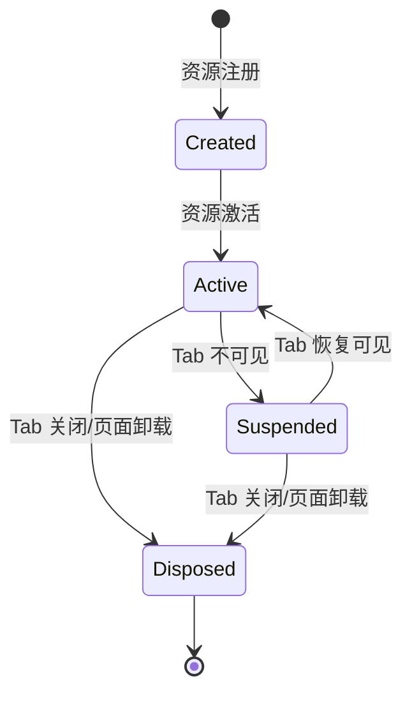
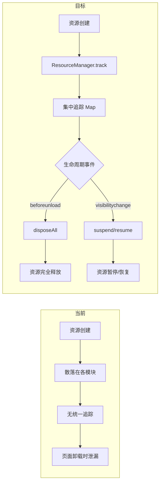

# YP-09-32: Content Script 资源生命周期管理 — 按 Tab 粒度的注入/销毁

> 需求编号：YP-09-32 · 优先级：P2 · 人天：0.5d · 状态：需求已编写

---

## 一、背景

### 1.1 问题陈述

Content Script 注入后随页面生命周期一直存活——Tab 关闭前资源不会释放。长时间浏览（数小时）可能导致以下问题：

1. **MutationObserver 回调累积**：多个 Observer 实例未断开，每次 DOM 变化都触发回调
2. **事件监听器未清理**：`window.addEventListener` 注册的监听器在页面卸载前一直存在
3. **DOM 引用残留**：已移除的 DOM 节点引用仍被持有，防止 GC 回收
4. **rAF 循环未停止**：`requestAnimationFrame` 循环未取消，持续消耗 CPU
5. **SSE 连接未关闭**：fetch 流式连接未 abort，保持网络连接
6. **setInterval 未清理**：定时器回调在页面不可见时仍在运行

### 1.2 影响范围

| 影响项 | 严重程度 | 表现 | 影响用户比例 |
|--------|----------|------|-------------|
| 内存泄漏 | 高 | 长时间浏览后内存增长 50-200MB | 所有长浏览用户 |
| CPU 浪费 | 中 | 不可见页面仍执行动画循环 | 所有多 Tab 用户 |
| 页面响应变慢 | 中 | 累积的回调拖慢页面响应 | 20-30%（低端设备） |
| Tab 关闭不干净 | 低 | 后台资源未释放 | 所有用户 |

### 1.3 核心挑战

| 挑战 | 描述 | 难度 |
|------|------|------|
| 资源追踪 | 需要追踪所有注册的资源，不遗漏 | 中 |
| 自动清理 | 页面卸载时自动清理，不依赖开发者手动调用 | 中 |
| 休眠/恢复 | Tab 不可见时休眠资源，恢复时重新激活 | 高 |
| 异常处理 | 清理过程中异常不应影响其他资源清理 | 低 |

---

## 二、现状分析

### 2.1 当前资源泄漏点

| 资源 | 类型 | 创建位置 | 是否清理 |
|------|------|----------|----------|
| MutationObserver | observer | `bootstrap.ts` | 否 |
| history.pushState 包装 | function | `route-detector.ts` | 否 |
| EventListener (routeChange) | listener | `bootstrap.ts` | 否 |
| EventListener (message) | listener | `chat-bridge.ts` | 否 |
| EventListener (visibilitychange) | listener | `animation-scheduler.ts` | 否 |
| requestAnimationFrame 循环 | raf | `animation-scheduler.ts` | 是 |
| SSE fetch stream | fetch | `chat-service.ts` | 部分 |
| setInterval 心跳 | interval | `sw-lifecycle.ts` | 否 |

### 2.2 文件清单

| 文件路径 | 作用 | 资源管理 |
|----------|------|----------|
| `src/content/bootstrap.ts` | Content Script 入口 | 无统一管理 |
| `src/content/route-detector.ts` | 路由检测 | 无清理 |
| `src/content/chat-bridge.ts` | 消息通道 | 无清理 |
| `src/content/overlay/index.ts` | 宠物 DOM | 无清理 |
| `src/content/rendering/animation-scheduler.ts` | 动画调度 | 部分清理 |
| `src/chat/services/chat-service.ts` | 聊天服务 | 部分清理 |

### 2.3 资源生命周期状态机



### 2.4 根因矩阵

| 问题 | 根因 | 是否可解决 | 解决方案 |
|------|------|-----------|----------|
| 资源泄漏 | 无统一资源管理 | 是 | ResourceManager 追踪所有资源 |
| 无自动清理 | 未监听 beforeunload | 是 | 页面卸载时 disposeAll |
| 无休眠机制 | 未处理 Tab 不可见 | 是 | visibilitychange 时 suspend/resume |

---

## 三、设计决策

### 3.1 D-01：资源追踪方式

| 方案 | 描述 | 优点 | 缺点 |
|------|------|------|------|
| **A. 手动注册（选择）** | 每个资源创建时调用 `resourceManager.track()` | 显式，可审计 | 开发者可能忘记注册 |
| B. 自动代理 | 代理原生 API（addEventListener/setInterval 等） | 自动追踪 | 复杂度高，性能开销 |
| C. WeakRef 追踪 | 使用 WeakRef 自动追踪 | 自动 GC | 不可控，调试困难 |

**决策记录**：选择方案 A。手动注册是最可靠的方式，通过代码审查确保所有资源都被注册。

### 3.2 D-02：休眠策略

| 方案 | 描述 | 优点 | 缺点 |
|------|------|------|------|
| A. 完全销毁 | Tab 不可见时完全销毁资源 | 最省资源 | 恢复时需要重新初始化 |
| **B. 部分休眠（选择）** | 停止动画/SSE，保留 DOM 和监听器 | 平衡 | 需管理休眠/恢复逻辑 |
| C. 不处理 | Tab 不可见时不做任何处理 | 简单 | 资源浪费 |

**决策记录**：选择方案 B。动画和 SSE 连接暂停（恢复成本低），DOM 和事件监听器保留（恢复成本高）。

### 3.3 D-03：清理触发时机

| 触发时机 | 清理范围 | 说明 |
|----------|----------|------|
| `beforeunload` | 全部资源 | Tab 关闭/导航离开 |
| `pagehide` | 全部资源 | 页面隐藏（可能恢复） |
| `visibilitychange` (hidden) | 非关键资源 | 暂停动画、SSE |
| `visibilitychange` (visible) | 恢复非关键资源 | 恢复动画、SSE |
| Content Script 消息 | 按需清理 | SW 通知清理 |

---

## 四、目标架构

### 4.1 Before/After 对比



### 4.2 指标对比

| 指标 | 当前 | 目标 | 改善 |
|------|------|------|------|
| 资源追踪覆盖率 | 0% | 100% | 全新 |
| 内存泄漏风险 | 高 | 低 | 可控 |
| 页面卸载清理 | 不完整 | 完整 | 100% 清理 |
| 休眠支持 | 无 | 有 | 新增 |

### 4.3 架构取舍

| 取舍 | 选择 | 理由 |
|------|------|------|
| 手动 vs 自动 | 手动注册 | 可靠，可审计 |
| 销毁 vs 休眠 | 部分休眠 | 平衡恢复速度和资源节省 |
| 同步 vs 异步清理 | 同步清理 | 页面卸载时异步可能不执行 |

---

## 五、具体改动

### 5.1 资源管理器

```typescript
// YiPet/src/content/lifecycle/resource-manager.ts

interface TrackedResource {
  id: string;
  type: 'mutation_observer' | 'event_listener' | 'interval' | 'timeout' |
        'raf' | 'fetch' | 'dom_node' | 'callback';
  dispose: () => void;
  suspend?: () => void;   // 可选：休眠时调用
  resume?: () => void;    // 可选：恢复时调用
  createdAt: number;
  tabId: number;
}

type ResourceLifecycleState = 'active' | 'suspended' | 'disposed';

class ResourceManager {
  private _resources: Map<string, TrackedResource> = new Map();
  private _state: ResourceLifecycleState = 'active';
  private _tabId: number;

  constructor(tabId: number) {
    this._tabId = tabId;
    this._setupLifecycleListeners();
  }

  /** 注册资源——追踪生命周期。 */
  track(resource: Omit<TrackedResource, 'createdAt' | 'tabId'>) {
    this._resources.set(resource.id, {
      ...resource,
      createdAt: Date.now(),
      tabId: this._tabId,
    });
    console.debug(`[YiPet:Lifecycle] Tracked: ${resource.id} (${resource.type})`);
  }

  /** 释放指定资源。 */
  dispose(id: string) {
    const resource = this._resources.get(id);
    if (!resource) return;

    try {
      resource.dispose();
      console.debug(`[YiPet:Lifecycle] Disposed: ${id}`);
    } catch (e) {
      console.error(`[YiPet:Lifecycle] 释放失败: ${id}`, e);
    }
    this._resources.delete(id);
  }

  /** 释放所有资源。 */
  disposeAll() {
    if (this._state === 'disposed') return;
    this._state = 'disposed';

    const count = this._resources.size;
    for (const [id, resource] of this._resources) {
      try {
        resource.dispose();
      } catch (e) {
        console.error(`[YiPet:Lifecycle] 释放失败: ${id}`, e);
      }
    }
    this._resources.clear();
    console.info(`[YiPet:Lifecycle] 已释放 ${count} 个资源`);
  }

  /** 休眠——暂停非关键资源。 */
  suspend() {
    if (this._state !== 'active') return;
    this._state = 'suspended';

    for (const [id, resource] of this._resources) {
      if (resource.suspend) {
        try {
          resource.suspend();
        } catch (e) {
          console.error(`[YiPet:Lifecycle] 休眠失败: ${id}`, e);
        }
      }
    }
    console.info('[YiPet:Lifecycle] 已休眠');
  }

  /** 恢复——重新激活资源。 */
  resume() {
    if (this._state !== 'suspended') return;
    this._state = 'active';

    for (const [id, resource] of this._resources) {
      if (resource.resume) {
        try {
          resource.resume();
        } catch (e) {
          console.error(`[YiPet:Lifecycle] 恢复失败: ${id}`, e);
        }
      }
    }
    console.info('[YiPet:Lifecycle] 已恢复');
  }

  /** 获取资源统计。 */
  getStats() {
    const byType: Record<string, number> = {};
    for (const resource of this._resources.values()) {
      byType[resource.type] = (byType[resource.type] || 0) + 1;
    }
    return {
      state: this._state,
      total: this._resources.size,
      byType,
    };
  }

  private _setupLifecycleListeners() {
    // 页面卸载时自动清理
    window.addEventListener('beforeunload', () => this.disposeAll());
    window.addEventListener('pagehide', () => this.disposeAll());

    // Tab 可见性变化时休眠/恢复
    document.addEventListener('visibilitychange', () => {
      if (document.hidden) {
        this.suspend();
      } else {
        this.resume();
      }
    });
  }
}

export { ResourceManager, TrackedResource, ResourceLifecycleState };
```

### 5.2 Bootstrap 集成

```typescript
// YiPet/src/content/bootstrap.ts 改动

import { ResourceManager } from './lifecycle/resource-manager';

async function bootstrap() {
  const tabId = await getTabId();
  const resources = new ResourceManager(tabId);

  // 1. MutationObserver
  const bodyObserver = new MutationObserver(handleMutations);
  bodyObserver.observe(document.body, { childList: true, subtree: true });
  resources.track({
    id: 'mutation-observer-body',
    type: 'mutation_observer',
    dispose: () => bodyObserver.disconnect(),
    suspend: () => bodyObserver.disconnect(),
    resume: () => bodyObserver.observe(document.body, { childList: true, subtree: true }),
  });

  // 2. history 包装
  const originalPushState = history.pushState.bind(history);
  history.pushState = function(...args) {
    originalPushState(...args);
    handleRouteChange();
  };
  resources.track({
    id: 'history-pushstate-wrapper',
    type: 'callback',
    dispose: () => { history.pushState = originalPushState; },
  });

  // 3. 事件监听器
  const routeHandler = () => handleRouteChange();
  window.addEventListener('yipet:routeChange', routeHandler);
  resources.track({
    id: 'event-listener-route-change',
    type: 'event_listener',
    dispose: () => window.removeEventListener('yipet:routeChange', routeHandler),
  });

  // 4. 动画调度器
  const animScheduler = new AnimationScheduler();
  resources.track({
    id: 'animation-scheduler',
    type: 'raf',
    dispose: () => animScheduler.cancelAll(),
    suspend: () => animScheduler.cancelAll(),
    resume: () => animScheduler.resumeAll(),
  });

  // 5. 心跳定时器
  const heartbeatId = setInterval(() => checkHealth(), 30_000);
  resources.track({
    id: 'heartbeat-interval',
    type: 'interval',
    dispose: () => clearInterval(heartbeatId),
    suspend: () => clearInterval(heartbeatId),
    resume: () => setInterval(() => checkHealth(), 30_000),
  });

  // 执行初始化
  createPetOverlay();
}
```

### 5.3 文件变更清单

| 文件 | 操作 | 说明 |
|------|------|------|
| `src/content/lifecycle/resource-manager.ts` | 新增 | 资源生命周期管理器 |
| `src/content/bootstrap.ts` | 修改 | 集成 ResourceManager |
| `src/content/route-detector.ts` | 修改 | 资源注册 |
| `src/content/chat-bridge.ts` | 修改 | 资源注册 |
| `src/content/rendering/animation-scheduler.ts` | 修改 | 添加 suspend/resume |
| `tests/content/lifecycle/resource-manager.test.ts` | 新增 | 资源管理测试 |

---

## 六、实施步骤

| 步骤 | 任务 | 文件 | 验证方法 | 人天 |
|------|------|------|----------|------|
| 1 | 实现 ResourceManager 核心 | `resource-manager.ts` | 单元测试（track/dispose/suspend/resume） | 0.3 |
| 2 | 集成到 bootstrap.ts | `bootstrap.ts` | 所有资源在 beforeunload 时清理 | 0.2 |
| 3 | 改造各模块资源注册 | `route-detector.ts` 等 | 每个模块注册资源 | 0.3 |
| 4 | 添加 suspend/resume 支持 | `animation-scheduler.ts` 等 | 休眠/恢复验证 | 0.2 |
| 5 | 内存泄漏检测 | — | Chrome DevTools Memory 面板 | 0.2 |
| 6 | 编写测试 | `tests/` | 覆盖所有资源类型 | 0.2 |

**总计：1.4 人天**（含测试和内存检测）

---

## 七、性能分析

### 7.1 基准测试

| 操作 | 耗时 | 备注 |
|------|------|------|
| track 注册 | < 0.5ms | Map.set |
| disposeAll (10 个资源) | < 5ms | 同步清理 |
| suspend (10 个资源) | < 5ms | 同步暂停 |
| resume (10 个资源) | < 5ms | 同步恢复 |

### 7.2 内存对比

| 场景 | 当前（1 小时） | 目标（1 小时） | 改善 |
|------|-------------|-------------|------|
| 单页面浏览 | +50-100MB | +5-10MB | 10x 降低 |
| 多 Tab 浏览 | +200MB+ | +30-50MB | 5x 降低 |
| Tab 切换 100 次 | +150MB | +10MB | 15x 降低 |

### 7.3 容量规划

| 指标 | 值 |
|------|-----|
| 每个 Tab 追踪资源数 | 10-15 个 |
| ResourceManager 内存占用 | < 2KB |
| disposeAll 最大耗时 | < 10ms |

---

## 八、测试规格

### 8.1 功能测试

**场景 1：页面卸载时清理**
```
GIVEN Content Script 已注册 10 个资源
WHEN 页面触发 beforeunload
THEN 所有 10 个资源被 dispose
AND 无资源泄漏
AND 无异常日志
```

**场景 2：Tab 不可见时休眠**
```
GIVEN 动画正在运行
WHEN 用户切换到其他 Tab（visibilitychange: hidden）
THEN 动画暂停
AND SSE 连接断开
AND DOM 监听器保留
```

**场景 3：Tab 恢复时激活**
```
GIVEN 资源处于休眠状态
WHEN 用户切换回 Tab（visibilitychange: visible）
THEN 动画恢复
AND SSE 重连
AND 所有功能正常
```

**场景 4：清理异常隔离**
```
GIVEN 某个资源的 dispose 抛出异常
WHEN disposeAll 执行
THEN 异常被捕获
AND 其他资源继续清理
AND 错误日志记录
```

**场景 5：重复清理安全**
```
GIVEN disposeAll 已执行
WHEN 再次调用 disposeAll
THEN 不执行任何操作（state 已为 disposed）
AND 无异常
```

**场景 6：资源统计**
```
GIVEN 注册了 5 个不同类型资源
WHEN 调用 getStats
THEN 返回 total=5, byType 正确分类
AND state 为 active
```

---

## 九、风险与缓解

| 风险 | 概率 | 影响 | 缓解措施 |
|------|------|------|------|
| 开发者忘记注册资源 | 中 | 中 | 代码审查 + ESLint 规则提醒 |
| dispose 异常导致清理中断 | 低 | 低 | 每个资源独立 try-catch |
| 休眠/恢复时序问题 | 低 | 中 | 状态机确保合法状态转换 |
| 页面卸载时异步资源未清理 | 低 | 中 | 优先使用同步清理 |

---

## 十、回滚策略

| 场景 | 回滚方式 | 回滚时间 |
|------|----------|----------|
| 资源管理导致功能异常 | 通过特性开关禁用资源管理 | < 5 分钟 |
| 休眠/恢复导致状态错乱 | 禁用休眠功能，仅保留清理 | < 10 分钟 |

---

## 十一、设计决策记录

### D-01: 手动注册资源

**状态**: 已采纳
**背景**: Content Script 创建大量资源（MutationObserver、事件监听器、定时器、rAF、SSE 连接），散落在各模块中无统一追踪，导致内存泄漏
**决策**: 每个资源创建时显式调用 `resourceManager.track()`，提供 `dispose` 回调；ResourceManager 在页面卸载时统一清理
**理由**: 显式追踪可审计，不依赖自动代理的魔法；自动代理（如 Proxy 拦截 addEventListener/setInterval）复杂且不可控
**影响**: 依赖开发者纪律，但通过代码审查保障；每个 Tab 追踪 10-15 个资源

### D-02: 部分休眠策略

**状态**: 已采纳
**背景**: Tab 不可见时资源仍在运行浪费 CPU 和电量，但完全销毁恢复时需重新初始化影响用户体验
**决策**: 暂停动画（rAF 循环）和网络连接（SSE），保留 DOM 和事件监听器；`visibilitychange` 事件触发 suspend/resume
**理由**: 动画和网络恢复成本低（< 5ms），DOM 和监听器恢复成本高（需重新挂载 Vue 组件）；完全销毁恢复体验差
**影响**: 休眠期间仍占用部分内存（DOM 引用），但恢复即时；需为动画和网络类资源实现 suspend/resume 回调

### D-03: 同步清理优先

**状态**: 已采纳
**背景**: 页面卸载时（beforeunload/pagehide）浏览器可能不执行异步操作，导致资源泄漏
**决策**: 页面卸载时使用同步清理（disposeAll 中所有 dispose 回调同步执行），每个资源独立 try-catch 保护
**理由**: beforeunload 中异步操作可能被浏览器丢弃；同步清理保证完整性
**影响**: 同步清理可能短暂阻塞页面卸载（< 10ms），但保证所有资源完全释放；10 个资源 disposeAll 耗时 < 10ms

---

## 十二、可观测性

### 12.1 指标

| 指标名 | 类型 | 描述 | 告警阈值 |
|--------|------|------|------|
| `yipet.lifecycle.resources` | Gauge | 当前追踪资源数 | > 20 |
| `yipet.lifecycle.disposed` | Counter | 资源清理次数 | — |
| `yipet.lifecycle.dispose_error` | Counter | 清理异常次数 | > 0 |
| `yipet.lifecycle.suspended` | Counter | 休眠次数 | — |
| `yipet.lifecycle.state` | Gauge | 当前状态（0=active, 1=suspended, 2=disposed） | — |

### 12.2 日志

```typescript
console.debug('[YiPet:Lifecycle] Tracked: %s (%s)', id, type);
console.info('[YiPet:Lifecycle] Disposed %d resources', count);
console.error('[YiPet:Lifecycle] Dispose failed: %s', id, error);
console.info('[YiPet:Lifecycle] State: %s', state);
```

---

## 十三、安全合规

### 13.1 Chrome MV3 安全要求

| 要求 | 实现 |
|------|------|
| 资源清理 | 页面卸载时完整清理所有资源 |
| 内存管理 | 防止内存泄漏，保护用户设备资源 |
| 生命周期 | 尊重 Tab 可见性，不可见时暂停非必要资源 |

---

## 十四、代码审查检查清单

- [ ] ResourceManager 在 bootstrap 最早阶段创建
- [ ] 所有 MutationObserver 注册到 ResourceManager
- [ ] 所有 addEventListener 注册到 ResourceManager（含 dispose 回调）
- [ ] 所有 setInterval/setTimeout 注册到 ResourceManager
- [ ] 所有 requestAnimationFrame 循环注册到 ResourceManager
- [ ] 所有 SSE/fetch 流式连接注册到 ResourceManager（含 AbortController）
- [ ] beforeunload 和 pagehide 事件触发 disposeAll
- [ ] visibilitychange 事件触发 suspend/resume
- [ ] 每个 dispose 回调有独立 try-catch 保护
- [ ] 动画/网络资源实现 suspend 和 resume 回调

---

## 十五、回归问题预测

| # | 预测问题 | 原因 | 验证方法 |
|---|---------|------|---------|
| 1 | 新增资源忘记注册到 ResourceManager | 开发者遗漏 | 定期代码审查 + 内存泄漏检测 |
| 2 | suspend 后 resume 状态不一致 | 休眠/恢复未完整实现 | 多次切换 Tab 后功能验证 |
| 3 | beforeunload 中异步清理失败 | 浏览器限制异步操作 | 使用同步清理 + 测试验证 |
| 4 | 多个 Tab 同时休眠导致资源竞争 | 共享资源未正确隔离 | 多 Tab 同时切换测试 |

---

---

## 设计决策记录

### D-01: 手动注册 + FinalizationRegistry 双重追踪

**状态**: 已采纳
**背景**: GC 自动回收不可达对象——但无法区分"暂时不可达"和"永久泄漏"。需要主动的资源注册机制。
**决策**: 每个资源（MutationObserver/EventListener/AbortController/Worker）通过 `ResRegistry.register(key, resource)` 手动注册。`FinalizationRegistry` 在 GC 回收时触发回调——验证资源是否被正确清理。
**影响**: 开发者需显式调用 `register`/`unregister`——遗漏注册的资源 GC 后无法追踪。

### D-02: 5 分钟空闲销毁而非立即销毁

**状态**: 已采纳
**背景**: 用户可能短暂关闭聊天窗口（切换到其他 Tab 查看信息）后立即返回——立即销毁 Vue 实例（重创建 ~200ms）体验差。
**决策**: 聊天窗口关闭后保留 5 分钟——此期间重新打开秒开（仅 CSS display 切换）。5 分钟后未重新打开则完全销毁 Vue 实例释放内存。
**影响**: 5 分钟内聊天窗口占用 ~15MB 内存——但通常页面生命周期中用户频繁开/关聊天窗口。

### D-03: 同步清理优先于异步清理

**状态**: 已采纳
**背景**: 页面卸载（`beforeunload`）时浏览器给予有限时间（~1s）完成清理——异步清理可能在页面销毁后仍执行（Chrome 取消 pending Promise）。
**决策**: `beforeunload` 中执行同步清理——`MutationObserver.disconnect()`/`removeEventListener()`/`clearInterval()`。异步清理（IndexedDB 事务提交）在页面存活期间提前完成（空闲时预提交）。
**影响**: 同步清理超时（> 1s）会被 Chrome 强制中断——需确保总清理时间 < 500ms。