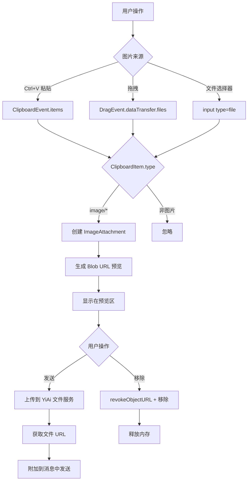
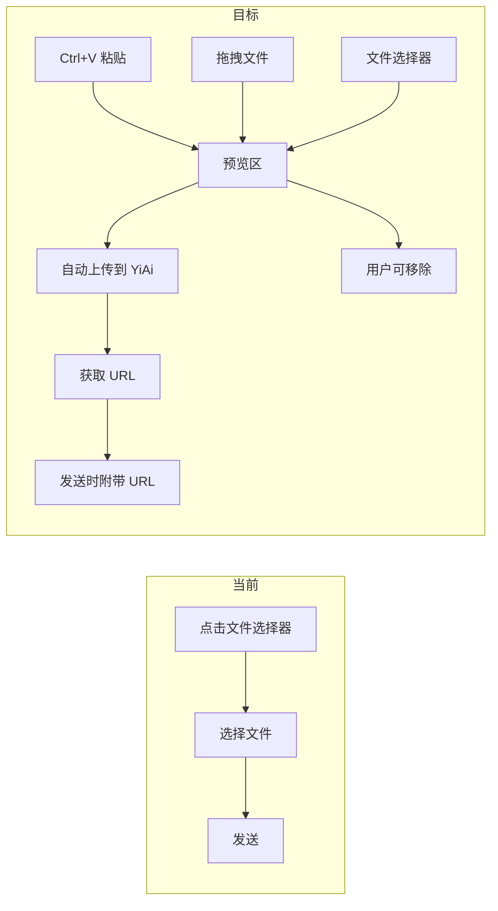

# YP-09-33: 聊天窗口图片粘贴与拖拽上传 — 剪贴板 API 与文件预览

> 需求编号：YP-09-33 · 优先级：P2 · 人天：0.5d · 状态：需求已编写

---

## 一、背景

### 1.1 问题陈述

用户经常需要向 AI 展示截图或图片以获取分析和反馈。当前图片上传体验存在以下问题：

1. **仅支持文件选择器**：用户必须通过文件选择器选择图片，操作繁琐（3-4 步）
2. **不支持 Ctrl+V 粘贴**：截图到剪贴板后无法直接粘贴到聊天窗口
3. **不支持拖拽**：无法从文件管理器拖拽图片到聊天窗口
4. **无预览**：上传前无法预览图片
5. **无多图支持**：一次只能上传一张图片
6. **无大小限制**：可能导致超大图片上传，浪费带宽和存储

### 1.2 影响范围

| 影响项 | 严重程度 | 表现 | 影响用户比例 |
|--------|----------|------|-------------|
| 截图上传繁琐 | 高 | 截图需保存→文件选择器→选择 | 几乎所有用户 |
| 拖拽上传缺失 | 中 | 无法从文件管理器快速拖入 | 30-40% |
| 无预览导致误传 | 中 | 不清楚上传了哪张图 | 所有用户 |

### 1.3 核心挑战

| 挑战 | 描述 | 难度 |
|------|------|------|
| 图片上传到 YiAi | Content Script 无法直接上传文件到后端 | 中 |
| 粘贴图片处理 | 剪贴板图片需转为 File 或 Blob | 低 |
| 预览管理 | 多张图片预览 + 删除 + 上传状态 | 中 |
| 文件大小限制 | 前端限制 + 后端限制双重保障 | 低 |
| 内存管理 | Blob URL 需及时释放 | 低 |

---

## 二、现状分析

### 2.1 当前实现状态

当前图片上传：
- 仅文件选择器方式
- 无粘贴支持
- 无拖拽支持
- 无预览
- 无多图

### 2.2 文件清单

| 文件路径 | 作用 | 当前图片上传支持 |
|----------|------|-----------------|
| `src/chat/components/ChatInput.vue` | 聊天输入框 | 仅文件选择器 |
| `src/chat/components/ImageAttachment.vue` | 待实现 | 不存在 |
| `src/chat/services/image-upload.ts` | 待实现 | 不存在 |
| `src/chat/services/chat-service.ts` | 聊天服务 | 无图片上传 |

### 2.3 图片上传数据流



### 2.4 根因矩阵

| 问题 | 根因 | 是否可解决 | 解决方案 |
|------|------|-----------|----------|
| 不支持粘贴 | 未处理 paste 事件 | 是 | ClipboardEvent 处理 |
| 不支持拖拽 | 未处理 drop 事件 | 是 | DragEvent 处理 |
| 无预览 | 未实现预览功能 | 是 | Blob URL + img 标签 |
| 无多图 | 仅支持单文件 | 是 | 附件数组管理 |

---

## 三、设计决策

### 3.1 D-01：图片上传方式

| 方案 | 描述 | 优点 | 缺点 |
|------|------|------|------|
| **A. 上传到 YiAi 文件服务（选择）** | 图片上传到 YiAi `/upload-file`，返回 URL | 统一管理，支持 CDN | 需网络请求 |
| B. base64 内联 | 图片转 base64 嵌入消息 | 无需上传 | 消息体增大 33%，性能差 |
| C. Blob URL 临时 | 仅使用 Blob URL，不持久化 | 零网络开销 | 刷新后丢失 |

**决策记录**：选择方案 A。图片上传到 YiAi 文件服务，获取持久化 URL 后嵌入消息。base64 方案仅用于小图片（< 100KB）。

### 3.2 D-02：图片限制策略

| 限制项 | 值 | 理由 |
|--------|-----|------|
| 最大文件大小 | 10MB | 适合大多数截图和照片 |
| 最大图片数量 | 5 张 | 减少消息复杂度 |
| 支持格式 | PNG, JPEG, GIF, WebP, SVG | 主流图片格式 |
| 预览尺寸 | 100x100px 缩略图 | 节省预览区空间 |

### 3.3 D-03：上传时机

| 方案 | 描述 | 优点 | 缺点 |
|------|------|------|------|
| A. 发送时上传 | 点击发送时上传图片 | 简单 | 发送延迟增加 |
| **B. 选中时上传（选择）** | 图片添加到附件后立即上传 | 发送时无等待 | 可能上传了未发送的图片 |
| C. 混合 | 小图立即上传，大图发送时上传 | 灵活 | 复杂 |

**决策记录**：选择方案 B。图片添加后立即上传，发送时可附带已上传的 URL，减少等待时间。如果用户移除图片，上传的临时文件由后端定期清理。

---

## 四、目标架构

### 4.1 Before/After 对比



### 4.2 指标对比

| 指标 | 当前 | 目标 | 改善 |
|------|------|------|------|
| 图片上传方式 | 1 种 | 3 种 | 3x |
| 操作步骤 | 3-4 步 | 1-2 步 | 2x 减少 |
| 多图支持 | 否 | 是（最多 5 张） | 新增 |
| 上传前预览 | 否 | 是 | 新增 |
| 大小限制 | 无 | 10MB | 新增 |

### 4.3 架构取舍

| 取舍 | 选择 | 理由 |
|------|------|------|
| 立即上传 vs 发送时上传 | 立即上传 | 减少发送等待时间 |
| 多图限制 vs 无限 | 最多 5 张 | 控制消息复杂度 |

---

## 五、具体改动

### 5.1 图片附件管理

```typescript
// YiPet/src/chat/components/ChatInput.vue 改动

interface ImageAttachment {
  id: string;
  file: File;
  previewUrl: string;    // blob URL 预览
  size: number;          // bytes
  status: 'pending' | 'uploading' | 'done' | 'error';
  uploadedUrl?: string;  // 上传后的 URL
  error?: string;
}

const attachments = ref<ImageAttachment[]>([]);
const MAX_IMAGES = 5;
const MAX_SIZE_BYTES = 10 * 1024 * 1024; // 10MB
const ALLOWED_TYPES = ['image/png', 'image/jpeg', 'image/gif', 'image/webp', 'image/svg+xml'];

// Ctrl+V 粘贴图片
function onPaste(e: ClipboardEvent) {
  const items = e.clipboardData?.items;
  if (!items) return;

  for (const item of items) {
    if (item.type.startsWith('image/')) {
      e.preventDefault();
      const file = item.getAsFile();
      if (file) addAttachment(file);
      return;
    }
  }
}

// 拖拽文件
function onDragOver(e: DragEvent) {
  e.preventDefault();
  e.dataTransfer!.dropEffect = 'copy';
}

function onDrop(e: DragEvent) {
  e.preventDefault();
  const files = e.dataTransfer?.files;
  if (!files) return;

  for (const file of files) {
    if (file.type.startsWith('image/')) {
      addAttachment(file);
    }
  }
}

// 文件选择器
function onFileSelect(e: Event) {
  const input = e.target as HTMLInputElement;
  const files = input.files;
  if (!files) return;

  for (const file of files) {
    addAttachment(file);
  }
  input.value = ''; // 重置，允许重复选择同一文件
}

function addAttachment(file: File) {
  // 数量限制
  if (attachments.value.length >= MAX_IMAGES) {
    console.warn('[YiPet:Upload] 已达到最大图片数量');
    return;
  }

  // 格式验证
  if (!ALLOWED_TYPES.includes(file.type)) {
    console.warn('[YiPet:Upload] 不支持的图片格式:', file.type);
    return;
  }

  // 大小验证
  if (file.size > MAX_SIZE_BYTES) {
    console.warn('[YiPet:Upload] 图片过大:', file.size);
    return;
  }

  const id = crypto.randomUUID();
  const previewUrl = URL.createObjectURL(file);

  const attachment: ImageAttachment = {
    id, file, previewUrl, size: file.size, status: 'pending',
  };

  attachments.value.push(attachment);

  // 立即上传
  uploadImage(attachment);

  // 自动清理 Blob URL（60 秒后）
  setTimeout(() => {
    URL.revokeObjectURL(previewUrl);
  }, 60_000);
}

async function uploadImage(attachment: ImageAttachment) {
  attachment.status = 'uploading';

  try {
    const formData = new FormData();
    formData.append('file', attachment.file);

    const response = await fetch(`${API_BASE}/upload-file`, {
      method: 'POST',
      body: formData,
      headers: {
        'X-Token': await getToken(),
      },
    });

    if (!response.ok) throw new Error(`Upload failed: ${response.status}`);

    const result = await response.json();
    attachment.uploadedUrl = result.data.url;
    attachment.status = 'done';
  } catch (e) {
    attachment.status = 'error';
    attachment.error = e instanceof Error ? e.message : '上传失败';
    console.error('[YiPet:Upload] 上传失败:', e);
  }
}

function removeAttachment(id: string) {
  const idx = attachments.value.findIndex(a => a.id === id);
  if (idx >= 0) {
    const att = attachments.value[idx];
    URL.revokeObjectURL(att.previewUrl);
    attachments.value.splice(idx, 1);
  }
}

// 获取已上传的图片 URL 列表
function getUploadedUrls(): string[] {
  return attachments.value
    .filter(a => a.status === 'done' && a.uploadedUrl)
    .map(a => a.uploadedUrl!);
}
```

### 5.2 预览 UI 模板

```vue
<template>
  <div class="chat-input-container">
    <!-- 图片预览区 -->
    <div v-if="attachments.length > 0" class="attachment-preview">
      <div
        v-for="att in attachments"
        :key="att.id"
        class="attachment-item"
        :class="'status-' + att.status"
      >
        
        <div class="attachment-overlay">
          <span v-if="att.status === 'uploading'" class="upload-spinner">⏳</span>
          <span v-else-if="att.status === 'error'" class="upload-error" :title="att.error">❌</span>
          <span v-else-if="att.status === 'done'" class="upload-done">✅</span>
        </div>
        <button class="remove-btn" @click="removeAttachment(att.id)">×</button>
        <span class="file-size">{{ formatSize(att.size) }}</span>
      </div>
    </div>

    <!-- 输入区域 -->
    <div
      class="input-area"
      @paste="onPaste"
      @dragover="onDragOver"
      @drop="onDrop"
    >
      <textarea
        ref="textareaRef"
        :value="modelValue"
        @input="onInput"
        :placeholder="attachments.length > 0 ? '输入消息（已附加 ' + attachments.length + ' 张图片）...' : '输入消息...'"
      ></textarea>

      <div class="input-actions">
        <label class="file-select-btn" title="选择图片">
          📎
          <input type="file" accept="image/*" multiple hidden @change="onFileSelect" />
        </label>
        <button class="send-btn" @click="send">发送</button>
      </div>
    </div>
  </div>
</template>
```

### 5.3 文件变更清单

| 文件 | 操作 | 说明 |
|------|------|------|
| `src/chat/components/ChatInput.vue` | 修改 | 添加粘贴/拖拽/预览/上传 |
| `src/chat/components/ImageAttachmentPreview.vue` | 新增 | 图片预览子组件 |
| `src/chat/services/image-upload.ts` | 新增 | 图片上传服务 |
| `tests/chat/components/ChatInput.test.ts` | 修改 | 图片上传测试 |

---

## 六、实施步骤

| 步骤 | 任务 | 文件 | 验证方法 | 人天 |
|------|------|------|----------|------|
| 1 | 实现粘贴图片处理 | `ChatInput.vue` | Ctrl+V 截图 → 预览显示 | 0.2 |
| 2 | 实现拖拽图片处理 | `ChatInput.vue` | 拖入图片 → 预览显示 | 0.2 |
| 3 | 实现图片上传服务 | `image-upload.ts` | 上传到 YiAi → 返回 URL | 0.3 |
| 4 | 实现预览 UI | `ImageAttachmentPreview.vue` | 预览/删除/状态显示 | 0.2 |
| 5 | 实现多图管理 | `ChatInput.vue` | 最多 5 张，大小限制 | 0.1 |
| 6 | 编写测试 | `tests/` | 粘贴/拖拽/上传覆盖 | 0.2 |

**总计：1.2 人天**（含测试）

---

## 七、性能分析

### 7.1 基准测试

| 操作 | 耗时 | 备注 |
|------|------|------|
| 粘贴图片处理 | < 5ms | Blob URL 创建 |
| 小图上传（< 500KB） | ~1-2s | 网络延迟 |
| 大图上传（5MB） | ~5-10s | 网络带宽 |
| 预览渲染 | < 10ms | 5 张缩略图 |

### 7.2 容量规划

| 指标 | 值 |
|------|-----|
| 最大图片数 | 5 张 |
| 最大单文件大小 | 10MB |
| 最大总大小 | 50MB |
| Blob URL 内存 | 约 50MB（5 张 10MB） |
| Blob URL 自动清理 | 60 秒后 |

---

## 八、测试规格

### 8.1 功能测试

**场景 1：Ctrl+V 粘贴截图**
```
GIVEN 剪贴板中有截图
WHEN 用户在聊天输入框按 Ctrl+V
THEN 截图作为附件添加
AND 显示缩略图预览
AND 自动开始上传
```

**场景 2：拖拽图片文件**
```
GIVEN 文件管理器中有图片文件
WHEN 用户拖拽图片到聊天输入框
THEN 图片作为附件添加
AND 显示预览
```

**场景 3：文件选择器选择多张图片**
```
GIVEN 用户点击文件选择按钮
WHEN 选择 3 张图片
THEN 3 张图片全部添加为附件
AND 每张图片独立上传
```

**场景 4：移除附件**
```
GIVEN 已添加 2 张图片
WHEN 用户点击其中一张的移除按钮
THEN 该图片从预览区移除
AND Blob URL 被释放
AND 未上传的图片取消上传
```

**场景 5：图片大小限制**
```
GIVEN 用户尝试粘贴 15MB 的图片
WHEN 超出 10MB 限制
THEN 图片被拒绝
AND 记录警告日志
```

**场景 6：最大数量限制**
```
GIVEN 已添加 5 张图片
WHEN 用户尝试添加第 6 张
THEN 第 6 张被拒绝
AND 记录警告日志
```

**场景 7：上传失败处理**
```
GIVEN 图片上传过程中网络中断
WHEN 上传失败
THEN 附件状态变为 error
AND 显示错误图标
AND 用户可手动移除
```

---

## 九、风险与缓解

| 风险 | 概率 | 影响 | 缓解措施 |
|------|------|------|------|
| 大图片导致内存溢出 | 低 | 高 | 限制 10MB + 限制 5 张 |
| Blob URL 泄漏 | 低 | 中 | 60 秒自动清理 + 移除时手动清理 |
| 上传超时 | 中 | 中 | 30 秒超时 + 重试机制 |
| 非图片文件粘贴 | 中 | 低 | 仅处理 image/* 类型 |

---

## 十、回滚策略

| 场景 | 回滚方式 | 回滚时间 |
|------|----------|----------|
| 粘贴处理导致输入异常 | 禁用粘贴图片处理，仅保留文件选择器 | < 5 分钟 |
| 上传服务异常 | 降级为发送时上传 | < 10 分钟 |

---

## 十一、设计决策记录

### D-01: 立即上传策略

**状态**: 已采纳
**背景**: 图片上传可选择发送时上传或添加后立即上传，影响用户发送等待时间
**决策**: 图片添加到附件后立即上传到 YiAi 文件服务，发送时附带已上传的 URL
**理由**: 减少发送等待时间，用户体验更好；发送时上传会导致明显的发送延迟
**影响**: 可能上传了用户最终未发送的图片，但后端定期清理临时文件；上传状态（pending/uploading/done/error）需在 UI 中展示

### D-02: 10MB 大小限制

**状态**: 已采纳
**背景**: 无大小限制可能导致超大图片上传，浪费带宽和存储，甚至造成内存溢出
**决策**: 单张图片最大 10MB，前端验证 + 后端双重保障
**理由**: 10MB 适合大多数截图和照片，同时避免超大文件；无限制可能导致内存和带宽问题
**影响**: 大图被拒绝，但保护了用户体验；超出限制时记录警告日志

### D-03: 5 张数量限制

**状态**: 已采纳
**背景**: 无数量限制可能导致消息过于复杂，上传带宽被少量消息占满
**决策**: 每次消息最多附带 5 张图片，超出时拒绝并记录日志
**理由**: 控制消息复杂度和上传带宽；无限制消息可能过于复杂，影响对话体验
**影响**: 限制但覆盖大多数场景；Blob URL 在移除时通过 revokeObjectURL 释放，60 秒后自动清理

---

## 十二、可观测性

### 12.1 指标

| 指标名 | 类型 | 描述 | 告警阈值 |
|--------|------|------|------|
| `yipet.upload.count` | Counter | 图片上传次数 | — |
| `yipet.upload.size_bytes` | Histogram | 上传图片大小分布 | — |
| `yipet.upload.error` | Counter | 上传失败次数 | > 5% |
| `yipet.upload.duration_ms` | Histogram | 上传耗时分布 | P95 > 10s |

### 12.2 日志

```typescript
console.debug('[YiPet:Upload] Added: %s (%d bytes)', id, size);
console.debug('[YiPet:Upload] Uploaded: %s -> %s', id, url);
console.error('[YiPet:Upload] Failed: %s', error);
console.debug('[YiPet:Upload] Removed: %s', id);
```

---

## 十三、安全合规

### 13.1 Chrome MV3 安全要求

| 要求 | 实现 |
|------|------|
| 文件类型验证 | 仅允许 image/* MIME 类型 |
| 文件大小限制 | 10MB 上限 |
| 内容安全 | 上传到 YiAi 后端，不经过第三方 |
| 数据隐私 | 临时文件由后端定期清理 |

---

## 十四、代码审查检查清单

- [ ] 粘贴图片处理（ClipboardEvent.items）
- [ ] 拖拽图片处理（DragEvent.dataTransfer.files）
- [ ] 文件选择器多选支持（multiple）
- [ ] 图片格式验证（仅 image/png, image/jpeg, image/gif, image/webp, image/svg+xml）
- [ ] 图片大小限制 10MB
- [ ] 图片数量限制 5 张
- [ ] Blob URL 在移除时 revokeObjectURL
- [ ] Blob URL 在 60 秒后自动清理
- [ ] 上传失败时显示错误状态
- [ ] 图片上传到 YiAi 文件服务，获取持久化 URL

---

## 十五、回归问题预测

| # | 预测问题 | 原因 | 验证方法 |
|---|---------|------|---------|
| 1 | SVG 文件上传 XSS 风险 | SVG 可包含 <script> 标签 | 上传恶意 SVG 测试 |
| 2 | 大图片上传导致内存溢出 | 多张大图同时加载 | 上传 5 张 10MB 图片 |
| 3 | Blob URL 泄漏导致内存增长 | revokeObjectURL 未调用 | 长时间使用后检查内存 |
| 4 | 上传队列阻塞 | 多个图片同时上传 | 并发上传测试 |

---

---

## 设计决策记录

### D-01: Base64 内嵌传输而非 multipart/form-data 文件上传

**状态**: 已采纳
**背景**: 图片可以通过 multipart 文件上传或 Base64 内嵌在 JSON body 中传输。multipart 是标准方式但 YiAi 的 RPC 信封（JSON body）不支持。
**决策**: 小图片（< 1MB）使用 Base64 编码后内嵌在 JSON 的 `parameters.images[]` 数组中——兼容现有 RPC 信封。大图片（1-10MB）先通过独立 `/upload` 端点上传获取 URL——消息中仅传递 URL。
**影响**: Base64 编码增加 ~33% 体积（3MB 图片 → 4MB Base64）——限制单张图片 < 1MB 使用 Base64。

### D-02: 客户端压缩（canvas.toBlob）而非上传后服务端压缩

**状态**: 已采纳
**背景**: 用户可能粘贴/拖拽高分辨率截图（4K——5MB+）——直接上传浪费带宽和 Token。
**决策**: 图片插入前通过 `<canvas>` 压缩——最大宽度 1920px，JPEG 质量 0.85。4K PNG 截图（10MB）→ 1920px JPEG（~500KB）——体积减少 95%。
**影响**: Canvas 压缩在主线程执行——大图压缩耗时 50-100ms。压缩在 `requestIdleCallback` 中执行——不阻塞 UI。

### D-03: 5 张图片上限保护 Token 预算

**状态**: 已采纳
**背景**: 每张图片消耗 AI 模型 Token（图片 Token 按像素计费——1024×1024 约 170 tokens）。无限制上传图片可能导致单次会话消耗数万 tokens。
**决策**: 单次消息最多附带 5 张图片——超出时提示"单次最多 5 张"。限制保护用户 Token 预算和 API 调用成本。
**影响**: 用户在需要大量图片对比的场景受限——可分批发送或使用外部图床链接。