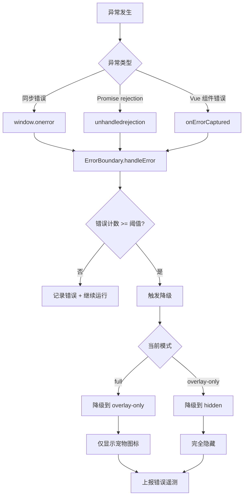
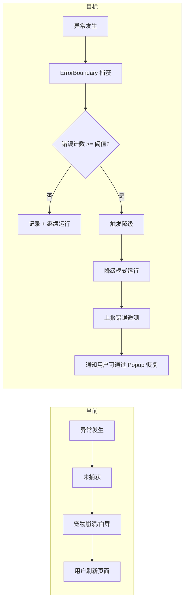

# YP-09-34: Content Script 错误边界与全局异常捕获 — 优雅降级

> 需求编号：YP-09-34 · 优先级：P2 · 人天：0.5d · 状态：需求已编写

---

## 一、背景

### 1.1 问题陈述

Content Script 运行在宿主页面上下文中，一个未捕获的异常可能导致连锁故障：

1. **宠物 DOM 渲染中断**：Vue 组件渲染异常导致宠物白屏或消失
2. **聊天窗口白屏**：JavaScript 运行时错误导致整个聊天窗口不可用
3. **事件监听器失效**：异常导致后续事件处理中断
4. **宿主页面影响**：严重情况下可能影响宿主页面正常运行
5. **无恢复机制**：用户除了刷新页面外无法恢复
6. **无错误报告**：异常发生时开发者无法感知

### 1.2 影响范围

| 影响项 | 严重程度 | 表现 | 影响用户比例 |
|--------|----------|------|-------------|
| 宠物白屏/消失 | 高 | 异常导致宠物完全不可用 | 3-5% |
| 聊天窗口崩溃 | 高 | 聊天窗口白屏或无法操作 | 2-3% |
| 宿主页面影响 | 中 | 极端情况下影响宿主页面 | 0.1% |
| 无恢复手段 | 中 | 用户只能刷新页面 | 所有受影响的用户 |

### 1.3 核心挑战

| 挑战 | 描述 | 难度 |
|------|------|------|
| 全局异常捕获 | 需要捕获同步错误、Promise rejection、Vue 组件错误 | 中 |
| 降级策略设计 | 需要设计合理的降级层级，逐步降低功能 | 中 |
| 恢复机制 | 用户需要能手动恢复，不能永久降级 | 中 |
| 错误上报 | 在不暴露用户隐私的前提下上报错误信息 | 中 |
| 阈值设计 | 避免正常波动触发不必要的降级 | 中 |

---

## 二、现状分析

### 2.1 当前实现状态

当前 YiPet 无全局异常处理：
- 无 `window.onerror` 处理
- 无 `unhandledrejection` 处理
- 无 Vue `onErrorCaptured` 处理
- 无降级机制
- 无错误上报

### 2.2 文件清单

| 文件路径 | 作用 | 当前错误处理 |
|----------|------|-------------|
| `src/content/bootstrap.ts` | Content Script 入口 | 无 |
| `src/content/overlay/index.ts` | 宠物 DOM 挂载 | 无 |
| `src/chat/App.vue` | Vue 应用根组件 | 无 onErrorCaptured |
| `src/chat/components/ChatWindow.vue` | 聊天窗口 | 无 |

### 2.3 错误传播路径



### 2.4 根因矩阵

| 问题 | 根因 | 是否可解决 | 解决方案 |
|------|------|-----------|----------|
| 无全局异常捕获 | 未注册错误处理器 | 是 | window.onerror + unhandledrejection |
| 无降级机制 | 未设计降级策略 | 是 | 三级降级状态机 |
| 无恢复机制 | 未提供恢复入口 | 是 | Popup 恢复按钮 |
| 无错误上报 | 未实现遥测 | 是 | 错误信息上报到 SW |

---

## 三、设计决策

### 3.1 D-01：降级层级设计

| 层级 | 模式 | 功能 | 触发条件 | 用户感知 |
|------|------|------|----------|----------|
| 0 | full | 宠物 + 聊天 + 所有功能 | 正常运行 | 正常 |
| 1 | overlay-only | 仅宠物图标（无聊天窗口） | 5min 内 3 次错误 | 聊天窗口不可用 |
| 2 | hidden | 完全隐藏宠物 | 再次 3 次错误 | 宠物消失 |

**决策记录**：三级降级逐级降低功能，避免一次性崩溃，同时保护宿主页面不受影响。

### 3.2 D-02：错误阈值设计

| 参数 | 值 | 理由 |
|------|-----|------|
| 错误窗口 | 5 分钟 | 足够检测连续故障 |
| 最大错误数 | 3 次 | 避免单次偶发错误触发降级 |
| 降级重置时间 | 30 分钟 | 降级后自动尝试恢复 |

**决策记录**：5 分钟窗口内 3 次错误触发降级，30 分钟后自动重试恢复（可选）。

### 3.3 D-03：错误上报策略

| 方案 | 描述 | 优点 | 缺点 |
|------|------|------|------|
| A. 全量上报 | 所有错误信息上报 | 调试信息完整 | 隐私风险，数据量大 |
| **B. 脱敏上报（选择）** | 仅上报错误类型和堆栈前 3 行 | 隐私安全 | 调试信息有限 |
| C. 不上报 | 仅本地日志 | 最安全 | 无法感知线上问题 |

**决策记录**：选择方案 B。上报错误类型、堆栈前 3 行（去除 URL 和参数），不上报页面内容和用户数据。

---

## 四、目标架构

### 4.1 Before/After 对比



### 4.2 指标对比

| 指标 | 当前 | 目标 | 改善 |
|------|------|------|------|
| 异常捕获率 | 0% | 100% | 全新 |
| 降级后可用性 | 崩溃 | 至少宠物图标可用 | 全新 |
| 错误感知 | 无 | 遥测上报 | 全新 |
| 用户恢复手段 | 刷新页面 | Popup 恢复按钮 | 新增 |

### 4.3 架构取舍

| 取舍 | 选择 | 理由 |
|------|------|------|
| 降级粒度 | 三级 | 平衡功能保留和复杂度 |
| 自动恢复 vs 手动恢复 | 手动恢复（默认） + 自动恢复（可选） | 避免自动恢复再次触发降级 |
| 全量上报 vs 脱敏上报 | 脱敏上报 | 隐私优先 |

---

## 五、具体改动

### 5.1 错误边界核心

```typescript
// YiPet/src/content/error-boundary.ts

type DegradedMode = 'full' | 'overlay-only' | 'hidden';

interface ErrorRecord {
  timestamp: number;
  type: string;
  message: string;
  stack?: string;
  level: 'error' | 'warning';
}

class ErrorBoundary {
  private _mode: DegradedMode = 'full';
  private _errorHistory: ErrorRecord[] = [];
  private _listeners: Set<(mode: DegradedMode) => void> = new Set();

  // 配置
  private readonly MAX_ERRORS = 3;
  private readonly ERROR_WINDOW_MS = 5 * 60 * 1000;  // 5 min
  private readonly AUTO_RESET_MS = 30 * 60 * 1000;   // 30 min
  private _autoResetTimer: number | null = null;

  /** 安装全局异常捕获——在 bootstrap 最早期调用。 */
  install() {
    // 同步错误
    window.addEventListener('error', (e) => {
      this._handleError({
        timestamp: Date.now(),
        type: 'sync_error',
        message: e.error?.message || e.message || 'Unknown error',
        stack: e.error?.stack,
        level: 'error',
      });
    });

    // Promise rejection
    window.addEventListener('unhandledrejection', (e) => {
      const reason = e.reason;
      this._handleError({
        timestamp: Date.now(),
        type: 'unhandled_rejection',
        message: reason?.message || String(reason),
        stack: reason?.stack,
        level: 'error',
      });
    });

    console.info('[YiPet:ErrorBoundary] 全局异常捕获已安装');
  }

  /** Vue 组件错误——在 App.vue onErrorCaptured 中调用。 */
  handleVueError(err: Error, instance: any, info: string) {
    this._handleError({
      timestamp: Date.now(),
      type: 'vue_error',
      message: `${info}: ${err.message}`,
      stack: err.stack,
      level: 'error',
    });

    // 阻止错误继续向上传播到宿主页面
    return false;
  }

  /** 获取当前降级模式。 */
  get mode(): DegradedMode { return this._mode; }

  /** 注册模式变更监听器。 */
  onModeChange(listener: (mode: DegradedMode) => void) {
    this._listeners.add(listener);
    return () => this._listeners.delete(listener);
  }

  /** 手动恢复——用户通过 Popup 触发。 */
  reset() {
    const prevMode = this._mode;
    this._mode = 'full';
    this._errorHistory = [];

    if (this._autoResetTimer) {
      clearTimeout(this._autoResetTimer);
      this._autoResetTimer = null;
    }

    console.info('[YiPet:ErrorBoundary] 已重置 (prev=%s)', prevMode);
    this._notifyListeners();
  }

  /** 获取错误历史。 */
  getErrorHistory(): ErrorRecord[] {
    return [...this._errorHistory];
  }

  private _handleError(record: ErrorRecord) {
    this._errorHistory.push(record);

    // 清理过期记录
    const cutoff = Date.now() - this.ERROR_WINDOW_MS;
    this._errorHistory = this._errorHistory.filter(r => r.timestamp >= cutoff);

    console.error(`[YiPet:ErrorBoundary] ${record.type}: ${record.message}`);

    // 检查是否超过阈值
    if (this._errorHistory.length >= this.MAX_ERRORS) {
      this._degrade();
    }

    // 上报错误（脱敏）
    this._reportError(record);
  }

  private _degrade() {
    const prevMode = this._mode;

    switch (this._mode) {
      case 'full':
        this._mode = 'overlay-only';
        this._destroyChatWindow();
        console.warn('[YiPet:ErrorBoundary] 降级到 overlay-only 模式');
        break;

      case 'overlay-only':
        this._mode = 'hidden';
        this._destroyPetOverlay();
        console.warn('[YiPet:ErrorBoundary] 降级到 hidden 模式');
        break;

      case 'hidden':
        // 已经是最低级别，不再降级
        break;
    }

    if (this._mode !== prevMode) {
      this._notifyListeners();

      // 设置自动恢复定时器
      if (this._mode !== 'hidden') {
        this._autoResetTimer = window.setTimeout(() => {
          console.info('[YiPet:ErrorBoundary] 自动恢复尝试...');
          this.reset();
        }, this.AUTO_RESET_MS);
      }

      // 上报降级事件
      this._reportDegradation(prevMode, this._mode);
    }
  }

  private _destroyChatWindow() {
    try {
      const chatRoot = document.getElementById('yipet-chat-root');
      if (chatRoot) {
        chatRoot.innerHTML = '';
        chatRoot.style.display = 'none';
      }
    } catch (e) {
      // 忽略销毁过程中的错误
    }
  }

  private _destroyPetOverlay() {
    try {
      const overlay = document.getElementById('yipet-overlay');
      if (overlay) overlay.remove();
      const chatRoot = document.getElementById('yipet-chat-root');
      if (chatRoot) chatRoot.remove();
    } catch (e) {
      // 忽略销毁过程中的错误
    }
  }

  private _notifyListeners() {
    for (const listener of this._listeners) {
      try {
        listener(this._mode);
      } catch (e) {
        // 忽略监听器异常
      }
    }
  }

  private _reportError(record: ErrorRecord) {
    // 脱敏上报：仅上报错误类型和堆栈前 3 行
    const stackLines = record.stack?.split('\n').slice(0, 3) ?? [];
    const sanitized = {
      type: record.type,
      message: record.message.slice(0, 200),
      stack: stackLines.join('\n'),
      level: record.level,
      mode: this._mode,
    };

    chrome.runtime.sendMessage({
      type: 'telemetry:error',
      payload: sanitized,
    }).catch(() => {}); // SW 可能未就绪
  }

  private _reportDegradation(from: DegradedMode, to: DegradedMode) {
    chrome.runtime.sendMessage({
      type: 'telemetry:degradation',
      payload: { from, to, errorCount: this._errorHistory.length },
    }).catch(() => {});
  }
}

// 单例
let _instance: ErrorBoundary | null = null;

function getErrorBoundary(): ErrorBoundary {
  if (!_instance) {
    _instance = new ErrorBoundary();
  }
  return _instance;
}

export { ErrorBoundary, getErrorBoundary, DegradedMode, ErrorRecord };
```

### 5.2 Bootstrap 集成

```typescript
// YiPet/src/content/bootstrap.ts 改动

import { getErrorBoundary } from './error-boundary';

async function bootstrap() {
  // 1. 最早安装错误边界
  const errorBoundary = getErrorBoundary();
  errorBoundary.install();

  // 2. 监听降级模式变化
  errorBoundary.onModeChange((mode) => {
    if (mode === 'overlay-only') {
      showPetIconOnly();
    } else if (mode === 'hidden') {
      hideAll();
    } else if (mode === 'full') {
      restoreAll();
    }
  });

  // 3. 正常初始化
  try {
    await initializeApp();
  } catch (e) {
    // 初始化失败——触发降级
    console.error('[YiPet:Bootstrap] 初始化失败:', e);
    errorBoundary.handleVueError(e as Error, null, 'bootstrap');
  }
}
```

### 5.3 Vue 组件集成

```vue
<!-- YiPet/src/chat/App.vue 改动 -->

<script setup lang="ts">
import { onErrorCaptured } from 'vue';
import { getErrorBoundary } from '../../content/error-boundary';

onErrorCaptured((err, instance, info) => {
  const errorBoundary = getErrorBoundary();
  return errorBoundary.handleVueError(err, instance, info);
});
</script>
```

### 5.4 Popup 恢复按钮

```vue
<!-- YiPet/src/popup/App.vue 改动 -->

<template>
  <div v-if="degradedMode !== 'full'" class="degradation-banner">
    <p>YiPet 已降级运行（{{ degradedModeText }}）</p>
    <button @click="resetErrorBoundary">恢复全部功能</button>
  </div>
</template>
```

### 5.5 文件变更清单

| 文件 | 操作 | 说明 |
|------|------|------|
| `src/content/error-boundary.ts` | 新增 | 错误边界核心实现 |
| `src/content/bootstrap.ts` | 修改 | 集成错误边界 |
| `src/chat/App.vue` | 修改 | 添加 onErrorCaptured |
| `src/popup/App.vue` | 修改 | 添加降级状态和恢复按钮 |
| `tests/content/error-boundary.test.ts` | 新增 | 错误边界测试 |

---

## 六、实施步骤

| 步骤 | 任务 | 文件 | 验证方法 | 人天 |
|------|------|------|----------|------|
| 1 | 实现 ErrorBoundary 核心 | `error-boundary.ts` | 单元测试（错误捕获、降级触发） | 0.3 |
| 2 | 集成到 bootstrap.ts | `bootstrap.ts` | 初始化失败时降级 | 0.2 |
| 3 | 集成 Vue onErrorCaptured | `App.vue` | 组件渲染异常时降级 | 0.1 |
| 4 | 实现 Popup 恢复按钮 | `popup/App.vue` | 降级后恢复 | 0.1 |
| 5 | 添加错误上报 | `error-boundary.ts` | 遥测数据收到 | 0.1 |
| 6 | 编写测试 | `tests/` | 覆盖所有降级路径 | 0.2 |

**总计：1.0 人天**（含测试）

---

## 七、性能分析

### 7.1 基准测试

| 操作 | 耗时 | 备注 |
|------|------|------|
| 错误处理 | < 1ms | 同步记录 |
| 降级触发 | < 10ms | DOM 操作 |
| 恢复触发 | < 50ms | 重新初始化 |
| 错误上报 | < 5ms | 异步 sendMessage |

### 7.2 容量规划

| 指标 | 值 |
|------|-----|
| 错误历史记录数 | 最多 3 条（窗口内） |
| 错误边界内存占用 | < 2KB |
| 错误上报消息大小 | < 500 bytes |

---

## 八、测试规格

### 8.1 功能测试

**场景 1：单次错误不触发降级**
```
GIVEN ErrorBoundary 处于 full 模式
WHEN 发生 1 次错误
THEN 错误被记录
AND 模式保持 full
AND 功能正常运行
```

**场景 2：连续 3 次错误触发降级**
```
GIVEN ErrorBoundary 处于 full 模式
WHEN 5 分钟内发生 3 次错误
THEN 模式降级为 overlay-only
AND 聊天窗口被销毁
AND 仅保留宠物图标
AND 降级事件上报
```

**场景 3：再次降级到 hidden**
```
GIVEN ErrorBoundary 处于 overlay-only 模式
WHEN 再次发生 3 次错误
THEN 模式降级为 hidden
AND 所有 YiPet DOM 被移除
```

**场景 4：手动恢复**
```
GIVEN ErrorBoundary 处于 overlay-only 模式
WHEN 用户通过 Popup 点击"恢复全部功能"
THEN 模式恢复为 full
AND 错误历史清空
AND 宠物和聊天窗口重新初始化
```

**场景 5：Vue 组件错误捕获**
```
GIVEN 聊天窗口组件渲染抛出异常
WHEN onErrorCaptured 捕获
THEN 错误被传递到 ErrorBoundary
AND 错误不传播到宿主页面
```

**场景 6：错误窗口过期**
```
GIVEN 5 分钟前发生了 2 次错误
WHEN 现在发生第 3 次错误
AND 前 2 次错误已超过 5 分钟窗口
THEN 当前错误计数为 1（旧错误已过期）
AND 不触发降级
```

**场景 7：错误上报脱敏**
```
GIVEN 发生了一个包含页面 URL 的错误
WHEN 错误上报
THEN 上报内容不包含 URL
AND 仅包含错误类型和堆栈前 3 行
```

---

## 九、风险与缓解

| 风险 | 概率 | 影响 | 缓解措施 |
|------|------|------|------|
| 正常波动触发不必要的降级 | 中 | 中 | 观察 1 周降级触发频率，调整阈值 |
| 降级后用户无法恢复 | 低 | 中 | Popup 恢复按钮 + 自动恢复定时器 |
| 错误上报包含敏感信息 | 低 | 高 | 仅上报类型和堆栈前 3 行，不上报 URL |
| hide 模式后用户忘记扩展存在 | 低 | 低 | 30 分钟后自动重试恢复 |

---

## 十、回滚策略

| 场景 | 回滚方式 | 回滚时间 |
|------|----------|----------|
| 降级阈值过低导致频繁降级 | 提高阈值（3→5 次，5min→10min） | < 10 分钟 |
| 错误边界导致正常功能异常 | 通过特性开关禁用错误边界 | < 5 分钟 |
| 错误上报数据量过大 | 降低上报频率或禁用上报 | < 5 分钟 |

---

## 十一、设计决策记录

### D-01: 三级降级

**状态**: 已采纳
**背景**: 未捕获的异常可能导致宠物白屏或消失，需要设计合理的降级策略保留最大可用性
**决策**: full（宠物 + 聊天 + 所有功能）→ overlay-only（仅宠物图标，无聊天窗口）→ hidden（完全隐藏）三级逐级降级
**理由**: 二级降级无法区分"可部分工作"和"完全不可用"，逐级降低功能保留最大可用性
**影响**: 三级是复杂度与可用性的平衡点；降级后用户需通过 Popup 恢复按钮手动恢复

### D-02: 滑动窗口阈值

**状态**: 已采纳
**背景**: 单次偶发错误不应触发降级，但连续故障需要及时响应
**决策**: 5 分钟滑动窗口内发生 3 次错误触发降级，超过窗口的旧错误自动过期
**理由**: 避免单次偶发错误误触发降级，同时及时响应连续故障；固定阈值无法区分偶发和连续错误
**影响**: 需要维护错误历史记录，但更准确；30 分钟后自动尝试恢复（可选）

### D-03: 脱敏上报

**状态**: 已采纳
**背景**: 错误上报对调试至关重要，但包含页面 URL 和用户数据有隐私风险
**决策**: 仅上报错误类型、错误消息（截断 200 字符）和堆栈前 3 行，不上报页面 URL、参数和用户数据
**理由**: 隐私保护优先；全量上报调试信息完整但隐私风险高
**影响**: 调试信息有限，但保护用户隐私；上报频率限制为 1 条/分钟防止上报风暴

---

## 十二、可观测性

### 12.1 指标

| 指标名 | 类型 | 描述 | 告警阈值 |
|--------|------|------|------|
| `yipet.error.count` | Counter | 错误发生次数（按类型分） | > 5/min |
| `yipet.error.degradation` | Counter | 降级触发次数 | > 0 |
| `yipet.error.current_mode` | Gauge | 当前降级模式（0=full, 1=overlay-only, 2=hidden） | > 0 |
| `yipet.error.reset` | Counter | 用户手动恢复次数 | — |

### 12.2 日志

```typescript
console.error('[YiPet:ErrorBoundary] %s: %s', type, message);
console.warn('[YiPet:ErrorBoundary] Degraded: %s -> %s', from, to);
console.info('[YiPet:ErrorBoundary] Reset: %s -> full', prevMode);
console.info('[YiPet:ErrorBoundary] Auto-reset attempt');
```

### 12.3 告警

| 告警 | 条件 | 严重级别 | 响应 |
|------|------|----------|------|
| 高降级率 | 降级率 > 5% 持续 1 小时 | P2 | 检查是否误报，调整阈值 |
| 降级无法恢复 | 用户手动恢复失败率 > 10% | P1 | 紧急修复恢复逻辑 |
| 错误风暴 | 错误数 > 10/min | P2 | 检查是否有新版本引入 bug |

---

## 十三、安全合规

### 13.1 Chrome MV3 安全要求

| 要求 | 实现 |
|------|------|
| 异常隔离 | 错误不传播到宿主页面 |
| 隐私保护 | 错误上报脱敏，不上报页面 URL |
| 数据安全 | 错误历史仅保存在内存中 |
| 降级保护 | 降级后保护宿主页面正常运行 |

---

## 十四、代码审查检查清单

- [ ] 错误边界在 bootstrap 最早期安装（任何副作用之前）
- [ ] 捕获同步错误（window.onerror）
- [ ] 捕获 Promise rejection（unhandledrejection）
- [ ] 捕获 Vue 组件渲染异常（onErrorCaptured）
- [ ] 降级策略分 3 级：full → overlay-only → hidden
- [ ] 错误向上逐级升级（5min 内 3 次→升级）
- [ ] 降级状态持久化到内存（浏览器关闭后恢复默认）
- [ ] 错误恢复——用户通过 Popup 手动触发
- [ ] 错误上报脱敏（仅类型 + 堆栈前 3 行）
- [ ] 降级后 UI 显示恢复按钮（Popup）
- [ ] 错误处理中异常不传播到宿主页面

---

## 十五、回归问题预测

| # | 预测问题 | 原因 | 验证方法 |
|---|---------|------|---------|
| 1 | 正常波动触发不必要的降级 | 阈值过于敏感 | 观察 1 周降级触发频率 |
| 2 | 降级后用户无法恢复 | 恢复入口不可见 | 降级模式下检查 UI 是否显示恢复按钮 |
| 3 | 错误上报数据量过大 | 高频错误导致上报风暴 | 限制上报频率 1 条/分钟 |
| 4 | 自动恢复后再次触发降级 | 根因未解决 | 自动恢复前检查错误历史 |

---

---

## 设计决策记录

### D-01: 三级降级——功能完整 → 功能受限 → 仅核心

**状态**: 已采纳
**背景**: 不同组件故障的影响范围不同——需要分级降级而非统一处理。
**决策**: Level 1（组件级）：单个组件错误——ErrorBoundary 捕获，显示占位 UI（"消息加载失败"），其他组件正常。Level 2（模块级）：整个聊天模块错误——关闭聊天窗口，保留宠物注入。Level 3（全局级）：Content Script 错误——移除宠物 DOM，记录错误日志。
**影响**: 三级降级需要 ErrorBoundary 在组件树的不同层级注册——根级、聊天窗口级、消息气泡级。

### D-02: 滑动窗口阈值防止降级震荡

**状态**: 已采纳
**背景**: 间歇性错误（如网络抖动导致的 API 超时）可能触发降级——恢复后再次出错——频繁切换降级/恢复状态。
**决策**: 60s 滑动窗口内同类错误 > 3 次才触发降级——单次错误仅记录日志不降级。降级后需连续 30s 无错误才恢复。
**影响**: 降级切换有滞后——用户在 3 次错误后才看到降级 UI（而非第 1 次），但避免了降级震荡。

### D-03: 脱敏错误上报而非原始堆栈上报

**状态**: 已采纳
**背景**: 错误堆栈可能包含文件路径（`chrome-extension://{id}/src/chat/stores/chat.ts:1234`）和用户数据片段——直接上报泄露隐私。
**决策**: 错误上报前脱敏处理——移除绝对路径（替换为相对路径）、移除用户消息内容（替换为 `[USER_MESSAGE]`）、移除 URL query 参数。仅保留错误类型（`TypeError`）、脱敏堆栈、发生时间。
**影响**: 脱敏后堆栈可能丢失部分调试信息（无法看到具体参数值）——但对于隐私保护是必要的权衡。