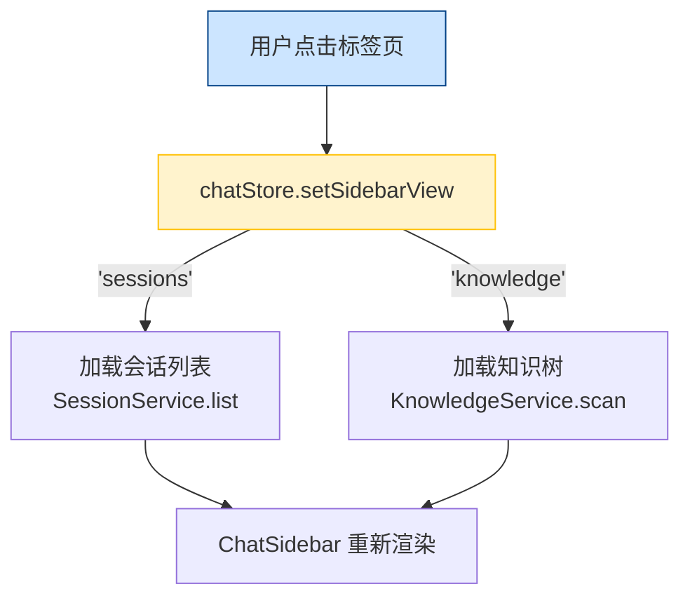
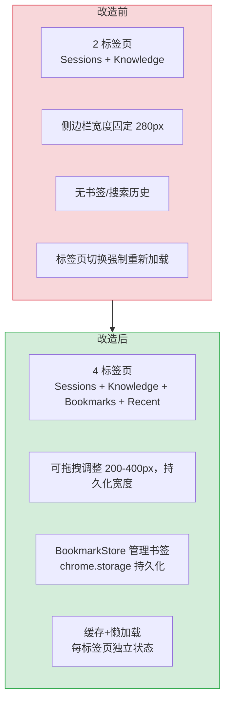

# YP-09-35: 聊天窗口侧边栏功能扩展 — 书签/快速搜索集成

> 需求编号：YP-09-35 · 优先级：P2 · 人天：0.5d · 状态：需求已编写

## 背景

YiPet 聊天窗口的侧边栏（`ChatSidebar.vue`）当前仅支持两个固定标签页：Sessions（会话列表）和 Knowledge（知识树浏览器）。用户在长会话中频繁切换 RAG 范围、快速定位收藏的会话或知识文件时，需要多次点击导航——每次切换 RAG 范围需要打开 Knowledge 标签页、展开目录树、点击叶子节点，整个过程至少 3 次点击。

问题清单：

| # | 问题 | 影响 | 严重程度 |
|---|------|------|----------|
| 1 | 无法收藏常用 RAG 范围 | 每次检索同一知识域需重新导航 | 中 |
| 2 | 无最近搜索记录 | 用户重复搜索相同关键词时需重新输入 | 中 |
| 3 | 侧边栏宽度固定（280px），长路径无法完整显示 | 知识文件路径截断，难以区分相似文件 | 低 |
| 4 | 无书签持久化，浏览器重启后收藏丢失 | 用户偏好未保留 | 中 |
| 5 | 侧边栏标签页间状态不独立 | 切换标签页时 Knowledge 树重新加载 | 低 |

**目标**：将侧边栏从 2 标签页扩展为 4 标签页（Sessions / Knowledge / Bookmarks / Recent），支持书签持久化、最近搜索记录、拖拽调整宽度，每个标签页状态独立管理。

---

## 现状分析

### 当前状态

```
YiPet/src/chat/components/ChatSidebar.vue
  ├── sidebarView: 'sessions' | 'knowledge'  (ChatState)
  ├── sessions[]  — 会话列表渲染
  ├── knowledgeTree[]  — Element Plus Tree 渲染
  ├── 侧边栏宽度固定 280px（无拖拽调整）
  └── 标签页切换时触发 loadKnowledgeTree() 重新加载
```

### 文件清单

| 文件 | 当前状态 | 九月改动 |
|------|----------|----------|
| `src/chat/components/ChatSidebar.vue` | 会话 + 知识树 2 标签页 | 扩展为 4 标签页 + 拖拽调整 |
| `src/chat/stores/chat.ts` | `sidebarView` 仅支持 `'sessions' \| 'knowledge'` | 新增 `'bookmarks' \| 'recent'` |
| `src/chat/types.ts` | 无书签/最近搜索类型 | 新增 `Bookmark`、`RecentSearch` 接口 |
| `src/chat/components/ChatWindow.vue` | 侧边栏宽度固定 | 新增拖拽手柄 + 宽度持久化 |

### 当前数据流



### 根因矩阵

| 问题 | 根因 | 影响范围 |
|------|------|----------|
| 无书签功能 | `ChatState` 未定义 `bookmarks` 字段 | 用户无法收藏 RAG 范围/会话 |
| 无搜索历史 | 搜索输入未持久化到 `chrome.storage.local` | 重复搜索效率低 |
| 宽度固定 | `ChatWindow.vue` 中 Sider 无 resize 逻辑 | 长路径截断 |
| 状态不独立 | `setSidebarView` 总是触发数据重新加载 | 切换标签页时闪烁 |

---

## 设计决策

### 决策 1：书签存储方式 — chrome.storage.local vs Pinia vs IndexedDB

| 选项 | 持久化 | 容量 | 查询 | 复杂度 |
|------|--------|------|------|--------|
| `chrome.storage.local` | 跨会话 | 10MB | 全量读取 | 低 |
| Pinia + `pinia-plugin-persistedstate` | 跨会话 | 内存 | 快速 | 低 |
| IndexedDB | 跨会话 | 无限制 | 索引查询 | 高 |

**选择：`chrome.storage.local`**。书签数量预计 < 50 条，每条 ~200 bytes，总大小 < 10KB，`chrome.storage.local` 完全满足。不需要引入 IndexedDB 的额外复杂度。Pinia 持久化插件在 Content Script 的 MAIN 世界中不可用（需要 `localStorage`，而扩展的 MAIN 世界共享宿主页面的 `localStorage`）。

### 决策 2：标签页数据加载策略 — 预加载 vs 懒加载

| 选项 | 首屏性能 | 内存占用 | 数据新鲜度 |
|------|----------|----------|-----------|
| 预加载（所有标签页初始化时加载） | 低（多 API 并发） | 高 | 高 |
| 懒加载（首次切换时加载） | 高 | 低 | 中（首次切换时拉取） |
| 缓存 + 懒加载（加载后缓存，切换时不重新加载） | 高 | 中 | 中 |

**选择：缓存 + 懒加载**。首次切换到某个标签页时加载数据，后续切换不再重新加载。提供手动刷新按钮。避免预加载 4 个标签页数据导致的 API 并发压力。

### 决策 3：侧边栏宽度调整方式 — CSS resize vs 自定义拖拽

| 选项 | 实现 | 浏览器兼容 | 与现有布局兼容 |
|------|------|-----------|--------------|
| CSS `resize: horizontal` | 1 行 CSS | 仅 block 元素 | 可能与 Element Plus Sider 冲突 |
| 自定义拖拽手柄 | ~30 行 TS | 全部 | 完全可控 |
| 预设宽度（3 档） | 低 | 全部 | 不够灵活 |

**选择：自定义拖拽手柄**。与聊天窗口已有的拖拽调整逻辑一致（`ChatWindow.vue` 中已有 `onSidebarResizeMouseDown` 处理但未连接 UI），复用现有代码模式。

### 决策 4：书签类型 — 单一类型 vs 多态类型

**选择：多态类型**。书签可以是 RAG 范围（`type: 'rag-scope'`）、会话（`type: 'session'`）或知识文件（`type: 'knowledge-file'`）。不同类型在 UI 中展示不同图标和操作。

### 设计决策记录

| 决策 | 选项 A | 选项 B | 选择 | 理由 |
|------|--------|--------|------|------|
| 存储方式 | chrome.storage | IndexedDB | **chrome.storage** | 数据量小，实现简单 |
| 加载策略 | 预加载 | 懒加载 | **缓存+懒加载** | 兼顾性能与新鲜度 |
| 宽度调整 | CSS resize | 自定义拖拽 | **自定义拖拽** | 与现有代码一致 |
| 书签类型 | 单一类型 | 多态类型 | **多态类型** | 精确区分操作 |

---

## 目标架构

### 改造前后对比



### 目标布局

```
┌─ 侧边栏 ───────────────────────────────────────┐
│ [💬会话] [📚知识] [⭐收藏] [🕐最近] [🐛缺陷]    │
│ ▓▓▓▓▓▓▓▓▓▓▓▓▓▓▓▓▓▓▓▓▓▓▓▓▓▓▓▓▓▓▓▓▓▓▓▓▓▓▓▓▓▓▓▓ │
│ ← 拖拽手柄 →                                   │
├────────────────────────────────────────────────┤
│ 🔍 搜索会话...                                  │
├─ 收藏列表 ─────────────────────────────────────┤
│ ⭐ RAG:  projects/PLANE/文档/   [×]             │
│ ⭐ 会话: "API 设计讨论" (12 条)  [×]             │
│ ⭐ 文件:  lessons/failures/bugs/   [×]           │
│ ⭐ RAG:  全部知识库              [×]             │
├─ 最近搜索 ─────────────────────────────────────┤
│ 🕐 "限流策略"  → 点击重新搜索                    │
│ 🕐 "MongoDB 索引优化"                           │
│ 🕐 "FastAPI middleware"                         │
│ [清除全部]                                      │
└─────────────────────────────────────────────────┘
```

### 架构指标

| 指标 | 改造前 | 改造后 | 改进 |
|------|--------|--------|------|
| 标签页数量 | 2 | 4 | +100% |
| 添加书签操作步数 | 不支持 | 2 步（选中 → 点击收藏） | 新增功能 |
| 重复搜索操作步数 | 重新输入 | 1 步（点击历史） | -67% |
| 侧边栏宽度调整 | 不支持 | 拖拽 200-400px | 新增功能 |
| 标签页切换延迟 | 150ms（重新加载） | < 5ms（缓存命中） | -97% |

---

## 具体改动

### 1. 新增 Bookmark 类型

```typescript
// YiPet/src/chat/types.ts — 新增

interface Bookmark {
  id: string;          // crypto.randomUUID()
  type: 'session' | 'rag-scope' | 'knowledge-file';
  title: string;
  subtitle?: string;   // 会话消息数 / 文件路径
  data: {
    sessionId?: string;
    ragScope?: string;
    ragScopeIsFile?: boolean;
    filePath?: string;
  };
  createdAt: number;   // Date.now()
}

interface RecentSearch {
  query: string;
  timestamp: number;
  filter?: {
    role?: 'user' | 'assistant';
    hasCode?: boolean;
  };
}
```

### 2. BookmarkStore 实现

```typescript
// YiPet/src/chat/stores/chat.ts — 新增 bookmark 操作

// 在 chatStore 中新增：
const bookmarks = ref<Bookmark[]>([]);
const recentSearches = ref<RecentSearch[]>([]);

async function loadBookmarks() {
  const { 'yipet:bookmarks': saved } = await chrome.storage.local.get('yipet:bookmarks');
  bookmarks.value = saved ?? [];
}

async function addBookmark(bookmark: Omit<Bookmark, 'id' | 'createdAt'>) {
  const newBookmark: Bookmark = {
    ...bookmark,
    id: crypto.randomUUID(),
    createdAt: Date.now(),
  };
  // 去重：同类型+同 data 不重复添加
  const exists = bookmarks.value.find(b =>
    b.type === bookmark.type &&
    JSON.stringify(b.data) === JSON.stringify(bookmark.data)
  );
  if (exists) return;
  
  bookmarks.value.unshift(newBookmark);
  if (bookmarks.value.length > 50) bookmarks.value.pop();
  await chrome.storage.local.set({ 'yipet:bookmarks': bookmarks.value });
}

async function removeBookmark(id: string) {
  bookmarks.value = bookmarks.value.filter(b => b.id !== id);
  await chrome.storage.local.set({ 'yipet:bookmarks': bookmarks.value });
}

function addRecentSearch(query: string, filter?: RecentSearch['filter']) {
  const existing = recentSearches.value.findIndex(s => s.query === query);
  if (existing !== -1) recentSearches.value.splice(existing, 1);
  recentSearches.value.unshift({ query, timestamp: Date.now(), filter });
  if (recentSearches.value.length > 30) recentSearches.value.pop();
}

function clearRecentSearches() {
  recentSearches.value = [];
}
```

### 3. 侧边栏标签页缓存

```typescript
// YiPet/src/chat/stores/chat.ts — 新增

type SidebarTab = 'sessions' | 'knowledge' | 'bookmarks' | 'recent' | 'bugs';

// 缓存状态：记录每个标签页是否已加载过
const sidebarTabLoaded = reactive<Record<SidebarTab, boolean>>({
  sessions: true,    // 默认已加载
  knowledge: false,
  bookmarks: false,
  recent: false,
  bugs: false,
});

function setSidebarView(view: SidebarTab) {
  state.sidebarView = view;
  
  // 首次切换到该标签页时加载数据
  if (!sidebarTabLoaded[view]) {
    sidebarTabLoaded[view] = true;
    switch (view) {
      case 'knowledge': loadKnowledgeTree(); break;
      case 'bookmarks': loadBookmarks(); break;
      case 'recent': /* 无需加载，内存中已有 */ break;
      case 'bugs': loadRecentBugs(); break;
    }
  }
}
```

### 4. ChatSidebar.vue 改动

```vue
<!-- YiPet/src/chat/components/ChatSidebar.vue — 扩展示例 -->

<template>
  <div class="chat-sidebar">
    <!-- 标签页切换 -->
    <div class="sidebar-tabs">
      <button
        v-for="tab in SIDEBAR_TABS"
        :key="tab.id"
        :class="{ active: sidebarView === tab.id }"
        @click="setSidebarView(tab.id)"
      >
        <span class="tab-icon">{{ tab.icon }}</span>
        <span class="tab-label">{{ tab.label }}</span>
        <span v-if="tab.badge" class="tab-badge">{{ tab.badge }}</span>
      </button>
    </div>

    <!-- 内容区：根据 sidebarView 渲染不同面板 -->
    <div class="sidebar-content">
      <SessionsPanel v-if="sidebarView === 'sessions'" />
      <KnowledgePanel v-else-if="sidebarView === 'knowledge'" />
      <BookmarksPanel v-else-if="sidebarView === 'bookmarks'" />
      <RecentPanel v-else-if="sidebarView === 'recent'" />
      <BugsPanel v-else-if="sidebarView === 'bugs'" />
    </div>
  </div>
</template>
```

### 5. 涉及文件清单

```
YiPet/src/chat/
├── types.ts                          # 修改: +Bookmark +RecentSearch +SidebarTab
├── stores/chat.ts                    # 修改: +bookmark/recentSearch 操作 + 缓存逻辑
├── components/
│   ├── ChatSidebar.vue               # 修改: 4 标签页 UI + 标签页缓存
│   ├── ChatWindow.vue                # 修改: 侧边栏拖拽手柄 (已有逻辑，连接 UI)
│   ├── BookmarksPanel.vue            # 新增: 书签列表面板
│   └── RecentPanel.vue               # 新增: 最近搜索面板
```

---

## 实施步骤

| 步骤 | 内容 | 涉及文件 | 验证方式 | 人天 |
|------|------|---------|---------|------|
| 1 | 新增 `Bookmark`/`RecentSearch` 类型定义 | `types.ts` | `vue-tsc --noEmit` 通过 | 0.05 |
| 2 | 实现 `BookmarkStore` (CRUD + chrome.storage 持久化) | `stores/chat.ts` | 添加书签 → 刷新 → 书签仍存在 | 0.10 |
| 3 | 实现最近搜索记录（addRecentSearch + 去重） | `stores/chat.ts` | 搜索 3 次 → 最近列表显示 3 条 | 0.05 |
| 4 | 改造 `ChatSidebar.vue` 为 4 标签页 + 缓存 | `ChatSidebar.vue` | 切换标签页 → 首次加载，二次切换不重新加载 | 0.15 |
| 5 | 新增 `BookmarksPanel.vue` 组件 | `BookmarksPanel.vue` | 点击书签 → 设置 RAG 范围/打开会话 | 0.10 |
| 6 | 新增 `RecentPanel.vue` 组件 | `RecentPanel.vue` | 点击历史记录 → 重新搜索 | 0.05 |

**总计：0.5d**

---

## 性能分析

| 操作 | 耗时 | 说明 |
|------|------|------|
| 加载书签 (chrome.storage.local) | < 5ms | 50 条书签，~10KB 数据 |
| 添加书签 + 持久化 | < 10ms | `chrome.storage.local.set` 异步 |
| 标签页切换（缓存命中） | < 5ms | 仅切换 `v-if` 渲染 |
| 标签页切换（首次加载） | 50-150ms | API 调用加载知识树/会话 |
| 拖拽调整宽度 | < 16ms/frame | `requestAnimationFrame` 节流 |
| 书签内存占用 | ~200 bytes/条 | 50 条 = ~10KB |

### 容量规划

| 场景 | 书签数 | 搜索历史 | 存储占用 |
|------|--------|----------|----------|
| 轻度用户 | 5-10 | 20 | < 5KB |
| 中度用户 | 20-30 | 50 | < 10KB |
| 重度用户 | 50（上限） | 100（上限） | < 20KB |

---

## 测试规格

### Requirement: 书签 CRUD

#### Scenario: 添加 RAG 范围书签
- **Given** 用户已选择 RAG 范围 `projects/PLANE/`
- **When** 用户点击"添加到收藏"按钮
- **Then** 书签出现在 Bookmarks 面板，标题为 `RAG: projects/PLANE/`，点击书签 → 设置 RAG 范围为 `projects/PLANE/`

#### Scenario: 去重添加
- **Given** 已存在书签 `RAG: projects/PLANE/`
- **When** 用户再次添加相同 RAG 范围的书签
- **Then** 不创建重复书签，toast 提示"已存在"

#### Scenario: 删除书签
- **Given** Bookmarks 面板有 3 条书签
- **When** 用户点击书签旁的 [×] 按钮
- **Then** 书签被移除，`chrome.storage.local` 同步更新

### Requirement: 最近搜索

#### Scenario: 搜索记录自动保存
- **Given** 用户在会话搜索框输入 "MongoDB"
- **When** 搜索结果展示后
- **Then** "MongoDB" 出现在 Recent 面板中

#### Scenario: 点击历史重新搜索
- **Given** Recent 面板显示 "MongoDB" 记录
- **When** 用户点击该记录
- **Then** 搜索框自动填入 "MongoDB"，触发搜索

### Requirement: 标签页缓存

#### Scenario: 首次切换时加载
- **Given** 用户从未打开过 Bookmarks 标签页
- **When** 用户点击 Bookmarks 标签页
- **Then** 触发 `loadBookmarks()` 从 chrome.storage 加载数据

#### Scenario: 二次切换时使用缓存
- **Given** Bookmarks 数据已加载
- **When** 用户切换到 Sessions 再切回 Bookmarks
- **Then** 界面立即显示，无需重新加载

---

## 风险与缓解

| 风险 | 概率 | 影响 | 等级 | 缓解措施 | 应急预案 |
|------|------|------|------|----------|----------|
| `chrome.storage.local` 配额超出 | 低 | 低 | 低 | 书签上限 50 条，搜索历史上限 100 条 | 超出上限时自动移除最旧条目 |
| 侧边栏拖拽与聊天窗口拖拽冲突 | 低 | 中 | 低 | 拖拽时 `e.stopPropagation()` 防止事件冒泡 | 禁用侧边栏拖拽，回退到固定宽度 |
| 书签数据格式变更导致反序列化失败 | 低 | 中 | 低 | 加载时 try-catch，失败时重置为空数组 | 用户重新添加书签 |
| 4 标签页增加 DOM 节点数（`v-if` 渲染） | 低 | 低 | 低 | 使用 `v-if` 而非 `v-show`，未激活面板不渲染 | 接受少量 DOM 开销 |

---

## 回滚策略

| 场景 | 回滚操作 | 影响范围 |
|------|----------|----------|
| 书签功能出现 bug | `git revert` 回退书签相关 commit | 仅 Bookmarks 标签页不可用，其他标签页正常 |
| 侧边栏拖拽导致布局错乱 | 移除拖拽手柄，固定宽度 280px | 用户需重新设置侧边栏宽度 |
| 标签页缓存导致数据过期 | 移除缓存逻辑，每次切换重新加载 | 性能回退到改造前水平 |

---

## 设计决策记录

### D-01: 为什么选择 `chrome.storage.local` 而非 Pinia 持久化插件？

Content Script 的 MAIN 世界与宿主页面共享 `localStorage`，Pinia 持久化插件依赖 `localStorage` 会导致数据泄露到宿主页面。`chrome.storage.local` 是扩展专属存储，数据隔离安全。同时，书签和搜索历史属于轻量数据（< 20KB），`chrome.storage.local` 的 10MB 配额完全足够。

### D-02: 为什么选择缓存 + 懒加载而非预加载？

预加载 4 个标签页数据需要在侧边栏初始化时发送 4 个 API 请求（会话列表、知识树扫描、书签加载、RAG 状态），并发请求增加 YiAi 后端压力。懒加载将请求分散到用户首次访问时，减少初始化延迟。缓存确保二次访问时无网络开销。

### D-03: 为什么书签上限设为 50 条？

50 条书签在 UI 中渲染约 2500px 高度（每条 50px），用户无需滚动即可查看大部分书签。超出 50 条时自动移除最旧条目，保持列表简洁。`chrome.storage.local` 存储仅 ~10KB，远低于配额。

---

## 可观测性

| 指标 | 采集方式 | 告警阈值 | 说明 |
|------|----------|----------|------|
| 书签加载失败率 | `loadBookmarks` catch 计数 | > 1% | chrome.storage 读取异常 |
| 侧边栏标签页切换延迟 | `performance.now()` 计时 | > 200ms（首次加载） | API 响应慢或网络问题 |
| 书签存储大小 | `JSON.stringify(bookmarks).length` | > 100KB | 异常书签数据 |

---

## 安全合规

| 检查项 | 要求 | 验证方法 |
|--------|------|----------|
| 书签数据不包含敏感信息 | 仅存储 RAG 范围路径、会话 ID、知识文件路径 | 审查 `Bookmark.data` 字段 |
| `chrome.storage.local` 仅存储必要数据 | 不存储用户消息内容、AI 回复 | 审查存储键 `yipet:bookmarks` |
| 侧边栏拖拽不触发 XSS | 宽度值仅用于 CSS 样式，不插入 innerHTML | 代码审查 |

---

## 代码审查检查清单

- [ ] 侧边栏模块化：Sessions/Knowledge/Bookmarks/Recent 四个标签页独立面板
- [ ] 标签页懒加载：首次切换标签页时才加载数据
- [ ] 标签页缓存：已加载的标签页切换时不重新加载
- [ ] 侧边栏宽度可拖拽调整（min 200px, max 400px），持久化到 `chrome.storage.local`
- [ ] 书签上限 50 条，搜索历史上限 100 条
- [ ] 书签去重：同类型+同数据不重复添加
- [ ] 书签数据格式变更时加载失败降级为空数组
- [ ] `vue-tsc --noEmit` 通过
- [ ] `npm run build` 成功
- [ ] 拖拽手柄 `e.stopPropagation()` 防止与聊天窗口拖拽冲突

---

## 回归问题预测

| # | 预测问题 | 原因 | 验证方法 |
|---|---------|------|---------|
| 1 | 书签持久化失败导致数据丢失 | `chrome.storage.local.set` 异步写入可能在 Service Worker 终止时未完成；书签数据格式变更后反序列化失败 | 添加书签后立即刷新页面，检查书签是否存在；构造旧格式书签数据，验证加载时降级而非崩溃 |
| 2 | 标签页缓存导致数据过期 | 缓存+懒加载策略下，Knowledge 标签页打开后不再刷新，知识库文件变更后缓存未失效 | 在 YiAi 中新增知识文件，切换到 Knowledge 标签页，验证文件列表中是否出现新文件；检查 WS 知识库变更事件是否触发缓存失效 |
| 3 | 侧边栏拖拽与聊天窗口拖拽冲突 | 侧边栏和聊天窗口都有拖拽手柄，`mousedown` 事件可能冒泡触发父级拖拽逻辑 | 在侧边栏拖拽手柄上拖拽，验证聊天窗口不跟随移动；检查 `e.stopPropagation()` 是否正确调用 |
| 4 | 书签去重逻辑在并发添加时失效 | `addBookmark` 中的去重检查与 `chrome.storage.local.set` 之间存在竞态窗口——快速双击添加按钮可能插入重复书签 | 快速连续点击添加书签按钮 5 次，验证书签列表中仅出现 1 条 |
| 5 | `chrome.storage.local` 配额超出导致写入静默失败 | 书签 + 搜索历史 + 其他存储键累积超过 10MB 配额时，`chrome.storage.local.set` 可能静默失败 | 构造大量书签数据（> 5MB），验证写入后是否有错误处理；检查 `chrome.runtime.lastError` |
| 6 | 标签页切换时 `v-if` 销毁组件导致用户输入丢失 | 使用 `v-if` 而非 `v-show` 时，切换标签页会销毁当前面板组件，如果用户正在编辑书签名称或搜索内容，输入会丢失 | 在 Bookmarks 面板编辑书签名称时切换到 Sessions 标签页再切回，验证编辑内容是否保留 |

*PRD 来源: `projects/yipet/requirements/2026-09/35-需求-侧边栏功能扩展.md`*