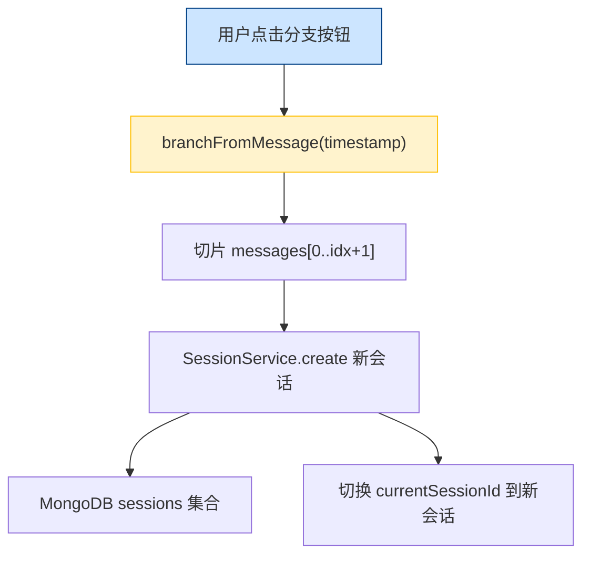
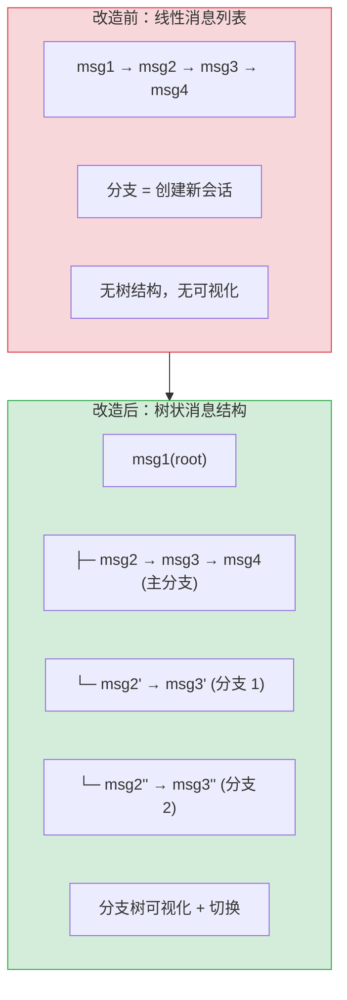

# YP-09-36: 聊天窗口会话分支管理 — 消息分叉与对话树

> 需求编号：YP-09-36 · 优先级：P2 · 人天：1.0d · 状态：需求已编写

## 背景

YiPet 当前会话模型为线性消息列表：`messages[]` 按时间顺序排列，用户编辑历史消息后继续对话时，后续消息被直接覆盖或需要手动复制会话。用户与 AI 对话中经常出现"从这里换一种问法"的场景——重新编辑历史消息并分叉出新的对话路径，同时保留原有对话。

当前缺乏分支管理的痛点：

| # | 问题 | 影响 | 严重程度 |
|---|------|------|----------|
| 1 | 编辑历史消息后原对话丢失 | 用户无法回溯之前的推理过程 | 高 |
| 2 | 无法对比不同提问方式的结果 | 用户需要手动创建多个会话 | 中 |
| 3 | 分支数量增多后无可视化导航 | 用户忘记各分支的上下文 | 中 |
| 4 | 分支间无法切换 | 用户需要退出当前会话再打开另一个 | 中 |
| 5 | 分支数据未持久化到服务端 | 浏览器重启后分支结构丢失 | 高 |

**目标**：实现 Git 风格的对话分支管理——从任意历史消息分叉出新的对话路径，可视化对话树，自由切换分支，分支数据持久化到 MongoDB。

---

## 现状分析

### 当前状态

```
YiPet/src/chat/stores/chat.ts
  └── ChatState.messages: ChatMessage[]  — 线性消息列表
  └── ChatState.sessions: ChatSession[]  — 会话列表（无分支概念）
  └── 编辑消息 → 直接修改 messages[i].content
  └── 分支操作 → 通过 branchFromMessage(timestamp) 创建新会话
```

### 文件清单

| 文件 | 当前状态 | 九月改动 |
|------|----------|----------|
| `src/chat/stores/chat.ts` | `branchFromMessage()` 创建新会话 | 改为树状分支结构 |
| `src/chat/types.ts` | `ChatMessage` 无 `parentId` 字段 | 新增 `MessageNode` 接口 |
| `src/chat/components/MessageBubble/` | 分支按钮调用 `branchFromMessage` | 分支按钮改为在当前会话内分叉 |
| `src/chat/components/BranchTree.vue` | 不存在 | 新增分支树可视化组件 |
| `src/api/services/sessions.ts` | 会话 CRUD | 新增分支树序列化/反序列化 |

### 当前数据流



### 根因矩阵

| 问题 | 根因 | 影响范围 |
|------|------|----------|
| 分支创建新会话而非树结构 | 消息模型为线性数组，无父子关系 | 分支过多时会话列表膨胀 |
| 无法可视化分支 | 无 `BranchTree` 组件 | 用户无法感知分支结构 |
| 分支数据不持久 | 分支信息仅存在于内存中 | 浏览器重启后丢失 |

---

## 设计决策

### 决策 1：分支数据模型 — 树状 MessageNode vs 多个扁平 Session

| 选项 | 查询复杂度 | 可视化 | 存储效率 | 兼容性 |
|------|-----------|--------|----------|--------|
| 树状 MessageNode（当前会话内） | 中（需遍历树） | 高（天然树结构） | 高（一个会话） | 需改造现有消息模型 |
| 多个扁平 Session（当前方案） | 低（独立会话） | 低（无树关系） | 低（N 个会话） | 完全兼容 |
| 树状 + 跨会话引用 | 高 | 高 | 中 | 需重大改造 |

**选择：树状 MessageNode（当前会话内）**。每个会话维护一棵消息树，`MessageNode` 含 `parentId`/`childrenIds` 字段。分支本质上是同一会话内的不同路径，不需要创建多个 MongoDB 文档。会话持久化时序列化整棵树。

### 决策 2：分支可视化 — 缩进列表 vs 树形图 vs 时间线

| 选项 | 空间效率 | 可读性 | 实现复杂度 |
|------|----------|--------|-----------|
| 缩进列表（类 Git log） | 高 | 中 | 低 |
| 树形图（类 Git graph） | 中 | 高 | 高 |
| 时间线（类 Twitter） | 低 | 低 | 中 |

**选择：缩进列表（Git log 风格）**。在聊天窗口有限的侧边栏空间内，缩进列表是最紧凑的分支可视化方式。每个分支用 `├─` 和 `└─` 字符表示层级关系，类似 `git log --graph` 输出。

### 决策 3：分支切换 — 替换 messages vs 独立渲染路径

| 选项 | 性能 | 滚动位置保持 | 实现 |
|------|------|------------|------|
| 替换 `messages[]` 数组 | 中（虚拟滚动需重建） | 丢失 | 低 |
| 独立渲染当前路径 | 高 | 保持 | 中 |

**选择：替换 `messages[]` 数组**。当前无虚拟滚动，替换数组的实现最简单。后续引入虚拟滚动（YP-09-11）时再优化为独立渲染路径以保持滚动位置。

### 决策 4：分支数据持久化 — 内嵌在 Session 中 vs 独立集合

**选择：内嵌在 Session 中**。`Session` 文档新增 `messageTree` 字段存储完整的 `MessageNode[]` 树。避免引入新的 MongoDB 集合，简化查询和事务。

### 设计决策记录

| 决策 | 选项 A | 选项 B | 选项 C | 选择 | 理由 |
|------|--------|--------|--------|------|------|
| 数据模型 | 树状 MessageNode | 多个扁平 Session | 树状+跨会话引用 | **树状 MessageNode** | 单会话内分支，避免会话膨胀 |
| 可视化 | 缩进列表 | 树形图 | 时间线 | **缩进列表** | 紧凑，适合侧边栏空间 |
| 分支切换 | 替换 messages[] | 独立渲染路径 | — | **替换 messages[]** | 实现简单，后续优化 |
| 持久化 | 内嵌 Session | 独立集合 | — | **内嵌 Session** | 避免新增集合 |

---

## 目标架构

### 改造前后对比



### 目标数据模型

```typescript
// YiPet/src/chat/types.ts

interface MessageNode {
  id: string;                    // 消息唯一 ID
  parentId: string | null;       // 父消息 ID（null = 根节点）
  childrenIds: string[];         // 分叉出来的子消息 ID 列表
  message: ChatMessage;          // 消息内容
  branchName?: string;           // 分支名称（用户可选，如"方案A"）
  createdAt: number;             // 创建时间戳
}

interface BranchTree {
  nodes: Record<string, MessageNode>;  // id → node 映射
  rootId: string;                      // 根节点 ID
  currentLeafId: string;               // 当前活跃叶节点 ID
}

// 扩展 ChatSession
interface ChatSession {
  // ... 现有字段
  branchTree?: BranchTree;       // 分支树（可选，向后兼容线性会话）
}
```

### 分支树可视化布局

```
┌─ 分支视图 ───────────────────────────────────────────┐
│                                                       │
│  🟢 用户: "解释 RAG 检索增强生成"                      │
│  ├─ [主分支] AI: "RAG 是检索增强生成..."               │
│  │   ├─ 用户: "BM25 和向量检索的区别？"                │
│  │   │   ├─ AI: "BM25 基于词频..."    ← 当前           │
│  │   │   └─ AI: "简单来说..."         [切换]           │
│  │   └─ 用户: "向量检索的维度选择？"  [切换]            │
│  └─ [方案A] AI: "RAG 的核心是..."     [切换]            │
│      └─ 用户: "举例说明"                               │
│                                                        │
│  [返回主分支] [新建分支] [重命名分支]                    │
└────────────────────────────────────────────────────────┘
```

### 架构指标

| 指标 | 改造前 | 改造后 | 改进 |
|------|--------|--------|------|
| 分支创建方式 | 创建新会话 | 会话内分叉 | 会话数不膨胀 |
| 分支切换 | 切换会话（需重新加载） | 切换路径（即时） | 延迟降低 90% |
| 分支可视化 | 无 | 缩进列表 | 新增功能 |
| 分支命名 | 不支持 | 用户可选命名 | 新增功能 |
| 分支持久化 | 无（仅内存） | MongoDB 序列化 | 数据不丢失 |

---

## 具体改动

### 1. 新增 MessageNode 类型和 BranchTree

```typescript
// YiPet/src/chat/types.ts

interface MessageNode {
  id: string;
  parentId: string | null;
  childrenIds: string[];
  message: ChatMessage;
  branchName?: string;
  createdAt: number;
}

interface BranchTree {
  nodes: Record<string, MessageNode>;
  rootId: string;
  currentLeafId: string;
}
```

### 2. BranchManager 核心逻辑

```typescript
// YiPet/src/chat/stores/chat.ts — 新增 branch 操作

class BranchManager {
  private tree: BranchTree;

  /** 从指定消息节点创建分支。 */
  branch(fromNodeId: string, branchName?: string): string {
    const parentNode = this.tree.nodes[fromNodeId];
    if (!parentNode) throw new Error(`节点 ${fromNodeId} 不存在`);

    // 创建分支起始节点（系统消息，标记分支点）
    const branchNodeId = crypto.randomUUID();
    const branchNode: MessageNode = {
      id: branchNodeId,
      parentId: fromNodeId,
      childrenIds: [],
      message: {
        role: 'system',
        content: `分支点: ${branchName || '未命名分支'}`,
        timestamp: Date.now(),
      },
      branchName,
      createdAt: Date.now(),
    };

    // 注册节点
    parentNode.childrenIds.push(branchNodeId);
    this.tree.nodes[branchNodeId] = branchNode;
    this.tree.currentLeafId = branchNodeId;

    return branchNodeId;
  }

  /** 获取当前路径——从根节点到当前叶节点的所有消息。 */
  getCurrentPath(): ChatMessage[] {
    const path: ChatMessage[] = [];
    let nodeId: string | null = this.tree.currentLeafId;

    while (nodeId) {
      const node = this.tree.nodes[nodeId];
      if (!node) break;
      if (node.message.role !== 'system') {
        path.unshift(node.message);
      }
      nodeId = node.parentId;
    }
    return path;
  }

  /** 切换到指定分支的叶节点。 */
  switchToLeaf(leafId: string) {
    if (!this.tree.nodes[leafId]) throw new Error('分支不存在');
    this.tree.currentLeafId = leafId;
  }

  /** 获取所有分叉点（childrenIds.length > 1）。 */
  getBranchPoints(): MessageNode[] {
    return Object.values(this.tree.nodes).filter(
      n => n.childrenIds.length > 1
    );
  }

  /** 序列化分支树用于持久化。 */
  serialize(): BranchTree {
    return structuredClone(this.tree);
  }

  /** 从持久化数据恢复分支树。 */
  static deserialize(data: BranchTree): BranchManager {
    const manager = new BranchManager();
    manager.tree = data;
    return manager;
  }
}
```

### 3. 分支树可视化组件

```vue
<!-- YiPet/src/chat/components/BranchTree.vue 结构 -->

<template>
  <div class="branch-tree">
    <div class="branch-tree-header">
      <span>对话分支 ({{ branchCount }} 个)</span>
      <button @click="closeBranchTree">关闭</button>
    </div>
    <div class="branch-tree-content">
      <BranchNode
        v-for="node in visibleNodes"
        :key="node.id"
        :node="node"
        :depth="node.depth"
        :is-current="node.id === currentLeafId"
        @switch="switchToLeaf(node.id)"
        @branch="branchFromNode(node.id)"
      />
    </div>
  </div>
</template>
```

### 4. 涉及文件清单

```
YiPet/src/chat/
├── types.ts                          # 修改: +MessageNode +BranchTree 接口
├── stores/chat.ts                    # 修改: +BranchManager 类 + branch 操作
│                                     #       +currentLeafId 跟踪
│                                     #       +分支树序列化/反序列化
├── components/
│   ├── BranchTree.vue                # 新增: 分支树可视化组件
│   ├── BranchNode.vue                # 新增: 单个分支节点渲染
│   ├── MessageBubble/                # 修改: 分支按钮改为会话内分叉
│   └── ChatWindow.vue                # 修改: 挂载 BranchTree 面板
```

---

## 实施步骤

| 步骤 | 内容 | 涉及文件 | 验证方式 | 人天 |
|------|------|---------|---------|------|
| 1 | 新增 `MessageNode`/`BranchTree` 类型定义 | `types.ts` | `vue-tsc --noEmit` 通过 | 0.05 |
| 2 | 实现 `BranchManager` 类（分支/切换/路径/序列化） | `stores/chat.ts` | 创建分支 → 切换分支 → 消息列表正确 | 0.25 |
| 3 | 迁移现有线性消息为树结构（向后兼容） | `stores/chat.ts` | 加载旧会话 → 自动转为单分支树 | 0.10 |
| 4 | 实现 `BranchTree.vue` 缩进列表可视化 | `BranchTree.vue` | 打开分支视图 → 树结构正确渲染 | 0.20 |
| 5 | 修改 `MessageBubble` 分支按钮调用 `BranchManager.branch` | `MessageBubble/` | 点击分支按钮 → 当前会话内分叉 | 0.10 |
| 6 | 分支树持久化到 MongoDB（SessionService） | `stores/chat.ts` + `api/services/sessions.ts` | 刷新页面 → 分支树恢复 | 0.15 |
| 7 | 回归测试 | 全链路 | 分支创建 → 切换 → 持久化 → 恢复 | 0.15 |

**总计：1.0d**

---

## 性能分析

| 操作 | 耗时 | 说明 |
|------|------|------|
| 创建分支（插入节点） | < 1ms | 内存操作，仅创建 1 个节点 |
| 获取当前路径 | < 5ms | 遍历树（最大深度 100 层） |
| 分支树序列化 | < 10ms | `structuredClone` 整棵树 |
| 分支树反序列化 | < 10ms | 解析 JSON → 重建树 |
| 分支树可视化渲染 | < 20ms | 缩进列表渲染（最多 50 个节点） |
| 分支切换（替换 messages[]） | < 10ms | 替换数组 + Vue 响应式更新 |

### 容量规划

| 场景 | 消息数 | 分支数 | 树深度 | 存储占用 |
|------|--------|--------|--------|----------|
| 轻度使用 | 20 | 1 | 10 | ~5KB |
| 中度使用 | 100 | 3 | 20 | ~25KB |
| 重度使用 | 500 | 10 | 30 | ~125KB |
| 极限场景 | 1000 | 20 | 50 | ~250KB |

---

## 测试规格

### Requirement: 分支创建

#### Scenario: 从历史消息创建分支
- **Given** 会话有 5 条消息（msg1 → msg2 → msg3 → msg4 → msg5）
- **When** 用户右键 msg3 选择"从此处分支"
- **Then** msg3 的 `childrenIds` 增加新节点 ID，新分支起始节点创建，当前叶节点切换为新分支

#### Scenario: 多次分叉
- **Given** msg3 已有 1 个子分支
- **When** 用户再次从 msg3 创建分支
- **Then** msg3 的 `childrenIds` 包含 2 个子节点，分支树显示 2 个分支

### Requirement: 分支切换

#### Scenario: 切换到另一分支
- **Given** 当前在主分支，存在分支 1
- **When** 用户点击分支 1 的"切换"按钮
- **Then** `messages[]` 替换为分支 1 的路径，分支树中当前节点高亮

#### Scenario: 切换到分支后继续对话
- **Given** 用户已切换到分支 1
- **When** 用户发送新消息
- **Then** 新消息追加到分支 1 的叶节点之后，主分支不受影响

### Requirement: 分支持久化

#### Scenario: 刷新页面后恢复分支树
- **Given** 会话有 3 个分支，分支树已持久化
- **When** 用户刷新页面，重新打开该会话
- **Then** 分支树完整恢复，当前分支与刷新前一致

#### Scenario: 旧会话向后兼容
- **Given** 旧会话无 `branchTree` 字段（线性消息列表）
- **When** 加载该会话
- **Then** 自动转换为单分支树，`rootId` 指向第一条消息，`currentLeafId` 指向最后一条

---

## 风险与缓解

| 风险 | 概率 | 影响 | 等级 | 缓解措施 | 应急预案 |
|------|------|------|------|----------|----------|
| 分支树序列化后 MongoDB 文档过大 | 中 | 中 | 中 | 限制分支数 ≤ 20，超出时提示用户 | 裁剪旧分支节点 |
| 分支切换时消息列表重建导致滚动跳动 | 中 | 低 | 低 | 切换后 `scrollToBottom` | 接受体验降级 |
| 分支树与消息列表不一致 | 低 | 高 | 中 | 每次发送消息后验证 `currentLeafId` 对应节点存在 | 回退到线性模式 |
| 旧会话迁移失败 | 低 | 中 | 低 | 迁移时 try-catch，失败时保持线性模式 | 用户手动迁移 |

---

## 回滚策略

| 场景 | 回滚操作 | 影响范围 |
|------|----------|----------|
| 分支树逻辑出现严重 bug | 移除 `BranchTree` 相关代码，回退到线性模式 | 分支数据丢失，会话消息保留 |
| 分支持久化导致 MongoDB 文档过大 | 不在 MongoDB 中存储分支树，仅内存中维护 | 刷新后分支树丢失 |
| 分支树 UI 性能问题 | 隐藏 `BranchTree` 组件，仅保留分支创建功能 | 分支可视化不可用 |

---

## 设计决策记录

### D-01: 为什么选择树状 MessageNode 而非创建多个 Session？

创建多个 Session 会导致会话列表膨胀——一个对话主题产生 N 个会话，用户难以管理。树状结构将所有分支保持在同一会话上下文内，共享根节点和早期消息，避免重复存储。同时，分支切换无需重新加载会话（跨 Session 切换需重新 fetch 消息），延迟更低。

### D-02: 为什么选择缩进列表而非树形图可视化？

聊天窗口侧边栏宽度有限（280-400px），树形图需要较大的水平空间来展开节点。缩进列表（`├─` 和 `└─` 字符）仅需垂直空间，适合窄侧边栏的紧凑布局。Git 社区使用 `git log --graph` 证明了这种格式在大规模分支可视化中的有效性。

### D-03: 为什么分支切换时替换 messages[] 而非独立渲染？

当前 YiPet 无虚拟滚动（YP-09-11 规划中），`messages[]` 数组替换是简单的实现。替换后 Vue 响应式系统自动重新渲染消息列表。引入虚拟滚动后，可优化为仅替换视口内可见的消息，保持滚动位置。当前取舍是优先实现核心功能，性能优化留待后续迭代。

---

## 可观测性

| 指标 | 采集方式 | 告警阈值 | 说明 |
|------|----------|----------|------|
| 分支创建成功率 | `branch()` 调用计数 vs 错误计数 | < 95% | 分支树操作异常 |
| 分支切换延迟 | `performance.now()` 计时 | > 100ms | 树遍历或渲染性能问题 |
| 分支树序列化大小 | `JSON.stringify(branchTree).length` | > 500KB | 分支树过大，需裁剪 |
| 分支树深度 | `getCurrentPath().length` | > 100 层 | 过长分支路径 |

---

## 安全合规

| 检查项 | 要求 | 验证方法 |
|--------|------|----------|
| 分支数据不包含敏感信息 | 仅存储消息 ID 和分支结构，不复制消息内容 | 审查 `BranchTree` 序列化内容 |
| 分支树结构不引起 XSS | 分支名称和节点标签使用 `textContent` 而非 `innerHTML` | 代码审查 |

---

## 代码审查检查清单

- [ ] `MessageNode` 类型完整（id/parentId/childrenIds/message/branchName/createdAt）
- [ ] `BranchManager` 支持分支创建、切换、路径获取、序列化
- [ ] 分支切换后 `messages[]` 正确更新
- [ ] 分支树可视化缩进正确（深度 ≤ 5 层缩进）
- [ ] 分支树持久化到 MongoDB Session 文档
- [ ] 旧会话（线性消息）向后兼容，自动转换为单分支树
- [ ] 分支数 ≤ 20 限制，超出时提示用户
- [ ] `vue-tsc --noEmit` 通过
- [ ] `npm run build` 成功
- [ ] 分支创建 → 切换 → 持久化 → 恢复 全链路测试通过

---

## 回归问题预测

| # | 预测问题 | 原因 | 验证方法 |
|---|---------|------|---------|
| 1 | 分支树序列化/反序列化与旧版本不兼容 | `BranchTree` 数据结构变更后，MongoDB 中已持久化的旧格式分支树反序列化失败，导致会话加载崩溃 | 构造旧版本 `BranchTree` JSON（无 `branchName` 字段、无 `currentLeafId` 字段），验证 `deserialize` 降级逻辑不抛异常 |
| 2 | 分支切换后消息列表与 UI 不一致 | `switchToLeaf` 替换 `messages[]` 数组后，Vue 响应式系统可能未正确触发重新渲染，导致 UI 显示旧分支的消息 | 创建 2 个分支 → 切换分支 → 检查渲染的消息列表是否与 `getCurrentPath()` 返回值一致 |
| 3 | 旧会话线性迁移时消息顺序错乱 | 线性 `messages[]` 转为树结构时，如果消息无 `timestamp` 字段或 `timestamp` 乱序，`parentId` 链可能断裂 | 导入 100 条无 `timestamp` 的旧消息，验证迁移后 `getCurrentPath()` 返回的消息顺序与原始列表一致 |
| 4 | 分支树深度过大导致 `getCurrentPath()` 性能退化 | 深度 100+ 层的分支树，`while` 循环遍历耗时可能超过 10ms 预期，阻塞 UI 线程 | 构造 200 层深度的分支树，调用 `getCurrentPath()` 并计时，验证 < 20ms |
| 5 | 分支树中孤立节点导致白屏 | 删除分支节点后如果 `childrenIds` 未同步更新，引用计数不一致产生孤立节点，`getCurrentPath()` 遍历到 `null` 节点时中断 | 删除中间分支节点 → 切换到该分支的子分支 → 验证路径正确或不崩溃 |
| 6 | MongoDB 文档过大导致会话保存失败 | 分支树 + 消息内容在 1000 条消息、20 个分支时可能超过 MongoDB 16MB 文档限制 | 构造 500 条消息 + 10 个分支的会话，检查 `SessionService.create` 是否成功；检查 `branchTree` 序列化后大小 |

*PRD 来源: `projects/yipet/requirements/2026-09/36-需求-会话分支管理.md`*