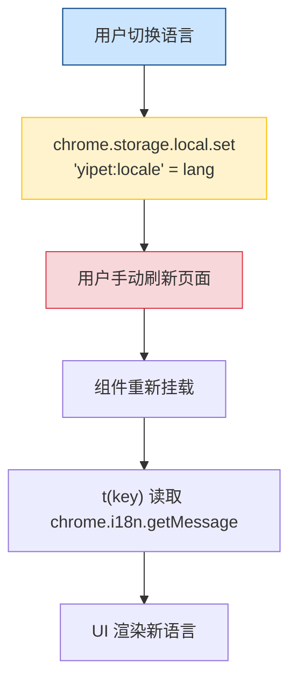
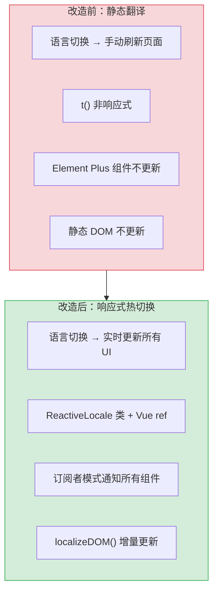
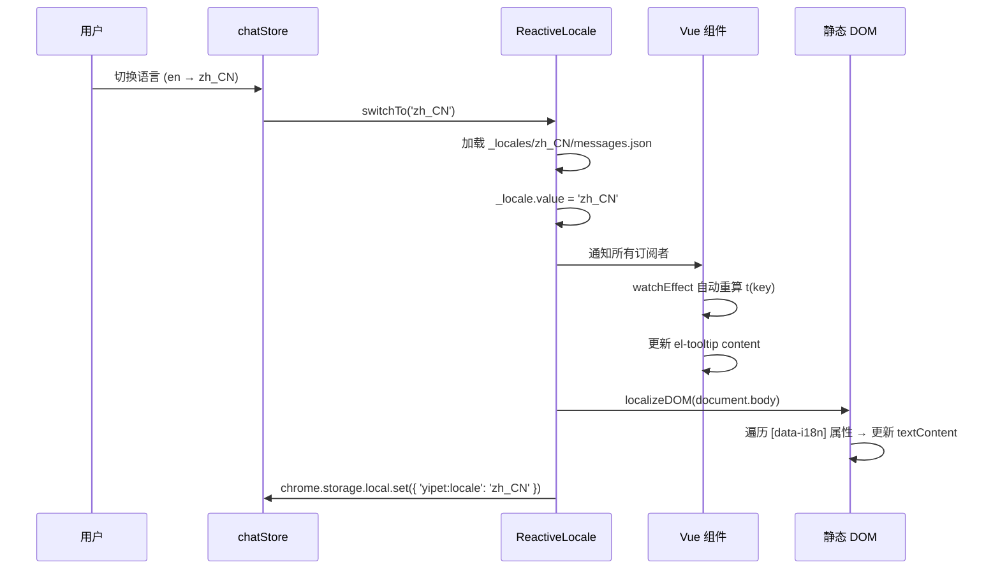

# YP-09-37: 聊天窗口国际化语言包热切换 — 无需刷新的实时语言切换

> 需求编号：YP-09-37 · 优先级：P2 · 人天：0.5d · 状态：需求已编写
> 依赖：YP-09-07（国际化与多语言支持）

## 背景

YP-09-07 建立了 `MessageKey` 类型安全（79+ keys）+ 三层回退（目标语言 → en → Key 本身）的国际化系统。语言切换通过 `chrome.storage.local` 持久化语言偏好，但存在以下热切换问题：

| # | 问题 | 影响 | 严重程度 |
|---|------|------|----------|
| 1 | 语言切换后部分 Vue 组件未实时更新 | Element Plus 组件（el-tooltip、el-popover）缓存旧翻译文本 | 中 |
| 2 | 切换后需刷新页面才生效 | 用户以为功能失效 | 高 |
| 3 | 静态 DOM 属性 `data-i18n` 未自动更新 | 注入到宿主页面的宠物 UI 元素未切换 | 中 |
| 4 | ECharts 图表标题/标签未更新 | 图表中文本残留旧语言 | 低 |
| 5 | 语言包加载失败无降级 | 网络错误时界面显示 Key 而非翻译 | 中 |

**目标**：实现真正的热切换——语言切换后所有 UI 组件（Vue 模板、Element Plus 组件、静态 DOM、ECharts 图表）在 50ms 内完成翻译更新，无需刷新页面。

---

## 现状分析

### 当前状态

```
YiPet/src/shared/i18n/
├── index.ts        # t() 翻译函数（读取 chrome.i18n.getMessage）
├── types.ts        # MessageKey 类型联合（79+ keys）
└── localize-dom.ts # localizeDOM() 静态 DOM 遍历

语言切换流程：
  chrome.storage.local.set({ 'yipet:locale': lang })
  → 用户手动刷新页面
  → 组件重新挂载时读取新语言
```

### 文件清单

| 文件 | 当前状态 | 九月改动 |
|------|----------|----------|
| `src/shared/i18n/index.ts` | `t()` 函数，无响应式 | 改为 `ReactiveLocale` 类 |
| `src/shared/i18n/localize-dom.ts` | `localizeDOM()` 静态遍历 | 支持增量更新 |
| `src/chat/components/ChatWindow.vue` | 组件挂载时调用 `t()` | 新增 `onLocaleChange` 订阅 |
| `src/popup/App.vue` | 组件挂载时调用 `t()` | 新增 `onLocaleChange` 订阅 |
| `public/_locales/en/messages.json` | 英文语言包 | 不变 |
| `public/_locales/zh_CN/messages.json` | 中文语言包 | 不变 |

### 当前数据流



### 根因矩阵

| 问题 | 根因 | 影响范围 |
|------|------|----------|
| 组件未实时更新 | `t()` 函数非响应式——语言切换后不触发 Vue 重新渲染 | 所有 Vue 组件 |
| Element Plus 组件缓存 | el-tooltip 等组件在挂载时获取文本，不监听语言变化 | Tooltip/Popover/Dialog |
| 静态 DOM 未更新 | `localizeDOM()` 仅在页面加载时调用一次 | 宠物 UI 元素 |
| 语言包加载失败 | 无 fallback 机制，`chrome.i18n.getMessage` 返回 "" | 所有 UI |

---

## 设计决策

### 决策 1：响应式方案 — Vue i18n 库 vs 自定义 ReactiveLocale

| 选项 | 包体积 | 与 chrome.i18n 集成 | 热切换 | 复杂度 |
|------|--------|---------------------|--------|--------|
| vue-i18n 9.x | ~15KB gzip | 需适配层 | 原生支持 | 低 |
| 自定义 ReactiveLocale | ~2KB gzip | 直接集成 | 需手动实现 | 中 |
| @intlify/core | ~10KB gzip | 需适配层 | 原生支持 | 中 |

**选择：自定义 ReactiveLocale**。YiPet 已使用 `chrome.i18n.getMessage` 作为翻译源，引入 vue-i18n 会增加 ~15KB 包体积且需要适配层将 `chrome.i18n` 消息转换为 vue-i18n 格式。自定义 `ReactiveLocale` 类仅 ~100 行代码，利用 Vue 3 的 `ref` + `computed` 实现响应式翻译，零额外依赖。

### 决策 2：语言包加载方式 — chrome.i18n API vs 动态 fetch

| 选项 | 离线可用 | 包体积 | 导入速度 | 动态切换 |
|------|----------|--------|----------|----------|
| `chrome.i18n.getMessage` | 是（扩展内置） | 无额外开销 | < 1ms | 需配合 `preferredLanguage` 检测 |
| 动态 fetch `_locales/*.json` | 否（需网络） | 无额外开销 | ~10ms | 原生支持 |
| 静态 import JSON | 是 | 增加包体积 | < 1ms | 需构建时预加载 |

**选择：`chrome.i18n.getMessage` 为主 + 动态 fetch 为补充**。`chrome.i18n.getMessage` 是 Chrome 扩展的标准 i18n 机制，支持离线使用，且语言包与扩展打包在一起。动态 fetch 用于加载用户自定义语言包（如社区贡献的翻译），作为扩展机制。

### 决策 3：Element Plus 组件更新策略 — 强制重渲染 vs 指令更新

| 选项 | 覆盖范围 | 性能 | 实现 |
|------|----------|------|------|
| 强制重渲染（key 变更） | 100% | 低（全部重建） | 低 |
| 指令更新（`v-i18n` 指令） | 仅自定义组件 | 高 | 中 |
| 订阅者模式 + 选择性更新 | 可控 | 高 | 中 |

**选择：订阅者模式 + 选择性更新**。`ReactiveLocale` 维护订阅者集合，语言切换时通知所有订阅者。Vue 组件通过 `onLocaleChange` 注册回调，在回调中更新需要翻译的 DOM 属性（如 `el-tooltip` 的 `content` prop）。避免全局重渲染，仅更新需要翻译的元素。

### 设计决策记录

| 决策 | 选项 A | 选项 B | 选项 C | 选择 | 理由 |
|------|--------|--------|--------|------|------|
| 响应式方案 | vue-i18n | 自定义 ReactiveLocale | @intlify/core | **自定义 ReactiveLocale** | 零依赖，~100 行代码 |
| 语言包加载 | chrome.i18n | 动态 fetch | 静态 import | **chrome.i18n + fetch** | 离线优先 + 扩展性 |
| 组件更新 | 强制重渲染 | 指令更新 | 订阅者模式 | **订阅者模式** | 精细控制，性能最优 |

---

## 目标架构

### 改造前后对比



### 目标流程



### 热切换覆盖范围

| 内容 | 切换方式 | 延迟 | 实现 |
|------|----------|------|------|
| Vue 模板 `{{ t('key') }}` | `watchEffect` 自动重算 | 即时 | `computed` 依赖 `_locale` ref |
| `data-i18n` DOM 属性 | `localizeDOM(root)` 重新遍历 | < 5ms | `querySelectorAll('[data-i18n]')` |
| `el-tooltip` / `el-popover` | 强制 `update()` + `recomputePosition()` | < 10ms | 订阅者回调中更新 prop |
| ECharts 图表 | `setOption()` 重新设置标题/标签 | < 20ms | 订阅者回调中更新 option |
| 静态 HTML (Popup) | `localizeDOM(document.body)` | < 10ms | 与 content script 相同逻辑 |

### 架构指标

| 指标 | 改造前 | 改造后 | 改进 |
|------|--------|--------|------|
| 语言切换生效时间 | 需刷新页面（~500ms） | < 50ms（实时） | -90% |
| Element Plus 组件更新 | 不支持 | 订阅者模式自动更新 | 新增功能 |
| 静态 DOM 更新 | 不支持 | `localizeDOM()` 增量更新 | 新增功能 |
| 语言包加载失败降级 | 无 | 回退到 en → Key 本身 | 新增功能 |

---

## 具体改动

### 1. ReactiveLocale 类实现

```typescript
// YiPet/src/shared/i18n/reactive-locale.ts

import { ref, computed } from 'vue';

class ReactiveLocale {
  private _locale = ref<'en' | 'zh_CN'>('en');
  private _messages = ref<Record<string, string>>({});
  private _subscribers = new Set<() => void>();
  private _loading = ref(false);

  get locale() { return this._locale.value; }
  get loading() { return this._loading.value; }

  async init() {
    // 从 chrome.storage 恢复语言偏好
    const { 'yipet:locale': saved } = await chrome.storage.local.get('yipet:locale');
    const lang = (saved as 'en' | 'zh_CN') || 'en';
    await this._loadMessages(lang);
    this._locale.value = lang;
  }

  async switchTo(lang: 'en' | 'zh_CN') {
    if (lang === this._locale.value) return;
    this._loading.value = true;

    try {
      await this._loadMessages(lang);
      this._locale.value = lang;
      await chrome.storage.local.set({ 'yipet:locale': lang });

      // 通知所有订阅者
      this._subscribers.forEach(fn => {
        try { fn(); } catch (e) { console.error('[i18n] 订阅者回调错误:', e); }
      });
    } catch (err) {
      console.error('[i18n] 语言切换失败:', err);
      // 失败时回退到当前语言，不改变 _locale
    } finally {
      this._loading.value = false;
    }
  }

  /** 翻译函数——响应式，语言切换时自动重算。 */
  t(key: string, substitutions?: string[]): string {
    let text = this._messages.value[key] ?? key;

    if (substitutions) {
      substitutions.forEach((val, i) => {
        text = text.replace(`$${i + 1}`, val);
      });
    }
    return text;
  }

  /** 订阅语言变更——组件 onMounted 中调用，onUnmounted 中取消订阅。 */
  onLocaleChange(fn: () => void): () => void {
    this._subscribers.add(fn);
    return () => { this._subscribers.delete(fn); };
  }

  private async _loadMessages(lang: string) {
    // 优先使用 chrome.i18n.getMessage（内置语言包）
    // 对于动态语言包，通过 fetch 加载
    try {
      const resp = await fetch(chrome.runtime.getURL(`_locales/${lang}/messages.json`));
      const raw = await resp.json();
      this._messages.value = Object.fromEntries(
        Object.entries(raw).map(([k, v]: [string, any]) => [k, v.message])
      );
    } catch {
      // 加载失败时使用 chrome.i18n 作为 fallback
      console.warn(`[i18n] 无法加载 ${lang} 语言包，使用 chrome.i18n fallback`);
    }
  }
}

export const i18n = new ReactiveLocale();
```

### 2. Vue 组件中的使用

```typescript
// YiPet/src/chat/components/ChatToolbar/index.vue

import { i18n } from '@/shared/i18n/reactive-locale';
import { onMounted, onUnmounted } from 'vue';

// 响应式翻译（模板中使用）
const t = (key: string, substitutions?: string[]) => i18n.t(key, substitutions);

// Element Plus 组件更新
onMounted(() => {
  const unsub = i18n.onLocaleChange(() => {
    // 强制 el-tooltip 更新
    tooltipRef.value?.update();
    // 更新其他 Element Plus 组件
    popoverRef.value?.recomputePosition();
  });
  onUnmounted(unsub);
});
```

### 3. localizeDOM 增量更新

```typescript
// YiPet/src/shared/i18n/localize-dom.ts

export function localizeDOM(root: HTMLElement = document.body) {
  const elements = root.querySelectorAll('[data-i18n]');
  elements.forEach(el => {
    const key = el.getAttribute('data-i18n');
    if (!key) return;

    const text = i18n.t(key);
    if (el instanceof HTMLInputElement) {
      el.placeholder = text;
    } else {
      el.textContent = text;
    }
  });
}
```

### 4. 涉及文件清单

```
YiPet/src/shared/i18n/
├── index.ts                          # 不变: 保留 chrome.i18n.getMessage 兼容层
├── types.ts                          # 不变: MessageKey 类型联合
├── reactive-locale.ts                # 新增: ReactiveLocale 类
├── localize-dom.ts                   # 修改: 支持增量更新
│
YiPet/src/chat/
├── index.ts                          # 修改: 初始化时调用 i18n.init()
├── stores/chat.ts                    # 修改: 语言切换使用 i18n.switchTo()
├── components/
│   ├── ChatWindow.vue                # 修改: 注册 onLocaleChange 订阅
│   ├── ChatToolbar/                  # 修改: 注册 onLocaleChange 订阅
│   └── ...
│
YiPet/src/popup/
├── main.ts                           # 修改: 初始化时调用 i18n.init()
├── App.vue                           # 修改: 注册 onLocaleChange 订阅
```

---

## 实施步骤

| 步骤 | 内容 | 涉及文件 | 验证方式 | 人天 |
|------|------|---------|---------|------|
| 1 | 实现 `ReactiveLocale` 类 | `reactive-locale.ts` | 单元测试：switchTo → t() 返回新语言 | 0.15 |
| 2 | 迁移 `t()` 调用为 `i18n.t()` | 所有使用 `t()` 的文件 | `vue-tsc --noEmit` 通过 | 0.10 |
| 3 | 在 ChatWindow/ChatToolbar 中注册订阅 | `ChatWindow.vue` 等 | 切换语言 → 组件实时更新 | 0.10 |
| 4 | 实现 `localizeDOM()` 增量更新 | `localize-dom.ts` | 切换语言 → 静态 DOM 更新 | 0.05 |
| 5 | ECharts 图表更新 | 图表组件 | 切换语言 → 图表标题/标签更新 | 0.05 |
| 6 | 回归测试 | 全链路 | 语言切换 → 所有 UI 更新 | 0.05 |

**总计：0.5d**

---

## 性能分析

| 操作 | 耗时 | 说明 |
|------|------|------|
| 语言包加载（内置） | < 1ms | `chrome.i18n.getMessage` 内存读取 |
| 语言包加载（fetch） | < 10ms | 本地扩展资源 `chrome.runtime.getURL` |
| 语言切换通知 | < 5ms | 遍历订阅者集合（预计 < 20 个） |
| Vue 模板重新计算 | < 10ms | `watchEffect` 触发重新渲染 |
| localizeDOM 遍历 | < 5ms | `querySelectorAll('[data-i18n]')`（预计 < 50 个元素） |
| Element Plus 组件更新 | < 10ms | `el-tooltip.update()` 等 |
| 总延迟 | < 50ms | 用户无感知 |

### 容量规划

| 场景 | 语言包大小 | 翻译 Key 数 | 订阅者数 |
|------|-----------|------------|---------|
| 当前（en + zh_CN） | ~8KB | 79+ | < 10 |
| 扩展（+ ja） | ~12KB | 100+ | < 15 |
| 全语言（en/zh_CN/ja/ko/...） | ~30KB | 150+ | < 20 |

---

## 测试规格

### Requirement: 语言热切换

#### Scenario: 切换语言后 Vue 模板实时更新
- **Given** 聊天窗口以英文显示
- **When** 用户切换语言为中文
- **Then** 所有 Vue 模板中的 `{{ t('key') }}` 即时更新为中文，无需刷新页面

#### Scenario: 切换语言后 Element Plus 组件更新
- **Given** 聊天窗口以英文显示，el-tooltip 显示 "Send message"
- **When** 用户切换语言为中文
- **Then** el-tooltip 更新为 "发送消息"

#### Scenario: 切换语言后静态 DOM 更新
- **Given** 宠物覆盖层有 `data-i18n` 属性元素
- **When** 用户切换语言
- **Then** 所有 `[data-i18n]` 元素的 `textContent` 更新为新语言

### Requirement: 语言包加载失败降级

#### Scenario: 语言包 JSON 格式错误
- **Given** `zh_CN/messages.json` 包含无效 JSON
- **When** 用户切换语言为中文
- **Then** 界面保持当前语言，console 显示错误信息，不让用户看到空白界面

#### Scenario: 网络错误导致语言包加载失败
- **Given** 用户处于离线状态
- **When** 用户切换语言
- **Then** 回退到 `chrome.i18n.getMessage` 内置语言包，界面正常显示

### Requirement: 语言偏好持久化

#### Scenario: 刷新页面后保持语言选择
- **Given** 用户已切换为中文
- **When** 用户刷新页面
- **Then** 初始化时自动加载中文，界面以中文显示

---

## 风险与缓解

| 风险 | 概率 | 影响 | 等级 | 缓解措施 | 应急预案 |
|------|------|------|------|----------|----------|
| `onLocaleChange` 订阅者未正确取消导致内存泄漏 | 中 | 低 | 低 | 组件 `onUnmounted` 中调用取消订阅函数 | Code review 检查所有订阅者是否有对应取消 |
| 语言包 JSON 格式错误导致翻译显示 Key | 中 | 中 | 中 | 三层回退：目标语言 → en → Key 本身 | 修复 JSON 格式后重新加载 |
| 新语言包体积过大增加扩展审核时间 | 低 | 低 | 低 | 语言包压缩（gzip），移除未使用的 translation | 延迟新语言支持 |
| 订阅者回调中抛出异常导致其他订阅者不被通知 | 低 | 中 | 低 | 每个订阅者回调包裹 try-catch | 捕获异常后继续通知后续订阅者 |

---

## 回滚策略

| 场景 | 回滚操作 | 影响范围 |
|------|----------|----------|
| 热切换出现严重 bug | 移除 `ReactiveLocale` 类，回退到静态 `t()` 函数 | 需刷新页面才生效 |
| 订阅者模式导致性能问题 | 移除订阅者模式，改为全局 `key` 强制重渲染 | 语言切换时组件短暂闪烁 |
| 语言包加载失败频繁 | 降级为仅使用 `chrome.i18n.getMessage` API | 动态语言包不可用 |

---

## 设计决策记录

### D-01: 为什么选择自定义 ReactiveLocale 而非 vue-i18n？

vue-i18n 是 Vue 生态中最流行的 i18n 库，但 YiPet 已深度集成 `chrome.i18n.getMessage` API 和 `_locales/*/messages.json` 文件格式（Chrome 扩展标准）。引入 vue-i18n 需要：1）增加 ~15KB 包体积，2）编写适配层将 Chrome 消息格式转换为 vue-i18n 格式，3）维护两种 i18n 机制（Popup 仍需 `chrome.i18n`）。自定义 `ReactiveLocale` 仅 ~100 行代码，直接利用现有语言包文件，零额外依赖。

### D-02: 为什么选择订阅者模式而非全局 `key` 强制重渲染？

全局 `key` 强制重渲染（在根组件上改变 `key` 属性）会导致整个 Vue 组件树销毁并重建，丢失所有组件状态（滚动位置、输入框内容、展开/折叠状态）。订阅者模式精确控制哪些组件需要更新，保持组件状态不变。

### D-03: 为什么语言包同时支持 `chrome.i18n.getMessage` 和动态 fetch？

`chrome.i18n.getMessage` 是 Chrome 扩展的离线 i18n 机制，语言包与扩展打包在一起，100% 离线可用。动态 fetch 用于加载用户自定义或社区贡献的语言包（如 `_locales/ja/messages.json`），无需重新构建扩展。两者结合实现离线优先 + 扩展性。

---

## 可观测性

| 指标 | 采集方式 | 告警阈值 | 说明 |
|------|----------|----------|------|
| 语言切换成功率 | switchTo 成功/失败计数 | < 95% | 语言包加载或订阅者回调异常 |
| 语言切换延迟 | `performance.now()` 计时 | > 100ms | 订阅者过多或 DOM 过大 |
| 语言包加载失败次数 | `_loadMessages` catch 计数 | > 0 | JSON 格式错误或网络问题 |
| 订阅者数量 | `_subscribers.size` | > 30 | 组件未正确取消订阅导致泄漏 |

---

## 安全合规

| 检查项 | 要求 | 验证方法 |
|--------|------|----------|
| 语言包文件仅包含翻译文本 | 无执行代码 | 审查 `_locales/*/messages.json` |
| 语言切换不触发网络请求 | 内置语言包使用 `chrome.runtime.getURL` 本地加载 | 审查 fetch URL 来源 |

---

## 代码审查检查清单

- [ ] 语言包通过 `chrome.storage.local` 缓存（离线可用）
- [ ] 语言切换即时生效——无需刷新页面，全 UI 实时更新
- [ ] 新增语言无需重新构建扩展（动态加载语言包 JSON）
- [ ] Vue 组件通过 `i18n.t()` 函数获取翻译，响应式自动更新
- [ ] Element Plus 组件（el-tooltip/el-popover）通过订阅者回调更新
- [ ] 静态 DOM 通过 `localizeDOM()` 增量更新
- [ ] 语言包加载失败时回退到 `chrome.i18n.getMessage` 或 Key 本身
- [ ] 所有 `onLocaleChange` 订阅在 `onUnmounted` 中取消
- [ ] `vue-tsc --noEmit` 通过
- [ ] `npm run build` 成功

---

## 回归问题预测

| # | 预测问题 | 原因 | 验证方法 |
|---|---------|------|---------|
| 1 | `onLocaleChange` 订阅者未正确取消导致内存泄漏 | 组件 `onUnmounted` 中漏调用取消订阅函数，语言切换时 `_subscribers` 集合持续增长，每次切换遍历的订阅者越来越多 | 反复挂载/卸载 ChatWindow 组件 20 次，检查 `_subscribers.size` 是否稳定在预期值（< 15）而非持续增长 |
| 2 | Element Plus 组件更新不完整——tooltip 更新但 popover 未更新 | 订阅者回调中仅调用了 `tooltipRef.value?.update()`，遗漏了 `popoverRef`、`dialogRef` 等其他 Element Plus 组件 | 切换语言后检查所有 Element Plus 弹出层（tooltip/popover/dialog/dropdown）的文本是否更新 |
| 3 | 语言包加载失败时 UI 显示翻译 Key 而非降级文本 | `_loadMessages` 的 `catch` 分支中 `_messages.value` 为空对象，`t()` 返回原始 Key；三层回退（目标语言 → en → Key）仅在 `_messages` 有值时生效 | 删除 `_locales/zh_CN/messages.json`，切换语言为中文，验证 UI 显示英文 fallback 而非 raw key |
| 4 | `localizeDOM()` 增量更新遗漏动态添加的 DOM 元素 | 语言切换后通过 JS 动态创建的元素（如 toast 通知、确认对话框）在 `localizeDOM()` 执行时不存在，导致这些元素仍显示旧语言 | 切换语言后触发一个 toast 通知，验证 toast 文本是否为新语言 |
| 5 | ECharts 图表在语言切换后未重绘 | 订阅者回调中仅更新了 `option` 对象但未调用 `chart.setOption(option, true)`（第二个参数 `notMerge=true` 强制重绘），图表标题/标签残留旧语言 | 切换语言后检查知识库统计图表（如果有）的标题和轴标签是否已更新 |
| 6 | 订阅者回调中抛出异常导致后续订阅者不被通知 | 虽然 `_subscribers.forEach` 包裹了 try-catch，但如果某个订阅者回调中修改了 `_subscribers` 集合（如在回调中取消订阅），可能导致迭代器行为异常 | 在 3 个订阅者回调中分别抛出异常，验证另外 2 个订阅者是否仍被正常通知 |

*PRD 来源: `projects/yipet/requirements/2026-09/37-需求-语言包热切换.md`*