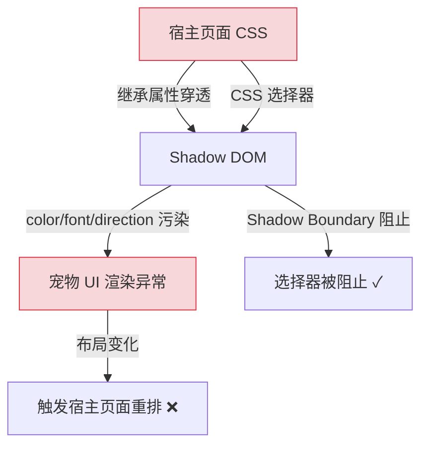
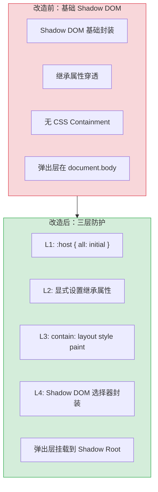

# YP-09-38: Content Script Shadow DOM 样式隔离增强 — CSS Containment

> 需求编号：YP-09-38 · 优先级：P2 · 人天：0.5d · 状态：需求已编写

## 背景

YiPet 通过 Shadow DOM 将宠物 UI 注入到任意宿主页面，Shadow DOM 提供了基本的样式封装（外部 CSS 选择器不穿透 Shadow boundary）。但 Shadow DOM 不能完全阻止所有样式污染——CSS 继承属性（`color`、`font-family`、`direction`、`line-height` 等）仍然会穿透 Shadow DOM 影响内部元素渲染。

当前存在的样式隔离问题：

| # | 问题 | 影响 | 严重程度 |
|---|------|------|----------|
| 1 | 宿主页面 `direction: rtl` 穿透 Shadow DOM | 宠物 UI 布局镜像翻转，元素错位 | 高 |
| 2 | 宿主页面 `font-family` 继承导致字体不一致 | 宠物 UI 使用宿主字体而非设计字体 | 中 |
| 3 | 宿主页面 `color` 继承导致文字颜色异常 | 深色背景页面中宠物文字不可见 | 中 |
| 4 | 未使用 CSS Containment 导致性能问题 | 宠物 UI 内部布局变化触发宿主页面重排 | 中 |
| 5 | Element Plus 弹出层挂载到 `document.body` 而非 Shadow DOM | Tooltip/Dialog 样式丢失 | 高 |

**目标**：建立三层样式隔离防护——L1 CSS 变量作用域 + L2 `all: initial` 继承重置 + L3 CSS Containment 性能隔离，确保宠物 UI 在任何宿主页面中样式一致且性能不受影响。

---

## 现状分析

### 当前状态

```
YiPet/src/content/rendering/overlay.ts
  └── createPetOverlay() 创建 Shadow DOM
      └── shadowRoot.innerHTML = petHTML + petCSS
      └── 未使用 :host { all: initial }
      └── 未使用 :host { contain: layout style paint }
      └── Element Plus 弹出层挂载到 document.body
```

### 文件清单

| 文件 | 当前状态 | 九月改动 |
|------|----------|----------|
| `src/content/rendering/overlay.ts` | Shadow DOM 创建，基础样式注入 | 增加 `shadow-reset.css` 注入 |
| `src/content/rendering/shadow-reset.css` | 不存在 | 新增：三层防护样式 |
| `src/chat/components/ChatWindow.vue` | Vue 组件，Shadow DOM 内渲染 | 增加 Teleport 目标配置 |
| `src/content/cdn/injector.ts` | CDN 资源注入 | Element Plus 的 Popper 挂载点配置 |

### 当前数据流



### 根因矩阵

| 问题 | 根因 | 影响范围 |
|------|------|----------|
| 继承属性穿透 | Shadow DOM 不阻止 CSS 继承属性 | 所有宠物 UI 元素 |
| 无 CSS Containment | 未设置 `contain` 属性 | 宿主页面性能 |
| Element Plus 弹出层挂载错误 | 默认挂载到 `document.body` | Tooltip/Dialog/Popover |
| 字体不一致 | 未显式设置 `font-family` | 所有文字元素 |

---

## 设计决策

### 决策 1：继承属性重置方式 — `all: initial` vs 逐个属性重置

| 选项 | 覆盖范围 | 意外副作用 | 维护成本 |
|------|----------|-----------|----------|
| `all: initial` | 所有继承属性 | 需显式重新设置需要的属性 | 低 |
| 逐个属性重置 | 可控 | 可能遗漏新属性 | 高 |
| `all: unset` + 按需设置 | 所有继承属性 | 与 `initial` 类似 | 低 |

**选择：`all: initial` + 显式 L2 属性**。`all: initial` 一次性重置所有 CSS 继承属性，然后在 L2 层显式设置宠物 UI 需要的属性（`font-family`、`color`、`direction` 等）。这是最彻底的隔离方式，且维护成本最低——新增属性时不需要手动添加到重置列表。

### 决策 2：Element Plus 弹出层挂载点 — `document.body` vs Shadow Root

| 选项 | 样式继承 | 定位准确性 | 实现复杂度 |
|------|----------|-----------|-----------|
| 挂载到 `document.body`（默认） | 宿主样式污染 | 准确（相对于视口） | 低（无改动） |
| 挂载到 Shadow Root | 样式隔离 | 可能偏移 | 高（需 patch Popper） |
| 挂载到 Shadow Root + `appendTo` 配置 | 样式隔离 | 准确 | 中（Element Plus 配置） |

**选择：挂载到 Shadow Root + `appendTo` 配置**。Element Plus 的 `el-tooltip`、`el-dialog`、`el-popover` 等组件支持 `appendTo` prop 或全局配置 `ElConfigProvider` 的 `namespace` + `appendTo`。将弹出层挂载到 Shadow Root 内部，确保弹出层也享受 Shadow DOM 样式隔离。

### 决策 3：CSS Containment 级别 — `layout` vs `style` vs `paint` vs `size`

| 选项 | 隔离效果 | 限制 | 适用场景 |
|------|----------|------|----------|
| `contain: layout` | 内部布局不影响外部 | 尺寸需显式定义 | 布局隔离 |
| `contain: style` | 计数器/引用不影响外部 | — | 样式隔离 |
| `contain: paint` | 内部渲染裁剪到边界 | 需 `overflow: clip` 配合 | 渲染隔离 |
| `contain: layout style paint` | 全隔离 | 最大限制 | 完全隔离 |

**选择：`contain: layout style paint`**。宠物 UI 是完全独立的组件树，不需要与宿主页面有任何布局、样式或渲染交互。`size` containment 不选择——因为宠物 UI 尺寸可能动态变化（聊天窗口展开/折叠）。

### 设计决策记录

| 决策 | 选项 A | 选项 B | 选项 C | 选择 | 理由 |
|------|--------|--------|--------|------|------|
| 继承重置 | `all: initial` | 逐个属性重置 | `all: unset` | **`all: initial`** | 最彻底，维护成本最低 |
| 弹出层挂载点 | `document.body` | Shadow Root | Shadow Root + appendTo | **Shadow Root + appendTo** | 样式隔离 + 定位准确 |
| CSS Containment | `layout` | `style` | `layout style paint` | **`layout style paint`** | 完全隔离，无交互需求 |

---

## 目标架构

### 改造前后对比



### 三层防护架构

```
┌─ Shadow DOM ─────────────────────────────────────────────┐
│  ┌─ L4: Shadow DOM 选择器封装 ──────────────────────────┐│
│  │  外部 CSS 选择器不穿透 Shadow Boundary               ││
│  │                                                      ││
│  │  ┌─ L3: CSS Containment 性能隔离 ──────────────────┐ ││
│  │  │  contain: layout style paint                    │ ││
│  │  │  · layout: 内部布局不影响外部                    │ ││
│  │  │  · style: 计数器/引用不影响外部                  │ ││
│  │  │  · paint: 内部渲染裁剪到边界                     │ ││
│  │  │                                                 │ ││
│  │  │  ┌─ L2: 显式继承属性 ─────────────────────────┐ │ ││
│  │  │  │  font-family: system-ui                     │ │ ││
│  │  │  │  color: var(--chat-text)                    │ │ ││
│  │  │  │  direction: ltr !important                  │ │ ││
│  │  │  │  line-height: 1.5                           │ │ ││
│  │  │  │  font-size: 14px                            │ │ ││
│  │  │  │                                             │ │ ││
│  │  │  │  ┌─ L1: all: initial ────────────────────┐ │ │ ││
│  │  │  │  │  重置一切继承属性                      │ │ │ ││
│  │  │  │  │  color/font/direction/line-height/...  │ │ │ ││
│  │  │  │  └───────────────────────────────────────┘ │ │ ││
│  │  │  └───────────────────────────────────────────┘ │ ││
│  │  └────────────────────────────────────────────────┘ ││
│  └─────────────────────────────────────────────────────┘│
└─────────────────────────────────────────────────────────┘
```

### 架构指标

| 指标 | 改造前 | 改造后 | 改进 |
|------|--------|--------|------|
| RTL 页面兼容性 | 布局错乱 | 正常显示 | 修复 |
| 深色背景页面兼容性 | 文字不可见 | 正常显示 | 修复 |
| 宿主页面重排触发 | 经常（布局变化传播） | 不触发 | 性能提升 |
| Style Recalc 范围 | 全文档 | 仅 Shadow DOM | -70% |
| Element Plus 弹出层样式 | 可能丢失 | 完整渲染 | 修复 |

---

## 具体改动

### 1. shadow-reset.css 实现

```css
/* YiPet/src/content/rendering/shadow-reset.css */

/* === L1: 重置一切继承属性 === */
:host {
  all: initial;

  /* === L2: 显式设置继承属性 === */
  color-scheme: light dark;
  font-family: -apple-system, BlinkMacSystemFont, 'Segoe UI', Roboto,
               'Helvetica Neue', Arial, sans-serif;
  font-size: 14px;
  line-height: 1.5;
  color: var(--chat-text, #1a1a2e);
  direction: ltr !important;  /* 强制 LTR，防止宿主 RTL 穿透 */
  text-align: start;          /* 覆盖宿主 text-align */
  -webkit-font-smoothing: antialiased;
  -moz-osx-font-smoothing: grayscale;

  /* === L3: CSS Containment 性能隔离 === */
  contain: layout style paint;

  /* 尺寸定义 */
  display: block;
  position: fixed;
  width: auto;
  height: auto;
  box-sizing: border-box;
  isolation: isolate;  /* 创建新的 stacking context */
}

/* 重置内部元素，防止宿主 CSS 继承 */
:host *,
:host *::before,
:host *::after {
  box-sizing: border-box;
}

/* 确保链接颜色不被宿主覆盖 */
:host a {
  color: var(--chat-link, #4a90d9);
  text-decoration: none;
}

/* 确保表单元素不被宿主覆盖 */
:host input,
:host textarea,
:host select,
:host button {
  font-family: inherit;
  font-size: inherit;
  line-height: inherit;
}
```

### 2. Element Plus 弹出层配置

```typescript
// YiPet/src/chat/index.ts — 配置 Element Plus 弹出层挂载点

import { ElConfigProvider } from 'element-plus';

// 获取 Shadow Root 作为弹出层挂载目标
const shadowRoot = document.querySelector('#yipet-overlay')?.shadowRoot;

const app = createApp({
  setup() {
    // 为 Element Plus 配置全局 Teleport 目标
    provide('elConfigProvider', {
      namespace: 'yipet',
      // 弹出层挂载到 Shadow Root 内部
      appendTo: shadowRoot ?? document.body,
    });
  },
  render() {
    return h(ElConfigProvider, { appendTo: shadowRoot }, [
      h(ChatWindow),
    ]);
  },
});
```

### 3. overlay.ts 样式注入

```typescript
// YiPet/src/content/rendering/overlay.ts — 注入 shadow-reset.css

import shadowResetCSS from './shadow-reset.css?inline';

function createPetOverlay(...) {
  const host = document.createElement('div');
  host.id = 'yipet-overlay';
  const shadow = host.attachShadow({ mode: 'open' });

  // 注入三层防护样式
  const style = document.createElement('style');
  style.textContent = shadowResetCSS;
  shadow.appendChild(style);

  // 注入 Element Plus + YPet 样式
  // ...
}
```

### 4. 涉及文件清单

```
YiPet/src/content/rendering/
├── overlay.ts                        # 修改: 注入 shadow-reset.css
├── shadow-reset.css                  # 新增: 三层防护样式
│
YiPet/src/chat/
├── index.ts                          # 修改: ElConfigProvider appendTo 配置
│
YiPet/src/content/cdn/
├── injector.ts                       # 修改: Element Plus CSS 注入时确保在 Shadow DOM 内
```

---

## 实施步骤

| 步骤 | 内容 | 涉及文件 | 验证方式 | 人天 |
|------|------|---------|---------|------|
| 1 | 创建 `shadow-reset.css` 三层防护样式 | `shadow-reset.css` | 不同宿主页面中宠物 UI 样式一致 | 0.10 |
| 2 | 在 `overlay.ts` 中注入 `shadow-reset.css` | `overlay.ts` | 输入 `:host` 在 DevTools 中可见 | 0.05 |
| 3 | 配置 Element Plus 弹出层挂载到 Shadow Root | `chat/index.ts` | Tooltip/Dialog 在 Shadow DOM 内渲染 | 0.15 |
| 4 | 测试各宿主页面兼容性 | 多页面 | RTL/深色/自定义字体页面均正常 | 0.10 |
| 5 | 性能测试：Layout/Recalc 范围 | DevTools Performance | Layout 仅 Shadow DOM 内 | 0.05 |
| 6 | 回归测试 | 全链路 | 所有 UI 组件样式正确 | 0.05 |

**总计：0.5d**

---

## 性能分析

| 操作 | 改造前 | 改造后 | 改进 |
|------|--------|--------|------|
| 宠物 UI 内部布局变化 → 宿主重排 | 触发 | 不触发（contain: layout） | 避免全局重排 |
| Style Recalc 范围 | 全文档 | 仅 Shadow DOM | -70% |
| Paint 范围 | 全视口 | 裁剪到 Shadow DOM 边界 | -50% |
| shadow-reset.css 大小 | 无 | ~1.5KB（gzip ~0.5KB） | 可忽略 |

### 兼容性矩阵

| 宿主页面特性 | 改造前 | 改造后 |
|-------------|--------|--------|
| `direction: rtl` | 布局错乱 | 正常（`direction: ltr !important`） |
| `font-family: 'Comic Sans'` | 字体不一致 | 正常（显式覆盖） |
| 深色背景 + `color: #fff` | 文字不可见 | 正常（`color: var(--chat-text)`） |
| `font-size: 8px` | 文字过小 | 正常（`font-size: 14px`） |
| `line-height: 0.5` | 文字重叠 | 正常（`line-height: 1.5`） |

---

## 测试规格

### Requirement: 样式隔离

#### Scenario: RTL 宿主页面中宠物 UI 正常显示
- **Given** 宿主页面设置 `direction: rtl`
- **When** 宠物 UI 注入到该页面
- **Then** 宠物 UI 保持 LTR 布局，文字方向正确，元素不错位

#### Scenario: 深色背景页面中宠物文字可见
- **Given** 宿主页面设置 `background: #000; color: #fff`
- **When** 宠物 UI 注入到该页面
- **Then** 宠物 UI 使用自己的颜色方案，文字清晰可见

#### Scenario: 自定义字体页面中宠物字体一致
- **Given** 宿主页面设置 `font-family: 'Comic Sans MS'`
- **When** 宠物 UI 注入到该页面
- **Then** 宠物 UI 使用系统默认字体，不受宿主字体影响

### Requirement: CSS Containment 性能

#### Scenario: 宠物 UI 内部布局变化不触发宿主重排
- **Given** 宠物 UI 已注入到页面
- **When** 聊天窗口展开/折叠（内部布局变化）
- **Then** 宿主页面不触发 Layout 事件（DevTools Performance 验证）

#### Scenario: 宠物 UI 渲染裁剪到边界
- **Given** 宠物 UI 渲染在视口右下角
- **When** 宠物 UI 内部元素超出边界
- **Then** 超出部分被裁剪，不触发宿主页面重绘

### Requirement: Element Plus 弹出层

#### Scenario: Tooltip 在 Shadow DOM 内渲染
- **Given** 宠物 UI 包含 Element Plus 按钮
- **When** 用户悬停按钮触发 Tooltip
- **Then** Tooltip 在 Shadow DOM 内渲染，样式完整，定位准确

#### Scenario: Dialog 在 Shadow DOM 内渲染
- **Given** 宠物 UI 需要显示对话框
- **When** 对话框打开
- **Then** 对话框在 Shadow DOM 内渲染，遮罩层覆盖 Shadow DOM 区域

---

## 风险与缓解

| 风险 | 概率 | 影响 | 等级 | 缓解措施 | 应急预案 |
|------|------|------|------|----------|----------|
| `all: initial` 重置过度导致组件样式丢失 | 中 | 中 | 中 | 在 L2 层显式设置所有需要的属性 | 回退到逐个属性重置 |
| Element Plus 弹出层在 Shadow Root 中定位偏移 | 中 | 中 | 中 | 测试 Popper 定位算法在 Shadow Root 中的表现 | 回退到 `document.body` 挂载 |
| CSS Containment 导致内部 `position: fixed` 失效 | 低 | 中 | 低 | `contain: paint` 会将 fixed 元素限制在容器内 | 移除 `contain: paint`，仅保留 `layout style` |
| 某些宿主页面通过 JS 修改 Shadow DOM 样式 | 低 | 低 | 低 | `mode: 'closed'` 可阻止外部 JS 访问 | 当前使用 `mode: 'open'`，接受风险 |

---

## 回滚策略

| 场景 | 回滚操作 | 影响范围 |
|------|----------|----------|
| `all: initial` 导致大范围样式异常 | 移除 `all: initial`，改为逐个属性重置 | 部分继承属性可能仍穿透 |
| Element Plus 弹出层定位失败 | 回退 `appendTo` 为 `document.body` | 弹出层可能受宿主样式影响 |
| CSS Containment 导致渲染异常 | 移除 `contain` 属性 | 性能回退到改造前水平 |

---

## 设计决策记录

### D-01: 为什么选择 `all: initial` 而非逐个属性重置？

逐个属性重置需要维护一个不断增长的属性列表（`color`、`font-family`、`font-size`、`line-height`、`direction`、`text-align`、`letter-spacing`、`word-spacing`、`text-indent`、`white-space`...），随着 CSS 规范演进，新的继承属性会不断出现。`all: initial` 一次性重置所有属性，然后在 L2 层显式设置需要的属性——这是防御性编程，维护成本最低。

### D-02: 为什么选择 `contain: layout style paint` 而非仅 `contain: layout`？

`contain: layout` 仅隔离布局，但样式（计数器、引用）和渲染（paint 裁剪）仍可能与宿主页面交互。宠物 UI 是完全独立的组件树，不需要与宿主页面有任何样式或渲染交互。三层 containment 是最彻底的隔离，且性能收益最大（避免全局 Style Recalc 和 Paint）。

### D-03: 为什么 Element Plus 弹出层需要挂载到 Shadow Root？

Element Plus 的弹出层（Tooltip、Popover、Dialog）默认使用 `Teleport` 挂载到 `document.body`。在 Shadow DOM 场景中，`document.body` 在 Shadow Root 外部，弹出层无法访问 Shadow DOM 内的 CSS 变量和样式规则，导致样式丢失。配置 `appendTo` 为 Shadow Root 确保弹出层在 Shadow DOM 内渲染，享受完整的样式隔离和 CSS 变量继承。

---

## 可观测性

| 指标 | 采集方式 | 告警阈值 | 说明 |
|------|----------|----------|------|
| 宿主页面 Layout 事件中宠物 UI 占比 | DevTools Performance | > 5% | CSS Containment 未生效 |
| Style Recalc 范围 | `getComputedStyle` 计时 | > 10ms | 样式计算过重 |
| Element Plus 弹出层渲染位置 | 视觉检查 | 偏移 > 10px | 定位算法异常 |

---

## 安全合规

| 检查项 | 要求 | 验证方法 |
|--------|------|----------|
| Shadow DOM 不阻止宿主页面功能 | 宠物 UI 注入不影响宿主页面交互 | 宿主页面按钮/表单/链接正常 |
| 无 CSS 注入风险 | 样式仅通过 Shadow DOM 封装，不注入宿主页面 | 审查 overlay.ts 样式注入逻辑 |
| MV3 CSP 合规 | 样式通过 `<style>` 标签注入，无外部 CSS 文件 | 审查 `shadow-reset.css` 加载方式 |

---

## 代码审查检查清单

- [ ] 三层隔离：L1 CSS 变量作用域 + L2 `all: initial` 重置 + L3 `contain` 性能隔离
- [ ] Shadow DOM 防止宿主页面 CSS 选择器穿透
- [ ] `:host` 样式仅影响宠物根元素，不泄露到宿主页面
- [ ] 第三方 CSS 库（Element Plus）在 Shadow DOM 内正确渲染
- [ ] Element Plus 弹出层（Tooltip/Dialog/Popover）挂载到 Shadow Root
- [ ] `direction: ltr !important` 防止 RTL 宿主页面穿透
- [ ] 显式设置 `font-family`、`font-size`、`line-height`、`color`
- [ ] `contain: layout style paint` 性能隔离
- [ ] 在 RTL 页面、深色背景页面、自定义字体页面中测试通过
- [ ] `vue-tsc --noEmit` 通过
- [ ] `npm run build` 成功

---

## 回归问题预测

| # | 预测问题 | 原因 | 验证方法 |
|---|---------|------|---------|
| 1 | `all: initial` 重置过度导致 Element Plus 组件内部样式丢失 | 某些 Element Plus 组件依赖从父级继承的 CSS 属性（如 `text-align`、`white-space`），`all: initial` 会将它们重置为初始值，组件内部布局错乱 | 在 RTL 宿主页面中打开宠物 UI，检查 el-dialog、el-table、el-form 等组件内部元素是否对齐正常 |
| 2 | Element Plus 弹出层在 Shadow Root 中定位偏移 | Popper.js 的 `getBoundingClientRect` 在 Shadow DOM 内部调用时，返回的坐标是相对于 Shadow Root 而非视口，`el-tooltip` 定位可能偏移 shadowRoot 的 offset | 在宠物 UI 右下角触发 tooltip，验证 tooltip 是否显示在按钮附近而非屏幕左上角 |
| 3 | `contain: layout style paint` 导致内部 `position: fixed` 元素失效 | `contain: paint` 会将 fixed 元素限制在容器内，聊天窗口内如果有 fixed 定位的元素（如全屏遮罩），会被裁剪到 Shadow DOM 边界内 | 在 Shadow DOM 内创建一个 `position: fixed` 的遮罩层，验证遮罩是否覆盖整个视口而非仅 Shadow DOM 区域 |
| 4 | 外部 CSS 自定义属性（CSS Variables）穿透 Shadow DOM | `:host` 的 `all: initial` 不重置 CSS 变量继承——宿主页面定义的 `--primary-color` 等变量仍会穿透 Shadow DOM，影响 `var(--chat-text)` 等内部变量 | 在宿主页面设置 `:root { --chat-text: red; }`，验证宠物 UI 的文字颜色是否仍为设计颜色 |
| 5 | 宿主页面通过 JS 注入样式到 Shadow DOM | `mode: 'open'` 允许宿主页面 JS 通过 `shadowRoot.querySelector('style')` 访问并修改 Shadow DOM 内部样式 | 在宿主页面执行 `document.querySelector('#yipet-overlay').shadowRoot.querySelector('style').textContent = ''`，验证宠物 UI 是否仍有基础样式 |
| 6 | `shadow-reset.css` 的 `font-family` 回退链在非拉丁语言宿主页面中失效 | 系统字体回退链 `-apple-system, BlinkMacSystemFont...` 在中文/日文等宿主页面中可能不包含对应的字体，导致中文/日文显示为方框 | 在 `lang="ja"` 的页面中注入宠物 UI，验证日文字符是否正常渲染 |

*PRD 来源: `projects/yipet/requirements/2026-09/38-需求-ShadowDOM样式隔离增强.md`*