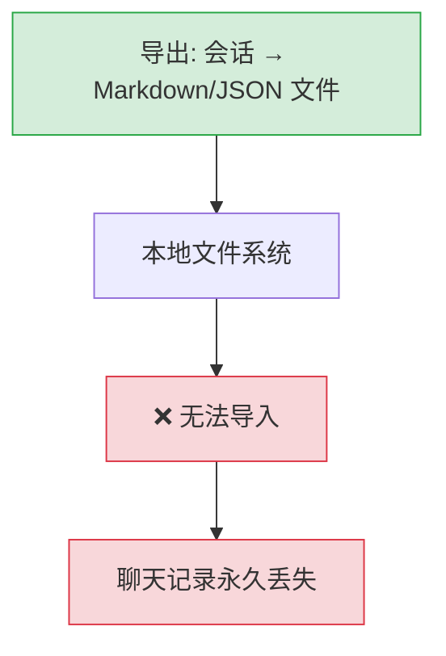
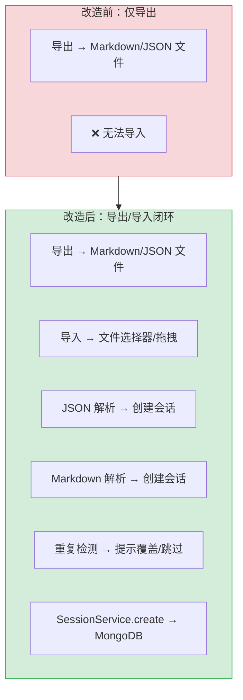
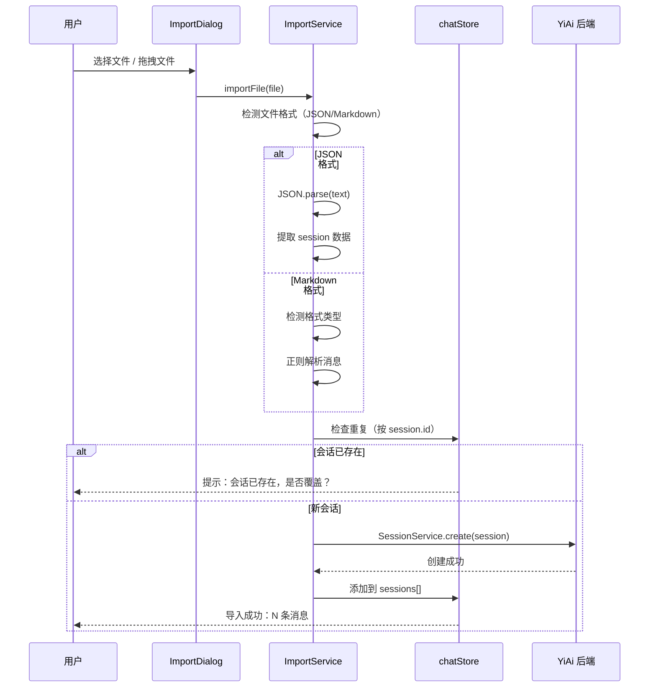

# YP-09-39: 聊天窗口数据导入 — 从外部文件恢复会话

> 需求编号：YP-09-39 · 优先级：P2 · 人天：0.5d · 状态：需求已编写
> 依赖：YP-09-18（聊天消息导出）

## 背景

YP-09-18 实现了会话导出功能，支持 Markdown/JSON 双格式导出。但导出的文件无法反向导入——用户切换设备、重装扩展或浏览器后，无法恢复之前的聊天记录。数据导入是导出功能的必要补充，形成完整的数据迁移闭环。

当前存在的问题：

| # | 问题 | 影响 | 严重程度 |
|---|------|------|----------|
| 1 | 导出的文件无法反向导入 | 用户切换设备后聊天记录永久丢失 | 高 |
| 2 | 无 Markdown 解析能力 | 从其他 AI 平台导出的聊天记录无法迁移 | 中 |
| 3 | 无重复检测机制 | 同一会话被多次导入，数据冗余 | 中 |
| 4 | 无导入错误反馈 | 损坏文件导入时静默失败 | 中 |
| 5 | 大文件导入无进度提示 | 用户不知道导入是否在进行 | 低 |

**目标**：支持 JSON 和 Markdown 两种格式的会话导入，自动检测重复，提供导入进度和错误反馈，形成完整的导出-导入数据闭环。

---

## 现状分析

### 当前状态

```
YiPet/src/chat/stores/chat.ts
  └── exportCurrentSessionMarkdown()  — 导出为 Markdown
  └── exportCurrentSessionJson()     — 导出为 JSON（待开发）
  └── 无 import 相关操作
```

### 文件清单

| 文件 | 当前状态 | 九月改动 |
|------|----------|----------|
| `src/chat/stores/chat.ts` | 仅导出操作 | 新增导入操作 |
| `src/chat/services/importService.ts` | 不存在 | 新增：导入服务 |
| `src/chat/components/ImportDialog.vue` | 不存在 | 新增：导入对话框 |
| `src/chat/components/ChatToolbar/` | 无导入按钮 | 新增导入按钮 |

### 当前数据流



### 根因矩阵

| 问题 | 根因 | 影响范围 |
|------|------|----------|
| 无法导入 | 无导入功能实现 | 用户数据迁移 |
| 无 Markdown 解析 | 未实现 Markdown → 消息 的逆向解析 | 跨平台迁移 |
| 无重复检测 | 导入时未检查已存在的会话 | 数据冗余 |

---

## 设计决策

### 决策 1：导入触发方式 — 文件选择器 vs 拖拽文件 vs 剪贴板

| 选项 | 用户体验 | 实现复杂度 | 浏览器支持 |
|------|----------|-----------|-----------|
| 文件选择器 (`<input type="file">`) | 中 | 低 | 全部 |
| 拖拽文件到聊天窗口 | 高 | 中 | 全部 |
| 剪贴板粘贴 | 中 | 低 | 全部 |

**选择：文件选择器 + 拖拽文件**。文件选择器是最基本的导入方式，拖拽文件提供更便捷的体验（与 YP-09-08 从侧边栏拖拽知识文件到聊天区域一致）。两种方式同时支持，覆盖不同用户习惯。

### 决策 2：Markdown 解析策略 — 正则解析 vs 统一解析器

| 选项 | 准确性 | 兼容性 | 复杂度 |
|------|--------|--------|--------|
| 正则解析（按 `### **User**` 等标记分割） | 中（对格式敏感） | 仅支持 YP-09-18 导出格式 | 低 |
| 统一 Markdown AST 解析器 | 高 | 高（多种格式） | 高 |
| 正则 + 格式检测 | 中 | 中 | 中 |

**选择：正则 + 格式检测**。YP-09-18 导出的 Markdown 格式是固定的（`### **You**` / `### **YiPet**` 标记），正则解析足够。同时检测其他常见格式（如 ChatGPT 导出的 `**User:**` / `**Assistant:**` 格式），通过格式检测自动选择解析策略。

### 决策 3：重复检测策略 — 按 Session ID vs 按消息内容哈希

| 选项 | 准确性 | 性能 | 实现 |
|------|--------|------|------|
| 按 Session ID | 准确（ID 匹配） | 高 | 低 |
| 按消息内容哈希 | 模糊匹配 | 中 | 中 |
| 两者结合 | 最准确 | 中 | 中 |

**选择：按 Session ID**。YP-09-18 导出时包含 `session.id` 字段，导入时直接按 ID 检查 MongoDB 中是否已存在。如果存在，提示用户是否覆盖。不需要复杂的哈希匹配。

### 设计决策记录

| 决策 | 选项 A | 选项 B | 选项 C | 选择 | 理由 |
|------|--------|--------|--------|------|------|
| 导入触发方式 | 文件选择器 | 拖拽文件 | 剪贴板 | **文件选择器 + 拖拽** | 覆盖两种使用习惯 |
| Markdown 解析 | 正则解析 | Markdown AST | 正则+格式检测 | **正则 + 格式检测** | 简单 + 兼容多种格式 |
| 重复检测 | 按 Session ID | 按内容哈希 | 两者结合 | **按 Session ID** | 准确且高效 |

---

## 目标架构

### 改造前后对比



### 导入流程



### 架构指标

| 指标 | 改造前 | 改造后 | 改进 |
|------|--------|--------|------|
| 支持导入格式 | 0 | 2（JSON + Markdown） | 新增功能 |
| 重复检测 | 无 | 按 Session ID | 新增功能 |
| 导入反馈 | 无 | 进度条 + 结果提示 | 新增功能 |
| 数据闭环 | 仅导出 | 导出 + 导入 | 完整闭环 |

---

## 具体改动

### 1. ImportService 实现

```typescript
// YiPet/src/chat/services/importService.ts

interface ImportResult {
  sessionsImported: number;
  messagesImported: number;
  errors: string[];
  duplicates: number;
  skipped: number;
}

class ChatImportService {
  constructor(private sessionService: SessionService) {}

  async importFile(file: File): Promise<ImportResult> {
    const text = await file.text();
    const ext = file.name.split('.').pop()?.toLowerCase();

    if (ext === 'json') {
      return this._importJson(text);
    } else if (ext === 'md' || ext === 'markdown') {
      return this._importMarkdown(text);
    } else {
      return { sessionsImported: 0, messagesImported: 0,
               errors: [`不支持的文件格式: .${ext}`], duplicates: 0, skipped: 0 };
    }
  }

  private async _importJson(text: string): Promise<ImportResult> {
    const result = { sessionsImported: 0, messagesImported: 0,
                     errors: [] as string[], duplicates: 0, skipped: 0 };

    let data: any;
    try {
      data = JSON.parse(text);
    } catch {
      result.errors.push('JSON 格式无效');
      return result;
    }

    // 支持两种 JSON 格式：单个会话 { session: {...} } 或会话数组 [{...}, {...}]
    const sessions = Array.isArray(data) ? data : [data.session ?? data];

    for (const session of sessions) {
      if (!session?.messages?.length) {
        result.skipped++;
        continue;
      }

      // 检查重复
      const existing = await this.sessionService.getById(session.id);
      if (existing) {
        result.duplicates++;
        continue;
      }

      try {
        await this.sessionService.create({
          id: session.id || crypto.randomUUID(),
          title: session.title || '导入的会话',
          messages: session.messages,
          tags: session.tags || ['imported'],
          createdAt: session.createdAt || new Date().toISOString(),
          pageContent: session.pageContent,
        });
        result.sessionsImported++;
        result.messagesImported += session.messages.length;
      } catch (err) {
        result.errors.push(`导入会话 "${session.title}" 失败: ${(err as Error).message}`);
      }
    }

    return result;
  }

  private async _importMarkdown(text: string): Promise<ImportResult> {
    const result = { sessionsImported: 0, messagesImported: 0,
                     errors: [] as string[], duplicates: 0, skipped: 0 };

    // 检测 Markdown 格式
    const format = this._detectMarkdownFormat(text);
    const messages = this._parseMarkdownMessages(text, format);

    if (messages.length === 0) {
      result.errors.push('无法从 Markdown 中提取消息');
      return result;
    }

    try {
      await this.sessionService.create({
        id: crypto.randomUUID(),
        title: '导入的会话',
        messages,
        tags: ['imported', 'markdown'],
        createdAt: new Date().toISOString(),
      });
      result.sessionsImported = 1;
      result.messagesImported = messages.length;
    } catch (err) {
      result.errors.push(`导入失败: ${(err as Error).message}`);
    }

    return result;
  }

  private _detectMarkdownFormat(text: string): 'yipet' | 'chatgpt' | 'generic' {
    if (text.includes('### **You**') || text.includes('### **YiPet**')) {
      return 'yipet';
    }
    if (text.includes('**User:**') || text.includes('**Assistant:**')) {
      return 'chatgpt';
    }
    return 'generic';
  }

  private _parseMarkdownMessages(text: string, format: string): ChatMessage[] {
    const messages: ChatMessage[] = [];
    const lines = text.split('\n');
    let currentRole: 'user' | 'assistant' | null = null;
    let currentContent: string[] = [];

    const userPatterns = {
      yipet: /^### \*\*You\*\*/,
      chatgpt: /^\*\*User:\*\*/,
      generic: /^#+\s*(User|You|Human|用户)/i,
    };
    const assistantPatterns = {
      yipet: /^### \*\*YiPet\*\*/,
      chatgpt: /^\*\*Assistant:\*\*/,
      generic: /^#+\s*(Assistant|AI|Bot|助手|AI)/i,
    };

    const userRe = userPatterns[format] || userPatterns.generic;
    const assistantRe = assistantPatterns[format] || assistantPatterns.generic;

    for (const line of lines) {
      if (userRe.test(line)) {
        if (currentRole) {
          messages.push({ role: currentRole, content: currentContent.join('\n').trim() });
        }
        currentRole = 'user';
        currentContent = [];
      } else if (assistantRe.test(line)) {
        if (currentRole) {
          messages.push({ role: currentRole, content: currentContent.join('\n').trim() });
        }
        currentRole = 'assistant';
        currentContent = [];
      } else if (currentRole && line.trim()) {
        currentContent.push(line);
      }
    }

    if (currentRole && currentContent.length > 0) {
      messages.push({ role: currentRole, content: currentContent.join('\n').trim() });
    }

    return messages;
  }
}
```

### 2. ImportDialog.vue 组件

```vue
<!-- YiPet/src/chat/components/ImportDialog.vue 结构 -->

<template>
  <el-dialog v-model="visible" title="导入会话" width="500px">
    <div class="import-area"
         @dragover.prevent
         @drop.prevent="onDrop">
      <input ref="fileInput" type="file" accept=".json,.md" @change="onFileSelect" hidden />
      <div class="import-dropzone" @click="fileInput?.click()">
        <p>拖拽文件到此处，或点击选择文件</p>
        <p class="hint">支持 .json / .md 格式</p>
      </div>
    </div>

    <div v-if="importing" class="import-progress">
      <el-progress :percentage="progress" />
      <p>{{ progressText }}</p>
    </div>

    <div v-if="result" class="import-result">
      <p>导入完成：{{ result.sessionsImported }} 个会话，{{ result.messagesImported }} 条消息</p>
      <p v-if="result.duplicates">跳过 {{ result.duplicates }} 个重复会话</p>
      <p v-if="result.errors.length" class="error">错误：{{ result.errors.join(', ') }}</p>
    </div>

    <template #footer>
      <el-button @click="visible = false">关闭</el-button>
    </template>
  </el-dialog>
</template>
```

### 3. 涉及文件清单

```
YiPet/src/chat/
├── services/importService.ts         # 新增: 导入服务
├── components/ImportDialog.vue       # 新增: 导入对话框
├── components/ChatToolbar/           # 修改: 新增导入按钮
├── stores/chat.ts                    # 修改: 新增 importSession() 操作
└── types.ts                          # 修改: +ImportResult 接口
```

---

## 实施步骤

| 步骤 | 内容 | 涉及文件 | 验证方式 | 人天 |
|------|------|---------|---------|------|
| 1 | 实现 `ImportService` 核心逻辑 | `importService.ts` | 导入 JSON → 创建会话成功 | 0.15 |
| 2 | 实现 Markdown 解析（YP-09-18 格式） | `importService.ts` | 导入 MD → 消息正确提取 | 0.10 |
| 3 | 实现 `ImportDialog.vue` 文件选择器 + 拖拽 | `ImportDialog.vue` | 选择文件 → 显示导入进度 | 0.10 |
| 4 | 在 ChatToolbar 中添加导入按钮 | `ChatToolbar/` | 点击导入按钮 → 打开对话框 | 0.05 |
| 5 | 重复检测 + 覆盖/跳过逻辑 | `stores/chat.ts` | 重复导入 → 提示 | 0.05 |
| 6 | 回归测试 | 全链路 | 导出 → 导入 → 数据一致 | 0.05 |

**总计：0.5d**

---

## 性能分析

| 操作 | 耗时 | 说明 |
|------|------|------|
| 文件读取 (1MB) | < 10ms | `File.text()` 本地读取 |
| JSON 解析 (1000 条消息) | < 5ms | `JSON.parse` |
| Markdown 解析 (1000 行) | < 10ms | 正则逐行解析 |
| 重复检测 (MongoDB) | < 50ms | 按 Session ID 查询 |
| 会话创建 (MongoDB) | < 50ms | `SessionService.create` |

### 容量规划

| 文件大小 | 消息数 | 导入耗时 | 说明 |
|----------|--------|----------|------|
| 10KB | ~20 | < 100ms | 小型会话 |
| 100KB | ~200 | < 500ms | 中型会话 |
| 1MB | ~2000 | < 2s | 大型会话，需分批导入 |
| 10MB | ~20000 | < 10s | 批量导入，需进度条 |

---

## 测试规格

### Requirement: JSON 导入

#### Scenario: 导入 YP-09-18 格式 JSON 文件
- **Given** 用户有 YP-09-18 导出的 JSON 文件
- **When** 用户选择该文件导入
- **Then** 新会话出现在会话列表中，消息完整恢复

#### Scenario: 导入 JSON 格式无效
- **Given** 用户选择的文件不是有效 JSON
- **When** 用户尝试导入
- **Then** 显示错误提示 "JSON 格式无效"，不创建会话

### Requirement: Markdown 导入

#### Scenario: 导入 YP-09-18 格式 Markdown 文件
- **Given** 用户有 YP-09-18 导出的 Markdown 文件
- **When** 用户选择该文件导入
- **Then** 消息按 `### **You**` / `### **YiPet**` 标记正确分割，角色正确

#### Scenario: 导入 ChatGPT 格式 Markdown
- **Given** 用户有 ChatGPT 导出的 Markdown 文件（`**User:**` / `**Assistant:**` 格式）
- **When** 用户选择该文件导入
- **Then** 格式被自动检测，消息正确解析

### Requirement: 重复检测

#### Scenario: 导入已存在的会话
- **Given** 会话 `abc-123` 已存在于 MongoDB
- **When** 用户导入包含相同 Session ID 的文件
- **Then** 提示 "会话已存在"，跳过该会话

#### Scenario: 导入大数据文件
- **Given** 用户选择 5MB 的 JSON 文件（包含 50 个会话）
- **When** 用户导入
- **Then** 显示进度条，逐个导入，完成后显示汇总结果

---

## 风险与缓解

| 风险 | 概率 | 影响 | 等级 | 缓解措施 | 应急预案 |
|------|------|------|------|----------|----------|
| 大文件导入超时 | 中 | 中 | 中 | 分批导入（每批 50 条消息），显示进度 | 限制文件大小 ≤ 10MB |
| Markdown 格式不兼容 | 中 | 低 | 低 | 支持多种常见格式检测 | 提示用户转换格式 |
| 导入恶意文件（JSON 注入） | 低 | 高 | 中 | 严格校验消息字段类型（role/content/timestamp） | 校验失败拒绝导入 |
| 导入导致 MongoDB 文档过大 | 低 | 低 | 低 | 单会话消息数 ≤ 2000 条限制 | 截断超长会话 |

---

## 回滚策略

| 场景 | 回滚操作 | 影响范围 |
|------|----------|----------|
| 导入功能出现严重 bug | 隐藏导入按钮，移除 `ImportService` | 导出功能不受影响 |
| Markdown 解析精度问题 | 移除 Markdown 导入，仅保留 JSON 导入 | 用户需先转为 JSON 再导入 |
| 导入导致会话列表异常 | 手动删除导入的会话，回退 import 相关 commit | 仅导入的会话受影响 |

---

## 设计决策记录

### D-01: 为什么选择文件选择器 + 拖拽两种触发方式？

文件选择器是最基本的文件导入方式，所有浏览器都支持。拖拽文件提供更便捷的体验，与 YP-09-08 从侧边栏拖拽知识文件到聊天区域的设计一致。两种方式覆盖不同用户习惯：键盘用户偏好文件选择器，鼠标用户偏好拖拽。

### D-02: 为什么 Markdown 解析使用正则而非 AST 解析器？

YP-09-18 导出的 Markdown 格式是固定的（`### **You**` / `### **YiPet**` 标记），正则解析足够准确。引入完整的 Markdown AST 解析器（如 `unified` + `remark`）会增加 ~50KB 包体积，对于仅需提取消息角色的简单需求来说过度设计。格式检测机制可兼容 ChatGPT 等常见导出格式。

### D-03: 为什么重复检测按 Session ID 而非消息内容哈希？

Session ID 是 YP-09-18 导出时包含的唯一标识符，导入时直接按 ID 查询 MongoDB 即可判断是否重复。消息内容哈希需要计算所有消息的哈希值，且无法区分"同一会话的不同版本"和"两个相似的会话"。按 Session ID 检测更准确、更高效。

---

## 可观测性

| 指标 | 采集方式 | 告警阈值 | 说明 |
|------|----------|----------|------|
| 导入成功率 | importFile 成功/失败计数 | < 90% | 文件格式或网络问题 |
| 导入耗时 | `performance.now()` 计时 | > 5s（单文件） | 文件过大或网络慢 |
| 重复率 | duplicates / total_sessions | > 50% | 用户重复导入同一文件 |

---

## 安全合规

| 检查项 | 要求 | 验证方法 |
|--------|------|----------|
| 文件内容校验 | 严格校验消息字段类型（role 仅限 'user'/'assistant'，content 为字符串） | 代码审查 |
| 无 XSS 风险 | 导入的消息内容在渲染时经过 `marked` markdown 渲染（已有 XSS 防护） | 导入包含 `<script>` 的消息 → 不执行 |
| 文件大小限制 | 单文件 ≤ 10MB | 前端校验 + 提示 |

---

## 代码审查检查清单

- [ ] 支持 JSON 和 Markdown 两种格式导入
- [ ] JSON 格式校验：解析失败时提示错误而非崩溃
- [ ] Markdown 格式自动检测：YP-09-18 / ChatGPT / 通用格式
- [ ] 重复检测：按 Session ID 检查，存在时提示
- [ ] 导入进度提示：大文件导入时显示进度条
- [ ] 导入结果汇总：显示导入/跳过/错误数量
- [ ] 文件大小限制 ≤ 10MB
- [ ] 消息字段类型校验（role/content/timestamp）
- [ ] `vue-tsc --noEmit` 通过
- [ ] `npm run build` 成功

---

## 回归问题预测

| # | 预测问题 | 原因 | 验证方法 |
|---|---------|------|---------|
| 1 | Markdown 格式检测误判导致消息解析错误 | `_detectMarkdownFormat` 仅检查文本中是否包含特定标记字符串，如果文本内容中包含 `**User:**` 字样（如 AI 讨论用户权限），会误判为 ChatGPT 格式 | 构造一个 YiPet 格式的 Markdown 文件，其中 AI 回复内容包含 "**User:** 是系统的核心概念"，验证导入后消息角色是否正确 |
| 2 | JSON 导入时字段校验不足导致 XSS 或数据污染 | `_importJson` 中虽然检查 `role` 和 `content` 字段，但未校验 `content` 是否为合法字符串（可能是对象、数组、null），注入的 `<script>` 标签可能在后续渲染时被执行 | 构造 JSON 文件：`{"messages": [{"role": "user", "content": ""}]}`，导入后验证渲染时是否执行了脚本 |
| 3 | 大文件导入时部分批次成功、部分失败导致数据不一致 | 分批导入时，前 3 个会话创建成功，第 4 个失败后 `ImportResult` 返回了部分成功计数，但用户无法区分哪些已导入、哪些失败 | 导入包含 5 个会话的 JSON（其中第 3 个缺少 `messages` 字段），验证结果汇总是否正确列出每个会话的导入状态 |
| 4 | 重复检测在并发导入时失效 | 用户快速拖入两个相同文件，两个 `importFile` 调用几乎同时执行，`SessionService.getById` 都返回 `null`（因为第一个还未写完），导致创建重复会话 | 几乎同时拖入两个相同文件，验证最终仅创建 1 个会话 |
| 5 | 导入后消息 `timestamp` 字段缺失导致排序错乱 | 外部导入的 Markdown 文件没有 `timestamp` 字段，`_parseMarkdownMessages` 未生成 `timestamp`，导致导入后消息列表按 `createdAt` 排序而非按对话顺序 | 导入一个 10 轮对话的 Markdown 文件，验证消息列表顺序与原始对话顺序一致 |
| 6 | 导入文件的 `session.id` 与现有会话 ID 冲突但未被覆盖 | 按 Session ID 重复检测时，用户选择"覆盖"但实际上 `_importJson` 中的重复检测逻辑是 `continue`（跳过），没有实现覆盖逻辑 | 导入与现有会话相同 ID 的 JSON 文件，选择"覆盖"后验证旧会话的消息是否被替换 |

*PRD 来源: `projects/yipet/requirements/2026-09/39-需求-聊天数据导入.md`*