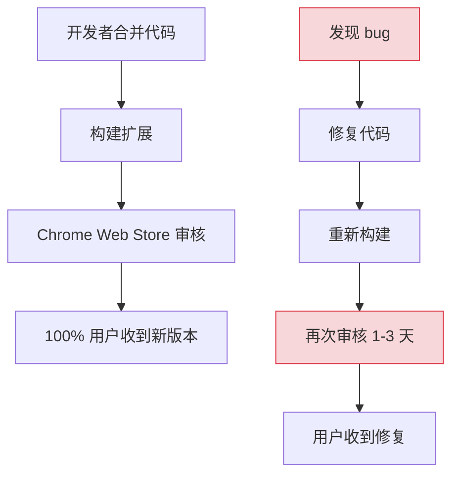
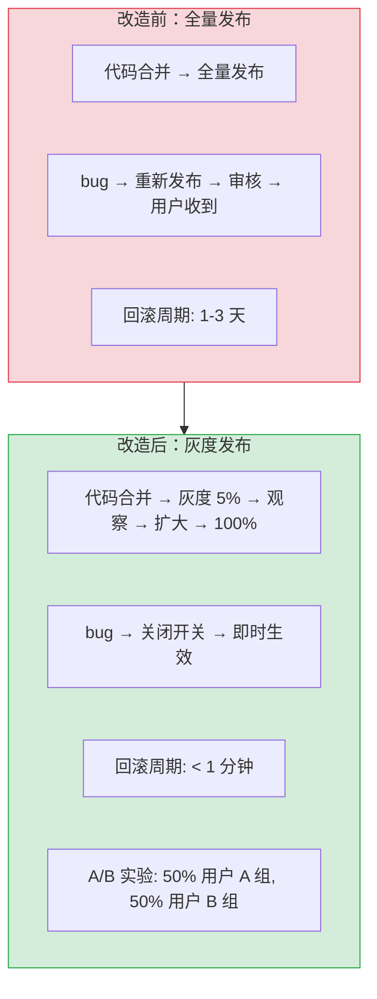
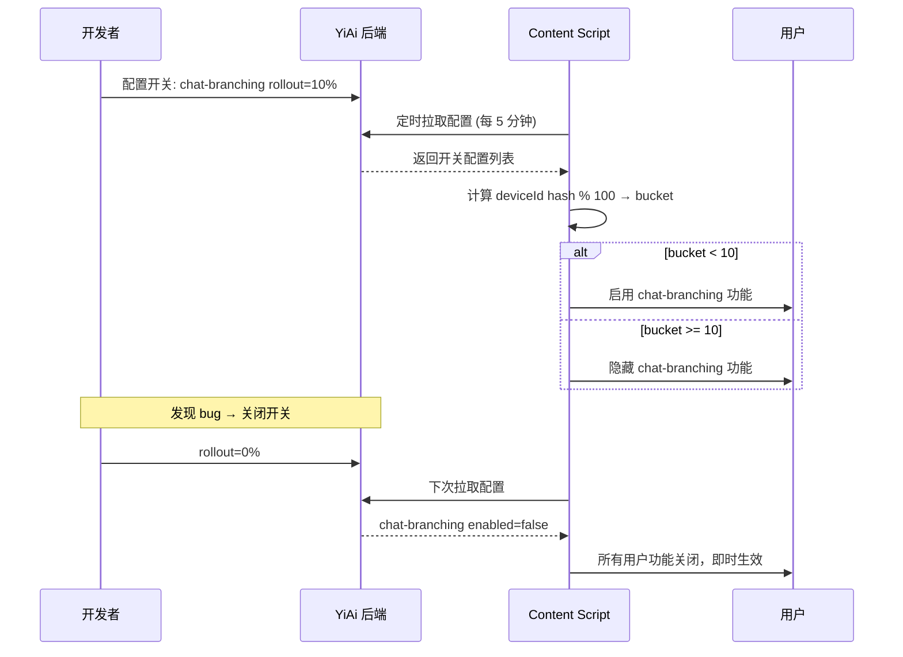

# YP-09-40: 聊天窗口特性开关与 A/B 实验框架 — Feature Flag 与灰度发布

> 需求编号：YP-09-40 · 优先级：P2 · 人天：0.5d · 状态：需求已编写

## 背景

YiPet 当前所有功能通过完整发布推到 100% 用户——没有灰度机制。一个新功能一旦合并到 main 分支，所有用户都会收到。一旦有 bug，影响 100% 用户，且无法快速回滚（Chrome Web Store 审核周期 1-3 天）。

当前问题：

| # | 问题 | 影响 | 严重程度 |
|---|------|------|----------|
| 1 | 新功能无法灰度验证 | bug 影响 100% 用户 | 高 |
| 2 | 无法 A/B 对比功能效果 | 数据驱动决策缺失 | 中 |
| 3 | 回滚只能通过发布新版本 | 修复周期 > 1 天 | 高 |
| 4 | 无法为特定用户开启实验功能 | 内测/众测困难 | 中 |
| 5 | 功能代码即使关闭仍在打包中 | 包体积无优化 | 低 |

**目标**：建立基于设备 ID 确定性哈希的特性开关框架，支持灰度发布（rollout 0-100%）、白名单先行体验、远程配置更新，实现功能的安全渐进式发布。

---

## 现状分析

### 当前状态

```
YiPet 无特性开关机制
  └── 所有功能代码随扩展打包
  └── 所有用户收到相同版本
  └── 回滚 = 发布新版本 → CWS 审核 1-3 天
```

### 文件清单

| 文件 | 当前状态 | 九月改动 |
|------|----------|----------|
| `src/shared/feature-flags.ts` | 不存在 | 新增：特性开关服务 |
| `src/chat/stores/chat.ts` | 无开关判断 | 功能包裹在 `isEnabled()` 条件中 |
| `src/api/services/feature-flags.ts` | 不存在 | 新增：远程配置拉取 |
| `src/chat/components/ChatToolbar/` | 无开关 UI | 新增：开关管理面板 |

### 当前数据流



### 根因矩阵

| 问题 | 根因 | 影响范围 |
|------|------|----------|
| 无法灰度 | 无特性开关机制 | 所有用户 |
| 无法快速回滚 | 无远程开关 | 回滚周期长 |
| 无 A/B 实验 | 无用户分组机制 | 数据驱动决策 |

---

## 设计决策

### 决策 1：特性开关配置来源 — 本地静态 vs 远程动态 vs 混合

| 选项 | 更新速度 | 离线可用 | 安全性 | 复杂度 |
|------|----------|----------|--------|--------|
| 本地静态（打包在扩展中） | 慢（需重新发布） | 是 | 高 | 低 |
| 远程动态（YiAi 后端） | 快（实时） | 否（需网络） | 中 | 中 |
| 混合（本地默认 + 远程覆盖） | 快 | 是（默认值） | 高 | 中 |

**选择：混合模式**。本地包含所有开关的默认值（扩展打包时），确保离线时开关可用。远程配置（YiAi 后端）可覆盖默认值，实现实时灰度调整。本地缓存远程配置到 `chrome.storage.local`，减少网络依赖。

### 决策 2：用户分组方式 — 随机 vs 设备 ID 哈希 vs 用户 ID

| 选项 | 确定性 | 一致性 | 无需登录 | 实现 |
|------|--------|--------|----------|------|
| 随机（每次 Math.random()） | 否（每次不同） | 否 | 是 | 低 |
| 设备 ID 哈希 | 是（同设备同组） | 是（跨会话一致） | 是 | 中 |
| 用户 ID 哈希 | 是 | 是 | 否（需登录） | 中 |

**选择：设备 ID 哈希**。YiPet 无需登录，设备 ID 是唯一可用的稳定标识符。设备 ID 通过 `crypto.randomUUID()` 生成并持久化到 `chrome.storage.local`，扩展卸载前保持不变。哈希 + 取模实现确定性分组，确保同一设备始终在同一组。

### 决策 3：开关状态生命周期 — 3 阶段 vs 4 阶段 vs 5 阶段

| 选项 | 阶段数 | 适用场景 |
|------|--------|----------|
| 3 阶段（development → beta → released） | 3 | 简单项目 |
| 4 阶段（development → beta → rolling → released） | 4 | 中等复杂度 |
| 5 阶段（development → canary → beta → rolling → released） | 5 | 大型项目 |

**选择：4 阶段（development → beta → rolling → released）**。development 阶段仅开发者可见（白名单），beta 阶段灰度 5-10%，rolling 阶段逐步扩大灰度比例，released 阶段 100% 用户。canary 阶段对于 YiPet 的规模来说过度设计。

### 设计决策记录

| 决策 | 选项 A | 选项 B | 选项 C | 选择 | 理由 |
|------|--------|--------|--------|------|------|
| 配置来源 | 本地静态 | 远程动态 | 混合 | **混合** | 离线可用 + 实时更新 |
| 用户分组 | 随机 | 设备 ID 哈希 | 用户 ID 哈希 | **设备 ID 哈希** | 一致性 + 无需登录 |
| 生命周期 | 3 阶段 | 4 阶段 | 5 阶段 | **4 阶段** | 恰到好处的粒度 |

---

## 目标架构

### 改造前后对比



### 目标流程



### 特性开关管理表

| Flag Key | 功能 | 阶段 | 灰度 | 状态 |
|----------|------|------|------|------|
| `chat-branching` | 会话分支管理 (YP-09-36) | beta | 10% | 实验 |
| `voice-input` | 语音输入 (YP-09-27) | beta | 20% | 实验 |
| `image-paste` | 图片粘贴上传 (YP-09-33) | rolling | 50% | 灰度中 |
| `dark-theme` | 暗色主题 (YP-09-26) | released | 100% | 已发布 |
| `export-session` | 会话导出 (YP-09-18) | released | 100% | 已发布 |
| `sidebar-bookmarks` | 侧边栏书签 (YP-09-35) | development | 0% | 开发中 |

### 架构指标

| 指标 | 改造前 | 改造后 | 改进 |
|------|--------|--------|------|
| 灰度发布 | 不支持 | 0-100% 渐进式 | 新增功能 |
| 回滚时间 | 1-3 天（CWS 审核） | < 1 分钟（关闭开关） | -99.9% |
| A/B 实验 | 不支持 | 确定性分组 | 新增功能 |
| 白名单先行体验 | 不支持 | 按设备 ID | 新增功能 |

---

## 具体改动

### 1. FeatureFlagService 实现

```typescript
// YiPet/src/shared/feature-flags.ts

interface FeatureFlag {
  key: string;
  description: string;
  enabled: boolean;
  rolloutPercentage: number;  // 0-100
  whitelist: string[];        // 设备 ID 白名单
  stage: 'development' | 'beta' | 'rolling' | 'released';
  updatedAt: number;
}

class FeatureFlagService {
  private _flags: Map<string, FeatureFlag> = new Map();
  private _deviceId: string;
  private _initialized = false;

  constructor() {
    this._deviceId = this._getOrCreateDeviceId();
  }

  async init() {
    // 1. 加载本地默认配置
    const defaults = this._getDefaultFlags();
    defaults.forEach(f => this._flags.set(f.key, f));

    // 2. 尝试加载远程配置覆盖
    try {
      const remote = await this._fetchRemoteFlags();
      remote.forEach(f => {
        // 远程配置覆盖本地默认值
        this._flags.set(f.key, { ...this._flags.get(f.key), ...f });
      });
    } catch {
      // 远程配置不可用——使用本地默认值
      console.debug('[FeatureFlags] 远程配置不可用，使用本地默认值');
    }

    // 3. 缓存到 chrome.storage
    await this._cacheFlags();
    this._initialized = true;
  }

  isEnabled(key: string): boolean {
    if (!this._initialized) return false;  // 未初始化——默认关闭

    const flag = this._flags.get(key);
    if (!flag) return false;
    if (!flag.enabled) return false;

    // 白名单用户始终开启
    if (flag.whitelist.includes(this._deviceId)) return true;

    // released 阶段——100% 用户
    if (flag.stage === 'released') return true;

    // 灰度——基于设备 ID 哈希的确定性分组
    const hash = this._hashDevice(key);
    const bucket = hash % 100;
    return bucket < flag.rolloutPercentage;
  }

  getFlag(key: string): FeatureFlag | undefined {
    return this._flags.get(key);
  }

  getAllFlags(): FeatureFlag[] {
    return [...this._flags.values()];
  }

  private _getOrCreateDeviceId(): string {
    // deviceId 持久化到 chrome.storage.local，扩展卸载前保持不变
    const stored = localStorage.getItem('yipet:deviceId');
    if (stored) return stored;

    const id = crypto.randomUUID();
    localStorage.setItem('yipet:deviceId', id);
    return id;
  }

  private _hashDevice(salt: string): number {
    const str = `${salt}:${this._deviceId}`;
    let hash = 0;
    for (let i = 0; i < str.length; i++) {
      hash = ((hash << 5) - hash) + str.charCodeAt(i);
      hash |= 0;
    }
    return Math.abs(hash);
  }

  private _getDefaultFlags(): FeatureFlag[] {
    return [
      { key: 'chat-branching', description: '会话分支管理', enabled: false,
        rolloutPercentage: 0, whitelist: [], stage: 'development', updatedAt: 0 },
      { key: 'voice-input', description: '语音输入', enabled: false,
        rolloutPercentage: 0, whitelist: [], stage: 'development', updatedAt: 0 },
      { key: 'image-paste', description: '图片粘贴上传', enabled: true,
        rolloutPercentage: 50, whitelist: [], stage: 'rolling', updatedAt: 0 },
      { key: 'dark-theme', description: '暗色主题', enabled: true,
        rolloutPercentage: 100, whitelist: [], stage: 'released', updatedAt: 0 },
      { key: 'export-session', description: '会话导出', enabled: true,
        rolloutPercentage: 100, whitelist: [], stage: 'released', updatedAt: 0 },
    ];
  }

  private async _fetchRemoteFlags(): Promise<Partial<FeatureFlag>[]> {
    const resp = await fetch(`${YIAI_BASE}/feature-flags`);
    return resp.json();
  }

  private async _cacheFlags() {
    const cache = [...this._flags.values()].map(f => ({
      key: f.key, enabled: f.enabled, rolloutPercentage: f.rolloutPercentage,
      whitelist: f.whitelist, stage: f.stage, updatedAt: f.updatedAt,
    }));
    await chrome.storage.local.set({ 'yipet:featureFlags': cache });
  }
}

export const featureFlags = new FeatureFlagService();
```

### 2. 功能包裹示例

```typescript
// YiPet/src/chat/stores/chat.ts — 使用示例

import { featureFlags } from '@/shared/feature-flags';

// 初始化
await featureFlags.init();

// 条件渲染功能
if (featureFlags.isEnabled('chat-branching')) {
  // YP-09-36 会话分支功能
  showBranchingUI();
}

if (featureFlags.isEnabled('voice-input')) {
  // YP-09-27 语音输入功能
  showVoiceButton();
}
```

### 3. 涉及文件清单

```
YiPet/src/shared/
├── feature-flags.ts                  # 新增: FeatureFlagService
│
YiPet/src/chat/
├── index.ts                          # 修改: 初始化时 await featureFlags.init()
├── stores/chat.ts                    # 修改: 功能包裹在 isEnabled() 条件中
├── components/
│   ├── ChatToolbar/                  # 修改: 工具栏按钮按开关条件渲染
│   └── FeatureFlagPanel.vue          # 新增: 开关管理面板（仅白名单用户可见）
│
YiAi/src/domain/feature-flags/
├── flag_service.py                   # 新增: 远程开关配置管理
```

---

## 实施步骤

| 步骤 | 内容 | 涉及文件 | 验证方式 | 人天 |
|------|------|---------|---------|------|
| 1 | 实现 `FeatureFlagService` 核心逻辑 | `feature-flags.ts` | 单元测试：hash 确定性、白名单 | 0.15 |
| 2 | 在 chat/index.ts 中初始化开关服务 | `chat/index.ts` | `featureFlags.init()` 后 isEnabled 返回正确 | 0.05 |
| 3 | 包裹现有功能（chat-branching, voice-input 等） | `stores/chat.ts` | 开关关闭时功能不可见 | 0.10 |
| 4 | 实现远程配置 API（YiAi） | `flag_service.py` | POST /feature-flags 返回配置 | 0.10 |
| 5 | 添加开关管理面板（仅白名单） | `FeatureFlagPanel.vue` | 白名单用户可见开关面板 | 0.05 |
| 6 | 回归测试 | 全链路 | 开关开启/关闭 → 功能显示/隐藏 | 0.05 |

**总计：0.5d**

---

## 性能分析

| 操作 | 耗时 | 说明 |
|------|------|------|
| `isEnabled()` 调用 | < 0.1ms | 纯内存操作（Map 查找 + 哈希计算） |
| 远程配置拉取 | < 100ms | 仅初始化时调用一次 |
| 设备 ID 哈希计算 | < 0.1ms | 简单字符串哈希 |
| 配置缓存读取 | < 5ms | `chrome.storage.local.get` |

---

## 测试规格

### Requirement: 确定性分组

#### Scenario: 同一设备始终在同一组
- **Given** 设备 ID 为 `abc-123`
- **When** 多次调用 `isEnabled('chat-branching')`
- **Then** 结果始终一致（不随机变化）

#### Scenario: 不同设备可能在不同组
- **Given** 设备 A 和 设备 B 的 deviceId 不同
- **When** 灰度 50% 时
- **Then** 两个设备可能在不同组（约 50% 概率在同一组）

### Requirement: 白名单

#### Scenario: 白名单设备始终开启
- **Given** 设备 ID `abc-123` 在白名单中，开关灰度 0%
- **When** 调用 `isEnabled('chat-branching')`
- **Then** 返回 `true`（白名单优先级高于灰度）

### Requirement: 远程配置

#### Scenario: 远程配置覆盖本地默认值
- **Given** 本地默认 `chat-branching` rollout=0%
- **When** 远程配置返回 `chat-branching` rollout=10%
- **Then** `isEnabled('chat-branching')` 按 10% 灰度计算

### Requirement: 开关关闭时功能代码不执行

#### Scenario: 开关关闭时功能代码不执行
- **Given** `voice-input` 开关 enabled=false
- **When** 聊天窗口渲染
- **Then** 语音按钮不渲染，`SpeechRecognition` 对象不创建

---

## 风险与缓解

| 风险 | 概率 | 影响 | 等级 | 缓解措施 | 应急预案 |
|------|------|------|------|----------|----------|
| 远程配置被篡改 | 低 | 高 | 中 | YiAi 后端配置需认证，HTTPS 传输 | 回退到本地缓存配置 |
| 开关配置未同步（SW 和 CS 读取不同步） | 中 | 中 | 中 | 统一通过 `chrome.storage.local` 缓存，初始化时加载 | 开关切换后延迟 5 分钟生效 |
| released 开关代码残留 | 中 | 低 | 低 | 定期清理已发布开关的代码分支 | 代码审查时检查 |
| 设备 ID 在 localStorage 中丢失 | 低 | 低 | 低 | 丢失时自动生成新 ID（用户分组可能变化） | 接受低频分组变化 |

---

## 回滚策略

| 场景 | 回滚操作 | 影响范围 |
|------|----------|----------|
| 远程配置服务故障 | 开关回退到本地缓存值 | 开关配置可能不是最新 |
| 开关逻辑 bug | 设置 `enabled=false` 远程关闭 | 功能即时不可用 |
| 设备 ID 哈希算法 bug | 修复哈希算法，分组可能变化 | 部分用户可能切换分组 |

---

## 设计决策记录

### D-01: 为什么选择设备 ID 哈希而非随机分组？

随机分组（每次 `Math.random() < 0.1`）导致同一用户每次打开扩展时可能在不同组——用户体验不一致（有时看到功能，有时看不到）。设备 ID 哈希保证同一设备始终在同一组，用户体验一致，且便于 A/B 实验的长期效果追踪。

### D-02: 为什么选择混合模式（本地默认 + 远程覆盖）？

纯本地模式回滚慢（需重新发布扩展），纯远程模式离线不可用。混合模式在扩展中打包默认值（离线可用），远程配置可覆盖默认值（实时回滚），两者结合兼顾可用性和灵活性。

### D-03: 为什么 released 阶段的开关代码不删除？

保留 released 开关的代码分支作为"紧急关闭"开关——如果已发布功能突然出现严重 bug（如数据泄露），可以通过远程配置立即关闭该功能，无需等待 CWS 审核。这是"安全网"设计。

---

## 可观测性

| 指标 | 采集方式 | 告警阈值 | 说明 |
|------|----------|----------|------|
| 远程配置拉取成功率 | fetch 成功/失败计数 | < 95% | 网络或后端问题 |
| 开关状态不一致率 | 不同 Tab 中 isEnabled 结果对比 | > 5% | 配置同步延迟 |
| 开关配置缓存年龄 | `Date.now() - flag.updatedAt` | > 1 小时 | 远程配置长时间未更新 |

---

## 安全合规

| 检查项 | 要求 | 验证方法 |
|--------|------|----------|
| 设备 ID 不关联用户身份 | deviceId 通过 `crypto.randomUUID()` 生成，不包含用户信息 | 审查 deviceId 生成逻辑 |
| 远程配置传输加密 | 生产环境 HTTPS | 审查 YiAi 配置端点 |
| 开关配置不包含敏感信息 | 仅包含 key/enabled/rolloutPercentage/stage | 审查 FeatureFlag 接口 |

---

## 代码审查检查清单

- [ ] 特性开关通过 `chrome.storage.local` 缓存（离线可用）
- [ ] 开关状态：development → beta → rolling → released（逐级推进）
- [ ] A/B 分组基于 deviceId 哈希（确定性分组）
- [ ] 开关关闭时功能代码不执行（非仅 UI 隐藏）
- [ ] 白名单设备始终开启（优先级高于灰度）
- [ ] 远程配置覆盖本地默认值（实时回滚）
- [ ] 设备 ID 持久化到 localStorage（扩展卸载前保持不变）
- [ ] 远程配置拉取失败时回退到本地缓存
- [ ] `vue-tsc --noEmit` 通过
- [ ] `npm run build` 成功

---

## 回归问题预测

| # | 预测问题 | 原因 | 验证方法 |
|---|---------|------|---------|
| 1 | 设备 ID 哈希碰撞导致不同设备分到同一组 | 简单字符串哈希算法（`hash = ((hash << 5) - hash) + charCode`）在设备 ID 分布不均时可能产生聚集，导致灰度比例偏离预期 | 用 1000 个随机 UUID 计算 `hashDevice` 的 bucket 分布，验证各 bucket 比例偏差 < 5% |
| 2 | 远程配置拉取失败导致 SW 和 Content Script 读取不同开关状态 | SW 通过 `chrome.storage.local` 缓存，Content Script 通过 `featureFlags.init()` 加载——如果远程配置在两者初始化之间变更，可能读取到不同版本 | 在 SW 和 CS 中分别调用 `isEnabled('chat-branching')`，验证返回值一致 |
| 3 | `released` 阶段开关代码残留导致包体积膨胀 | 已发布功能（如 `dark-theme`）的开关分支代码未清理，`isEnabled` 检查始终返回 true，但条件分支仍然存在，增加死代码 | 搜索 `isEnabled('dark-theme')` 和 `isEnabled('export-session')` 调用，确认 released 功能的代码是否可以直接移除 |
| 4 | 设备 ID 在 `localStorage` 中丢失导致用户分组变化 | Content Script 的 MAIN 世界与宿主页面共享 `localStorage`，宿主页面可能清理 `localStorage`（如调用 `localStorage.clear()`），导致设备 ID 重新生成，用户从灰度组切换到对照组 | 在宿主页面执行 `localStorage.clear()`，刷新后验证设备 ID 是否保持不变（应使用 `chrome.storage.local` 而非 `localStorage`） |
| 5 | 白名单设备 ID 泄露导致未授权用户获得先行体验 | 白名单存储在远程配置中，如果 YiAi 后端未加密存储或传输，攻击者可能通过抓包获取白名单设备 ID 并伪造 | 审查 YiAi 白名单配置端点的认证和传输加密；验证非白名单设备无法通过修改 localStorage 伪装设备 ID |
| 6 | 开关关闭后功能代码仍执行（非仅 UI 隐藏） | 开发者在 `v-if` 中包裹了 UI 渲染，但 `onMounted` 中的副作用（如 `SpeechRecognition` 初始化、API 订阅）未受开关保护 | 关闭 `voice-input` 开关，检查 `SpeechRecognition` 对象是否被创建；检查 `chrome.storage` 中是否仍有语音相关写入 |

*PRD 来源: `projects/yipet/requirements/2026-09/40-需求-特性开关与AB实验.md`*