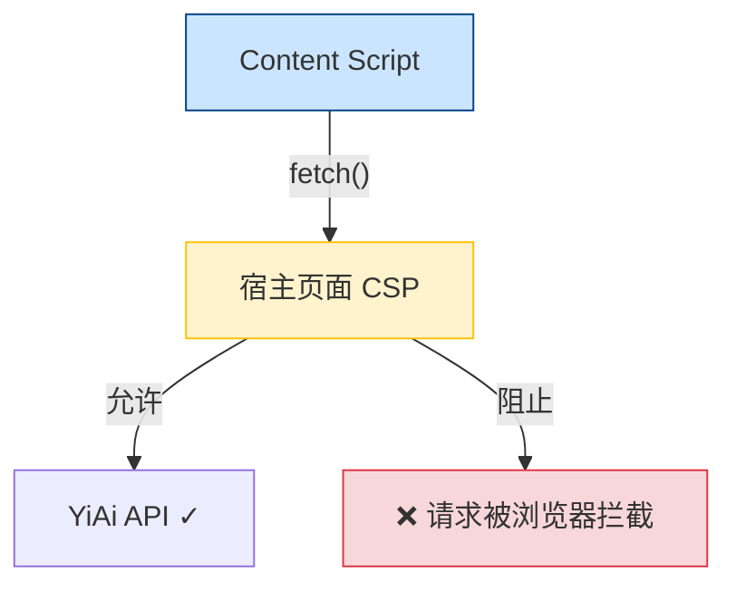
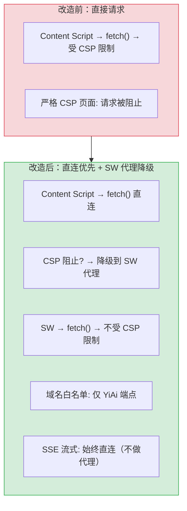
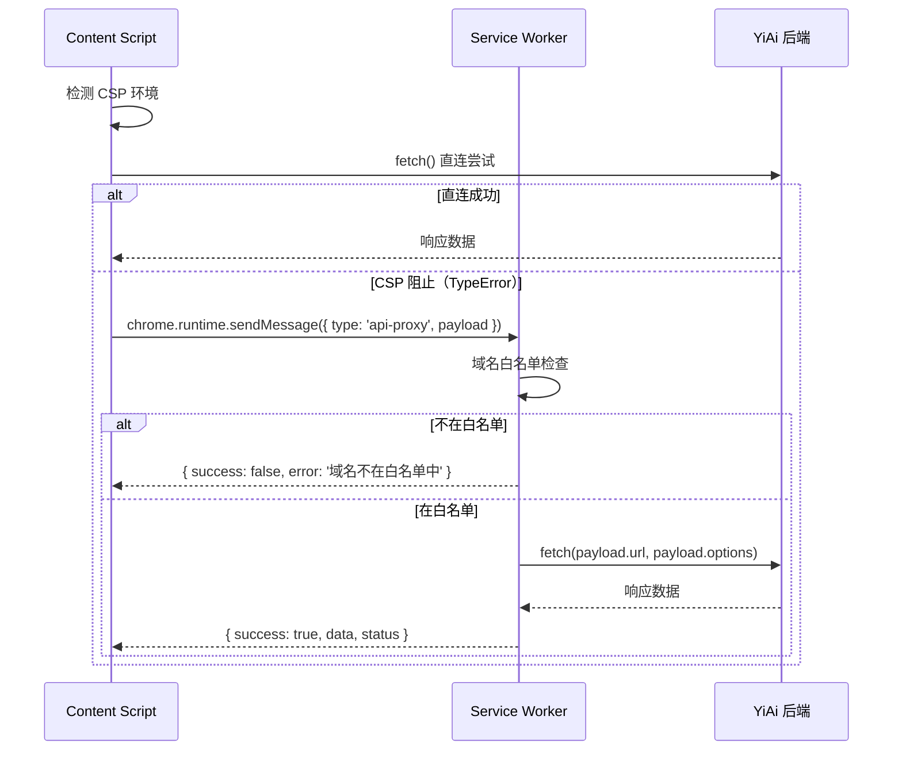

# YP-09-41: Content Script 跨域资源请求代理 — SW 内部代理方案

> 需求编号：YP-09-41 · 优先级：P2 · 人天：0.5d · 状态：需求已编写

## 背景

YiPet 的 Content Script 在宿主页面中执行，受宿主页面的 Content Security Policy (CSP) 约束。某些严格 CSP 的页面（如 GitHub、Google、金融网站）会阻止 Content Script 向 YiAi API (`localhost:10086`) 发送请求，导致聊天功能不可用。

当前问题：

| # | 问题 | 影响 | 严重程度 |
|---|------|------|----------|
| 1 | 严格 CSP 页面阻止向 YiAi 发送请求 | 这些页面中聊天功能完全不可用 | 高 |
| 2 | Content Script 的 `fetch` 受页面 CSP 限制 | 部分 API 调用失败 | 中 |
| 3 | 无 CSP 豁免机制 | 用户无法在任意页面使用 YiPet | 高 |
| 4 | 直接请求和代理请求无统一策略 | 代码中混用两种方式，维护困难 | 中 |
| 5 | SSE 流式请求无法通过代理 | SW 不支持流式转发 | 中 |

**目标**：通过 Service Worker 作为跨域代理，绕过宿主页面 CSP 限制。Content Script 发送 API 请求到 SW，SW 转发到 YiAi 后端。SW 拥有 `chrome.runtime` 权限，不受页面 CSP 约束。

---

## 现状分析

### 当前状态

```
YiPet/src/api/client.ts
  └── ApiClient.request() → 直接 fetch(url, options)
  └── 受宿主页面 CSP 限制
  └── 无 CSP 检测，无降级代理

YiPet/src/background/index.ts
  └── 仅处理 chrome.commands 快捷键
  └── 无 API 代理能力
```

### 文件清单

| 文件 | 当前状态 | 九月改动 |
|------|----------|----------|
| `src/api/client.ts` | 直接 fetch | 新增 CSP 检测 + 代理降级 |
| `src/background/api-proxy.ts` | 不存在 | 新增：SW 端 API 代理 |
| `src/background/index.ts` | 仅快捷键处理 | 注册代理消息监听 |
| `src/shared/ipc/messages.ts` | 消息类型定义 | 新增 `api-proxy` 消息类型 |

### 当前数据流



### 根因矩阵

| 问题 | 根因 | 影响范围 |
|------|------|----------|
| 严格 CSP 页面请求被阻止 | Content Script 的 `fetch` 受页面 CSP 约束 | 所有在严格 CSP 页面中的 API 调用 |
| 无代理机制 | SW 未实现 API 代理 | 无法绕过 CSP |
| SSE 流式不支持代理 | SW 无法转发 ReadableStream | 流式聊天必须在 CS 直接发起 |

---

## 设计决策

### 决策 1：代理触发策略 — 始终代理 vs 仅 CSP 失败时代理 vs 智能检测

| 选项 | 延迟 | 可靠性 | 复杂度 |
|------|------|--------|--------|
| 始终代理（所有请求经 SW） | 高（多一次 IPC） | 高 | 低 |
| 仅 CSP 失败时代理（先直连，失败再代理） | 低（直连成功时） | 中（需重试逻辑） | 中 |
| 智能检测（检测 CSP 头决定） | 低 | 中（检测可能不准确） | 高 |

**选择：仅 CSP 失败时代理**。大部分页面的 CSP 允许向 `localhost` 发送请求，直连延迟更低（无 IPC 转发开销）。仅在 CSP 阻止时降级到 SW 代理。通过 `fetch` 失败的 `TypeError`（CSP 阻止的特征错误）来触发代理降级。

### 决策 2：代理端点白名单 — 全部允许 vs 白名单

| 选项 | 安全性 | 维护成本 | 灵活性 |
|------|--------|----------|--------|
| 全部允许 | 低（SW 可能被滥用） | 低 | 高 |
| 白名单（仅 YiAi 端点） | 高 | 中（新增端点需注册） | 低 |
| 域名白名单 | 中 | 低 | 中 |

**选择：域名白名单**。仅允许代理到 YiAi 后端域名的请求（`localhost:10086` 和配置的生产域名）。通过域名前缀匹配而非端点路径匹配，新增 API 端点时无需修改白名单。

### 决策 3：SSE 流式处理 — 直接请求 vs 放弃代理

| 选项 | 可行性 | 说明 |
|------|--------|------|
| 通过 SW 代理 SSE | 不可行 | SW 的 `chrome.runtime.sendMessage` 不支持流式传输 |
| 直接请求 SSE | 必须 | Content Script 直接发起 SSE 连接 |

**选择：SSE 始终直接请求，不经过 SW 代理**。SW 代理仅用于非流式 API 调用（RPC 数据操作、知识库操作等）。SSE 流式聊天必须在 Content Script 直接发起，因为 SW 无法转发 `ReadableStream`。如果宿主页面 CSP 阻止 SSE 连接，则聊天功能在该页面不可用——这是 Chrome 扩展的固有限制。

### 设计决策记录

| 决策 | 选项 A | 选项 B | 选项 C | 选择 | 理由 |
|------|--------|--------|--------|------|------|
| 代理触发策略 | 始终代理 | 仅 CSP 失败时 | 智能检测 | **仅 CSP 失败时** | 直连延迟更低 |
| 端点白名单 | 全部允许 | 白名单 | 域名白名单 | **域名白名单** | 安全且低维护 |
| SSE 流式 | 通过 SW 代理 | 直接请求 | — | **直接请求** | SW 不支持流式 |

---

## 目标架构

### 改造前后对比



### 代理流程



### 代理适用场景

| 场景 | 直接请求 | SW 代理 | 选择 | 理由 |
|------|----------|---------|------|------|
| YiAi API (localhost) — 宽松 CSP | 可用 | 可用 | 直接优先 | 延迟更低 |
| CSP 严格页面 (GitHub) | 被 CSP 阻止 | 可用 | SW 代理 | 绕过 CSP |
| 大文件上传 (> 1MB) | 性能好 | IPC 序列化有开销 | 直接优先 | 性能考虑 |
| SSE 流式聊天 | 原生支持 | 不支持 | 直接必需 | SW 无法转发流式 |

---

## 具体改动

### 1. SW 端代理实现

```typescript
// YiPet/src/background/api-proxy.ts

const ALLOWED_DOMAINS = [
  'localhost:10086',
  '127.0.0.1:10086',
  // 生产环境域名
];

const PROXY_TIMEOUT = 30000;  // 30s 超时

function isAllowedDomain(url: string): boolean {
  try {
    const host = new URL(url).host;
    return ALLOWED_DOMAINS.some(domain => host === domain);
  } catch {
    return false;
  }
}

// 注册代理消息监听
chrome.runtime.onMessage.addListener((message, sender, sendResponse) => {
  if (message.type === 'api-proxy') {
    handleProxyRequest(message.payload)
      .then(sendResponse)
      .catch(err => sendResponse({ success: false, error: err.message }));
    return true;  // 异步响应
  }
});

async function handleProxyRequest(payload: {
  url: string;
  method: string;
  headers?: Record<string, string>;
  body?: string;
}) {
  // 域名白名单检查
  if (!isAllowedDomain(payload.url)) {
    return { success: false, error: `域名不在白名单中: ${payload.url}` };
  }

  const controller = new AbortController();
  const timeoutId = setTimeout(() => controller.abort(), PROXY_TIMEOUT);

  try {
    const resp = await fetch(payload.url, {
      method: payload.method,
      headers: {
        'Content-Type': 'application/json',
        ...payload.headers,
      },
      body: payload.body,
      signal: controller.signal,
    });

    // 不支持流式响应——仅用于非流式 API
    const contentType = resp.headers.get('content-type') || '';
    let data: any;

    if (contentType.includes('application/json')) {
      data = await resp.json();
    } else {
      data = await resp.text();
    }

    return {
      success: true,
      status: resp.status,
      statusText: resp.statusText,
      data,
    };
  } catch (err) {
    return {
      success: false,
      error: (err as Error).name === 'AbortError'
        ? '代理请求超时'
        : (err as Error).message,
    };
  } finally {
    clearTimeout(timeoutId);
  }
}
```

### 2. ApiClient 代理降级

```typescript
// YiPet/src/api/client.ts — 修改 request() 方法

class ApiClient {
  private _useProxy = false;  // 首次 CSP 阻止后启用代理

  async request(path: string, options: RequestInit = {}): Promise<any> {
    const url = `${this._baseUrl}${path}`;

    // 非流式请求：直连优先，CSP 失败时降级到代理
    if (!this._useProxy && !options.headers?.['Accept']?.includes('text/event-stream')) {
      try {
        const resp = await fetch(url, options);
        if (!resp.ok) throw new ApiError(resp.status, await resp.text());
        return resp.json();
      } catch (err) {
        // CSP 阻止的特征：TypeError 且 message 包含 'Failed to fetch'
        if (err instanceof TypeError && err.message.includes('Failed to fetch')) {
          this._useProxy = true;  // 后续请求直接走代理
          return this._proxyRequest(url, options);
        }
        throw err;
      }
    }

    // 已启用代理模式或 SSE 流式请求
    if (this._useProxy) {
      return this._proxyRequest(url, options);
    }

    // 默认直连
    const resp = await fetch(url, options);
    if (!resp.ok) throw new ApiError(resp.status, await resp.text());
    return resp.json();
  }

  private async _proxyRequest(url: string, options: RequestInit): Promise<any> {
    return new Promise((resolve, reject) => {
      chrome.runtime.sendMessage({
        type: 'api-proxy',
        payload: {
          url,
          method: options.method || 'GET',
          headers: options.headers as Record<string, string>,
          body: options.body as string,
        },
      }, (response) => {
        if (chrome.runtime.lastError) {
          reject(new Error(chrome.runtime.lastError.message));
          return;
        }
        if (response?.success) {
          resolve(response.data);
        } else {
          reject(new ApiError(response?.status || 0, response?.error || '代理请求失败'));
        }
      });
    });
  }
}
```

### 3. 涉及文件清单

```
YiPet/src/background/
├── api-proxy.ts                      # 新增: SW 端 API 代理 + 白名单
├── index.ts                          # 修改: 注册代理消息监听

YiPet/src/api/
├── client.ts                         # 修改: 直连优先 + CSP 失败降级到代理

YiPet/src/shared/ipc/
├── messages.ts                       # 修改: +api-proxy 消息类型
```

---

## 实施步骤

| 步骤 | 内容 | 涉及文件 | 验证方式 | 人天 |
|------|------|---------|---------|------|
| 1 | 实现 SW 端 API 代理 (`api-proxy.ts`) | `api-proxy.ts` | SW 收到代理消息 → 转发到 YiAi → 返回响应 | 0.15 |
| 2 | 实现域名白名单检查 | `api-proxy.ts` | 白名单外域名 → 拒绝 | 0.05 |
| 3 | 修改 ApiClient 增加 CSP 检测 + 代理降级 | `client.ts` | CSP 严格页面 → 自动切换代理 | 0.15 |
| 4 | 注册 IPC 消息类型 `api-proxy` | `messages.ts` | 类型检查通过 | 0.05 |
| 5 | 测试：GitHub 等严格 CSP 页面 | 多页面 | 聊天功能正常 | 0.10 |

**总计：0.5d**

---

## 性能分析

| 操作 | 直连延迟 | 代理延迟 | 额外开销 |
|------|----------|----------|----------|
| 小型 JSON 请求 | ~10ms | ~20ms | +10ms（IPC 往返） |
| 中型 JSON 请求 (10KB) | ~15ms | ~30ms | +15ms（序列化 + IPC） |
| 大型 JSON 请求 (100KB) | ~30ms | ~60ms | +30ms（序列化开销增大） |
| SSE 流式（不代理） | ~50ms 首 chunk | N/A | 0（直连） |

### 容量规划

| 场景 | 代理请求/分钟 | SW 内存占用 | 说明 |
|------|-------------|-----------|------|
| 轻度使用 | 5-10 | < 1MB | 正常聊天 |
| 中度使用 | 20-50 | < 2MB | 频繁操作 |
| 重度使用 | 100+ | < 5MB | 批量导入等 |

---

## 测试规格

### Requirement: CSP 降级代理

#### Scenario: 正常页面直连成功
- **Given** 宿主页面无 CSP 限制
- **When** Content Script 发送 API 请求
- **Then** 直接 fetch 成功，不经过 SW 代理

#### Scenario: 严格 CSP 页面自动降级
- **Given** 宿主页面 CSP 为 `connect-src 'self'`（阻止 localhost 请求）
- **When** Content Script 发送 API 请求
- **Then** 直接 fetch 失败 → 自动切换到 SW 代理 → 代理成功返回数据

#### Scenario: 后续请求直接走代理
- **Given** 首次请求 CSP 阻止，已切换到代理模式
- **When** 发送第二个 API 请求
- **Then** 直接走 SW 代理，不再尝试直连

### Requirement: 域名白名单

#### Scenario: 白名单外域名被拒绝
- **Given** 代理请求目标为 `https://evil.com/api`
- **When** SW 收到代理请求
- **Then** 返回 `{ success: false, error: '域名不在白名单中' }`

#### Scenario: 白名单内域名通过
- **Given** 代理请求目标为 `http://localhost:10086/`
- **When** SW 收到代理请求
- **Then** 正常转发到 YiAi 后端

### Requirement: SSE 流式不代理

#### Scenario: SSE 请求始终直连
- **Given** 代理模式已启用
- **When** 发送 SSE 流式聊天请求
- **Then** 直接 fetch 发起 SSE 连接，不经过 SW 代理

---

## 风险与缓解

| 风险 | 概率 | 影响 | 等级 | 缓解措施 | 应急预案 |
|------|------|------|------|----------|----------|
| SW 代理成为性能瓶颈 | 中 | 低 | 低 | 仅 CSP 失败时使用代理，大部分请求直连 | 限制代理请求并发数（≤ 5） |
| 代理白名单遗漏新 API 端点 | 低 | 中 | 低 | 使用域名白名单而非端点白名单 | 新增域名时同步更新白名单 |
| SW 代理超时导致请求失败 | 低 | 中 | 低 | 30s 超时 + AbortController | 超时后回退到直连（如果 CSP 允许） |
| SW 终止时代理请求丢失 | 低 | 中 | 低 | SW 心跳保活（YP-09-02）减少终止概率 | 请求失败时重试（最多 3 次） |

---

## 回滚策略

| 场景 | 回滚操作 | 影响范围 |
|------|----------|----------|
| 代理功能异常 | 禁用代理降级逻辑，所有请求直连 | 严格 CSP 页面中功能不可用 |
| 白名单配置错误 | 修正白名单，热更新 SW | 部分请求被拒绝 |
| SW 代理性能问题 | 移除代理，仅保留直连 | 回退到改造前状态 |

---

## 设计决策记录

### D-01: 为什么选择"仅 CSP 失败时代理"而非"始终代理"？

始终代理意味着每个 API 请求都需要经过 Content Script → SW → YiAi 的两次 IPC 往返，增加约 10-30ms 延迟。大多数页面的 CSP 不会阻止 `localhost` 连接，直连延迟更低。仅在 CSP 严格页面（如 GitHub）中，直连失败时才降级到代理。这是一种"乐观直连，悲观降级"的策略。

### D-02: 为什么 SSE 流式请求不通过 SW 代理？

`chrome.runtime.sendMessage` 的响应是单次 JSON 序列化，不支持流式传输。SW 无法将 `ReadableStream` 逐块转发给 Content Script。如果宿主页面 CSP 阻止 SSE 连接，聊天功能在该页面不可用——这是 Chrome 扩展的固有限制，无法通过 SW 代理解决。

### D-03: 为什么选择域名白名单而非端点白名单？

端点白名单需要维护每个 API 端点的路径（`/rag-query`、`/rag-chat`、`/knowledge-scan` 等），新增端点时容易遗漏。域名白名单仅检查目标域名是否为 YiAi 后端（`localhost:10086`），新增 API 端点时无需修改白名单。安全性由域名级别保证——SW 只会代理到 YiAi 后端的请求。

---

## 可观测性

| 指标 | 采集方式 | 告警阈值 | 说明 |
|------|----------|----------|------|
| 代理降级率 | 代理请求数 / 总请求数 | > 30% | 大部分页面 CSP 严格 |
| 代理成功率 | 代理成功数 / 代理请求数 | < 95% | SW 代理故障 |
| 代理延迟 | `performance.now()` 计时 | > 100ms | SW 响应慢 |
| 白名单拒绝次数 | 拒绝计数 | > 0 | 非预期域名请求 |

---

## 安全合规

| 检查项 | 要求 | 验证方法 |
|--------|------|----------|
| 域名白名单 | 仅允许 YiAi 后端域名 | 审查 `ALLOWED_DOMAINS` 列表 |
| 代理请求不存储 | SW 不缓存代理请求和响应 | 审查 `handleProxyRequest` 逻辑 |
| 代理超时限制 | 30s 超时防止 SW 被长请求阻塞 | 审查 `AbortController` 超时逻辑 |
| MV3 CSP 合规 | SW 代理不违反扩展 CSP（SW 有独立 CSP） | 审查 manifest CSP 配置 |

---

## 代码审查检查清单

- [ ] SW 代理仅用于绕过 CORS 限制（非所有请求）
- [ ] 代理白名单——仅允许已知 YiAi 域名
- [ ] 代理超时 30s（防止 SW 被长请求阻塞）
- [ ] 代理错误透传原始状态码和错误信息
- [ ] 直连优先：CSP 未阻止时直接 fetch
- [ ] CSP 失败检测：`TypeError` + `'Failed to fetch'` 特征匹配
- [ ] 代理模式切换后后续请求直接走代理（避免重复失败）
- [ ] SSE 流式请求始终直连（不经过 SW 代理）
- [ ] `vue-tsc --noEmit` 通过
- [ ] `npm run build` 成功
- [ ] 在 GitHub 等严格 CSP 页面测试通过

---

## 回归问题预测

| # | 预测问题 | 原因 | 验证方法 |
|---|---------|------|---------|
| 1 | CSP 检测误判——非 CSP 原因的网络错误被当作 CSP 阻止而触发代理降级 | `TypeError` + `'Failed to fetch'` 是网络错误的通用特征，不仅限于 CSP 阻止；服务器宕机、DNS 解析失败、网络断开也会产生相同错误 | 关闭 YiAi 后端，验证 ApiClient 是否错误地切换到代理模式（而非报告网络错误）；检查 `_useProxy` 标志的降级条件是否过于宽泛 |
| 2 | SW 代理的 `sendMessage` 回调在 SW 终止时永不触发 | `chrome.runtime.sendMessage` 的回调在 SW 已终止时可能永远不执行（无超时机制），导致 ApiClient 的 `_proxyRequest` 中的 Promise 永远 pending | 在 SW 空闲 30s 被终止后立即发送代理请求，验证 Promise 是否在合理时间内 reject（而非永远挂起） |
| 3 | 代理请求体超过 `chrome.runtime.sendMessage` 的 64MB 限制 | 大型 JSON 请求体（如批量导入 1000 条消息）经过 `JSON.stringify` 后可能超过 Chrome 扩展消息传递的大小限制，`sendMessage` 静默失败 | 构造 5MB 的请求体，通过代理发送，验证是否返回明确的错误而非静默丢弃 |
| 4 | 代理白名单在生产环境未更新导致请求被拒绝 | `ALLOWED_DOMAINS` 硬编码在代码中，生产环境部署时如果忘记添加生产域名，所有代理请求被白名单拒绝 | 在非 localhost 环境测试代理功能，验证 `ALLOWED_DOMAINS` 是否包含正确的生产域名 |
| 5 | 代理模式下 `ApiClient.stream()` 的 SSE 流式请求被误走代理 | `_useProxy` 标志启用后，`request()` 方法中所有请求都走代理，但 SSE 流式请求的 `Accept: text/event-stream` 头检测可能被绕过 | 代理模式下发送聊天消息，验证 SSE 连接是否仍为直连（不走代理） |
| 6 | 代理请求的响应头丢失导致客户端解析失败 | SW 端 `fetch` 返回的 Response 对象未被完整序列化——仅序列化了 `status`、`statusText` 和 `data`，丢失了 `Content-Type`、`Set-Cookie` 等关键响应头 | 发送一个设置自定义响应头的 API 请求，验证代理返回的响应中是否包含这些头 |

*PRD 来源: `projects/yipet/requirements/2026-09/41-需求-SW跨域代理.md`*