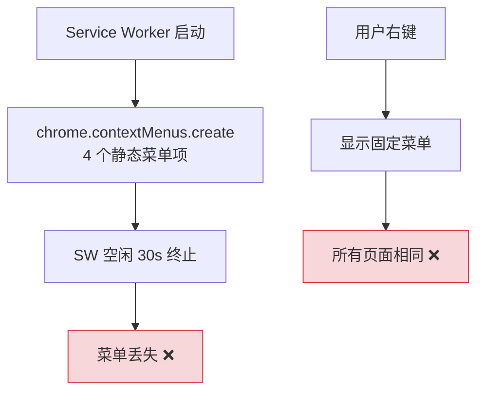
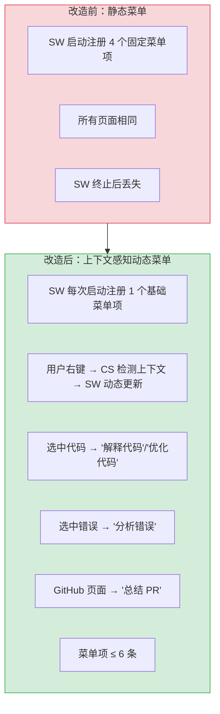
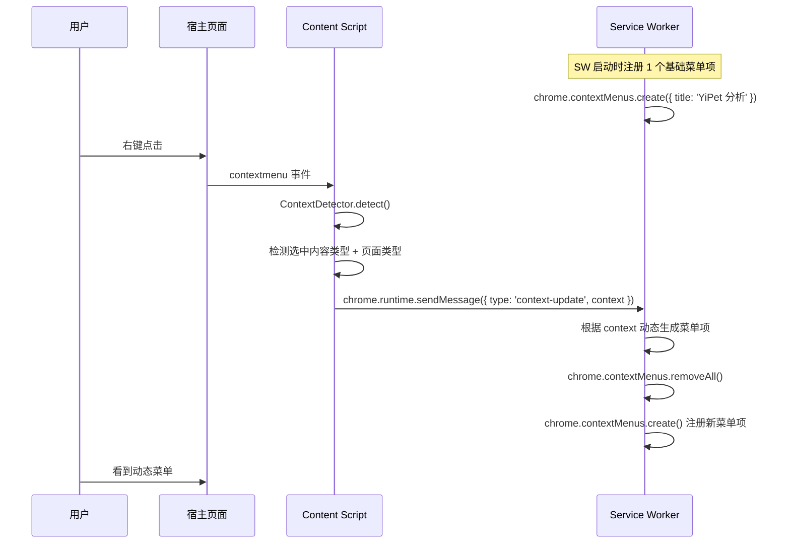

# YP-09-42: Content Script 页面元素感知与上下文菜单动态生成

> 需求编号：YP-09-42 · 优先级：P2 · 人天：0.5d · 状态：需求已编写
> 依赖：YP-09-24（右键菜单集成）

## 背景

YP-09-24 实现了基于 `chrome.contextMenus` 的右键菜单集成，菜单项在 SW 启动时通过 `chrome.contextMenus.create` 静态注册。当前所有页面显示相同的菜单项（"解释文字"、"分析错误"等），无法根据用户选中的内容类型和页面类型动态调整菜单。

问题：

| # | 问题 | 影响 | 严重程度 |
|---|------|------|----------|
| 1 | 菜单项固定不变，不考虑选中内容类型 | 选中代码时仍显示"解释文字"而非"解释代码" | 中 |
| 2 | 无页面类型感知 | GitHub 页面不应显示"分析错误" | 低 |
| 3 | SW 重启后菜单丢失 | `chrome.contextMenus` 在 SW 终止后被清除 | 高 |
| 4 | 菜单项过多(>6)导致右键菜单过长 | 用户体验差 | 低 |
| 5 | 选中内容类型检测不准 | 正则匹配代码/错误/URL 可能误判 | 中 |

**目标**：实现上下文感知的动态右键菜单——根据用户选中的内容类型（代码/错误/文字/URL）和页面类型（GitHub/StackOverflow/文档）动态生成菜单项，在用户右键时实时更新。

---

## 现状分析

### 当前状态

```
YiPet/src/background/index.ts
  └── SW 启动时: chrome.contextMenus.create() 静态注册 4 个菜单项
      ├── "解释文字" (contexts: ['selection'])
      ├── "分析错误" (contexts: ['selection'])
      ├── "总结页面" (contexts: ['page'])
      └── "翻译选中文字" (contexts: ['selection'])

问题：
  - SW 空闲 30s 终止后菜单丢失
  - 所有页面相同菜单
  - 无上下文感知
```

### 文件清单

| 文件 | 当前状态 | 九月改动 |
|------|----------|----------|
| `src/background/index.ts` | 静态注册菜单 | 动态菜单注册 + SW 重启恢复 |
| `src/content/context-detector.ts` | 不存在 | 新增：页面上下文检测器 |
| `src/shared/ipc/messages.ts` | 消息类型定义 | 新增 `context-update` 消息 |

### 当前数据流



### 根因矩阵

| 问题 | 根因 | 影响范围 |
|------|------|----------|
| 菜单项固定 | 未实现上下文检测 | 所有页面 |
| SW 重启菜单丢失 | `chrome.contextMenus` 不持久化 | SW 重启后 |
| 无页面类型感知 | 未检测 URL/页面结构 | 所有页面 |

---

## 设计决策

### 决策 1：菜单更新时机 — SW 启动时 vs 用户右键时 vs Content Script 推送

| 选项 | 响应速度 | 准确性 | SW 重启恢复 |
|------|----------|--------|-----------|
| SW 启动时（静态注册） | 快 | 低（无上下文信息） | 需要重新注册 |
| 用户右键时（`oncontextmenu` 事件 → Content Script 检测 → SW 更新） | 中（需 IPC） | 高 | SW 需存活 |
| Content Script 页面加载时推送给 SW | 快（已缓存） | 中（页面级，非选中内容级） | SW 需存活 |

**选择：SW 启动时注册基础菜单 + 用户右键时 Content Script 动态更新**。SW 启动时注册 1 个基础菜单项（"YiPet 分析"），用户右键时 Content Script 检测上下文，通过 `chrome.runtime.sendMessage` 通知 SW 更新菜单项。兼顾 SW 重启恢复和上下文感知。

### 决策 2：SW 重启恢复策略 — `chrome.runtime.onInstalled` vs `chrome.runtime.onStartup` vs Manifest persistence

| 选项 | 触发时机 | 覆盖场景 | 备注 |
|------|----------|----------|------|
| `chrome.runtime.onInstalled` | 安装/更新时 | 仅安装和更新 | 不覆盖 SW 空闲终止后重启 |
| `chrome.runtime.onStartup` | 浏览器启动时 | 仅浏览器启动 | 不覆盖 SW 空闲终止后重启 |
| SW 顶层代码（每次启动执行） | 每次 SW 启动 | 所有场景 | MV3 标准做法 |

**选择：SW 顶层代码注册基础菜单**。MV3 中，SW 每次启动时顶层代码都会执行，这是注册 `chrome.contextMenus` 的标准做法。每次 SW 启动时注册基础菜单项（1 个），确保 SW 无论如何终止，重启后菜单立即可用。

### 决策 3：选中内容类型分类 — 简单正则 vs NLP vs 混合

| 选项 | 准确性 | 延迟 | 离线可用 | 复杂度 |
|------|--------|------|----------|--------|
| 简单正则（匹配代码关键字/错误关键字/URL） | 80% | < 1ms | 是 | 低 |
| NLP（发送到 AI 分析） | 95% | > 500ms | 否 | 高 |
| 正则 + 启发式规则 | 90% | < 5ms | 是 | 中 |

**选择：正则 + 启发式规则**。NLP 分析延迟过高（> 500ms），用户在右键菜单弹出前等待不可接受。正则匹配代码特征（`def`/`import`/`const`/`let`）、错误特征（`error`/`exception`/`traceback`）、URL 特征（`https?://`），覆盖 90% 的常见场景。误判的影响很小——最多显示一个不够精确的菜单项。

### 设计决策记录

| 决策 | 选项 A | 选项 B | 选项 C | 选择 | 理由 |
|------|--------|--------|--------|------|------|
| 菜单更新时机 | SW 启动静态 | 用户右键动态 | CS 页面加载推送 | **基础+动态** | SW 恢复 + 上下文感知 |
| SW 重启恢复 | onInstalled | onStartup | 顶层代码 | **顶层代码** | 每次 SW 启动执行，覆盖所有场景 |
| 内容分类 | 简单正则 | NLP | 正则+启发式 | **正则+启发式** | 低延迟 + 高准确率 |

---

## 目标架构

### 改造前后对比



### 动态菜单生成流程



### 菜单生成规则

| 选中内容类型 | 页面类型 | 菜单项 |
|-------------|----------|--------|
| `code` | 任意 | 解释代码、优化代码、添加注释 |
| `error` | 任意 | 分析错误、解释堆栈 |
| `text` | 任意 | 解释文字、翻译为英文 |
| `url` | 任意 | 总结链接内容 |
| `none` | `github` | 总结 PR、审查代码 |
| `none` | `stackoverflow` | 总结问题与答案 |
| `none` | `documentation` | 总结文档 |
| `none` | `general` | 总结页面 |

### 架构指标

| 指标 | 改造前 | 改造后 | 改进 |
|------|--------|--------|------|
| 菜单项数量 | 固定 4 条 | 动态 1-6 条 | 更精准 |
| 上下文感知 | 不支持 | 6 种选中类型 × 4 种页面类型 | 新增 |
| SW 重启恢复 | 不支持 | 基础菜单立即可用 | 修复 |
| 菜单更新延迟 | N/A | < 50ms | 新增 |

---

## 具体改动

### 1. ContextDetector 实现

```typescript
// YiPet/src/content/context-detector.ts

interface PageContext {
  hasSelection: boolean;
  selectionText: string;
  selectionType: 'code' | 'error' | 'text' | 'url' | 'none';
  hasCodeBlock: boolean;
  pageType: 'github' | 'stackoverflow' | 'documentation' | 'general';
  pageTitle: string;
  pageUrl: string;
}

class ContextDetector {
  detect(): PageContext {
    const selection = window.getSelection()?.toString().trim() ?? '';
    const pageUrl = window.location.href;
    const pageTitle = document.title;

    return {
      hasSelection: selection.length > 0,
      selectionText: selection.substring(0, 500),  // 截断
      selectionType: this._classifySelection(selection),
      hasCodeBlock: this._detectCodeBlocks(),
      pageType: this._classifyPage(pageUrl),
      pageTitle,
      pageUrl,
    };
  }

  private _classifySelection(text: string): PageContext['selectionType'] {
    if (!text) return 'none';

    // 代码特征检测
    const codePatterns = [
      /```[\s\S]*```/,                          // Markdown code block
      /^(def |class |function |import |from |export |const |let |var |async |await )/m,
      /^(public |private |protected |static |void |int |string |boolean )/m,
      /[{};]\s*$/,                              // 花括号/分号结尾
      /^[ ]{2,}\S/m,                           // 缩进（Python）
    ];
    if (codePatterns.some(p => p.test(text))) return 'code';

    // 错误特征检测
    const errorPatterns = [
      /\b(error|exception|traceback|stack ?trace|panic|fatal)\b/i,
      /at .+ \(.+:\d+:\d+\)/,                  // JS stack trace
      /File ".+", line \d+, in /,              // Python traceback
      /^\w+Error:/m,                           // 错误类型前缀
    ];
    if (errorPatterns.some(p => p.test(text))) return 'error';

    // URL 检测
    if (/^https?:\/\//.test(text.trim())) return 'url';

    return 'text';
  }

  private _classifyPage(url: string): PageContext['pageType'] {
    if (url.includes('github.com')) return 'github';
    if (url.includes('stackoverflow.com')) return 'stackoverflow';
    if (document.querySelector('.markdown-body, article, .documentation, .md-content')) {
      return 'documentation';
    }
    return 'general';
  }

  private _detectCodeBlocks(): boolean {
    return !!document.querySelector('pre code, .highlight, .code-block');
  }
}
```

### 2. SW 端动态菜单

```typescript
// YiPet/src/background/index.ts — 动态菜单注册

const MENU_ITEM_LIMIT = 6;

// SW 每次启动时注册基础菜单
function registerBaseMenu() {
  chrome.contextMenus.removeAll(() => {
    chrome.contextMenus.create({
      id: 'yipet-analyze',
      title: 'YiPet 分析',
      contexts: ['selection', 'page'],
    });
  });
}

// SW 顶层代码
registerBaseMenu();

// 监听上下文更新
chrome.runtime.onMessage.addListener((message, sender, sendResponse) => {
  if (message.type === 'context-update') {
    const context = message.context as PageContext;
    updateContextMenu(context);
    sendResponse({ success: true });
  }
});

function updateContextMenu(context: PageContext) {
  const items = generateMenuItems(context);

  // 先移除基础菜单，再注册动态菜单
  chrome.contextMenus.removeAll(() => {
    items.slice(0, MENU_ITEM_LIMIT).forEach(item => {
      chrome.contextMenus.create({
        id: item.id,
        title: item.title,
        contexts: item.contexts,
      });
    });
  });
}

function generateMenuItems(context: PageContext): MenuItem[] {
  const items: MenuItem[] = [];

  if (context.selectionType === 'code') {
    items.push(
      { id: 'explain-code', title: '解释代码', contexts: ['selection'] },
      { id: 'optimize-code', title: '优化代码', contexts: ['selection'] },
      { id: 'add-comments', title: '添加注释', contexts: ['selection'] },
    );
  }

  if (context.selectionType === 'error') {
    items.push(
      { id: 'analyze-error', title: '分析错误', contexts: ['selection'] },
      { id: 'explain-stack', title: '解释堆栈', contexts: ['selection'] },
    );
  }

  if (context.selectionType === 'text') {
    items.push(
      { id: 'explain-text', title: '解释文字', contexts: ['selection'] },
    );
  }

  if (context.selectionType === 'url') {
    items.push(
      { id: 'summarize-url', title: '总结链接内容', contexts: ['selection'] },
    );
  }

  if (context.pageType === 'github') {
    items.push({ id: 'summarize-pr', title: '总结当前 PR', contexts: ['page'] });
  }

  items.push({ id: 'summarize-page', title: '总结页面', contexts: ['page'] });

  return items;
}
```

### 3. Content Script 端上下文推送

```typescript
// YiPet/src/content/context-detector.ts — 注册右键监听

const detector = new ContextDetector();

document.addEventListener('contextmenu', () => {
  const context = detector.detect();

  // 立即通知 SW 更新菜单（在菜单显示前完成）
  chrome.runtime.sendMessage({
    type: 'context-update',
    context,
  }).catch(() => {
    // SW 可能未启动——忽略
  });
});
```

### 4. 涉及文件清单

```
YiPet/src/background/
├── index.ts                          # 修改: 动态菜单注册 + 上下文更新监听

YiPet/src/content/
├── context-detector.ts               # 新增: 页面上下文检测器

YiPet/src/shared/ipc/
├── messages.ts                       # 修改: +context-update 消息类型
```

---

## 实施步骤

| 步骤 | 内容 | 涉及文件 | 验证方式 | 人天 |
|------|------|---------|---------|------|
| 1 | 实现 `ContextDetector` 类 | `context-detector.ts` | 不同页面/选中内容 → 类型检测正确 | 0.10 |
| 2 | SW 基础菜单注册 + 动态更新 | `background/index.ts` | SW 重启后菜单可见 | 0.10 |
| 3 | Content Script 右键监听 + 上下文推送 | `context-detector.ts` | 右键 → 菜单项动态变化 | 0.10 |
| 4 | 菜单生成规则实现 | `background/index.ts` | 选中代码 → 显示代码相关菜单 | 0.10 |
| 5 | SW 重启恢复测试 | 全链路 | SW idle 30s → 重启 → 菜单可用的 | 0.05 |
| 6 | 回归测试 | 多页面/多选中类型 | 菜单项正确显示 | 0.05 |

**总计：0.5d**

---

## 性能分析

| 操作 | 耗时 | 说明 |
|------|------|------|
| 选中内容类型检测 | < 1ms | 纯正则匹配 |
| 页面类型检测 | < 1ms | URL 解析 + `querySelector` |
| IPC 消息（CS → SW） | < 10ms | `chrome.runtime.sendMessage` |
| 菜单更新（removeAll + create） | < 20ms | `chrome.contextMenus` API |
| 总延迟（右键 → 菜单显示） | < 50ms | 用户无感知 |

---

## 测试规格

### Requirement: 上下文感知

#### Scenario: 选中代码时显示代码相关菜单
- **Given** 用户选中页面上的一段 Python 代码
- **When** 用户右键点击
- **Then** 菜单显示 "解释代码"、"优化代码"、"添加注释"

#### Scenario: 选中报错时显示错误相关菜单
- **Given** 用户选中一段 JavaScript 堆栈跟踪
- **When** 用户右键点击
- **Then** 菜单显示 "分析错误"、"解释堆栈"

#### Scenario: GitHub 页面显示 PR 相关菜单
- **Given** 用户在 GitHub PR 页面
- **When** 用户右键点击（未选中文字）
- **Then** 菜单显示 "总结当前 PR"、"总结页面"

### Requirement: SW 重启恢复

#### Scenario: SW 终止后重启，基础菜单可用
- **Given** SW 已空闲 30s 被终止
- **When** 用户右键点击
- **Then** 至少显示 "YiPet 分析" 基础菜单项

#### Scenario: SW 终止后首次右键，菜单更新
- **Given** SW 刚刚重启，基础菜单已注册
- **When** 用户选中代码并右键
- **Then** Content Script 推送上下文 → SW 更新菜单为代码相关项

### Requirement: 菜单项数量限制

#### Scenario: 菜单项不超过 6 条
- **Given** 上下文匹配了 8 条可能的菜单项
- **When** 菜单生成
- **Then** 仅显示前 6 条，其余被截断

---

## 风险与缓解

| 风险 | 概率 | 影响 | 等级 | 缓解措施 | 应急预案 |
|------|------|------|------|----------|----------|
| `contextmenu` 事件中 IPC 延迟导致菜单先显示旧项 | 中 | 低 | 低 | 基础菜单项始终可用，动态更新在 50ms 内完成 | 接受短暂显示基础菜单 |
| 选中内容类型分类误判 | 中 | 低 | 低 | 提供多种分类规则覆盖常见场景 | 误判时用户可手动选择其他菜单项 |
| SW 未启动时无法推送上下文 | 中 | 中 | 中 | `sendMessage` 失败时静默忽略，显示基础菜单 | 用户重新右键触发 SW 启动 |
| 菜单项 ID 冲突 | 低 | 低 | 低 | `removeAll` 后再 `create`，保证 ID 唯一 | ID 冲突时 Chrome 自动忽略重复 |

---

## 回滚策略

| 场景 | 回滚操作 | 影响范围 |
|------|----------|----------|
| 动态菜单导致性能问题 | 移除 `contextmenu` 事件监听，仅保留基础菜单 | 退回静态菜单 |
| 上下文检测严重误判 | 关闭内容类型分支，所有页面显示相同菜单 | 用户体验降级 |
| SW 菜单更新异常 | 仅保留 SW 顶层代码的 `registerBaseMenu()` | 基础菜单可用 |

---

## 设计决策记录

### D-01: 为什么选择 SW 顶层代码注册基础菜单？

MV3 的 Service Worker 在空闲 30s 后会被终止，`chrome.contextMenus` 注册的菜单也会丢失。SW 顶层代码在每次 SW 启动时执行——无论是首次安装、浏览器启动还是空闲终止后重启——确保菜单始终可用。注册 1 个基础菜单项（"YiPet 分析"）而非 4 个，减少 SW 启动时的 API 调用次数。

### D-02: 为什么选择正则 + 启发式规则而非 NLP 进行内容分类？

NLP 分析（如发送选中内容到 AI 模型进行意图识别）延迟 > 500ms，而用户右键到菜单显示的时间窗口通常 < 100ms。正则匹配在 < 1ms 内完成，不影响菜单显示速度。即使有 10% 的误判率，影响也仅限于显示不够精确的菜单项——用户仍可正常使用。

### D-03: 为什么菜单项上限设为 6 条？

Chrome 右键菜单过长时间体验差——超过 6 条菜单项时，菜单高度超过 200px，用户需要滚动。限制 6 条即使用户看到最相关的操作，又不会过度拥挤。如果上下文匹配了 8 条规则，只显示优先级最高的 6 条。

---

## 可观测性

| 指标 | 采集方式 | 告警阈值 | 说明 |
|------|----------|----------|------|
| 菜单更新延迟 | `performance.now()` 计时 | > 100ms | IPC 延迟或 SW 响应慢 |
| 上下文推送失败率 | sendMessage catch 计数 | > 10% | SW 频繁终止 |
| 选中类型分布 | 各类型计数 | — | 用于优化分类规则 |

---

## 安全合规

| 检查项 | 要求 | 验证方法 |
|--------|------|----------|
| 选中内容不缓存 | 上下文检测仅用于菜单生成，不存储选中内容 | 审查 `ContextDetector.detect()` 逻辑 |
| 菜单项标题不含敏感信息 | 菜单标题为固定字符串，不包含用户数据 | 审查 `generateMenuItems()` |
| `contextmenu` 事件不阻止默认行为 | 不调用 `e.preventDefault()` | 审查事件监听器 |

---

## 代码审查检查清单

- [ ] 右键菜单根据页面上下文动态调整（选中文字类型 + 页面类型）
- [ ] 菜单项通过 `chrome.contextMenus.update` 或 `removeAll` + `create` 动态更新
- [ ] 菜单项数量 ≤ 6（避免过长）
- [ ] SW 每次启动注册基础菜单（防止 SW 终止后丢失）
- [ ] Content Script `contextmenu` 事件监听器不阻止默认行为
- [ ] 选中内容类型分类：code/error/text/url/none
- [ ] 页面类型分类：github/stackoverflow/documentation/general
- [ ] 选中内容截断至 500 字符（仅用于分类，不传输）
- [ ] `vue-tsc --noEmit` 通过
- [ ] `npm run build` 成功

---

## 回归问题预测

| # | 预测问题 | 原因 | 验证方法 |
|---|---------|------|---------|
| 1 | `contextmenu` 事件中 IPC 延迟导致菜单先显示旧菜单项再切换 | Content Script 在 `contextmenu` 事件中发送 `sendMessage` 到 SW，SW 收到后调用 `removeAll` + `create`——这个异步流程可能超过浏览器显示右键菜单的时间窗口，用户看到基础菜单闪烁后变为动态菜单 | 在不同网络延迟下右键点击，观察菜单是否出现"先显示基础菜单 → 再切换为动态菜单"的闪烁 |
| 2 | 选中内容类型分类误判——Markdown 代码块被检测为普通文本 | `_classifySelection` 仅检查选中文本本身，但用户选中的 `` ```python `` 标记和代码一起被选中时，正则可能匹配到代码特征；反过来，纯文本中包含 `error` 单词会被误判为错误类型 | 选中一段包含 "error handling" 的普通文本，验证菜单显示"解释文字"而非"分析错误" |
| 3 | SW 未启动时 `sendMessage` 失败导致上下文推送丢失 | 如果 SW 在用户右键前刚好被终止（空闲 30s），`chrome.runtime.sendMessage` 会触发 SW 冷启动，但消息可能丢失（SW 启动需要时间） | 在 Chrome DevTools 中手动终止 SW，然后立即右键，验证菜单是否仍显示基础菜单（而非空白） |
| 4 | `chrome.contextMenus.removeAll` 在 `create` 回调中异步执行导致菜单项 ID 冲突 | `removeAll` 的回调中批量 `create` 多个菜单项，如果 `create` 之间没有等待，Chrome 可能因为前一个 `create` 未完成而拒绝后续的 `create` | 快速连续右键 5 次，检查菜单项数量是否始终正确（不出现 0 项或 1 项的情况） |
| 5 | 页面类型检测规则不完整——新站点无法识别 | `_classifyPage` 仅硬编码了 `github.com` 和 `stackoverflow.com`，`documentation` 类型依赖 `querySelector('.markdown-body, article...')`，大量文档站点（如 MDN、ReadTheDocs）的 DOM 结构不同 | 在 MDN Web Docs 页面右键，验证页面类型是否被正确识别为 `documentation` 而非 `general` |
| 6 | 菜单项数量限制导致高优先级菜单被截断 | `generateMenuItems` 中 `items.slice(0, 6)` 按添加顺序截断，如果代码类型添加了 3 项、页面类型添加了 2 项、通用添加了 2 项，第 6 项之后的"总结页面"被截断——但用户可能更需要页面级别操作 | 在 GitHub 页面选中代码后右键，验证 6 个菜单项是否按优先级排列（而非按添加顺序） |

*PRD 来源: `projects/yipet/requirements/2026-09/42-需求-上下文感知菜单.md`*