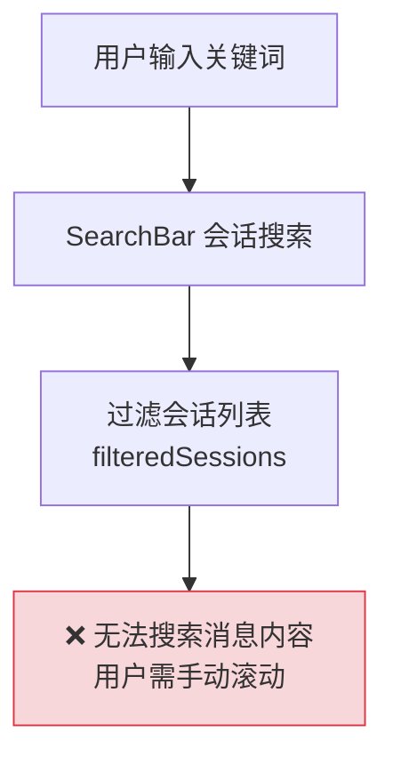
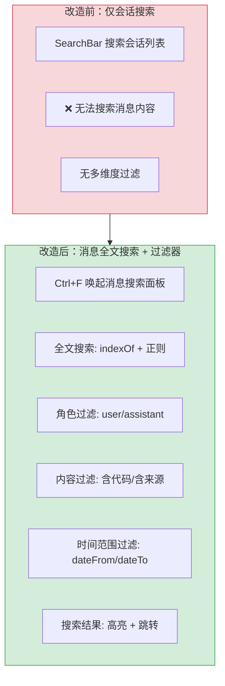

# YP-09-43: 聊天窗口消息搜索与过滤器 — 全文检索消息历史

> 需求编号：YP-09-43 · 优先级：P2 · 人天：0.5d · 状态：需求已编写

## 背景

YiPet 当前会话搜索仅支持会话级别的标题搜索（`SearchBar` 过滤会话列表），不支持单会话内的消息内容搜索。用户需要手动滚动浏览数百条历史消息来查找特定信息——这在长会话中几乎不可能完成。

问题：

| # | 问题 | 影响 | 严重程度 |
|---|------|------|----------|
| 1 | 无法搜索消息内容 | 长会话中查找信息需手动滚动 | 高 |
| 2 | 无角色过滤 | 无法只看用户问题或 AI 回复 | 中 |
| 3 | 无代码/来源过滤 | 无法快速找到包含代码块或 RAG 来源的消息 | 中 |
| 4 | 无时间范围过滤 | 无法限定特定时间段的对话 | 中 |
| 5 | 搜索结果无上下文预览 | 用户需逐个点击消息查看内容 | 中 |

**目标**：实现消息级的全文搜索 + 多维度过滤器（角色/代码/来源/时间范围），搜索结果高亮匹配文本并支持跳转到消息位置。

---

## 现状分析

### 当前状态

```
YiPet/src/chat/stores/chat.ts
  └── filteredSessions — 会话级别过滤（按标题/URL/站点）
  └── sessionSearchQuery — 会话搜索关键词
  └── 无消息内容搜索

YiPet/src/chat/components/SearchBar.vue
  └── 仅搜索会话列表
  └── 无消息级搜索 UI
```

### 文件清单

| 文件 | 当前状态 | 九月改动 |
|------|----------|----------|
| `src/chat/stores/chat.ts` | 仅会话搜索 | 新增消息搜索操作 |
| `src/chat/services/message-search.ts` | 不存在 | 新增：消息搜索引擎 |
| `src/chat/components/MessageSearch.vue` | 不存在 | 新增：消息搜索面板 |
| `src/chat/types.ts` | 无搜索类型 | 新增 `SearchFilter`/`SearchResult` |

### 当前数据流



### 根因矩阵

| 问题 | 根因 | 影响范围 |
|------|------|----------|
| 无法搜索消息内容 | 无消息级全文检索 | 所有长会话 |
| 无多维度过滤 | 未实现角色/代码/来源/时间过滤器 | 精准查找效率低 |
| 无跳转功能 | 搜索结果无锚点定位 | 用户需手动定位消息 |

---

## 设计决策

### 决策 1：搜索方式 — 客户端内存 vs 服务端 MongoDB vs 混合

| 选项 | 延迟 | 离线可用 | 搜索结果准确性 | 复杂度 |
|------|------|----------|--------------|--------|
| 客户端内存（遍历 messages[]） | < 10ms | 是 | 中（简单字符串匹配） | 低 |
| 服务端 MongoDB（全文索引） | ~50ms | 否 | 高（MongoDB text search） | 中 |
| 混合：客户端优先 + 服务端兜底 | < 10ms（客户端）/ ~50ms（服务端） | 部分 | 高 | 高 |

**选择：客户端内存搜索**。YiPet 的 messages[] 已在内存中（Pinia store），单会话消息数通常 < 500 条。客户端遍历 + 正则匹配在 < 10ms 内完成，延迟可接受。MongoDB 全文搜索需要额外的网络请求和索引维护，对于 YiPet 的使用场景过度设计。

### 决策 2：搜索算法 — 精确匹配 vs 模糊匹配 vs 正则

| 选项 | 准确性 | 性能 | 实现 |
|------|--------|------|------|
| 精确匹配（`indexOf`） | 中（需精确输入） | 高 | 低 |
| 模糊匹配（Levenshtein 距离） | 高 | 低（O(n*m)） | 中 |
| 正则（支持多关键词、大小写不敏感） | 高 | 高 | 低 |

**选择：精确匹配 + 正则作为高级选项**。默认使用大小写不敏感的 `indexOf` 匹配，提供"正则模式"切换按钮供高级用户使用。模糊匹配的 Levenshtein 距离计算在 500 条消息中耗时较高（O(n*m)），且中文场景下模糊匹配的效果不如英文。

### 决策 3：搜索 UI 位置 — 独立面板 vs 内联搜索栏 vs 弹窗

| 选项 | 空间占用 | 可见性 | 便捷性 |
|------|----------|--------|--------|
| 独立面板（侧边栏新增 Search 标签页） | 低（在侧边栏切换） | 中 | 中 |
| 内联搜索栏（聊天窗口顶部常驻） | 高（占用聊天区域） | 高 | 高 |
| 弹窗（快捷键唤起） | 低（按需显示） | 低 | 中 |

**选择：Ctrl+F 快捷键唤起搜索面板**。与浏览器的 Ctrl+F 搜索习惯一致，用户自然想到使用。搜索面板悬浮在聊天窗口上方，不占用侧边栏标签页。搜索结果按相关性排序，点击跳转到消息位置。

### 设计决策记录

| 决策 | 选项 A | 选项 B | 选项 C | 选择 | 理由 |
|------|--------|--------|--------|------|------|
| 搜索方式 | 客户端内存 | 服务端 MongoDB | 混合 | **客户端内存** | 延迟低，离线可用 |
| 搜索算法 | 精确匹配 | 模糊匹配 | 正则 | **精确+正则** | 性能好，覆盖主要场景 |
| 搜索 UI | 独立面板 | 内联搜索栏 | 弹窗 | **Ctrl+F 悬浮面板** | 符合用户习惯 |

---

## 目标架构

### 改造前后对比



### 搜索 UI 布局

```
┌─ 消息搜索 (Ctrl+F) ────────────────────────────────────┐
│ 🔍 [搜索关键词________________]  [.*] 正则  [×] 关闭    │
│                                                        │
│ 过滤: [👤用户] [🤖AI] [📝含代码] [📚含来源]            │
│ 📅 2026-09-01 ~ 2026-09-09                    [清除]   │
├────────────────────────────────────────────────────────┤
│ 找到 5 条结果:    排序: [相关度 ▼]                      │
│                                                        │
│ 📝 用户 · 09/05 14:30                   匹配度: ★★★    │
│ "...RAG 混合检索的权重如何设置？是否..."                 │
│ [跳转到此消息]                                         │
│                                                        │
│ 🤖 AI · 09/05 14:31                     匹配度: ★★★   │
│ "...RAG 混合检索的 alpha 参数控制 BM25..."               │
│ [跳转到此消息]                                         │
│                                                        │
│ 🤖 AI · 09/06 10:15                     匹配度: ★★    │
│ "...建议将 RAG 的检索范围限定到..."                     │
│ [跳转到此消息]                                         │
└────────────────────────────────────────────────────────┘
```

### 架构指标

| 指标 | 改造前 | 改造后 | 改进 |
|------|--------|--------|------|
| 搜索范围 | 仅会话标题 | 消息全文 + 会话标题 | 新增 |
| 搜索结果跳转 | 不支持 | 点击跳转 + 高亮滚动 | 新增 |
| 过滤维度 | 0 | 4（角色/代码/来源/时间） | 新增 |
| 搜索延迟（500 条消息） | N/A | < 10ms | — |

---

## 具体改动

### 1. MessageSearchService 实现

```typescript
// YiPet/src/chat/services/message-search.ts

interface SearchFilter {
  query: string;
  role?: 'user' | 'assistant';
  hasCode?: boolean;
  hasSources?: boolean;
  dateFrom?: Date;
  dateTo?: Date;
  useRegex?: boolean;
}

interface SearchResult {
  message: ChatMessage;
  messageIndex: number;       // 在 messages[] 中的索引
  matchPosition: number;      // 匹配位置（字符偏移）
  matchContext: string;       // 匹配上下文（前后各 50 字符）
  matchText: string;          // 匹配到的文本
  score: number;              // 相关度评分
}

class MessageSearchService {
  search(messages: ChatMessage[], filter: SearchFilter): SearchResult[] {
    let filtered = messages;

    // 1. 角色过滤
    if (filter.role) {
      filtered = filtered.filter(m => m.role === filter.role);
    }

    // 2. 代码块过滤
    if (filter.hasCode) {
      filtered = filtered.filter(m => m.content.includes('```'));
    }

    // 3. 来源过滤
    if (filter.hasSources) {
      filtered = filtered.filter(m => (m as any).sources?.length > 0);
    }

    // 4. 时间范围过滤
    if (filter.dateFrom) {
      filtered = filtered.filter(m => m.timestamp && m.timestamp >= filter.dateFrom!);
    }
    if (filter.dateTo) {
      filtered = filtered.filter(m => m.timestamp && m.timestamp <= filter.dateTo!);
    }

    if (!filter.query.trim()) {
      // 无查询词——返回所有过滤后的消息
      return filtered.map((msg, i) => ({
        message: msg,
        messageIndex: messages.indexOf(msg),
        matchPosition: 0,
        matchContext: msg.content.substring(0, 100),
        matchText: '',
        score: 0,
      }));
    }

    // 5. 全文搜索
    const results: SearchResult[] = [];
    const queryLower = filter.query.toLowerCase();

    for (const msg of filtered) {
      const matches = this._findMatches(msg.content, filter.query, filter.useRegex);
      if (matches.length === 0) continue;

      for (const match of matches) {
        const start = Math.max(0, match.start - 50);
        const end = Math.min(msg.content.length, match.end + 50);

        results.push({
          message: msg,
          messageIndex: messages.indexOf(msg),
          matchPosition: match.start,
          matchContext: msg.content.slice(start, end),
          matchText: match.text,
          score: this._calculateScore(msg, filter.query),
        });
      }
    }

    return results.sort((a, b) => b.score - a.score);
  }

  private _findMatches(content: string, query: string, useRegex?: boolean): Array<{start: number; end: number; text: string}> {
    const matches: Array<{start: number; end: number; text: string}> = [];

    try {
      if (useRegex) {
        const re = new RegExp(query, 'gi');
        let m: RegExpExecArray | null;
        while ((m = re.exec(content)) !== null) {
          matches.push({ start: m.index, end: m.index + m[0].length, text: m[0] });
        }
      } else {
        const lower = content.toLowerCase();
        const queryLower = query.toLowerCase();
        let idx = 0;
        while ((idx = lower.indexOf(queryLower, idx)) !== -1) {
          matches.push({ start: idx, end: idx + query.length, text: content.slice(idx, idx + query.length) });
          idx += query.length;
        }
      }
    } catch {
      // 正则无效——回退到普通匹配
      const lower = content.toLowerCase();
      let idx = 0;
      while ((idx = lower.indexOf(query.toLowerCase(), idx)) !== -1) {
        matches.push({ start: idx, end: idx + query.length, text: content.slice(idx, idx + query.length) });
        idx += query.length;
      }
    }

    return matches;
  }

  private _calculateScore(msg: ChatMessage, query: string): number {
    let score = 0;
    const lower = msg.content.toLowerCase();
    const queryLower = query.toLowerCase();

    // 标题/首行命中——高分
    const firstLine = msg.content.split('\n')[0].toLowerCase();
    if (firstLine.includes(queryLower)) score += 5;

    // 精确匹配（完整单词）
    const wordPattern = new RegExp(`\\b${queryLower}\\b`, 'i');
    if (wordPattern.test(lower)) score += 3;

    // 出现频率（最多 +5）
    const count = (lower.match(new RegExp(queryLower.replace(/[.*+?^${}()|[\]\\]/g, '\\$&'), 'g')) || []).length;
    score += Math.min(count, 5);

    // AI 消息加分（用户更可能搜索 AI 的回答）
    if (msg.role === 'assistant') score += 1;

    return score;
  }
}
```

### 2. 涉及文件清单

```
YiPet/src/chat/
├── services/message-search.ts        # 新增: 消息搜索引擎
├── components/MessageSearch.vue      # 新增: 消息搜索面板
├── stores/chat.ts                    # 修改: +messageSearchVisible +searchResults
├── types.ts                          # 修改: +SearchFilter +SearchResult
└── components/ChatWindow.vue         # 修改: Ctrl+F 唤起搜索面板 + 挂载
```

---

## 实施步骤

| 步骤 | 内容 | 涉及文件 | 验证方式 | 人天 |
|------|------|---------|---------|------|
| 1 | 实现 `MessageSearchService` 全文搜索 | `message-search.ts` | 搜索 "RAG" → 返回所有包含 RAG 的消息 | 0.15 |
| 2 | 实现多维度过滤（角色/代码/来源/时间） | `message-search.ts` | 角色过滤 → 仅显示用户/AI 消息 | 0.10 |
| 3 | 实现 `MessageSearch.vue` 搜索面板 | `MessageSearch.vue` | Ctrl+F → 面板显示 | 0.10 |
| 4 | 搜索结果高亮 + 跳转 | `MessageSearch.vue` | 点击结果 → 滚动到消息位置 | 0.10 |
| 5 | 注册 Ctrl+F 快捷键 | `ChatWindow.vue` | Ctrl+F → 打开搜索面板 | 0.05 |

**总计：0.5d**

---

## 性能分析

| 操作 | 耗时 (100 条消息) | 耗时 (500 条消息) | 耗时 (1000 条消息) |
|------|------------------|------------------|-------------------|
| 角色过滤 | < 1ms | < 1ms | < 2ms |
| 代码/来源过滤 | < 1ms | < 2ms | < 5ms |
| 全文搜索 (indexOf) | < 2ms | < 5ms | < 10ms |
| 全文搜索 (正则) | < 5ms | < 10ms | < 20ms |
| 评分排序 | < 1ms | < 2ms | < 5ms |
| 总延迟 | < 5ms | < 15ms | < 30ms |

### 容量规划

| 场景 | 消息数 | 搜索延迟 | 内存占用 |
|------|--------|----------|----------|
| 轻度使用（< 50 条） | 50 | < 2ms | < 100KB |
| 中度使用（50-200 条） | 200 | < 5ms | < 500KB |
| 重度使用（200-500 条） | 500 | < 15ms | < 1MB |
| 极限场景（500-1000 条） | 1000 | < 30ms | < 2MB |

---

## 测试规格

### Requirement: 全文搜索

#### Scenario: 搜索关键词返回匹配消息
- **Given** 会话有 100 条消息，其中 5 条包含 "RAG"
- **When** 用户搜索 "RAG"
- **Then** 返回 5 条结果，按相关度排序

#### Scenario: 搜索空字符串显示所有消息
- **Given** 搜索关键词为空，角色过滤为 "user"
- **When** 用户清空搜索框
- **Then** 返回所有用户消息

### Requirement: 多维度过滤

#### Scenario: 角色过滤
- **Given** 会话有 50 条用户消息和 50 条 AI 消息
- **When** 用户选择角色过滤 "user"
- **Then** 仅搜索用户消息，结果仅包含用户消息

#### Scenario: 代码块过滤
- **Given** 10 条消息包含代码块（```）
- **When** 用户启用"含代码"过滤
- **Then** 仅搜索包含代码块的消息

### Requirement: 搜索结果跳转

#### Scenario: 点击搜索结果跳转到消息
- **Given** 搜索结果包含 5 条匹配
- **When** 用户点击第 3 条结果
- **Then** 聊天窗口滚动到第 3 条消息位置，消息短暂高亮

---

## 风险与缓解

| 风险 | 概率 | 影响 | 等级 | 缓解措施 | 应急预案 |
|------|------|------|------|----------|----------|
| 1000+ 条消息搜索变慢 | 中 | 低 | 低 | 搜索时显示 loading 状态，300ms debounce | 提示用户缩小搜索范围 |
| 正则搜索用户输入无效正则导致异常 | 中 | 低 | 低 | try-catch 包裹正则搜索，失败时回退到普通匹配 | 显示"无效正则表达式"提示 |
| 搜索面板与聊天窗口快捷键冲突 | 低 | 中 | 低 | 搜索面板打开时拦截聊天窗口 Ctrl+F，关闭时恢复 | Escape 关闭搜索面板 |

---

## 回滚策略

| 场景 | 回滚操作 | 影响范围 |
|------|----------|----------|
| 搜索性能严重下降 | 移除消息搜索，仅保留会话搜索 | 无法搜索消息内容 |
| 搜索面板 UI bug | 移除 `MessageSearch.vue` 组件 | 退回改造前 |

---

## 设计决策记录

### D-01: 为什么选择客户端内存搜索而非服务端 MongoDB？

YiPet 的消息已在 Pinia store 的内存中，单会话消息数通常 < 500 条。客户端遍历在 < 15ms 内完成，延迟可接受。服务端 MongoDB 搜索需要额外的网络请求往返（~50ms），且离线不可用。对于 Chat UI 这种交互式搜索场景，低延迟的客户端搜索是更好的选择。

### D-02: 为什么默认使用 indexOf 而非正则？

大多数用户搜索的是简单关键词（如 "RAG"、"MongoDB"），indexOf 的大小写不敏感匹配已足够。正则搜索通过切换按钮提供，满足高级用户的需求。将正则作为默认可能导致用户输入的特殊字符（如 `.`、`*`）被解释为正则语法而产生意外结果。

### D-03: 为什么使用相关度评分而非简单的时间排序？

用户搜索的目的是找到最相关的信息，而非最新的。相关度评分考虑标题首行命中（权重 5）、完整单词匹配（权重 3）、出现频率（最多 5）和 AI 消息偏好（权重 1）。这确保用户最想看到的结果排在前面。同时提供"按时间排序"的切换选项。

---

## 可观测性

| 指标 | 采集方式 | 告警阈值 | 说明 |
|------|----------|----------|------|
| 搜索延迟 | `performance.now()` 计时 | > 100ms | 消息过多或搜索算法异常 |
| 搜索框输入频率 | debounce 触发计数 | — | 用户搜索行为分析 |
| 正则搜索使用率 | useRegex 启用次数 | — | 高级功能使用情况 |

---

## 安全合规

| 检查项 | 要求 | 验证方法 |
|--------|------|----------|
| 搜索结果高亮不注入 HTML | 使用 `<mark>` 标签或 CSS 高亮，不使用 innerHTML | 搜索 `<script>alert(1)</script>` → 不执行 |
| 搜索内容不离开客户端 | 搜索在内存中完成，不发送到服务端 | 审查 `MessageSearchService.search()` |

---

## 代码审查检查清单

- [ ] 消息搜索基于内存中的 `messages[]` 数组
- [ ] 搜索支持关键词 + 日期范围 + 角色 + 代码/来源过滤
- [ ] 搜索结果高亮匹配文本 + 点击跳转到消息位置
- [ ] 搜索 300ms debounce（避免逐字触发搜索）
- [ ] 正则搜索 try-catch 包裹，无效正则时回退到普通匹配
- [ ] 搜索结果按相关度评分排序（提供时间排序切换）
- [ ] 搜索面板通过 Ctrl+F 唤起，Esc 或 [×] 关闭
- [ ] `vue-tsc --noEmit` 通过
- [ ] `npm run build` 成功
- [ ] 1000 条消息搜索在 30ms 内完成

---

## 回归问题预测

| # | 预测问题 | 原因 | 验证方法 |
|---|---------|------|---------|
| 1 | 正则搜索用户输入无效正则导致搜索完全失败 | `useRegex` 模式下 `new RegExp(query, 'gi')` 如果 `query` 包含未转义的特殊字符（如 `(`、`[`、`{`），会抛出 `SyntaxError`——虽然 try-catch 包裹，但回退到普通匹配时使用的是原始 query 而非转义后的文本 | 搜索 `(`、`\w`、`.*` 等正则特殊字符，验证搜索不崩溃且返回合理结果 |
| 2 | 搜索结果高亮使用 `innerHTML` 注入导致 XSS | 如果 `MessageSearch.vue` 中使用 `v-html` 渲染匹配上下文（`matchContext`），而 `matchContext` 中包含未转义的 HTML 标签，攻击者通过构造包含 `<script>` 的消息内容进行 XSS | 搜索 "<script>alert(1)</script>"，验证搜索结果中不执行脚本 |
| 3 | 搜索面板 Ctrl+F 拦截了宿主页面的 Ctrl+F | 聊天窗口处于 Shadow DOM 中，但 `keydown` 事件监听可能未限制在 Shadow DOM 范围内，导致宿主页面的 Ctrl+F 也被拦截 | 在聊天窗口未聚焦时按 Ctrl+F，验证宿主页面浏览器搜索栏是否正常弹出 |
| 4 | `messageIndex` 计算错误导致跳转位置不准确 | `messageIndex` 使用 `messages.indexOf(msg)` 查找，但过滤后的 `filtered` 数组中的消息对象引用与原始 `messages[]` 中的引用可能不一致（如果 `filtered` 是通过 `Array.filter` 创建的新数组，引用仍相同，但如果有 clone 操作则不同） | 搜索关键词 → 点击第 3 条结果 → 验证聊天窗口是否滚动到正确的消息位置 |
| 5 | 过滤条件组合后静默返回空结果 | 用户同时启用"角色=user" + "含代码" + "含来源"三个过滤条件，但用户消息通常不包含代码块和来源，结果为空——用户可能以为搜索功能故障 | 启用所有过滤条件后搜索，验证当结果为空时 UI 是否显示"无匹配结果"而非空白 |
| 6 | 代码块过滤 `m.content.includes('\`\`\`')` 遗漏单行代码 | 仅检查 `` ``` `` 三反引号，遗漏了单行代码标记 `` `code` `` 和 4 空格缩进代码块 | 搜索包含 `` `const x = 1` `` 的消息，启用"含代码"过滤，验证是否能匹配到 |

*PRD 来源: `projects/yipet/requirements/2026-09/43-需求-消息搜索与过滤.md`*