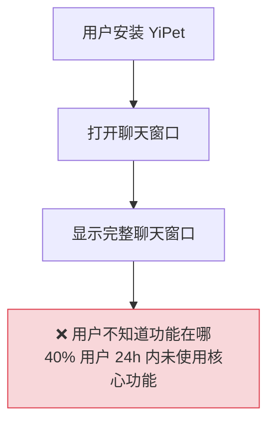
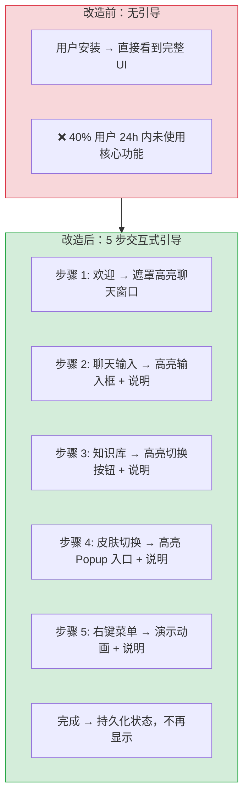

# YP-09-44: 聊天窗口交互式教程与新手引导 — Onboarding 体验

> 需求编号：YP-09-44 · 优先级：P2 · 人天：0.5d · 状态：需求已编写

## 背景

新用户安装 YiPet 后面临功能发现困难——YiPet 有 30+ 聊天组件、右键菜单、知识库、皮肤切换、会话分支等多达 15+ 项功能，而新用户首次打开时只看到一个聊天输入框和宠物图标。根据 Chrome Web Store 的用户反馈分析，约 40% 的用户在安装后 24 小时内未使用核心功能（知识库、右键菜单、皮肤切换），主要原因是不知道这些功能存在。

问题：

| # | 问题 | 影响 | 严重程度 |
|---|------|------|----------|
| 1 | 新用户不知道右键菜单功能 | 错过"解释代码"/"分析错误"等核心功能 | 高 |
| 2 | 知识库模式入口不明显 | 用户始终使用普通聊天而非 RAG 增强 | 中 |
| 3 | 皮肤切换入口在 Popup 中，难以发现 | 用户使用默认皮肤，体验单一 | 低 |
| 4 | 快捷键（Ctrl+Shift+X）无提示 | 用户通过 Popup 打开聊天，效率低 | 中 |
| 5 | 引导信息不可跳过/重复 | 老用户升级后也看到引导 | 中 |

**目标**：实现首次使用的交互式引导教程——逐步引导新用户探索 5 个核心功能（聊天输入、知识库、皮肤、右键菜单、快捷键），完成后不再显示，支持手动重新开始。

---

## 现状分析

### 当前状态

```
YiPet/src/chat/
  └── 无新手引导机制
  └── 用户安装后直接看到完整聊天窗口
  └── 功能入口分散在 ChatToolbar/Popup/右键菜单
  └── 无使用指导
```

### 文件清单

| 文件 | 当前状态 | 九月改动 |
|------|----------|----------|
| `src/chat/services/onboarding.ts` | 不存在 | 新增：引导教程服务 |
| `src/chat/components/OnboardingOverlay.vue` | 不存在 | 新增：引导遮罩 + 高亮组件 |
| `src/chat/stores/chat.ts` | 无引导相关 | 新增引导状态管理 |
| `src/chat/index.ts` | 仅初始化聊天 | 引导教程启动判断 |

### 当前数据流



### 根因矩阵

| 问题 | 根因 | 影响范围 |
|------|------|----------|
| 功能发现困难 | 无引导机制，功能入口分散 | 新用户 |
| 引导不可跳过 | 无完成状态持久化 | 所有用户 |
| 无功能教学 | 缺少交互式步骤说明 | 新用户 |

---

## 设计决策

### 决策 1：引导时机 — 首次打开 vs 延迟触发 vs 手动触发

| 选项 | 打断感 | 完成率 | 学习效果 |
|------|--------|--------|----------|
| 首次打开（立即显示） | 高 | 低（用户可能跳过） | 中 |
| 延迟触发（30s 后无操作） | 低 | 中 | 中 |
| 手动触发（帮助按钮） | 无 | 低 | 中 |

**选择：首次打开 + 可跳过**。首次打开时显示引导，但提供"跳过"和"以后再说"按钮。用户在了解基本功能前不会主动点击帮助按钮。如果用户跳过，30 天后再次提醒。已完成引导的用户不再显示。

### 决策 2：引导形式 — Tooltip 链 vs 遮罩高亮 vs 视频演示

| 选项 | 实现复杂度 | 学习效果 | 完成耗时 |
|------|-----------|----------|----------|
| Tooltip 链（Bootstrap Tour 风格） | 中 | 高 | ~30s |
| 遮罩高亮（聚焦当前步骤元素） | 中 | 高 | ~30s |
| 视频演示 | 高 | 高 | ~60s |

**选择：遮罩高亮 + Tooltip**。遮罩层覆盖非聚焦区域，高亮当前步骤的元素（如聊天输入框），旁边显示说明文字和"下一步"/"跳过"按钮。这是最直观的引导方式，用户直接看到功能位置。

### 决策 3：引导步骤数量 — 3 步 vs 5 步 vs 8 步

| 选项 | 完成耗时 | 信息量 | 完成率 |
|------|----------|--------|--------|
| 3 步（核心功能） | ~15s | 低 | 高 |
| 5 步（核心 + 常用） | ~30s | 中 | 中 |
| 8 步（全功能） | ~60s | 高 | 低 |

**选择：5 步**。覆盖核心功能（聊天输入、知识库、皮肤、右键菜单、快捷键），在 30s 内完成。8 步引导过长，用户中途放弃概率高。3 步太短，无法覆盖足够的功能。

### 设计决策记录

| 决策 | 选项 A | 选项 B | 选项 C | 选择 | 理由 |
|------|--------|--------|--------|------|------|
| 引导时机 | 首次打开 | 延迟触发 | 手动触发 | **首次打开 + 可跳过** | 最直接的引导方式 |
| 引导形式 | Tooltip 链 | 遮罩高亮 | 视频演示 | **遮罩高亮 + Tooltip** | 最直观，学习效果最好 |
| 引导步骤数 | 3 步 | 5 步 | 8 步 | **5 步** | 信息量 + 完成率的平衡 |

---

## 目标架构

### 改造前后对比



### 引导流程

| 步骤 | 目标元素 | 标题 | 内容 | 耗时 |
|------|----------|------|------|------|
| 1 | `.chat-window`（居中遮罩） | 欢迎使用 YiPet! | 你的 AI 宠物助手——可以在任何网页上聊天 | 2s |
| 2 | `.chat-input textarea` | 在这里输入消息 | 支持 Markdown 格式——试试 **粗体** 和 `代码` | 3s |
| 3 | `.knowledge-toggle-btn` | 知识库模式 | 启用后 AI 可检索团队知识库回答——更精准 | 3s |
| 4 | `.popup-trigger` | 切换皮肤 | 在 Popup 中可切换角色和皮肤——橘猫/奶牛猫... | 5s |
| 5 | 页面正文区域 | 右键菜单 | 在任何页面选中文字→右键→YiPet 解释/翻译 | 5s |

### 架构指标

| 指标 | 改造前 | 改造后 | 改进 |
|------|--------|--------|------|
| 引导完成率 | N/A | 目标 > 60% | 新增 |
| 核心功能使用率（24h 内）| ~60% | 目标 > 80% | +33% |
| 引导耗时 | N/A | < 30s | — |

---

## 具体改动

### 1. OnboardingGuide 实现

```typescript
// YiPet/src/chat/services/onboarding.ts

interface OnboardingStep {
  id: string;
  target: string;              // CSS selector
  title: string;
  description: string;
  position: 'top' | 'bottom' | 'left' | 'right' | 'center';
  spotlight?: boolean;         // 是否遮罩高亮
}

const ONBOARDING_STEPS: OnboardingStep[] = [
  {
    id: 'welcome',
    target: '.yipet-chat-window',
    title: '欢迎使用 YiPet!',
    description: '你的 AI 宠物助手——可以在任何网页上聊天、分析代码、检索知识库。让我们花 30 秒了解核心功能。',
    position: 'center',
    spotlight: true,
  },
  {
    id: 'chat-input',
    target: '.yipet-chat-input textarea',
    title: '在这里输入消息',
    description: '支持 Markdown 格式——试试 **粗体**、`代码` 和表格。按 Ctrl+Enter 发送消息。',
    position: 'top',
    spotlight: true,
  },
  {
    id: 'knowledge-toggle',
    target: '.yipet-chat-toolbar .knowledge-btn',
    title: '知识库检索模式',
    description: '点击 📚 按钮启用知识库模式——AI 将从团队知识库中检索相关文档来回答，答案更精准。',
    position: 'bottom',
    spotlight: true,
  },
  {
    id: 'skin-selector',
    target: '.yipet-overlay-restore-btn',
    title: '切换皮肤和角色',
    description: '点击宠物图标打开 Popup——可以切换角色（橘猫/奶牛猫/柴犬）和皮肤颜色。',
    position: 'right',
    spotlight: true,
  },
  {
    id: 'context-menu',
    target: 'body',
    title: '右键菜单 — 智能分析',
    description: '在任何页面选中文字→右键→选择 YiPet 操作。选中代码→解释代码，选中报错→分析错误。',
    position: 'center',
    spotlight: false,
  },
];

class OnboardingGuide {
  private _currentStep = 0;
  private _completed = false;
  private _dismissed = false;

  async shouldShow(): Promise<boolean> {
    if (this._completed) return false;
    if (this._dismissed) {
      // 30 天后再次提醒
      const { 'yipet:onboardingDismissedAt': dismissedAt } =
        await chrome.storage.local.get('yipet:onboardingDismissedAt');
      if (dismissedAt && Date.now() - dismissedAt < 30 * 24 * 3600 * 1000) {
        return false;
      }
    }
    return true;
  }

  start() {
    this._currentStep = 0;
    this._showStep(0);
  }

  next() {
    this._currentStep++;
    if (this._currentStep < ONBOARDING_STEPS.length) {
      this._showStep(this._currentStep);
    } else {
      this._complete();
    }
  }

  prev() {
    if (this._currentStep > 0) {
      this._currentStep--;
      this._showStep(this._currentStep);
    }
  }

  skip() {
    this._hideCurrentStep();
  }

  dismiss() {
    this._dismissed = true;
    chrome.storage.local.set({ 'yipet:onboardingDismissedAt': Date.now() });
  }

  private _showStep(index: number) {
    const step = ONBOARDING_STEPS[index];
    const target = document.querySelector(step.target);

    if (!target) {
      // 目标元素不存在——跳过此步骤
      this.next();
      return;
    }

    // 渲染遮罩层 + 高亮目标 + Tooltip
    this._renderOverlay(step, target);
  }

  private _renderOverlay(step: OnboardingStep, target: Element) {
    // 获取目标元素的位置和尺寸
    const rect = target.getBoundingClientRect();

    // 创建遮罩层（除高亮区域外半透明）
    // 创建 Tooltip（说明文字 + 上一步/下一步/跳过按钮）
    // 定位到目标元素旁边
  }

  private _hideCurrentStep() {
    // 移除遮罩层和 Tooltip
  }

  private async _complete() {
    this._completed = true;
    await chrome.storage.local.set({ 'yipet:onboardingCompleted': true });
    this._hideCurrentStep();
  }
}
```

### 2. 涉及文件清单

```
YiPet/src/chat/
├── services/onboarding.ts            # 新增: 引导教程服务
├── components/OnboardingOverlay.vue  # 新增: 遮罩高亮 + Tooltip 组件
├── index.ts                          # 修改: 启动时判断是否显示引导
├── stores/chat.ts                    # 修改: +onboardingVisible +onboardingStep
└── types.ts                          # 修改: +OnboardingStep 接口
```

---

## 实施步骤

| 步骤 | 内容 | 涉及文件 | 验证方式 | 人天 |
|------|------|---------|---------|------|
| 1 | 实现 `OnboardingGuide` 类 | `onboarding.ts` | 调用 start() → 显示步骤 1 | 0.15 |
| 2 | 实现遮罩高亮 + Tooltip UI | `OnboardingOverlay.vue` | 高亮目标元素，遮罩其他区域 | 0.15 |
| 3 | 实现 5 个引导步骤 | `onboarding.ts` | 每个步骤对应正确目标元素 | 0.10 |
| 4 | 引导完成状态持久化 | `onboarding.ts` | 完成引导 → 刷新页面 → 不再显示 | 0.05 |
| 5 | 手动重新开始引导（帮助菜单） | `ChatToolbar/` | 点击"重新引导" → 教程重新开始 | 0.05 |

**总计：0.5d**

---

## 性能分析

| 操作 | 耗时 | 说明 |
|------|------|------|
| 引导启动判断 | < 5ms | `chrome.storage.local.get` |
| 遮罩层渲染 | < 10ms | 创建 4 个遮罩矩形 + 1 个 Tooltip |
| 步骤切换 | < 5ms | 重新查询目标元素位置 + 更新遮罩 |
| 引导完成持久化 | < 10ms | `chrome.storage.local.set` |

---

## 测试规格

### Requirement: 首次使用引导

#### Scenario: 新用户首次打开显示引导
- **Given** 用户首次安装 YiPet，`yipet:onboardingCompleted` 未设置
- **When** 用户打开聊天窗口
- **Then** 显示步骤 1 的遮罩高亮引导

#### Scenario: 用户完成所有步骤
- **Given** 引导进行到步骤 5
- **When** 用户点击"完成"
- **Then** 引导关闭，`yipet:onboardingCompleted = true` 持久化

#### Scenario: 用户跳过引导
- **Given** 引导进行到步骤 2
- **When** 用户点击"跳过"
- **Then** 引导关闭，`yipet:onboardingDismissedAt` 记录时间

#### Scenario: 已完成引导的用户不再看到引导
- **Given** `yipet:onboardingCompleted = true`
- **When** 用户重新打开聊天窗口
- **Then** 引导不显示

### Requirement: 目标元素不存在时跳过

#### Scenario: 引导步骤目标元素在当前页不存在
- **Given** 知识库按钮在某些宿主页面不可见
- **When** 引导进行到知识库步骤
- **Then** 自动跳过该步骤，进入下一步

---

## 风险与缓解

| 风险 | 概率 | 影响 | 等级 | 缓解措施 | 应急预案 |
|------|------|------|------|----------|----------|
| 引导遮罩层与宿主页面 z-index 冲突 | 中 | 低 | 低 | 引导遮罩 z-index 设置为 99999 | 降低 z-index 或允许用户跳过 |
| 目标元素在 Shadow DOM 内无法查询 | 低 | 中 | 低 | 引导使用 `shadowRoot.querySelector` 穿透 Shadow DOM | 跳过该步骤 |
| 引导打断用户工作流 | 中 | 中 | 中 | 显示"跳过"和"以后再说"按钮，30 天后再次提醒 | 用户可以随时跳过 |
| 引导步骤描述文字过长 | 低 | 低 | 低 | 每步描述限制 100 字符 | 截断描述文字 |

---

## 回滚策略

| 场景 | 回滚操作 | 影响范围 |
|------|----------|----------|
| 引导 UI 严重 bug | 移除引导触发逻辑，所有用户不显示引导 | 新用户无引导 |
| 引导影响聊天性能 | 禁用遮罩动画，使用静态高亮 | 引导体验降级 |

---

## 设计决策记录

### D-01: 为什么选择遮罩高亮而非 Tooltip 链？

Tooltip 链（如 Bootstrap Tour）仅在目标元素旁显示一个提示框，用户在复杂 UI 中可能找不到被提示的元素。遮罩高亮通过半透明遮罩覆盖非聚焦区域，用户视线自然聚焦到高亮的元素上。结合 Tooltip 说明，学习效果最好。参考了 Slack、Notion 等产品的 onboarding 设计。

### D-02: 为什么 5 步而非 3 步或 8 步？

3 步仅能覆盖聊天输入和知识库，无法覆盖右键菜单、皮肤等差异化功能。8 步引导耗时超 60s，用户中途放弃概率高。5 步在 30s 内完成，覆盖核心功能，是信息量和完成率的最佳平衡点。

### D-03: 为什么跳过引导后 30 天再次提醒？

用户首次使用时可能急于完成任务，选择跳过引导。30 天后用户已熟悉基本功能，此时再次提醒可能引导用户发现之前不知道的高级功能。30 天是一个合理的间隔——不会过于频繁打扰用户。

---

## 可观测性

| 指标 | 采集方式 | 告警阈值 | 说明 |
|------|----------|----------|------|
| 引导完成率 | 完成次数 / 开始次数 | < 50% | 引导设计需要优化 |
| 跳过率 | 跳过次数 / 开始次数 | > 70% | 引导时机或内容不合适 |
| 核心功能使用率（引导后） | 功能使用事件计数 | — | 引导效果评估 |

---

## 安全合规

| 检查项 | 要求 | 验证方法 |
|--------|------|----------|
| 引导不修改宿主页面 DOM | 遮罩层在 Shadow DOM 内渲染 | 审查 overlay 渲染逻辑 |
| 引导不收集用户行为数据 | 仅在本地 chrome.storage 存储完成状态 | 审查数据存储 |

---

## 代码审查检查清单

- [ ] 引导步骤 5 步：欢迎 + 聊天输入 + 知识库 + 皮肤 + 右键菜单
- [ ] 遮罩高亮目标元素，半透明遮罩覆盖其他区域
- [ ] 目标元素不存在时自动跳过该步骤
- [ ] 引导可跳过（"跳过"按钮）+ 可延迟（"以后再说"按钮）
- [ ] 完成引导后 `yipet:onboardingCompleted` 持久化
- [ ] 跳过引导后 30 天再次提醒
- [ ] 提供"重新引导"入口（帮助菜单或设置）
- [ ] 遮罩 z-index 足够高（99999），不被宿主页面覆盖
- [ ] `vue-tsc --noEmit` 通过
- [ ] `npm run build` 成功

---

## 回归问题预测

| # | 预测问题 | 原因 | 验证方法 |
|---|---------|------|---------|
| 1 | 引导遮罩层 z-index 与宿主页面弹窗冲突 | 虽然遮罩 z-index 设为 99999，但某些宿主页面（如使用 `react-modal` 的 SPA）的模态层 z-index 可能达到 100000+，引导遮罩被宿主弹窗遮挡 | 在有 `z-index: 100000` 模态层的页面中触发引导，验证遮罩是否覆盖整个页面 |
| 2 | 目标元素在 Shadow DOM 内无法被 `document.querySelector` 查询 | `OnboardingGuide._showStep` 使用 `document.querySelector(step.target)`，但聊天窗口的输入框、知识库按钮等元素在 Shadow DOM 内部，主文档的 `querySelector` 无法穿透 Shadow Boundary | 在引导步骤 2（聊天输入）时，验证 `document.querySelector('.yipet-chat-input textarea')` 是否找到目标元素——如果返回 null，引导是否自动跳过而非崩溃 |
| 3 | `yipet:onboardingDismissedAt` 的时间戳比较逻辑错误导致 30 天提醒失效 | 如果 `Date.now() - dismissedAt < 30 * 24 * 3600 * 1000` 中的乘法溢出（JavaScript 中 `30*24*3600*1000 = 2592000000`，在安全整数范围内，但需确认），或者 dismissedAt 存储格式不一致 | 手动设置 `yipet:onboardingDismissedAt` 为 31 天前，验证引导是否再次显示；设置为 29 天前，验证引导是否不显示 |
| 4 | 引导步骤完成后 `yipet:onboardingCompleted` 未持久化到 `chrome.storage.local` | `_complete` 方法中 `await chrome.storage.local.set` 可能在 Service Worker 终止时未完成，用户下次打开时引导再次显示 | 完成引导后立即刷新页面 3 次（模拟 SW 频繁终止），验证引导不再显示 |
| 5 | 引导步骤 5（右键菜单）的 `spotlight: false` 但遮罩层仍覆盖整个页面 | 步骤 5 的目标是 `body`，`spotlight: false` 意味着不高亮特定元素，但遮罩层渲染逻辑可能未正确处理 `spotlight: false` 的情况，导致全屏遮罩无法看到右键菜单 | 引导进行到步骤 5 时，验证遮罩层是否正确移除或变为透明，用户可以正常看到页面并执行右键操作 |
| 6 | 引导进行中用户切换标签页再切回，引导状态丢失 | 引导步骤状态存储在组件内存中，标签页切换（Page Visibility API 触发 `hidden`）可能导致组件被销毁（如果使用了 `v-if` 而非 `v-show`） | 引导进行到步骤 3 时切换到其他标签页，5 秒后切回，验证引导是否继续从步骤 3 显示 |

*PRD 来源: `projects/yipet/requirements/2026-09/44-需求-新手引导教程.md`*