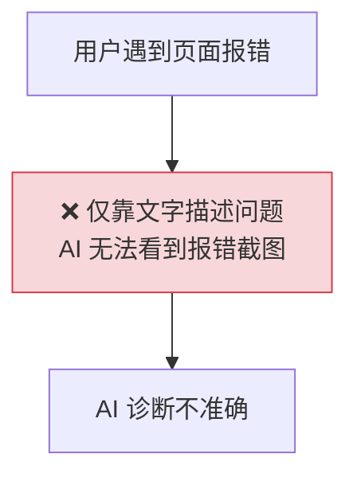
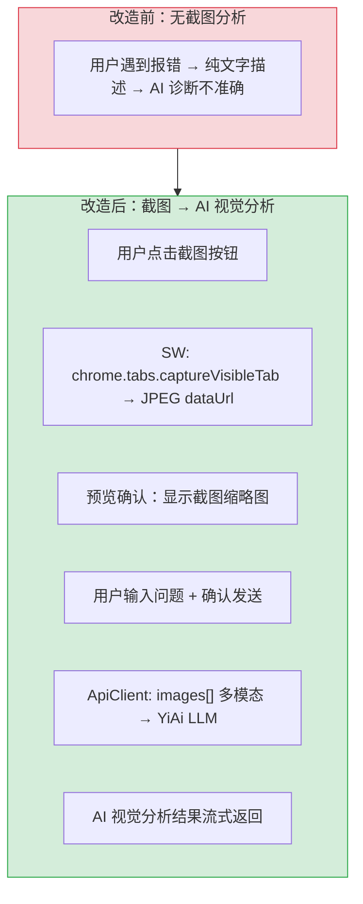
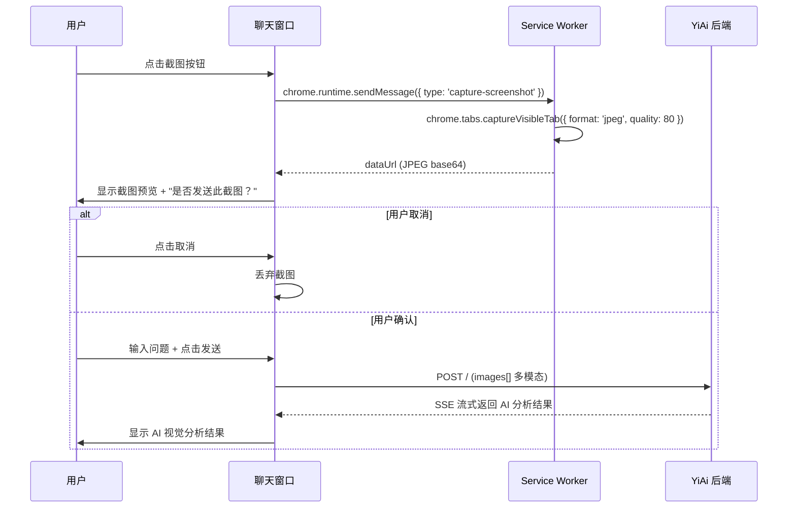

# YP-09-45: Content Script 页面截图与视觉快照 — 捕获页面用于 AI 问答

> 需求编号：YP-09-45 · 优先级：P2 · 人天：0.5d · 状态：需求已编写

## 背景

用户遇到页面报错、UI 异常或数据不一致时，仅靠文字描述难以向 AI 准确传达问题。`chrome.tabs.captureVisibleTab` API 可截取当前标签页的可视区域截图，配合多模态 AI 模型（如 LLaVA、GPT-4V）进行视觉分析——识别错误提示、对比 UI 设计、分析图表异常。

问题：

| # | 问题 | 影响 | 严重程度 |
|---|------|------|----------|
| 1 | 用户难以用文字描述视觉问题 | AI 无法准确诊断页面报错/UI 异常 | 高 |
| 2 | 截图包含敏感信息未经用户确认 | 隐私泄露风险 | 高 |
| 3 | 截图文件过大导致传输慢 | 用户体验差 | 中 |
| 4 | `captureVisibleTab` 仅截取可视区域 | 长页面超出视口的内容无法截取 | 中 |
| 5 | 无截图历史管理 | 重复截图浪费存储 | 低 |

**目标**：实现页面截图 → 用户确认 → 发送给多模态 AI 分析的完整流程。截图前压缩以优化传输，用户确认后才发送以保护隐私，支持视口和全页两种截图模式。

---

## 现状分析

### 当前状态

```
YiPet/src/background/
  └── 无截图功能
  └── chrome.tabs.captureVisibleTab 权限已声明但未使用

YiPet/src/chat/
  └── chatService.stream() 支持 images[] 参数（多模态）
  └── 无截图触发 UI
```

### 文件清单

| 文件 | 当前状态 | 九月改动 |
|------|----------|----------|
| `src/background/screenshot.ts` | 不存在 | 新增：SW 端截图服务 |
| `src/background/index.ts` | 仅快捷键处理 | 注册截图消息监听 |
| `src/chat/components/ScreenshotButton.vue` | 不存在 | 新增：截图按钮 + 预览确认 |
| `src/chat/stores/chat.ts` | `sendMessage` 支持 images | 增加截图流程集成 |
| `manifest.json` | `activeTab` 权限 | 不变（已包含所需权限） |

### 当前数据流



### 根因矩阵

| 问题 | 根因 | 影响范围 |
|------|------|----------|
| 无法视觉分析 | 无截图 + AI 分析流程 | 所有需要视觉诊断的场景 |
| 隐私风险 | 截屏未经用户确认直接发送 | 敏感页面 |
| 传输慢 | 无压缩机制 | 大截图 |

---

## 设计决策

### 决策 1：截图触发方式 — 右键菜单 vs 聊天窗口按钮 vs 快捷键

| 选项 | 便捷性 | 隐私控制 | 实现 |
|------|--------|----------|------|
| 右键菜单（"分析页面截图"） | 中 | 低（直接触发） | 低 |
| 聊天窗口按钮（截图 → 预览 → 确认 → 发送） | 高 | 高（预览确认） | 中 |
| 快捷键（Ctrl+Shift+S） | 高 | 低 | 中 |

**选择：聊天窗口按钮（截图 → 预览 → 确认 → 发送）**。用户点击截图按钮 → 截取当前页面 → 显示预览 → 用户确认或取消。这是隐私最友好的方式，用户看到截图内容后再决定是否发送给 AI。

### 决策 2：截图模式 — 视口截图 vs 全页截图 vs 选区截图

| 选项 | 质量 | 文件大小 | API 支持 |
|------|------|----------|----------|
| `chrome.tabs.captureVisibleTab`（视口） | 高 | 中 | 原生 |
| 全页截图（滚动 + 拼接） | 中 | 大 | 无原生 API，需手动实现 |
| 选区截图（用户框选） | 中 | 小 | 无原生 API，需 Canvas 裁剪 |

**选择：视口截图（`captureVisibleTab`）**。Chrome 原生 API，简单可靠。全页截图需要 Content Script 滚动页面并逐段截取 + 拼接，复杂且可能破坏页面状态。作为 MVP，视口截图覆盖 90% 的使用场景（报错信息、UI 异常通常可见于当前视口）。

### 决策 3：图片压缩 — 原始 PNG vs JPEG vs WebP

| 选项 | 质量 | 文件大小 | 浏览器支持 |
|------|------|----------|-----------|
| PNG（原始） | 无损 | 大（~500KB） | 全部 |
| JPEG quality 80 | 轻微损失 | 中（~100KB） | 全部 |
| WebP quality 80 | 轻微损失 | 小（~60KB） | Chrome only |

**选择：JPEG quality 80**。在质量和文件大小之间取得平衡。100KB 的 JPEG 传输时间约 10ms（localhost），多模态模型处理时间也较短。WebP 更小但不被所有 AI 模型支持。PNG 过大，不必要的像素精度对 AI 分析无用。

### 设计决策记录

| 决策 | 选项 A | 选项 B | 选项 C | 选择 | 理由 |
|------|--------|--------|--------|------|------|
| 触发方式 | 右键菜单 | 聊天窗口按钮 | 快捷键 | **聊天窗口按钮** | 隐私控制最佳 |
| 截图模式 | 视口 | 全页 | 选区 | **视口（MVP）** | Chrome 原生 API |
| 图片压缩 | PNG | JPEG 80 | WebP 80 | **JPEG 80** | 质量/大小/兼容性平衡 |

---

## 目标架构

### 改造前后对比



### 截图分析流程



### 架构指标

| 指标 | 改造前 | 改造后 | 改进 |
|------|--------|--------|------|
| 视觉分析能力 | 不支持 | 多模态 AI 分析 | 新增功能 |
| 截图文件大小 | N/A | ~100KB (JPEG 80) | — |
| 截图延迟 | N/A | < 200ms | — |
| 隐私控制 | N/A | 用户预览确认后才发送 | 新增 |

---

## 具体改动

### 1. SW 端截图服务

```typescript
// YiPet/src/background/screenshot.ts

async function captureScreenshot(tabId: number): Promise<string> {
  try {
    const dataUrl = await chrome.tabs.captureVisibleTab(tabId, {
      format: 'jpeg',
      quality: 80,
    });
    return dataUrl;
  } catch (err) {
    throw new Error(`截图失败: ${(err as Error).message}`);
  }
}

// 注册截图消息监听
chrome.runtime.onMessage.addListener((message, sender, sendResponse) => {
  if (message.type === 'capture-screenshot') {
    const tabId = sender.tab?.id;
    if (!tabId) {
      sendResponse({ success: false, error: '无法获取标签页 ID' });
      return;
    }

    captureScreenshot(tabId)
      .then(dataUrl => sendResponse({ success: true, dataUrl }))
      .catch(err => sendResponse({ success: false, error: err.message }));
    return true;  // 异步响应
  }
});
```

### 2. 聊天窗口截图按钮

```vue
<!-- YiPet/src/chat/components/ScreenshotButton.vue 结构 -->

<template>
  <div class="screenshot-actions">
    <button @click="captureScreenshot" :disabled="capturing">
      <CameraOutlined />
      {{ capturing ? '截图中...' : '截图分析' }}
    </button>

    <!-- 截图预览 -->
    <div v-if="screenshotPreview" class="screenshot-preview">
      
      <div class="preview-actions">
        <input v-model="screenshotQuestion" placeholder="描述你想分析的问题..." />
        <button @click="sendWithScreenshot">发送截图分析</button>
        <button @click="cancelScreenshot">取消</button>
      </div>
    </div>
  </div>
</template>

<script setup lang="ts">
import { ref } from 'vue';

const capturing = ref(false);
const screenshotPreview = ref<string | null>(null);
const screenshotQuestion = ref('');

async function captureScreenshot() {
  capturing.value = true;
  try {
    const response = await chrome.runtime.sendMessage({ type: 'capture-screenshot' });
    if (response.success) {
      screenshotPreview.value = response.dataUrl;
    }
  } finally {
    capturing.value = false;
  }
}

function sendWithScreenshot() {
  if (!screenshotPreview.value) return;
  // 发送包含截图的聊天消息
  chatStore.sendMessage(screenshotQuestion.value || '分析这个截图', {
    images: [screenshotPreview.value],
  });
  screenshotPreview.value = null;
  screenshotQuestion.value = '';
}

function cancelScreenshot() {
  screenshotPreview.value = null;
  screenshotQuestion.value = '';
}
</script>
```

### 3. ApiClient 多模态扩展

```typescript
// YiPet/src/api/client.ts — 已支持 images[] 参数

// 现有 stream 方法已支持 images[]
// 需要在 sendMessage 流程中传递截图 dataUrl
```

### 4. 涉及文件清单

```
YiPet/src/background/
├── screenshot.ts                     # 新增: SW 端截图服务
├── index.ts                          # 修改: 注册截图消息监听

YiPet/src/chat/
├── components/ScreenshotButton.vue   # 新增: 截图按钮 + 预览确认
├── stores/chat.ts                    # 修改: sendMessage 集成截图 images[] 参数
└── components/ChatInput.vue          # 修改: 嵌入 ScreenshotButton

manifest.json                          # 不变: activeTab 权限已包含
```

---

## 实施步骤

| 步骤 | 内容 | 涉及文件 | 验证方式 | 人天 |
|------|------|---------|---------|------|
| 1 | 实现 SW 端截图服务 | `screenshot.ts` | `captureVisibleTab` 返回 dataUrl | 0.10 |
| 2 | 注册截图消息类型 | `background/index.ts` | CS → SW → 截图返回 | 0.05 |
| 3 | 实现截图按钮 + 预览 UI | `ScreenshotButton.vue` | 点击按钮 → 截图预览显示 | 0.15 |
| 4 | 集成 sendMessage 传递 images[] | `stores/chat.ts` | 确认发送 → SS 流式返回 AI 分析 | 0.10 |
| 5 | 测试多模态模型响应 | 全链路 | 截图 → LLM 视觉分析 → 结果正确 | 0.10 |

**总计：0.5d**

---

## 性能分析

| 操作 | 耗时 | 说明 |
|------|------|------|
| `captureVisibleTab` (JPEG 80) | 50-200ms | 取决于页面复杂度和视口大小 |
| IPC 传输 dataUrl (100KB) | < 10ms | base64 编码后的 JSON 序列化 |
| 截图预览渲染 | < 20ms | `` 标签加载 dataUrl |
| 发送截图到 LLM (100KB) | ~50ms | localhost 传输，base64 编码 |
| LLM 视觉分析 | 1-5s | 取决于模型和图片复杂度 |

### 容量规划

| 视口大小 | JPEG 80 文件大小 | base64 大小 | 传输延迟 |
|----------|-----------------|-------------|----------|
| 1920x1080 | ~100KB | ~135KB | ~10ms |
| 2560x1440 | ~200KB | ~270KB | ~20ms |
| 3840x2160 (4K) | ~400KB | ~540KB | ~40ms |

---

## 测试规格

### Requirement: 截图捕获

#### Scenario: 正常截图
- **Given** 用户在任意网页上
- **When** 用户点击截图按钮
- **Then** `captureVisibleTab` 返回 JPEG dataUrl，预览显示截图缩略图

#### Scenario: 截图失败
- **Given** 用户在不支持的页面（如 chrome:// 页面）
- **When** 用户点击截图按钮
- **Then** 显示错误提示 "截图失败: ..."

### Requirement: 隐私控制

#### Scenario: 用户确认后才发送截图
- **Given** 截图预览已显示
- **When** 用户输入问题并点击"发送截图分析"
- **Then** 截图随聊天消息发送到 YiAi

#### Scenario: 用户取消发送
- **Given** 截图预览已显示
- **When** 用户点击"取消"
- **Then** 截图被丢弃，不发送到 YiAi

### Requirement: 多模态 AI 分析

#### Scenario: 分析页面报错截图
- **Given** 截图包含 JavaScript 错误堆栈
- **When** 用户确认发送截图 + 问题 "这是什么错误？"
- **Then** AI 返回错误类型、原因和修复建议

#### Scenario: 分析 UI 异常截图
- **Given** 截图包含 UI 元素错位
- **When** 用户确认发送截图 + 问题 "UI 有什么问题？"
- **Then** AI 返回 UI 异常描述和建议

---

## 风险与缓解

| 风险 | 概率 | 影响 | 等级 | 缓解措施 | 应急预案 |
|------|------|------|------|----------|----------|
| 截图包含敏感信息泄露给 AI | 中 | 高 | 高 | 用户预览确认后才发送，提供涂抹/裁剪功能（后续版本） | 用户手动取消敏感截图 |
| 大页面截图超时 | 低 | 中 | 低 | `captureVisibleTab` 有内置超时（~30s） | 提示用户缩小视口 |
| 多模态模型不支持 | 低 | 高 | 中 | 检测 YiAi 返回的多模态支持状态 | 降级为纯文本描述 |
| `captureVisibleTab` 权限不足 | 低 | 低 | 低 | manifest 已声明 `activeTab` 权限 | 提示用户授予权限 |

---

## 回滚策略

| 场景 | 回滚操作 | 影响范围 |
|------|----------|----------|
| 截图功能 bug | 隐藏截图按钮 | 无法使用截图分析 |
| 隐私争议 | 移除截图传输，仅保留本地预览 | 截图分析不可用 |

---

## 设计决策记录

### D-01: 为什么选择视口截图而非全页截图？

全页截图需要 Content Script 滚动页面并逐段截取，然后在 Canvas 中拼接。这有两个问题：1）可能触发懒加载和无限滚动，改变页面状态；2）长页面拼接可能产生接缝或重叠。视口截图覆盖 90% 的使用场景（报错信息、UI 异常通常可见于当前视口），实现简单可靠。全页截图作为后续迭代（v2）。

### D-02: 为什么截图需要用户预览确认？

截图可能包含敏感信息——用户打开的银行页面、内部系统、个人邮件等。未经确认直接发送给 AI 是严重的隐私侵犯。用户预览确认机制确保用户对发送的内容有完全的控制权。借鉴了 Chrome 的"分享屏幕"权限弹窗模式。

### D-03: 为什么选择 JPEG 80 而非 PNG？

PNG 无损压缩保留了与 AI 分析无关的像素精度——AI 视觉模型通常将图片缩放到 224x224 或 336x336，原始像素精度无用。JPEG 80 在保持文字清晰度的同时将文件大小减少 80%——1920x1080 截图从 ~500KB (PNG) 降至 ~100KB (JPEG)，传输速度提升 5 倍。

---

## 可观测性

| 指标 | 采集方式 | 告警阈值 | 说明 |
|------|----------|----------|------|
| 截图成功率 | 成功次数 / 总截图次数 | < 90% | `captureVisibleTab` 失败 |
| 截图确认率 | 确认次数 / 截图次数 | < 50% | 用户频繁取消，可能是隐私顾虑 |
| 截图传输大小 | dataUrl.length | > 1MB | 异常大截图 |

---

## 安全合规

| 检查项 | 要求 | 验证方法 |
|--------|------|----------|
| 用户确认后才发送截图 | 截图预览 → 确认 → 发送 | 流程测试 |
| 截图不自动保存 | 发送后仅通过 SSE 传输，不持久化到本地 | 审查代码 |
| `activeTab` 权限 | manifest 仅声明 `activeTab`，用户点击扩展时才授予 | 审查 manifest.json |
| 截图不含用户身份信息 | 截图内容由用户控制（预览确认） | 审查流程 |

---

## 代码审查检查清单

- [ ] 截图使用 `chrome.tabs.captureVisibleTab` API
- [ ] AI 分析通过 YiAi Vision API（多模态 LLM，images[] 参数）
- [ ] 截图在传输前压缩（JPEG quality 80，约 100KB）
- [ ] 用户预览确认后才发送截图（隐私保护）
- [ ] 用户可取消发送（丢弃截图）
- [ ] 截图失败时显示明确错误提示
- [ ] `activeTab` 权限已声明（manifest.json）
- [ ] 截图不持久化到本地存储
- [ ] `vue-tsc --noEmit` 通过
- [ ] `npm run build` 成功

---

## 回归问题预测

| # | 预测问题 | 原因 | 验证方法 |
|---|---------|------|---------|
| 1 | 截图在用户确认前已通过 IPC 传输到 Content Script，内存中残留可被宿主页面 JS 访问 | `captureVisibleTab` 返回的 dataUrl 通过 `chrome.runtime.sendMessage` 回调传递给 Content Script，Content Script 的 MAIN 世界与宿主页面共享内存，宿主页面可以通过 `Object.defineProperty` 劫持 `postMessage` 等方式窃取截图 | 在宿主页面注入监控脚本，检测是否有异常的数据访问；验证截图 dataUrl 是否仅在 Shadow DOM 内的 Vue 组件响应式数据中持有 |
| 2 | `captureVisibleTab` 在 `chrome://` 和 `chrome-extension://` 页面失败导致未捕获异常 | 这些受保护页面中 `captureVisibleTab` 会抛出错误，但 `ScreenshotButton.vue` 的 `captureScreenshot` 函数可能未处理特定错误类型，导致按钮永久显示 "截图中..." | 在 `chrome://extensions` 页面点击截图按钮，验证是否显示明确的错误提示而非挂起 |
| 3 | JPEG 压缩后文字不可读——AI 多模态模型无法识别 | `quality: 80` 的 JPEG 对有大量文字的截图（如日志页面、错误堆栈）可能产生文字模糊，AI 无法准确识别错误信息 | 截取一个包含 12px 字体错误堆栈的页面，将截图发送给 AI，验证 AI 是否能准确识别错误信息 |
| 4 | 多模态模型不支持时降级逻辑缺失 | 如果 YiAi 后端未连接多模态模型（如仅部署了 qwen3:4b 文本模型），`images[]` 参数被静默忽略，AI 仅基于用户文本描述回答，用户不知道截图未被使用 | 在未配置多模态模型的 YiAi 中发送截图，验证 API 返回是否包含明确的错误码或警告（如 `2003: 多模态模型不可用`） |
| 5 | 截图预览 UI 在 Shadow DOM 内的 `` 渲染失败 | Shadow DOM 中的 `data:` URL 可能受 CSP 限制（某些宿主页面 CSP 禁止 `img-src data:`），导致预览图显示为空白 | 在 CSP 包含 `img-src 'self'` 的页面中截图，验证预览图是否正常显示 |
| 6 | `chrome.tabs.captureVisibleTab` 未传入 `tabId` 参数时截取的是错误标签页 | `sender.tab?.id` 是触发消息的标签页 ID，但如果用户快速切换标签页，`captureVisibleTab` 截取的是当前可见标签页而非发送消息时的标签页 | 在标签页 A 点击截图按钮，立即切换到标签页 B，验证截图内容属于标签页 A 还是 B |

*PRD 来源: `projects/yipet/requirements/2026-09/45-需求-页面截图AI分析.md`*