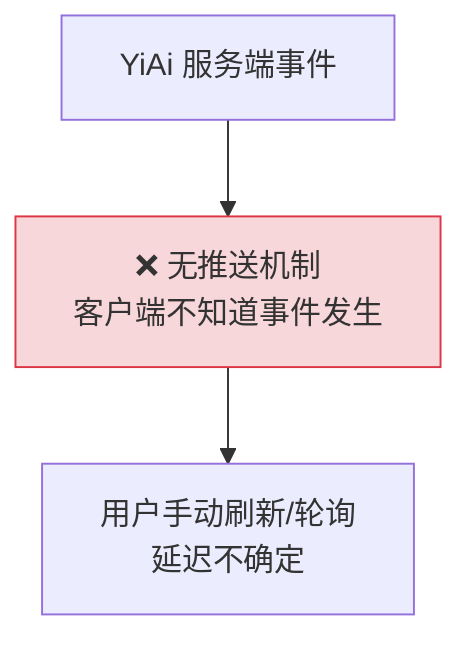
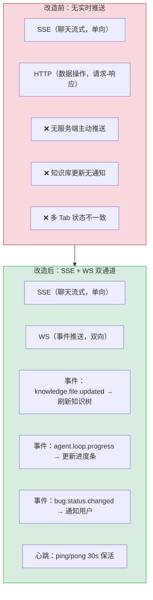

# YP-09-46: Content Script WebSocket 实时通信 — 双向事件推送

> 需求编号：YP-09-46 · 优先级：P2 · 人天：0.5d · 状态：需求已编写

## 背景

YiPet 通过 HTTP SSE 接收 AI 流式响应（单向推送），但无服务端主动推送事件的能力。以下场景依赖轮询或被动等待：

| # | 场景 | 当前方式 | 延迟 | 问题 |
|---|------|----------|------|------|
| 1 | 知识库文件变更通知 | 用户手动刷新知识树 | 无感知 | 知识库更新后聊天窗口未同步 |
| 2 | Agent 循环进度推送 | SSE 仅推送文本 chunk | 无 | Agent 当前步骤不可见 |
| 3 | Bug 状态变更通知 | 无 | 无 | 用户不知道缺陷已被修复 |
| 4 | 多 Tab 状态同步 | 无 | 无 | 不同标签页的聊天窗口状态不一致 |
| 5 | RAG 索引重建完成通知 | 用户手动轮询 `/rag-status` | 不确定 | 用户不知道索引何时就绪 |

**目标**：建立 WebSocket 连接作为双向事件通道——服务端主动推送事件（知识库变更、Agent 进度、Bug 状态），客户端订阅感兴趣的事件类型，实现低延迟的实时通知。

---

## 现状分析

### 当前状态

```
YiPet/src/api/client.ts
  └── ApiClient.request() — HTTP POST
  └── ApiClient.stream() — HTTP SSE（单向推送）
  └── 无 WebSocket 连接

YiPet 服务端通知机制：无（仅轮询）
```

### 文件清单

| 文件 | 当前状态 | 九月改动 |
|------|----------|----------|
| `src/shared/websocket.ts` | 不存在 | 新增：RealtimeClient WebSocket 封装 |
| `src/chat/stores/chat.ts` | 无 WS 事件处理 | 新增事件订阅 + 状态更新 |
| `src/chat/index.ts` | 仅初始化 API | 新增 WS 连接初始化 |
| YiAi `src/server/ws_router.py` | 不存在 | 新增：WebSocket 路由 + 事件广播 |

### 当前数据流



### 根因矩阵

| 问题 | 根因 | 影响范围 |
|------|------|----------|
| 无服务端推送 | 仅有 HTTP/SSE 单向通道 | 所有实时事件 |
| Agent 进度不可见 | SSE 仅传输文本，无结构化进度 | Agent 用户体验 |
| 多 Tab 不同步 | 无广播机制 | 多标签页用户 |

---

## 设计决策

### 决策 1：WebSocket 使用场景 — 替代 SSE vs 补充 SSE vs 统一通道

| 选项 | 聊天流式 | 事件推送 | 复杂度 |
|------|----------|----------|--------|
| 替代 SSE（所有通信走 WS） | WS 不支持内置流式解析 | WS 适合 | 高（需迁移聊天流式到 WS） |
| 补充 SSE（SSE 聊天 + WS 事件） | SSE 保持 | WS 补充 | 中（双通道） |
| 统一 WS 通道 | WS 自定义流式协议 | WS 内置 | 高 |

**选择：补充 SSE（SSE 聊天 + WS 事件）**。SSE 原生支持 `text/event-stream` 格式，浏览器自动重连，YiPet 已完整集成。WS 用于结构化事件推送（JSON 消息），不替代 SSE 的聊天流式功能。两者互补：SSE 负责大数据流式传输，WS 负责低延迟事件通知。

### 决策 2：WS 连接生命周期 — 常驻连接 vs 按需连接 vs 混合

| 选项 | 资源消耗 | 延迟 | 适用场景 |
|------|----------|------|----------|
| 常驻连接（聊天窗口打开时连接） | 中 | 低 | 事件频繁 |
| 按需连接（需要时连接） | 低 | 高（首次连接延迟） | 事件稀少 |
| 混合（页面可见时连接，隐藏时断开） | 低 | 中 | 节省资源 |

**选择：常驻连接（聊天窗口打开时）**。WS 连接的空闲心跳仅消耗极少带宽（ping/pong 每 30s），保持连接的开销可忽略。按需连接首次建立需要 TCP+TLS 握手（~50ms），对实时事件来说延迟过高。

### 决策 3：断线重连策略 — 简单重连 vs 指数退避 vs 不重连

| 选项 | 可靠性 | 服务端压力 | 实现 |
|------|--------|-----------|------|
| 简单重连（固定间隔 3s） | 中 | 高（重连风暴） | 低 |
| 指数退避（1/2/4/8/16s，最多 5 次） | 高 | 低 | 中 |
| 不重连 | 低 | 无 | 低 |

**选择：指数退避重连**。与 SSE 重连策略一致（YP-09-03），1s/2s/4s/8s/16s，最多 5 次。避免重连风暴，给服务端恢复时间。5 次重连后放弃，依赖用户下次打开聊天窗口时重新连接。

### 设计决策记录

| 决策 | 选项 A | 选项 B | 选项 C | 选择 | 理由 |
|------|--------|--------|--------|------|------|
| WS 使用场景 | 替代 SSE | 补充 SSE | 统一通道 | **补充 SSE** | 保持 SSE 流式优势 |
| 连接生命周期 | 常驻 | 按需 | 混合 | **常驻** | 延迟最低 |
| 断线重连 | 简单重连 | 指数退避 | 不重连 | **指数退避** | 与 SSE 一致 |

---

## 目标架构

### 改造前后对比



### WS 事件通道

| 方向 | 事件 | Payload | 订阅方 |
|------|------|---------|--------|
| Client → Server | `subscribe` | `{events: ['knowledge.*', 'agent.*']}` | 连接时 |
| Server → Client | `knowledge.file.updated` | `{path, title, category}` | 聊天窗口 |
| Server → Client | `knowledge.file.deleted` | `{path}` | 聊天窗口 |
| Server → Client | `agent.loop.progress` | `{sessionId, iteration, maxIter, action}` | 聊天窗口 |
| Server → Client | `bug.status.changed` | `{bugKey, from, to, assignee}` | 聊天窗口 |
| Server → Client | `rag.index.rebuilt` | `{numDocs, duration}` | 聊天窗口 |
| Bi-directional | `ping` / `pong` | `{timestamp}` | 保活 |

### 架构指标

| 指标 | 改造前 | 改造后 | 改进 |
|------|--------|--------|------|
| 服务端事件延迟 | 无（轮询） | < 100ms | 新增 |
| 多 Tab 同步 | 不支持 | WS 广播 | 新增 |
| Agent 进度可见性 | 不可见 | 实时进度推送 | 新增 |
| WS 连接开销（空闲） | N/A | 360 bytes/min（心跳） | 可忽略 |

---

## 具体改动

### 1. RealtimeClient 实现

```typescript
// YiPet/src/shared/websocket.ts

type EventHandler = (payload: any) => void;

class RealtimeClient {
  private _ws: WebSocket | null = null;
  private _url: string;
  private _reconnectAttempts = 0;
  private _maxReconnect = 5;
  private _reconnectDelays = [1000, 2000, 4000, 8000, 16000];
  private _handlers = new Map<string, Set<EventHandler>>();
  private _heartbeatInterval: ReturnType<typeof setInterval> | null = null;
  private _intentionalClose = false;

  constructor(url: string) {
    this._url = url;
  }

  connect() {
    if (this._ws?.readyState === WebSocket.OPEN) return;
    this._intentionalClose = false;

    this._ws = new WebSocket(this._url);

    this._ws.onopen = () => {
      this._reconnectAttempts = 0;
      console.debug('[WS] 已连接');

      // 订阅感兴趣的事件
      this.send('subscribe', {
        events: [
          'knowledge.file.updated',
          'knowledge.file.deleted',
          'agent.loop.progress',
          'bug.status.changed',
          'rag.index.rebuilt',
        ],
      });

      // 启动心跳
      this._startHeartbeat();
    };

    this._ws.onmessage = (event) => {
      try {
        const msg = JSON.parse(event.data);

        if (msg.event === 'pong') {
          // 心跳响应——忽略
          return;
        }

        const handlers = this._handlers.get(msg.event);
        if (handlers) {
          handlers.forEach(fn => {
            try { fn(msg.payload); } catch (e) { console.error('[WS] 事件处理器错误:', e); }
          });
        }

        // 通配符匹配——如 'knowledge.*' 匹配 'knowledge.file.updated'
        for (const [pattern, fns] of this._handlers) {
          if (pattern.includes('*') && this._matchPattern(pattern, msg.event)) {
            fns.forEach(fn => {
              try { fn(msg.payload); } catch (e) { console.error('[WS] 通配符处理器错误:', e); }
            });
          }
        }
      } catch {
        console.warn('[WS] 无法解析消息:', event.data);
      }
    };

    this._ws.onclose = (event) => {
      this._stopHeartbeat();
      if (this._intentionalClose) return;

      if (this._reconnectAttempts < this._maxReconnect) {
        const delay = this._reconnectDelays[this._reconnectAttempts];
        console.debug(`[WS] ${delay}ms 后重连 (${this._reconnectAttempts + 1}/${this._maxReconnect})`);
        setTimeout(() => {
          this._reconnectAttempts++;
          this.connect();
        }, delay);
      } else {
        console.warn('[WS] 重连次数用尽');
      }
    };

    this._ws.onerror = () => {
      // onclose 会处理重连，这里仅记录
    };
  }

  disconnect() {
    this._intentionalClose = true;
    this._stopHeartbeat();
    this._ws?.close();
    this._ws = null;
  }

  on(event: string, handler: EventHandler): () => void {
    if (!this._handlers.has(event)) {
      this._handlers.set(event, new Set());
    }
    this._handlers.get(event)!.add(handler);

    return () => {
      this._handlers.get(event)?.delete(handler);
    };
  }

  send(action: string, payload?: any) {
    if (this._ws?.readyState === WebSocket.OPEN) {
      this._ws.send(JSON.stringify({ action, payload, timestamp: Date.now() }));
    }
  }

  private _startHeartbeat() {
    this._heartbeatInterval = setInterval(() => {
      this.send('ping');
    }, 30000);
  }

  private _stopHeartbeat() {
    if (this._heartbeatInterval) {
      clearInterval(this._heartbeatInterval);
      this._heartbeatInterval = null;
    }
  }

  private _matchPattern(pattern: string, event: string): boolean {
    const regex = new RegExp('^' + pattern.replace(/\*/g, '.*') + '$');
    return regex.test(event);
  }
}
```

### 2. 聊天窗口集成

```typescript
// YiPet/src/chat/index.ts — WS 初始化

import { RealtimeClient } from '@/shared/websocket';

const ws = new RealtimeClient(`ws://${YIAI_HOST}:10086/ws`);
ws.connect();

// 注册事件处理器
ws.on('knowledge.file.updated', ({ path, title }) => {
  // 自动刷新知识树
  chatStore.loadKnowledgeTree();
  console.debug(`[WS] 知识文件更新: ${path}`);
});

ws.on('agent.loop.progress', ({ sessionId, iteration, maxIter, action }) => {
  // 更新 Agent 进度指示器
  chatStore.updateAgentProgress(sessionId, iteration, maxIter, action);
});

ws.on('bug.status.changed', ({ bugKey, from, to }) => {
  // 通知用户
  ElNotification.info({
    title: '缺陷状态变更',
    message: `${bugKey}: ${from} → ${to}`,
  });
});

ws.on('rag.index.rebuilt', ({ numDocs, duration }) => {
  ElNotification.success({
    title: 'RAG 索引重建完成',
    message: `${numDocs} 个文档，耗时 ${duration}s`,
  });
});
```

### 3. 涉及文件清单

```
YiPet/src/shared/
├── websocket.ts                      # 新增: RealtimeClient WebSocket 封装

YiPet/src/chat/
├── index.ts                          # 修改: 初始化 WS + 注册事件处理器
├── stores/chat.ts                    # 修改: +agentProgress 状态 + WS 事件处理

YiAi/src/server/
├── ws_router.py                      # 新增: WebSocket 路由 + 事件广播
├── ws_manager.py                     # 新增: 连接管理器 + 订阅匹配
```

---

## 实施步骤

| 步骤 | 内容 | 涉及文件 | 验证方式 | 人天 |
|------|------|---------|---------|------|
| 1 | 实现 `RealtimeClient` 类 | `websocket.ts` | 连接 → ping/pong → 事件接收 | 0.15 |
| 2 | 实现 YiAi WS 路由 + 事件广播 | `ws_router.py` | 服务端事件 → WS 广播 → 客户端收到 | 0.15 |
| 3 | 聊天窗口 WS 集成 + 事件订阅 | `chat/index.ts` | 知识库文件变更 → 知识树自动刷新 | 0.10 |
| 4 | Agent 进度推送集成 | `stores/chat.ts` | Agent 循环 → 进度条实时更新 | 0.05 |
| 5 | 断线重连测试 | 全链路 | 断网 → WS 自动重连 → 事件恢复 | 0.05 |

**总计：0.5d**

---

## 性能分析

| 操作 | 耗时 | 说明 |
|------|------|------|
| WS 首次连接（TCP + WS handshake） | ~20ms | localhost，无 TLS |
| 事件推送延迟（Server → Client） | < 5ms | JSON 序列化 + WS 帧 |
| 心跳 ping/pong | < 1ms | 空消息 |
| 断线重连（首次退避） | 1000ms | 指数退避 1s |
| WS 空闲带宽 | ~360 bytes/min | ping/pong 每 30s |

---

## 测试规格

### Requirement: 事件推送

#### Scenario: 知识库文件变更通知
- **Given** WS 已连接，订阅了 `knowledge.file.updated`
- **When** YiAi 检测到知识文件变更
- **Then** 客户端收到 `{path, title, category}` → 自动刷新知识树

#### Scenario: Agent 循环进度推送
- **Given** WS 已连接，Agent 正在执行
- **When** Agent 进入第 3/5 轮迭代
- **Then** 客户端收到 `{sessionId, iteration: 3, maxIter: 5}` → 进度条更新

### Requirement: 断线重连

#### Scenario: 网络中断后自动重连
- **Given** WS 已连接
- **When** 网络中断 5s 后恢复
- **Then** WS 自动重连，重连后重新订阅事件

#### Scenario: 重连次数用尽
- **Given** WS 已重连 5 次失败
- **When** 第 6 次尝试
- **Then** 停止重连，console 警告

---

## 风险与缓解

| 风险 | 概率 | 影响 | 等级 | 缓解措施 | 应急预案 |
|------|------|------|------|----------|----------|
| WS 连接数过多耗尽服务器资源 | 中 | 高 | 中 | 单用户单连接，限制连接数 | 拒绝新连接 + 提示 |
| 防火墙/代理阻断 WebSocket | 中 | 中 | 中 | WS 走 HTTP 端口（10086），与 HTTP API 相同端口 | 降级为 HTTP 轮询（每 30s） |
| WS 消息丢失（重连期间） | 中 | 低 | 低 | 重连后重新订阅，服务端推送最新状态 | 接受偶尔的消息丢失 |

---

## 回滚策略

| 场景 | 回滚操作 | 影响范围 |
|------|----------|----------|
| WS 服务不稳定 | 禁用 WS 连接，回退到 HTTP 轮询 | 实时通知延迟增加 |
| WS 客户端 bug | 移除 WS 初始化代码 | 所有实时事件不可用 |

---

## 设计决策记录

### D-01: 为什么 WS 不替代 SSE 的聊天流式功能？

SSE 原生支持 `text/event-stream` 格式，浏览器自动处理重连和 `EventSource` API。WS 需要自定义流式协议（分帧、重组、结束标记），实现复杂且容易出错。保持 SSE 负责聊天流式（大数据、单向），WS 负责事件推送（小数据、双向），各司其职，架构清晰。

### D-02: 为什么选择指数退避重连？

固定间隔重连（如每 3s）在服务端故障恢复瞬间会产生重连风暴——所有客户端同时重连，压垮刚恢复的服务端。指数退避（1s/2s/4s/8s/16s）将重连时间分散，给服务端恢复窗口。与 SSE 的退避策略一致（YP-09-03）。

### D-03: 为什么支持通配符事件匹配（`knowledge.*`）？

客户端不需要知道所有具体事件名称——例如知识库模块未来可能新增 `knowledge.file.renamed`、`knowledge.directory.created` 等事件。通配符订阅 `knowledge.*` 自动匹配所有知识库相关事件，减少客户端代码修改。这与 MQTT 的 topic 匹配模式一致。

---

## 可观测性

| 指标 | 采集方式 | 告警阈值 | 说明 |
|------|----------|----------|------|
| WS 连接数 | 服务端连接计数 | > 100 | 连接泄漏 |
| WS 重连率 | 重连次数 / 总连接次数 | > 30% | 网络不稳定 |
| WS 消息延迟 | `event.timestamp - Date.now()` | > 500ms | 服务端处理慢 |
| 心跳丢失次数 | ping 未收到 pong 计数 | 连续 > 3 次 | 连接僵死 |

---

## 安全合规

| 检查项 | 要求 | 验证方法 |
|--------|------|----------|
| WS 认证 | 连接时验证 `X-Token` 头部或 query 参数 | 无 token 连接 → 拒绝 |
| WS 消息加密 | 生产环境使用 `wss://`（TLS） | 开发环境 `ws://`，生产 `wss://` |
| WS 消息大小限制 | 单个消息 ≤ 64KB | 服务端校验 |

---

## 代码审查检查清单

- [ ] WebSocket 用于实时推送（通知/状态变更），非替代 SSE 聊天流
- [ ] 连接管理：心跳 ping/pong 每 30s + 指数退避断线重连
- [ ] 消息类型区分：通知/状态变更/心跳
- [ ] 同 HTTP API 共享认证 Token
- [ ] 通配符事件匹配（`knowledge.*`）支持
- [ ] 主动断开时不重连（`intentionalClose` 标志）
- [ ] 重连后重新订阅事件
- [ ] WS 和 SSE 共享同一端口（10086）
- [ ] `vue-tsc --noEmit` 通过
- [ ] `npm run build` 成功

---

## 回归问题预测

| # | 预测问题 | 原因 | 验证方法 |
|---|---------|------|---------|
| 1 | WS 连接数过多耗尽服务器资源 | 每个聊天窗口打开时建立常驻连接，用户可能打开 20+ 个标签页，每个标签页都有独立的聊天窗口和 WS 连接，导致 20+ 个连接同时存活 | 打开 10 个标签页，每个页面打开聊天窗口，检查 YiAi 后端 WS 连接数是否为 10；验证服务端是否有连接数上限 |
| 2 | 防火墙/代理阻断 WebSocket 导致连接静默失败 | 企业网络环境中，HTTP 代理（如 Squid）可能不转发 WebSocket 升级请求，`new WebSocket(url)` 的 `onerror` 事件触发但 `onclose` 也触发，重连循环浪费资源 | 在配置了 HTTP 代理的浏览器中测试，验证 WS 连接失败后是否在合理次数内停止重连（而非无限重连） |
| 3 | WS 消息在重连期间丢失且无补偿机制 | 断线后重连需要 1-16s（指数退避），期间服务端推送的事件（如知识库更新、Agent 进度）丢失，客户端重连后重新订阅但不会收到断线期间的事件 | 断开网络 5s → 期间通过 YiAi API 触发知识库文件变更 → 恢复网络 → WS 重连 → 验证知识树是否自动刷新（或至少显示"数据可能过期"提示） |
| 4 | 心跳机制失效导致连接僵死但未重连 | `setInterval` 每 30s 发送 ping，但 `onmessage` 中仅处理 `pong` 事件——如果服务端未实现 pong 响应，客户端不会检测到心跳丢失，连接可能已僵死但 `readyState` 仍为 OPEN | 模拟服务端不响应 pong（停止 WS 服务端但保持 TCP 连接），验证客户端是否能在合理时间内检测到连接僵死并重连 |
| 5 | 通配符事件匹配 `knowledge.*` 匹配到非预期的子事件 | `_matchPattern` 将 `*` 替换为 `.*`，`knowledge.*` 的正则是 `^knowledge\..*$`——如果未来出现 `knowledge` 前缀的非文件事件（如 `knowledge.index.progress`），也会被匹配到并触发文件刷新逻辑 | 验证 `knowledge.*` 的匹配范围是否仅限于 `knowledge.file.*`；如果不够精确，改为 `knowledge.file.*` |
| 6 | WebSocket 和 SSE 共享同一端口但 WS 升级请求可能被路由到 HTTP 处理器 | FastAPI 的 WS 路由和 HTTP 路由共享同一 uvicorn 端口，但 `/ws` 路径的请求是 HTTP Upgrade 请求，如果路由配置不正确，WS 请求可能被 HTTP 路由处理并返回 404 | 检查 FastAPI 路由配置中 `/ws` 路径是否在 HTTP 路由之前注册；验证 `ws://localhost:10086/ws` 连接成功 |

*PRD 来源: `projects/yipet/requirements/2026-09/46-需求-WebSocket实时通信.md`*