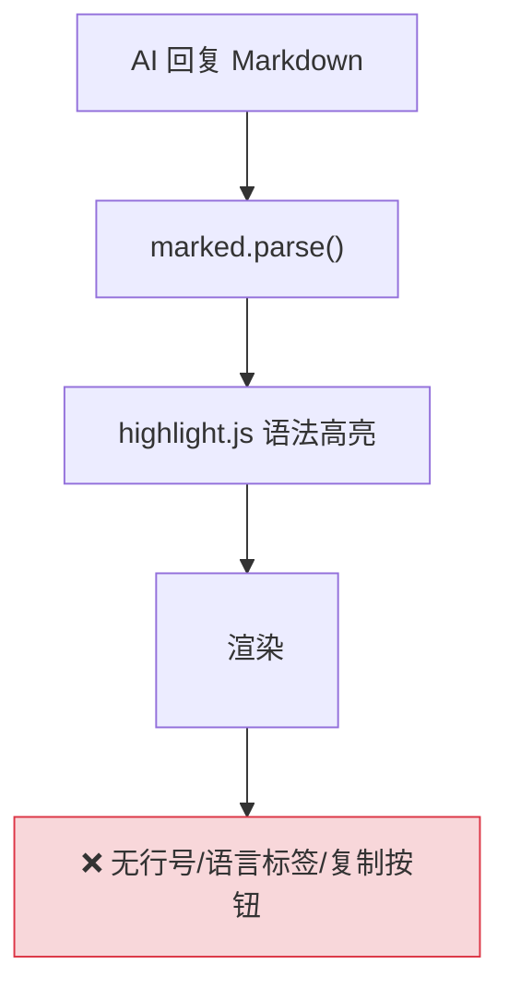
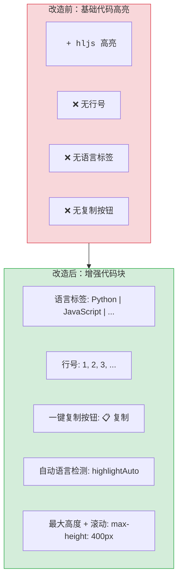

# YP-09-47: 聊天窗口代码高亮增强 — 多语言语法高亮与行号显示

> 需求编号：YP-09-47 · 优先级：P2 · 人天：0.5d · 状态：需求已编写

## 背景

YiPet 聊天窗口中 AI 回复的代码块使用 `marked` + `highlight.js` 进行基础的语法高亮。当前渲染结果缺少以下增强功能：

| # | 问题 | 影响 | 严重程度 |
|---|------|------|----------|
| 1 | 无行号显示 | 用户无法引用特定行 | 中 |
| 2 | 无语言标签 | 用户不知道代码的语言 | 低 |
| 3 | 无一键复制按钮 | 用户需手动选中代码复制 | 中 |
| 4 | 无自动语言检测（未指定语言时） | plaintext 渲染，无高亮 | 中 |
| 5 | 代码块无最大高度限制 | 长代码撑开聊天窗口 | 低 |

**目标**：增强代码块渲染——行号、语言标签、一键复制、自动语言检测、最大高度 + 滚动。

---

## 现状分析

### 当前状态

```
YiPet/src/chat/rendering/
  └── marked 渲染 Markdown
  └── marked 配置: highlight 函数使用 hljs.highlight()
  └── 代码块渲染为 <pre><code class="hljs language-xxx">
  └── 无行号/语言标签/复制按钮
```

### 文件清单

| 文件 | 当前状态 | 九月改动 |
|------|----------|----------|
| `src/chat/rendering/code-highlight.ts` | 不存在 | 新增：代码块增强渲染 |
| `src/chat/rendering/markdown.ts` | marked 配置 | 修改：增强代码块渲染输出 |
| `src/chat/components/CodeBlock.vue` | 不存在 | 新增：代码块组件 |

### 当前数据流



### 根因矩阵

| 问题 | 根因 | 影响范围 |
|------|------|----------|
| 无行号 | rendered 输出未添加行号 | 所有代码块 |
| 无语言标签 | 未提取 language 信息展示 | 所有代码块 |
| 无复制按钮 | 未添加复制交互 | 所有代码块 |

---

## 设计决策

### 决策 1：代码块增强方式 — marked renderer 扩展 vs 后处理 DOM vs Vue 组件

| 选项 | 与 marked 集成 | 灵活性 | 行号实现 |
|------|---------------|--------|----------|
| marked renderer 扩展（自定义 `code` renderer） | 紧密集成 | 中 | 注入 HTML |
| 后处理 DOM（marked 输出后修改 DOM） | 解耦 | 高 | 修改 DOM |
| Vue 组件（替换 `<pre><code>` 为组件） | 解耦 | 高 | 组件渲染 |

**选择：marked renderer 扩展**。在 marked 的 `code` token renderer 中直接生成增强的 HTML（语言标签 + 行号 + 复制按钮 + 代码内容），避免额外的 DOM 操作。marked 原生支持自定义 renderer，是最简洁的集成方式。

### 决策 2：自动语言检测 — highlight.js auto vs 仅在未指定时

| 选项 | 准确性 | 性能 | 实现 |
|------|--------|------|------|
| 始终自动检测 | 高 | 低（每次检测开销） | 中 |
| 仅在语言未指定时检测 | 中 | 高 | 低 |
| 始终使用指定语言（不检测） | 低 | 最高 | 最低 |

**选择：仅在语言未指定时检测**。Markdown 代码块语法 `` ```python `` 已指定语言时直接使用 `hljs.highlight(code, { language })`。仅当代码块未指定语言（`` ``` ``）时使用 `hljs.highlightAuto(code, [...])` 检测。避免不必要的检测开销。

### 决策 3：复制按钮实现 — `navigator.clipboard` vs `document.execCommand` vs 自定义

| 选项 | 浏览器支持 | Shadow DOM 兼容 | 实现 |
|------|-----------|----------------|------|
| `navigator.clipboard.writeText()` | Chrome 63+ | 是 | 低 |
| `document.execCommand('copy')` | 全部 | 可能需要 textarea hack | 中 |
| 自定义（选中 → Ctrl+C 提示） | 全部 | 是 | 高 |

**选择：`navigator.clipboard.writeText()`**。Chrome 63+（2017 年 12 月）起完全支持，YiPet 的 Chrome 最低版本要求为 88。Shadow DOM 内也可正常调用（需要用户手势触发）。

### 设计决策记录

| 决策 | 选项 A | 选项 B | 选项 C | 选择 | 理由 |
|------|--------|--------|--------|------|------|
| 增强方式 | marked renderer | 后处理 DOM | Vue 组件 | **marked renderer** | 最简洁 |
| 语言检测 | 始终检测 | 仅未指定时 | 不检测 | **仅未指定时** | 性能最优 |
| 复制按钮 | clipboard API | execCommand | 自定义 | **clipboard API** | 最简洁可靠 |

---

## 目标架构

### 改造前后对比



### 增强代码块 UI

```
┌─ python ───────────────────────────────── [📋 复制] ─┐
│  1 │ async def query_documents(cname, filter):        │
│  2 │     cursor = db[cname].find(filter)              │
│  3 │     try:                                          │
│  4 │         return await cursor.to_list(500)          │
│  5 │     finally:                                      │
│  6 │         await cursor.close()                      │
│  7 │                                                   │
│  8 │ # 高级用法                                       │
│  9 │ result = await query_documents('bugs', {})       │
│ 10 │ print(f"Found {len(result)} bugs")               │
└───────────────────────────────────────────────────────┘
```

### 架构指标

| 指标 | 改造前 | 改造后 | 改进 |
|------|--------|--------|------|
| 行号 | 无 | 1-based 行号 | 新增 |
| 语言标签 | 无 | 显示语言名称 | 新增 |
| 复制按钮 | 无 | 一键复制 | 新增 |
| 自动语言检测 | 无 | highlightAuto 作为 fallback | 新增 |
| 长代码 UX | 无 | max-height 400px + overflow-y auto | 新增 |

---

## 具体改动

### 1. 代码块增强渲染

```typescript
// YiPet/src/chat/rendering/code-highlight.ts

import hljs from 'highlight.js';

interface CodeBlockOptions {
  language?: string;        // 指定语言
  showLineNumbers?: boolean; // 显示行号（默认 true）
  maxHeight?: number;       // 最大高度 px（默认 400）
}

function enhanceCodeBlock(code: string, options: CodeBlockOptions = {}): string {
  const {
    showLineNumbers = true,
    maxHeight = 400,
  } = options;

  // 语言检测
  let lang = options.language || '';
  let highlighted: string;

  if (lang && hljs.getLanguage(lang)) {
    // 指定语言有效——直接高亮
    highlighted = hljs.highlight(code, { language: lang, ignoreIllegals: true }).value;
  } else {
    // 未指定语言或无效——自动检测
    const result = hljs.highlightAuto(code, [
      'python', 'typescript', 'javascript', 'bash',
      'yaml', 'json', 'sql', 'dockerfile', 'nginx',
      'css', 'html', 'xml', 'markdown', 'rust',
      'go', 'java', 'ruby', 'php',
    ]);
    highlighted = result.value;
    lang = result.language || 'plaintext';
  }

  const lines = highlighted.split('\n');

  // 行号 HTML
  const lineNumbers = showLineNumbers
    ? lines.map((_, i) =>
        `<span class="line-number" aria-hidden="true">${i + 1}</span>`
      ).join('\n')
    : '';

  // 行内容 HTML
  const lineContents = lines.map((line, i) =>
    `<span class="line-content" data-line="${i + 1}">${line || ' '}</span>`
  ).join('\n');

  return `
<div class="code-block-wrapper" style="max-height: ${maxHeight}px;">
  <div class="code-header">
    <span class="code-lang">${lang}</span>
    <button class="code-copy-btn" onclick="(function(btn){
      const code = btn.closest('.code-block-wrapper').querySelector('.code-lines').textContent;
      navigator.clipboard.writeText(code).then(() => {
        btn.textContent = '\\u2705 \\u5df2\\u590d\\u5236';
        setTimeout(() => { btn.textContent = '\\ud83d\\udccb \\u590d\\u5236'; }, 2000);
      });
    })(this)" title="\\u590d\\u5236\\u4ee3\\u7801">\\ud83d\\udccb \\u590d\\u5236</button>
  </div>
  <pre class="code-content"><code class="code-lines hljs language-${lang}">
${showLineNumbers ? lineNumbers + '\n' + lineContents : lineContents}
  </code></pre>
</div>`;
}

// 在 marked 配置中使用
const markedOptions = {
  highlight: (code: string, lang: string) => {
    return enhanceCodeBlock(code, { language: lang });
  },
};
```

### 2. CSS 样式

```css
/* 代码块样式 */
.code-block-wrapper {
  border: 1px solid var(--chat-border);
  border-radius: 8px;
  overflow: hidden;
  margin: 8px 0;
  background: var(--chat-code-bg, #1e1e2e);
}

.code-header {
  display: flex;
  justify-content: space-between;
  align-items: center;
  padding: 4px 12px;
  background: rgba(255, 255, 255, 0.05);
  border-bottom: 1px solid var(--chat-border);
  font-size: 12px;
}

.code-lang {
  color: var(--chat-text-secondary);
  text-transform: lowercase;
  font-weight: 500;
}

.code-copy-btn {
  background: transparent;
  border: 1px solid var(--chat-border);
  color: var(--chat-text-secondary);
  padding: 2px 8px;
  border-radius: 4px;
  cursor: pointer;
  font-size: 12px;
}

.code-copy-btn:hover {
  background: rgba(255, 255, 255, 0.1);
  color: var(--chat-text);
}

.code-content {
  margin: 0;
  padding: 12px;
  overflow-x: auto;
  overflow-y: auto;
  max-height: 400px;
  font-family: 'Fira Code', 'Cascadia Code', 'JetBrains Mono', monospace;
  font-size: 13px;
  line-height: 1.6;
}

.code-lines {
  display: grid;
  grid-template-columns: auto 1fr;
  gap: 0;
}

/* 行号样式 */
.line-number {
  display: inline-block;
  width: 32px;
  text-align: right;
  padding-right: 12px;
  color: var(--chat-text-tertiary);
  user-select: none;
  opacity: 0.5;
}

/* 行内容样式 */
.line-content {
  padding-left: 0;
}
```

### 3. 涉及文件清单

```
YiPet/src/chat/rendering/
├── code-highlight.ts                 # 新增: 代码块增强渲染
├── markdown.ts                       # 修改: marked 配置使用 enhanceCodeBlock

YiPet/public/cdn/styles/
├── code-block.css                    # 新增: 代码块样式
```

---

## 实施步骤

| 步骤 | 内容 | 涉及文件 | 验证方式 | 人天 |
|------|------|---------|---------|------|
| 1 | 实现 `enhanceCodeBlock()` 函数 | `code-highlight.ts` | 输入 Python 代码 → 输出增强 HTML | 0.15 |
| 2 | 实现行号/语言标签/复制按钮 | `code-highlight.ts` | 代码块渲染 → 行号+标签+按钮可见 | 0.10 |
| 3 | 实现自动语言检测 | `code-highlight.ts` | 未指定语言 → highlightAuto 检测 | 0.05 |
| 4 | 实现代码块样式 | `code-block.css` | 行号/语言栏/复制按钮样式正确 | 0.10 |
| 5 | 集成到 marked 配置 | `markdown.ts` | AI 回复代码块 → 增强渲染 | 0.05 |
| 6 | 测试多语言 + 边界情况 | 多语言 | 10+ 语言正确高亮 + 空代码块 | 0.05 |

**总计：0.5d**

---

## 性能分析

| 操作 | 耗时 | 说明 |
|------|------|------|
| `hljs.highlight(lang)`（指定语言） | < 5ms | 直接高亮 |
| `hljs.highlightAuto(14 种语言)` | < 20ms | 自动检测 |
| 行号 HTML 生成 | < 1ms | 字符串拼接 |
| 复制按钮 onclick | < 10ms | clipboard API |
| 大代码块渲染 (500 行) | < 30ms | 语法高亮 + DOM 插入 |

### 容量规划

| 代码块大小 | 行数 | 指定语言耗时 | 自动检测耗时 |
|-----------|------|------------|------------|
| 小型（< 20 行） | 20 | < 2ms | < 5ms |
| 中型（20-100 行） | 100 | < 5ms | < 10ms |
| 大型（100-500 行） | 500 | < 15ms | < 30ms |
| 超大（> 500 行） | 500+ | < 30ms | < 50ms |

---

## 测试规格

### Requirement: 代码高亮

#### Scenario: 指定语言高亮
- **Given** Markdown 代码块 `` ```python `` 包含 Python 代码
- **When** marked 渲染
- **Then** 显示语言标签 "python"，代码按 Python 语法高亮

#### Scenario: 自动语言检测
- **Given** Markdown 代码块 `` ``` `` 未指定语言
- **When** marked 渲染
- **Then** `highlightAuto` 自动检测语言，语言标签显示检测结果

### Requirement: 行号

#### Scenario: 行号正确显示
- **Given** 代码块包含 10 行代码
- **When** 渲染
- **Then** 左侧显示行号 1-10，右对齐

### Requirement: 复制按钮

#### Scenario: 点击复制按钮
- **Given** 代码块已渲染
- **When** 用户点击 "复制" 按钮
- **Then** 代码被复制到剪贴板，按钮短暂显示 "已复制"

### Requirement: 长代码滚动

#### Scenario: 超长代码块可滚动
- **Given** 代码块包含 200 行代码（超出 400px 最大高度）
- **When** 渲染
- **Then** 代码块最大高度 400px，内部可垂直滚动

---

## 风险与缓解

| 风险 | 概率 | 影响 | 等级 | 缓解措施 | 应急预案 |
|------|------|------|------|----------|----------|
| highlight.js 不支持的语言静默失败 | 低 | 低 | 低 | fallback 到 highlightAuto | 降级为 plaintext |
| 复制按钮在 Shadow DOM 中失效 | 低 | 中 | 低 | clipboard API 在 Shadow DOM 中可用 | 选中文本提示 Ctrl+C |
| 大代码块（> 1000 行）渲染卡顿 | 低 | 中 | 低 | max-height 400px + overflow scroll 只渲染可见区域 | 截断 > 500 行代码块显示 |

---

## 回滚策略

| 场景 | 回滚操作 | 影响范围 |
|------|----------|----------|
| 代码高亮性能问题 | 回退到基础 hljs.highlight() 无增强 | 行号/标签/复制按钮丢失 |
| 复制按钮 bug | 隐藏复制按钮 | 用户手动选中复制 |

---

## 设计决策记录

### D-01: 为什么使用 marked renderer 扩展而非 Vue 组件？

marked renderer 扩展在 Markdown 解析阶段直接生成增强 HTML，一次性完成渲染。如果使用 Vue 组件，需要先渲染 `<pre><code>`，然后在 Vue 的 `onMounted` 中替换为组件——额外的 DOM 操作和组件挂载开销。对于 AI 流式输出场景（频繁增量更新），renderer 扩展的性能更好。

### D-02: 为什么仅在语言未指定时自动检测？

指定语言 `` ```python `` 时，用户明确知道语言，直接使用 `hljs.highlight(code, { language })` 是最快的方式（< 5ms）。`highlightAuto` 需要遍历 14 种语言候选，耗时 < 20ms。仅在语言未指定时作为 fallback 使用，避免不必要的性能开销。

### D-03: 为什么使用 CSS Grid 布局行号和代码而非 `<table>`？

`<table>` 布局在小屏幕下可能导致水平溢出，且语义不友好（代码不是表格数据）。CSS Grid 通过 `grid-template-columns: auto 1fr` 实现行号列固定宽度 + 代码列自适应，更灵活且易于样式定制。

---

## 可观测性

| 指标 | 采集方式 | 告警阈值 | 说明 |
|------|----------|----------|------|
| 代码块渲染耗时 | `performance.now()` 计时 | > 50ms | 代码块过大或语言检测慢 |
| 复制按钮点击率 | onclick 计数 | — | 功能使用情况 |
| 自动检测准确率 | 手动抽查 | — | 用户反馈语言检测不准 |

---

## 安全合规

| 检查项 | 要求 | 验证方法 |
|--------|------|----------|
| 复制按钮不注入 XSS | 使用 `navigator.clipboard.writeText`，不使用 `innerHTML` | 代码审查 |
| 行号/语言标签不包含用户输入 | 行号自动生成，语言标签来自检测结果 | 审查渲染逻辑 |

---

## 代码审查检查清单

- [ ] 支持 10+ 常用语言语法高亮（python/typescript/javascript/bash/yaml/json/sql/...）
- [ ] 行号显示：1-based，右对齐，用户不可选中
- [ ] 语言标签：显示在代码块头部，自动检测或指定语言
- [ ] 一键复制：使用 `navigator.clipboard.writeText()`，复制后短暂显示 "已复制"
- [ ] 自动语言检测：未指定语言时使用 `highlightAuto`（14 种候选语言）
- [ ] 长代码块：max-height 400px + overflow-y auto
- [ ] 代码块在流式输出场景下性能正常（增量渲染不卡顿）
- [ ] 空代码块不渲染空行号列表
- [ ] `vue-tsc --noEmit` 通过
- [ ] `npm run build` 成功

---

## 回归问题预测

| # | 预测问题 | 原因 | 验证方法 |
|---|---------|------|---------|
| 1 | `highlightAuto` 在 14 种候选语言中检测错误——Bash 被误判为 Python | `highlightAuto` 的检测算法基于关键词频率，短代码片段（如 3 行 `print` 语句）可能被误判；未指定语言的代码块如果检测错误，语法高亮颜色混乱 | 输入 `` ``` `` 包裹的 3 行 Bash 代码（`echo "hello"`），验证语言标签是否正确显示 "bash" |
| 2 | 复制按钮在 Shadow DOM 中失效——`navigator.clipboard.writeText` 需要安全上下文 | 虽然 `navigator.clipboard.writeText` 在 Chrome 63+ 和 Shadow DOM 中可用，但某些宿主页面的 Permissions-Policy 可能禁止 `clipboard-write` | 在设置了 `Permissions-Policy: clipboard-write=()` 的页面中点击复制按钮，验证是否显示错误提示或回退到手动选择 |
| 3 | 大代码块（> 500 行）渲染卡顿导致流式输出时 UI 冻结 | `enhanceCodeBlock` 中的 `highlighted.split('\n')` + 行号 HTML 生成 + 行内容 HTML 拼接在 500 行时可能耗时 > 30ms，在流式输出的增量渲染中累积导致卡顿 | 在 AI 流式输出 500 行代码时，监控 `requestAnimationFrame` 帧率，验证帧率不低于 30fps |
| 4 | 行号与代码行不对齐——空行导致偏移 | `highlighted.split('\n')` 拆分后，如果代码最后一行是空行，行号比代码多一行；`hljs.highlight` 的输出中 `\n` 的处理可能引入额外空行 | 渲染 10 行代码（末尾无空行），验证行号 1-10 与代码行一一对应；渲染 10 行代码（末尾有 2 个空行），验证行号不超出代码行数 |
| 5 | 自动语言检测 14 种候选语言缺少常用语言 | 候选列表包含 `python, typescript, javascript, bash, yaml, json, sql, dockerfile, nginx, css, html, xml, markdown, rust, go, java, ruby, php`——缺少 `c`, `c++`, `csharp`, `kotlin`, `swift`, `toml`, `graphql` 等常见语言 | 输入 `` ``` `` 包裹的 Go 代码，验证语言正确检测为 "go"；输入 Kotlin 代码，验证是否被误判为其他语言 |
| 6 | 流式输出时代码块增量渲染导致行号频繁重排 | AI 流式输出代码时，marked 每次收到新 chunk 都重新调用 `enhanceCodeBlock`，行号从 1 到 N 重新生成，用户看到行号不断跳动 | 在 AI 流式输出 50 行代码时，观察行号是否稳定添加（而非每次全部重排） |

*PRD 来源: `projects/yipet/requirements/2026-09/47-需求-代码高亮增强.md`*