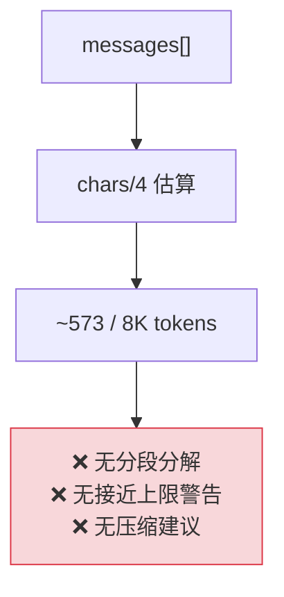
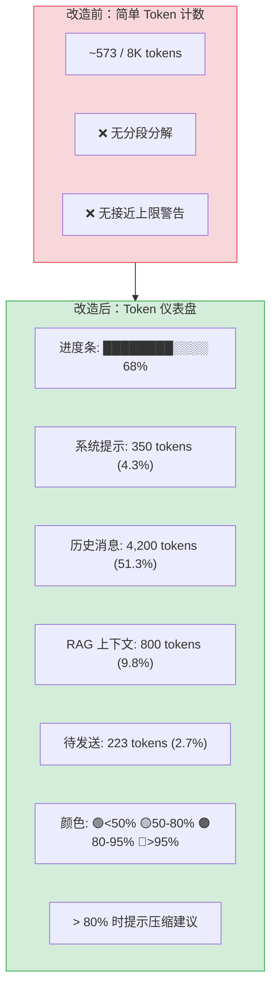

# YP-09-48: 聊天窗口 Token 使用量可视化 — 上下文消耗实时仪表盘

> 需求编号：YP-09-48 · 优先级：P2 · 人天：0.5d · 状态：需求已编写

## 背景

YiPet 当前在 `RequestStatusButton` 中显示简单的 Token 估算（`~N tokens / 8K`），但未展示 Token 消耗的详细分解。长对话中用户不了解 Token 预算的分配情况——系统提示词、历史消息、RAG 上下文、当前输入各占多少。当 Token 接近模型上下文上限时（如 qwen3:4b 的 8K），早期消息被 LLM 自动截断，AI 回答质量骤降，用户无法感知。

问题：

| # | 问题 | 影响 | 严重程度 |
|---|------|------|----------|
| 1 | Token 消耗不可见 | 用户不知道何时接近上下文上限 | 高 |
| 2 | Token 分配不透明 | 用户不知道系统提示词/RAG/历史各占多少 | 中 |
| 3 | 无接近上限警告 | AI 回答质量骤降时用户毫无准备 | 高 |
| 4 | Token 估算不准确（chars/4） | 中文 Token 估算偏差大 | 中 |
| 5 | 无上下文压缩建议 | 用户不知道如何降低 Token 消耗 | 中 |

**目标**：实现 Token 使用量的可视化仪表盘——分段展示系统提示词、历史消息、RAG 上下文、待发送输入的 Token 分布。接近上限时发出颜色警告（绿→黄→橙→红），并提供上下文压缩建议。

---

## 现状分析

### 当前状态

```
YiPet/src/chat/components/RequestStatusButton.vue
  └── 显示 "~573 / 8K tokens" (chars/4 估算)
  └── Tooltip 分解输入/输出 token
  └── 无分段可视化
  └── 无接近上限警告
```

### 文件清单

| 文件 | 当前状态 | 九月改动 |
|------|----------|----------|
| `src/chat/components/RequestStatusButton.vue` | 基础 Token 估算 | 改为分段可视化仪表盘 |
| `src/chat/components/TokenUsageBar.vue` | 不存在 | 新增：Token 仪表盘组件 |
| `src/shared/token-estimator.ts` | 不存在 | 新增：Token 估算工具 |

### 当前数据流



### 根因矩阵

| 问题 | 根因 | 影响范围 |
|------|------|----------|
| Token 消耗不可见 | 仅显示总数，无分段 | 用户无法优化 |
| 无接近上限警告 | 无阈值检测 | AI 质量下降时无感知 |
| 估算不准确 | chars/4 对中文偏差大 | 中文会话预算失真 |

---

## 设计决策

### 决策 1：Token 估算算法 — chars/4 vs tiktoken vs cl100k_base

| 选项 | 准确性 | 性能 | 依赖 | 中文支持 |
|------|--------|------|------|----------|
| chars/4（当前） | 低（中文 1 字符 ≈ 1-2 token） | 高 | 无 | 偏差大 |
| `tiktoken` (OpenAI) | 高 | 中 | ~200KB WASM | 支持 |
| `cl100k_base` (JS 移植) | 中 | 高 | ~50KB JS | 部分支持 |
| 加权估算（英文 chars/4, 中文 chars/1.5） | 中 | 高 | 无 | 改善 |

**选择：加权估算（英文 chars/4, 中文 chars/1.5）**。`tiktoken` 依赖 200KB WASM，对 Chrome 扩展来说包体积过大。加权估算通过检测字符类型改进中文估算：中文字符 /1.5，英文字符 /4，混合文本按比例加权。虽不如 tiktoken 精确，但零依赖且性能好。

### 决策 2：仪表盘位置 — 独立面板 vs 工具栏内嵌 vs Tooltip 展开

| 选项 | 可见性 | 空间占用 | 实现 |
|------|--------|----------|------|
| 独立面板（侧边栏点击展开） | 中 | 低 | 中 |
| 工具栏内嵌（常驻进度条） | 高 | 中 | 低 |
| Tooltip 展开（悬停显示详情） | 低 | 低 | 低 |

**选择：工具栏内嵌进度条 + Tooltip 展开详情**。工具栏中常驻一个紧凑的进度条（与现有 `RequestStatusButton` 风格一致），悬停时 Tooltip 显示分段分解。不占用额外空间，信息层次分明——概览 + 详情。

### 决策 3：接近上限警告阈值 — 3 级 vs 4 级

| 选项 | 颜色 | 触发条件 | 建议 |
|------|------|----------|------|
| 3 级：绿(<60%) / 黄(60-85%) / 红(>85%) | 3 | 简洁 | 红时提示 |
| 4 级：绿(<50%) / 黄(50-80%) / 橙(80-95%) / 红(>95%) | 4 | 精细 | 橙时提示压缩 |

**选择：4 级颜色编码**。在 80-95% 的橙色区间提前警告用户，给用户时间采取行动（清理历史、压缩上下文）。3 级的 85% 红线来得太晚，用户可能无法及时反应。

### 设计决策记录

| 决策 | 选项 A | 选项 B | 选项 C | 选择 | 理由 |
|------|--------|--------|--------|------|------|
| Token 估算 | chars/4 | tiktoken | 加权估算 | **加权估算** | 零依赖 + 中文改善 |
| 仪表盘位置 | 独立面板 | 工具栏内嵌 | Tooltip | **工具栏+Tooltip** | 信息层次分明 |
| 警告阈值 | 3 级 | 4 级 | — | **4 级** | 提前预警 |

---

## 目标架构

### 改造前后对比



### Token 仪表盘 UI

```
┌─ Token 用量 ──────────────────────────────────────────┐
│ ████████████████████████░░░░░░░░░░  68% (5,573 / 8,192)│
│                                                        │
│ 🟢 系统提示:     350 tokens  (4.3%)                   │
│ 🟡 历史消息:    4,200 tokens (51.3%)  [12 条消息]      │
│ 🟠 RAG 上下文:   800 tokens  (9.8%)                    │
│ ⚪ 待发送:       223 tokens  (2.7%)                     │
│ ─────────────────────────────────────────              │
│ 🟠 接近上下文上限 (68%)——建议:                          │
│    · 开启上下文压缩以释放 ~2,000 tokens                 │
│    · 或减少 RAG 检索范围                               │
│    · 或清理不需要的历史消息                             │
└────────────────────────────────────────────────────────┘
```

### 架构指标

| 指标 | 改造前 | 改造后 | 改进 |
|------|--------|--------|------|
| Token 分段分解 | 无 | 4 段（系统/历史/RAG/输入） | 新增 |
| 接近上限警告 | 无 | 4 级颜色 + 建议 | 新增 |
| Token 估算准确性（中文） | chars/4（偏差大） | 加权估算（改善） | 准确度提升 |
| 上下文压缩建议 | 无 | > 80% 时自动提示 | 新增 |

---

## 具体改动

### 1. Token 估算器

```typescript
// YiPet/src/shared/token-estimator.ts

interface TokenBreakdown {
  system: number;        // 系统提示词
  history: number;       // 历史消息
  ragContext: number;    // RAG 检索上下文
  pendingInput: number;  // 待发送输入
  total: number;         // 总计
  limit: number;         // 模型上下文上限
}

/**
 * 加权 Token 估算——改进中文准确性。
 *   - 中文字符: /1.5
 *   - 英文字符: /4
 *   - 数字/符号: /4
 *   - 每段有 4 token 的消息开销
 */
function estimateTokens(text: string): number {
  if (!text) return 0;

  let tokens = 0;
  for (const char of text) {
    if (/[\u4e00-\u9fff\u3400-\u4dbf]/.test(char)) {
      tokens += 1 / 1.5;  // 中文字符
    } else if (/[a-zA-Z]/.test(char)) {
      tokens += 1 / 4;    // 英文字母
    } else if (/\s/.test(char)) {
      tokens += 1 / 4;    // 空格
    } else {
      tokens += 1 / 4;    // 数字/符号/其他
    }
  }

  return Math.ceil(tokens) + 4;  // +4 消息开销
}

function calculateBreakdown(
  messages: ChatMessage[],
  systemPrompt: string,
  ragContext: string,
  pendingInput: string,
  modelLimit: number
): TokenBreakdown {
  const systemTokens = estimateTokens(systemPrompt);
  const historyTokens = messages.reduce((sum, m) => sum + estimateTokens(m.content), 0);
  const ragTokens = estimateTokens(ragContext);
  const inputTokens = estimateTokens(pendingInput);

  return {
    system: systemTokens,
    history: historyTokens,
    ragContext: ragTokens,
    pendingInput: inputTokens,
    total: systemTokens + historyTokens + ragTokens + inputTokens,
    limit: modelLimit,
  };
}

function getUsageLevel(percent: number): 'low' | 'medium' | 'high' | 'critical' {
  if (percent < 50) return 'low';
  if (percent < 80) return 'medium';
  if (percent < 95) return 'high';
  return 'critical';
}

function getUsageColor(level: ReturnType<typeof getUsageLevel>): string {
  switch (level) {
    case 'low': return '#22c55e';
    case 'medium': return '#f59e0b';
    case 'high': return '#f97316';
    case 'critical': return '#ef4444';
  }
}
```

### 2. TokenUsageBar 组件

```vue
<!-- YiPet/src/chat/components/TokenUsageBar.vue 结构 -->

<template>
  <el-tooltip placement="top" :show-after="300">
    <!-- 紧凑进度条 -->
    <template #content>
      <div class="token-usage-tooltip">
        <div class="token-header">
          Token 用量: {{ breakdown.total }} / {{ breakdown.limit }}
          ({{ usagePercent }}%)
        </div>
        <div class="token-bar">
          <div class="token-segment system"
               :style="{ width: systemPercent + '%' }" />
          <div class="token-segment history"
               :style="{ width: historyPercent + '%' }" />
          <div class="token-segment rag"
               :style="{ width: ragPercent + '%' }" />
          <div class="token-segment input"
               :style="{ width: inputPercent + '%' }" />
        </div>
        <div class="token-breakdown">
          <div>🟢 系统提示: {{ breakdown.system }} tokens ({{ systemPercent }}%)</div>
          <div>🟡 历史消息: {{ breakdown.history }} tokens ({{ historyPercent }}%)</div>
          <div>🟠 RAG 上下文: {{ breakdown.ragContext }} tokens ({{ ragPercent }}%)</div>
          <div>⚪ 待发送: {{ breakdown.pendingInput }} tokens ({{ inputPercent }}%)</div>
        </div>
        <div v-if="usageLevel === 'high' || usageLevel === 'critical'" class="token-warning">
          ⚠️ 接近上下文上限——建议开启上下文压缩或清理历史消息
        </div>
      </div>
    </template>

    <!-- 小型进度条（工具栏常驻） -->
    <div class="token-usage-compact" :style="{ color: usageColor }">
      <div class="token-bar-mini">
        <div class="token-bar-fill"
             :style="{ width: usagePercent + '%', background: usageColor }" />
      </div>
      <span class="token-text">{{ breakdown.total }} / {{ breakdown.limit }}</span>
    </div>
  </el-tooltip>
</template>
```

### 3. 涉及文件清单

```
YiPet/src/shared/
├── token-estimator.ts                # 新增: Token 估算工具（加权算法）

YiPet/src/chat/components/
├── TokenUsageBar.vue                 # 新增: Token 仪表盘组件
├── RequestStatusButton.vue           # 修改: 替换简单计数为 TokenUsageBar
```

---

## 实施步骤

| 步骤 | 内容 | 涉及文件 | 验证方式 | 人天 |
|------|------|---------|---------|------|
| 1 | 实现加权 Token 估算器 | `token-estimator.ts` | 测试中英文混合文本估算 | 0.10 |
| 2 | 实现 TokenUsageBar 组件 | `TokenUsageBar.vue` | 分段进度条 + Tooltip 正确显示 | 0.15 |
| 3 | 实现 4 级颜色编码 + 警告 | `TokenUsageBar.vue` | 补充消息 → 颜色从绿变黄变橙变红 | 0.10 |
| 4 | 替换 RequestStatusButton 中的简单计数 | `RequestStatusButton.vue` | Token 仪表盘显示在工具栏 | 0.10 |
| 5 | 上下文压缩建议 | `TokenUsageBar.vue` | > 80% 时显示压缩建议 | 0.05 |

**总计：0.5d**

---

## 性能分析

| 操作 | 耗时 | 说明 |
|------|------|------|
| Token 估算（500 条消息） | < 5ms | 逐字符遍历 |
| Token 估算（中文 1000 字） | < 1ms | 正则检测中文字符 |
| 仪表盘渲染 | < 5ms | 进度条 + Tooltip DOM |
| 仪表盘更新（流式输出时） | throttle 500ms | 避免逐 token 更新 |

---

## 测试规格

### Requirement: Token 估算

#### Scenario: 纯英文估算
- **Given** 文本为 "Hello, how are you?"（20 字符）
- **When** 调用 `estimateTokens`
- **Then** 返回约 9 tokens（20/4 + 4）

#### Scenario: 纯中文估算
- **Given** 文本为 "你好，今天怎么样？"（9 字符）
- **When** 调用 `estimateTokens`
- **Then** 返回约 10 tokens（9/1.5 + 4）

### Requirement: 仪表盘显示

#### Scenario: 分段进度条
- **Given** 系统提示 350t, 历史 4200t, RAG 800t, 输入 223t, 总 5573t, 上限 8192t
- **When** 渲染仪表盘
- **Then** 进度条显示 4 段，颜色分别为系统/历史/RAG/输入

#### Scenario: 接近上限警告
- **Given** Token 使用率 85%（high 级别）
- **When** 渲染仪表盘
- **Then** 进度条橙色，显示"接近上下文上限"建议

#### Scenario: 超出上限警告
- **Given** Token 使用率 97%（critical 级别）
- **When** 渲染仪表盘
- **Then** 进度条红色，强调"超出上下文上限"

---

## 风险与缓解

| 风险 | 概率 | 影响 | 等级 | 缓解措施 | 应急预案 |
|------|------|------|------|----------|----------|
| 中文 Token 估算偏差大 | 中 | 低 | 低 | 加权算法改善，标注"~约" | 对比实际 API 返回的 usage 字段校准 |
| 仪表盘频繁更新导致卡顿 | 中 | 低 | 低 | throttle 500ms 更新 | 延长 throttle 至 1000ms |
| Token 上限值获取错误 | 低 | 中 | 低 | 从模型配置读取（DEFAULT_MODEL → limit 映射） | 默认 8192 tokens |

---

## 回滚策略

| 场景 | 回滚操作 | 影响范围 |
|------|----------|----------|
| Token 估算严重偏差 | 回退到 chars/4 简单估算 | 中文估算精度下降 |
| 仪表盘性能问题 | 移除 Tooltip 详情，仅保留进度条 | 分段分解不可见 |

---

## 设计决策记录

### D-01: 为什么选择加权估算而非 tiktoken？

`tiktoken` 是 OpenAI 的官方 Token 计算库，通过 WASM 提供准确的 BPE tokenizer。但 WASM 文件约 200KB（gzip 后 ~100KB），对 Chrome 扩展来说包体积过大。YiPet 的 Token 估算是为了用户感知预算（非精确计费），加权估算（中文字符 /1.5, 英文 /4）在准确性可接受的前提下零额外依赖。

### D-02: 为什么选择 4 级颜色编码？

用户对 Token 消耗的感知应该是渐进的——绿色时安心使用，黄色时注意，橙色时准备行动，红色时紧急处理。3 级编码（绿/黄/红）在黄色和红色之间的跨度太大（60% → 85%），橙色（80-95%）提供关键的预警区间。参考了交通信号灯和 Google Cloud 的 quota 面板设计。

### D-03: 为什么在 80% 时提示压缩建议而非 90%？

80% 是用户仍有操作空间的安全阈值——清理几条历史消息或开启上下文压缩即可降低 10-20%。90% 时用户可能已经没有足够 Token 发送新消息。提前在 80% 提示，给用户充足的反应时间。

---

## 可观测性

| 指标 | 采集方式 | 告警阈值 | 说明 |
|------|----------|----------|------|
| Token 使用率分布 | 会话结束时记录 | — | 了解用户 Token 使用模式 |
| high/critical 触发频率 | 颜色级别变更计数 | > 50% 的会话 | 默认上下文窗口可能太小 |

---

## 安全合规

| 检查项 | 要求 | 验证方法 |
|--------|------|----------|
| Token 估算不传输用户数据 | 估算在客户端完成，不发送到服务端 | 审查 `estimateTokens` 逻辑 |
| Token 数据不持久化 | 仪表盘数据仅在内存中，不写入 storage | 审查代码 |

---

## 代码审查检查清单

- [ ] Token 可视化：系统提示/历史消息/RAG 上下文/待发送 4 段分层展示
- [ ] 接近上限时橙色（80-95%）或红色（>95%）警告
- [ ] 颜色编码：绿(<50%)/黄(50-80%)/橙(80-95%)/红(>95%)
- [ ] 估算基于加权算法（中文 /1.5, 英文 /4）+ 4 token 消息开销
- [ ] 仪表盘 throttle 500ms 更新（避免流式输出时逐 token 更新）
- [ ] Tooltip 显示分段分解详情
- [ ] > 80% 时显示上下文压缩建议
- [ ] Token 上限从模型配置读取（非硬编码）
- [ ] `vue-tsc --noEmit` 通过
- [ ] `npm run build` 成功

---

## 回归问题预测

| # | 预测问题 | 原因 | 验证方法 |
|---|---------|------|---------|
| 1 | 加权 Token 估算在中英文混合文本中偏差累积——中文标点符号被当作英文处理 | 中文标点（`，。！？`）不在 Unicode 中文字符正则范围 `\u4e00-\u9fff` 内，被当作"其他"按 `/4` 计算，与中文标点实际 token 消耗（约 1 token）偏差大 | 输入 "你好，今天怎么样？"（含中文标点），对比 `estimateTokens` 结果与实际 API 返回的 `usage.prompt_tokens`，验证偏差 < 30% |
| 2 | 仪表盘 throttle 500ms 在流式输出时显示滞后 | 流式输出时 `messages[]` 数组持续增长，Token 仪表盘每 500ms 更新一次，用户可能在 500ms 窗口内看到实际 Token 数已超出但仪表盘仍显示旧值 | 在流式输出期间监控 Token 仪表盘的更新频率，验证 UI 显示的 Token 数与实际计算值之间的延迟 < 500ms |
| 3 | Token 上限值从模型配置映射错误——硬编码 fallback 到 8192 但实际模型支持更大上下文 | `modelLimit` 通过 `DEFAULT_MODEL → limit` 映射获取，但 `DEFAULT_MODEL` 可能被用户修改为其他模型（如 qwen3:8b 支持 32K），映射表未更新导致仪表盘显示错误的上下文上限 | 在 YiAi 切换模型为 `qwen3:8b`（32K 上下文），验证仪表盘上限是否正确显示 32768 |
| 4 | 分段颜色计算错误——系统提示词占比 4.3% 但在堆叠进度条中不可见 | 进度条使用 CSS `width` 百分比叠加，当某段占比 < 5% 时，`width` 小于 5px，段落在视觉上不可见——用户以为系统提示词未计入 | 在模型上下文为 8192 时，验证系统提示词段（~350 tokens, 4.3%）在进度条中是否可见（至少 2px 宽度） |
| 5 | 上下文压缩建议在 Token 消耗刚超过 80% 时立即弹出，但用户可能刚发送消息，压缩建议打断阅读 | `> 80%` 时 Tooltip 中显示压缩建议，但流式输出过程中 Token 可能短暂超过 80% 后在下一轮降低——建议频繁出现/消失导致闪烁 | 在流式输出过程中观察 Token 仪表盘的压缩建议是否稳定（不闪烁），建议仅在 Token 稳定超过 80% 后显示 |
| 6 | `TokenUsageBar` 组件的 Tooltip 在频繁更新时导致 Element Plus Tooltip 性能问题 | 每 500ms 更新一次 Tooltip 内容，`el-tooltip` 的 `content` 更新可能触发 Popper 重新计算位置，在流式输出时累积开销 | 在流式输出 60s 的过程中，监控 Performance 面板中 `el-tooltip` 相关的 Layout 和 Paint 事件，验证总开销 < 1% |

*PRD 来源: `projects/yipet/requirements/2026-09/48-需求-Token可视化仪表盘.md`*