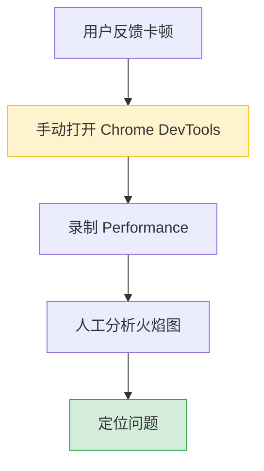
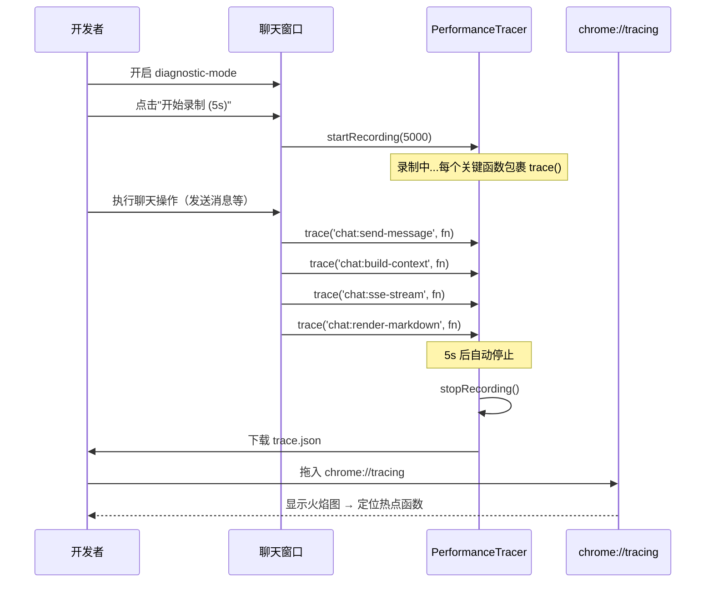

# YP-09-49: 聊天窗口性能火焰图生成 — Chrome DevTools Tracing 集成诊断

> 需求编号：YP-09-49 · 优先级：P2 · 人天：0.5d · 状态：需求已编写
> 依赖：YP-09-10（ContentScript 性能剖析与内存管理）

## 背景

YP-09-10 提供了运行时性能指标采集（Long Task 检测、内存采样、FPS 监控），但缺少深度的调用栈分析能力。当用户反馈"聊天窗口卡顿"时，开发者只能通过手动打开 Chrome DevTools Performance 面板录制来分析——这对非技术用户和远程调试场景不友好。

问题：

| # | 问题 | 影响 | 严重程度 |
|---|------|------|----------|
| 1 | 无法获取调用栈火焰图 | 卡顿问题难以定位到具体函数 | 高 |
| 2 | 手动 DevTools 录制繁琐 | 远程调试时需要用户操作 DevTools | 中 |
| 3 | 性能数据无法导出分析 | 无法与团队共享诊断数据 | 中 |
| 4 | 诊断模式开销影响结果准确性 | Observer Effect | 中 |
| 5 | 无自动化性能回归检测 | 新版本引入性能退化无法及时发现 | 高 |

**目标**：实现一键性能诊断——记录函数调用栈，生成符合 Chrome Tracing 格式的火焰图 JSON，用户可拖入 `chrome://tracing` 查看。诊断模式仅在开发者需要时启用，正常运行时零开销。

---

## 现状分析

### 当前状态

```
YiPet/src/shared/
  └── 无性能 Tracing 工具
  └── 性能诊断依赖手动打开 Chrome DevTools Performance 面板
  └── 无自动化性能回归检测

YP-09-10 提供的指标:
  ├── Long Task 检测 (> 50ms)
  ├── 内存采样 (chrome.storage.local 趋势)
  └── FPS 监控 (requestAnimationFrame)
```

### 文件清单

| 文件 | 当前状态 | 九月改动 |
|------|----------|----------|
| `src/shared/perf-tracing.ts` | 不存在 | 新增：性能 Tracing 工具 |
| `src/shared/perf-regression.ts` | 不存在 | 新增：性能回归检测 |
| `src/chat/components/PerfDiagnosticPanel.vue` | 不存在 | 新增：性能诊断面板 |
| `src/chat/stores/chat.ts` | 无诊断状态 | 新增诊断模式开关 |

### 当前数据流



### 根因矩阵

| 问题 | 根因 | 影响范围 |
|------|------|----------|
| 无法获取火焰图 | 无 Tracing API 集成 | 性能问题诊断 |
| 手动录制繁琐 | 无自动化 Tracing 工具 | 开发效率 |
| 无性能回归检测 | 无基线对比机制 | 版本质量 |

---

## 设计决策

### 决策 1：Tracing 实现方式 — `performance.mark/measure` vs `console.timeStamp` vs 自定义 Span

| 选项 | Chrome Tracing 兼容 | 精度 | 嵌套支持 | 开销 |
|------|---------------------|------|----------|------|
| `performance.mark(name)` + `measure` | 通过 User Timing API | 微秒 | 手动管理 | 极低 |
| `console.timeStamp(name)` | Chrome DevTools 可见 | 毫秒 | 无 | 极低 |
| 自定义 Span（记录开始/结束时间戳） | 手动导出 JSON | 微秒 | 栈管理 | 低 |

**选择：自定义 Span + 导出为 Chrome Tracing JSON**。`performance.mark/measure` 受浏览器 User Timing API 限制，最大条目数有限。`console.timeStamp` 仅在 DevTools 打开时可见。自定义 Span 将开始/结束事件记录到内存数组，录制结束后导出为标准 Chrome Tracing JSON 格式（`.trace.json`），用户拖入 `chrome://tracing` 查看。灵活性最高。

### 决策 2：诊断模式触发 — 始终启用 vs 功能开关 vs 开发者模式

| 选项 | 性能开销 | 易用性 | 安全性 |
|------|----------|--------|--------|
| 始终启用（所有用户） | 低-中（Span 记录开销） | 高 | 低 |
| 功能开关（YP-09-40）| 无（关闭时） | 中 | 中 |
| 仅开发者模式（Flag `diagnostic-mode`） | 无（关闭时） | 低 | 高 |

**选择：功能开关（`diagnostic-mode` flag，默认关闭）**。Tracing 即使开销低（每条 Span < 1us），在正常运行时也应完全禁用（零开销原则）。通过 YP-09-40 的特性开关框架控制，仅开发者和受邀测试用户可开启。开启后录制 5-30s，自动导出 trace.json。

### 决策 3：性能回归检测 — 手动对比 vs 自动化 CI

| 选项 | 检测频率 | 误报率 | 实现 |
|------|----------|--------|------|
| 手动对比（开发者打开两个版本对比） | 按需 | 低 | 低 |
| 自动化 CI（每次构建运行性能测试） | 每次构建 | 中（CI 环境不稳定） | 高 |
| 本地基线 + 阈值检测 | 手动触发 | 低 | 中 |

**选择：本地基线 + 阈值检测**。在开发者本地建立性能基线（录制一次标准操作流程的 trace），后续录制自动对比基线——如果关键函数耗时增加 > 20%，发出警告。CI 自动化性能测试在 Chrome 扩展中很难实现（需要真实浏览器环境）。

### 设计决策记录

| 决策 | 选项 A | 选项 B | 选项 C | 选择 | 理由 |
|------|--------|--------|--------|------|------|
| Tracing 实现 | performance.mark | console.timeStamp | 自定义 Span | **自定义 Span** | 灵活性最高 |
| 诊断模式触发 | 始终启用 | 功能开关 | 开发者模式 | **功能开关** | 零开销原则 |
| 性能回归 | 手动对比 | CI 自动化 | 本地基线 | **本地基线** | CI 环境不现实 |

---

## 目标架构

### 改造前后对比

```mermaid
graph TD
  subgraph Before["改造前：手动 DevTools 录制"]
    B1["打开 Chrome DevTools"]
    B2["手动录制 Performance"]
    B3["人工分析火焰图"]
  end

  subgraph After["改造后：一键诊断 → 导出火焰图"]
    A1["开启 diagnostic-mode 开关"]
    A2["点击"开始录制"按钮"]
    A3["自动包裹关键函数 Span"]
    A4["录制结束 → 下载 trace.json"]
    A5["拖入 chrome://tracing → 查看火焰图"]
    A6["对比性能基线 → 回归警告"]
  end

  Before --> After

  style Before fill:#f8d7da,stroke:#dc3545
  style After fill:#d4edda,stroke:#28a745
```

### 诊断流程



### 关键函数 Span 包裹

| 函数 | Span 名称 | 预期耗时 | 告警阈值 |
|------|-----------|----------|----------|
| `sendMessage` | `chat:send-message` | < 50ms | > 100ms |
| `_buildContext` | `chat:build-context` | < 10ms | > 30ms |
| `_runStream` | `chat:sse-stream` | 1-10s | > 30s |
| `renderMarkdown` | `chat:render-markdown` | < 20ms | > 100ms |
| `loadKnowledgeTree` | `knowledge:scan` | 50-200ms | > 500ms |
| `sessionService.list` | `data:list-sessions` | < 100ms | > 300ms |

### 架构指标

| 指标 | 改造前 | 改造后 | 改进 |
|------|--------|--------|------|
| 火焰图获取 | 手动 DevTools 录制 | 一键录制 → 导出 JSON | 自动化 |
| 诊断启动耗时 | 打开 DevTools (~2s) | 点击按钮 (< 0.5s) | -75% |
| 性能回归检测 | 无 | 基线对比 + 阈值告警 | 新增 |
| Tracing 开销（关闭时） | N/A | 0（功能开关关闭） | 零开销 |

---

## 具体改动

### 1. PerformanceTracer 实现

```typescript
// YiPet/src/shared/perf-tracing.ts

interface TraceEvent {
  name: string;
  ph: 'B' | 'E';     // Begin / End
  ts: number;          // 微秒时间戳
  pid: number;
  tid: number;
  args?: Record<string, any>;
}

class PerformanceTracer {
  private _recording = false;
  private _startTime = 0;
  private _events: TraceEvent[] = [];
  private _baseline: TraceEvent[] | null = null;

  /** 开始录制——记录 durationMs 毫秒。 */
  startRecording(durationMs: number = 5000) {
    this._recording = true;
    this._startTime = performance.now();
    this._events = [];

    console.log(`[PerfTracer] 开始录制 ${durationMs}ms...`);

    // 自动停止
    setTimeout(() => this.stopRecording(), durationMs);
  }

  /** 停止录制——导出 trace.json。 */
  stopRecording(): TraceEvent[] {
    this._recording = false;
    console.log(`[PerfTracer] 录制完成，${this._events.length} 个事件`);

    // 下载 trace.json
    this._downloadTrace();

    // 对比基线
    if (this._baseline) {
      this._compareBaseline();
    }

    return this._events;
  }

  /** 手动 Span——包裹函数调用。 */
  async trace<T>(name: string, fn: () => T | Promise<T>): Promise<T> {
    if (!this._recording) return fn();

    const start = performance.now();
    this._addEvent(name, 'B', start);

    try {
      return await fn();
    } finally {
      const end = performance.now();
      this._addEvent(name, 'E', end);
    }
  }

  /** 同步版本——用于非异步函数。 */
  traceSync<T>(name: string, fn: () => T): T {
    if (!this._recording) return fn();

    const start = performance.now();
    this._addEvent(name, 'B', start);

    try {
      return fn();
    } finally {
      const end = performance.now();
      this._addEvent(name, 'E', end);
    }
  }

  /** 保存当前录制为性能基线。 */
  saveAsBaseline() {
    this._baseline = [...this._events];
    console.log('[PerfTracer] 基线已保存');
  }

  /** 加载性能基线。 */
  loadBaseline(events: TraceEvent[]) {
    this._baseline = events;
  }

  private _addEvent(name: string, ph: 'B' | 'E', ts: number) {
    this._events.push({
      name,
      ph,
      ts: (ts - this._startTime) * 1000,  // ms → us，相对于录制起始
      pid: 1,
      tid: 1,
    });
  }

  private _downloadTrace() {
    const trace = {
      traceEvents: this._events,
      displayTimeUnit: 'ns',
    };

    const blob = new Blob([JSON.stringify(trace)], { type: 'application/json' });
    const url = URL.createObjectURL(blob);
    const a = document.createElement('a');
    a.href = url;
    a.download = `yipet-trace-${Date.now()}.json`;
    a.click();
    URL.revokeObjectURL(url);
  }

  private _compareBaseline() {
    if (!this._baseline) return;

    const warnings: string[] = [];

    for (const baselineEvent of this._baseline) {
      if (baselineEvent.ph !== 'B') continue;

      // 查找匹配的当前事件
      const currentEvent = this._events.find(
        e => e.ph === 'B' && e.name === baselineEvent.name
      );
      if (!currentEvent) continue;

      // 查找对应的结束事件
      const baselineEnd = this._baseline.find(
        e => e.ph === 'E' && e.name === baselineEvent.name
      );
      const currentEnd = this._events.find(
        e => e.ph === 'E' && e.name === baselineEvent.name
      );
      if (!baselineEnd || !currentEnd) continue;

      const baselineDuration = baselineEnd.ts - baselineEvent.ts;
      const currentDuration = currentEnd.ts - currentEvent.ts;
      const increase = (currentDuration - baselineDuration) / baselineDuration * 100;

      if (increase > 20) {
        warnings.push(
          `⚠️ ${baselineEvent.name}: ${(baselineDuration/1000).toFixed(1)}ms → ${(currentDuration/1000).toFixed(1)}ms (+${increase.toFixed(0)}%)`
        );
      }
    }

    if (warnings.length > 0) {
      console.warn('[PerfTracer] 性能回归检测:\n' + warnings.join('\n'));
    }
  }
}

export const perfTracer = new PerformanceTracer();
```

### 2. 关键函数包裹示例

```typescript
// YiPet/src/chat/stores/chat.ts — 包裹关键函数

import { perfTracer } from '@/shared/perf-tracing';

async function sendMessage(text: string) {
  return perfTracer.trace('chat:send-message', async () => {
    const context = await perfTracer.trace('chat:build-context', () =>
      _buildContext()
    );
    await perfTracer.trace('chat:sse-stream', () =>
      _runStream(context)
    );
    perfTracer.traceSync('chat:render-markdown', () =>
      _renderLastMessage()
    );
  });
}

async function loadKnowledgeTree() {
  return perfTracer.trace('knowledge:scan', async () => {
    const tree = await api.knowledge.scan();
    return tree;
  });
}
```

### 3. 涉及文件清单

```
YiPet/src/shared/
├── perf-tracing.ts                   # 新增: PerformanceTracer + 基线对比
├── perf-regression.ts                # 新增: 性能回归检测（基线保存/加载）

YiPet/src/chat/
├── components/PerfDiagnosticPanel.vue# 新增: 性能诊断面板 UI
├── stores/chat.ts                    # 修改: 关键函数包裹 trace()
└── types.ts                          # 修改: +diagnosticMode 状态

YiPet/src/shared/
├── feature-flags.ts                  # 修改: +diagnostic-mode flag
```

---

## 实施步骤

| 步骤 | 内容 | 涉及文件 | 验证方式 | 人天 |
|------|------|---------|---------|------|
| 1 | 实现 `PerformanceTracer` 类 | `perf-tracing.ts` | 录制 5s → 下载 trace.json → 拖入 chrome://tracing | 0.15 |
| 2 | 包裹关键函数 Span | `stores/chat.ts` | 录制时 trace 事件正确记录 | 0.10 |
| 3 | 实现性能诊断面板 UI | `PerfDiagnosticPanel.vue` | 点击录制 → 进度条 → 下载 | 0.10 |
| 4 | 实现性能基线对比 | `perf-tracing.ts` | 录制 → 对比基线 → 回归警告 | 0.10 |
| 5 | 添加 `diagnostic-mode` 功能开关 | `feature-flags.ts` | 开关关闭时 trace() 零开销 | 0.05 |

**总计：0.5d**

---

## 性能分析

| 操作 | 耗时 | 说明 |
|------|------|------|
| trace() 调用（关闭时） | < 0.001ms | `if (!this._recording) return fn()` 快速路径 |
| trace() 调用（开启时） | < 0.01ms | 记录开始/结束事件 |
| 录制 5s（1000 个 Span） | ~10ms 总开销 | 仅事件记录，不影响正常功能 |
| trace.json 导出 (1000 事件) | < 20ms | `JSON.stringify` + `Blob` |
| 基线对比 (1000 事件) | < 5ms | 遍历匹配 |

### 容量规划

| 录制时长 | Span 数量 | trace.json 大小 | 内存占用 |
|----------|----------|----------------|----------|
| 5s | ~500 | ~50KB | < 1MB |
| 15s | ~1500 | ~150KB | < 2MB |
| 30s | ~3000 | ~300KB | < 5MB |
| 30s 上限 | 自动停止 | — | — |

---

## 测试规格

### Requirement: Tracing 录制

#### Scenario: 录制 5s 操作
- **Given** `diagnostic-mode` 功能开关已开启
- **When** 用户点击"开始录制 (5s)"并执行聊天操作
- **Then** 5s 后自动停止，生成 trace.json 文件自动下载

#### Scenario: 关闭时零开销
- **Given** `diagnostic-mode` 功能开关已关闭
- **When** 正常使用聊天窗口
- **Then** `trace()` 调用不记录任何事件，性能无影响

### Requirement: 火焰图分析

#### Scenario: trace.json 可导入 chrome://tracing
- **Given** 已生成 trace.json
- **When** 拖入 chrome://tracing
- **Then** 显示函数调用栈火焰图，可缩放和钻取

### Requirement: 性能回归

#### Scenario: 性能基线对比
- **Given** 已保存基线（首次录制）
- **When** 再次录制相同操作
- **Then** 对比基线，超过 20% 增加时 console 输出警告

---

## 风险与缓解

| 风险 | 概率 | 影响 | 等级 | 缓解措施 | 应急预案 |
|------|------|------|------|----------|----------|
| 录制数据过大导致存储问题 | 中 | 低 | 低 | 限制录制时长 ≤ 30s，自动停止 | 截断旧事件 |
| 诊断模式下的性能开销影响结果准确性 | 中 | 低 | 低 | Span 记录仅 0.01ms，基本可忽略 | 对比开启/关闭诊断的指标差异 |
| trace.json 格式不兼容 | 低 | 中 | 低 | 严格遵循 Chrome Tracing 格式规范 | 验证格式 → 修复 → 重新导出 |

---

## 回滚策略

| 场景 | 回滚操作 | 影响范围 |
|------|----------|----------|
| Tracing 导致性能问题 | 关闭 `diagnostic-mode` flag | 所有用户 Tracing 功能不可用 |
| 基线对比误报 | 移除基线对比功能 | 性能回归需手动检查 |

---

## 设计决策记录

### D-01: 为什么选择自定义 Span 而非 `performance.mark/measure`？

`performance.mark/measure` 受浏览器 User Timing API 的条目限制（Chrome 中约 10000 条），且不支持嵌套 Span 的自动栈管理。自定义 Span 直接记录到内存数组，录制结束后导出为标准 Chrome Tracing JSON 格式，无条目数限制（内存允许范围内），且支持嵌套 Span 和额外参数（args）。

### D-02: 为什么诊断模式默认关闭？

Tracing 即使开销极低（每条 Span < 0.01ms），在正常运行时也应完全禁用——这是性能诊断工具"零开销原则"。通过 YP-09-40 的特性开关框架控制，仅开发者和受邀测试用户可开启。

### D-03: 为什么基线对比阈值设为 20%？

20% 的性能退化是可感知的——用户可能注意到操作变慢。低于 10% 的变化通常是测量误差。20% 是一个平衡的阈值——不会过于敏感（频繁误报），也不会漏掉真正的性能退化。

---

## 可观测性

| 指标 | 采集方式 | 告警阈值 | 说明 |
|------|----------|----------|------|
| 诊断模式使用次数 | flag 开启计数 | — | 了解诊断使用频率 |
| 性能回归警告次数 | `_compareBaseline` warnings | > 0 | 需关注性能退化 |
| trace.json 文件大小 | 文件大小 | > 1MB | 录制时间过长 |

---

## 安全合规

| 检查项 | 要求 | 验证方法 |
|--------|------|----------|
| trace.json 不包含用户数据 | 仅记录函数名和时间戳，不记录参数值 | 审查 trace 事件内容 |
| 诊断模式默认关闭 | `diagnostic-mode` flag 默认为 false | 审查 feature-flags 默认值 |

---

## 代码审查检查清单

- [ ] 火焰图基于自定义 Span 生成 Chrome Tracing JSON 格式
- [ ] 诊断覆盖：关键函数包裹 trace()（sendMessage/buildContext/sseStream/renderMarkdown/loadKnowledgeTree）
- [ ] 一键导出诊断报告（trace.json）+ 自动下载
- [ ] 仅在 `diagnostic-mode` 开启时启用（减少生产开销）
- [ ] 关闭时 `trace()` 在 < 0.001ms 内返回（快速路径）
- [ ] 录制时长限制 ≤ 30s，自动停止
- [ ] 性能基线对比：超过 20% 增加时 console 输出警告
- [ ] trace.json 格式兼容 `chrome://tracing`
- [ ] `vue-tsc --noEmit` 通过
- [ ] `npm run build` 成功

---

## 回归问题预测

| # | 预测问题 | 原因 | 验证方法 |
|---|---------|------|---------|
| 1 | 录制数据过大导致内存溢出——3000 个 Span 事件的 `_events` 数组持续增长未截断 | `startRecording` 中未设置 `_events` 的容量上限，如果录制 30s 期间触发了 10000+ 个 Span（高频操作），`_downloadTrace` 中 `JSON.stringify(trace)` 可能阻塞 UI 线程数秒 | 录制 30s 期间持续高频发送消息，验证 `_events.length` 是否受限制，`JSON.stringify` 是否在 100ms 内完成 |
| 2 | 诊断模式性能开销影响结果准确性（Observer Effect） | 每次 `trace()` 调用记录 2 个事件（B + E），1000 次调用 = 2000 次 `_events.push`——在高频函数（如 `renderMarkdown`）中，Span 记录开销叠加后可能显著改变函数的实际耗时 | 对比同一操作在诊断模式开启/关闭时的 `performance.now()` 耗时，验证差异 < 5% |
| 3 | `trace.json` 格式不兼容 `chrome://tracing`——缺少 `cat` 和 `args` 字段 | Chrome Tracing 格式虽然 `ph`/`name`/`ts`/`pid`/`tid` 是核心字段，但 `chrome://tracing` 的某些视图（如 Flame Chart）依赖 `cat` 字段分组，缺失时火焰图显示为扁平列表 | 生成的 trace.json 拖入 `chrome://tracing`，验证火焰图是否正确显示嵌套调用栈（而非仅扁平事件列表） |
| 4 | 基线对比误报——环境差异被当作性能退化 | 基线录制时浏览器空闲（无其他标签页），对比录制时浏览器打开了 20 个标签页，CPU 负载不同导致所有函数耗时增加 > 20%，触发大量误报 | 在高中低三种 CPU 负载下录制并对比，验证基线对比是否考虑环境因素（如 CPU 基准校准） |
| 5 | 关键函数在代码重构后 Span 名称变更导致基线对比失效 | `trace('chat:send-message', fn)` 的 Span 名称硬编码为字符串，如果函数被重命名或重构，基线中的旧名称 `chat:send-message` 找不到匹配，性能退化被静默忽略 | 检查 `_compareBaseline` 中是否存在"基线中存在的 Span 在当前录制中找不到"的警告，确保不被静默忽略 |
| 6 | 录制时长限制 30s 内操作未完成导致 Span 未闭合 | `stopRecording` 中强制停止录制，但此时可能有正在执行的 `trace()` 调用——`finally` 块中的 `_addEvent(name, 'E', end)` 仍会执行，但 `_recording` 已为 false，End 事件不会被记录，导致 Start 事件无对应 End 事件 | 录制 5s 后，检查生成的 trace.json 中每个 Start 事件（`ph: 'B'`）是否都有对应的 End 事件（`ph: 'E'`），验证无未闭合的 Span |

*PRD 来源: `projects/yipet/requirements/2026-09/49-需求-性能火焰图诊断.md`*