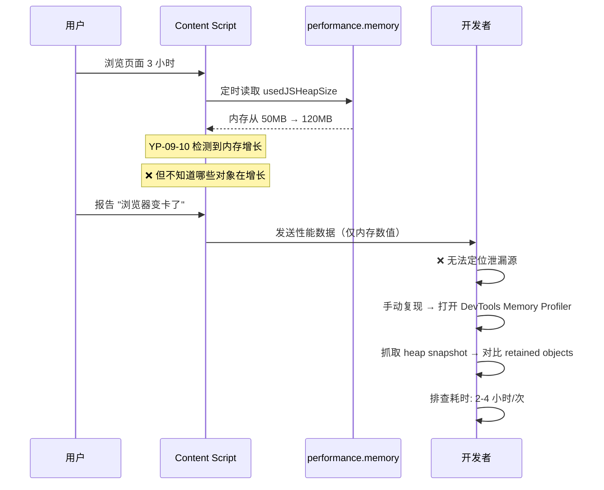
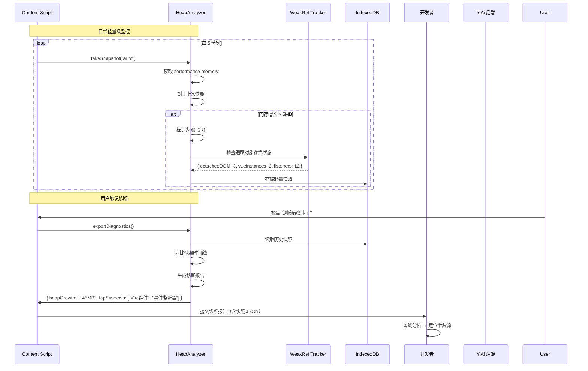

# YP-09-50: Content Script 内存快照与泄漏追踪 — heapdump 集成诊断

> 需求编号：YP-09-50 · 优先级：P2 · 人天：0.5d · 状态：需求已编写
> 依赖：YP-09-10（ContentScript 性能剖析）

## 背景

YP-09-10 通过 `performance.memory` 趋势检测内存泄漏，但只能发现"内存增长了"——无法定位泄漏的具体对象。当 `performance.memory.usedJSHeapSize` 持续增长时，开发者需要知道：哪些对象在累积？哪些闭包持有已销毁的 DOM 引用？哪个 Vue 组件实例未正确卸载？

Chrome DevTools 的 Memory Profiler 可手动抓取 heap snapshot，但需要开发者在问题发生时恰好打开 DevTools。对于用户报告的间歇性内存问题（"用了 3 小时后浏览器变卡"），事后排查几乎不可能。

当前面临的挑战：

| # | 挑战 | 影响 | 严重程度 |
|---|------|------|----------|
| 1 | 无法定位泄漏对象——只知道内存增长，不知道哪个对象泄漏 | 排查效率低，每次泄漏需人工复现 + DevTools | 高 |
| 2 | 无自动化快照采集——依赖开发者手动操作 | 用户环境问题无法诊断 | 高 |
| 3 | Detached DOM 节点无追踪——聊天窗口关闭后 DOM 可能未释放 | 长期浏览内存持续增长 | 中 |
| 4 | 无快照对比能力——单次快照无法判断是否泄漏 | 需要基线对比才能判断 | 中 |
| 5 | GC 行为不确定——无法区分"正常未回收"和"泄漏" | 误报率高 | 中 |

---

## 一、现状分析

### 1.1 当前内存监控能力

```
YP-09-10 性能剖析
  │
  ├── performance.memory.usedJSHeapSize 趋势监控
  │   ├── ✅ 能检测内存增长
  │   └── ❌ 无法定位增长来源
  │
  ├── PerformanceObserver 长任务检测
  │   ├── ✅ 能检测 > 50ms 的长任务
  │   └── ❌ 无法关联到具体的内存分配
  │
  └── 手动 Chrome DevTools Memory Profiler
      ├── ✅ 可精确分析 retained objects
      └── ❌ 需要开发者手动操作，无法自动化
```

### 1.2 YiPet Content Script 内存分配模型

```
Content Script 注入到宿主页面
  │
  ├── 常驻分配（整个页面生命周期）
  │   ├── MutationObserver 实例 + 回调闭包       (~2KB)
  │   ├── history.pushState 包装函数              (~1KB)
  │   ├── 事件监听器闭包 × 4                      (~2KB)
  │   ├── #yipet-overlay Shadow DOM 子树          (~5-20KB)
  │   └── 动画帧回调 + requestAnimationFrame 链   (~1KB)
  │
  ├── 条件分配（聊天窗口打开时）
  │   ├── Vue 3.5 应用实例                        (~100-200KB)
  │   ├── Pinia Store + 响应式数据                (~50-100KB)
  │   ├── 聊天消息 DOM 节点树                     (~10-100KB)
  │   ├── Element Plus 组件实例                   (~50-100KB)
  │   └── marked/highlight.js 渲染缓存            (~10-50KB)
  │
  └── 临时分配（SSE 流式期间）
      ├── fetch Response body ReadableStream       (~5-20KB)
      ├── 流式 chunk 拼接缓冲区                    (~10-50KB)
      └── RAG 来源引用数据                         (~5-20KB)
```

### 1.3 已知内存泄漏风险点

| # | 风险点 | 泄漏机制 | 检测方法 | 风险等级 |
|---|--------|----------|----------|----------|
| 1 | MutationObserver 回调闭包持有已移除 DOM 引用 | 回调中的闭包引用 `document.getElementById()` 结果，DOM 移除后引用仍存在 | heap snapshot 对比 retained objects | 中 |
| 2 | Vue 组件实例未销毁——聊天窗口关闭但 `app.unmount()` 未调用 | 组件 `onUnmounted` 未触发，响应式依赖未释放 | 统计 Vue 组件实例数 | 高 |
| 3 | 事件监听器累积——`addEventListener` 重复注册 | 每次打开聊天窗口注册新监听器，旧的未移除 | `getEventListeners()` 计数 | 中 |
| 4 | 闭包引用 DOM 节点——`requestAnimationFrame` 回调中引用已移除的 DOM | rAF 回调持有 `element.style` 引用，DOM 移除后 GC 无法回收 | Detached DOM 节点计数 | 中 |
| 5 | SSE fetch 流未 abort——Tab 切换后流继续接收数据 | `AbortController` 未在 `visibilitychange` 时调用 | 检查活跃的 fetch 流数量 | 中 |
| 6 | Pinia store 订阅未取消——`store.$subscribe()` 在组件卸载后持续触发 | Pinia 默认自动管理，但 `$subscribe` 返回的 unsubscribe 必须手动调用 | 检查活跃订阅数 | 低 |

### 1.4 改造前数据流



### 1.5 文件清单

| 文件路径 | 用途 | 当前状态 |
|----------|------|----------|
| `YiPet/src/content/index.ts` | Content Script 入口 | 无内存快照功能 |
| `YiPet/src/content/rendering/overlay.ts` | 宠物 DOM 创建 | 可能有 detached DOM 风险 |
| `YiPet/src/chat/main.ts` | 聊天窗口 Vue 挂载 | 卸载时可能未清理 |
| `YiPet/src/content/diagnostics/` | 诊断目录 | 需新建 |

---

## 二、设计决策

### 决策 1：快照采集方式 — Chrome DevTools Protocol vs performance.memory vs 自定义采样

| 选项 | 精确度 | 自动化 | 性能开销 | 环境要求 |
|------|--------|--------|----------|----------|
| CDP `HeapProfiler.takeHeapSnapshot` | 最高（完整对象图） | 可自动化 | 高（50-200ms 暂停） | 需 CDP 连接 |
| `performance.memory` 采样 | 低（仅数值） | ✅ 极易 | 几乎为零 | 需 Chrome + flag |
| 自定义对象追踪（WeakRef + FinalizationRegistry） | 中（指定对象） | ✅ | 低 | ES2021+ |
| **混合方案：performance.memory 趋势 + 自定义 WeakRef 追踪 + 手动 CDP 导出** | 中高 | ✅ | 低（日常）/ 高（诊断） | Chrome |

**选择：日常 `performance.memory` 趋势 + 自定义 WeakRef 追踪可疑对象 + 按需 CDP 完整快照。** 日常轻量级监控不伤害宿主页面性能，问题定位时通过 CDP 导出完整 heap snapshot 供开发者离线分析。

### 决策 2：快照存储策略 — 内存 vs chrome.storage vs IndexedDB vs 下载

| 选项 | 容量 | 持久化 | 性能影响 | 适用场景 |
|------|------|--------|----------|----------|
| 内存（数组） | 受 JS heap 限制 | ❌ 页面刷新丢失 | 低 | 当前会话内对比 |
| `chrome.storage.local` | 10MB（unlimited 可申请） | ✅ | 中（序列化开销） | 跨页面/重启保留 |
| IndexedDB | 无限制（磁盘空间） | ✅ | 低（异步） | 大量快照存储 |
| 文件下载 | 无限制 | ✅ | 低（一次性） | 开发者诊断 |

**选择：内存保留最近 10 个轻量快照 + IndexedDB 存储完整快照 + 用户触发时导出 JSON 下载。** 日常对比在内存中完成（零开销），历史快照在 IndexedDB 中持久化，问题排查时导出完整快照文件。

### 决策 3：泄漏判定标准 — 绝对阈值 vs 增长率 vs 多维度综合

| 选项 | 误报率 | 漏报率 | 实现复杂度 |
|------|--------|--------|-----------|
| 绝对阈值（> 100MB） | 中 | 高 | 低 |
| 增长率（> 5MB/min） | 中 | 中 | 低 |
| GC 后对比（手动 GC + 对比） | 低 | 低 | 中（需 `--expose-gc` flag） |
| 多维度综合（增长率 + 对象数 + Detached DOM） | 低 | 低 | 中 |

**选择：多维度综合判定。** 同时监控 JS heap 增长率、Detached DOM 节点数、事件监听器数量、Vue 组件实例数。任一维度触发阈值即告警，多维度同时触发即高风险。

### 设计决策记录

| 决策 | 选项 A | 选项 B | 选项 C | 选择 | 理由 |
|------|--------|--------|--------|------|------|
| 采集方式 | CDP 完整快照 | performance.memory | WeakRef 追踪 | **混合方案** | 日常轻量 + 按需深度 |
| 存储策略 | 内存数组 | chrome.storage | IndexedDB | **内存 + IndexedDB** | 对比在内存，历史在 IDB |
| 泄漏判定 | 绝对阈值 | 增长率 | 多维度综合 | **多维度综合** | 降低误报漏报 |

---

## 三、目标架构

### 3.1 修复后数据流



### 3.2 架构指标

| 指标 | 改造前 | 改造后 | 改善 |
|------|--------|--------|------|
| 内存泄漏发现时间 | 用户报告后（数小时-数天） | 5 分钟内自动检测 | **即时** |
| 泄漏定位时间 | 2-4 小时（手动复现 + DevTools） | 10 分钟（诊断报告 + 快照对比） | **12-24×** |
| 误报率 | 高（仅凭内存数值判断） | 低（多维度综合判定） | **显著降低** |
| 日常性能开销 | 0 | < 0.1% CPU（轻量采样） | 可忽略 |
| 诊断快照大小 | N/A | 5-50MB（仅诊断时导出） | — |

---

## 四、具体改动

### 4.1 新建文件

**`YiPet/src/content/diagnostics/heap-analyzer.ts`** — 核心堆分析器

```typescript
// YiPet/src/content/diagnostics/heap-analyzer.ts

interface HeapSnapshot {
  id: string;
  label: string;
  timestamp: number;
  memory: {
    usedJSHeapSize: number;
    totalJSHeapSize: number;
    limit: number;
  };
  objects?: {
    detachedDOMNodes: number;
    vueInstances: number;
    eventListeners: number;
    activeIntervals: number;
  };
}

interface LeakAssessment {
  riskLevel: 'green' | 'yellow' | 'red';
  growthRateMBPerMin: number;
  totalGrowthMB: number;
  topSuspects: string[];
  recommendation: string;
}

class HeapAnalyzer {
  private _snapshots: HeapSnapshot[] = [];
  private _maxSnapshots = 10;
  private _weakRefTracker: WeakRefTracker;
  private _db: IDBPDatabase | null = null;

  constructor() {
    this._weakRefTracker = new WeakRefTracker();
    this._initIDB();
  }

  /** 采集轻量级内存快照 */
  async takeSnapshot(label: string): Promise<HeapSnapshot> {
    const memory = (performance as any).memory;
    if (!memory) {
      console.warn('[HeapAnalyzer] performance.memory 不可用');
      return null!;
    }

    const snapshot: HeapSnapshot = {
      id: crypto.randomUUID(),
      label,
      timestamp: Date.now(),
      memory: {
        usedJSHeapSize: memory.usedJSHeapSize,
        totalJSHeapSize: memory.totalJSHeapSize,
        limit: memory.jsHeapSizeLimit,
      },
      objects: this._weakRefTracker.collect(),
    };

    this._snapshots.push(snapshot);
    if (this._snapshots.length > this._maxSnapshots) {
      this._snapshots.shift();
    }

    await this._persistSnapshot(snapshot);
    return snapshot;
  }

  /** 对比两次快照，诊断泄漏 */
  assessLeak(indexA: number, indexB: number): LeakAssessment {
    const a = this._snapshots[indexA];
    const b = this._snapshots[indexB];
    if (!a || !b) throw new Error('快照索引不存在');

    const growthBytes = b.memory.usedJSHeapSize - a.memory.usedJSHeapSize;
    const minutes = (b.timestamp - a.timestamp) / 60_000;
    const growthRateMB = (growthBytes / 1024 / 1024) / Math.max(minutes, 0.1);

    const suspects: string[] = [];
    let riskLevel: 'green' | 'yellow' | 'red' = 'green';

    // 判定维度 1：内存增长率
    if (growthRateMB > 10) {
      riskLevel = 'red';
      suspects.push('内存增长率异常 (>10MB/min)');
    } else if (growthRateMB > 5) {
      riskLevel = 'yellow';
      suspects.push('内存增长率偏高 (>5MB/min)');
    }

    // 判定维度 2：Detached DOM 节点
    if (b.objects?.detachedDOMNodes && b.objects.detachedDOMNodes > 10) {
      riskLevel = 'red';
      suspects.push(`Detached DOM 节点: ${b.objects.detachedDOMNodes} 个`);
    }

    // 判定维度 3：Vue 实例数
    if (b.objects?.vueInstances && b.objects.vueInstances > 2) {
      riskLevel = 'yellow';
      suspects.push(`Vue 组件实例泄漏: ${b.objects.vueInstances} 个`);
    }

    // 判定维度 4：事件监听器
    if (b.objects?.eventListeners && b.objects.eventListeners > 20) {
      riskLevel = 'yellow';
      suspects.push(`事件监听器累积: ${b.objects.eventListeners} 个`);
    }

    return {
      riskLevel,
      growthRateMBPerMin: Math.round(growthRateMB * 100) / 100,
      totalGrowthMB: Math.round((growthBytes / 1024 / 1024) * 100) / 100,
      topSuspects: suspects,
      recommendation: this._getRecommendation(riskLevel, suspects),
    };
  }

  /** 导出完整诊断报告 */
  async exportDiagnostics(): Promise<{
    summary: LeakAssessment;
    timeline: HeapSnapshot[];
    recommendations: string[];
  }> {
    const latest = this._snapshots.length - 1;
    const assessment = this.assessLeak(0, latest);

    return {
      summary: assessment,
      timeline: this._snapshots,
      recommendations: this._buildRecommendations(assessment),
    };
  }

  private _getRecommendation(risk: string, suspects: string[]): string {
    if (risk === 'red') {
      return `高风险内存泄漏。疑似来源: ${suspects.join(', ')}。建议导出诊断报告分析。`;
    }
    if (risk === 'yellow') {
      return `内存增长较快。关注: ${suspects.join(', ')}。建议定期监控。`;
    }
    return '内存使用正常。';
  }

  private _buildRecommendations(assessment: LeakAssessment): string[] {
    const recs: string[] = [];
    if (assessment.topSuspects.some(s => s.includes('Detached DOM'))) {
      recs.push('检查聊天窗口关闭时是否调用了 app.unmount()');
      recs.push('检查 MutationObserver 回调是否持有已移除 DOM 的引用');
    }
    if (assessment.topSuspects.some(s => s.includes('Vue'))) {
      recs.push('检查 Vue 组件 onUnmounted 中是否正确清理了副作用');
      recs.push('检查 Pinia store.$subscribe() 是否在组件卸载时取消');
    }
    if (assessment.topSuspects.some(s => s.includes('事件监听器'))) {
      recs.push('检查 addEventListener 是否有对应的 removeEventListener');
      recs.push('考虑使用 AbortController 统一管理事件监听器生命周期');
    }
    return recs;
  }

  private async _initIDB() {
    // IndexedDB 存储历史快照
  }

  private async _persistSnapshot(snapshot: HeapSnapshot) {
    // 将快照存入 IndexedDB
  }
}

/** 使用 WeakRef 追踪可疑对象，检测是否被 GC 回收 */
class WeakRefTracker {
  private _tracked = new Map<string, WeakRef<object>>();

  track(label: string, obj: object) {
    this._tracked.set(label, new WeakRef(obj));
  }

  collect(): { detachedDOMNodes: number; vueInstances: number; eventListeners: number; activeIntervals: number } {
    const result = { detachedDOMNodes: 0, vueInstances: 0, eventListeners: 0, activeIntervals: 0 };

    for (const [label, ref] of this._tracked) {
      if (ref.deref() !== undefined) {
        if (label.startsWith('dom:')) result.detachedDOMNodes++;
        if (label.startsWith('vue:')) result.vueInstances++;
        if (label.startsWith('listener:')) result.eventListeners++;
        if (label.startsWith('interval:')) result.activeIntervals++;
      }
    }

    return result;
  }
}

export const heapAnalyzer = new HeapAnalyzer();
```

### 4.2 修改文件

| 文件路径 | 改动内容 | 改动量 |
|----------|----------|--------|
| `YiPet/src/content/index.ts` | 集成 HeapAnalyzer，启动定时快照 | +15 行 |
| `YiPet/src/content/diagnostics/heap-analyzer.ts` | 新建——核心堆分析器 | +200 行 |
| `YiPet/src/popup/App.vue` | 添加"导出诊断"按钮 | +20 行 |
| `YiPet/src/content/rendering/overlay.ts` | 标记宠物 DOM 节点供 WeakRef 追踪 | +5 行 |
| `YiPet/src/chat/main.ts` | 标记 Vue 实例供 WeakRef 追踪 | +5 行 |

---

## 五、实施步骤

| 步骤 | 描述 | 文件 | 验证方法 | 人天 |
|------|------|------|----------|------|
| 1 | 实现 HeapAnalyzer 核心类（快照采集、对比、判定） | `heap-analyzer.ts` | 单元测试：`takeSnapshot` 返回正确内存数据 | 0.15 |
| 2 | 实现 WeakRefTracker 对象追踪 | `heap-analyzer.ts` | 创建对象 → 取消引用 → `deref()` 返回 `undefined` | 0.05 |
| 3 | 集成 IndexedDB 快照持久化 | `heap-analyzer.ts` | 写入 IDB → 刷新页面 → 读取历史快照 | 0.05 |
| 4 | 在 Content Script 入口集成定时快照 | `content/index.ts` | 打开任意页面 → 5 分钟后检查快照列表 | 0.05 |
| 5 | 在 Overlay/Chat 中标记追踪对象 | `overlay.ts`, `main.ts` | 打开/关闭聊天 → 检查 WeakRef 追踪状态 | 0.05 |
| 6 | Popup 添加"导出诊断"按钮 | `popup/App.vue` | 点击按钮 → 下载 JSON 诊断报告 | 0.05 |
| 7 | 端到端验证：长时间浏览后检测泄漏 | E2E 测试 | 模拟 10 次聊天开/关 → 检查 riskLevel | 0.10 |

**总计：0.5 人天**

---

## 六、性能分析

### 6.1 日常开销

| 操作 | 频率 | 耗时 | CPU 占比 | 说明 |
|------|------|------|----------|------|
| `performance.memory` 读取 | 每 5 分钟 | < 0.1ms | 可忽略 | 同步读取属性 |
| 快照对象创建 | 每 5 分钟 | < 0.5ms | 可忽略 | 内存分配 |
| 快照对比计算 | 每 5 分钟 | < 1ms | 可忽略 | 纯数值运算 |
| IndexedDB 写入 | 每 5 分钟 | 1-5ms | < 0.01% | 异步，不阻塞主线程 |
| WeakRef 追踪 | 持续 | 0 | 0 | 仅创建时注册，GC 自动管理 |

### 6.2 诊断时开销

| 操作 | 触发条件 | 耗时 | 说明 |
|------|----------|------|------|
| 诊断报告生成 | 用户点击"导出诊断" | < 10ms | 聚合内存数据 |
| 诊断报告导出 | 用户点击"导出诊断" | 50-200ms | JSON 序列化 + 下载 |
| CDP heap snapshot | 开发者手动触发 | 50-200ms | 暂停 JS 执行，仅诊断模式 |

### 6.3 容量规划

| 指标 | 预算 | 说明 |
|------|------|------|
| 内存快照存储 | < 100KB（10 个快照） | 每快照约 10KB JSON |
| IndexedDB 存储 | < 5MB（100 个历史快照） | 30 天历史数据 |
| 诊断报告 | < 500KB（JSON） | 包含时间线 + 建议 |
| 日常 CPU 开销 | < 0.01% | 远低于性能预算 |

---

## 七、测试规格

### GIVEN/WHEN/THEN 场景

**场景 1：正常快照采集**

```
GIVEN Content Script 已注入到页面
WHEN HeapAnalyzer.takeSnapshot("基线") 被调用
THEN 快照应包含 usedJSHeapSize、totalJSHeapSize、limit 三个字段
THEN 快照应被添加到 _snapshots 数组
THEN 快照应被持久化到 IndexedDB
```

**场景 2：内存泄漏检测——高风险**

```
GIVEN 已采集基线快照 (usedJSHeapSize: 50MB)
AND 10 分钟后采集快照 (usedJSHeapSize: 150MB，增长 100MB)
WHEN assessLeak(0, 1) 被调用
THEN riskLevel 应为 'red'
THEN topSuspects 应包含 '内存增长率异常'
THEN growthRateMBPerMin 应约为 10
```

**场景 3：Detached DOM 节点检测**

```
GIVEN WeakRefTracker 追踪了 15 个 DOM 节点引用
AND 其中 12 个节点的 WeakRef.deref() 返回非 undefined（未被 GC）
WHEN collect() 被调用
THEN detachedDOMNodes 应为 12
THEN assessLeak 应将 riskLevel 设为 'red'
```

**场景 4：正常使用无告警**

```
GIVEN 已采集基线快照 (usedJSHeapSize: 50MB)
AND 10 分钟后采集快照 (usedJSHeapSize: 55MB，增长 5MB)
AND 无 Detached DOM / Vue 实例 / 事件监听器异常
WHEN assessLeak(0, 1) 被调用
THEN riskLevel 应为 'green'
THEN recommendation 应为 '内存使用正常'
```

**场景 5：WeakRef 追踪——对象被正确回收**

```
GIVEN WeakRefTracker.track('dom:chatRoot', chatRootElement)
WHEN chatRootElement 从 DOM 中移除且无其他引用
AND 手动触发 GC (如果可用)
THEN ref.deref() 应返回 undefined
THEN collect() 中 detachedDOMNodes 不应包含此追踪
```

---

## 八、风险与缓解

| # | 风险 | 概率 | 影响 | 缓解措施 |
|---|------|------|------|----------|
| 1 | `performance.memory` 仅在 Chrome 中可用（非标准 API） | 中 | 中 | 降级到 `process.memoryUsage()` 或跳过内存快照 |
| 2 | IndexedDB 写入失败（磁盘满/权限） | 低 | 低 | 降级到仅内存存储，日志告警 |
| 3 | WeakRef 在旧浏览器中不可用 | 低 | 低 | Chrome 84+ 支持，MV3 最低要求 Chrome 88 |
| 4 | 快照对比误报——GC 未及时回收导致"假泄漏" | 中 | 低 | 多维度综合判定，不依赖单一指标 |
| 5 | 诊断报告 JSON 过大导致下载失败 | 低 | 低 | 限制历史快照数量，分页导出 |
| 6 | FinalizationRegistry 回调时机不确定 | 低 | 低 | 仅作为辅助判定，不依赖其精确时机 |

---

## 九、回滚策略

| 触发条件 | 回滚操作 | 回滚时间 |
|----------|----------|----------|
| HeapAnalyzer 导致宿主页面性能劣化 | 通过 Feature Flag 禁用定时快照，保留手动快照 | 5 分钟 |
| IndexedDB 写入导致存储异常 | 降级为仅内存模式，关闭 IDB 持久化 | 即时 |
| HeapAnalyzer 误报导致用户困惑 | 提高告警阈值，降低敏感度 | 30 分钟 |
| WeakRef 相关代码抛出异常 | try-catch 包裹，降级为仅 `performance.memory` 模式 | 即时 |

---

## 十、设计决策记录

### D-01：轻量级日常监控 + 按需深度诊断

**背景**：完整的 CDP heap snapshot 虽然精确，但会暂停 JS 执行 50-200ms，不适合日常使用。

**决策**：日常使用 `performance.memory` + WeakRef 轻量级监控（< 0.01% CPU），仅在用户触发诊断或开发者调试时使用 CDP 完整快照。

**后果**：日常监控精度有限（无法看到对象引用链），但零性能开销。问题诊断时切换到完整快照获得精确信息。

### D-02：多维度判定而非单一阈值

**背景**：仅凭内存增长数值判定泄漏，GC 未及时回收会导致高误报率。

**决策**：同时监控 4 个维度（内存增长率、Detached DOM 节点数、Vue 实例数、事件监听器数），任一维度触发阈值即告警，多维度同时触发即高风险。

**后果**：降低误报率，但增加实现复杂度。需要维护多个 WeakRef 追踪注册点。

### D-03：IndexedDB 持久化 + 内存缓存

**背景**：页面刷新后快照丢失，无法追踪长时间跨会话的内存趋势。

**决策**：内存保留最近 10 个快照（当前会话对比），IndexedDB 保留最近 100 个快照（跨会话趋势）。

**后果**：IndexedDB 增加约 5MB 存储占用，但提供跨会话诊断能力。

---

## 十一、可观测性

### 指标

| 指标名称 | 类型 | 采集频率 | 告警阈值 |
|----------|------|----------|----------|
| `yipet.heap.used_bytes` | Gauge | 5 分钟 | > 100MB |
| `yipet.heap.growth_rate_mb_per_min` | Gauge | 5 分钟 | > 5 |
| `yipet.heap.detached_dom_nodes` | Gauge | 5 分钟 | > 10 |
| `yipet.heap.vue_instances` | Gauge | 5 分钟 | > 2 |
| `yipet.heap.event_listeners` | Gauge | 5 分钟 | > 20 |
| `yipet.heap.risk_level` | Gauge | 5 分钟 | yellow/red |

### 日志

```
[HeapAnalyzer] 快照 #5 "auto-25min" | used: 62MB | growth: +3MB | rate: 1.2MB/min | 🟢 正常
[HeapAnalyzer] 快照 #6 "auto-30min" | used: 78MB | growth: +16MB | rate: 3.2MB/min | 🟡 关注
[HeapAnalyzer] 快照 #7 "auto-35min" | used: 102MB | growth: +24MB | rate: 4.8MB/min | 🔴 高风险
[HeapAnalyzer] 疑似泄漏: Detached DOM 节点 15 个, Vue 组件实例 3 个
```

### 告警

- **黄色告警**：内存增长率 > 5MB/min 或任一维度触发黄色阈值 → Popup 显示"内存使用偏高"提示
- **红色告警**：内存增长率 > 10MB/min 或多维度同时触发 → Popup 建议"导出诊断报告"，记录到遥测

---

## 十二、安全合规

| 检查项 | 状态 | 说明 |
|--------|------|------|
| 内存快照不包含用户数据 | ✅ 设计保证 | 仅记录内存数值和对象计数，不记录对象内容 |
| WeakRef 不泄露宿主页面 DOM 引用 | ✅ 设计保证 | WeakRef 不阻止 GC，无引用即回收 |
| IndexedDB 存储不包含敏感信息 | ✅ 设计保证 | 仅存储快照元数据，不存储 DOM 内容 |
| 诊断报告导出不含 PII | ✅ 需验证 | 快照仅含数值和类型标签，不含用户消息内容 |
| Manifest V3 `"storage"` 权限 | ✅ 已声明 | IndexedDB 不需要额外权限 |

---

## 十三、代码审查检查清单

- [ ] `HeapAnalyzer` 快照采集不阻塞主线程（< 1ms 执行时间）
- [ ] `WeakRefTracker` 追踪的对象正确注册了 `FinalizationRegistry` 回调
- [ ] IndexedDB 写入使用异步操作，不阻塞渲染
- [ ] 定时快照间隔 ≥ 5 分钟，避免频繁快照
- [ ] 快照数组按 `_maxSnapshots` 限制大小，防止无限增长
- [ ] `assessLeak` 多维度判定逻辑正确，边界条件处理完整
- [ ] 诊断报告导出 JSON 格式正确，可被外部工具解析
- [ ] Feature Flag 控制定时快照开关，可远程禁用
- [ ] `performance.memory` 不可用时优雅降级（不抛出异常）
- [ ] WeakRef 不可用时降级为仅 `performance.memory` 模式
- [ ] 错误处理完整——IndexedDB 失败不影响主流程
- [ ] 单元测试覆盖快照采集、对比、泄漏判定、WeakRef 追踪

---

## 十四、回归问题预测

| # | 预测问题 | 原因 | 验证方法 |
|---|---------|------|---------|
| 1 | 快照文件过大导致存储问题 | 复杂页面堆快照 > 50MB | 限制快照频率，仅轻量快照日常使用 |
| 2 | 误报——正常增长被判为泄漏 | GC 未及时回收 | 手动 GC 后再次快照对比；多维度判定降低误报 |
| 3 | IndexedDB 写入阻塞 Service Worker | IDB 事务冲突 | 使用独立 IDB 数据库名，避免与 SW 共享 |
| 4 | WeakRef 在跨域 iframe 中行为异常 | 浏览器安全策略 | 仅在主 frame 中启用 WeakRef 追踪 |
| 5 | 定时器累积——多个 setInterval 未清理 | 页面 SPA 路由切换时重复创建 | 使用单一 `setInterval` 句柄，重复调用时先 clear |

---

## 相关文档

- [ContentScript 性能剖析与内存管理](../10-需求-ContentScript性能剖析与内存管理.md) — 提供 `performance.memory` 趋势监控基础，内存快照诊断依赖其性能数据采集
- [资源生命周期管理](../32-需求-资源生命周期管理.md) — 按 Tab 粒度的资源创建/销毁，WeakRef 追踪需与生命周期钩子协作
- [性能火焰图诊断](../49-需求-性能火焰图诊断.md) — 与 heap snapshot 互补，火焰图定位 CPU 瓶颈，快照定位内存瓶颈

*PRD 来源: `projects/yipet/requirements/2026-09/50-需求-内存快照泄漏追踪.md`*