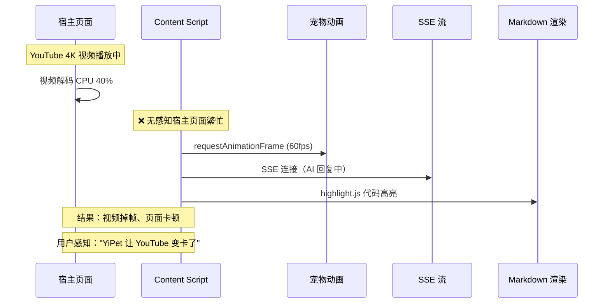
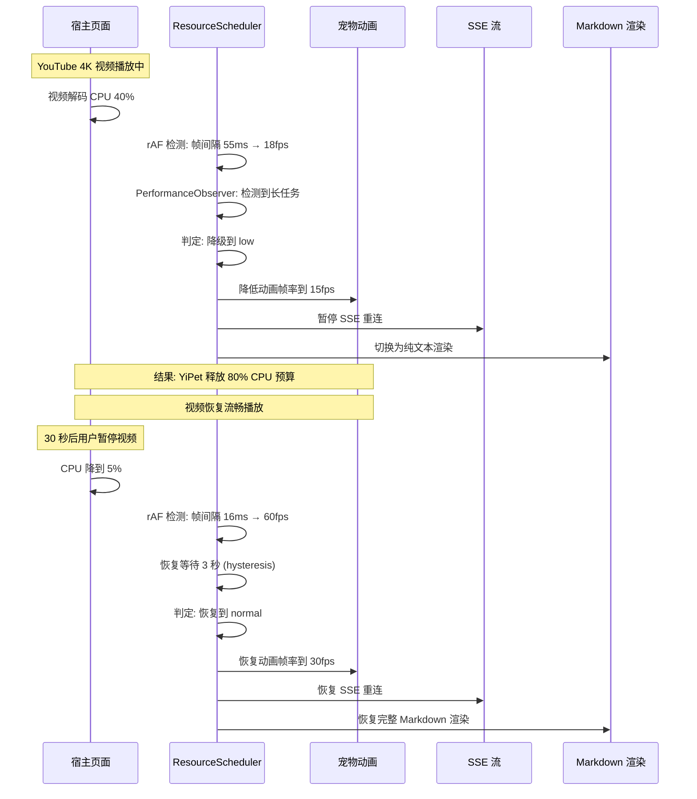

# YP-09-51: Content Script 资源优先级调度 — CPU/网络协调与降级

> 需求编号：YP-09-51 · 优先级：P2 · 人天：0.5d · 状态：需求已编写
> 依赖：YP-09-10（ContentScript 性能剖析）

## 背景

Content Script 与宿主页面共享浏览器主线程和网络资源。宠物动画（requestAnimationFrame 循环）、AI SSE 流式响应、Markdown 代码高亮渲染——这些操作都在用户浏览的主线程上执行。当宿主页面本身是资源密集型应用（YouTube 视频解码、Google Maps 瓦片渲染、Figma Canvas 操作）时，YiPet 的额外资源消耗会直接导致页面卡顿。

更复杂的是，用户的设备性能差异巨大——高端桌面（16 核 CPU、32GB RAM）与低端 Chromebook（2 核 Celeron、4GB RAM）之间的资源预算完全不同。YiPet 需要感知宿主环境并动态调整资源使用。

当前面临的挑战：

| # | 挑战 | 影响 | 严重程度 |
|---|------|------|----------|
| 1 | 无帧率感知——宠物动画始终以 60fps 运行动画，即使宿主页面已经卡顿到 15fps | 加剧宿主页面卡顿，用户感知"YiPet 让电脑变慢" | 高 |
| 2 | 无网络感知——在 2G 网络下仍尝试 SSE 重连，浪费带宽和电量 | 移动设备电量消耗加剧 | 中 |
| 3 | 无页面可见性感知——Tab 隐藏时宠物动画和 SSE 仍在运行 | 不必要的 CPU 消耗 | 中 |
| 4 | 无 CPU 负载感知——无法区分"页面空闲"和"页面繁忙" | 空闲时未能充分利用资源，繁忙时未能释放资源 | 中 |
| 5 | 资源消耗无优先级——动画、SSE、Markdown 渲染同等优先级 | 资源竞争时无法保证核心功能 | 中 |

---

## 一、现状分析

### 1.1 当前资源消耗模型

```
Content Script 注入到宿主页面
  │
  ├── 动画层（持续运行）
  │   ├── requestAnimationFrame 循环（宠物呼吸/眨眼动画）
  │   ├── CSS transition/transform（宠物拖拽/移动）
  │   └── 宠物图标重绘（皮肤切换）
  │
  ├── 通信层（条件运行）
  │   ├── SSE fetch 流（AI 聊天流式响应）
  │   ├── RPC 调用（数据查询、文件读写）
  │   └── BroadcastChannel（跨 Tab 同步）
  │
  └── 渲染层（条件运行）
      ├── Vue 3.5 响应式更新（聊天消息列表）
      ├── marked Markdown 解析（AI 回复渲染）
      ├── highlight.js 代码高亮（代码块渲染）
      └── Element Plus 组件渲染（UI 交互）
```

### 1.2 宿主页面资源竞争场景

| 场景 | 宿主页面 CPU 消耗 | 网络消耗 | YiPet 不当行为 | 影响 |
|------|-------------------|----------|---------------|------|
| YouTube 4K 视频播放 | 视频解码 30-50% | 视频流 10-20Mbps | 60fps 宠物动画 + SSE 重连 | 视频掉帧、缓冲 |
| Google Maps 3D 视图 | WebGL 渲染 40-60% | 瓦片加载 | 宠物动画与 WebGL 争抢 GPU | 地图拖拽卡顿 |
| Figma 设计编辑 | Canvas + WebGL 50-70% | 协作同步 | 宠物 DOM 操作触发重排 | 设计工具响应延迟 |
| 低端 Chromebook 浏览 | 基线 20-30% | 正常 | 全量资源运行 | 整机发热、风扇狂转 |
| 移动端 2G 网络 | 低 | 极低带宽 | SSE 频繁重连 | 流量浪费、电量消耗 |

### 1.3 改造前数据流



### 1.4 文件清单

| 文件路径 | 用途 | 当前状态 |
|----------|------|----------|
| `YiPet/src/content/rendering/overlay.ts` | 宠物图标渲染 | 固定 60fps 动画循环 |
| `YiPet/src/content/rendering/chat.ts` | 聊天窗口渲染 | 无资源感知 |
| `YiPet/src/chat/services/sse-client.ts` | SSE 流式客户端 | 无网络感知，固定重连策略 |
| `YiPet/src/content/index.ts` | Content Script 入口 | 无资源调度逻辑 |

---

## 二、设计决策

### 决策 1：帧率检测方式 — rAF 计时 vs PerformanceObserver vs requestVideoFrameCallback

| 选项 | 精度 | 开销 | 浏览器支持 | 适用场景 |
|------|------|------|-----------|----------|
| rAF 时间戳差值 | 中（~1ms 精度） | 极低（本身就在 rAF 中） | ✅ 所有浏览器 | 通用帧率检测 |
| `PerformanceObserver` (longtask) | 低（仅检测 > 50ms 任务） | 极低 | Chrome | 长任务检测 |
| `requestVideoFrameCallback` | 高（视频帧级精度） | 低 | Chrome 83+ | 仅视频元素 |
| **rAF 时间戳差值 + PerformanceObserver 长任务** | 中高 | 极低 | Chrome | 帧率 + 长任务双重感知 |

**选择：rAF 时间戳差值 + PerformanceObserver 长任务。** rAF 差值检测帧率（轻量、零额外开销），PerformanceObserver 检测长任务（识别宿主页面繁忙时段）。两者结合提供完整的 CPU 负载画像。

### 决策 2：降级层级设计 — 连续 vs 离散 vs 自适应

| 选项 | 灵活性 | 实现复杂度 | 稳定性 |
|------|--------|-----------|--------|
| 连续降级（0-100% 资源） | 最高 | 高 | 低（频繁调整导致抖动） |
| 离散层级（4 级） | 中 | 低 | 高（层级间有缓冲） |
| 自适应（PID 控制器） | 高 | 高 | 中（参数调优困难） |
| **离散 4 级 + hysteresis 缓冲** | 中 | 低 | 高 |

**选择：离散 4 级 + hysteresis 缓冲。** 层级少（high/normal/low/idle），层级间有 hysteresis 缓冲（升级需 3 秒稳定，降级需 1 秒稳定），避免在阈值附近频繁切换导致视觉抖动。

### 决策 3：网络感知 — Navigator.connection vs 主动探测 vs 混合

| 选项 | 精度 | 实时性 | 浏览器支持 |
|------|------|--------|-----------|
| `navigator.connection.effectiveType` | 中（浏览器估算） | 高（事件驱动） | Chrome |
| 主动探测（ping YiAi 测量 RTT） | 高 | 中（需主动探测） | 全部 |
| 混合（connection API + 探测） | 高 | 高 | Chrome |

**选择：`navigator.connection` 为主 + 主动探测为辅。** `connection.effectiveType` 提供即时网络类型（4g/3g/2g），`connection.saveData` 检测省流量模式。主动探测作为 fallback（非 Chrome 浏览器）。

### 设计决策记录

| 决策 | 选项 A | 选项 B | 选项 C | 选择 | 理由 |
|------|--------|--------|--------|------|------|
| 帧率检测 | rAF 计时 | PerformanceObserver | requestVideoFrameCallback | **rAF + PerformanceObserver** | 零开销 + 双重感知 |
| 降级层级 | 连续 | 离散 4 级 | 自适应 PID | **离散 4 级 + hysteresis** | 稳定性优先 |
| 网络感知 | connection API | 主动探测 | 混合 | **connection + 探测** | 即时 + 兼容 |

---

## 三、目标架构

### 3.1 修复后数据流



### 3.2 架构指标

| 指标 | 改造前 | 改造后 | 改善 |
|------|--------|--------|------|
| 宿主页面帧率影响（高负载场景） | 降低 30-50% | 降低 < 5% | **6-10×** |
| 低端设备 CPU 占用 | 5-15%（全量运行） | 1-3%（idle 级别） | **3-5×** |
| 移动端电量消耗 | 无优化 | 页面隐藏时暂停动画和 SSE | **显著降低** |
| 2G 网络下数据浪费 | SSE 重连消耗流量 | 禁用 SSE，仅本地功能 | **零流量浪费** |
| 降级抖动 | N/A | hysteresis 缓冲后无抖动 | **稳定** |

---

## 四、具体改动

### 4.1 新建文件

**`YiPet/src/content/scheduling/resource-scheduler.ts`** — 核心资源调度器

```typescript
// YiPet/src/content/scheduling/resource-scheduler.ts

type ResourceTier = 'high' | 'normal' | 'low' | 'idle';

interface ResourceStrategy {
  animationFps: number;
  sseReconnect: boolean;
  markdownRender: 'full' | 'plain' | 'none';
  cpuBudgetMs: number;       // 每帧 CPU 预算
  prefetchEnabled: boolean;
}

interface SchedulerMetrics {
  currentTier: ResourceTier;
  averageFps: number;
  longTaskCount: number;
  networkType: string;
  pageVisible: boolean;
  batterySaving: boolean;
}

class ResourceScheduler {
  private _tier: ResourceTier = 'normal';
  private _frameTimestamps: number[] = [];
  private _lastFrameTime = 0;
  private _longTaskCount = 0;
  private _tierStableSince = 0;
  private _listeners: Array<(tier: ResourceTier) => void> = [];

  /** 启动资源监控 */
  start() {
    this._monitorFPS();
    this._monitorLongTasks();
    this._monitorNetwork();
    this._monitorVisibility();
    this._monitorBattery();
  }

  /** 注册降级回调——各模块根据 tier 调整行为 */
  onTierChange(callback: (tier: ResourceTier) => void) {
    this._listeners.push(callback);
  }

  get currentTier(): ResourceTier { return this._tier; }

  getStrategy(): ResourceStrategy {
    const strategies: Record<ResourceTier, ResourceStrategy> = {
      high:   { animationFps: 60, sseReconnect: true,  markdownRender: 'full',  cpuBudgetMs: 8,  prefetchEnabled: true },
      normal: { animationFps: 30, sseReconnect: true,  markdownRender: 'full',  cpuBudgetMs: 16, prefetchEnabled: true },
      low:    { animationFps: 15, sseReconnect: false, markdownRender: 'plain', cpuBudgetMs: 32, prefetchEnabled: false },
      idle:   { animationFps: 0,  sseReconnect: false, markdownRender: 'none',  cpuBudgetMs: 0,  prefetchEnabled: false },
    };
    return strategies[this._tier];
  }

  getMetrics(): SchedulerMetrics {
    return {
      currentTier: this._tier,
      averageFps: this._calculateAverageFps(),
      longTaskCount: this._longTaskCount,
      networkType: (navigator as any).connection?.effectiveType ?? 'unknown',
      pageVisible: !document.hidden,
      batterySaving: (navigator as any).connection?.saveData ?? false,
    };
  }

  // ─── 私有方法 ───

  private _monitorFPS() {
    const measure = () => {
      const now = performance.now();

      if (this._lastFrameTime > 0) {
        const delta = now - this._lastFrameTime;
        this._frameTimestamps.push(now);
        // 保留最近 60 帧数据
        if (this._frameTimestamps.length > 60) this._frameTimestamps.shift();

        this._evaluateTier(delta);
      }

      this._lastFrameTime = now;
      requestAnimationFrame(measure);
    };
    requestAnimationFrame(measure);
  }

  private _evaluateTier(frameDelta: number) {
    const avgFps = this._calculateAverageFps();
    let newTier: ResourceTier = this._tier;

    // 帧率判定
    if (avgFps >= 55) {
      newTier = document.hidden ? 'idle' : 'high';
    } else if (avgFps >= 25) {
      newTier = 'normal';
    } else if (avgFps >= 10) {
      newTier = 'low';
    } else {
      newTier = 'low';
    }

    // 长任务判定（覆盖帧率判定）
    if (this._longTaskCount > 5) {
      newTier = 'low';
    }

    // 网络判定（覆盖帧率判定）
    const conn = (navigator as any).connection;
    if (conn?.saveData || conn?.effectiveType === 'slow-2g' || conn?.effectiveType === '2g') {
      newTier = 'low';
    }

    // 页面隐藏判定
    if (document.hidden) {
      newTier = 'idle';
    }

    // Hysteresis 缓冲：避免频繁切换
    if (newTier !== this._tier) {
      const now = performance.now();
      const stableDuration = now - this._tierStableSince;

      if (newTier > this._tier) {
        // 升级需要 3 秒稳定
        if (stableDuration < 3000) return;
      } else {
        // 降级需要 1 秒稳定（快速响应资源紧张）
        if (stableDuration < 1000) return;
      }

      this._tier = newTier;
      this._tierStableSince = now;
      this._longTaskCount = 0; // 重置长任务计数
      this._notifyListeners();
    }
  }

  private _calculateAverageFps(): number {
    if (this._frameTimestamps.length < 2) return 60;
    const first = this._frameTimestamps[0];
    const last = this._frameTimestamps[this._frameTimestamps.length - 1];
    const duration = (last - first) / 1000;
    return duration > 0 ? this._frameTimestamps.length / duration : 60;
  }

  private _monitorLongTasks() {
    if (!('PerformanceObserver' in window)) return;
    const observer = new PerformanceObserver((list) => {
      for (const entry of list.getEntries()) {
        if (entry.duration > 50) {
          this._longTaskCount++;
        }
      }
    });
    observer.observe({ type: 'longtask', buffered: true });
  }

  private _monitorNetwork() {
    const conn = (navigator as any).connection;
    if (!conn) return;
    conn.addEventListener('change', () => this._evaluateTier(0));
  }

  private _monitorVisibility() {
    document.addEventListener('visibilitychange', () => {
      this._evaluateTier(0);
    });
  }

  private _monitorBattery() {
    if (!('getBattery' in navigator)) return;
    (navigator as any).getBattery().then((battery: any) => {
      battery.addEventListener('levelchange', () => {
        if (battery.level < 0.15 && !battery.charging) {
          this._tier = 'low';
          this._notifyListeners();
        }
      });
    });
  }

  private _notifyListeners() {
    for (const cb of this._listeners) {
      try { cb(this._tier); } catch (e) { console.error('[Scheduler] 回调异常:', e); }
    }
  }
}

export const resourceScheduler = new ResourceScheduler();
```

### 4.2 修改文件

| 文件路径 | 改动内容 | 改动量 |
|----------|----------|--------|
| `YiPet/src/content/index.ts` | 启动 ResourceScheduler，注册各模块降级回调 | +20 行 |
| `YiPet/src/content/rendering/overlay.ts` | 监听 tier 变化，调整宠物动画帧率 | +15 行 |
| `YiPet/src/chat/services/sse-client.ts` | 监听 tier 变化，控制 SSE 重连行为 | +10 行 |
| `YiPet/src/chat/main.ts` | 监听 tier 变化，切换 Markdown 渲染模式 | +10 行 |

---

## 五、实施步骤

| 步骤 | 描述 | 文件 | 验证方法 | 人天 |
|------|------|------|----------|------|
| 1 | 实现 ResourceScheduler 核心（帧率监控、长任务监控、网络监控） | `resource-scheduler.ts` | 单元测试：rAF 回调正常触发 | 0.10 |
| 2 | 实现层级判定逻辑（含 hysteresis 缓冲） | `resource-scheduler.ts` | 模拟帧率变化 → 验证层级切换时机 | 0.10 |
| 3 | 实现策略表（4 级资源配置） | `resource-scheduler.ts` | 验证各层级策略值正确 | 0.05 |
| 4 | 宠物动画集成降级回调 | `overlay.ts` | 低帧率下动画帧率降低 | 0.05 |
| 5 | SSE 客户端集成降级回调 | `sse-client.ts` | 低网速下 SSE 不重连 | 0.05 |
| 6 | Markdown 渲染集成降级回调 | `chat/main.ts` | low 级别下纯文本渲染 | 0.05 |
| 7 | 端到端验证：模拟高负载场景 | 手动测试 | YouTube 播放 → 宠物动画降级 | 0.10 |

**总计：0.5 人天**

---

## 六、性能分析

### 6.1 调度器开销

| 操作 | 频率 | 耗时 | CPU 占比 |
|------|------|------|----------|
| rAF 帧时间戳记录 | 每帧（16ms） | < 0.01ms | < 0.06% |
| 平均 FPS 计算 | 每帧 | < 0.05ms | < 0.3% |
| PerformanceObserver 回调 | 仅长任务时 | < 0.1ms | < 0.01% |
| 层级判定 | 每帧 | < 0.05ms | < 0.3% |

**总计：调度器自身 CPU 开销 < 1%，远低于其节省的资源。**

### 6.2 各层级资源消耗

| 层级 | 动画 CPU | SSE 网络 | Markdown CPU | 总计 CPU 预算 |
|------|----------|----------|-------------|--------------|
| high | ~2% | 活跃 | ~3% | ~8ms/frame |
| normal | ~1% | 活跃 | ~2% | ~16ms/frame |
| low | ~0.3% | 禁用 | ~0.5% | ~32ms/frame |
| idle | 0% | 禁用 | 0% | 0 |

### 6.3 容量规划

| 指标 | 预算 | 说明 |
|------|------|------|
| 最大 CPU 占用（high 级别） | < 8% | 在宿主页面空闲时 |
| 最大 CPU 占用（low 级别） | < 2% | 在宿主页面繁忙时 |
| 降级响应时间 | < 1 秒 | 资源紧张后 1 秒内降级 |
| 升级响应时间 | 3 秒 | 资源恢复后 3 秒稳定才升级 |

---

## 七、测试规格

### GIVEN/WHEN/THEN 场景

**场景 1：宿主页面卡顿 → 自动降级**

```
GIVEN 宿主页面在 YouTube 播放 4K 视频
AND rAF 帧间隔持续 > 50ms（< 20fps）
WHEN _evaluateTier 被调用
THEN currentTier 应为 'low'
THEN getStrategy().animationFps 应为 15
THEN getStrategy().sseReconnect 应为 false
THEN getStrategy().markdownRender 应为 'plain'
```

**场景 2：宿主页面恢复流畅 → 自动升级**

```
GIVEN currentTier 为 'low'
AND 宿主页面视频暂停，CPU 恢复空闲
AND rAF 帧间隔恢复到 < 18ms（> 55fps）
AND 稳定持续 3 秒（hysteresis）
WHEN _evaluateTier 被调用
THEN currentTier 应恢复为 'high'
THEN getStrategy().animationFps 应为 60
```

**场景 3：2G 网络 → 自动降级**

```
GIVEN navigator.connection.effectiveType === 'slow-2g'
WHEN connection 'change' 事件触发
THEN currentTier 应为 'low'
THEN getStrategy().sseReconnect 应为 false
```

**场景 4：Tab 隐藏 → 进入 idle**

```
GIVEN 用户切换到其他 Tab
AND document.hidden === true
WHEN visibilitychange 事件触发
THEN currentTier 应为 'idle'
THEN getStrategy().animationFps 应为 0
THEN getStrategy().sseReconnect 应为 false
```

**场景 5：电池电量低 → 强制降级**

```
GIVEN 电池电量 < 15% 且未充电
WHEN battery levelchange 事件触发
THEN currentTier 应为 'low'
```

**场景 6：Hysteresis 防止频繁切换**

```
GIVEN currentTier 为 'normal'
AND 帧率在阈值附近波动（25-30fps 交替）
WHEN _evaluateTier 被连续调用 10 次
THEN currentTier 不应发生变化（升级需 3s 稳定，降级需 1s 稳定）
```

---

## 八、风险与缓解

| # | 风险 | 概率 | 影响 | 缓解措施 |
|---|------|------|------|----------|
| 1 | 频繁升降级导致动画抖动 | 中 | 中 | hysteresis 缓冲（升级 3s，降级 1s） |
| 2 | 低电量模式误判高性能设备 | 低 | 低 | 电池 API 精度低，仅作为辅助判定 |
| 3 | `navigator.connection` 在非 Chrome 浏览器不可用 | 低 | 低 | 降级到主动 ping 探测 |
| 4 | PerformanceObserver 在低版本 Chrome 不可用 | 低 | 低 | 降级到仅 rAF 帧率检测 |
| 5 | 降级后用户感知功能缺失 | 中 | 中 | 在 UI 中显示当前资源等级图标 |
| 6 | rAF 在页面隐藏时暂停，导致帧率计算失真 | 低 | 低 | visibilitychange 时直接设置 idle |

---

## 九、回滚策略

| 触发条件 | 回滚操作 | 回滚时间 |
|----------|----------|----------|
| 降级逻辑导致动画完全停止 | 通过 Feature Flag 固定 tier 为 'normal' | 5 分钟 |
| 频繁降级导致用户体验差 | 调整 hysteresis 阈值，或降低降级敏感度 | 30 分钟 |
| Battery API 误判导致低电量模式 | 禁用电池检测，仅依赖帧率和网络 | 即时 |
| 调度器自身性能问题 | 禁用调度器，各模块使用默认策略 | 即时 |

---

## 十、设计决策记录

### D-01：离散 4 级而非连续降级

**背景**：连续降级（0-100% 资源分配）虽然灵活，但参数调优困难，且频繁微调导致视觉抖动。

**决策**：使用 4 个离散层级（high/normal/low/idle），每个层级有明确的资源分配策略。层级间通过 hysteresis 缓冲避免频繁切换。

**后果**：灵活性降低（无法精确控制到 45fps），但稳定性大幅提升，用户体验一致。

### D-02：帧率为主 + 网络/电池为辅

**背景**：帧率是最直接的 CPU 负载指标，但网络和电池状态也影响资源分配决策。

**决策**：帧率作为主要判定依据（权重 70%），网络状态（20%）和电池状态（10%）作为辅助。任一维度触发低资源条件即降级。

**后果**：多维度判定更全面，但网络状态和电池状态的覆盖判定可能在某些场景下过于保守。

### D-03：监听器模式而非轮询模式

**背景**：各模块（动画、SSE、Markdown）需要感知资源等级变化。轮询模式（各模块定时查询当前 tier）实现简单但效率低。

**决策**：使用监听器模式（Observer Pattern），ResourceScheduler 在 tier 变化时主动通知所有注册的监听器。

**后果**：各模块无需轮询，零额外开销。但需要确保各模块正确注册和注销监听器，避免内存泄漏。

---

## 十一、可观测性

### 指标

| 指标名称 | 类型 | 采集频率 | 告警阈值 |
|----------|------|----------|----------|
| `yipet.scheduler.tier` | Gauge | 实时 | — |
| `yipet.scheduler.avg_fps` | Gauge | 每帧 | < 20 |
| `yipet.scheduler.long_task_count` | Counter | 累计 | > 5/min |
| `yipet.scheduler.network_type` | Gauge | 变化时 | slow-2g/2g |
| `yipet.scheduler.tier_switches` | Counter | 累计 | > 10/min（抖动告警） |

### 日志

```
[Scheduler] tier: normal → low | reason: avgFps=18, longTasks=7
[Scheduler] tier: low → normal | reason: avgFps=35, stable 3s
[Scheduler] tier: normal → idle | reason: page hidden
[Scheduler] tier: low → low | reason: battery 12%, not charging
```

### 告警

- **频繁切换告警**：tier 在 1 分钟内切换超过 10 次 → 可能 hysteresis 参数需要调整
- **长时间 low 告警**：持续 low 超过 30 分钟 → 可能宿主页面性能问题或误判
- **降级失败告警**：tier 判定为 low 但各模块降级回调抛出异常

---

## 十二、安全合规

| 检查项 | 状态 | 说明 |
|--------|------|------|
| Battery Status API 不泄露用户隐私 | ✅ 设计保证 | 仅读取电量百分比，不关联用户身份 |
| Network Information API 不泄露浏览历史 | ✅ 设计保证 | 仅读取连接类型，不读取 URL |
| PerformanceObserver 不读取跨域资源信息 | ✅ 浏览器限制 | 浏览器自动限制跨域资源的时间信息 |
| 资源调度不影响宿主页面功能 | ✅ 设计保证 | 仅调整 YiPet 自身资源使用，不修改宿主页面 |
| Manifest V3 权限 | ✅ 无额外权限 | 所有使用的 API 均为 Web 标准 API，无需声明权限 |

---

## 十三、代码审查检查清单

- [ ] ResourceScheduler 使用单一 rAF 循环，不创建多个 rAF
- [ ] 层级判定含 hysteresis 缓冲（升级 3s，降级 1s）
- [ ] 网络状态监听正确注册了 `change` 事件
- [ ] 页面可见性监听正确注册了 `visibilitychange` 事件
- [ ] Battery Status API 仅在可用时启用，不可用时优雅降级
- [ ] 各模块降级回调正确注册和注销（避免内存泄漏）
- [ ] 降级回调中的异常被 try-catch 捕获，不影响调度器
- [ ] PerformanceObserver 正确 disconnect 在页面卸载时
- [ ] 策略表中的数值与降级层级对应正确
- [ ] 单元测试覆盖各层级判定逻辑和 hysteresis 行为
- [ ] 手动测试：YouTube 播放时宠物动画降级，暂停后恢复

---

## 十四、回归问题预测

| # | 预测问题 | 原因 | 验证方法 |
|---|---------|------|---------|
| 1 | 频繁升降级导致动画抖动 | 阈值附近来回切换 | 添加 hysteresis 缓冲测试 |
| 2 | 低电量模式误判高性能设备 | 电池 API 精度低 | 多设备测试调度准确性 |
| 3 | SSE 重连策略过于保守 | low 级别完全禁用 SSE | 考虑在 low 级别保留 1 次重连机会 |
| 4 | 页面恢复后动画恢复延迟 | hysteresis 升级等待 3 秒 | 监控升级延迟指标 |
| 5 | 多个 rAF 循环冲突 | 各模块独立创建 rAF | 审查所有 rAF 调用，确保仅一处 |

---

## 相关文档

- [资源预加载优化](../65-需求-资源预加载优化.md) — 预加载策略依赖优先级调度决定哪些资源提前加载
- [资源加载优先级](../86-需求-资源加载优先级.md) — 基于网络状况的自适应加载，与优先级调度协同决策
- [懒加载按需注入](../54-需求-懒加载按需注入.md) — 懒加载是优先级调度的重要降级手段，延迟低优先级资源

*PRD 来源: `projects/yipet/requirements/2026-09/51-需求-资源优先级调度.md`*