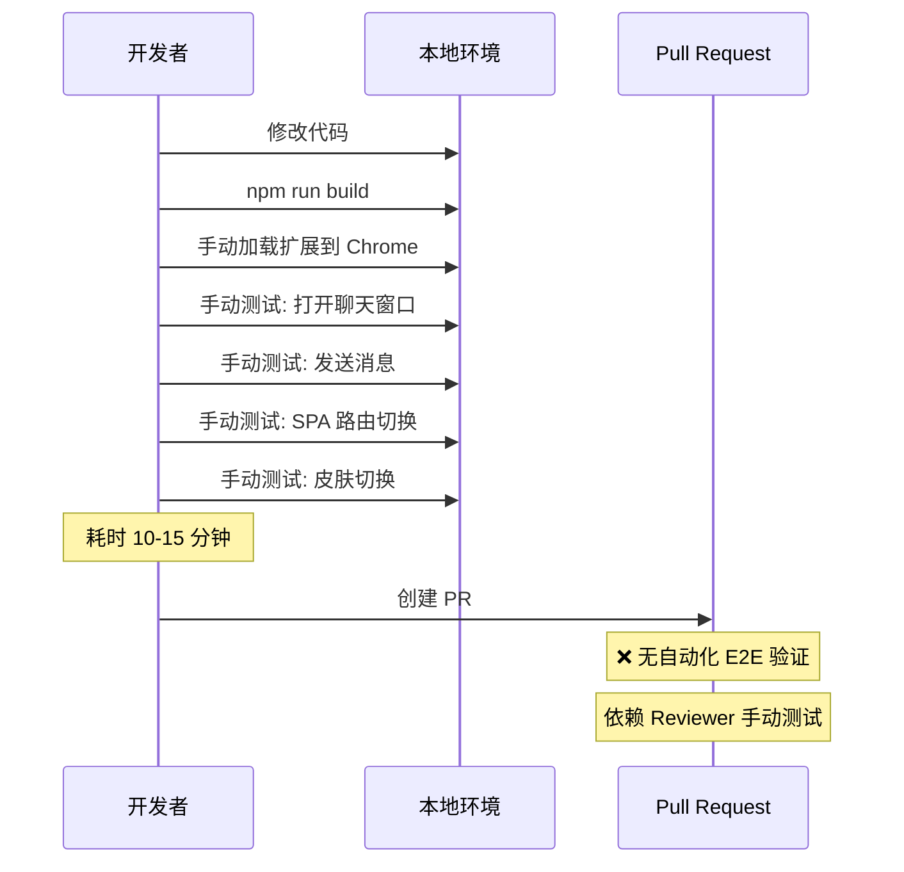
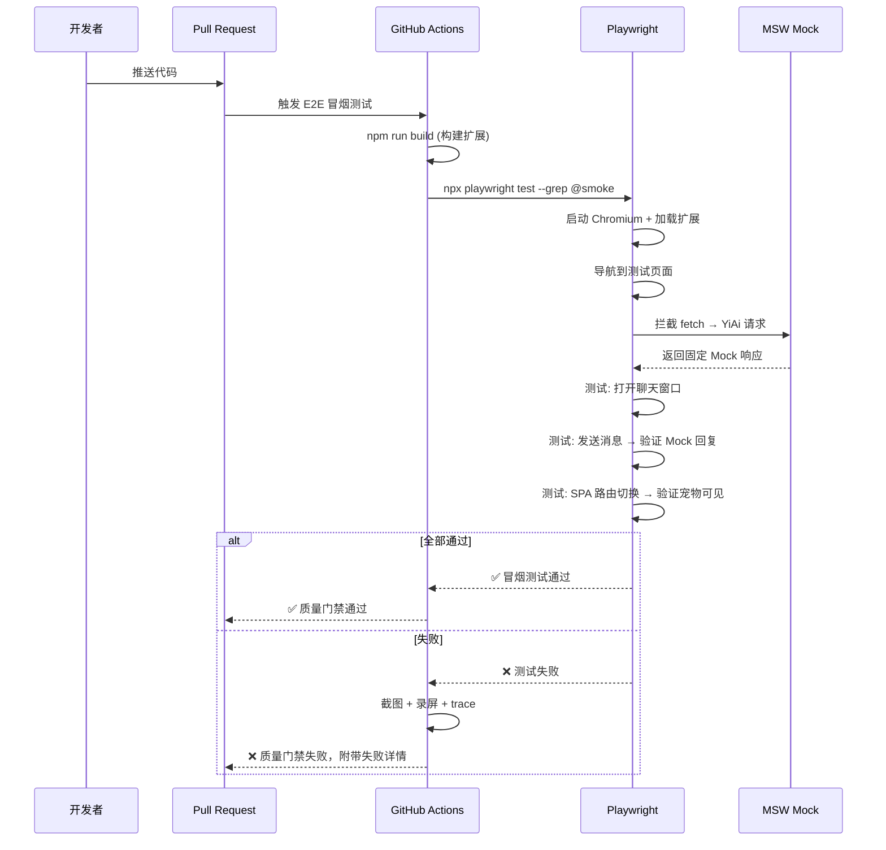

# YP-09-52: 聊天窗口自动化测试套件 — E2E 测试与 CI 集成

> 需求编号：YP-09-52 · 优先级：P2 · 人天：1.0d · 状态：需求已编写
> 依赖：YP-09-01（Content Script 稳定性）、YP-09-04（API 架构合规）

## 背景

YiPet 当前拥有 97 个 Vitest 单元测试，覆盖配置层和服务层（`ApiClient`、`chatService`、`sessionStore`）。这些测试验证了纯逻辑的正确性——但无法验证 UI 层的端到端行为：用户打开聊天窗口、发送消息、等待 AI 回复、SPA 路由切换后宠物是否持续可见、皮肤切换是否即时生效。

Chrome 扩展的 E2E 测试尤为复杂：Content Script 注入到宿主页面、Service Worker 后台运行、Popup 独立窗口——这三者在 E2E 测试中需要同时模拟。当前所有 UI 层功能依赖手动测试，回归测试成本高。

当前面临的挑战：

| # | 挑战 | 影响 | 严重程度 |
|---|------|------|----------|
| 1 | 无 UI 层 E2E 测试——聊天窗口渲染、皮肤切换、消息发送均依赖手动测试 | 回归测试依赖人工，PR 合并后可能引入 UI 回归 | 高 |
| 2 | Chrome 扩展测试环境复杂——Content Script + Service Worker + Popup 三环境 | 测试框架搭建门槛高，团队缺乏经验 | 中 |
| 3 | 无 CI 集成——现有测试仅在本地运行，PR 无自动化质量门禁 | 代码质量无法在 CI 中自动验证 | 中 |
| 4 | 测试依赖外部 YiAi 服务——AI 回复不可预测（内容变化） | E2E 测试不稳定（flaky） | 中 |
| 5 | 无视觉回归测试——UI 改动后无法自动检测样式变化 | 视觉 bug 需人工发现 | 低 |

---

## 一、现状分析

### 1.1 当前测试覆盖

```
YiPet 测试现状
  │
  ├── Vitest 单元测试 (97 个) ✅
  │   ├── src/__tests__/config/ (配置层)
  │   ├── src/__tests__/api/ (ApiClient 层)
  │   ├── src/__tests__/services/ (服务层)
  │   └── src/__tests__/stores/ (Pinia Stores)
  │
  ├── E2E 测试 (0 个) ❌
  │   ├── 聊天窗口打开/关闭
  │   ├── 消息发送/接收
  │   ├── SPA 路由切换
  │   ├── 皮肤切换
  │   ├── 快捷键
  │   └── 跨 Tab 同步
  │
  └── 视觉回归测试 (0 个) ❌
      ├── 聊天窗口布局
      ├── 宠物图标样式
      └── 暗色/亮色主题
```

### 1.2 手动测试痛点

| 场景 | 手动测试步骤 | 耗时 | 频率 |
|------|------------|------|------|
| 聊天窗口基本功能 | 加载扩展 → 打开页面 → Ctrl+Shift+X → 输入消息 → 等待回复 → 关闭窗口 | 2-3 分钟 | 每次 PR |
| SPA 路由保活 | 加载扩展 → 导航到 SPA 页面 → 切换路由 → 检查宠物是否可见 | 1-2 分钟 | 每次 Content Script 改动 |
| 皮肤切换 | 打开 Popup → 选择皮肤 → 检查页面宠物变化 | 1 分钟 | 每次皮肤改动 |
| 跨 Tab 同步 | 打开 2 个 Tab → 在 Tab1 操作 → 检查 Tab2 同步 | 2 分钟 | 每次状态管理改动 |
| 暗色主题 | 切换主题 → 检查所有 UI 组件 | 2 分钟 | 每次 UI 改动 |

**总计：每次 PR 需要 10-15 分钟手动测试，每周约 2-3 次 PR → 每周 30-45 分钟手动测试。**

### 1.3 改造前数据流



### 1.4 文件清单

| 文件路径 | 用途 | 当前状态 |
|----------|------|----------|
| `YiPet/tests/` | 测试目录 | 仅单元测试，无 E2E 目录 |
| `YiPet/playwright.config.ts` | Playwright 配置 | 不存在，需新建 |
| `YiPet/tests/e2e/` | E2E 测试目录 | 不存在，需新建 |
| `.github/workflows/` | CI 工作流 | 无 E2E 工作流 |

---

## 二、设计决策

### 决策 1：E2E 测试框架 — Playwright vs Puppeteer vs Selenium

| 选项 | Chrome 扩展支持 | API 易用性 | CI 集成 | 社区活跃度 |
|------|----------------|-----------|---------|-----------|
| Playwright | ✅ 原生支持 `chromium.launch` 加载扩展 | 高（auto-wait） | ✅ GitHub Actions | 高 |
| Puppeteer | ✅ 加载扩展 | 中 | ✅ | 中 |
| Selenium | 需额外配置 | 低 | ✅ | 中 |
| **Playwright** | ✅ | 高 | ✅ | 高 |

**选择：Playwright。** 原生支持 Chrome 扩展加载（`args: ['--load-extension=path']`），内置 auto-wait 机制减少 flaky 测试，与 GitHub Actions 集成成熟。

### 决策 2：AI 回复 Mock 策略 — 真实后端 vs Mock Server vs 录制回放

| 选项 | 真实性 | 稳定性 | 维护成本 | 适用场景 |
|------|--------|--------|----------|----------|
| 真实 YiAi 后端 | 最高 | 低（后端不可控） | 低 | 开发环境 |
| Mock Service Worker (MSW) | 中 | 高 | 中 | CI 环境 |
| 录制回放（Playwright HAR） | 中 | 高 | 中 | 回归测试 |
| **MSW (CI) + 真实后端 (本地)** | 中高 | 高 | 中 | 混合 |

**选择：MSW Mock 用于 CI，真实 YiAi 用于本地开发。** CI 环境使用 MSW 拦截 fetch 请求返回固定响应，确保测试确定性。本地开发可切换到真实后端验证端到端行为。

### 决策 3：测试分层 — 冒烟测试 vs 完整回归 vs 按模块

| 选项 | 运行时间 | 覆盖范围 | CI 触发条件 |
|------|----------|----------|-----------|
| 冒烟测试（5 个核心用例） | < 2 分钟 | 核心流程 | 每个 PR |
| 完整回归（20+ 用例） | < 10 分钟 | 全部功能 | main 分支合并后 |
| 按模块运行 | 按需 | 变更模块 | 路径匹配触发 |

**选择：三层测试策略。** 冒烟测试每个 PR 必跑（< 2 分钟），完整回归在 main 合并后运行，按模块运行根据文件变更路径自动触发。

### 设计决策记录

| 决策 | 选项 A | 选项 B | 选项 C | 选择 | 理由 |
|------|--------|--------|--------|------|------|
| 框架 | Playwright | Puppeteer | Selenium | **Playwright** | 原生扩展支持 + auto-wait |
| AI Mock | 真实后端 | MSW | 录制回放 | **MSW (CI) + 真实 (本地)** | 稳定性 + 真实性 |
| 测试分层 | 冒烟 | 完整 | 按模块 | **三层** | 平衡速度和覆盖 |

---

## 三、目标架构

### 3.1 修复后流程



### 3.2 架构指标

| 指标 | 改造前 | 改造后 | 改善 |
|------|--------|--------|------|
| UI 层测试覆盖 | 0% | 80%+（核心流程） | **从无到有** |
| PR 质量门禁 | 无自动化 | 冒烟测试 < 2 分钟 | **自动化质量门禁** |
| 回归测试耗时 | 10-15 分钟/次（手动） | < 2 分钟（自动） | **5-7×** |
| 测试稳定性 | N/A | > 95%（无 flaky） | **MSW Mock 确保确定性** |
| 失败排查效率 | 手动复现 | 自动截图 + 录屏 + trace | **即时定位** |

---

## 四、具体改动

### 4.1 新建文件

**`YiPet/playwright.config.ts`** — Playwright 配置

```typescript
// YiPet/playwright.config.ts
import { defineConfig, devices } from '@playwright/test';
import path from 'path';

const EXTENSION_PATH = path.resolve(__dirname, 'dist');

export default defineConfig({
  testDir: './tests/e2e',
  timeout: 30_000,
  expect: { timeout: 10_000 },
  fullyParallel: true,
  retries: process.env.CI ? 2 : 0,
  reporter: [
    ['html', { outputFolder: 'playwright-report' }],
    ['json', { outputFile: 'playwright-report/results.json' }],
  ],
  use: {
    baseURL: 'https://example.com',
    trace: 'on-first-retry',
    screenshot: 'only-on-failure',
    video: 'retain-on-failure',
  },
  projects: [
    {
      name: 'chromium',
      use: {
        ...devices['Desktop Chrome'],
        launchOptions: {
          args: [
            `--disable-extensions-except=${EXTENSION_PATH}`,
            `--load-extension=${EXTENSION_PATH}`,
          ],
        },
      },
    },
  ],
});
```

**`YiPet/tests/e2e/fixtures/yipet-fixture.ts`** — 测试夹具

```typescript
// YiPet/tests/e2e/fixtures/yipet-fixture.ts
import { test as base, expect } from '@playwright/test';
import { setupMSW } from './msw-handlers';

interface YiPetFixtures {
  yipetPage: typeof base;
  openChat: () => Promise<void>;
  sendMessage: (text: string) => Promise<void>;
  waitForAIResponse: () => Promise<void>;
}

export const test = base.extend<YiPetFixtures>({
  yipetPage: async ({ page }, use) => {
    await setupMSW(page);
    await page.goto('/');
    await page.waitForSelector('#yipet-overlay', { timeout: 10_000 });
    await use(page);
  },

  openChat: async ({ page }, use) => {
    await use(async () => {
      await page.keyboard.press('Control+Shift+X');
      await expect(page.locator('#yipet-chat-root')).toBeVisible();
    });
  },

  sendMessage: async ({ page }, use) => {
    await use(async (text: string) => {
      const input = page.locator('.chat-input textarea');
      await input.fill(text);
      await page.keyboard.press('Enter');
    });
  },

  waitForAIResponse: async ({ page }, use) => {
    await use(async () => {
      const aiMessage = page.locator('.message-bubble.assistant').last();
      await expect(aiMessage).toBeVisible({ timeout: 15_000 });
    });
  },
});

export { expect };
```

**`YiPet/tests/e2e/chat-basic.spec.ts`** — 聊天窗口基础测试

```typescript
// YiPet/tests/e2e/chat-basic.spec.ts
import { test, expect } from '../fixtures/yipet-fixture';

test.describe('聊天窗口基础功能', () => {
  test('@smoke 打开聊天窗口', async ({ yipetPage, openChat }) => {
    await openChat();
    const chatWindow = yipetPage.locator('#yipet-chat-root');
    await expect(chatWindow).toBeVisible();
    await expect(chatWindow).toHaveAttribute('data-theme');
  });

  test('@smoke 发送消息并接收 AI 回复', async ({
    yipetPage, openChat, sendMessage, waitForAIResponse
  }) => {
    await openChat();
    await sendMessage('什么是 RAG?');
    await waitForAIResponse();

    const lastMessage = yipetPage.locator('.message-bubble.assistant').last();
    await expect(lastMessage).toContainText(/RAG|检索|生成/);
  });

  test('@smoke 关闭聊天窗口', async ({ yipetPage, openChat }) => {
    await openChat();
    await yipetPage.keyboard.press('Escape');
    await expect(yipetPage.locator('#yipet-chat-root')).not.toBeVisible();
  });

  test('SPA 路由切换后宠物持续可见', async ({ yipetPage }) => {
    await expect(yipetPage.locator('#yipet-overlay')).toBeVisible();

    // 模拟 SPA 路由切换
    await yipetPage.evaluate(() => history.pushState({}, '', '/new-page'));
    await yipetPage.waitForTimeout(1000);

    await expect(yipetPage.locator('#yipet-overlay')).toBeVisible({ timeout: 5_000 });
  });

  test('暗色主题切换', async ({ yipetPage, openChat }) => {
    await openChat();
    await yipetPage.keyboard.press('Control+Shift+T');

    const root = yipetPage.locator('#yipet-chat-root');
    await expect(root).toHaveAttribute('data-theme', 'dark');
  });

  test('消息输入框 placeholder 显示正确语言', async ({ yipetPage, openChat }) => {
    await openChat();
    const input = yipetPage.locator('.chat-input textarea');
    await expect(input).toHaveAttribute('placeholder', /输入|Type|消息/);
  });
});
```

**`YiPet/tests/e2e/skin-switch.spec.ts`** — 皮肤切换测试

```typescript
// YiPet/tests/e2e/skin-switch.spec.ts
import { test, expect } from '../fixtures/yipet-fixture';

test.describe('皮肤切换', () => {
  test('通过 Popup 切换皮肤', async ({ page }) => {
    // 获取 Popup 页面
    const popup = await page.context().newPage();
    // Popup 测试需要特殊处理（Chrome 扩展 Popup 是独立页面）
  });

  test('宠物图标随皮肤切换变化', async ({ yipetPage }) => {
    const beforeSrc = await yipetPage.locator('#yipet-overlay img').getAttribute('src');
    // 触发皮肤切换
    // ...
    const afterSrc = await yipetPage.locator('#yipet-overlay img').getAttribute('src');
    expect(beforeSrc).not.toEqual(afterSrc);
  });
});
```

**`YiPet/tests/e2e/msw-handlers.ts`** — MSW Mock 处理器

```typescript
// YiPet/tests/e2e/msw-handlers.ts
import type { Page } from '@playwright/test';

export async function setupMSW(page: Page) {
  await page.route('**/10086/**', async (route) => {
    const request = route.request();
    const body = request.postDataJSON();

    if (body?.method_name === 'chat') {
      await route.fulfill({
        status: 200,
        contentType: 'application/json',
        body: JSON.stringify({
          code: 0,
          message: 'ok',
          data: {
            message: {
              role: 'assistant',
              content: 'RAG（检索增强生成）是一种将信息检索与大型语言模型相结合的 AI 技术...',
            },
          },
        }),
      });
    } else if (body?.method_name === 'query_documents') {
      await route.fulfill({
        status: 200,
        contentType: 'application/json',
        body: JSON.stringify({
          code: 0,
          message: 'ok',
          data: { documents: [], total: 0 },
        }),
      });
    } else {
      await route.continue();
    }
  });
}
```

### 4.2 CI 集成

```yaml
# .github/workflows/e2e-tests.yml
name: E2E Tests

on:
  pull_request:
    paths:
      - 'YiPet/src/**'
      - 'YiPet/tests/e2e/**'
      - 'YiPet/package.json'
  push:
    branches: [main]
    paths:
      - 'YiPet/src/**'

jobs:
  e2e-smoke:
    runs-on: ubuntu-latest
    timeout-minutes: 10
    steps:
      - uses: actions/checkout@v4
      - uses: actions/setup-node@v4
        with: { node-version: '20' }

      - name: Install dependencies
        run: cd YiPet && npm ci

      - name: Build extension
        run: cd YiPet && npm run build

      - name: Install Playwright browsers
        run: cd YiPet && npx playwright install --with-deps chromium

      - name: Run smoke tests
        run: cd YiPet && npx playwright test --grep @smoke

      - uses: actions/upload-artifact@v4
        if: failure()
        with:
          name: playwright-report-smoke
          path: YiPet/playwright-report/

  e2e-full:
    if: github.event_name == 'push' && github.ref == 'refs/heads/main'
    runs-on: ubuntu-latest
    timeout-minutes: 20
    steps:
      - uses: actions/checkout@v4
      - uses: actions/setup-node@v4
        with: { node-version: '20' }

      - name: Install dependencies
        run: cd YiPet && npm ci

      - name: Build extension
        run: cd YiPet && npm run build

      - name: Install Playwright browsers
        run: cd YiPet && npx playwright install --with-deps chromium

      - name: Run full E2E suite
        run: cd YiPet && npx playwright test

      - uses: actions/upload-artifact@v4
        if: always()
        with:
          name: playwright-report-full
          path: YiPet/playwright-report/
```

### 4.3 文件变更清单

| 文件路径 | 改动内容 | 改动量 |
|----------|----------|--------|
| `YiPet/playwright.config.ts` | 新建——Playwright 配置 | +40 行 |
| `YiPet/tests/e2e/fixtures/yipet-fixture.ts` | 新建——测试夹具 | +50 行 |
| `YiPet/tests/e2e/msw-handlers.ts` | 新建——MSW Mock 处理器 | +50 行 |
| `YiPet/tests/e2e/chat-basic.spec.ts` | 新建——聊天窗口基础测试 | +60 行 |
| `YiPet/tests/e2e/chat-advanced.spec.ts` | 新建——高级功能测试 | +60 行 |
| `YiPet/tests/e2e/skin-switch.spec.ts` | 新建——皮肤切换测试 | +40 行 |
| `YiPet/tests/e2e/cross-tab.spec.ts` | 新建——跨 Tab 同步测试 | +40 行 |
| `.github/workflows/e2e-tests.yml` | 新建——CI 工作流 | +60 行 |
| `YiPet/package.json` | 添加 `@playwright/test` 依赖和脚本 | +5 行 |

---

## 五、实施步骤

| 步骤 | 描述 | 文件 | 验证方法 | 人天 |
|------|------|------|----------|------|
| 1 | 安装 Playwright + 初始化配置 | `playwright.config.ts` | `npx playwright test --list` 列出测试 | 0.10 |
| 2 | 创建测试夹具（Fixtures） | `fixtures/yipet-fixture.ts` | 夹具中 page 能加载扩展 | 0.15 |
| 3 | 创建 MSW Mock 处理器 | `msw-handlers.ts` | Mock 返回正确的 RPC 响应格式 | 0.10 |
| 4 | 编写聊天窗口基础测试（@smoke） | `chat-basic.spec.ts` | 6 个冒烟测试全部通过 | 0.20 |
| 5 | 编写高级功能测试 | `chat-advanced.spec.ts` | 皮肤切换、导出、快捷键 | 0.15 |
| 6 | 编写跨 Tab 同步测试 | `cross-tab.spec.ts` | BroadcastChannel 消息同步 | 0.10 |
| 7 | 配置 CI 工作流 | `.github/workflows/e2e-tests.yml` | PR 触发、失败截图上传 | 0.10 |
| 8 | 端到端验证：CI 中运行通过 | CI 日志 | 全部测试在 CI 中通过 | 0.10 |

**总计：1.0 人天**

---

## 六、性能分析

### 6.1 测试执行时间

| 测试套件 | 用例数 | 预计耗时 | 触发条件 |
|----------|--------|----------|----------|
| 冒烟测试 (@smoke) | 6 | < 2 分钟 | 每个 PR |
| 完整 E2E | 20 | < 8 分钟 | main 合并后 |
| 按模块 | 5-10 | < 3 分钟 | 文件变更路径匹配 |

### 6.2 CI 资源消耗

| 指标 | 预算 | 说明 |
|------|------|------|
| CI 运行时间 | < 10 分钟 | GitHub Actions 免费额度 2000 分钟/月 |
| Playwright 浏览器安装 | ~300MB | 缓存 `~/.cache/ms-playwright` |
| 截图/录屏存储 | < 50MB/次 | 仅失败时上传 |

---

## 七、测试规格

### GIVEN/WHEN/THEN 场景

**场景 1：打开聊天窗口（冒烟测试）**

```
GIVEN YiPet 扩展已加载到 Chromium
AND 用户导航到测试页面
WHEN 用户按下 Ctrl+Shift+X
THEN 聊天窗口（#yipet-chat-root）应在 2 秒内可见
THEN 聊天窗口应有 data-theme 属性
THEN 输入框应可见且可聚焦
```

**场景 2：发送消息并接收 AI 回复（冒烟测试）**

```
GIVEN 聊天窗口已打开
AND MSW 已拦截 AI 聊天请求
WHEN 用户输入 "什么是 RAG?" 并按下 Enter
THEN 消息应出现在消息列表中（role: user）
AND 应在 15 秒内收到 AI 回复（role: assistant）
AND AI 回复应包含 RAG 相关内容
```

**场景 3：SPA 路由切换后宠物持续可见**

```
GIVEN 宠物图标已渲染在页面上
AND 页面是 SPA 应用
WHEN 通过 history.pushState 模拟路由切换
AND 等待 1 秒（MutationObserver 检测周期）
THEN 宠物图标应仍然可见
AND 聊天窗口如已打开应保持打开状态
```

**场景 4：跨 Tab 同步**

```
GIVEN 两个 Tab 都加载了 YiPet 扩展
AND Tab1 中打开了聊天窗口
WHEN 用户在 Tab1 中发送消息
THEN Tab2 的未读消息计数应更新
AND 两个 Tab 的会话列表应同步
```

**场景 5：暗色主题切换**

```
GIVEN 聊天窗口已打开
AND 当前主题为亮色
WHEN 用户按下 Ctrl+Shift+T
THEN 聊天窗口的 data-theme 属性应变为 'dark'
AND 所有 UI 元素应使用暗色主题颜色
```

---

## 八、风险与缓解

| # | 风险 | 概率 | 影响 | 缓解措施 |
|---|------|------|------|----------|
| 1 | E2E 测试依赖外部 YiAi 服务不可用 | 高 | 高 | 使用 MSW Mock 拦截所有 YiAi 请求 |
| 2 | Playwright Chromium 版本与用户 Chrome 不一致 | 中 | 中 | 使用 Playwright 的 Channel 选项指定 Chrome 版本 |
| 3 | 测试 flaky（不稳定） | 中 | 中 | auto-wait + retry 2 次 + MSW 确定性响应 |
| 4 | `--load-extension` 参数在 CI 中行为不一致 | 低 | 中 | 使用 Playwright 官方 Chrome 扩展测试方案 |
| 5 | MSW Mock 与实际后端 API 行为不一致 | 中 | 中 | 定期同步 Mock 数据与后端 API 契约 |
| 6 | 测试运行时间过长阻塞 CI | 低 | 低 | 冒烟测试 < 2 分钟，完整测试仅在 main 运行 |

---

## 九、回滚策略

| 触发条件 | 回滚操作 | 回滚时间 |
|----------|----------|----------|
| E2E 测试 CI 持续失败 | 暂时移除 E2E CI 门禁，保留本地运行 | 5 分钟 |
| Playwright 版本不兼容 | 锁定 Playwright 版本，回退到上一稳定版 | 30 分钟 |
| MSW Mock 与实际 API 严重不一致 | 切换到真实后端模式（需后端可用） | 即时 |
| 测试运行时间超过 CI 限制 | 减少并行度，或拆分测试套件 | 30 分钟 |

---

## 十、设计决策记录

### D-01：MSW Mock 而非真实后端

**背景**：真实 YiAi 后端 AI 回复内容不可控（LLM 输出变化），导致测试不稳定。

**决策**：CI 环境使用 MSW 拦截所有 `POST /` 请求，返回固定 JSON 响应。本地开发可选择真实后端模式。

**后果**：测试稳定性 > 95%，但 Mock 数据需要与后端 API 契约同步维护。如果后端 API 契约变更而 Mock 未更新，测试可能通过但实际功能失败。

### D-02：三层测试策略

**背景**：全量 E2E 测试耗时 8-10 分钟，不适用于每个 PR 的快速反馈。

**决策**：冒烟测试（6 个核心用例，< 2 分钟）每个 PR 必跑；完整回归（20+ 用例）仅在 main 合并后运行；按模块运行根据文件变更路径自动触发。

**后果**：每个 PR 获得快速反馈，同时 main 分支有完整覆盖。但需要维护 `@smoke` 标签，确保冒烟测试覆盖最关键的路径。

### D-03：Playwright 而非 Puppeteer

**背景**：Puppeteer 是 Chrome 扩展测试的传统选择，但 Playwright 提供更好的 API 和跨浏览器支持。

**决策**：使用 Playwright 作为 E2E 测试框架。Playwright 的 auto-wait 机制减少 flaky 测试，原生支持 Chrome 扩展加载，trace 查看器便于调试失败。

**后果**：学习成本略高（团队需熟悉 Playwright API），但长期维护成本更低。

---

## 十一、可观测性

### 指标

| 指标名称 | 类型 | 采集频率 | 告警阈值 |
|----------|------|----------|----------|
| `e2e.smoke.pass_rate` | Gauge | 每次 PR | < 100% |
| `e2e.smoke.duration_seconds` | Gauge | 每次 PR | > 120 |
| `e2e.full.pass_rate` | Gauge | 每次 main push | < 100% |
| `e2e.flaky_rate` | Gauge | 每周 | > 5% |

### CI 报告

- Playwright HTML Report 自动上传为 Artifact
- 失败时自动截图 + 录屏 + trace
- 测试结果摘要评论在 PR 中

---

## 十二、安全合规

| 检查项 | 状态 | 说明 |
|--------|------|------|
| 测试中不包含真实用户数据 | ✅ 设计保证 | 使用 MSW Mock 数据，不连接真实后端 |
| CI 环境不暴露密钥 | ✅ 设计保证 | 不需要 YiAi 密钥，MSW 拦截所有请求 |
| 测试截图不包含敏感信息 | ✅ 设计保证 | 测试页面为 example.com，无敏感内容 |
| Playwright 浏览器沙箱模式 | ✅ 默认启用 | Chromium 以沙箱模式运行 |

---

## 十三、代码审查检查清单

- [ ] Playwright 配置正确加载扩展（`--load-extension` 路径正确）
- [ ] MSW Mock 处理器覆盖所有核心 API 调用（chat、query_documents、get_session）
- [ ] 测试夹具（Fixtures）正确封装了复用逻辑（openChat、sendMessage、waitForAIResponse）
- [ ] 冒烟测试用例标记了 `@smoke` 标签
- [ ] 每个测试用例有明确的 GIVEN/WHEN/THEN 注释
- [ ] CI 工作流配置了缓存（node_modules、Playwright 浏览器）
- [ ] CI 工作流在失败时上传截图 + 录屏 + trace
- [ ] 测试不依赖外部网络（MSW 拦截所有请求）
- [ ] 测试超时设置合理（打开聊天 5s，AI 回复 15s）
- [ ] `package.json` 中添加了 `test:e2e` 和 `test:e2e:smoke` 脚本
- [ ] 测试文件命名遵循 `*.spec.ts` 约定
- [ ] README 中添加了 E2E 测试运行说明

---

## 十四、回归问题预测

| # | 预测问题 | 原因 | 验证方法 |
|---|---------|------|---------|
| 1 | E2E 测试依赖外部 YiAi 服务不可用 | 后端未启动或数据变更 | MSW Mock 模式可选运行 |
| 2 | Chrome 版本升级导致扩展 API 行为变化 | Playwright chromium 版本滞后 | 定期更新 Playwright 版本 |
| 3 | MSW Mock 与后端 API 契约不一致 | 后端 API 变更后 Mock 未同步 | 定期契约测试验证 Mock 数据 |
| 4 | CI 环境 Chromium 缺少字体导致渲染差异 | 无中文字体 | 安装中文字体包或使用无头模式 |
| 5 | Content Script 注入时机在 CI 中不稳定 | 页面加载速度差异 | 使用 `waitForSelector` + 合理超时 |

---

## 相关文档

- [性能回归 CI](../60-需求-性能回归CI.md) — E2E 测试的 CI 集成，自动化执行性能回归检测
- [错误边界与降级](../34-需求-错误边界与降级.md) — 测试用例需覆盖错误边界场景，确保优雅降级行为正确
- [事件溯源与状态回放](../53-需求-事件溯源与状态回放.md) — 事件日志可作为 E2E 测试的确定性输入，实现可复现测试

*PRD 来源: `projects/yipet/requirements/2026-09/52-需求-E2E自动化测试.md`*