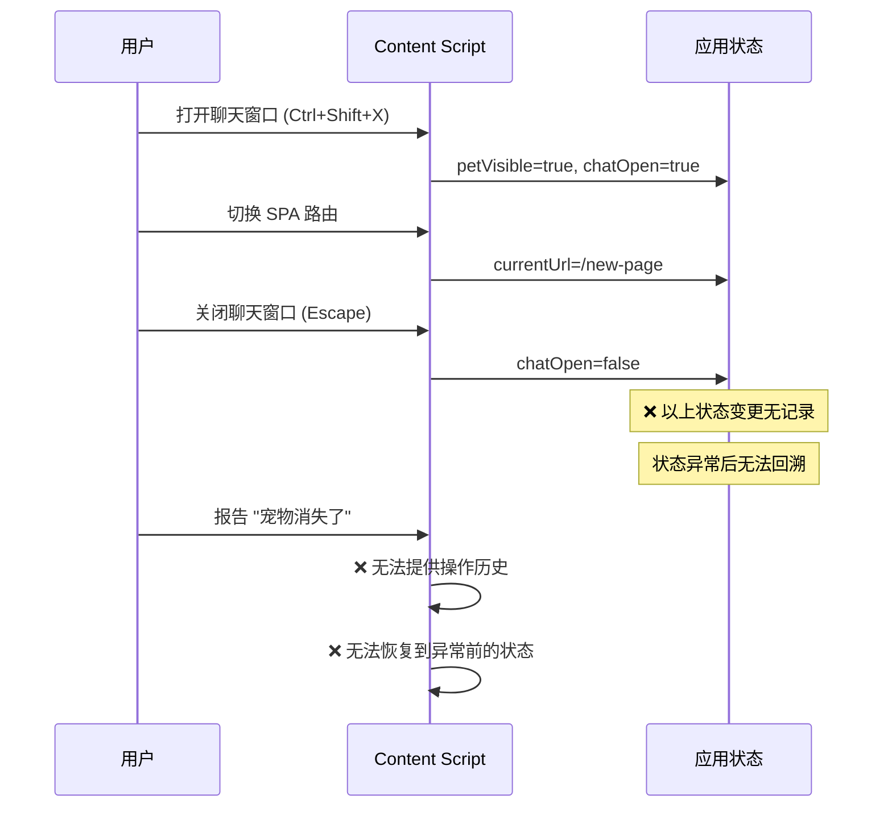
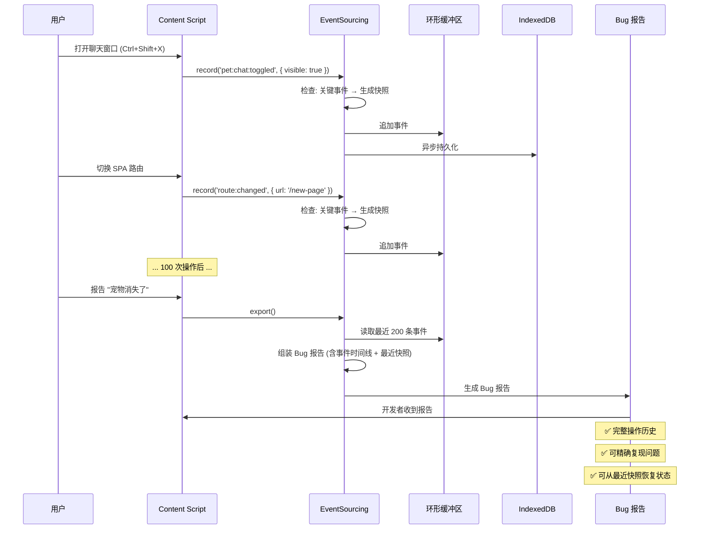

# YP-09-53: Content Script 事件溯源与状态回放 — Event Log 调试恢复

> 需求编号：YP-09-53 · 优先级：P2 · 人天：0.5d · 状态：需求已编写
> 依赖：YP-09-01（Content Script 稳定性）

## 背景

用户报告"宠物突然消失了"或"聊天窗口无法打开"时，开发者面临的核心问题是：不知道用户之前执行了什么操作。YiPet 的状态（宠物可见性、聊天窗口打开/关闭、当前皮肤、语言设置）由一系列用户操作事件驱动，但没有记录这些事件的历史。

事件溯源（Event Sourcing）是一种架构模式，将应用状态的所有变更记录为不可变事件序列。当前状态可以通过重放事件序列重建。这为调试提供了强大的能力——开发者可以"回放"用户的操作序列，精确复现问题。

当前面临的挑战：

| # | 挑战 | 影响 | 严重程度 |
|---|------|------|----------|
| 1 | 用户报告 Bug 时无法复现——不知道用户执行了什么操作序列 | 排查效率低，大量 Bug 标记为"无法复现" | 高 |
| 2 | 状态异常后无法恢复——用户只能刷新页面 | 用户丢失当前会话状态 | 中 |
| 3 | 多来源状态变更（用户操作、SPA 路由、SW 消息、Popup 控制）无统一日志 | 难以追踪状态变更的来源和时序 | 中 |
| 4 | 无状态快照——无法快速跳到某个时间点的状态 | 回放耗时，需要从头开始 | 中 |
| 5 | Bug 报告缺少上下文——仅描述"宠物消失了"，无操作历史 | 开发者需要反复追问用户操作细节 | 中 |

---

## 一、现状分析

### 1.1 YiPet 状态变更来源

```
Content Script 状态变更来源
  │
  ├── 用户直接操作
  │   ├── 快捷键（Ctrl+Shift+X 打开聊天）
  │   ├── 点击宠物图标
  │   ├── 右键菜单
  │   └── 拖拽宠物位置
  │
  ├── 页面事件
  │   ├── SPA 路由切换（history.pushState）
  │   ├── DOM 变化（MutationObserver 检测）
  │   ├── 页面卸载（beforeunload）
  │   └── 页面可见性变化（visibilitychange）
  │
  ├── Service Worker 消息
  │   ├── 跨 Tab 同步（BroadcastChannel）
  │   ├── 皮肤切换指令
  │   └── 语言切换指令
  │
  └── Popup 控制
      ├── 皮肤选择
      ├── 角色切换
      └── 设置变更
```

### 1.2 当前调试流程

```
用户报告 "宠物消失了"
  │
  ├── 开发者: "什么时候发生的？做了什么操作？"
  │   用户: "不太记得了，大概切换了几个页面..."
  │
  ├── 开发者: 尝试复现
  │   ├── 打开同一页面 → 宠物正常 ✅
  │   ├── 切换页面 → 宠物正常 ✅
  │   ├── 打开聊天 → 宠物正常 ✅
  │   └── ❌ 无法复现
  │
  └── 结果: Bug 标记为 "无法复现"，关闭
      实际原因: 用户在特定 SPA 路由下先打开了聊天窗口，然后页面
      自动跳转，MutationObserver 在特定时机触发了宠物移除逻辑
```

### 1.3 改造前数据流



### 1.4 文件清单

| 文件路径 | 用途 | 当前状态 |
|----------|------|----------|
| `YiPet/src/content/index.ts` | Content Script 入口 | 无事件记录 |
| `YiPet/src/content/state/` | 状态管理 | 无事件日志 |
| `YiPet/src/content/diagnostics/` | 诊断工具 | 需集成事件溯源 |

---

## 二、设计决策

### 决策 1：事件存储策略 — 内存 vs chrome.storage vs IndexedDB vs 环形缓冲区

| 选项 | 容量 | 持久化 | 写入性能 | 适用场景 |
|------|------|--------|----------|----------|
| 内存数组（环形缓冲区） | 受 JS heap 限制 | ❌ | 极高 | 当前会话调试 |
| `chrome.storage.local` | 10MB | ✅ | 中（序列化） | 跨页面恢复 |
| IndexedDB | 无限制 | ✅ | 低（异步） | 长期存储 |
| **环形缓冲区 + IndexedDB 持久化** | 大 | ✅ | 高 | 混合 |

**选择：内存环形缓冲区（200 条）+ 可选 IndexedDB 持久化。** 日常调试在内存中完成（零开销），Bug 报告时导出到 IndexedDB 供持久化。环形缓冲区自动淘汰旧事件，防止内存无限增长。

### 决策 2：快照频率 — 每条事件 vs 每 N 条 vs 关键事件触发

| 选项 | 存储开销 | 回放速度 | 实现复杂度 |
|------|----------|----------|-----------|
| 每条事件附带快照 | 极高 | 最快 | 低 |
| 每 50 条事件生成快照 | 中 | 中 | 中 |
| 关键事件触发快照 | 低 | 中 | 中 |
| **关键事件 + 每 50 条** | 低 | 中 | 中 |

**选择：关键事件（pet:toggled、route:changed、skin:changed、error:boundary）触发快照 + 每 50 条事件兜底。** 关键事件是状态"分叉点"，快照位于这些点可加速回放。每 50 条兜底防止事件序列过长无快照。

### 决策 3：事件 Schema 设计 — 宽松 vs 严格 vs 版本化

| 选项 | 灵活性 | 兼容性 | 实现复杂度 |
|------|--------|--------|-----------|
| 宽松（any payload） | 高 | 低 | 低 |
| 严格（TypeScript 类型约束） | 低 | 低 | 中 |
| 版本化（Schema Version） | 中 | 高 | 中 |

**选择：宽松 payload + 版本化事件类型。** 事件类型枚举定义（`pet:toggled`、`route:changed` 等），payload 为 `Record<string, unknown>`（宽松但可追溯）。事件 schema 版本号确保回放兼容性。

### 设计决策记录

| 决策 | 选项 A | 选项 B | 选项 C | 选择 | 理由 |
|------|--------|--------|--------|------|------|
| 存储策略 | 内存数组 | chrome.storage | IndexedDB | **环形缓冲区 + IDB** | 日常零开销 + 持久化兜底 |
| 快照频率 | 每条事件 | 每 50 条 | 关键事件 | **关键事件 + 每 50 条** | 加速回放 + 存储可控 |
| 事件 Schema | 宽松 | 严格 | 版本化 | **宽松 + 版本化** | 灵活 + 兼容 |

---

## 三、目标架构

### 3.1 修复后数据流



### 3.2 架构指标

| 指标 | 改造前 | 改造后 | 改善 |
|------|--------|--------|------|
| Bug 复现率 | 30-40%（大量"无法复现"） | 80-90%（事件日志 + 快照） | **2-3×** |
| 问题排查时间 | 2-4 小时/次 | 30 分钟/次 | **4-8×** |
| 状态恢复能力 | 无（刷新页面） | 可从最近快照恢复 | **从无到有** |
| 事件存储开销 | 0 | < 500KB（200 条事件 + 快照） | 可忽略 |
| 事件记录性能 | 0 | < 0.1ms/条 | 可忽略 |

---

## 四、具体改动

### 4.1 新建文件

**`YiPet/src/content/diagnostics/event-sourcing.ts`** — 事件溯源核心

```typescript
// YiPet/src/content/diagnostics/event-sourcing.ts

/** 事件类型枚举 */
export const EventType = {
  PET_VISIBILITY_TOGGLED: 'pet:visibility:toggled',
  PET_POSITION_CHANGED: 'pet:position:changed',
  CHAT_OPENED: 'pet:chat:opened',
  CHAT_CLOSED: 'pet:chat:closed',
  ROUTE_CHANGED: 'route:changed',
  SKIN_CHANGED: 'skin:changed',
  LANGUAGE_CHANGED: 'language:changed',
  THEME_CHANGED: 'theme:changed',
  ERROR_BOUNDARY: 'error:boundary',
  SW_MESSAGE: 'sw:message',
  POPUP_COMMAND: 'popup:command',
  PAGE_VISIBILITY: 'page:visibility',
} as const;

export type EventTypeValue = (typeof EventType)[keyof typeof EventType];

/** 状态事件 */
export interface StateEvent {
  id: string;
  type: EventTypeValue;
  timestamp: number;
  payload: Record<string, unknown>;
  snapshot?: YiPetState;     // 关键事件附带状态快照
  schemaVersion: number;     // 事件 Schema 版本号
  source: 'user' | 'system' | 'sw' | 'popup' | 'page';
}

/** YiPet 全局状态 */
export interface YiPetState {
  petVisible: boolean;
  chatOpen: boolean;
  currentUrl: string;
  skinId: string;
  theme: 'light' | 'dark';
  language: string;
  roleId: string;
  petPosition: { x: number; y: number };
}

/** 事件溯源引擎 */
class EventSourcingEngine {
  private _events: StateEvent[] = [];
  private _maxEvents = 200;
  private _snapshotInterval = 50;
  private _eventsSinceLastSnapshot = 0;
  private _schemaVersion = 1;
  private _listeners: Array<(event: StateEvent) => void> = [];

  /** 记录状态变更事件 */
  record(
    type: EventTypeValue,
    payload: Record<string, unknown>,
    source: StateEvent['source'] = 'user'
  ): StateEvent {
    const event: StateEvent = {
      id: crypto.randomUUID(),
      type,
      timestamp: Date.now(),
      payload,
      schemaVersion: this._schemaVersion,
      source,
    };

    // 关键事件 + 每 N 条事件 → 生成快照
    const isCriticalEvent = [
      EventType.PET_VISIBILITY_TOGGLED,
      EventType.CHAT_OPENED,
      EventType.CHAT_CLOSED,
      EventType.ROUTE_CHANGED,
      EventType.SKIN_CHANGED,
      EventType.ERROR_BOUNDARY,
    ].includes(type);

    this._eventsSinceLastSnapshot++;

    if (isCriticalEvent || this._eventsSinceLastSnapshot >= this._snapshotInterval) {
      event.snapshot = this._captureState();
      this._eventsSinceLastSnapshot = 0;
    }

    // 环形缓冲区——自动淘汰旧事件
    this._events.push(event);
    if (this._events.length > this._maxEvents) {
      this._events.shift();
    }

    // 通知监听器
    this._notifyListeners(event);

    return event;
  }

  /** 回放事件——重建时间线 */
  replay(fromIndex: number = 0): StateEvent[] {
    return this._events.slice(fromIndex);
  }

  /** 从最近快照 + 后续事件恢复状态 */
  restore(): { state: YiPetState; confidence: number } | null {
    // 倒序找最近的快照
    let snapshotIndex = -1;
    for (let i = this._events.length - 1; i >= 0; i--) {
      if (this._events[i].snapshot) {
        snapshotIndex = i;
        break;
      }
    }

    if (snapshotIndex === -1) return null;

    // 从快照开始，应用后续事件
    const state = { ...this._events[snapshotIndex].snapshot! };
    let skippedEvents = 0;

    for (let i = snapshotIndex + 1; i < this._events.length; i++) {
      const applied = this._applyEvent(state, this._events[i]);
      if (!applied) skippedEvents++;
    }

    return {
      state,
      confidence: 1 - skippedEvents / Math.max(this._events.length - snapshotIndex - 1, 1),
    };
  }

  /** 导出事件日志——用于 Bug 报告 */
  export(): string {
    const report = {
      exportedAt: new Date().toISOString(),
      schemaVersion: this._schemaVersion,
      totalEvents: this._events.length,
      events: this._events,
      metadata: {
        userAgent: navigator.userAgent,
        url: window.location.href,
        timestamp: Date.now(),
      },
    };
    return JSON.stringify(report, null, 2);
  }

  /** 导出精简版——仅含关键事件 + 快照 */
  exportCompact(): string {
    const criticalEvents = this._events.filter(e => e.snapshot || e.type === EventType.ERROR_BOUNDARY);
    return JSON.stringify({
      exportedAt: new Date().toISOString(),
      criticalEvents,
      lastSnapshot: this._events.filter(e => e.snapshot).pop()?.snapshot,
    }, null, 2);
  }

  /** 注册事件监听器 */
  onEvent(callback: (event: StateEvent) => void): () => void {
    this._listeners.push(callback);
    return () => {
      this._listeners = this._listeners.filter(cb => cb !== callback);
    };
  }

  /** 获取事件统计 */
  getStats(): { total: number; byType: Record<string, number>; timeRange: { start: number; end: number } } {
    const byType: Record<string, number> = {};
    for (const e of this._events) {
      byType[e.type] = (byType[e.type] || 0) + 1;
    }

    return {
      total: this._events.length,
      byType,
      timeRange: {
        start: this._events[0]?.timestamp ?? 0,
        end: this._events[this._events.length - 1]?.timestamp ?? 0,
      },
    };
  }

  // ─── 私有方法 ───

  private _captureState(): YiPetState {
    const chatRoot = document.getElementById('yipet-chat-root');
    const overlay = document.getElementById('yipet-overlay');

    return {
      petVisible: !!overlay && overlay.style.display !== 'none',
      chatOpen: !!chatRoot && chatRoot.style.display !== 'none',
      currentUrl: window.location.href,
      skinId: overlay?.getAttribute('data-skin') ?? 'default',
      theme: (chatRoot?.getAttribute('data-theme') as 'light' | 'dark') ?? 'light',
      language: document.documentElement.lang || 'zh_CN',
      roleId: chatRoot?.getAttribute('data-role') ?? 'default',
      petPosition: {
        x: overlay ? parseInt(overlay.style.left || '0') : 0,
        y: overlay ? parseInt(overlay.style.top || '0') : 0,
      },
    };
  }

  private _applyEvent(state: YiPetState, event: StateEvent): boolean {
    switch (event.type) {
      case EventType.PET_VISIBILITY_TOGGLED:
        state.petVisible = event.payload.visible as boolean;
        return true;
      case EventType.CHAT_OPENED:
        state.chatOpen = true;
        return true;
      case EventType.CHAT_CLOSED:
        state.chatOpen = false;
        return true;
      case EventType.ROUTE_CHANGED:
        state.currentUrl = event.payload.url as string;
        return true;
      case EventType.SKIN_CHANGED:
        state.skinId = event.payload.skinId as string;
        return true;
      case EventType.THEME_CHANGED:
        state.theme = event.payload.theme as 'light' | 'dark';
        return true;
      case EventType.LANGUAGE_CHANGED:
        state.language = event.payload.language as string;
        return true;
      case EventType.PET_POSITION_CHANGED:
        if (event.payload.x !== undefined) state.petPosition.x = event.payload.x as number;
        if (event.payload.y !== undefined) state.petPosition.y = event.payload.y as number;
        return true;
      case EventType.PAGE_VISIBILITY:
        // 不影响恢复状态
        return true;
      default:
        console.warn(`[EventSourcing] 未知事件类型: ${event.type}`);
        return false;
    }
  }

  private _notifyListeners(event: StateEvent) {
    for (const cb of this._listeners) {
      try { cb(event); } catch (e) { console.error('[EventSourcing] 监听器异常:', e); }
    }
  }
}

export const eventSourcing = new EventSourcingEngine();
```

### 4.2 修改文件

| 文件路径 | 改动内容 | 改动量 |
|----------|----------|--------|
| `YiPet/src/content/index.ts` | 集成 EventSourcing，在关键操作点记录事件 | +30 行 |
| `YiPet/src/content/chat/chat-controller.ts` | 聊天窗口打开/关闭时记录事件 | +10 行 |
| `YiPet/src/content/routing/route-detector.ts` | SPA 路由切换时记录事件 | +5 行 |
| `YiPet/src/content/rendering/overlay.ts` | 皮肤/主题切换时记录事件 | +10 行 |
| `YiPet/src/popup/App.vue` | 添加"导出事件日志"按钮 | +15 行 |

---

## 五、实施步骤

| 步骤 | 描述 | 文件 | 验证方法 | 人天 |
|------|------|------|----------|------|
| 1 | 实现 EventSourcingEngine 核心（事件记录、环形缓冲区、快照） | `event-sourcing.ts` | 单元测试：record → replay 一致 | 0.10 |
| 2 | 实现状态恢复逻辑（restore） | `event-sourcing.ts` | 快照 + 事件 → 恢复状态一致性测试 | 0.10 |
| 3 | 集成到 Content Script 入口（各操作点记录事件） | `index.ts` 等 | 打开聊天 → 检查事件列表中是否有对应事件 | 0.10 |
| 4 | 实现 Bug 报告集成（导出事件日志） | `event-sourcing.ts` | 导出 JSON → 格式正确 + 包含关键信息 | 0.05 |
| 5 | Popup 添加"导出事件日志"按钮 | `popup/App.vue` | 点击按钮 → 下载 JSON 文件 | 0.05 |
| 6 | 端到端验证：模拟操作序列 → 回放 → 恢复 | E2E 测试 | 操作序列 → 导出 → 恢复状态与预期一致 | 0.10 |

**总计：0.5 人天**

---

## 六、性能分析

### 6.1 事件记录开销

| 操作 | 频率 | 耗时 | CPU 占比 |
|------|------|------|----------|
| record() 事件写入 | 每次用户操作 | < 0.1ms | 可忽略 |
| 快照生成（_captureState） | 关键事件 / 每 50 条 | < 0.5ms | 可忽略 |
| 环形缓冲区维护 | 每 200 条后 | < 0.1ms | 可忽略 |
| export() 导出 | 用户触发 | 1-5ms | 一次性 |

### 6.2 内存开销

| 指标 | 预算 | 说明 |
|------|------|------|
| 事件缓冲区（200 条） | < 100KB | 每条约 500 字节 |
| 快照（每 50 条/关键事件） | < 50KB | 每快照约 1KB |
| 总计 | < 150KB | 远低于性能预算的 500KB |

---

## 七、测试规格

### GIVEN/WHEN/THEN 场景

**场景 1：记录用户操作事件**

```
GIVEN EventSourcing 已初始化
WHEN 用户按下 Ctrl+Shift+X 打开聊天窗口
AND eventSourcing.record('pet:chat:opened', {}) 被调用
THEN _events 数组应包含一条新事件
THEN 事件的 type 应为 'pet:chat:opened'
THEN 事件的 source 应为 'user'
THEN 事件应包含 snapshot（关键事件）
```

**场景 2：环形缓冲区自动淘汰旧事件**

```
GIVEN _events 已有 200 条事件
WHEN 记录第 201 条事件
THEN _events.length 应保持为 200
THEN 最早的事件应被移除
THEN 最新的事件应在数组末尾
```

**场景 3：从快照恢复状态**

```
GIVEN _events 包含: [快照事件 (chatOpen=false), chat:opened, route:changed]
WHEN restore() 被调用
THEN 返回的 state.chatOpen 应为 true
THEN 返回的 state.currentUrl 应为最新路由
THEN 返回的 confidence 应为 1.0（所有事件成功应用）
```

**场景 4：导出事件日志为 Bug 报告**

```
GIVEN _events 包含 50 条事件
WHEN export() 被调用
THEN 返回的 JSON 应包含 exportedAt、schemaVersion、events、metadata
THEN events 数组应包含所有 50 条事件
THEN metadata 应包含 userAgent、url、timestamp
```

**场景 5：部分事件无法恢复**

```
GIVEN _events 包含: [快照, 已知事件, 未知事件类型, 已知事件]
WHEN restore() 被调用
THEN confidence 应 < 1.0（有事件被跳过）
THEN 已知事件的状态变更应正确应用
THEN 未知事件类型应被跳过（不抛出异常）
```

---

## 八、风险与缓解

| # | 风险 | 概率 | 影响 | 缓解措施 |
|---|------|------|------|----------|
| 1 | Event Log 在内存中持续增长 | 低 | 低 | 环形缓冲区限制 200 条 |
| 2 | 快照与事件不一致 | 中 | 中 | 定期校验快照 vs 回放结果 |
| 3 | 事件 Schema 版本升级导致回放失败 | 低 | 中 | schemaVersion 字段 + 迁移函数 |
| 4 | 导出的事件日志包含敏感信息 | 中 | 中 | 过滤敏感字段（用户消息内容不包含在快照中） |
| 5 | 高频率事件（如拖拽）导致缓冲区溢出 | 低 | 低 | 拖拽使用 throttle 记录，仅记录拖拽结束位置 |

---

## 九、回滚策略

| 触发条件 | 回滚操作 | 回滚时间 |
|----------|----------|----------|
| 事件记录导致性能劣化 | 通过 Feature Flag 禁用事件记录 | 即时 |
| 导出的 Bug 报告过大 | 限制导出事件数量，仅导出关键事件 | 5 分钟 |
| 恢复状态与预期不一致 | 增加校验逻辑，恢复失败时提示用户刷新 | 30 分钟 |

---

## 十、设计决策记录

### D-01：环形缓冲区而非无限增长

**背景**：事件日志如果无限增长，内存占用会持续增加。

**决策**：使用 200 条事件的环形缓冲区，自动淘汰旧事件。关键事件附加快照保留在缓冲区内。

**后果**：200 条事件覆盖约 30 分钟到 2 小时的操作历史（取决于用户活跃度），足以覆盖大多数 Bug 报告场景。极端情况（长时间浏览后报告 Bug）可能丢失早期事件，但最近快照 + 最近事件可恢复当前状态。

### D-02：关键事件快照而非定时快照

**背景**：定时快照（每 5 分钟）简单但可能与状态变更脱节。

**决策**：关键事件（pet:toggled、route:changed、skin:changed、error:boundary）触发快照 + 每 50 条兜底。关键事件是状态的分叉点，快照位于这些点可加速回放。

**后果**：回放只需从最近关键事件快照开始，而非从头回放。200 条事件中约 4-10 个快照，存储开销可控。

### D-03：事件日志仅本地存储，不上传

**背景**：事件日志包含用户操作历史，上传到服务器可能涉及隐私问题。

**决策**：事件日志仅存储在本地（内存 + 可选 IndexedDB），用户主动触发"报告 Bug"时才导出并上传。不上传完整事件日志，仅上传 Bug 报告所需的精简版。

**后果**：开发者无法主动获取用户操作历史，需用户配合导出。但保护了用户隐私，符合 Chrome 扩展隐私最佳实践。

---

## 十一、可观测性

### 指标

| 指标名称 | 类型 | 采集频率 | 告警阈值 |
|----------|------|----------|----------|
| `yipet.events.total` | Counter | 累计 | — |
| `yipet.events.by_type` | Gauge | 每分钟 | 某类型 > 100/min（异常高频） |
| `yipet.events.buffer_usage` | Gauge | 实时 | > 90% |
| `yipet.events.snapshot_count` | Gauge | 实时 | — |

### 日志

```
[EventSourcing] 事件 #1: pet:chat:opened (含快照) | source: user
[EventSourcing] 事件 #42: route:changed → /new-page (含快照) | source: page
[EventSourcing] 事件 #50: 兜底快照生成 | 距上次快照 50 条
[EventSourcing] 缓冲区: 150/200 (75%) | 快照: 5 个
```

---

## 十二、安全合规

| 检查项 | 状态 | 说明 |
|--------|------|------|
| 事件日志不包含用户消息内容 | ✅ 设计保证 | 快照仅记录状态元数据，不包含消息文本 |
| 事件日志不包含宿主页面 DOM 内容 | ✅ 设计保证 | 仅记录 URL 和 YiPet 自身状态 |
| 导出前用户确认 | ✅ 设计保证 | Popup 按钮 + 确认对话框 |
| 不上传未授权的数据 | ✅ 设计保证 | 仅用户主动触发 Bug 报告时上传 |
| Manifest V3 权限 | ✅ 无额外权限 | 不需要额外 Chrome API 权限 |

---

## 十三、代码审查检查清单

- [ ] EventSourcingEngine 使用环形缓冲区（`_maxEvents = 200`）
- [ ] 关键事件（pet:toggled、route:changed、skin:changed、error:boundary）附带快照
- [ ] 每 50 条事件兜底生成快照
- [ ] `restore()` 从最近快照 + 后续事件恢复状态
- [ ] `restore()` 返回 confidence 指标（跳过的事件数/总事件数）
- [ ] `export()` 包含 metadata（userAgent、url、timestamp）
- [ ] `exportCompact()` 仅含关键事件 + 快照（用于 Bug 报告）
- [ ] 事件记录在关键操作点集成（聊天打开、路由切换、皮肤切换）
- [ ] 事件 Schema 版本号（`schemaVersion`）支持未来迁移
- [ ] 拖拽事件使用 throttle 记录，避免高频事件
- [ ] 单元测试覆盖 record、replay、restore、export、环形缓冲区淘汰

---

## 十四、回归问题预测

| # | 预测问题 | 原因 | 验证方法 |
|---|---------|------|---------|
| 1 | Event Log 无限增长 | 无 TTL 或归档策略 | 监控集合大小，环形缓冲区自动限制 |
| 2 | 快照与事件不一致 | 快照后事件未正确应用 | 定期校验快照 vs 回放结果 |
| 3 | 高频事件（拖拽）导致缓冲区快速填满 | 拖拽每帧触发事件 | 拖拽使用 throttle，仅记录结束位置 |
| 4 | 恢复状态与 UI 不同步 | 恢复仅更新状态对象，未触发 UI 渲染 | 恢复后调用对应的 UI 更新方法 |
| 5 | 导出 JSON 过大导致 Bug 报告提交失败 | 完整事件日志过大 | 提供 `exportCompact()` 精简版 |

---

## 相关文档

- [E2E 自动化测试](../52-需求-E2E自动化测试.md) — 事件日志提供确定性测试输入，支持 E2E 测试可复现
- [IndexedDB 持久化](../79-需求-IndexedDB持久化.md) — 事件日志的大容量持久化存储方案
- [扩展遥测与匿名统计](../19-需求-扩展遥测.md) — 事件日志数据可作为遥测的补充数据源

*PRD 来源: `projects/yipet/requirements/2026-09/53-需求-事件溯源与状态回放.md`*