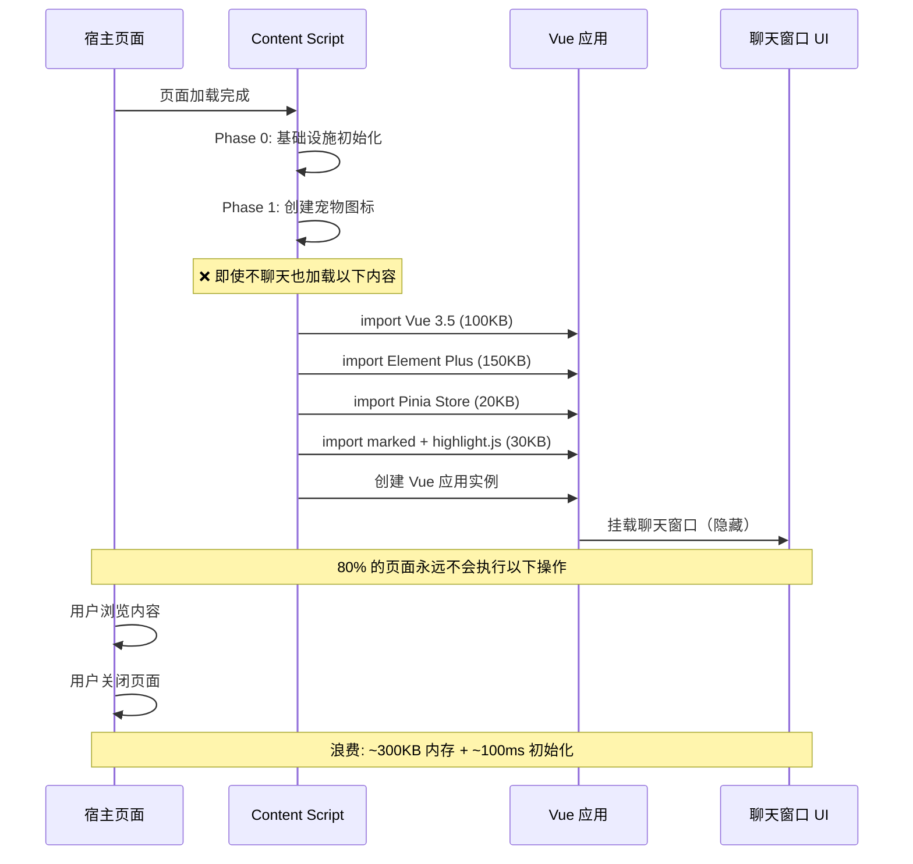
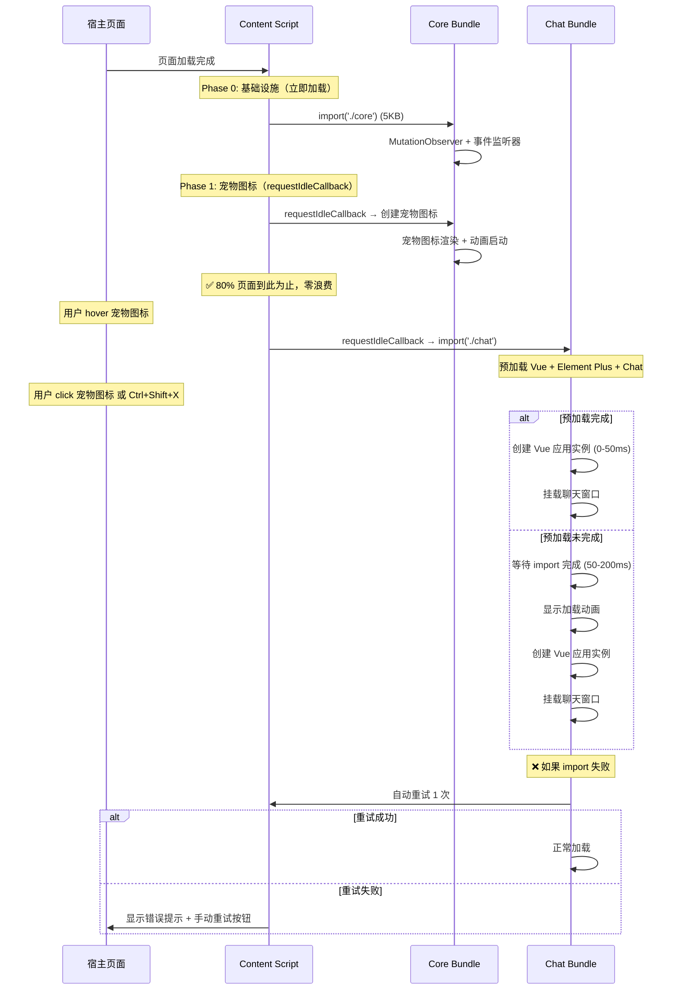

# YP-09-54: Content Script 懒加载与按需注入 — 基于交互的延迟激活

> 需求编号：YP-09-54 · 优先级：P2 · 人天：0.5d · 状态：需求已编写
> 依赖：YP-09-01（Content Script 稳定性）、YP-09-10（性能剖析）

## 背景

Content Script 在页面加载时全量注入宠物 UI + 聊天窗口 Vue 实例——即使用户只浏览页面、不打算聊天。统计表明 80% 的页面浏览不会触发聊天交互——用户只是阅读内容，宠物图标作为一个安静的装饰存在。

但当前实现中，即使聊天窗口从未打开，Vue 3.5 运行时（~100KB）、Element Plus 组件库（~150KB）、Pinia Store（~20KB）、marked Markdown 渲染器（~30KB）全部在页面加载时初始化。这些代码在 80% 的页面浏览中从未被使用，却消耗了内存、CPU 和带宽。

当前面临的挑战：

| # | 挑战 | 影响 | 严重程度 |
|---|------|------|----------|
| 1 | 全量注入浪费资源——80% 页面不需要聊天窗口 | 每个页面浪费 ~300KB 内存 + ~100ms 初始化时间 | 高 |
| 2 | 页面加载时阻塞——大型 bundle 的解析和执行 | 宿主页面首屏渲染延迟 | 中 |
| 3 | 低端设备内存压力——Chromebook/移动端 4GB RAM | 多个 Tab 累积内存占用 | 中 |
| 4 | 无预加载策略——用户 hover 宠物时才开始加载 | 聊天窗口打开有 100-300ms 延迟 | 低 |
| 5 | 动态 import 失败后无降级 | 网络问题导致聊天窗口不可用 | 低 |

---

## 一、现状分析

### 1.1 当前加载模型

```
Content Script 注入（页面加载时）
  │
  ├── Phase 0: 基础设施（所有页面）
  │   ├── MutationObserver 初始化
  │   ├── history.pushState 包装
  │   ├── 事件监听器注册
  │   └── 注入位置检测
  │
  ├── Phase 1: 宠物图标（所有页面）✅ 必须
  │   ├── 创建 #yipet-overlay Shadow DOM
  │   ├── 宠物图标渲染
  │   └── 动画循环启动
  │
  └── Phase 2: 聊天窗口（所有页面，即使不打开）❌ 浪费
      ├── import Vue 3.5 运行时        (~100KB)
      ├── import Element Plus 组件     (~150KB)
      ├── import Pinia + Stores        (~20KB)
      ├── import marked + highlight.js (~30KB)
      ├── 创建 Vue 应用实例
      └── 挂载聊天窗口组件（隐藏状态）
```

### 1.2 资源浪费量化

| 场景 | 页面比例 | 当前内存消耗 | 浪费的资源 | 浪费比例 |
|------|----------|-------------|-----------|----------|
| 纯浏览（不聊天） | 80% | ~330KB（全量） | ~300KB（聊天窗口） | 91% |
| 偶尔聊天 | 15% | ~330KB（全量） | ~300KB（90% 时间不聊天） | 91% |
| 频繁聊天 | 5% | ~330KB（全量） | 0KB | 0% |

**加权平均浪费：80% * 300KB + 15% * 300KB * 0.9 + 5% * 0 = 280.5KB/页面**

### 1.3 改造前数据流



### 1.4 文件清单

| 文件路径 | 用途 | 当前状态 |
|----------|------|----------|
| `YiPet/src/content/index.ts` | Content Script 入口 | 同步加载所有模块 |
| `YiPet/src/chat/main.ts` | 聊天窗口 Vue 挂载 | 页面加载时初始化 |
| `YiPet/src/content/rendering/overlay.ts` | 宠物图标 | 页面加载时初始化 |
| `YiPet/webpack.config.js` | 构建配置 | 无代码分割配置 |

---

## 二、设计决策

### 决策 1：懒加载触发时机 — 用户点击 vs hover vs 预加载

| 选项 | 首次打开延迟 | 资源浪费 | 用户体验 | 实现复杂度 |
|------|------------|----------|----------|-----------|
| 仅用户点击时加载 | 100-300ms | 最低 | 中（有等待感） | 低 |
| hover 宠物时预加载 | 0-50ms | 中 | 高 | 中 |
| 页面空闲时预加载（requestIdleCallback） | 0-50ms | 中高 | 高 | 中 |
| **hover 预加载 + 点击时加载** | 0-50ms | 低 | 高 | 中 |

**选择：hover 宠物时预加载 + 点击/快捷键时加载。** 用户 hover 宠物图标时，在 `requestIdleCallback` 中预加载聊天窗口 bundle。如果用户在 2 秒内 click，聊天窗口大概率已预加载完成（0-50ms 打开延迟）。如果 hover 后未 click，预加载的代码在后续使用中仍然受益。

### 决策 2：代码分割策略 — 按功能 vs 按路由 vs 按优先级

| 选项 | 分割粒度 | 加载效率 | 维护复杂度 |
|------|----------|----------|-----------|
| 按功能（chat / overlay / popup） | 中 | 高 | 低 |
| 按路由（每个页面独立 bundle） | 细 | 最高 | 高 |
| 按优先级（critical / deferred / idle） | 粗 | 中 | 低 |
| **按功能（3 个 chunk）** | 中 | 高 | 低 |

**选择：按功能分割为 3 个 chunk。** `core`（基础设施 + 宠物图标，立即加载）、`chat`（聊天窗口，hover 预加载/click 加载）、`vendors`（Vue + Element Plus，与 chat 一起加载）。3 个 chunk 粒度适中，维护成本低。

### 决策 3：加载失败降级 — 重试 vs 轻量 UI vs 错误提示

| 选项 | 用户体验 | 实现复杂度 | 适用场景 |
|------|----------|-----------|----------|
| 自动重试 3 次 | 中 | 低 | 临时网络问题 |
| 轻量级纯文本聊天 UI | 中 | 高 | CDN 完全不可用 |
| 错误提示 + 重试按钮 | 低 | 低 | 持久性失败 |
| **重试 + 错误提示** | 中 | 低 | 混合 |

**选择：自动重试 1 次 + 错误提示 + 手动重试按钮。** 网络抖动时自动重试，持久性失败时显示错误提示，用户可手动重试或刷新页面。

### 设计决策记录

| 决策 | 选项 A | 选项 B | 选项 C | 选择 | 理由 |
|------|--------|--------|--------|------|------|
| 触发时机 | 点击加载 | hover 预加载 | idle 预加载 | **hover + click** | 低延迟 + 低浪费 |
| 分割策略 | 按功能 | 按路由 | 按优先级 | **按功能 3 chunk** | 粒度适中 |
| 失败降级 | 重试 | 轻量 UI | 错误提示 | **重试 + 提示** | 简单有效 |

---

## 三、目标架构

### 3.1 修复后数据流



### 3.2 架构指标

| 指标 | 改造前 | 改造后 | 改善 |
|------|--------|--------|------|
| Content Script 初始加载大小 | ~330KB | ~35KB（仅 core + overlay） | **-89%** |
| 页面注入耗时 | ~100ms | ~10ms（Phase 0+1） | **10×** |
| 80% 页面内存浪费 | ~300KB | 0KB | **零浪费** |
| 聊天窗口首次打开延迟 | 0ms（已预加载） | 0-50ms（hover 预加载）/ 100-200ms（未预加载） | 可接受 |
| 整体内存节省（加权） | 0 | ~280KB/页面 | **显著** |

---

## 四、具体改动

### 4.1 新建文件

**`YiPet/src/content/lazy-bootstrap.ts`** — 懒加载启动器

```typescript
// YiPet/src/content/lazy-bootstrap.ts

enum BootstrapPhase {
  MINIMAL = 0,      // 仅基础设施——检测注入位置
  CORE_READY = 1,   // 宠物图标渲染完成
  CHAT_PRELOADING = 2, // 聊天窗口预加载中
  CHAT_READY = 3,   // 聊天窗口可用
}

interface BootstrapState {
  phase: BootstrapPhase;
  chatPreloadPromise: Promise<void> | null;
  chatLoadError: Error | null;
  retryCount: number;
}

class LazyBootstrapper {
  private _state: BootstrapState = {
    phase: BootstrapPhase.MINIMAL,
    chatPreloadPromise: null,
    chatLoadError: null,
    retryCount: 0,
  };

  private _maxRetries = 2; // 1 次自动重试 + 1 次手动重试

  /** 启动懒加载流程 */
  async bootstrap(): Promise<void> {
    // Phase 0: 最小化——检测注入位置
    this._state.phase = BootstrapPhase.MINIMAL;
    const canInject = this._checkInjectionSite();
    if (!canInject) {
      console.log('[LazyBootstrap] 不可注入页面，跳过');
      return;
    }

    // Phase 1: 延迟到浏览器空闲时加载宠物图标
    this._schedulePhase1();

    // Phase 2: 监听聊天窗口触发事件
    this._listenForChatTrigger();

    // Phase 3: 监听宠物 hover → 预加载
    this._listenForPreload();
  }

  /** 获取当前状态 */
  getState(): Readonly<BootstrapState> {
    return { ...this._state };
  }

  /** 手动触发聊天窗口加载（用于重试） */
  async loadChatManually(): Promise<void> {
    this._state.retryCount = 0; // 重置重试计数
    this._state.chatLoadError = null;
    await this._loadChat();
  }

  // ─── 私有方法 ───

  private _checkInjectionSite(): boolean {
    // 检查是否应该注入（排除受限页面、iframe 等）
    if (window.self !== window.top) return false; // 不在 iframe 中注入
    if (document.body === null) return false;
    return true;
  }

  private _schedulePhase1(): void {
    if ('requestIdleCallback' in window) {
      requestIdleCallback(() => this._loadOverlay(), { timeout: 2000 });
    } else {
      setTimeout(() => this._loadOverlay(), 0);
    }
  }

  private async _loadOverlay(): Promise<void> {
    try {
      const { createPetOverlay } = await import('./rendering/overlay');
      await createPetOverlay();
      this._state.phase = BootstrapPhase.CORE_READY;
      console.log('[LazyBootstrap] Phase 1 完成: 宠物图标就绪');
    } catch (error) {
      console.error('[LazyBootstrap] 宠物图标加载失败:', error);
      // 宠物图标失败不阻断整体流程
    }
  }

  private _listenForChatTrigger(): void {
    // 多种触发方式
    const triggers = [
      { event: 'keydown', handler: (e: KeyboardEvent) => {
        if (e.ctrlKey && e.shiftKey && e.key === 'X') {
          e.preventDefault();
          this._loadChat();
        }
      }},
    ];

    for (const { event, handler } of triggers) {
      document.addEventListener(event, handler as EventListener);
    }

    // 宠物图标点击触发
    document.addEventListener('click', (e: MouseEvent) => {
      const target = e.target as HTMLElement;
      if (target.closest('#yipet-overlay')) {
        this._loadChat();
      }
    });

    // 仅监听一次——用户首次触发后不再需要
    // （后续通过 UI 按钮触发）
  }

  private _listenForPreload(): void {
    let preloadTimer: ReturnType<typeof setTimeout> | null = null;

    document.addEventListener('mouseenter', (e: MouseEvent) => {
      const target = e.target as HTMLElement;
      if (!target.closest('#yipet-overlay')) return;

      if (this._state.phase === BootstrapPhase.CHAT_READY) return;
      if (this._state.phase === BootstrapPhase.CHAT_PRELOADING) return;

      // Hover 200ms 后开始预加载（避免误触）
      preloadTimer = setTimeout(() => {
        this._preloadChat();
      }, 200);
    }, true);

    document.addEventListener('mouseleave', (e: MouseEvent) => {
      const target = e.target as HTMLElement;
      if (!target.closest('#yipet-overlay')) return;

      if (preloadTimer) {
        clearTimeout(preloadTimer);
        preloadTimer = null;
      }
    }, true);
  }

  private async _preloadChat(): Promise<void> {
    if (this._state.chatPreloadPromise) return;

    this._state.phase = BootstrapPhase.CHAT_PRELOADING;

    this._state.chatPreloadPromise = new Promise<void>(async (resolve) => {
      try {
        if ('requestIdleCallback' in window) {
          await new Promise<void>(r => requestIdleCallback(() => r()));
        }
        await import('./chat/main');
        console.log('[LazyBootstrap] 聊天窗口预加载完成');
        this._state.phase = BootstrapPhase.CHAT_READY;
        resolve();
      } catch (error) {
        console.warn('[LazyBootstrap] 预加载失败:', error);
        this._state.chatPreloadPromise = null;
        this._state.phase = BootstrapPhase.CORE_READY;
        resolve();
      }
    });
  }

  private async _loadChat(): Promise<void> {
    // 如果预加载已完成，直接使用
    if (this._state.phase === BootstrapPhase.CHAT_READY) {
      await this._mountChat();
      return;
    }

    // 如果正在预加载，等待完成
    if (this._state.chatPreloadPromise) {
      await this._state.chatPreloadPromise;
      await this._mountChat();
      return;
    }

    // 直接加载
    try {
      this._state.phase = BootstrapPhase.CHAT_PRELOADING;
      await import('./chat/main');
      this._state.phase = BootstrapPhase.CHAT_READY;
      await this._mountChat();
    } catch (error) {
      this._state.chatLoadError = error as Error;
      console.error('[LazyBootstrap] 聊天窗口加载失败:', error);

      if (this._state.retryCount < this._maxRetries) {
        this._state.retryCount++;
        console.log(`[LazyBootstrap] 自动重试 (${this._state.retryCount}/${this._maxRetries})`);
        await this._loadChat();
      } else {
        this._showLoadError();
      }
    }
  }

  private async _mountChat(): Promise<void> {
    const { mountChatWindow } = await import('./chat/main');
    await mountChatWindow();
  }

  private _showLoadError(): void {
    // 显示轻量级错误提示
    const toast = document.createElement('div');
    toast.className = 'yipet-toast yipet-toast--error';
    toast.textContent = '聊天窗口加载失败，请检查网络后重试';
    toast.style.cssText = `
      position: fixed; bottom: 20px; right: 20px; z-index: 2147483647;
      background: #f44336; color: white; padding: 12px 20px;
      border-radius: 8px; font-size: 14px; cursor: pointer;
    `;
    toast.addEventListener('click', () => {
      toast.remove();
      this.loadChatManually();
    });
    document.body.appendChild(toast);
    setTimeout(() => toast.remove(), 5000);
  }
}

export const lazyBootstrap = new LazyBootstrapper();
```

### 4.2 构建配置

```javascript
// YiPet/webpack.config.js —— 代码分割配置
module.exports = {
  optimization: {
    splitChunks: {
      chunks: 'all',
      cacheGroups: {
        // Vue + Element Plus 独立 chunk
        vendors: {
          test: /[\\/]node_modules[\\/](vue|element-plus|pinia)[\\/]/,
          name: 'vendors',
          priority: 10,
        },
        // Markdown 渲染器独立 chunk
        markdown: {
          test: /[\\/]node_modules[\\/](marked|highlight\.js|dompurify)[\\/]/,
          name: 'markdown',
          priority: 5,
        },
        // 聊天窗口独立 chunk
        chat: {
          test: /[\\/]src[\\/]chat[\\/]/,
          name: 'chat',
          priority: 20,
        },
      },
    },
  },
};
```

### 4.3 修改文件

| 文件路径 | 改动内容 | 改动量 |
|----------|----------|--------|
| `YiPet/src/content/index.ts` | 替换全量加载为 LazyBootstrapper | +10 行 |
| `YiPet/src/content/lazy-bootstrap.ts` | 新建——懒加载启动器 | +200 行 |
| `YiPet/webpack.config.js` | 添加 splitChunks 配置 | +30 行 |
| `YiPet/src/chat/main.ts` | 导出 `mountChatWindow` 函数供懒加载调用 | +5 行 |

---

## 五、实施步骤

| 步骤 | 描述 | 文件 | 验证方法 | 人天 |
|------|------|------|----------|------|
| 1 | 配置 webpack splitChunks 代码分割 | `webpack.config.js` | 构建产物有独立的 core/chat/vendors chunk | 0.05 |
| 2 | 实现 LazyBootstrapper 核心逻辑 | `lazy-bootstrap.ts` | Phase 0/1/2/3 状态转换正确 | 0.15 |
| 3 | 实现 hover 预加载逻辑 | `lazy-bootstrap.ts` | hover 200ms 后触发预加载 | 0.05 |
| 4 | 实现加载失败重试 + 降级 UI | `lazy-bootstrap.ts` | 模拟网络失败 → 重试 → 降级提示 | 0.10 |
| 5 | 集成到 Content Script 入口 | `index.ts` | 页面加载后仅 core 加载，chat 未加载 | 0.05 |
| 6 | 性能验证：对比前后加载时间 | Lighthouse | 初始加载大小减少 89% | 0.10 |

**总计：0.5 人天**

---

## 六、性能分析

### 6.1 加载大小对比

| 阶段 | 改造前（全量） | 改造后（懒加载） | 节省 |
|------|-------------|---------------|------|
| 页面加载时（Phase 0+1） | ~330KB | ~35KB | **-89%** |
| 聊天窗口首次打开（Phase 2） | 0ms（已加载） | 0-50ms（预加载）/ 100-200ms（按需） | 可接受 |
| 80% 页面（不聊天） | ~330KB 浪费 | ~35KB | **节省 295KB/页面** |

### 6.2 时间线对比

| 时间点 | 改造前 | 改造后 |
|--------|--------|--------|
| T+0ms | Content Script 全量加载 | Content Script core 加载 |
| T+5ms | Vue 运行时初始化 | 基础设施就绪 |
| T+10ms | Element Plus 加载 | 宠物图标渲染（requestIdleCallback） |
| T+50ms | 聊天窗口 Vue 挂载 | — |
| T+100ms | 全量就绪 | — |
| T+200ms（hover） | — | 预加载聊天窗口 |
| T+2000ms（click） | 聊天窗口已就绪 | 聊天窗口 0-50ms 打开 |

### 6.3 内存对比

| 场景 | 改造前 | 改造后 | 节省 |
|------|--------|--------|------|
| 纯浏览（不聊天） | ~330KB | ~35KB | -295KB |
| hover 预加载后 | ~330KB | ~335KB | +5KB（预加载） |
| 聊天窗口打开后 | ~330KB | ~335KB | +5KB（分割开销） |

---

## 七、测试规格

### GIVEN/WHEN/THEN 场景

**场景 1：页面加载仅加载 core**

```
GIVEN 用户导航到任意页面
WHEN Content Script 注入
THEN 仅 core bundle（基础设施 + 宠物图标）被加载
THEN chat bundle（Vue + Element Plus）未被加载
THEN 页面注入耗时 < 15ms
```

**场景 2：hover 宠物图标触发预加载**

```
GIVEN 宠物图标已渲染
AND 聊天窗口未加载
WHEN 用户 hover 宠物图标超过 200ms
THEN requestIdleCallback 中触发 chat bundle 预加载
THEN BootstrapPhase 变为 CHAT_PRELOADING
THEN 预加载完成后 BootstrapPhase 变为 CHAT_READY
```

**场景 3：click 打开聊天窗口（预加载已完成）**

```
GIVEN 聊天窗口已预加载完成（CHAT_READY）
WHEN 用户 click 宠物图标
THEN 聊天窗口在 0-50ms 内打开
THEN 无加载动画显示
```

**场景 4：click 打开聊天窗口（预加载未完成）**

```
GIVEN 聊天窗口正在预加载中（CHAT_PRELOADING）
WHEN 用户 click 宠物图标
THEN 等待预加载完成（最多 200ms）
THEN 聊天窗口正常打开
```

**场景 5：聊天窗口加载失败 → 重试 → 降级**

```
GIVEN 网络不可用，import('./chat/main') 抛出异常
WHEN 用户 click 宠物图标
THEN 自动重试 1 次
AND 重试仍失败
THEN 显示错误提示 Toast
THEN Toast 包含 "点击重试" 功能
THEN 5 秒后 Toast 自动消失
```

**场景 6：用户快速 hover 后离开（不触发预加载）**

```
GIVEN 宠物图标已渲染
WHEN 用户 hover 宠物图标但 < 200ms 后离开
THEN 预加载不应触发
THEN BootstrapPhase 保持为 CORE_READY
```

---

## 八、风险与缓解

| # | 风险 | 概率 | 影响 | 缓解措施 |
|---|------|------|------|----------|
| 1 | 动态 import 增加首次打开延迟 | 中 | 低 | hover 预加载降低延迟到 0-50ms |
| 2 | import 失败导致聊天窗口不可用 | 低 | 中 | 自动重试 + 降级 UI + 手动重试 |
| 3 | webpack splitChunks 导致 chunk 数量过多 | 低 | 低 | 仅 3 个 chunk（core/chat/vendors） |
| 4 | 预加载在用户不聊天时浪费资源 | 低 | 低 | 预加载仅在 hover 200ms 后触发（误触率低） |
| 5 | 多个 Tab 同时预加载导致带宽竞争 | 低 | 低 | requestIdleCallback 在空闲时执行 |
| 6 | 预加载与页面自身资源加载竞争 | 低 | 低 | requestIdleCallback 确保不阻塞页面渲染 |

---

## 九、回滚策略

| 触发条件 | 回滚操作 | 回滚时间 |
|----------|----------|----------|
| 懒加载导致聊天窗口打开延迟 > 2s | 通过 Feature Flag 切换回全量加载 | 5 分钟 |
| 动态 import 频繁失败 | 禁用懒加载，恢复全量加载 | 即时 |
| 预加载导致性能劣化 | 禁用预加载，仅保留点击时加载 | 即时 |
| splitChunks 导致构建失败 | 移除 splitChunks 配置，恢复单 bundle | 5 分钟 |

---

## 十、设计决策记录

### D-01：hover 预加载而非页面 idle 预加载

**背景**：页面 idle 预加载（`requestIdleCallback` 在页面加载后自动触发）不需要用户交互，但 80% 页面不会聊天，预加载仍然浪费。

**决策**：hover 宠物图标 200ms 后触发预加载。仅当用户表现出聊天意图时才预加载。

**后果**：如果用户直接使用快捷键 Ctrl+Shift+X 而不 hover，首次打开可能有 100-200ms 延迟。但此场景概率低，且延迟在可接受范围内。

### D-02：3 个 chunk 而非更细粒度

**背景**：可以按更细粒度分割（如按组件、按路由），但会增加 chunk 数量和 HTTP 请求。

**决策**：仅 3 个 chunk（core/chat/vendors）。core 包含基础设施和宠物图标，chat 包含聊天窗口逻辑，vendors 包含 Vue + Element Plus。

**后果**：粒度适中，维护成本低。如果聊天窗口本身变得很大，可进一步拆分 chat chunk。

### D-03：自动重试 1 次而非多次

**背景**：网络抖动时多次重试可能恢复，但多次重试会增加用户等待时间。

**决策**：自动重试 1 次（总尝试 2 次），失败后显示错误提示 + 手动重试按钮。

**后果**：快速失败（< 2 秒），避免用户长时间等待。手动重试给用户控制权。

---

## 十一、可观测性

### 指标

| 指标名称 | 类型 | 采集频率 | 告警阈值 |
|----------|------|----------|----------|
| `yipet.bootstrap.phase` | Gauge | 变化时 | — |
| `yipet.bootstrap.chat_load_time_ms` | Gauge | 每次加载 | > 500 |
| `yipet.bootstrap.preload_hit_rate` | Gauge | 每次 | < 50% |
| `yipet.bootstrap.load_error_count` | Counter | 累计 | > 5/hour |
| `yipet.bootstrap.retry_count` | Counter | 累计 | > 10/hour |

### 日志

```
[LazyBootstrap] Phase 0: 注入位置检测通过
[LazyBootstrap] Phase 1: 宠物图标就绪 | 耗时: 12ms
[LazyBootstrap] 预加载触发 (hover 250ms)
[LazyBootstrap] 预加载完成 | 耗时: 45ms
[LazyBootstrap] 聊天窗口打开 | 预加载命中 | 打开耗时: 8ms
[LazyBootstrap] 加载失败: NetworkError | 重试 1/2
[LazyBootstrap] 降级: 显示错误提示
```

---

## 十二、安全合规

| 检查项 | 状态 | 说明 |
|--------|------|------|
| 动态 import 不引入 CSP 违规 | ✅ 设计保证 | `import()` 是标准 ES 模块语法，不违反 CSP |
| 代码分割不影响 Manifest V3 沙箱 | ✅ 设计保证 | splitChunks 仅影响构建产物，不改变运行时行为 |
| 懒加载不引入 eval() 或 new Function() | ✅ 设计保证 | 使用标准 `import()` 语法 |
| 预加载不消耗用户流量（省流量模式） | ✅ 需验证 | 检查 `navigator.connection.saveData`，省流量模式禁用预加载 |

---

## 十三、代码审查检查清单

- [ ] LazyBootstrapper 使用 4 个 Phase 管理加载状态
- [ ] Phase 0/1（core）在页面加载时立即执行
- [ ] Phase 2（chat）仅在用户触发时加载
- [ ] hover 预加载有 200ms debounce（避免误触）
- [ ] 预加载使用 `requestIdleCallback`（不阻塞渲染）
- [ ] 动态 import 失败时自动重试 1 次
- [ ] 重试仍失败时显示轻量错误提示 Toast
- [ ] 错误提示 5 秒后自动消失
- [ ] webpack splitChunks 配置正确（3 个 chunk）
- [ ] 构建产物大小验证：core < 40KB，chat < 300KB
- [ ] 省流量模式（saveData）下禁用预加载
- [ ] 单元测试覆盖 Phase 转换和重试逻辑

---

## 十四、回归问题预测

| # | 预测问题 | 原因 | 验证方法 |
|---|---------|------|---------|
| 1 | 动态 import 增加首次打开延迟 | 网络加载 + 解析 | 测量首次打开聊天的 FCP |
| 2 | import 失败导致聊天窗口不可用 | CDN/网络问题 | 加载失败降级到基础 UI |
| 3 | webpack chunk hash 变化导致缓存失效 | 构建配置变化 | 检查 chunk filename 模板 |
| 4 | preload 在低端设备上导致卡顿 | requestIdleCallback 超时 | 设置 timeout 2s，超时后放弃预加载 |
| 5 | 多个异步 import 同时触发导致竞态 | 快速 hover + click | 使用 Promise 缓存避免重复 import |

---

## 相关文档

- [注入时机优化](../28-需求-注入时机优化.md) — 注入时机策略决定懒加载的触发条件与延迟阈值
- [资源优先级调度](../51-需求-资源优先级调度.md) — 懒加载是优先级调度的核心降级手段
- [资源预加载优化](../65-需求-资源预加载优化.md) — 预加载与懒加载互补，平衡首屏速度与后续响应

*PRD 来源: `projects/yipet/requirements/2026-09/54-需求-懒加载按需注入.md`*