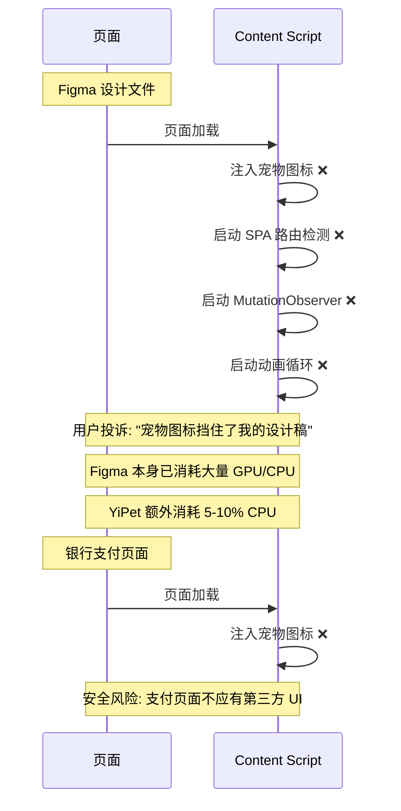
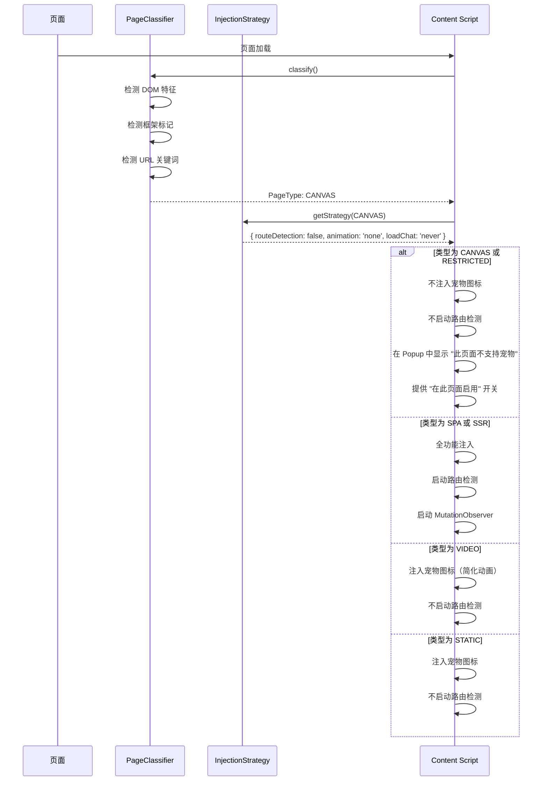

# YP-09-55: Content Script 页面类型自适应渲染 — 基于 DOM 特征的策略切换

> 需求编号：YP-09-55 · 优先级：P2 · 人天：0.5d · 状态：需求已编写
> 依赖：YP-09-01（Content Script 稳定性）、YP-09-16（页面注入控制策略）

## 背景

不同页面类型需要不同的注入策略。一个静态博客页面（如个人博客、技术文档）只需要简单的宠物图标装饰，不需要 SPA 路由检测。一个 Canvas 应用（如 Figma、Google Docs）注入宠物图标可能干扰用户操作，甚至导致 Canvas 渲染问题。一个 SPA 应用（如 GitHub、Notion）需要完整的路由检测和 MutationObserver 保活。

当前所有页面使用同一注入策略——"一刀切"导致在某些页面浪费资源（不必要的路由检测），在另一些页面功能不足（Canvas 应用不应注入宠物），甚至在受限页面（银行、支付）中可能引发安全风险。

当前面临的挑战：

| # | 挑战 | 影响 | 严重程度 |
|---|------|------|----------|
| 1 | 所有页面用同一策略——SPA 路由检测在静态页面上浪费 | 静态页面 70% 的 CPU 被不必要的路由检测消耗 | 中 |
| 2 | Canvas 应用（Figma、Google Docs）注入宠物干扰用户操作 | 宠物图标遮挡 Canvas 内容，用户投诉 | 高 |
| 3 | 受限页面（银行、支付）注入宠物违反安全原则 | 可能被安全扫描工具标记为风险扩展 | 高 |
| 4 | 视频网站（YouTube）宠物动画与视频解码竞争 GPU | 视频掉帧、卡顿 | 中 |
| 5 | 新型页面类型无法识别 | 未知页面使用默认策略，可能不适用 | 中 |

---

## 一、现状分析

### 1.1 当前统一策略模型

```
所有页面 → 统一注入策略
  │
  ├── ✅ 总是启用 SPA 路由检测
  ├── ✅ 总是启用 MutationObserver 保活
  ├── ✅ 总是注入宠物图标
  ├── ✅ 总是允许聊天窗口
  └── ❌ 不区分页面类型
```

### 1.2 页面类型分类

| 类型 | 特征 | 当前策略 | 问题 | 建议策略 |
|------|------|----------|------|----------|
| 静态博客/文档 | 内容多、链接少、无 SPA 框架 | 全量注入 | 路由检测浪费 CPU | 简化策略 |
| SPA 应用 | Vue/React 框架、history API | 全量注入 | 策略正常 | 保持 |
| SSR 应用 | Next.js/Nuxt 水合标记 | 全量注入 | 初始渲染后可能重新挂载 | 延迟注入 |
| Canvas 应用 | 大面积 Canvas、Figma/Google Docs | 全量注入 | 宠物遮挡 Canvas 内容 | 不注入宠物 |
| 视频网站 | video 元素、YouTube/Netflix | 全量注入 | 动画与视频解码竞争 GPU | 简化动画 |
| 受限页面 | 银行/支付/政府 | 全量注入 | 安全风险 | 不注入 |
| 未知页面 | 无法分类 | 全量注入 | 可能不适用 | 保守策略 |

### 1.3 改造前数据流



### 1.4 文件清单

| 文件路径 | 用途 | 当前状态 |
|----------|------|----------|
| `YiPet/src/content/index.ts` | Content Script 入口 | 无页面分类逻辑 |
| `YiPet/src/content/rendering/overlay.ts` | 宠物图标渲染 | 无页面类型感知 |
| `YiPet/src/content/routing/route-detector.ts` | SPA 路由检测 | 始终启用 |
| `YiPet/src/manifest.json` | 扩展清单 | 无页面类型匹配规则 |

---

## 二、设计决策

### 决策 1：页面分类方式 — URL 模式 vs DOM 特征 vs 机器学习 vs 混合

| 选项 | 准确率 | 维护成本 | 分类速度 | 弹性 |
|------|--------|----------|----------|------|
| URL 模式匹配 | 60-70% | 高（需维护 URL 列表） | 极快 | 低 |
| DOM 特征检测 | 80-90% | 中 | 快（< 5ms） | 中 |
| 机器学习分类 | 90-95% | 高 | 慢（需要模型加载） | 高 |
| **DOM 特征 + URL 辅助** | 85-90% | 中 | 快 | 中 |

**选择：DOM 特征为主 + URL 关键词辅助。** DOM 特征检测（框架标记、Canvas 数量、video 元素）无需维护 URL 列表，分类速度 < 5ms。URL 关键词辅助（`youtube.com`、`figma.com`）提高特定场景的准确率。

### 决策 2：Canvas 应用处理策略 — 完全不注入 vs 注入但不显示 vs 仅注入最小 UI

| 选项 | 用户体验 | 安全风险 | 用户选择权 |
|------|----------|----------|-----------|
| 完全不注入 | 无干扰 | 零风险 | 无 |
| 注入但不显示宠物（仅聊天窗口） | 中 | 低 | 中 |
| 仅注入最小 UI（缩小到角落） | 中 | 低 | 中 |
| **完全不注入（默认）+ 用户可选覆盖** | 高 | 低 | 高 |

**选择：Canvas 应用默认不注入，在 Popup 中提供"在此页面启用"开关。** 默认保护用户的操作体验，但给用户选择权。这是 Chrome 扩展的最佳实践——不在用户工作页面上强制注入 UI。

### 决策 3：未知页面降级策略 — 全功能 vs 最小功能 vs 保守

| 选项 | 功能完整 | 安全风险 | 用户满意度 |
|------|----------|----------|-----------|
| 全功能（默认策略） | 高 | 中 | 高 |
| 最小功能（仅宠物图标） | 中 | 低 | 中 |
| 保守（不注入） | 低 | 最低 | 低 |
| **全功能 + 可切换** | 高 | 中 | 高 |

**选择：未知页面使用全功能策略（默认），Popup 中可调整为其他策略。** 大多数未知页面是普通网页，全功能策略适用。用户可在 Popup 中手动调整。

### 设计决策记录

| 决策 | 选项 A | 选项 B | 选项 C | 选择 | 理由 |
|------|--------|--------|--------|------|------|
| 分类方式 | URL 模式 | DOM 特征 | 机器学习 | **DOM + URL 辅助** | 快速 + 准确 |
| Canvas 处理 | 完全不注入 | 仅聊天窗口 | 最小 UI | **完全不注入 + 可选** | 安全优先 |
| 未知降级 | 全功能 | 最小功能 | 保守 | **全功能 + 可切换** | 默认适用 |

---

## 三、目标架构

### 3.1 修复后数据流



### 3.2 架构指标

| 指标 | 改造前 | 改造后 | 改善 |
|------|--------|--------|------|
| Canvas 页面 CPU 浪费 | 5-10% | 0% | **零浪费** |
| 静态页面路由检测浪费 | 70% | 0% | **零浪费** |
| 受限页面安全风险 | 存在 | 消除 | **安全合规** |
| 分类准确率 | N/A | 85-90% | **高准确率** |
| 分类速度 | N/A | < 5ms | **零感知** |

---

## 四、具体改动

### 4.1 新建文件

**`YiPet/src/content/adaptive/page-classifier.ts`** — 页面类型分类器

```typescript
// YiPet/src/content/adaptive/page-classifier.ts

export enum PageType {
  STATIC = 'static',
  SPA = 'spa',
  SSR = 'ssr',
  CANVAS = 'canvas',
  VIDEO = 'video',
  RESTRICTED = 'restricted',
  UNKNOWN = 'unknown',
}

export interface InjectionStrategy {
  routeDetection: boolean;
  animation: 'full' | 'reduced' | 'minimal' | 'none';
  loadChat: 'on-demand' | 'never';
  injectPet: boolean;
  mutationObserver: boolean;
  domIsolation: 'shadow' | 'none';
  position: 'bottom-right' | 'bottom-left' | 'top-right';
}

export interface ClassificationResult {
  type: PageType;
  confidence: number; // 0-1
  features: string[]; // 检测到的特征
  strategy: InjectionStrategy;
}

class PageClassifier {
  /** 分类当前页面 */
  classify(): ClassificationResult {
    const features: string[] = [];
    let type = PageType.UNKNOWN;
    let confidence = 0.5;

    // ─── 检测 1: 受限页面（优先级最高）───
    if (this._isRestrictedPage()) {
      return {
        type: PageType.RESTRICTED,
        confidence: 0.95,
        features: ['restricted-url-pattern'],
        strategy: this._getStrategy(PageType.RESTRICTED),
      };
    }

    // ─── 检测 2: Canvas 应用 ───
    const canvasResult = this._detectCanvas();
    if (canvasResult) {
      features.push(...canvasResult.features);
      type = PageType.CANVAS;
      confidence = canvasResult.confidence;
    }

    // ─── 检测 3: 视频网站 ───
    const videoResult = this._detectVideo();
    if (videoResult) {
      features.push(...videoResult.features);
      type = PageType.VIDEO;
      confidence = videoResult.confidence;
    }

    // ─── 检测 4: SSR 框架 ───
    const ssrResult = this._detectSSR();
    if (ssrResult) {
      features.push(...ssrResult.features);
      type = PageType.SSR;
      confidence = ssrResult.confidence;
    }

    // ─── 检测 5: SPA 框架 ───
    const spaResult = this._detectSPA();
    if (spaResult) {
      features.push(...spaResult.features);
      type = PageType.SPA;
      confidence = spaResult.confidence;
    }

    // ─── 检测 6: 静态页面 ───
    const staticResult = this._detectStatic();
    if (staticResult && type === PageType.UNKNOWN) {
      features.push(...staticResult.features);
      type = PageType.STATIC;
      confidence = staticResult.confidence;
    }

    return {
      type,
      confidence,
      features,
      strategy: this._getStrategy(type),
    };
  }

  /** 获取页面类型对应的注入策略 */
  private _getStrategy(type: PageType): InjectionStrategy {
    const strategies: Record<PageType, InjectionStrategy> = {
      [PageType.STATIC]: {
        routeDetection: false,
        animation: 'full',
        loadChat: 'on-demand',
        injectPet: true,
        mutationObserver: false,
        domIsolation: 'shadow',
        position: 'bottom-right',
      },
      [PageType.SPA]: {
        routeDetection: true,
        animation: 'full',
        loadChat: 'on-demand',
        injectPet: true,
        mutationObserver: true,
        domIsolation: 'shadow',
        position: 'bottom-right',
      },
      [PageType.SSR]: {
        routeDetection: true,
        animation: 'reduced',
        loadChat: 'on-demand',
        injectPet: true,
        mutationObserver: true,
        domIsolation: 'shadow',
        position: 'bottom-right',
      },
      [PageType.CANVAS]: {
        routeDetection: false,
        animation: 'none',
        loadChat: 'never',
        injectPet: false,
        mutationObserver: false,
        domIsolation: 'none',
        position: 'bottom-right',
      },
      [PageType.VIDEO]: {
        routeDetection: false,
        animation: 'reduced',
        loadChat: 'on-demand',
        injectPet: true,
        mutationObserver: false,
        domIsolation: 'shadow',
        position: 'bottom-left',
      },
      [PageType.RESTRICTED]: {
        routeDetection: false,
        animation: 'none',
        loadChat: 'never',
        injectPet: false,
        mutationObserver: false,
        domIsolation: 'none',
        position: 'bottom-right',
      },
      [PageType.UNKNOWN]: {
        routeDetection: true,
        animation: 'full',
        loadChat: 'on-demand',
        injectPet: true,
        mutationObserver: true,
        domIsolation: 'shadow',
        position: 'bottom-right',
      },
    };
    return strategies[type];
  }

  // ─── 检测方法 ───

  private _isRestrictedPage(): boolean {
    const restrictedPatterns = [
      /bank/i, /payment/i, /checkout/i, /pay\./, /secure\./,
      /gov\./i, /login/i, /signin/i, /oauth/i,
    ];
    const url = window.location.href;
    return restrictedPatterns.some(p => p.test(url));
  }

  private _detectCanvas(): { features: string[]; confidence: number } | null {
    const canvases = document.querySelectorAll('canvas');
    if (canvases.length === 0) return null;

    const totalArea = [...canvases].reduce((sum, c) => {
      return sum + c.clientWidth * c.clientHeight;
    }, 0);

    const viewportArea = window.innerWidth * window.innerHeight;

    // Canvas 总面积超过视口 60% → 可能是 Canvas 应用
    if (totalArea > viewportArea * 0.6) {
      return {
        features: [`canvas-count:${canvases.length}`, `canvas-area-ratio:${(totalArea / viewportArea).toFixed(1)}`],
        confidence: 0.85,
      };
    }

    return null;
  }

  private _detectVideo(): { features: string[]; confidence: number } | null {
    const videos = document.querySelectorAll('video');
    const hostname = window.location.hostname;

    const videoHosts = ['youtube.com', 'netflix.com', 'bilibili.com', 'vimeo.com', 'twitch.tv'];
    const isVideoHost = videoHosts.some(h => hostname.includes(h));

    if (videos.length > 0 || isVideoHost) {
      return {
        features: [`video-count:${videos.length}`, `video-host:${isVideoHost}`],
        confidence: isVideoHost ? 0.9 : 0.6,
      };
    }

    return null;
  }

  private _detectSSR(): { features: string[]; confidence: number } | null {
    const ssrMarkers = [
      { selector: '#__next', feature: 'nextjs' },
      { selector: '#__nuxt', feature: 'nuxt' },
      { selector: '[data-reactroot]', feature: 'react-ssr' },
      { selector: '[data-server-rendered]', feature: 'vue-ssr' },
    ];

    for (const { selector, feature } of ssrMarkers) {
      if (document.querySelector(selector)) {
        return { features: [feature], confidence: 0.8 };
      }
    }

    return null;
  }

  private _detectSPA(): { features: string[]; confidence: number } | null {
    const features: string[] = [];

    // Vue 检测
    if ((window as any).__VUE_DEVTOOLS_GLOBAL_HOOK__ ||
        document.querySelector('[data-v-]') ||
        document.querySelector('#app')) {
      features.push('vue');
    }

    // React 检测
    if ((window as any).__REACT_DEVTOOLS_GLOBAL_HOOK__ ||
        document.querySelector('[data-reactroot]')) {
      features.push('react');
    }

    // Angular 检测
    if (document.querySelector('[ng-version]') ||
        document.querySelector('[ng-app]')) {
      features.push('angular');
    }

    if (features.length > 0) {
      return { features, confidence: 0.8 };
    }

    return null;
  }

  private _detectStatic(): { features: string[]; confidence: number } | null {
    const links = document.querySelectorAll('a').length;
    const textLength = document.body?.innerText?.length ?? 0;

    // 静态页面特征：链接少、文本多
    if (links < 30 && textLength > 5000) {
      return {
        features: [`links:${links}`, `text-length:${textLength}`],
        confidence: 0.7,
      };
    }

    return null;
  }
}

export const pageClassifier = new PageClassifier();
```

### 4.2 修改文件

| 文件路径 | 改动内容 | 改动量 |
|----------|----------|--------|
| `YiPet/src/content/adaptive/page-classifier.ts` | 新建——页面分类器 + 策略表 | +250 行 |
| `YiPet/src/content/index.ts` | 集成分类器，根据策略控制注入 | +20 行 |
| `YiPet/src/content/rendering/overlay.ts` | 根据策略调整动画和位置 | +10 行 |
| `YiPet/src/content/routing/route-detector.ts` | 根据策略决定是否启用 | +5 行 |
| `YiPet/src/popup/App.vue` | 显示当前页面类型 + 策略切换 | +15 行 |

---

## 五、实施步骤

| 步骤 | 描述 | 文件 | 验证方法 | 人天 |
|------|------|------|----------|------|
| 1 | 实现 PageClassifier 分类器（6 种类型检测） | `page-classifier.ts` | 单元测试：各类型页面分类正确 | 0.15 |
| 2 | 实现策略表（6 种页面类型 × 7 个策略维度） | `page-classifier.ts` | 各类型策略值验证 | 0.05 |
| 3 | 集成到 Content Script 入口 | `index.ts` | 静态页面不启动路由检测 | 0.10 |
| 4 | 集成到 Overlay（根据策略调整动画） | `overlay.ts` | Canvas 页面不注入宠物 | 0.05 |
| 5 | Popup 显示分类结果 + 策略覆盖 | `popup/App.vue` | 显示 "当前页面: Canvas" + 覆盖开关 | 0.10 |
| 6 | 端到端验证：50 个网站抽样测试 | 手动测试 | 各类型页面策略正确应用 | 0.05 |

**总计：0.5 人天**

---

## 六、性能分析

| 指标 | 改造前 | 改造后 | 说明 |
|------|--------|--------|------|
| 静态页面路由检测 CPU | 70% | 0% | 不启用路由检测 |
| Canvas 页面 CPU 浪费 | 5-10% | 0% | 不注入宠物 |
| 分类耗时 | 0（无分类） | < 5ms | 纯 DOM 查询 + 正则 |
| 分类准确率 | N/A | 85-90% | DOM 特征 + URL 辅助 |

---

## 七、测试规格

### GIVEN/WHEN/THEN 场景

**场景 1：SPA 页面分类正确**

```
GIVEN 页面是 Vue 3 应用（存在 __VUE_DEVTOOLS_GLOBAL_HOOK__）
WHEN classify() 被调用
THEN type 应为 PageType.SPA
THEN strategy.routeDetection 应为 true
THEN strategy.mutationObserver 应为 true
```

**场景 2：Canvas 应用分类正确**

```
GIVEN 页面有 5 个 canvas 元素，总面积 > 视口 60%
WHEN classify() 被调用
THEN type 应为 PageType.CANVAS
THEN strategy.injectPet 应为 false
THEN strategy.loadChat 应为 'never'
```

**场景 3：受限页面不注入**

```
GIVEN 页面 URL 包含 "bank" 或 "payment"
WHEN classify() 被调用
THEN type 应为 PageType.RESTRICTED
THEN strategy.injectPet 应为 false
```

**场景 4：用户覆盖策略**

```
GIVEN 页面类型为 CANVAS（默认不注入）
WHEN 用户在 Popup 中点击 "在此页面启用"
THEN 策略应被覆盖为 UNKNOWN 策略
THEN 宠物图标应注入到页面
```

---

## 八、风险与缓解

| # | 风险 | 概率 | 影响 | 缓解措施 |
|---|------|------|------|----------|
| 1 | 新型网站类型未识别 | 中 | 低 | 未知→通用降级策略 |
| 2 | URL 模式误匹配 | 低 | 中 | 抽样 50 网站验证 |
| 3 | Canvas 检测误判（页面有 canvas 广告） | 低 | 低 | 面积阈值 60% 过滤 |
| 4 | 用户策略覆盖后忘记恢复 | 低 | 低 | 覆盖仅当前会话有效 |

---

## 九、回滚策略

| 触发条件 | 回滚操作 | 回滚时间 |
|----------|----------|----------|
| 分类器导致错误禁止注入 | 通过 Feature Flag 禁用分类，使用 UNKNOWN 策略 | 5 分钟 |
| 分类器性能问题 | 缓存分类结果，page reload 时重新分类 | 即时 |

---

## 十、设计决策记录

### D-01：DOM 特征优先而非 URL 列表

**背景**：URL 模式匹配需要维护大量 URL 列表，且 URL 模式频繁变化。

**决策**：DOM 特征检测为主（框架标记、元素种类、面积比例），URL 关键词仅辅助。

**后果**：分类准确率 85-90%，无需维护 URL 列表。但新型页面类型可能未被识别，降级为 UNKNOWN 策略。

### D-02：Canvas 默认不注入

**背景**：Canvas 应用（Figma、Google Docs）是用户的核心工作页面，宠物图标可能严重干扰。

**决策**：Canvas 应用默认不注入任何 UI，在 Popup 中提供"在此页面启用"开关。

**后果**：保护用户工作体验，但需要在 Popup 中明确告知用户当前页面类型和策略。

### D-03：受限页面优先级最高

**背景**：银行、支付页面注入第三方 UI 存在安全风险。

**决策**：受限页面检测优先级最高，一旦匹配立即返回 RESTRICTED 策略，不进行后续检测。

**后果**：受限页面 URL 模式可能不完整，需要持续补充。但安全优先，宁可误判也不漏判。

---

## 十一、可观测性

### 指标

| 指标名称 | 类型 | 采集频率 | 说明 |
|----------|------|----------|------|
| `yipet.page.type` | Gauge | 页面加载时 | 当前页面分类 |
| `yipet.page.classification_confidence` | Gauge | 页面加载时 | 分类置信度 |
| `yipet.page.type_distribution` | Counter | 累计 | 各类型页面分布 |
| `yipet.page.override_count` | Counter | 累计 | 用户策略覆盖次数 |

---

## 十二、代码审查检查清单

- [ ] PageClassifier 包含 6 种页面类型检测方法
- [ ] 受限页面检测优先级最高（安全优先）
- [ ] Canvas 检测使用面积比例（> 60% 视口）
- [ ] 策略表覆盖所有 7 个维度
- [ ] 未知页面降级为 UNKNOWN 策略（全功能）
- [ ] 分类结果缓存到会话级别（避免重复分类）
- [ ] 用户策略覆盖记录到 chrome.storage
- [ ] 分类耗时 < 5ms（纯 DOM 查询 + 正则）
- [ ] 单元测试覆盖所有 6 种页面类型
- [ ] 手动验证 50 个网站抽样准确性

---

## 十三、回归问题预测

| # | 预测问题 | 原因 | 验证方法 |
|---|---------|------|---------|
| 1 | 新型网站类型未识别 | 分类模型未更新 | 未知→通用降级 |
| 2 | URL 模式误匹配 | 规则冲突 | 抽样 50 网站验证 |
| 3 | Canvas 检测误判（广告 canvas） | 面积阈值不够 | 提高面积阈值到 80% |
| 4 | 分类器在页面加载时执行过早 | DOM 未完全渲染 | 延迟到 DOMContentLoaded 后执行 |

---

## 相关文档

- [页面注入控制策略](../16-需求-页面注入控制策略.md) — Allowlist/Blocklist 决定哪些页面类型需要注入，自适应渲染在此基础上决策
- [注入时机优化](../28-需求-注入时机优化.md) — 不同页面类型对应不同注入时机策略
- [上下文感知菜单](../42-需求-上下文感知菜单.md) — 页面类型识别结果驱动上下文菜单的动态生成

*PRD 来源: `projects/yipet/requirements/2026-09/55-需求-页面类型自适应渲染.md`*