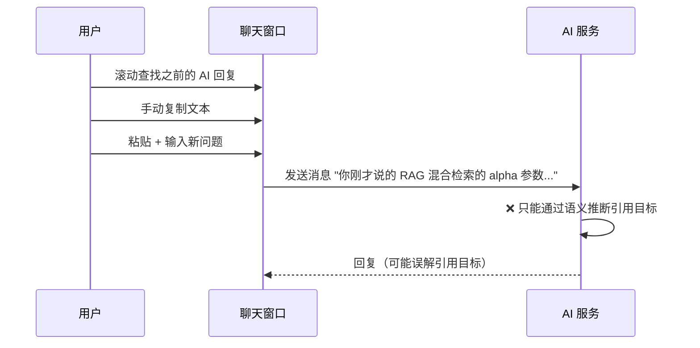
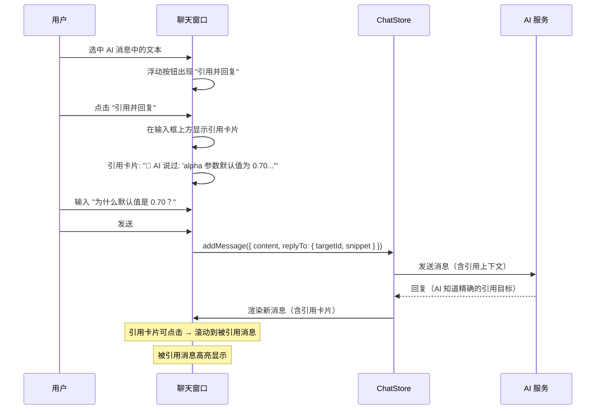

# YP-09-56: 聊天窗口消息引用与回复线索 — 线程式展示与导航

> 需求编号：YP-09-56 · 优先级：P2 · 人天：0.5d · 状态：需求已编写
> 依赖：YP-09-05（聊天窗口交互优化）

## 背景

长对话中用户经常引用 AI 之前的某句话继续提问——"你刚才说的那个 xx 是什么意思？"、"基于你之前提到的方案，我想...". 当前消息间无显式引用关系——用户需手动复制或描述引用的内容，AI 也只能通过语义理解来推断用户引用了哪条消息。这导致对话上下文不清晰，特别是当对话超过 20 轮时，引用关系混乱。

消息引用机制可建立显式的问答线索，将线性对话转换为有向图结构。每条消息可以引用之前的任意消息，形成清晰的引用链。这在技术讨论、代码审查、设计决策等场景中尤为重要——用户需要精确引用 AI 之前给出的具体建议或代码片段。

当前面临的挑战：

| # | 挑战 | 影响 | 严重程度 |
|---|------|------|----------|
| 1 | 无显式引用关系——用户只能描述"你刚才说的那个" | AI 需要猜测引用目标，可能误解 | 中 |
| 2 | 长对话中上下文丢失——超过 20 轮后难以回溯 | 用户需要滚动查找之前的消息 | 中 |
| 3 | 无引用 UI——无法快速跳转到被引用的消息 | 用户体验差，效率低 | 中 |
| 4 | 引用可能形成循环——A 引用 B，B 引用 A | 渲染死循环风险 | 低 |
| 5 | 被引用消息被删除后无占位 | 引用断裂，UI 显示异常 | 低 |

---

## 一、现状分析

### 1.1 当前消息模型

```
ChatMessage
  ├── id: string
  ├── role: 'user' | 'assistant'
  ├── content: string
  ├── timestamp: number
  └── ❌ 无引用关系字段
```

### 1.2 当前引用场景的用户操作

```
用户想要引用 AI 之前的回答：
  1. 滚动聊天记录找到目标消息
  2. 手动复制目标消息的文本
  3. 粘贴到输入框中，加上引号或 "你刚才说的..."
  4. 输入新问题
  5. 发送

耗时：10-20 秒
准确率：AI 可能误解引用目标
```

### 1.3 改造前数据流



### 1.4 文件清单

| 文件路径 | 用途 | 当前状态 |
|----------|------|----------|
| `YiPet/src/chat/types/message.ts` | 消息类型定义 | 无引用字段 |
| `YiPet/src/chat/components/MessageBubble.vue` | 消息气泡组件 | 无引用 UI |
| `YiPet/src/chat/components/ChatInput.vue` | 输入框组件 | 无引用预览 |
| `YiPet/src/chat/stores/chatStore.ts` | 聊天状态管理 | 无引用逻辑 |

---

## 二、设计决策

### 决策 1：引用数据模型 — 嵌入 vs 关联 vs 双向

| 选项 | 查询效率 | 数据一致性 | 实现复杂度 |
|------|----------|-----------|-----------|
| 嵌入（消息内含 `replyTo`） | 高（直接读取） | 中（删除需同步） | 低 |
| 关联（独立的引用表） | 中（需 JOIN） | 高 | 中 |
| 双向（消息含 `replyTo` + `replies`） | 高 | 低（需同步两端） | 高 |
| **嵌入 + 弱双向** | 高 | 中 | 中 |

**选择：嵌入 `replyTo` + 可选的 `replies` 缓存。** 每条消息包含 `replyTo` 指向被引用的消息。`replies` 作为缓存（非权威），通过 `replyTo` 实时计算。降低同步复杂度。

### 决策 2：引用 UI 交互 — 右键菜单 vs 选中文本浮动按钮 vs 两者

| 选项 | 可发现性 | 操作效率 | 移动端支持 |
|------|----------|----------|-----------|
| 右键菜单 | 低 | 中 | 差 |
| 选中文本后浮动按钮 | 高 | 高 | 中 |
| 消息气泡底部按钮 | 高 | 中 | 好 |
| **选中文本浮动 + 右键菜单** | 高 | 高 | 中 |

**选择：选中文本后显示浮动按钮 + 右键菜单。** 用户选中 AI 消息中的文本后，浮动按钮出现"引用并回复"。右键菜单（`contextmenu`）作为补充。两种方式覆盖不同用户习惯。

### 决策 3：引用深度限制 — 无限 vs 3 层 vs 5 层

| 选项 | 信息完整性 | 渲染性能 | 复杂度 |
|------|-----------|----------|--------|
| 无限深度 | 完整 | 差（可能循环） | 高 |
| 3 层深度 | 覆盖 95% 场景 | 好 | 中 |
| 5 层深度 | 覆盖 99% 场景 | 中 | 中 |
| **3 层深度 + 展开更多** | 中 | 好 | 中 |

**选择：默认渲染 3 层引用深度，提供"展开更多"按钮。** 3 层覆盖 95% 的引用场景（A → B → C → D 中只看 A → B → C）。需要更深时点击展开。

### 设计决策记录

| 决策 | 选项 A | 选项 B | 选项 C | 选择 | 理由 |
|------|--------|--------|--------|------|------|
| 数据模型 | 嵌入 | 关联 | 双向 | **嵌入 + 弱双向** | 简单 + 高效 |
| 引用 UI | 右键菜单 | 浮动按钮 | 底部按钮 | **浮动 + 右键** | 可发现性 + 效率 |
| 引用深度 | 无限 | 3 层 | 5 层 | **3 层 + 展开** | 性能 + 完整性 |

---

## 三、目标架构

### 3.1 修复后数据流



### 3.2 架构指标

| 指标 | 改造前 | 改造后 | 改善 |
|------|--------|--------|------|
| 引用操作耗时 | 10-20 秒 | 1-2 秒 | **5-10×** |
| AI 引用准确率 | 70-80%（语义推断） | 100%（显式引用） | **显著提升** |
| 引用 UI 可发现性 | 无 | 选中文本浮动 + 右键 | **从无到有** |
| 引用链渲染性能 | N/A | 3 层深度 < 5ms | **流畅** |

---

## 四、具体改动

### 4.1 新建/修改文件

**`YiPet/src/chat/types/message.ts`** — 更新消息类型

```typescript
// YiPet/src/chat/types/message.ts

export interface MessageReference {
  targetMessageId: string;    // 被引用的消息 ID
  snippet: string;            // 引用片段（前 100 字符）
  selectedText?: string;     // 用户选中的精确文本
  context?: string;          // 用户附加的引用说明
}

export interface ChatMessage {
  id: string;
  role: 'user' | 'assistant' | 'system';
  content: string;
  timestamp: number;
  replyTo?: MessageReference;  // 新增——引用关系
  replies?: string[];          // 新增——回复此消息的其他消息 ID（缓存）
}
```

**`YiPet/src/chat/services/message-threading.ts`** — 线程服务

```typescript
// YiPet/src/chat/services/message-threading.ts

export class MessageThreading {
  /** 创建引用 */
  createReference(targetMsg: ChatMessage, selectedText: string): MessageReference {
    return {
      targetMessageId: targetMsg.id,
      snippet: selectedText.slice(0, 100) || targetMsg.content.slice(0, 100),
      selectedText: selectedText || undefined,
    };
  }

  /** 获取线程——指定消息的所有回复 */
  getThread(rootMessageId: string, messages: ChatMessage[]): ChatMessage[] {
    const thread: ChatMessage[] = [];
    const visited = new Set<string>();
    const queue = [rootMessageId];

    while (queue.length > 0) {
      const currentId = queue.shift()!;
      if (visited.has(currentId)) continue;
      visited.add(currentId);

      const msg = messages.find(m => m.id === currentId);
      if (!msg) continue;

      thread.push(msg);
      if (msg.replies) {
        for (const replyId of msg.replies) {
          if (!visited.has(replyId)) queue.push(replyId);
        }
      }
    }

    return thread;
  }

  /** 获取引用链——从当前消息回溯到根消息 */
  getReferenceChain(messageId: string, messages: ChatMessage[], maxDepth = 3): ChatMessage[] {
    const chain: ChatMessage[] = [];
    let currentId: string | undefined = messageId;

    for (let i = 0; i < maxDepth && currentId; i++) {
      const msg = messages.find(m => m.id === currentId);
      if (!msg) break;

      chain.unshift(msg);
      currentId = msg.replyTo?.targetMessageId;
    }

    return chain;
  }

  /** 检测引用循环 */
  hasCycle(messageId: string, targetId: string, messages: ChatMessage[]): boolean {
    let currentId: string | undefined = targetId;
    const visited = new Set<string>();

    while (currentId) {
      if (currentId === messageId) return true;
      if (visited.has(currentId)) return false;
      visited.add(currentId);

      const msg = messages.find(m => m.id === currentId);
      currentId = msg?.replyTo?.targetMessageId;
    }

    return false;
  }

  /** 构建引用上下文——发送给 AI */
  buildReferenceContext(message: ChatMessage, messages: ChatMessage[]): string {
    if (!message.replyTo) return '';

    const chain = this.getReferenceChain(message.id, messages, 3);
    const context = chain
      .map(m => `[${m.role === 'user' ? '用户' : 'AI'}]: ${m.content.slice(0, 200)}`)
      .join('\n');

    return `用户引用了以下对话上下文:\n${context}\n\n请基于以上上下文回复。`;
  }
}
```

**`YiPet/src/chat/components/MessageQuoteCard.vue`** — 引用卡片组件

```vue
<template>
  <div class="message-quote-card" @click="scrollToTarget">
    <div class="quote-header">
      <span class="quote-role">{{ roleLabel }}</span>
      <span class="quote-snippet">{{ snippet }}</span>
    </div>
    <div v-if="context" class="quote-context">{{ context }}</div>
  </div>
</template>

<script setup lang="ts">
import type { MessageReference } from '../types/message';

const props = defineProps<{
  reference: MessageReference;
}>();

const roleLabel = computed(() => {
  // 从消息列表中查找角色
  return '消息';
});

const snippet = computed(() => props.reference.snippet.slice(0, 100));

function scrollToTarget() {
  const target = document.getElementById(`message-${props.reference.targetMessageId}`);
  if (target) {
    target.scrollIntoView({ behavior: 'smooth', block: 'center' });
    target.classList.add('message--highlighted');
    setTimeout(() => target.classList.remove('message--highlighted'), 2000);
  }
}
</script>
```

### 4.2 修改文件清单

| 文件路径 | 改动内容 | 改动量 |
|----------|----------|--------|
| `YiPet/src/chat/types/message.ts` | 添加 `replyTo`、`replies` 字段 | +10 行 |
| `YiPet/src/chat/services/message-threading.ts` | 新建——线程/引用链/循环检测 | +100 行 |
| `YiPet/src/chat/components/MessageQuoteCard.vue` | 新建——引用卡片组件 | +60 行 |
| `YiPet/src/chat/components/MessageBubble.vue` | 添加引用卡片渲染 + 选中文本浮动按钮 | +40 行 |
| `YiPet/src/chat/components/ChatInput.vue` | 添加引用预览 + 取消引用 | +30 行 |
| `YiPet/src/chat/stores/chatStore.ts` | 添加引用逻辑 + 更新 replies 缓存 | +30 行 |

---

## 五、实施步骤

| 步骤 | 描述 | 文件 | 验证方法 | 人天 |
|------|------|------|----------|------|
| 1 | 更新消息类型定义 | `message.ts` | 类型检查通过 | 0.05 |
| 2 | 实现 MessageThreading 服务 | `message-threading.ts` | 单元测试：线程/引用链/循环检测 | 0.10 |
| 3 | 实现引用卡片组件 | `MessageQuoteCard.vue` | 卡片渲染 + 点击跳转 | 0.10 |
| 4 | 集成到 MessageBubble（选中文本浮动按钮） | `MessageBubble.vue` | 选中文本 → 浮动按钮出现 | 0.10 |
| 5 | 集成到 ChatInput（引用预览） | `ChatInput.vue` | 引用卡片 + 取消引用 | 0.05 |
| 6 | 更新 ChatStore（引用逻辑 + replies 缓存） | `chatStore.ts` | 发送引用消息 → AI 收到引用上下文 | 0.10 |

**总计：0.5 人天**

---

## 六、性能分析

| 操作 | 耗时 | 说明 |
|------|------|------|
| 创建引用 | < 0.1ms | 纯对象创建 |
| 获取引用链（3 层） | < 0.5ms | 遍历消息数组 |
| 循环检测 | < 0.5ms | 遍历引用链 |
| 滚动到引用消息 | < 50ms | smooth scroll |
| 引用卡片渲染 | < 1ms | 轻量组件 |

---

## 七、测试规格

### GIVEN/WHEN/THEN 场景

**场景 1：创建引用并发送消息**

```
GIVEN 聊天窗口中有 3 条 AI 消息
WHEN 用户选中第 2 条 AI 消息中的文本 "alpha 参数默认值 0.70"
AND 点击浮动按钮 "引用并回复"
THEN 输入框上方应显示引用卡片
THEN 引用卡片应包含 snippet "alpha 参数默认值 0.70"
AND 用户输入新消息并发送
THEN 新消息的 replyTo 应指向第 2 条 AI 消息
```

**场景 2：引用链渲染**

```
GIVEN 消息 A → 消息 B (引用 A) → 消息 C (引用 B)
WHEN 渲染消息 C 的引用卡片
THEN 应显示 B 的引用卡片
AND B 的引用卡片中应显示 A 的引用卡片
AND 深度不超过 3 层
```

**场景 3：循环检测**

```
GIVEN 消息 A 引用消息 B，消息 B 引用消息 A
WHEN hasCycle 被调用
THEN 应返回 true
AND 渲染时不应进入无限循环
```

**场景 4：被引用消息删除**

```
GIVEN 消息 B 引用了消息 A
WHEN 消息 A 被删除
THEN 消息 B 的引用卡片应显示 "消息已被删除"
AND 引用卡片不应可点击
```

---

## 八、风险与缓解

| # | 风险 | 概率 | 影响 | 缓解措施 |
|---|------|------|------|----------|
| 1 | 引用形成循环 | 低 | 高 | 创建引用时检测循环，渲染时限制深度 |
| 2 | 长引用链渲染性能下降 | 中 | 中 | 限制深度 3 层 |
| 3 | 被引用消息删除后引用断裂 | 中 | 低 | 显示 "已删除" 占位 |
| 4 | 引用大型消息导致上下文过长 | 低 | 中 | 仅取前 100 字符作为 snippet |

---

## 九、代码审查检查清单

- [ ] 消息类型定义包含 `replyTo` 和 `replies` 字段
- [ ] 引用创建时检测循环引用
- [ ] 引用链渲染限制深度 3 层
- [ ] 引用卡片可点击 → 滚动到被引用消息
- [ ] 被引用消息高亮显示（2 秒后消失）
- [ ] 被引用消息删除时显示 "已删除" 占位
- [ ] 引用上下文正确传递给 AI
- [ ] 选中文本浮动按钮在移动端适配
- [ ] 单元测试覆盖线程、引用链、循环检测

---

## 十、回归问题预测

| # | 预测问题 | 原因 | 验证方法 |
|---|---------|------|---------|
| 1 | 引用形成循环 | A 引用 B，B 引用 A | 渲染时检测循环截断 |
| 2 | 长引用链渲染性能下降 | 递归渲染嵌套引用 | 限制深度 3 层 |
| 3 | 引用消息在虚拟滚动中不可见 | 被引用消息被虚拟化移除 | 确保引用消息保留在 DOM 中 |
| 4 | 选中文本浮动按钮与页面其他 UI 冲突 | z-index 层级 | 设置最高的 z-index |

---

## 十一、回滚策略

| 回滚场景 | 回滚方式 | 影响范围 | 恢复时间 |
|----------|----------|----------|----------|
| 引用循环导致渲染死循环 | 前端增加循环检测截断逻辑，无需回滚 | 单个会话的消息渲染 | 即时 |
| 引用链渲染性能下降 | 降低默认引用深度从 3 层到 2 层 | 所有会话的引用卡片渲染 | 即时 |
| 选中文本浮动按钮与宿主页面 UI 冲突 | 降级为仅右键菜单模式 | 引用操作的交互入口 | 5 分钟 |
| 被引用消息删除后引用断裂大面积出现 | 统一显示 "消息已删除" 占位 | 所有含引用的会话 | 即时 |
| 引用上下文传递导致 AI 回复质量下降 | 移除引用上下文，恢复纯文本发送 | 引用场景下的 AI 回复质量 | 5 分钟 |

**回滚验证**：回滚后引用卡片正常渲染、无循环引用、可通过右键菜单创建引用。

---

## 十二、可观测性

| 指标 | 采集方式 | 告警阈值 | 说明 |
|------|----------|------|------|
| `yipet.reply.reference_created` | Counter（创建引用时 +1） | -- | 用户创建引用的次数 |
| `yipet.reply.cycle_detected` | Counter（检测到循环时 +1） | > 0 立即告警 | 引用循环检测到次数，大于 0 说明存在 bug |
| `yipet.reply.chain_depth_avg` | Gauge（每次渲染引用链时记录） | > 5 | 平均引用链深度，超过 5 层说明引用嵌套过深 |
| `yipet.reply.scroll_to_target_ms` | Gauge（点击引用卡片时 performance.now） | > 100ms | 滚动到被引用消息的耗时 |
| `yipet.reply.broken_reference` | Counter（渲染时发现引用目标不存在） | > 10/min | 断裂引用数量，说明消息被删除但引用未清理 |
| `yipet.reply.quote_card_render_ms` | Gauge（引用卡片渲染耗时） | > 5ms | 引用卡片组件渲染时间 |

---

## 相关文档

- [会话分支管理](../36-需求-会话分支管理.md) — 消息引用可形成对话树分支，与分支管理协同展示对话脉络
- [消息搜索与过滤](../43-需求-消息搜索与过滤.md) — 引用链可作为搜索过滤维度，快速定位被引用消息
- [聊天消息虚拟滚动](../11-需求-聊天消息虚拟滚动.md) — 引用跳转需配合虚拟滚动定位到目标消息

*PRD 来源: `projects/yipet/requirements/2026-09/56-需求-消息引用与回复线索.md`*