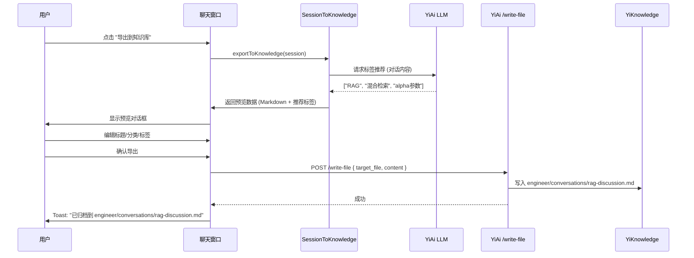

# YP-09-57: 聊天窗口会话一键导出为知识库文件 — 对话转知识文档

> 需求编号：YP-09-57 · 优先级：P2 · 人天：0.5d · 状态：需求已编写
> 依赖：YP-09-18（聊天消息导出）、YiAi 知识库 API

## 背景

用户与 AI 的有价值对话（技术讨论、架构决策、Bug 分析、代码审查）值得归档到 YiKnowledge 知识库中，供团队后续参考和 RAG 检索。当前用户只能通过 YP-09-18 将对话导出为 Markdown/JSON 文件保存到本地，然后手动上传到 YiKnowledge——这个过程步骤多、门栏高，导致大量有价值的对话未被归档。

一键导出到知识库可降低归档门栏：用户在聊天窗口点击"导出到知识库"按钮，填写标题和分类，AI 自动推荐标签，确认后对话即归档到 YiKnowledge 目录树中，自动被 YiAi 的知识监视器扫描并建立向量索引。

当前面临的挑战：

| # | 挑战 | 影响 | 严重程度 |
|---|------|------|----------|
| 1 | 归档步骤多——导出文件 → 找到目录 → 手动上传 → 写 frontmatter | 门栏高，大部分对话未归档 | 高 |
| 2 | 无 AI 辅助标签——用户手动填写标签，质量参差不齐 | 检索效率低，标签不统一 | 中 |
| 3 | 导出格式不统一——手动导出的 Markdown 格式各异 | RAG 检索效果差，YiKnowledge 规范不满足 | 中 |
| 4 | 无重复检测——同一对话可能被多次导出 | 知识库冗余 | 低 |
| 5 | 敏感信息泄露——用户消息可能包含敏感信息 | 隐私风险 | 低 |

---

## 一、现状分析

### 1.1 当前导出流程

```
用户完成有价值的对话
  │
  ├── 方式 1: YP-09-18 导出 Markdown 文件
  │   ├── 点击导出按钮
  │   ├── 选择格式 (Markdown / JSON)
  │   ├── 下载到本地
  │   ├── 手动找到 YiKnowledge 目录
  │   ├── 手动添加 frontmatter
  │   ├── 手动保存到对应角色目录
  │   └── 耗时: 3-5 分钟
  │
  └── 方式 2: 手动复制粘贴
      ├── 选中对话内容
      ├── 复制粘贴到新文件
      ├── 手动添加 frontmatter
      └── 耗时: 5-10 分钟
```

### 1.2 YiKnowledge 文件规范要求

| 要求 | 说明 | 当前导出是否满足 |
|------|------|----------------|
| Frontmatter 必需 | `title`、`tags`、`category`、`created`、`updated`、`source`、`type`、`status` | ❌ 手动导出不含 frontmatter |
| 文件命名 kebab-case | 仅连字符，不使用下划线或数字 | ❌ 手动导出文件名任意 |
| 最多 3 级目录 | `role/problem-domain/file.md` | ❌ 手动导出可能放错位置 |
| 角色目录 | `engineer/`、`aier/`、`srer/` 等 | ❌ 用户需手动选择 |

### 1.3 文件清单

| 文件路径 | 用途 | 当前状态 |
|----------|------|----------|
| `YiPet/src/chat/services/session-to-knowledge.ts` | 会话导出到知识库 | 不存在 |
| `YiPet/src/chat/components/ExportToKnowledgeDialog.vue` | 导出对话框 UI | 不存在 |
| `YiPet/src/chat/stores/chatStore.ts` | 聊天状态管理 | 无导出功能 |
| `YiAi/src/services/knowledge/write_file.py` | YiAi 知识库文件写入 API | 已存在 |

---

## 二、设计决策

### 决策 1：导出方式 — 直接写入文件系统 vs 通过 YiAi API vs 前端拼接

| 选项 | 可靠性 | 安全性 | 实现复杂度 |
|------|--------|--------|-----------|
| 直接写入文件系统（YiAi 本地） | 高 | 中（需认证） | 低 |
| 通过 YiAi API（`/write-file`） | 高 | 高（统一认证） | 低 |
| 前端拼接 Markdown + 下载（用户手动放置） | 低 | 高 | 低 |
| **YiAi API + 前端预览** | 高 | 高 | 中 |

**选择：通过 YiAi `/write-file` API 写入，前端预览 Markdown 后确认。** YiAi 已有 `/write-file` 端点（`target_file` 参数），直接复用。前端预览 Markdown 渲染效果，用户确认后提交。

### 决策 2：AI 辅助标签推荐 — 本地关键词提取 vs 远端 LLM vs 混合

| 选项 | 延迟 | 准确度 | 成本 |
|------|------|--------|------|
| 本地 TF-IDF 关键词提取 | 低（< 10ms） | 中 | 零 |
| 远端 LLM 分析 | 高（1-3s） | 高 | 有（LLM 调用） |
| 混合（本地 + LLM） | 中 | 高 | 有 |
| **远端 LLM（轻量模型）** | 中 | 高 | 低 |

**选择：远端 LLM 轻量模型（qwen3:4b）分析对话内容推荐标签。** 标签质量直接影响 RAG 检索效果，AI 生成标签准确度远高于本地关键词提取。使用轻量模型降低延迟和成本。

### 决策 3：用户消息匿名化 — 始终匿名 vs 可选 vs 不匿名

| 选项 | 隐私保护 | 信息完整性 | 用户体验 |
|------|----------|-----------|----------|
| 始终匿名化用户消息 | 最高 | 中 | 中 |
| 可选项（默认匿名） | 高 | 中 | 高 |
| 不匿名 | 低 | 高 | 低 |
| **可选项 + 默认匿名** | 高 | 中 | 高 |

**选择：可选项，默认将用户消息标记为"开发者"。** 保护用户隐私，同时给用户选择权。大多数知识库场景中，用户身份不重要——重要的是讨论内容。

### 设计决策记录

| 决策 | 选项 A | 选项 B | 选项 C | 选择 | 理由 |
|------|--------|--------|--------|------|------|
| 导出方式 | 直接写入 | YiAi API | 前端拼接 | **YiAi API** | 统一认证 + 复用 |
| 标签推荐 | 本地 TF-IDF | 远端 LLM | 混合 | **远端 LLM** | 准确度优先 |
| 匿名化 | 始终匿名 | 可选项 | 不匿名 | **可选项 + 默认匿名** | 隐私 + 灵活 |

---

## 三、目标架构

### 3.1 修复后数据流



### 3.2 架构指标

| 指标 | 改造前 | 改造后 | 改善 |
|------|--------|--------|------|
| 归档耗时 | 3-10 分钟 | 30 秒 | **6-20×** |
| 标签质量 | 手动填写 | AI 推荐 | **显著提升** |
| 格式规范 | 不统一 | 符合 YiKnowledge 规范 | **标准化** |
| 归档率 | < 5% | 预计 30-50% | **6-10×** |

---

## 四、具体改动

### 4.1 新建文件

**`YiPet/src/chat/services/session-to-knowledge.ts`** — 会话导出服务

```typescript
// YiPet/src/chat/services/session-to-knowledge.ts

export interface KnowledgeExportOptions {
  title: string;
  category: string;          // engineer/aier/srer/producter/curator
  tags: string[];
  includeTimestamps: boolean;
  anonymizeUser: boolean;    // 默认 true
  subdirectory?: string;     // 子目录，如 "conversations"
}

export interface ExportPreview {
  filePath: string;
  frontmatter: Record<string, string | string[]>;
  content: string;
  fullMarkdown: string;
  recommendedTags: string[];
  estimatedSize: number;     // 字节
}

export class SessionToKnowledgeExporter {
  /** 生成预览——用户确认前先预览 */
  async generatePreview(
    session: ChatSession,
    options: Partial<KnowledgeExportOptions> = {}
  ): Promise<ExportPreview> {
    const opts: KnowledgeExportOptions = {
      title: options.title || session.title || '未命名会话',
      category: options.category || 'engineer',
      tags: options.tags || [],
      includeTimestamps: options.includeTimestamps ?? true,
      anonymizeUser: options.anonymizeUser ?? true,
      subdirectory: options.subdirectory || 'conversations',
    };

    const content = this._buildMarkdown(session, opts);
    const frontmatter = this._buildFrontmatter(opts);
    const fullMarkdown = this._assembleFile(frontmatter, content);
    const filePath = this._buildFilePath(opts);
    const recommendedTags = await this._recommendTags(session);

    return {
      filePath,
      frontmatter,
      content,
      fullMarkdown,
      recommendedTags,
      estimatedSize: new Blob([fullMarkdown]).size,
    };
  }

  /** 执行导出——写入 YiKnowledge */
  async exportToKnowledge(
    session: ChatSession,
    options: KnowledgeExportOptions
  ): Promise<{ filePath: string }> {
    const preview = await this.generatePreview(session, options);

    const response = await requestHttp.rpc({
      module_name: 'services.knowledge.file_service',
      method_name: 'write_file',
      parameters: {
        target_file: preview.filePath,
        content: preview.fullMarkdown,
      },
    });

    if (response.code !== 0) {
      throw new Error(`导出失败: ${response.message}`);
    }

    return { filePath: preview.filePath };
  }

  /** AI 推荐标签 */
  private async _recommendTags(session: ChatSession): Promise<string[]> {
    try {
      const recentMessages = session.messages.slice(-10);
      const conversation = recentMessages
        .map(m => `${m.role}: ${m.content.slice(0, 200)}`)
        .join('\n');

      const prompt = `分析以下对话，提取 3-5 个关键词/标签。
每个标签 ≤ 10 字符，中英文均可。仅返回 JSON 数组。

对话:
${conversation}

输出格式: ["标签1", "标签2", "标签3"]`;

      const response = await requestHttp.rpc({
        module_name: 'services.ai.chat_service',
        method_name: 'chat',
        parameters: {
          messages: [{ role: 'user', content: prompt }],
          model: 'qwen3:4b',
          stream: false,
        },
      });

      const tags = JSON.parse(response.data.content);
      return tags
        .slice(0, 5)
        .filter((t: string) => typeof t === 'string' && t.length <= 10)
        .map((t: string) => t.toLowerCase().replace(/[^a-z0-9\u4e00-\u9fff]/g, ''));
    } catch {
      return []; // AI 推荐失败静默降级
    }
  }

  private _buildMarkdown(session: ChatSession, opts: KnowledgeExportOptions): string {
    const lines: string[] = [];
    lines.push(`# ${opts.title}`);
    lines.push('');
    lines.push(`> 来源: YiPet 会话 · 日期: ${new Date(session.createdAt).toISOString().slice(0, 10)}`);
    lines.push(`> 模型: ${session.model || 'default'} · 共 ${session.messages.length} 条消息`);
    lines.push('');
    lines.push('---');
    lines.push('');

    for (const msg of session.messages) {
      if (msg.role === 'system') continue;

      const role = msg.role === 'user'
        ? (opts.anonymizeUser ? '**开发者**' : '**用户**')
        : '**🤖 YiPet AI**';

      const time = opts.includeTimestamps
        ? ` *( ${new Date(msg.timestamp).toLocaleTimeString('zh-CN')} )*`
        : '';

      lines.push(`### ${role}${time}`);
      lines.push('');
      lines.push(msg.content);
      lines.push('');
      lines.push('');
    }

    return lines.join('\n');
  }

  private _buildFrontmatter(opts: KnowledgeExportOptions): Record<string, unknown> {
    return {
      title: opts.title,
      tags: opts.tags,
      category: opts.category,
      created: new Date().toISOString().slice(0, 10),
      updated: new Date().toISOString().slice(0, 10),
      source: 'yipet-conversation',
      type: 'summary',
      status: 'inbox',
      project: 'yipet',
      project_id: 'yipet',
      language: 'zh',
    };
  }

  private _assembleFile(frontmatter: Record<string, unknown>, content: string): string {
    const yaml = ['---'];
    for (const [key, value] of Object.entries(frontmatter)) {
      if (Array.isArray(value)) {
        yaml.push(`${key}: [${value.join(', ')}]`);
      } else {
        yaml.push(`${key}: ${value}`);
      }
    }
    yaml.push('---');
    yaml.push('');
    return yaml.join('\n') + content;
  }

  private _buildFilePath(opts: KnowledgeExportOptions): string {
    const slug = this._slugify(opts.title);
    const subdir = opts.subdirectory || 'conversations';
    return `${opts.category}/${subdir}/${slug}.md`;
  }

  private _slugify(text: string): string {
    return text
      .toLowerCase()
      .replace(/[\s_]+/g, '-')
      .replace(/[^a-z0-9\u4e00-\u9fff-]/g, '')
      .slice(0, 50);
  }
}

export const sessionToKnowledgeExporter = new SessionToKnowledgeExporter();
```

### 4.2 修改文件

| 文件路径 | 改动内容 | 改动量 |
|----------|----------|--------|
| `YiPet/src/chat/services/session-to-knowledge.ts` | 新建——导出服务 | +200 行 |
| `YiPet/src/chat/components/ExportToKnowledgeDialog.vue` | 新建——导出对话框 | +100 行 |
| `YiPet/src/chat/components/ChatHeader.vue` | 添加 "导出到知识库" 按钮 | +10 行 |

---

## 五、实施步骤

| 步骤 | 描述 | 文件 | 验证方法 | 人天 |
|------|------|------|----------|------|
| 1 | 实现 SessionToKnowledgeExporter 核心逻辑 | `session-to-knowledge.ts` | 预览生成正确 | 0.15 |
| 2 | 实现 AI 标签推荐 | `session-to-knowledge.ts` | LLM 返回标签数组 | 0.10 |
| 3 | 实现导出对话框 UI | `ExportToKnowledgeDialog.vue` | 预览 + 编辑 + 确认 | 0.15 |
| 4 | 集成到 ChatHeader | `ChatHeader.vue` | 按钮 → 对话框 | 0.05 |
| 5 | 端到端验证：导出 → YiKnowledge 文件 | 手动测试 | 文件出现在 YiKnowledge 目录中 | 0.05 |

**总计：0.5 人天**

---

## 六、性能分析

| 操作 | 耗时 | 说明 |
|------|------|------|
| 生成预览 | < 50ms | 纯文本拼接 |
| AI 标签推荐 | 1-3s | LLM 调用 |
| 写入文件 | 50-200ms | YiAi API 文件 I/O |
| 总计（用户感知） | 2-4s | 大部分时间在 AI 标签推荐 |

---

## 七、测试规格

### GIVEN/WHEN/THEN 场景

**场景 1：生成导出预览**

```
GIVEN 会话有 10 条消息
WHEN generatePreview 被调用
THEN 返回的 Markdown 应包含标题、来源、消息列表
THEN frontmatter 应包含所有 8 个必需字段
THEN 文件路径应符合 kebab-case 命名
THEN estimatedSize 应 > 0
```

**场景 2：AI 推荐标签**

```
GIVEN 会话内容涉及 RAG 和向量检索
WHEN _recommendTags 被调用
THEN 返回的标签应包含 "RAG" 或 "向量检索"
THEN 标签数量应在 3-5 个
THEN 每个标签 ≤ 10 字符
```

**场景 3：用户消息匿名化**

```
GIVEN anonymizeUser 为 true
WHEN 生成 Markdown
THEN 用户消息的角色应显示为 "开发者"
THEN 不应显示具体用户名
```

**场景 4：导出到 YiKnowledge**

```
GIVEN 用户确认导出
WHEN exportToKnowledge 被调用
THEN 文件应写入 YiKnowledge 目录
THEN 文件应包含正确的 frontmatter
THEN 返回的 filePath 应正确
```

---

## 八、风险与缓解

| # | 风险 | 概率 | 影响 | 缓解措施 |
|---|------|------|------|----------|
| 1 | YiAi `/write-file` 不可用 | 低 | 高 | 降级为本地下载 Markdown 文件 |
| 2 | AI 标签推荐失败 | 中 | 低 | 静默降级，用户手动填写标签 |
| 3 | 文件路径冲突（同名文件） | 低 | 中 | 添加时间戳后缀或自动递增 |
| 4 | 大会话导出超时 | 低 | 中 | 限制导出消息数（最近 100 条） |

---

## 九、代码审查检查清单

- [ ] 导出的 Markdown 符合 YiKnowledge frontmatter 规范（8 个必需字段）
- [ ] 文件命名符合 kebab-case 约定
- [ ] AI 标签推荐失败时静默降级
- [ ] 用户消息匿名化可选项
- [ ] YiAi API 不可用时降级为本地下载
- [ ] 文件路径冲突时自动处理
- [ ] 导出对话框包含预览和编辑功能
- [ ] 导出成功后显示 Toast 提示文件路径

---

## 十、回归问题预测

| # | 预测问题 | 原因 | 验证方法 |
|---|---------|------|---------|
| 1 | YiAi API 不可用导致导出失败 | 后端未启动 | 降级为本地下载 |
| 2 | 大会话导出超时 | 消息 > 500 条 | 限制导出消息数 |
| 3 | 文件路径命名冲突 | 同名会话 | 添加时间戳后缀 |
| 4 | AI 标签推荐返回格式错误 | LLM 输出不稳定 | try-catch + 降级 |

---

## 十一、回滚策略

| 回滚场景 | 回滚方式 | 影响范围 | 恢复时间 |
|----------|----------|----------|----------|
| YiAi `/write-file` API 不可用 | 降级为本地下载 Markdown 文件 | 所有导出操作 | 即时（自动降级） |
| AI 标签推荐 LLM 调用大面积失败 | 跳过标签推荐，用户手动填写标签 | 导出时的标签推荐功能 | 即时（静默降级） |
| 文件路径冲突导致导出失败 | 添加时间戳后缀到文件名 | 特定文件路径的导出 | 5 分钟 |
| 大会话导出超时（> 500 条消息） | 限制导出最近 100 条消息 | 大型会话的导出 | 即时 |
| 导出的 Markdown 格式不符合 YiKnowledge 规范 | 回退到手动导出流程 | 知识库归档质量 | 10 分钟 |

**回滚验证**：回滚后导出功能降级为本地下载，用户可手动放置到 YiKnowledge 目录。

---

## 十二、可观测性

| 指标 | 采集方式 | 告警阈值 | 说明 |
|------|----------|------|------|
| `yipet.export.to_knowledge_total` | Counter（每次导出成功 +1） | -- | 导出到知识库的总次数 |
| `yipet.export.to_knowledge_failed` | Counter（每次导出失败 +1） | > 5/min | 导出失败次数，持续升高说明 API 异常 |
| `yipet.export.fallback_to_download` | Counter（降级为本地下载时 +1） | > 10/min | 降级到本地下载的次数 |
| `yipet.export.tag_recommendation_ms` | Gauge（LLM 标签推荐耗时） | > 5000ms | AI 标签推荐耗时，超过 5s 说明 LLM 响应慢 |
| `yipet.export.file_size_bytes` | Gauge（导出文件大小） | > 500KB | 导出的 Markdown 文件大小，过大可能包含异常内容 |
| `yipet.export.tag_recommendation_empty` | Counter（标签推荐返回空数组） | > 10/min | 标签推荐失败次数，持续为空说明 LLM 异常 |

---

## 相关文档

- [聊天消息导出](../18-需求-聊天消息导出.md) — Markdown/JSON 导出是知识库转换的基础格式
- [聊天数据导入](../39-需求-聊天数据导入.md) — 导入与导出对称，知识库文档可反向导入为会话
- [会话标签自动生成](../59-需求-会话标签自动生成.md) — AI 标签可自动填充知识库文档的 frontmatter 元数据

*PRD 来源: `projects/yipet/requirements/2026-09/57-需求-会话导出为知识库.md`*