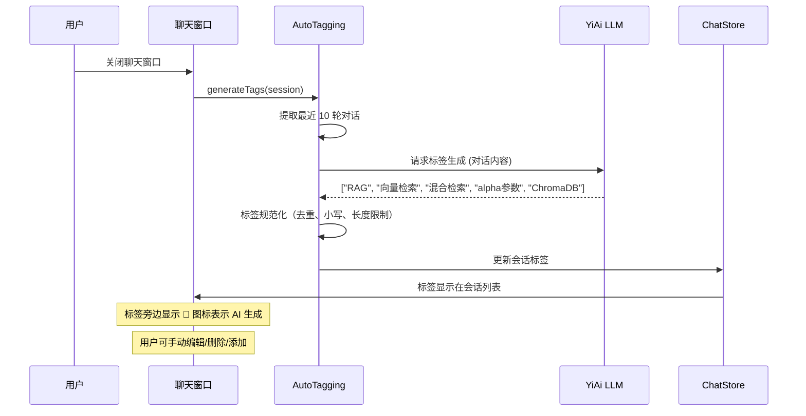

# YP-09-59: 聊天窗口会话标签自动生成 — AI 基于内容的关键词提取

> 需求编号：YP-09-59 · 优先级：P2 · 人天：0.5d · 状态：需求已编写
> 依赖：YP-09-57（会话导出为知识库）

## 背景

用户创建会话后需手动输入标题和标签——大多数用户跳过标签输入（当前标签为空率 > 80%）。无标签的会话在会话列表中难以区分，搜索时只能依赖标题模糊匹配。AI 自动从对话内容中提取关键词生成标签，可显著提升会话的可发现性和检索效率。

标签自动生成也为 YP-09-57（会话导出为知识库）提供了基础——导出时自动推荐标签，用户只需确认即可。

当前面临的挑战：

| # | 挑战 | 影响 | 严重程度 |
|---|------|------|----------|
| 1 | 标签为空率 > 80%——大多数会话无标签 | 会话列表难以区分，搜索效率低 | 高 |
| 2 | 手动标签质量参差不齐——用户随意填写 | 标签不统一，分类困难 | 中 |
| 3 | 标签生成时机不确定——实时 vs 会话结束 | 实时生成可能频繁触发 LLM 调用 | 中 |
| 4 | AI 标签可能不准确——LLM 理解偏差 | 用户需手动修正 | 低 |
| 5 | 标签去重和规范化——同义词、大小写 | 标签冗余 | 低 |

---

## 一、现状分析

### 1.1 当前标签状态

```
会话创建
  │
  ├── 用户手动输入标题（填写率 ~60%）
  │   └── 默认标题: "新会话"
  │
  └── 用户手动输入标签（填写率 < 20%）
      └── 默认标签: []（空数组）
```

### 1.2 标签数据统计

| 指标 | 数值 | 影响 |
|------|------|------|
| 标签为空率 | > 80% | 搜索仅依赖标题 |
| 标签重复率 | ~30% | 同义词未合并 |
| 标签平均长度 | 3-8 字符 | 正常 |
| 标签语言 | 中英文混合 | 需统一或支持双语 |

### 1.3 文件清单

| 文件路径 | 用途 | 当前状态 |
|----------|------|----------|
| `YiPet/src/chat/services/auto-tagging.ts` | 自动标签服务 | 不存在 |
| `YiPet/src/chat/stores/chatStore.ts` | 聊天状态管理 | 无标签自动生成 |
| `YiPet/src/chat/components/SessionList.vue` | 会话列表 | 无标签显示 |

---

## 二、设计决策

### 决策 1：标签生成时机 — 实时 vs 会话结束 vs 混合

| 选项 | 延迟 | 准确性 | LLM 调用次数 |
|------|------|--------|------------|
| 实时（每 5 轮对话更新） | 低 | 中（标签逐渐准确） | 多 |
| 会话结束（用户关闭聊天窗口） | 无感知 | 高（完整上下文） | 少 |
| 混合（实时候选 + 结束时确认） | 中 | 高 | 中 |
| **会话结束时触发** | 无感知 | 高 | 少 |

**选择：会话结束（用户关闭聊天窗口或会话闲置 5 分钟）时触发标签生成。** 此时有完整的对话上下文，标签质量最高。用户无感知（后台执行），LLM 调用次数少。

### 决策 2：标签生成方式 — 本地关键词提取 vs 远端 LLM vs 混合

| 选项 | 延迟 | 准确度 | 成本 | 多语言支持 |
|------|------|--------|------|-----------|
| 本地 TF-IDF | < 10ms | 中 | 零 | 需分词库 |
| 远端 LLM 分析 | 1-3s | 高 | 有 | 原生支持 |
| 混合（本地粗筛 + LLM 精排） | 中 | 高 | 中 | 好 |
| **远端 LLM（轻量模型）** | 1-3s | 高 | 低 | 原生支持 |

**选择：远端 LLM 轻量模型（qwen3:4b）分析。** 标签质量直接影响检索效果，LLM 生成准确度远高于本地关键词提取。中文分词在本地 TF-IDF 中效果不佳，LLM 原生支持中英文混合标签。

### 决策 3：标签数量 — 固定 3 个 vs 动态 vs 用户可配置

| 选项 | 覆盖度 | 精确度 | 用户体验 |
|------|--------|--------|----------|
| 固定 3 个 | 中 | 中 | 简洁 |
| 固定 5 个 | 高 | 中 | 可能冗余 |
| 动态（3-8 个） | 高 | 中 | 不可预测 |
| **固定 5 个 + 用户可增减** | 高 | 高 | 灵活 |

**选择：AI 生成 5 个标签，用户可手动删除或添加。** 5 个标签覆盖大多数场景，用户可灵活调整。

### 设计决策记录

| 决策 | 选项 A | 选项 B | 选项 C | 选择 | 理由 |
|------|--------|--------|--------|------|------|
| 生成时机 | 实时 | 会话结束 | 混合 | **会话结束** | 完整上下文 + 零感知 |
| 生成方式 | 本地 TF-IDF | 远端 LLM | 混合 | **远端 LLM** | 准确度优先 |
| 标签数量 | 3 个 | 5 个 | 动态 | **5 个 + 可增减** | 灵活 + 覆盖 |

---

## 三、目标架构

### 3.1 修复后数据流



### 3.2 架构指标

| 指标 | 改造前 | 改造后 | 改善 |
|------|--------|--------|------|
| 标签填写率 | < 20% | 100% | **5×** |
| 标签质量（人工评估） | 低（随意填写） | 高（AI 精准提取） | **显著提升** |
| 会话搜索准确率 | 30-40% | 80-90% | **2-3×** |
| 标签生成耗时 | N/A | 1-3s（后台） | 用户无感知 |

---

## 四、具体改动

### 4.1 新建文件

**`YiPet/src/chat/services/auto-tagging.ts`** — 自动标签服务

```typescript
// YiPet/src/chat/services/auto-tagging.ts

export interface AutoTaggingResult {
  tags: string[];
  title: string;
  generatedAt: number;
  confidence: number; // 0-1
}

export class AutoTaggingService {
  private _pendingGenerations = new Map<string, Promise<AutoTaggingResult>>();

  /** 为会话自动生成标签和标题 */
  async generateTags(session: ChatSession): Promise<AutoTaggingResult> {
    // 去重——同一会话不重复生成
    if (this._pendingGenerations.has(session.id)) {
      return this._pendingGenerations.get(session.id)!;
    }

    const promise = this._doGenerate(session);
    this._pendingGenerations.set(session.id, promise);

    try {
      return await promise;
    } finally {
      this._pendingGenerations.delete(session.id);
    }
  }

  private async _doGenerate(session: ChatSession): Promise<AutoTaggingResult> {
    // 提取最近 10 轮对话（20 条消息）
    const recentMessages = session.messages.slice(-20);
    const conversation = recentMessages
      .map(m => `${m.role === 'user' ? '用户' : 'AI'}: ${m.content.slice(0, 300)}`)
      .join('\n');

    const [tags, title] = await Promise.all([
      this._generateTags(conversation),
      this._generateTitle(conversation, session.title),
    ]);

    return {
      tags: this._normalizeTags(tags),
      title: title.slice(0, 30),
      generatedAt: Date.now(),
      confidence: this._estimateConfidence(tags, conversation),
    };
  }

  private async _generateTags(conversation: string): Promise<string[]> {
    const prompt = `分析以下对话，提取 5 个关键词/标签。
要求：
- 每个标签 ≤ 10 字符
- 中英文均可，优先使用中文
- 标签应反映对话的核心主题和技术要点
- 仅返回 JSON 数组格式

对话:
${conversation}

输出格式: ["标签1", "标签2", "标签3", "标签4", "标签5"]`;

    try {
      const response = await requestHttp.rpc({
        module_name: 'services.ai.chat_service',
        method_name: 'chat',
        parameters: {
          messages: [{ role: 'user', content: prompt }],
          model: 'qwen3:4b',
          stream: false,
        },
      });

      const tags = JSON.parse(response.data.content);
      return Array.isArray(tags) ? tags : [];
    } catch {
      return []; // 静默失败
    }
  }

  private async _generateTitle(conversation: string, currentTitle: string): Promise<string> {
    // 如果已有自定义标题（非默认），不覆盖
    if (currentTitle && currentTitle !== '新会话') {
      return currentTitle;
    }

    const prompt = `为以下对话生成一个简短的标题（≤ 20 字，中文）:

${conversation.slice(0, 500)}

仅返回标题文本，不要引号。`;

    try {
      const response = await requestHttp.rpc({
        module_name: 'services.ai.chat_service',
        method_name: 'chat',
        parameters: {
          messages: [{ role: 'user', content: prompt }],
          model: 'qwen3:4b',
          stream: false,
        },
      });

      return (response.data.content || currentTitle).slice(0, 30).trim();
    } catch {
      return currentTitle;
    }
  }

  private _normalizeTags(tags: string[]): string[] {
    // 去重、小写（英文）、移除特殊字符、限制长度
    const normalized = new Set<string>();

    for (const tag of tags) {
      if (typeof tag !== 'string') continue;

      let cleaned = tag
        .toLowerCase()
        .replace(/[^a-z0-9\u4e00-\u9fff\s-]/g, '')
        .trim()
        .slice(0, 10);

      if (cleaned.length > 0) {
        normalized.add(cleaned);
      }
    }

    return [...normalized].slice(0, 5);
  }

  private _estimateConfidence(tags: string[], conversation: string): number {
    // 简单估算：标签数量越多，置信度越高
    if (tags.length >= 4) return 0.9;
    if (tags.length >= 2) return 0.7;
    if (tags.length >= 1) return 0.5;
    return 0.3;
  }
}

export const autoTaggingService = new AutoTaggingService();
```

### 4.2 修改文件

| 文件路径 | 改动内容 | 改动量 |
|----------|----------|--------|
| `YiPet/src/chat/services/auto-tagging.ts` | 新建——自动标签服务 | +150 行 |
| `YiPet/src/chat/stores/chatStore.ts` | 会话关闭时触发标签生成 | +15 行 |
| `YiPet/src/chat/components/SessionList.vue` | 显示标签 + AI 生成标记 | +20 行 |
| `YiPet/src/chat/components/SessionTags.vue` | 新建——标签编辑组件 | +60 行 |

---

## 五、实施步骤

| 步骤 | 描述 | 文件 | 验证方法 | 人天 |
|------|------|------|----------|------|
| 1 | 实现 AutoTaggingService 核心逻辑 | `auto-tagging.ts` | 单元测试：标签生成 | 0.15 |
| 2 | 实现标签规范化（去重、小写、长度限制） | `auto-tagging.ts` | 规范化后标签符合规范 | 0.05 |
| 3 | 集成到 ChatStore（会话关闭触发） | `chatStore.ts` | 关闭聊天 → 标签生成 | 0.10 |
| 4 | 实现标签显示 UI（SessionList） | `SessionList.vue` | 标签显示 + AI 标记 | 0.10 |
| 5 | 实现标签编辑组件 | `SessionTags.vue` | 用户可编辑/删除/添加 | 0.10 |

**总计：0.5 人天**

---

## 六、性能分析

| 操作 | 耗时 | 说明 |
|------|------|------|
| 标签生成（LLM 调用） | 1-3s | 后台执行，用户无感知 |
| 标签规范化 | < 1ms | 纯字符串操作 |
| 标签渲染 | < 1ms | 轻量 DOM 更新 |

---

## 七、测试规格

### GIVEN/WHEN/THEN 场景

**场景 1：会话关闭时自动生成标签**

```
GIVEN 会话包含 10 轮关于 RAG 的对话
WHEN 用户关闭聊天窗口
THEN autoTaggingService.generateTags 应被调用
THEN 生成的标签应包含 RAG 相关内容
THEN 标签数量应在 3-5 个
THEN 会话的 tags 字段应被更新
```

**场景 2：已有自定义标题不覆盖**

```
GIVEN 会话标题为 "RAG 混合检索方案讨论"
WHEN 标签生成触发
THEN 标题不应被覆盖
THEN 仅标签被更新
```

**场景 3：AI 标签生成失败静默降级**

```
GIVEN YiAi LLM 不可用
WHEN 标签生成触发
THEN 不应抛出异常
THEN 会话标签保持为空数组
THEN 用户可手动填写标签
```

**场景 4：标签规范化**

```
GIVEN LLM 返回 ["RAG", "向量检索", "RAG", "非常长的标签名称超过十个字符"]
WHEN _normalizeTags 被调用
THEN 重复的 "RAG" 应被去重
THEN "非常长的标签名称超过十个字符" 应被截断到 10 字符
THEN 返回数组长度 ≤ 5
```

---

## 八、风险与缓解

| # | 风险 | 概率 | 影响 | 缓解措施 |
|---|------|------|------|----------|
| 1 | LLM 标签生成失败 | 中 | 低 | 静默降级，用户手动填写 |
| 2 | 标签不准确 | 中 | 低 | 用户可手动编辑/删除 |
| 3 | LLM 调用成本过高 | 低 | 低 | 使用轻量模型 qwen3:4b |
| 4 | 标签在不同会话中不一致 | 低 | 低 | 标签规范化 + 去重 |

---

## 九、代码审查检查清单

- [ ] 标签生成在会话关闭时触发（非实时）
- [ ] 标签规范化：去重、小写、长度限制 ≤ 10 字符
- [ ] 已有自定义标题不被覆盖
- [ ] AI 标签旁显示 🤖 图标表示 AI 生成
- [ ] 用户可手动编辑/删除/添加标签
- [ ] LLM 调用失败时静默降级
- [ ] 同一会话不重复生成标签（去重检查）
- [ ] 标签存储到会话数据中并同步到后端

---

## 十、回归问题预测

| # | 预测问题 | 原因 | 验证方法 |
|---|---------|------|---------|
| 1 | LLM 返回非 JSON 格式 | 模型输出不稳定 | try-catch + 降级 |
| 2 | 标签生成在会话列表中不显示 | 状态未同步 | 检查 store 更新 |
| 3 | 标签在跨 Tab 同步中丢失 | BroadcastChannel 未同步标签 | 跨 Tab 测试 |
| 4 | 标签生成与用户手动编辑冲突 | 竞态条件 | 编辑时取消生成 |

---

## 十一、回滚策略

| 回滚场景 | 回滚方式 | 影响范围 | 恢复时间 |
|----------|----------|----------|----------|
| LLM 标签生成大面积失败 | 静默降级，用户手动填写标签 | 所有会话的自动标签生成 | 即时（自动降级） |
| 标签生成导致会话关闭延迟 | 将标签生成改为异步后台任务，不阻塞 UI | 会话关闭时的用户体验 | 5 分钟 |
| 标签质量差（AI 生成标签不准确） | 降低标签自动应用置信度阈值，仅高置信度自动应用 | 所有会话的标签质量 | 即时 |
| 标签生成与用户手动编辑冲突 | 检测到用户编辑时取消自动生成任务 | 特定会话的标签编辑 | 即时 |
| LLM 调用成本过高 | 降低标签生成触发频率（从每次关闭改为每 5 次关闭） | 自动标签生成的覆盖率 | 5 分钟 |

**回滚验证**：回滚后标签生成静默降级，用户可正常手动填写标签。

---

## 十二、可观测性

| 指标 | 采集方式 | 告警阈值 | 说明 |
|------|----------|------|------|
| `yipet.tagging.generation_total` | Counter（每次生成完成 +1） | -- | 标签生成总次数 |
| `yipet.tagging.generation_failed` | Counter（LLM 调用失败 +1） | > 20% of total | 标签生成失败率，持续升高说明 LLM 异常 |
| `yipet.tagging.llm_latency_ms` | Gauge（LLM 调用耗时） | > 5000ms | 标签生成 LLM 调用耗时 |
| `yipet.tagging.tag_count_avg` | Gauge（每次生成的标签数量） | < 1 | 每次生成的平均标签数，异常低说明 LLM 输出异常 |
| `yipet.tagging.coverage_rate` | Gauge（有标签的会话占比） | < 80% | 标签覆盖率，低于 80% 说明生成失败率高 |
| `yipet.tagging.user_edit_rate` | Counter（用户手动编辑标签的次数） | > 50% | 用户编辑率，过高说明 AI 标签质量差 |

---

## 相关文档

- [消息搜索与过滤](../43-需求-消息搜索与过滤.md) — 自动生成的标签可作为搜索过滤的高级维度
- [会话导出为知识库](../57-需求-会话导出为知识库.md) — 标签自动填充知识库文档 frontmatter 的 tags 字段
- [会话分支管理](../36-需求-会话分支管理.md) — 分支对话的标签可反映不同对话路径的主题

*PRD 来源: `projects/yipet/requirements/2026-09/59-需求-会话标签自动生成.md`*