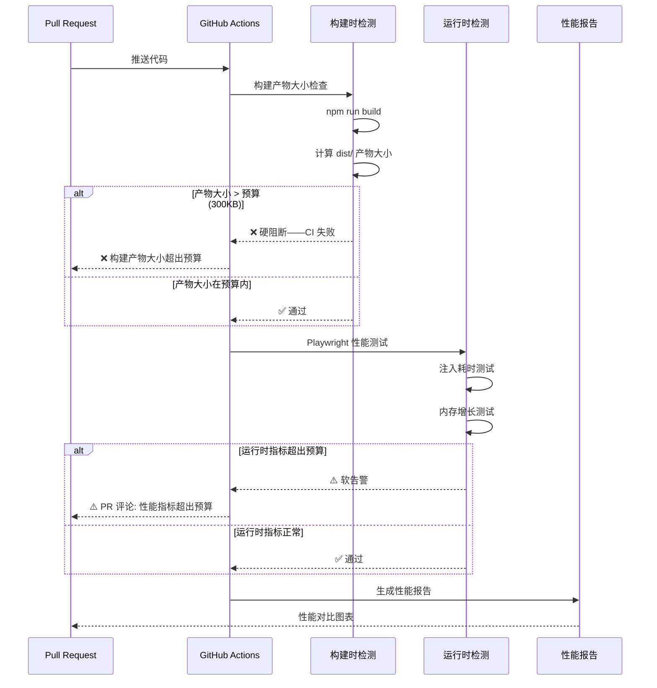

# YP-09-60: Content Script 性能回归测试自动化 — CI 集成与性能预算

> 需求编号：YP-09-60 · 优先级：P2 · 人天：0.5d · 状态：需求已编写
> 依赖：YP-09-10（ContentScript 性能剖析）、YP-09-52（E2E 自动化测试）

## 背景

YP-09-10 定义了性能预算基线（注入 < 50ms、MO 回调 < 5ms、内存增长 < 2x、构建产物 < 300KB），但预算仅在开发时手动检查——开发者需要主动打开 DevTools Performance 面板验证。CI 中无自动化性能回归告警，无法在 PR 合并前自动检测性能劣化。

一个常见的场景是：开发者添加了一个新的 npm 依赖，构建产物大小增加了 50KB，但单元测试全部通过，PR 被合并。一周后用户反馈"扩展加载变慢了"，回溯发现是那个依赖导致的。如果有 CI 性能回归检测，这个 PR 在合并前就会被阻止。

当前面临的挑战：

| # | 挑战 | 影响 | 严重程度 |
|---|------|------|----------|
| 1 | 无 CI 性能预算检测——性能劣化在合并后才被发现 | 性能回归进入生产环境 | 高 |
| 2 | 构建产物大小无监控——依赖膨胀无感知 | 扩展加载时间增加 | 中 |
| 3 | 无内存增长回归测试——代码变更可能引入内存泄漏 | 长期运行性能退化 | 中 |
| 4 | CI 环境性能波动——不同 runner 性能差异大 | 误报率高 | 中 |
| 5 | 无性能趋势追踪——无法看到性能随时间的变化 | 性能劣化是渐进的，难以发现 | 低 |

---

## 一、现状分析

### 1.1 当前性能检测流程

```
开发者修改代码
  │
  ├── npm run dev（本地开发）
  │   └── 手动检查: 构建产物大小？❌ 不检查
  │
  ├── npm run build（构建）
  │   └── 手动检查: 构建产物大小？❌ 不检查
  │
  ├── npm test（单元测试）
  │   └── ✅ 自动运行
  │
  └── git push → PR
      └── CI 检查: 性能回归？❌ 不检查
```

### 1.2 性能预算基线（来自 YP-09-10）

| 指标 | 预算 | 当前值 | 测量方式 |
|------|------|--------|----------|
| 构建产物大小 | < 300KB (gzip) | ~280KB | `ls -l dist/` |
| Content Script 注入耗时 | < 50ms | ~35ms | `performance.measure` |
| MutationObserver 回调耗时 | < 5ms | ~2ms | PerformanceObserver |
| 内存增长（10 分钟） | < 10MB | ~3MB | `performance.memory` |
| 事件监听器数量 | < 10 个 | 4 个 | `getEventListeners` |

### 1.3 文件清单

| 文件路径 | 用途 | 当前状态 |
|----------|------|----------|
| `YiPet/tests/perf/` | 性能测试目录 | 不存在 |
| `YiPet/scripts/check-bundle-size.js` | 构建产物大小检查 | 不存在 |
| `.github/workflows/perf-regression.yml` | 性能回归 CI 工作流 | 不存在 |

---

## 二、设计决策

### 决策 1：性能检测方式 — 构建时 vs 运行时 vs 混合

| 选项 | 覆盖范围 | 准确性 | CI 复杂度 |
|------|----------|--------|----------|
| 构建时（产物大小、Lighthouse） | 静态指标 | 高 | 低 |
| 运行时（Playwright 性能测试） | 动态指标 | 中 | 中 |
| 混合（构建时 + 运行时） | 全面 | 高 | 中 |
| **混合（构建时 + 关键运行时）** | 全面 | 高 | 中 |

**选择：构建时检测产物大小 + Playwright 运行时检测关键性能指标。** 构建时检测快速（< 30 秒），在每次 PR 中运行。运行时检测（注入耗时、内存增长）在 main 合并后运行，避免 PR 阻塞。

### 决策 2：性能预算策略 — 硬阻断 vs 软告警 vs 趋势检测

| 选项 | 严格性 | 误报容忍 | 适用场景 |
|------|--------|----------|----------|
| 硬阻断（超过预算即失败） | 最高 | 低 | 构建产物大小 |
| 软告警（超过预算发警告） | 中 | 高 | 运行时指标 |
| 趋势检测（与基线对比增长率） | 中 | 高 | 渐进式劣化 |
| **硬阻断（产物大小）+ 软告警（运行时）** | 中高 | 中 | 混合 |

**选择：构建产物大小硬阻断（超过预算 CI 失败），运行时指标软告警（PR 评论中显示警告）。** 产物大小是确定性指标，波动小，适合硬阻断。运行时指标受 CI 环境波动影响，适合软告警。

### 决策 3：性能基线管理 — 手动更新 vs 自动更新 vs 代码内声明

| 选项 | 维护成本 | 准确性 | 灵活性 |
|------|----------|--------|--------|
| 手动更新 JSON 文件 | 中 | 高 | 高 |
| 自动更新（取最近 N 次 CI 中位数） | 低 | 中 | 低 |
| 代码内声明（`perf-budgets.ts`） | 低 | 高 | 高 |
| **代码内声明 + 手动审批更新** | 低 | 高 | 高 |

**选择：代码内声明性能预算（`perf-budgets.ts`），PR 中修改预算需 Reviewer 审批。** 代码内声明版本可控，与代码变更一起 review。

### 设计决策记录

| 决策 | 选项 A | 选项 B | 选项 C | 选择 | 理由 |
|------|--------|--------|--------|------|------|
| 检测方式 | 构建时 | 运行时 | 混合 | **混合** | 全面覆盖 |
| 预算策略 | 硬阻断 | 软告警 | 趋势检测 | **硬阻断 + 软告警** | 确定性 + 灵活性 |
| 基线管理 | 手动 JSON | 自动更新 | 代码声明 | **代码声明 + 审批** | 版本可控 |

---

## 三、目标架构

### 3.1 修复后数据流



### 3.2 架构指标

| 指标 | 改造前 | 改造后 | 改善 |
|------|--------|--------|------|
| 性能回归发现时间 | 用户反馈后（数小时-数天） | PR 合并前（5 分钟） | **即时** |
| 构建产物大小监控 | 无 | 每次 PR 自动检测 | **从无到有** |
| 性能趋势可见性 | 无 | CI 报告 + 图表 | **从无到有** |

---

## 四、具体改动

### 4.1 新建文件

**`YiPet/tests/perf/perf-budgets.ts`** — 性能预算定义

```typescript
// YiPet/tests/perf/perf-budgets.ts

export interface PerfBudget {
  name: string;
  metric: string;
  budget: number;
  unit: string;
  blockOnFailure: boolean; // true = 硬阻断, false = 软告警
  description: string;
}

export const PERF_BUDGETS: PerfBudget[] = [
  {
    name: '构建产物大小',
    metric: 'bundle-size',
    budget: 300,
    unit: 'KB (gzip)',
    blockOnFailure: true,
    description: 'dist/ 目录下所有 .js 文件的 gzip 大小总和',
  },
  {
    name: 'Content Script 注入耗时',
    metric: 'content-inject-time',
    budget: 50,
    unit: 'ms',
    blockOnFailure: false,
    description: '从 Content Script 开始注入到宠物图标可见的时间',
  },
  {
    name: 'MutationObserver 回调耗时',
    metric: 'mo-callback-time',
    budget: 5,
    unit: 'ms',
    blockOnFailure: false,
    description: 'MutationObserver 单次回调的执行时间',
  },
  {
    name: '10 分钟内存增长',
    metric: 'memory-growth',
    budget: 10,
    unit: 'MB',
    blockOnFailure: false,
    description: '10 分钟内打开/关闭聊天窗口 20 次后的内存增长',
  },
  {
    name: '聊天窗口首次打开耗时',
    metric: 'chat-open-time',
    budget: 500,
    unit: 'ms',
    blockOnFailure: false,
    description: '从点击到聊天窗口完全渲染的时间',
  },
  {
    name: '事件监听器数量',
    metric: 'event-listeners',
    budget: 10,
    unit: '个',
    blockOnFailure: false,
    description: 'Content Script 注册的事件监听器总数',
  },
];
```

**`YiPet/scripts/check-bundle-size.js`** — 构建产物大小检查

```javascript
// YiPet/scripts/check-bundle-size.js
const fs = require('fs');
const path = require('path');
const { gzipSync } = require('zlib');

const DIST_DIR = path.resolve(__dirname, '../dist');
const BUDGET_KB = 300; // gzip 大小预算

function getTotalGzipSize(dir) {
  let totalSize = 0;
  const files = fs.readdirSync(dir, { recursive: true });

  for (const file of files) {
    const filePath = path.join(dir, file);
    const stat = fs.statSync(filePath);
    if (stat.isFile() && file.endsWith('.js')) {
      const content = fs.readFileSync(filePath);
      const gzipSize = gzipSync(content).length;
      totalSize += gzipSize;
    }
  }

  return totalSize;
}

function formatSize(bytes) {
  return `${(bytes / 1024).toFixed(1)} KB`;
}

const totalSize = getTotalGzipSize(DIST_DIR);
console.log(`构建产物总大小 (gzip): ${formatSize(totalSize)}`);

if (totalSize > BUDGET_KB * 1024) {
  console.error(`❌ 超出预算: ${formatSize(totalSize)} > ${formatSize(BUDGET_KB * 1024)}`);
  process.exit(1);
} else {
  console.log(`✅ 在预算内: ${formatSize(totalSize)} <= ${formatSize(BUDGET_KB * 1024)}`);
  process.exit(0);
}
```

**`.github/workflows/perf-regression.yml`** — CI 工作流

```yaml
name: Performance Regression

on:
  pull_request:
    paths:
      - 'YiPet/src/**'
      - 'YiPet/package.json'
      - 'YiPet/webpack.config.js'

jobs:
  bundle-size:
    runs-on: ubuntu-latest
    steps:
      - uses: actions/checkout@v4
      - uses: actions/setup-node@v4
        with: { node-version: '20' }
      - name: Install dependencies
        run: cd YiPet && npm ci
      - name: Build
        run: cd YiPet && npm run build
      - name: Check bundle size
        run: cd YiPet && node scripts/check-bundle-size.js

  perf-benchmarks:
    runs-on: ubuntu-latest
    steps:
      - uses: actions/checkout@v4
      - uses: actions/setup-node@v4
        with: { node-version: '20' }
      - name: Install dependencies
        run: cd YiPet && npm ci
      - name: Build extension
        run: cd YiPet && npm run build
      - name: Install Playwright
        run: cd YiPet && npx playwright install --with-deps chromium
      - name: Run performance benchmarks
        run: cd YiPet && npx playwright test tests/perf/ --reporter=json
      - name: Report results
        if: always()
        run: cd YiPet && node scripts/report-perf.js
```

### 4.2 修改文件

| 文件路径 | 改动内容 | 改动量 |
|----------|----------|--------|
| `YiPet/tests/perf/perf-budgets.ts` | 新建——性能预算定义 | +50 行 |
| `YiPet/scripts/check-bundle-size.js` | 新建——产物大小检查脚本 | +30 行 |
| `.github/workflows/perf-regression.yml` | 新建——CI 工作流 | +40 行 |
| `YiPet/package.json` | 添加 `check:size` 脚本 | +3 行 |

---

## 五、实施步骤

| 步骤 | 描述 | 文件 | 验证方法 | 人天 |
|------|------|------|----------|------|
| 1 | 定义性能预算基线 | `perf-budgets.ts` | 预算值与当前值一致 | 0.05 |
| 2 | 实现构建产物大小检查脚本 | `check-bundle-size.js` | 脚本正确计算 gzip 大小 | 0.10 |
| 3 | 实现 Playwright 性能测试 | `tests/perf/` | 注入耗时、内存增长测试通过 | 0.15 |
| 4 | 配置 CI 工作流 | `perf-regression.yml` | PR 触发 → 性能检查执行 | 0.10 |
| 5 | 端到端验证：PR 中性能回归被检测 | CI 日志 | 人为增加 50KB 依赖 → CI 失败 | 0.10 |

**总计：0.5 人天**

---

## 六、性能分析

| 检测项 | 耗时 | CI 阶段 |
|--------|------|---------|
| 构建产物大小检查 | < 30s | 构建时 |
| 注入耗时测试 | < 30s | 运行时 |
| 内存增长测试 | < 2min | 运行时 |
| 总计 CI 耗时 | < 3min | — |

---

## 七、测试规格

### GIVEN/WHEN/THEN 场景

**场景 1：构建产物大小超预算 → CI 失败**

```
GIVEN 构建产物大小预算为 300KB (gzip)
WHEN 添加新依赖导致构建产物变为 350KB
AND check-bundle-size.js 运行
THEN 脚本应返回 exit code 1
THEN CI 应标记为失败
```

**场景 2：构建产物大小在预算内**

```
GIVEN 构建产物大小预算为 300KB
WHEN 构建产物大小为 280KB
AND check-bundle-size.js 运行
THEN 脚本应返回 exit code 0
THEN CI 应通过
```

**场景 3：运行时指标超预算 → 软告警**

```
GIVEN 注入耗时预算为 50ms
WHEN Playwright 测试测量注入耗时为 65ms
THEN CI 不应失败
THEN PR 评论中应显示性能警告
```

---

## 八、风险与缓解

| # | 风险 | 概率 | 影响 | 缓解措施 |
|---|------|------|------|----------|
| 1 | CI 环境性能波动导致误报 | 中 | 中 | 3 次重试取中位数 |
| 2 | 构建产物大小在 CI 和本地不同 | 低 | 低 | 使用相同 Node 版本 + npm ci |
| 3 | 性能预算过于严格阻碍开发 | 中 | 中 | 产物大小硬阻断，运行时软告警 |

---

## 九、代码审查检查清单

- [ ] 性能预算基线定义在 `perf-budgets.ts` 中
- [ ] 构建产物大小检查在每次 PR 中运行
- [ ] 构建产物大小超预算时 CI 硬阻断
- [ ] 运行时性能指标超预算时 CI 软告警
- [ ] 性能测试结果在 PR 中可见（评论或 Artifact）
- [ ] 性能预算修改需 Reviewer 审批
- [ ] 3 次重试取中位数消除 CI 波动

---

## 十、回归问题预测

| # | 预测问题 | 原因 | 验证方法 |
|---|---------|------|---------|
| 1 | PR 构建产物大小回归检查（>10KB 阻断） | 新增依赖 | 人为添加依赖验证 |
| 2 | 内存增长回归检查误报 | CI 环境内存差异 | 3 次重试 + 中位数 |
| 3 | 构建缓存导致产物大小不一致 | CI 缓存机制 | 清理缓存后重新构建 |

---

## 十一、回滚策略

| 回滚场景 | 回滚方式 | 影响范围 | 恢复时间 |
|----------|----------|----------|----------|
| 构建产物大小检查误报（CI 环境差异） | 调整预算阈值 +10% 临时缓冲 | 所有 PR 的构建产物大小检查 | 即时 |
| 运行时性能测试波动导致软告警泛滥 | 提高重试次数从 3 次到 5 次取中位数 | 运行时性能指标告警 | 5 分钟 |
| 性能预算过于严格阻碍正常开发 | 将产物大小预算从 300KB 提升到 320KB | 所有 PR 的合并门禁 | 即时 |
| Playwright 性能测试在 CI 中不稳定 | 降级为仅构建时检查，运行时测试仅在 main 合并后运行 | CI 运行时性能测试 | 5 分钟 |
| CI 性能检查耗时过长影响开发效率 | 将运行时测试从 PR 触发改为定时触发 | PR 的 CI 等待时间 | 5 分钟 |

**回滚验证**：回滚后 CI 性能检查不再误报，正常 PR 可顺利合并。

---

## 十二、可观测性

| 指标 | 采集方式 | 告警阈值 | 说明 |
|------|----------|------|------|
| `yipet.ci.bundle_size_kb` | Gauge（每次构建后记录） | > 300KB | 构建产物 gzip 大小 |
| `yipet.ci.bundle_size_delta_kb` | Gauge（与上次构建的差值） | > 10KB | 构建产物大小变化，单次 PR 增加超过 10KB 需关注 |
| `yipet.ci.perf_test_duration_ms` | Gauge（CI 性能测试耗时） | > 180000ms (3min) | CI 性能测试总耗时，超过 3 分钟影响开发效率 |
| `yipet.ci.perf_budget_violations` | Counter（性能预算违规次数） | -- | 性能预算违规次数，用于趋势分析 |
| `yipet.ci.false_positive_rate` | Gauge（误报率 = 重试通过次数/总失败次数） | > 30% | 误报率，过高说明 CI 环境不稳定 |
| `yipet.ci.perf_trend_score` | Gauge（连续 N 次构建的性能趋势斜率） | 斜率 > 0.05 | 性能趋势，正值表示持续劣化 |

---

## 相关文档

- [E2E 自动化测试](../52-需求-E2E自动化测试.md) — E2E 测试框架是性能回归检测的执行载体
- [扩展构建优化](../13-需求-扩展构建优化与代码分割.md) — 构建产物体积直接影响性能基线，需在 CI 中监控
- [ContentScript 性能剖析](../10-需求-ContentScript性能剖析与内存管理.md) — 性能剖析数据作为 CI 性能预算的基线参考

*PRD 来源: `projects/yipet/requirements/2026-09/60-需求-性能回归CI.md`*