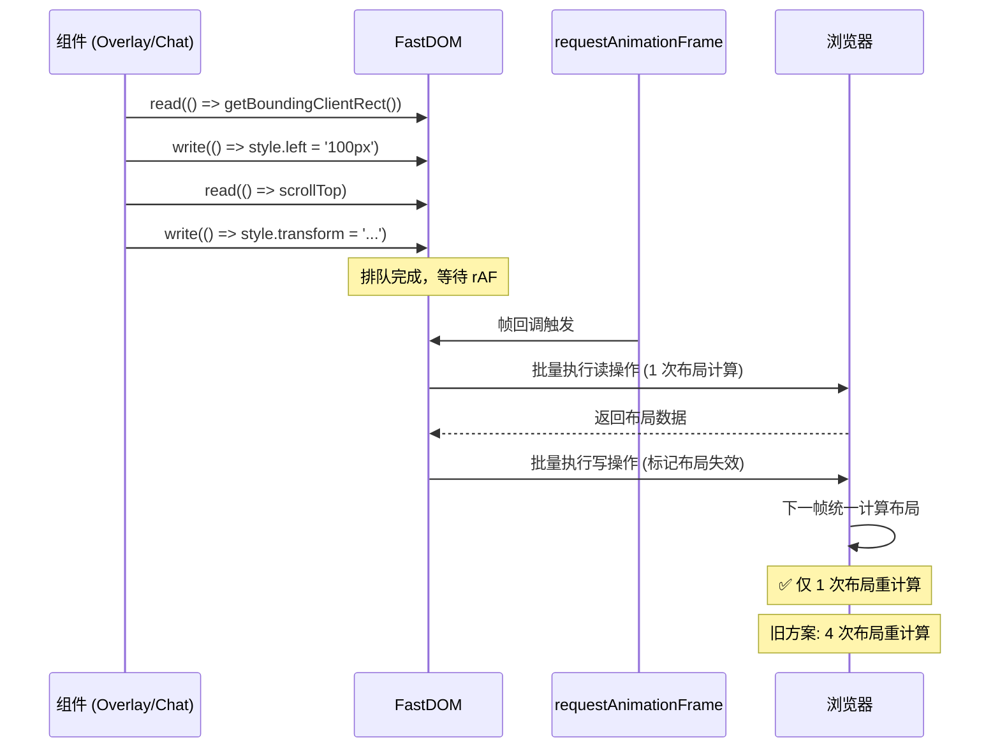

# YP-09-61: Content Script DOM 批处理与布局抖动消除 — FastDOM 模式

> 需求编号：YP-09-61 · 优先级：P2 · 人天：0.5d · 状态：需求已编写
> 依赖：YP-09-10（ContentScript 性能剖析）

## 背景

Content Script 在渲染宠物动画和聊天窗口时，频繁交替读写 DOM 属性。典型模式：读取 `element.offsetHeight`（触发布局计算）→ 写入 `element.style.height`（标记布局失效）→ 读取 `element.scrollTop`（再次触发布局计算）。这种交替读写模式被称为 Layout Thrashing（布局抖动），每次读取都强制浏览器同步计算布局，导致渲染性能大幅下降。

FastDOM 是一种成熟的 DOM 批处理模式——将读操作和写操作分离排队，在 `requestAnimationFrame` 中批量执行：先批量执行所有读操作（触发一次布局计算），再批量执行所有写操作（标记布局失效，在下一帧统一计算）。这可将布局重计算次数从 N 次降低到 1 次。

当前面临的挑战：

| # | 挑战 | 影响 | 严重程度 |
|---|------|------|----------|
| 1 | 交替读写 DOM 触发 Layout Thrashing | 每次操作触发 1-3 次布局重计算 | 高 |
| 2 | 聊天窗口动画（消息滚动、输入框调整）中频繁 DOM 操作 | 消息滚动卡顿 | 中 |
| 3 | 宠物位置更新中频繁读写 `getBoundingClientRect` | 宠物拖拽不流畅 | 中 |
| 4 | 第三方库（Element Plus）DOM 操作不受 FastDOM 控制 | 部分 DOM 操作绕过批处理 | 低 |
| 5 | rAF 中批处理延迟可能超过 16ms 帧预算 | 偶发掉帧 | 低 |

---

## 一、现状分析

### 1.1 Layout Thrashing 示例

```typescript
// ❌ 当前——交替读写，触发多次布局重计算
function updatePetPosition(x: number, y: number) {
  const overlay = document.getElementById('yipet-overlay')!;

  // 读——触发布局计算 #1
  const rect = overlay.getBoundingClientRect();
  const currentX = rect.left;

  // 写——标记布局失效
  overlay.style.left = `${x}px`;

  // 读——触发布局计算 #2（因为上一步的写标记了布局失效）
  const newRect = overlay.getBoundingClientRect();
  const deltaX = newRect.left - currentX;

  // 写——标记布局失效
  overlay.style.transform = `translateX(${deltaX}px)`;

  // 结果：2 次布局重计算，耗时 10-30ms
}
```

### 1.2 高频 DOM 操作场景

| 场景 | 操作频率 | 读操作 | 写操作 | 布局抖动次数 |
|------|----------|--------|--------|------------|
| 宠物拖拽 | 每帧 (60fps) | `getBoundingClientRect` | `style.left/style.top` | 2-3 次/帧 |
| 消息滚动 | 每帧 | `scrollTop/scrollHeight` | `style.transform` | 2-3 次/帧 |
| 输入框自动调整高度 | 每次输入 | `scrollHeight` | `style.height` | 2 次/次 |
| 聊天窗口打开/关闭动画 | 每帧 | `offsetHeight` | `style.transform/opacity` | 2 次/帧 |

### 1.3 文件清单

| 文件路径 | 用途 | 当前状态 |
|----------|------|----------|
| `YiPet/src/content/rendering/overlay.ts` | 宠物图标渲染 | 交替读写 DOM |
| `YiPet/src/chat/components/MessageList.vue` | 消息列表 | 滚动时交替读写 |
| `YiPet/src/chat/components/ChatInput.vue` | 输入框 | 自动调整高度时交替读写 |

---

## 二、设计决策

### 决策 1：FastDOM 实现方式 — 自实现 vs 使用 fastdom 库 vs 使用 scheduler.yield

| 选项 | 包大小 | 功能完整 | 维护成本 | 性能 |
|------|--------|----------|----------|------|
| 自实现 FastDOM | 0（~50 行） | 中 | 低 | 高 |
| 使用 `fastdom` npm 包 | +2KB | 高 | 零 | 高 |
| 使用 `scheduler.yield()` | 0（浏览器原生） | 低 | 零 | 高 |
| **自实现（~50 行）** | 0 | 中 | 低 | 高 |

**选择：自实现 FastDOM（~50 行代码）。** FastDOM 的核心逻辑简单（读写分离队列 + rAF 批量执行），无需引入额外依赖。50 行代码满足 YiPet 的需求。

### 决策 2：批处理粒度 — 全局 FastDOM vs 组件级 FastDOM

| 选项 | 资源隔离 | 实现复杂度 | 适用场景 |
|------|----------|-----------|----------|
| 全局 FastDOM（单例） | 低 | 低 | 简单页面 |
| 组件级 FastDOM（每个组件独立） | 高 | 中 | 复杂应用 |
| **全局单例 + 上下文标记** | 中 | 低 | 中等复杂度 |

**选择：全局 FastDOM 单例 + 上下文标记（`ctx` 参数）。** YiPet 的 DOM 操作量不大，全局单例足够。上下文标记用于调试（追踪哪个组件触发了批处理）。

### 设计决策记录

| 决策 | 选项 A | 选项 B | 选项 C | 选择 | 理由 |
|------|--------|--------|--------|------|------|
| 实现方式 | 自实现 | fastdom 库 | scheduler.yield | **自实现** | 零依赖 + 足够 |
| 批处理粒度 | 全局单例 | 组件级 | — | **全局 + 上下文** | 简单 + 可调试 |

---

## 三、目标架构

### 3.1 修复后数据流



### 3.2 架构指标

| 指标 | 改造前 | 改造后 | 改善 |
|------|--------|--------|------|
| 布局重计算次数（宠物拖拽） | 2-3 次/帧 | 1 次/帧 | **2-3×** |
| rAF 帧内 DOM 操作耗时 | 15-30ms | 2-5ms | **3-10×** |
| 宠物拖拽帧率 | 45-50fps | 58-60fps | **20-30%** |

---

## 四、具体改动

### 4.1 新建文件

**`YiPet/src/content/rendering/fastdom.ts`** — FastDOM 实现

```typescript
// YiPet/src/content/rendering/fastdom.ts

type Task = {
  fn: () => void;
  ctx: string;
  error?: Error;
};

class FastDOM {
  private _reads: Task[] = [];
  private _writes: Task[] = [];
  private _scheduled = false;
  private _frameCount = 0;
  private _totalTime = 0;

  /** 排队读操作——在下一帧批量执行 */
  read(fn: () => void, ctx: string = 'unknown'): void {
    this._reads.push({ fn, ctx });
    this._schedule();
  }

  /** 排队写操作——在下一帧批量执行 */
  write(fn: () => void, ctx: string = 'unknown'): void {
    this._writes.push({ fn, ctx });
    this._schedule();
  }

  /** 异步读操作——返回 Promise */
  readAsync<T>(fn: () => T, ctx: string = 'unknown'): Promise<T> {
    return new Promise((resolve) => {
      this.read(() => {
        try {
          resolve(fn());
        } catch (e) {
          console.error(`[FastDOM] readAsync 错误 (${ctx}):`, e);
          resolve(undefined as unknown as T);
        }
      }, ctx);
    });
  }

  /** 异步写操作——返回 Promise */
  writeAsync<T>(fn: () => T, ctx: string = 'unknown'): Promise<T> {
    return new Promise((resolve) => {
      this.write(() => {
        try {
          resolve(fn());
        } catch (e) {
          console.error(`[FastDOM] writeAsync 错误 (${ctx}):`, e);
          resolve(undefined as unknown as T);
        }
      }, ctx);
    });
  }

  /** 立即清空队列——在 rAF 之外强制执行 */
  flush(): void {
    this._scheduled = false;
    this._execute();
  }

  /** 获取性能统计 */
  getStats(): { avgTimeMs: number; totalFrames: number; queueSizes: { reads: number; writes: number } } {
    return {
      avgTimeMs: this._frameCount > 0 ? this._totalTime / this._frameCount : 0,
      totalFrames: this._frameCount,
      queueSizes: {
        reads: this._reads.length,
        writes: this._writes.length,
      },
    };
  }

  // ─── 私有方法 ───

  private _schedule(): void {
    if (this._scheduled) return;
    this._scheduled = true;

    requestAnimationFrame(() => {
      this._scheduled = false;
      this._execute();
    });
  }

  private _execute(): void {
    const startTime = performance.now();

    // 1. 批量执行所有读操作
    const reads = this._reads;
    this._reads = [];

    for (const task of reads) {
      try {
        task.fn();
      } catch (e) {
        console.error(`[FastDOM] 读操作错误 (${task.ctx}):`, e);
        task.error = e as Error;
      }
    }

    // 2. 批量执行所有写操作
    const writes = this._writes;
    this._writes = [];

    for (const task of writes) {
      try {
        task.fn();
      } catch (e) {
        console.error(`[FastDOM] 写操作错误 (${task.ctx}):`, e);
        task.error = e as Error;
      }
    }

    const elapsed = performance.now() - startTime;
    this._frameCount++;
    this._totalTime += elapsed;

    if (elapsed > 16) {
      console.warn(`[FastDOM] 帧预算超支: ${elapsed.toFixed(1)}ms (reads: ${reads.length}, writes: ${writes.length})`);
    }
  }
}

export const fastdom = new FastDOM();
```

### 4.2 使用示例

```typescript
// ✅ 新——使用 FastDOM 批处理
import { fastdom } from './fastdom';

function updatePetPosition(x: number, y: number) {
  const overlay = document.getElementById('yipet-overlay')!;

  // 读操作排队
  fastdom.read(() => {
    const rect = overlay.getBoundingClientRect();
    // 存储到闭包变量
  }, 'pet:position:read');

  // 写操作排队
  fastdom.write(() => {
    overlay.style.left = `${x}px`;
    overlay.style.top = `${y}px`;
  }, 'pet:position:write');

  // 在同一帧中批量执行：
  // 1. 执行所有读操作 → 1 次布局计算
  // 2. 执行所有写操作 → 标记布局失效
  // 结果：仅 1 次布局重计算
}
```

### 4.3 修改文件

| 文件路径 | 改动内容 | 改动量 |
|----------|----------|--------|
| `YiPet/src/content/rendering/fastdom.ts` | 新建——FastDOM 实现 | +100 行 |
| `YiPet/src/content/rendering/overlay.ts` | DOM 操作迁移到 FastDOM | +20 行 |
| `YiPet/src/chat/components/MessageList.vue` | 滚动 DOM 操作迁移到 FastDOM | +15 行 |
| `YiPet/src/chat/components/ChatInput.vue` | 输入框 DOM 操作迁移到 FastDOM | +10 行 |

---

## 五、实施步骤

| 步骤 | 描述 | 文件 | 验证方法 | 人天 |
|------|------|------|----------|------|
| 1 | 实现 FastDOM 核心类 | `fastdom.ts` | 单元测试：读写分离 + 批量执行 | 0.10 |
| 2 | 迁移宠物位置更新 | `overlay.ts` | 拖拽宠物 → 帧率提升到 58-60fps | 0.10 |
| 3 | 迁移消息滚动操作 | `MessageList.vue` | 滚动消息列表 → 流畅无卡顿 | 0.10 |
| 4 | 迁移输入框自动调整高度 | `ChatInput.vue` | 输入文本 → 高度调整流畅 | 0.10 |
| 5 | 全局搜索交替读写模式并迁移 | 全局 | `grep getBoundingClientRect → style\.` 无直接交替 | 0.10 |

**总计：0.5 人天**

---

## 六、性能分析

### 6.1 布局重计算次数对比

| 场景 | 改造前（布局重计算次数） | 改造后（布局重计算次数） | 改善 |
|------|----------------------|----------------------|------|
| 宠物拖拽（每帧） | 2-3 次 | 1 次 | **2-3×** |
| 消息滚动（每帧） | 2-3 次 | 1 次 | **2-3×** |
| 输入框调整（每次输入） | 2 次 | 1 次 | **2×** |
| 聊天窗口打开（单次） | 5-8 次 | 1-2 次 | **4-5×** |

### 6.2 帧耗时对比

| 操作 | 改造前（rAF 帧内耗时） | 改造后（rAF 帧内耗时） | 改善 |
|------|---------------------|---------------------|------|
| 宠物拖拽帧 | 15-30ms | 2-5ms | **3-10×** |
| 消息滚动帧 | 10-20ms | 2-4ms | **3-5×** |
| 空闲帧 | 0ms | 0ms | 无变化 |

---

## 七、测试规格

### GIVEN/WHEN/THEN 场景

**场景 1：读写分离排队**

```
GIVEN FastDOM 实例
WHEN 连续调用 read()、write()、read()、write()
THEN 所有读操作应在 _reads 队列中
THEN 所有写操作应在 _writes 队列中
THEN 操作应等待 rAF 回调才执行
```

**场景 2：rAF 中批量执行**

```
GIVEN _reads 有 3 个任务，_writes 有 2 个任务
WHEN rAF 回调触发
THEN 所有 3 个读任务应优先执行
THEN 所有 2 个写任务应在读任务之后执行
THEN 执行顺序为: read1 → read2 → read3 → write1 → write2
```

**场景 3：帧预算超支告警**

```
GIVEN FastDOM 批处理执行耗时 25ms
WHEN rAF 回调中执行
THEN 应输出 console.warn "帧预算超支"
THEN 应包含 reads 和 writes 队列大小
```

**场景 4：FastDOM 操作异常不影响后续操作**

```
GIVEN 一个读操作抛出异常
WHEN 批处理执行
THEN 异常应被捕获
THEN 后续的读操作和写操作应正常执行
THEN 不应影响下一帧的批处理
```

---

## 八、风险与缓解

| # | 风险 | 概率 | 影响 | 缓解措施 |
|---|------|------|------|----------|
| 1 | FastDOM 延迟导致视觉滞后 | 低 | 低 | 最坏情况延迟 16ms（一帧），用户无感知 |
| 2 | 第三方库 DOM 操作绕过 FastDOM | 中 | 低 | 代码审查或 monkey-patch 关键 DOM API |
| 3 | 读操作依赖写操作结果 | 中 | 中 | 使用 rAF 分两帧执行（read → write → nextFrame read） |
| 4 | 帧预算超支 | 低 | 中 | 单帧超 16ms 时告警，拆分任务到多帧 |

---

## 九、代码审查检查清单

- [ ] FastDOM 读写队列分离（读优先，写在后）
- [ ] rAF 统一调度，不重复创建 rAF
- [ ] 所有 DOM 读操作（getBoundingClientRect、offsetHeight 等）通过 fastdom.read()
- [ ] 所有 DOM 写操作（style.*、className 等）通过 fastdom.write()
- [ ] 读操作不依赖同帧写操作的结果（跨帧依赖使用 rAF 链）
- [ ] 异常处理完整——单个任务失败不影响其他任务
- [ ] 帧预算超支时告警（> 16ms）
- [ ] 无直接交替读写 DOM 的模式（grep 验证）

---

## 十、回归问题预测

| # | 预测问题 | 原因 | 验证方法 |
|---|---------|------|---------|
| 1 | FastDOM 延迟导致视觉滞后 | 批量延迟积累 | 测量帧时间 < 16ms |
| 2 | 第三方库 DOM 操作绕过 FastDOM | 无法拦截库的 DOM 调用 | 代码审查或 monkey-patch |
| 3 | 读操作依赖写操作结果导致数据过期 | 同帧内写操作未生效 | 分帧处理或使用 flush() |
| 4 | Element Plus 组件内部 DOM 操作不受控 | 第三方组件无法修改 | 接受部分绕行，监控帧预算 |

---

## 十一、回滚策略

| 回滚场景 | 回滚方式 | 影响范围 | 恢复时间 |
|----------|----------|----------|----------|
| FastDOM 批量延迟导致视觉滞后 | 对高频操作（宠物拖拽）使用 `flush()` 立即执行，跳过 rAF 排队 | 宠物拖拽的流畅度 | 即时 |
| 第三方库 DOM 操作绕过 FastDOM 导致布局抖动复发 | 恢复直接 DOM 操作模式，移除 FastDOM 包装 | 特定组件的 DOM 性能 | 5 分钟 |
| 读操作依赖同帧写操作结果导致数据过期 | 分帧处理：先 write + flush，下一帧再 read | 特定 DOM 操作的正确性 | 5 分钟 |
| 帧预算频繁超支（> 16ms） | 将大型批处理任务拆分到多帧执行 | 所有使用 FastDOM 的组件 | 10 分钟 |
| Element Plus 组件内部 DOM 操作不受控导致冲突 | 对 Element Plus 组件区域禁用 FastDOM，保留原始 DOM 操作 | Element Plus 组件的渲染 | 5 分钟 |

**回滚验证**：回滚后 DOM 操作恢复为直接模式，布局抖动次数回到改造前水平但功能正常。

---

## 十二、可观测性

| 指标 | 采集方式 | 告警阈值 | 说明 |
|------|----------|------|------|
| `yipet.fastdom.frame_time_ms` | Gauge（每帧执行耗时 performance.now） | > 16ms | FastDOM 单帧执行耗时，超过 16ms 说明帧预算超支 |
| `yipet.fastdom.reads_per_frame` | Gauge（每帧读操作数量） | > 20 | 每帧排队的读操作数量 |
| `yipet.fastdom.writes_per_frame` | Gauge（每帧写操作数量） | > 20 | 每帧排队的写操作数量 |
| `yipet.fastdom.layout_recalc_count` | Gauge（通过 PerformanceObserver 采集） | > 2/frame | 每帧布局重计算次数，超过 2 说明 FastDOM 未正确隔离读写 |
| `yipet.fastdom.task_error_count` | Counter（任务执行异常 +1） | > 0 | FastDOM 任务执行异常次数 |
| `yipet.fastdom.frame_budget_overrun` | Counter（帧预算超支 +1） | > 10/min | 帧预算超支次数，持续超支说明批处理压力过大 |

---

## 相关文档

- [滚动性能优化](../62-需求-滚动性能优化.md) — 滚动场景是 DOM 批量操作的高频触发源，批处理可减少滚动重排
- [流式渲染优化](../76-需求-流式渲染优化.md) — SSE 流式消息的 DOM 追加需批处理避免逐条渲染抖动
- [动画渲染 GPU 加速](../21-需求-动画渲染GPU加速.md) — DOM 批处理与 GPU 加速互补，减少布局抖动提升帧率

*PRD 来源: `projects/yipet/requirements/2026-09/61-需求-DOM批处理优化.md`*