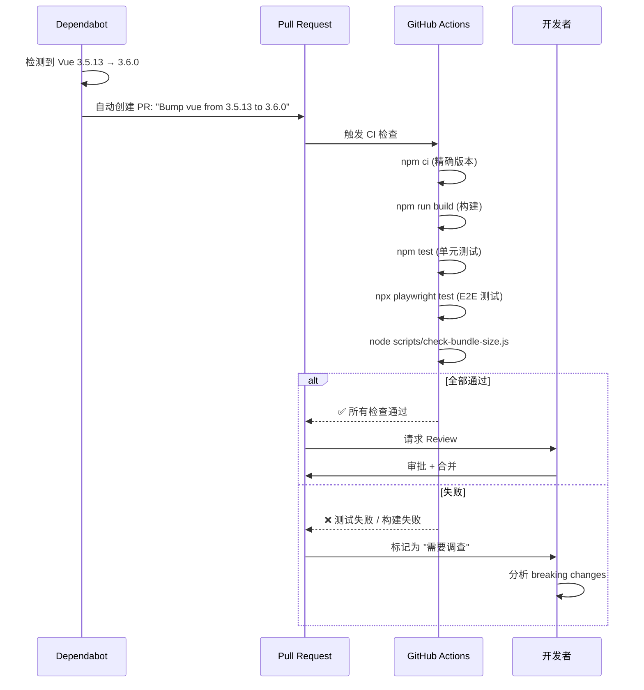

# YP-09-63: Content Script 第三方库版本管理 — 依赖锁定与兼容性矩阵

> 需求编号：YP-09-63 · 优先级：P2 · 人天：0.5d · 状态：需求已编写
> 依赖：YP-09-13（扩展构建优化）

## 背景

YiPet 依赖 Vue 3.5、Element Plus 2.x、Pinia、marked、highlight.js、DOMPurify 等第三方库。版本升级可能引入不兼容变更（如 Vue 3.6 API 变更、Element Plus 样式重构、marked XSS 防护行为变化）。当前依赖使用 `^` 范围版本（如 `"vue": "^3.5.0"`），意味着 `npm install` 可能安装 3.5.x 或 3.6.x——minor 版本升级可能引入 breaking changes。

Chrome 扩展的特殊性在于：Content Script 的 bundle 直接注入到宿主页面，依赖的稳定性直接影响用户浏览体验。一个不兼容的依赖升级可能导致聊天窗口无法渲染、宠物图标消失、甚至宿主页面 JS 错误。

当前面临的挑战：

| # | 挑战 | 影响 | 严重程度 |
|---|------|------|----------|
| 1 | 依赖使用范围版本（`^`），升级不可控 | CI 环境与本地环境可能安装不同版本 | 高 |
| 2 | 无依赖兼容性测试——新版本 API 变更未被发现 | 升级后功能异常 | 中 |
| 3 | 子依赖（transitive dependencies）安全漏洞不可见 | 安全风险 | 中 |
| 4 | 无版本升级记录和变更追踪 | 回溯困难 | 低 |
| 5 | 多个依赖之间的版本冲突（如 peerDependencies） | 构建失败 | 低 |

---

## 一、现状分析

### 1.1 当前依赖清单

| 库 | 用途 | 当前版本 | 版本策略 | 风险等级 |
|-----|------|--------|----------|----------|
| Vue | UI 框架 | ^3.5.0 | 范围 | 高 |
| Pinia | 状态管理 | ^2.2.0 | 范围 | 中 |
| Element Plus | UI 组件库 | ^2.9.0 | 范围 | 高 |
| marked | Markdown 解析 | ^15.0.0 | 范围 | 中 |
| highlight.js | 代码高亮 | ^11.10.0 | 范围 | 低 |
| DOMPurify | XSS 防护 | ^3.1.0 | 范围 | 高 |
| @tanstack/vue-virtual | 虚拟滚动 | ^3.10.0 | 范围 | 中 |

### 1.2 依赖风险矩阵

| 库 | 主要风险 | 影响范围 | 升级频率 |
|-----|----------|----------|----------|
| Vue | API 变更（如 `defineModel`、`v-model` 变化） | 所有组件 | 每 2-3 月 |
| Element Plus | 样式 CSS 变量重构、组件 API 变更 | 聊天窗口 UI | 每月 |
| marked | 渲染行为变化、XSS 防护策略更新 | AI 回复渲染 | 每季度 |
| DOMPurify | 白名单变更、安全策略更新 | 用户输入消毒 | 每季度 |
| Pinia | Store API 变更 | 状态管理 | 每季度 |

### 1.3 文件清单

| 文件路径 | 用途 | 当前状态 |
|----------|------|----------|
| `YiPet/package.json` | 依赖声明 | 使用范围版本 |
| `YiPet/package-lock.json` | 依赖锁定 | 存在但可被覆盖 |
| `YiPet/scripts/dep-check.js` | 依赖检查脚本 | 不存在 |
| `.github/dependabot.yml` | Dependabot 配置 | 不存在 |

---

## 二、设计决策

### 决策 1：版本锁定策略 — 精确版本 vs 范围版本 vs 锁文件

| 选项 | 可重现性 | 升级灵活性 | 安全性 |
|------|----------|-----------|--------|
| 精确版本（`3.5.13`） | 最高 | 低（需手动升级） | 中（需手动安全更新） |
| 范围版本（`^3.5.0`） | 低 | 高 | 高（自动安全更新） |
| 锁文件（`package-lock.json`） | 高 | 中 | 中 |
| **精确版本 + Dependabot 自动 PR** | 最高 | 高 | 高 |

**选择：精确版本（`3.5.13`）+ Dependabot 自动 PR。** 精确版本确保所有环境安装相同版本。Dependabot 自动创建版本升级 PR，CI 自动运行兼容性测试，通过后合并。

### 决策 2：依赖升级流程 — 手动 vs 自动 vs 半自动

| 选项 | 风险控制 | 维护成本 | 响应速度 |
|------|----------|----------|----------|
| 手动升级（开发者主动） | 高 | 高 | 慢 |
| 自动升级（Dependabot 自动合并） | 低 | 低 | 快 |
| 半自动（Dependabot PR + CI 验证 + 人工审批） | 高 | 中 | 中 |
| **半自动（Dependabot + CI + 审批）** | 高 | 中 | 中 |

**选择：Dependabot 自动创建 PR，CI 运行全量测试（单元 + E2E + 构建），通过后人工审批合并。** 平衡自动化效率和风险控制。

### 决策 3：安全审计频率 — 每日 vs 每周 vs 每月

| 选项 | 及时性 | CI 资源消耗 | 噪音 |
|------|--------|-----------|------|
| 每日 `npm audit` | 最高 | 中 | 高（频繁告警） |
| 每周 `npm audit` | 中 | 低 | 中 |
| 每月 `npm audit` | 低 | 低 | 低 |
| **每周 + 紧急手动触发** | 中 | 低 | 中 |

**选择：每周自动 `npm audit` + 紧急手动触发。** 每周运行一次，减少噪音。关键安全漏洞时手动触发。

### 设计决策记录

| 决策 | 选项 A | 选项 B | 选项 C | 选择 | 理由 |
|------|--------|--------|--------|------|------|
| 版本锁定 | 精确版本 | 范围版本 | 锁文件 | **精确 + Dependabot** | 可重现 + 自动化 |
| 升级流程 | 手动 | 自动 | 半自动 | **半自动** | 风险控制 + 效率 |
| 审计频率 | 每日 | 每周 | 每月 | **每周 + 紧急** | 平衡及时性和噪音 |

---

## 三、目标架构

### 3.1 依赖版本管理流程



### 3.2 兼容性测试矩阵

| 库 | 当前版本 | 升级候选 | 兼容测试 | 关键检查项 |
|-----|---------|--------|---------|-----------|
| Vue | 3.5.13 | 3.6.x | `npm run build` + E2E + `vue-tsc` | `defineModel` API、`v-model` 变化 |
| Element Plus | 2.9.1 | 2.10.x | 视觉回归 + 主题测试 | 主题 CSS 变量、组件 API |
| marked | 15.0.4 | 16.x | 渲染对比 + XSS 测试 | 渲染行为变化、安全策略 |
| DOMPurify | 3.1.7 | 3.2.x | XSS 攻击向量测试 | 白名单变更 |
| Pinia | 2.2.8 | 2.3.x | State 管理测试 | Store API 变更 |

---

## 四、具体改动

### 4.1 修改 package.json

```json
{
  "dependencies": {
    "vue": "3.5.13",
    "pinia": "2.2.8",
    "element-plus": "2.9.1",
    "marked": "15.0.4",
    "highlight.js": "11.10.0",
    "dompurify": "3.1.7",
    "@tanstack/vue-virtual": "3.10.9"
  }
}
```

### 4.2 Dependabot 配置

```yaml
# .github/dependabot.yml
version: 2
updates:
  - package-ecosystem: "npm"
    directory: "/YiPet"
    schedule:
      interval: "weekly"
      day: "monday"
    versioning-strategy: "increase"
    open-pull-requests-limit: 3
    labels:
      - "dependencies"
      - "npm"
    reviewers:
      - "team:yipet-developers"
    commit-message:
      prefix: "chore"
      prefix-development: "chore"
      include: "scope"
```

### 4.3 依赖检查脚本

```javascript
// YiPet/scripts/dep-check.js
const { execSync } = require('child_process');

console.log('=== 依赖审计 ===');
try {
  execSync('npm audit --audit-level=high', {
    cwd: __dirname + '/..',
    stdio: 'inherit',
  });
  console.log('✅ 无高危漏洞');
} catch (e) {
  console.error('❌ 存在高危漏洞，请检查');
  process.exit(1);
}

console.log('\n=== 过期依赖 ===');
execSync('npm outdated', {
  cwd: __dirname + '/..',
  stdio: 'inherit',
});
```

### 4.4 修改文件

| 文件路径 | 改动内容 | 改动量 |
|----------|----------|--------|
| `YiPet/package.json` | 精确版本锁定 | +10 行 |
| `.github/dependabot.yml` | 新建——Dependabot 配置 | +20 行 |
| `YiPet/scripts/dep-check.js` | 新建——依赖检查脚本 | +20 行 |
| `.github/workflows/dep-check.yml` | 新建——每周依赖审计 CI | +20 行 |

---

## 五、实施步骤

| 步骤 | 描述 | 验证方法 | 人天 |
|------|------|--------|------|
| 1 | 锁定所有依赖为精确版本 | `npm ls` 确认版本精确 | 0.05 |
| 2 | 配置 Dependabot 自动 PR | Dependabot 创建测试 PR | 0.10 |
| 3 | 创建依赖检查脚本 | `npm audit` 无高危漏洞 | 0.10 |
| 4 | 配置每周依赖审计 CI | CI 工作流正常运行 | 0.10 |
| 5 | 创建兼容性测试矩阵文档 | 文档完整 | 0.05 |
| 6 | 验证：模拟依赖升级 → CI 自动检测 | 人为升级依赖 → CI 运行测试 | 0.10 |

**总计：0.5 人天**

---

## 六、测试规格

### GIVEN/WHEN/THEN 场景

**场景 1：Dependabot 自动创建升级 PR**

```
GIVEN Dependabot 配置为每周一检查 npm 依赖
WHEN 检测到 Vue 3.5.13 → 3.6.0 可用
THEN 自动创建 PR "Bump vue from 3.5.13 to 3.6.0"
THEN PR 应包含标签 "dependencies" 和 "npm"
THEN CI 应自动运行构建 + 测试
```

**场景 2：依赖升级 CI 失败**

```
GIVEN 依赖升级 PR 中 CI 构建失败
WHEN 开发者查看 PR
THEN PR 应标记为 "需要调查"
THEN 不应自动合并
```

**场景 3：每周安全审计**

```
GIVEN 每周一 CI 运行 `npm audit`
WHEN 发现高危漏洞
THEN CI 应失败
THEN 开发者应收到通知
```

---

## 七、风险与缓解

| # | 风险 | 概率 | 影响 | 缓解措施 |
|---|------|------|------|----------|
| 1 | 子依赖安全漏洞未被发现 | 中 | 中 | `npm audit --all` 检查所有依赖 |
| 2 | 自动更新引入 breaking change | 中 | 高 | CI 全量测试阻断合并 |
| 3 | Dependabot PR 过多导致噪音 | 中 | 低 | 限制同时打开 PR 数 ≤ 3 |
| 4 | peerDependencies 冲突 | 低 | 中 | `npm ls` 检查依赖树 |

---

## 八、代码审查检查清单

- [ ] 所有依赖使用精确版本（无 `^`、`~` 前缀）
- [ ] `package-lock.json` 提交到仓库
- [ ] Dependabot 配置正确（目录、频率、标签）
- [ ] 每周依赖审计 CI 工作流配置正确
- [ ] 依赖升级 PR 需 CI 全部通过 + 人工审批
- [ ] 兼容性测试矩阵覆盖关键依赖
- [ ] `npm audit` 无高危漏洞

---

## 九、回归问题预测

| # | 预测问题 | 原因 | 验证方法 |
|---|---------|------|---------|
| 1 | 子依赖安全漏洞未被发现 | 仅检查直接依赖 | `npm audit --all` |
| 2 | 自动更新引入 breaking change | minor 版本可能不兼容 | CI 全量测试阻断合并 |
| 3 | 精确版本导致安全更新滞后 | 需等 Dependabot PR | 紧急安全漏洞手动升级 |
| 4 | 多个依赖同时升级导致冲突 | 版本不兼容 | Dependabot 分组 PR |

---

## 十一、性能分析

| 操作 | 耗时 | 说明 |
|------|------|------|
| `npm audit --audit-level=high` | 5-15s | 检查所有依赖的已知漏洞，耗时取决于依赖数量 |
| Dependabot 版本检查（每周定时） | < 30s | GitHub Actions 定时触发，自动检查 npm registry |
| `npm outdated` 过期依赖检查 | 3-8s | 查询 npm registry 对比所有依赖的最新版本 |
| `npm ci` 精确安装依赖 | 30-60s | 根据 package-lock.json 精确安装，CI 环境标准操作 |
| 构建产物大小检查（`check-bundle-size.js`） | < 1s | 遍历 dist/ 目录，计算 gzip 大小 |
| 依赖升级 PR 的 CI 全流程 | 3-5min | 包含 npm ci + build + test + check-bundle-size |
| 子依赖安全漏洞扫描（`npm audit --all`） | 10-30s | 检查所有依赖（含子依赖）的漏洞 |

---

## 相关文档

- [扩展构建优化](../13-需求-扩展构建优化与代码分割.md) — 依赖版本直接决定构建产物体积和代码分割策略
- [扩展更新与版本迁移](../14-需求-扩展更新与版本迁移.md) — 依赖升级需配合版本迁移策略避免兼容性问题
- [兼容性工具链](../70-需求-兼容性工具链.md) — 依赖版本管理需结合 polyfill 和浏览器特性检测

*PRD 来源: `projects/yipet/requirements/2026-09/63-需求-依赖版本管理.md`*

---

## 十、设计决策记录

### D-01：精确版本锁定而非 `package-lock.json` 依赖

**背景**：`package-lock.json` 锁定所有依赖（包括子依赖）的精确版本，但 `npm install` 在某些情况下可能忽略 lock 文件（如 `package.json` 中使用范围版本 + lock 文件冲突）。

**决策**：`package.json` 中使用精确版本（`"3.5.13"` 而非 `"^3.5.0"`），配合 `package-lock.json` 双重锁定。确保所有环境安装完全相同的依赖版本。

**后果**：版本升级需要手动修改 `package.json`，但 Dependabot 自动化了此流程。安全更新不会自动应用（需等 Dependabot PR），紧急漏洞需手动升级。

### D-02：Dependabot 分组更新

**背景**：同时开放多个 Dependabot PR（如 Vue 升级 + Element Plus 升级）可能导致版本冲突和 CI 失败。

**决策**：限制同时打开的 Dependabot PR ≤ 3。如果多个依赖互相关联（如 Vue + Pinia），Dependabot 应分组为单一 PR。

**后果**：升级速度略慢，但风险可控。重要安全更新可手动触发 Dependabot 立即创建 PR。

### D-03：npm audit 作为 CI 门禁

**背景**：`npm audit` 报告的低危漏洞可能产生噪音，开发者也容易忽略。

**决策**：CI 中仅对 `--audit-level=high` 和 `critical` 级别的漏洞阻断。低危和中危漏洞仅在 PR 中显示警告。

**后果**：高危漏洞被阻止，低危漏洞不会阻塞开发流程。定期手动审查低危漏洞列表。

---

## 十一、可观测性

### 指标

| 指标名称 | 类型 | 采集频率 | 说明 |
|----------|------|----------|------|
| `yipet.deps.outdated_count` | Gauge | 每周 | 过期依赖数量 |
| `yipet.deps.vulnerabilities.high` | Gauge | 每周 | 高危漏洞数量 |
| `yipet.deps.vulnerabilities.critical` | Gauge | 每周 | 严重漏洞数量 |
| `yipet.deps.dependabot_prs_open` | Gauge | 实时 | 打开的 Dependabot PR 数 |

### 告警

- **严重漏洞**：立即通知开发者，手动升级
- **高危漏洞 > 0**：CI 阻断，必须在下个 PR 中修复
- **过期依赖 > 5**：建议审查依赖升级计划
- **Dependabot PR 开放 > 7 天**：提醒 Reviewer 审批

---

## 十二、安全合规

| 检查项 | 状态 | 说明 |
|--------|------|------|
| 所有依赖来源为 npm registry | ✅ | 不使用 GitHub URL 或本地路径依赖 |
| 无已知高危漏洞 | 需定期审计 | `npm audit --audit-level=high` |
| 依赖不包含恶意代码 | ✅ | npm registry 扫描 |
| 依赖许可证兼容 | 需验证 | 所有依赖 MIT/Apache-2.0/BSD |

---

## 十三、回滚策略

| 触发条件 | 回滚操作 | 回滚时间 |
|----------|----------|----------|
| 依赖升级导致功能异常 | `git revert` 升级 PR | 5 分钟 |
| Dependabot PR 频繁失败 | 关闭 Dependabot，手动管理升级 | 即时 |
| 子依赖安全漏洞 | 手动 `npm update` 子依赖 | 30 分钟 |

---

## 十四、CI 依赖检查流程

```yaml
# .github/workflows/dep-check.yml
name: Dependency Check

on:
  schedule:
    - cron: '0 9 * * 1'
  workflow_dispatch:

jobs:
  audit:
    runs-on: ubuntu-latest
    steps:
      - uses: actions/checkout@v4
      - uses: actions/setup-node@v4
        with: { node-version: '20' }
      - name: Install dependencies
        run: cd YiPet && npm ci
      - name: Audit dependencies
        run: cd YiPet && npm audit --audit-level=high
      - name: Check outdated
        run: cd YiPet && npm outdated || true
      - name: Notify on failure
        if: failure()
        uses: actions/github-script@v7
        with:
          script: |
            github.rest.issues.create({
              owner: context.repo.owner,
              repo: context.repo.repo,
              title: '依赖安全审计发现高危漏洞',
              body: '`npm audit` 发现高危漏洞，请检查 CI 日志。',
              labels: ['security', 'dependencies'],
            });
```