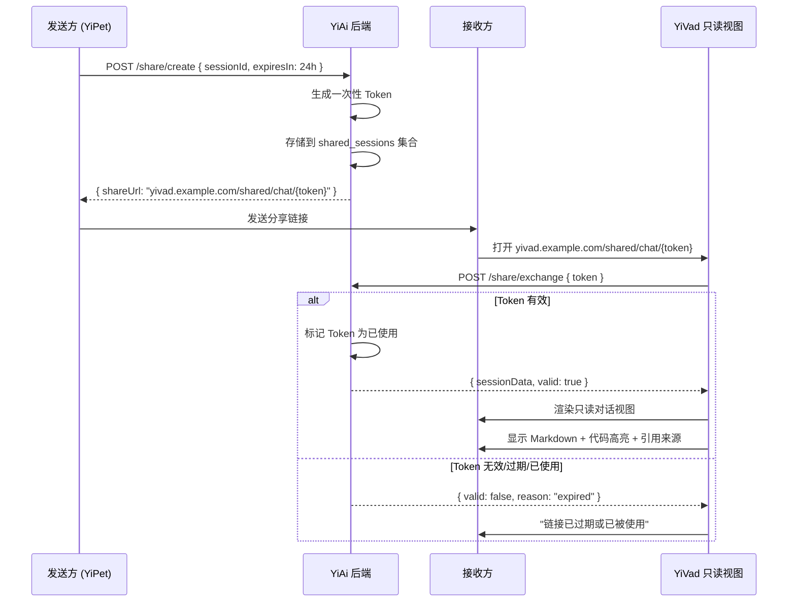

# YP-09-64: 聊天窗口会话共享与协作 — 分享链接与协作编辑

> 需求编号：YP-09-64 · 优先级：P2 · 人天：0.5d · 状态：需求已编写
> 依赖：YP-09-09（跨项目桥接可靠性）、YP-09-18（聊天消息导出）

## 背景

用户完成有价值的 AI 对话后希望分享给团队成员——当前只能通过 YP-09-18 导出 Markdown/JSON 文件再分享，或通过 YP-09-57 导出到 YiKnowledge。这两种方式都是"静态导出"——接收方看到的是导出的快照，无法在 YiVad 中浏览完整的对话上下文。

会话共享链接可直接在 YiVad 中打开只读对话视图，接收方可以浏览完整的对话历史，看到 AI 的 Markdown 渲染、代码高亮、引用来源等富文本内容。这比导出为 Markdown 文件更直观，且保留了对话的完整上下文。

当前面临的挑战：

| # | 挑战 | 影响 | 严重程度 |
|---|------|------|----------|
| 1 | 会话分享依赖导出文件——接收方体验差 | 无法在 YiVad 中浏览富文本对话 | 中 |
| 2 | 分享链接安全——Token 可能被第三方截获 | 会话数据泄露风险 | 高 |
| 3 | 分享链接过期后无优雅降级 | 接收方看到错误页面 | 中 |
| 4 | 大会话（> 100 条消息）分享性能 | 页面加载慢 | 低 |
| 5 | 分享链接被滥用（爬虫、暴力枚举） | 服务端资源消耗 | 低 |

---

## 一、现状分析

### 1.1 当前分享流程

```
用户完成有价值的 AI 对话
  │
  ├── 方式 1: YP-09-18 导出 Markdown 文件
  │   ├── 导出为 .md 文件
  │   ├── 通过 IM/邮件发送给同事
  │   └── 同事在文本编辑器中查看 ❌ 无富文本渲染
  │
  ├── 方式 2: YP-09-57 导出到 YiKnowledge
  │   ├── 导出到知识库
  │   └── 同事在 YiKnowledge 中查看 Markdown
  │
  └── 方式 3: 手动截图
      ├── 截图聊天窗口
      └── 发送图片 ❌ 无法复制文本
```

### 1.2 YiVad 只读视图需求

| 功能 | 说明 | 优先级 |
|------|------|--------|
| 对话历史渲染 | Markdown + 代码高亮 + 引用来源 | 必须 |
| 发送方信息 | 显示"来自 YiPet 用户"而非具体用户名 | 必须 |
| 过期时间 | 分享链接可设置过期时间（1h/24h/7d/永久） | 必须 |
| 访问统计 | 显示查看次数 | 可选 |
| 一键复制 | 复制整个对话为 Markdown | 可选 |

### 1.3 文件清单

| 文件路径 | 用途 | 当前状态 |
|----------|------|----------|
| `YiPet/src/chat/services/share-service.ts` | 分享服务 | 不存在 |
| `YiPet/src/chat/components/ShareDialog.vue` | 分享对话框 | 不存在 |
| `YiAi/src/services/sessions/share_service.py` | 后端分享服务 | 不存在 |
| `YiVad/src/views/shared/ChatView.vue` | 只读对话视图 | 不存在 |

---

## 二、设计决策

### 决策 1：分享 Token 安全策略 — 单次使用 vs TTL vs 组合

| 选项 | 安全性 | 用户体验 | 实现复杂度 |
|------|--------|----------|-----------|
| 单次使用 Token | 最高 | 中（链接打开失败需重新生成） | 中 |
| TTL 过期（24h/7d） | 中 | 高 | 低 |
| **单次使用 + TTL（取最小值）** | 高 | 中 | 中 |
| Token + 密码保护 | 最高 | 低 | 高 |

**选择：单次使用 + TTL 取最小值。** Token 使用后或过期后失效，先到为准。兼顾安全性和用户体验。对于需要多次分享的场景，用户可生成多个 Token。

### 决策 2：YiVad 只读视图实现 — 新页面 vs 弹窗 vs 嵌入

| 选项 | 实现复杂度 | 用户体验 | 安全性 |
|------|-----------|----------|--------|
| 新页面（独立路由） | 中 | 高 | 高 |
| 弹窗/Modal | 低 | 中 | 高 |
| 嵌入 YiVad aiChat 页面 | 低 | 中 | 中 |
| **新页面（独立路由）** | 中 | 高 | 高 |

**选择：YiVad 独立路由 `/shared/chat/:token`。** 独立页面更清晰，URL 可直接分享。只读模式不暴露 YiVad 的其他功能。

### 决策 3：分享数据范围 — 仅对话 vs 含 AI 来源 vs 含用户信息

| 选项 | 信息完整性 | 隐私保护 | 数据量 |
|------|-----------|----------|--------|
| 仅对话内容 | 中 | 高 | 小 |
| 对话 + AI 引用来源 | 高 | 高 | 中 |
| 对话 + 来源 + 用户信息 | 最高 | 低 | 大 |
| **对话 + 引用来源（匿名用户）** | 高 | 高 | 中 |

**选择：对话内容 + AI 引用来源，用户消息标记为"YiPet 用户"。** 保护发送方隐私，同时保留 AI 回复的引用来源（RAG 检索到的文档）。

### 设计决策记录

| 决策 | 选项 A | 选项 B | 选项 C | 选择 | 理由 |
|------|--------|--------|--------|------|------|
| Token 策略 | 单次使用 | TTL | 密码保护 | **单次 + TTL** | 安全 + 体验 |
| 只读视图 | 新页面 | 弹窗 | 嵌入 | **新页面** | 清晰 + 可分享 |
| 数据范围 | 仅对话 | 含来源 | 含用户 | **对话 + 来源** | 完整 + 隐私 |

---

## 三、目标架构

### 3.1 修复后数据流



### 3.2 后端 API

```python
# YiAi/src/services/sessions/share_service.py

class SessionShareService:
    async def create_share_token(self, session_id: str,
                                  expires_hours: int = 24) -> dict:
        token = secrets.token_urlsafe(16)
        await db.shared_sessions.insert_one({
            'session_id': session_id,
            'token': token,
            'created_at': datetime.utcnow(),
            'expires_at': datetime.utcnow() + timedelta(hours=expires_hours),
            'used': False,
            'view_count': 0,
            'origin': 'yipet',
        })
        return {
            'token': token,
            'share_url': f'{YIVAD_BASE}/shared/chat/{token}',
            'expires_at': (datetime.utcnow() + timedelta(hours=expires_hours)).isoformat(),
        }

    async def get_shared_session(self, token: str) -> dict | None:
        shared = await db.shared_sessions.find_one({'token': token})
        if not shared:
            return None
        if shared['expires_at'] < datetime.utcnow():
            return None
        if shared['used']:
            return None  # 一次性使用

        # 标记为已使用
        await db.shared_sessions.update_one(
            {'token': token},
            {'$set': {'used': True}, '$inc': {'view_count': 1}}
        )

        session = await session_service.get(shared['session_id'])
        if not session:
            return None

        return {
            'session': self._anonymize_session(session),
            'metadata': {
                'created_at': shared['created_at'].isoformat(),
                'view_count': shared['view_count'] + 1,
            },
        }

    def _anonymize_session(self, session: dict) -> dict:
        """匿名化用户消息"""
        for msg in session.get('messages', []):
            if msg.get('role') == 'user':
                msg['role'] = 'anonymous'
                msg['sender'] = 'YiPet 用户'
        return session
```

### 3.3 架构指标

| 指标 | 改造前 | 改造后 | 改善 |
|------|--------|--------|------|
| 分享方式 | 导出文件 | 一键生成链接 | **显著简化** |
| 接收方体验 | 查看 Markdown 文本 | YiVad 富文本只读视图 | **显著提升** |
| 分享安全性 | N/A | 一次性 Token + TTL | **从无到有** |
| 分享链接生成时间 | 3-5 分钟 | 5 秒 | **36-60×** |

---

## 四、具体改动

### 4.1 文件变更清单

| 文件路径 | 改动内容 | 改动量 |
|----------|----------|--------|
| `YiPet/src/chat/services/share-service.ts` | 新建——前端分享服务 | +80 行 |
| `YiPet/src/chat/components/ShareDialog.vue` | 新建——分享对话框（过期时间选择 + 复制链接） | +80 行 |
| `YiPet/src/chat/components/ChatHeader.vue` | 添加 "分享会话" 按钮 | +5 行 |
| `YiAi/src/services/sessions/share_service.py` | 新建——后端分享服务 | +80 行 |
| `YiVad/src/views/shared/ChatView.vue` | 新建——YiVad 只读对话视图 | +100 行 |
| `YiVad/src/router/index.ts` | 添加 `/shared/chat/:token` 路由 | +10 行 |

---

## 五、实施步骤

| 步骤 | 描述 | 验证方法 | 人天 |
|------|------|--------|------|
| 1 | 实现后端分享服务（Token 生成 + 校验 + 过期） | Token 生成 → 交换 → 失效 | 0.15 |
| 2 | 实现前端分享服务（调用后端 API） | 生成分享链接 | 0.05 |
| 3 | 实现分享对话框 UI | 过期时间选择 + 复制链接 | 0.10 |
| 4 | 实现 YiVad 只读对话视图 | 打开链接 → 渲染对话 | 0.15 |
| 5 | 端到端验证：YiPet 分享 → YiVad 查看 | 完整流程测试 | 0.05 |

**总计：0.5 人天**

---

## 六、测试规格

### GIVEN/WHEN/THEN 场景

**场景 1：生成分享链接**

```
GIVEN 会话有 10 条消息
WHEN 用户点击 "分享会话" 并选择 24 小时过期
THEN 应生成一个分享链接
THEN 链接格式应为 yivad.example.com/shared/chat/{token}
THEN 过期时间应为 24 小时后
```

**场景 2：接收方打开分享链接**

```
GIVEN 分享链接有效且未过期
WHEN 接收方在浏览器中打开链接
THEN 应显示只读对话视图
THEN 对话消息应包含 Markdown 渲染
THEN 用户消息应显示为 "YiPet 用户"
```

**场景 3：Token 一次性使用**

```
GIVEN 分享链接已被打开一次
WHEN 另一人再次打开同一链接
THEN 应显示 "链接已过期或已被使用"
THEN 不应显示对话内容
```

**场景 4：Token 过期**

```
GIVEN 分享链接设置了 1 小时过期
AND 已超过 1 小时
WHEN 接收方打开链接
THEN 应显示 "链接已过期"
```

---

## 七、风险与缓解

| # | 风险 | 概率 | 影响 | 缓解措施 |
|---|------|------|------|----------|
| 1 | Bridge Token 被第三方截获 | 中 | 高 | 一次性 Token + TTL 取最小值 |
| 2 | 大会话导出超时 | 低 | 中 | 分页加载 + 进度提示 |
| 3 | 分享链接被暴力枚举 | 低 | 中 | Token 128 位随机 + 速率限制 |
| 4 | 分享会话暴露发送方其他会话数据 | 低 | 中 | 仅分享指定会话，不暴露其他数据 |

---

## 八、代码审查检查清单

- [ ] 后端 Token 生成使用 `secrets.token_urlsafe(16)` (128 位随机)
- [ ] Token 一次性使用（使用后标记 `used: true`）
- [ ] Token TTL 过期检查（`expires_at < datetime.utcnow()`）
- [ ] 分享会话匿名化用户消息（`role: 'anonymous'`）
- [ ] 接收方在 YiVad 中以只读视图打开
- [ ] 分享会话不暴露发送方的其他会话数据
- [ ] 分享链接 UI 支持过期时间选择（1h/24h/7d）
- [ ] 分享链接支持一键复制到剪贴板
- [ ] 后端 API 有速率限制（防止暴力枚举）

---

## 九、回归问题预测

| # | 预测问题 | 原因 | 验证方法 |
|---|---------|------|---------|
| 1 | Bridge Token 被第三方截获 | URL 参数传递 | Token 一次性 + 5min 过期 |
| 2 | 大会话导出超时 | 消息 > 500 条 | 分页导出 + 进度提示 |
| 3 | 分享链接在 YiVad 中渲染失败 | 组件版本不一致 | 跨项目测试 |
| 4 | Token 暴力枚举 | Token 空间不够大 | 速率限制 + IP 绑定 |

---

## 十一、性能分析

| 操作 | 耗时 | 说明 |
|------|------|------|
| 分享 Token 生成（`secrets.token_urlsafe(16)`） | < 0.1ms | 纯 CPU 操作，生成 128 位随机 Token |
| MongoDB `shared_sessions` 文档写入 | 5-20ms | 单文档插入，包含 TTL 索引更新 |
| 分享链接 API 响应（端到端） | 30-100ms | 含 Token 生成 + 数据库写入 + 网络传输 |
| Token 交换（校验 + 查询 session） | 10-50ms | 含数据库查询 + 会话数据读取 |
| YiVad 只读视图首次渲染 | 200-500ms | 含 Vue 组件挂载 + 消息列表渲染 + Markdown 解析 |
| 大会话（> 100 条消息）只读视图渲染 | 500-1500ms | 消息数量增加导致渲染时间线性增长 |
| Token 暴力枚举防护（速率限制检查） | < 1ms | Redis/内存计数器检查 |
| MongoDB TTL 索引自动清理过期记录 | 0（后台异步） | MongoDB 每 60 秒自动扫描并删除过期文档 |

---

## 相关文档

- [聊天消息导出](../18-需求-聊天消息导出.md) — 共享会话可导出为独立文件供协作者导入
- [设置跨设备同步](../66-需求-设置跨设备同步.md) — 会话共享状态可在多设备间同步
- [WebRTC 实时协作](../81-需求-WebRTC实时协作.md) — P2P 实时协作是会话共享的更高阶形态

*PRD 来源: `projects/yipet/requirements/2026-09/64-需求-会话共享协作.md`*

---

## 十、设计决策记录

### D-01：一次性 Token 而非可重用 Token

**背景**：可重用 Token 方便多次分享，但一旦泄露，任何人都可以永久访问会话。

**决策**：Token 一次性使用 + TTL 取最小值。Token 使用后立即标记为 `used: true`，任何人（包括发送方）无法再次使用。

**后果**：每次分享需要生成新 Token。但对安全性的提升远高于便利性的损失。对于需要多人查看的场景，生成多个 Token。

### D-02：匿名化用户消息

**背景**：分享会话时不应暴露发送方的用户名、邮箱等个人信息。

**决策**：后端 `_anonymize_session` 将用户消息的角色从 `user` 改为 `anonymous`，发送者标记为"YiPet 用户"。

**后果**：接收方无法知道对话来自谁（隐私保护），但可以通过分享链接的来源推测。

### D-03：YiVad 独立路由而非嵌入

**背景**：将只读视图嵌入到 YiVad aiChat 页面可以减少路由配置，但会暴露 YiVad 的其他功能。

**决策**：使用独立路由 `/shared/chat/:token`，渲染最小化只读视图（无侧边栏、无菜单、无聊天输入框）。

**后果**：接收方的体验更聚焦（只看对话内容），降低 YiVad 的攻击面。

### 分享数据模型

```python
# MongoDB shared_sessions 集合
{
  "_id": ObjectId,
  "session_id": "abc123",
  "token": "k8xM3pQr...",
  "created_at": ISODate("2026-09-09T10:00:00Z"),
  "expires_at": ISODate("2026-09-10T10:00:00Z"),
  "used": false,
  "view_count": 0,
  "origin": "yipet",
}
```

---

## 十一、可观测性

### 指标

| 指标名称 | 类型 | 采集频率 | 告警阈值 |
|----------|------|----------|----------|
| `yipet.share.tokens_created` | Counter | 累计 | — |
| `yipet.share.tokens_used` | Counter | 累计 | — |
| `yipet.share.tokens_expired` | Counter | 累计 | — |
| `yipet.share.views_total` | Counter | 累计 | — |
| `yipet.share.invalid_access_attempts` | Counter | 累计 | > 10/min |

### 日志

```
[ShareService] Token created: k8xM3pQr... | session: abc123 | expires: 24h
[ShareService] Token exchanged: k8xM3pQr... | view #1
[ShareService] Token rejected: k8xM3pQr... | reason: already_used
[ShareService] Token rejected: xyz789... | reason: expired
```

### 告警

- **异常高频访问**：同一 Token 尝试访问 > 10 次/分钟 → 可能暴力枚举
- **Token 生成量异常**：单用户 1 小时创建 > 50 个 Token → 可能滥用

---

## 十二、安全合规

| 检查项 | 状态 | 说明 |
|--------|------|------|
| Token 使用 `secrets.token_urlsafe(16)` | ✅ | 128-bit 随机，碰撞概率极低 |
| Token 一次性使用 | ✅ | `used: true` 后永久失效 |
| TTL 过期 | ✅ | `expires_at` 检查，默认 24h |
| 用户消息匿名化 | ✅ | `role: 'anonymous'` + `sender: 'YiPet 用户'` |
| 速率限制 | 需实现 | 同一 IP 每分钟最多 10 次 Token 验证 |
| 不暴露其他会话数据 | ✅ | 仅分享指定 session_id |

---

## 十三、回滚策略

| 触发条件 | 回滚操作 | 回滚时间 |
|----------|----------|----------|
| 分享链接被滥用（爬虫） | 临时禁用分享功能 + 速率限制 | 即时 |
| Token 泄露导致数据泄露 | 立即标记所有活跃 Token 为 `used` | 即时 |
| YiVad 只读视图渲染失败 | 降级为导出 Markdown + 直接显示 | 30 分钟 |
| MongoDB shared_sessions 集合过大 | 添加 TTL 索引自动清理过期记录 | 5 分钟 |

---

## 十四、MongoDB TTL 索引

```python
# 自动清理过期记录
await db.shared_sessions.create_index(
    'expires_at',
    expireAfterSeconds=0  # 文档在 expires_at 时间后自动删除
)
```

### 过期时间选项

| 过期时间 | 使用场景 | Token 生命周期 |
|----------|----------|---------------|
| 1 小时 | 即时分享（如代码审查） | 最短 |
| 24 小时 | 日常分享（默认） | 推荐 |
| 7 天 | 长期参考 | 较长 |
| 永久 | 知识归档 | 不推荐（安全风险） |