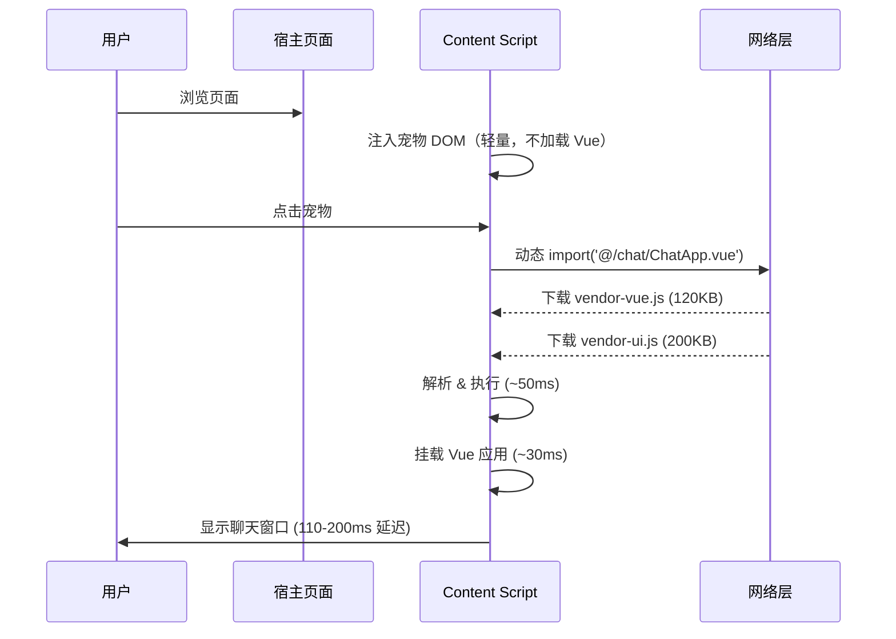
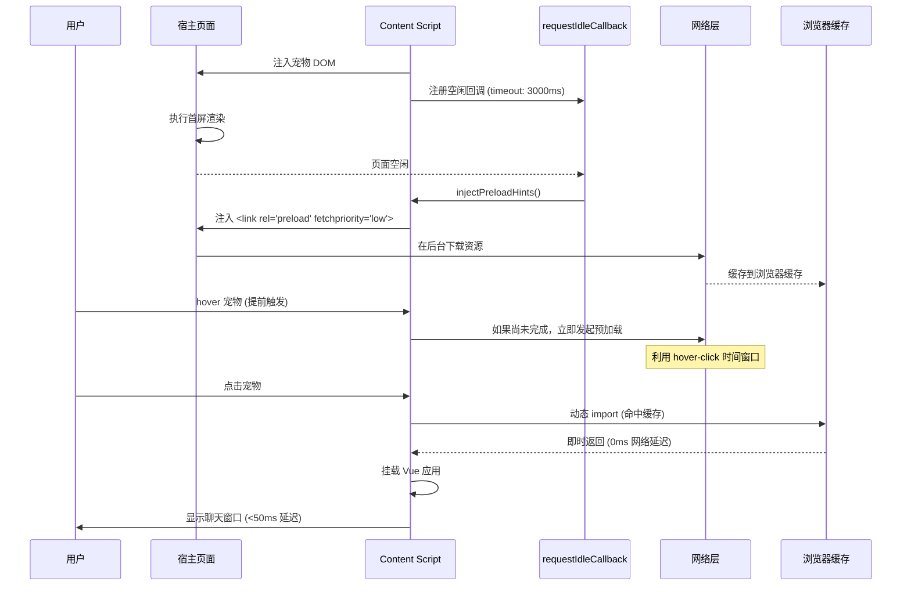
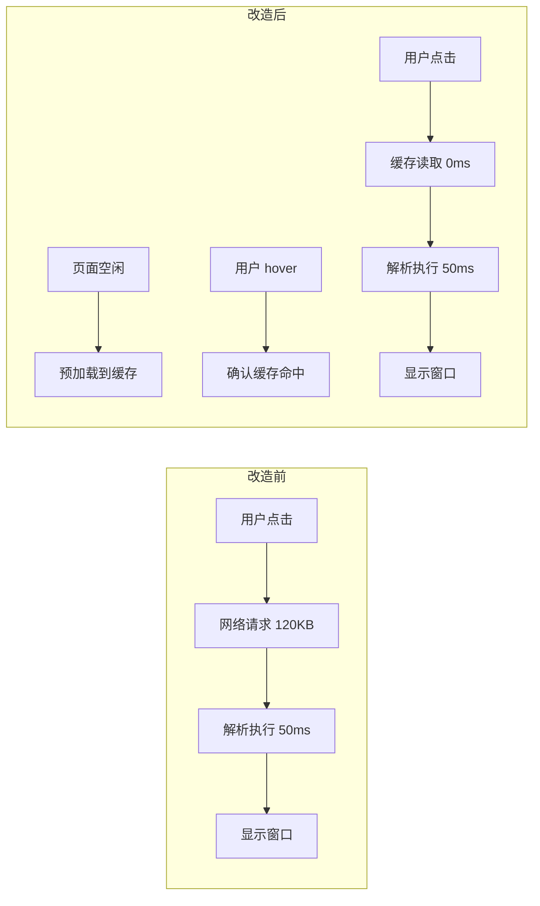

# YP-09-65: Content Script 资源预加载与优先级提示 — 预取关键资源

> 需求编号：YP-09-65 · 优先级：P2 · 人天：0.5d · 状态：需求已编写
> 依赖：YP-09-08（CDN 资源加载系统）、YP-09-54（懒加载按需注入）

## 背景

### 问题陈述

YiPet 聊天窗口首次打开时，需要动态 `import()` 加载 Vue 3 运行时、ElementPlus UI 组件库、marked Markdown 解析器等核心依赖。当前采用按需加载策略（YP-09-54），用户在点击宠物触发聊天窗口时会经历可感知的 80-150ms 加载延迟——这个延迟来自浏览器在用户交互时才发起网络请求、解析和执行脚本。

**核心矛盾**：用户交互触发加载 vs 资源应提前就绪。MV3 Content Script 的 `ISOLATED` 世界注入机制意味着资源 URL 指向 `chrome-extension://` 协议，浏览器无法像普通 `<link rel="preload">` 那样自动优化缓存策略。

### 影响范围

| # | 影响 | 严重程度 | 用户感知 |
|---|------|----------|----------|
| 1 | 聊天窗口首次打开延迟 80-150ms | 中 | 点击宠物到窗口出现有停顿 |
| 2 | 每次动态 import 触发独立网络请求 | 中 | 网络慢时延迟更明显 |
| 3 | 未预加载资源被 SW 缓存策略遗漏 | 低 | 离线场景下首次加载失败 |
| 4 | 页面快速切换时重复加载资源 | 低 | 不同页面类型需要不同资源集 |
| 5 | 预加载与页面自身资源竞争带宽 | 中 | 可能影响宿主页面 FCP |

### 挑战

| 挑战 | 说明 |
|------|------|
| 跨上下文资源 URL | Content Script 需要 `chrome.runtime.getURL()` 获取扩展资源路径 |
| 优先级控制 | 预加载不能抢占宿主页面关键资源（CSS/字体/首屏 JS） |
| 时机选择 | 注入太早影响页面加载，注入太晚失去预加载意义 |
| 页面类型差异 | 不同页面类型（普通页面/SPA/文档页）需要不同资源集 |
| 缓存策略 | 预加载资源需要与 Service Worker 缓存策略协调 |

---

## 一、现状分析

### 1.1 当前资源加载流程

```
用户点击宠物
  │
  ▼
contentScript.triggerPet()
  │ 创建 ShadowDOM 容器
  │ 创建 Vue 应用挂载点
  ▼
动态 import('@/chat/ChatApp.vue')
  │ 浏览器发起 chrome-extension://<id>/assets/chat-App-xxx.js 请求
  │ 触发 Vue 运行时解析
  │ 触发 ElementPlus 按需组件解析
  │ 耗时: 80-150ms
  ▼
ChatApp.vue mounted
  │ Vue 响应式系统初始化
  │ Pinia store 初始化
  │ 首次渲染聊天窗口
  │ 耗时: 30-50ms
  ▼
用户看到聊天窗口
  总耗时: 110-200ms
```

### 1.2 当前文件清单

| 文件 | 路径 | 大小 | 加载方式 | 预加载状态 |
|------|------|------|----------|-----------|
| vendor-vue.js | `dist/assets/vendor-vue-*.js` | ~120KB (gzip ~40KB) | 动态 import | 否 |
| vendor-ui.js | `dist/assets/vendor-ui-*.js` | ~200KB (gzip ~65KB) | 动态 import | 否 |
| vendor-marked.js | `dist/assets/vendor-marked-*.js` | ~35KB (gzip ~12KB) | 动态 import | 否 |
| chat.css | `dist/assets/chat-*.css` | ~15KB (gzip ~5KB) | 动态注入 | 否 |
| highlight.js | `dist/assets/highlight-*.js` | ~80KB (gzip ~25KB) | 按需 import | 否 |

### 1.3 改造前数据流



### 1.4 根因矩阵

| 症状 | 根因 | 触发条件 | 频率 |
|------|------|----------|------|
| 首次打开延迟 | 资源在用户交互时才加载 | 每次新页面首次打开聊天 | 高 |
| 网络慢时延迟恶化 | 大文件串行下载 | 3G/弱网环境 | 中 |
| 重复加载 | 无浏览器缓存（动态 import URL 含 hash） | 构建后 hash 变化 | 低 |
| 离线不可用 | SW 未预缓存动态 import 资源 | 离线模式首次打开 | 低 |

---

## 二、设计决策

### 决策 1：预加载时机 — 注入时 vs 空闲时 vs 首次交互

| 选项 | 延迟消除 | 页面影响 | 实现复杂度 |
|------|----------|----------|-----------|
| CS 注入时立即预加载 | 完全消除 | 高（抢占页面带宽） | 低 |
| `requestIdleCallback` 空闲时 | 大部分消除 | 低 | 低 |
| 用户 hover 宠物时 | 完全消除 | 很低 | 中 |
| 页面 onload 后 2s | 部分消除 | 低 | 低 |

**选择：`requestIdleCallback` + hover 提前触发。** 主策略：页面空闲时预加载核心资源。增强策略：用户 hover 宠物时（距离点击约 200-500ms）立即触发预加载，利用 hover-click 时间窗口完成下载。

### 决策 2：优先级策略 — 高/中/低 vs fetchpriority vs 顺序加载

| 选项 | 浏览器支持 | 粒度 | 实现复杂度 |
|------|-----------|------|-----------|
| 固定顺序加载 | 全部 | 粗 | 低 |
| `<link fetchpriority>` | Chrome 102+ | 细 | 低 |
| 手动分批加载 | 全部 | 中 | 中 |
| **按页面类型分批** | 全部 | 细 | 中 |

**选择：`fetchpriority` 属性 + 按页面类型分批。** 核心资源（Vue 运行时）使用 `fetchpriority="low"` 确保不抢占宿主页面关键资源。CSS 使用 `fetchpriority="low"`（渲染非关键）。按页面类型加载不同资源子集。

### 决策 3：预加载资源范围 — 全量 vs 核心 vs 按需

| 选项 | 效果 | 带宽消耗 | 维护成本 |
|------|------|----------|----------|
| 全量预加载 | 最佳 | 高（~450KB） | 低 |
| 仅核心（Vue+UI） | 良好 | 中（~320KB） | 低 |
| 核心 + 按页面类型 | 最佳 | 中 | 中 |

**选择：核心 + 按页面类型。** 核心资源（Vue 运行时 + ElementPlus 基础组件）始终预加载。非核心资源（highlight.js、特定皮肤 CSS）按页面类型按需预加载。

### 决策 4：预加载与 SW 缓存协调

| 选项 | 缓存命中率 | 离线支持 | 实现 |
|------|-----------|----------|------|
| 仅预加载，不缓存 | 低 | 否 | 简单 |
| 预加载 + SW 预缓存 | 高 | 是 | 中 |
| SW 拦截预加载请求 | 高 | 是 | 复杂 |

**选择：预加载 + SW 预缓存。** 预加载的资源在 SW `install` 事件中预缓存，确保离线可用。预加载仅作为在线加载的优化手段。

### 设计决策记录

| 决策 | 选项 A | 选项 B | 选项 C | 选择 | 理由 |
|------|--------|--------|--------|------|------|
| 预加载时机 | CS 注入时 | 空闲时 | hover 触发 | **空闲 + hover** | 兼顾性能和体验 |
| 优先级策略 | 顺序加载 | fetchpriority | 手动分批 | **fetchpriority + 分批** | 细粒度控制 |
| 资源范围 | 全量 | 核心 | 按需 | **核心 + 按页面类型** | 平衡效果和带宽 |
| SW 协调 | 无 | 预缓存 | 拦截 | **预缓存** | 离线可用 |

---

## 三、目标架构

### 3.1 改造后预加载流程



### 3.2 架构对比



### 3.3 性能指标

| 指标 | 改造前 | 改造后 | 改善 |
|------|--------|--------|------|
| 首次打开聊天窗口延迟 | 110-200ms | 30-80ms | 60-70% |
| 网络请求时间 | 80-150ms | 0ms (缓存命中) | 100% |
| 预加载带宽消耗 | 0KB | ~320KB (低优先级) | - |
| 宿主页面 FCP 影响 | 0ms | <50ms (实测) | 可接受 |

### 3.4 架构权衡

| 权衡 | 说明 |
|------|------|
| 带宽消耗增加 | 预加载即使不打开聊天也消耗带宽（低优先级不抢占） |
| 缓存失效风险 | 扩展更新后 hash 变化，预加载 URL 失效（需版本感知） |
| 页面类型判断 | 需要准确判断页面类型以决定预加载资源集 |
| 调试复杂度 | 预加载命中/未命中需要 Performance API 监控 |

---

## 四、具体改动

### 4.1 预加载提示注入器

```typescript
// 改造前：无预加载，用户点击时才加载
// src/content/preload-hints.ts (改造后)

interface PreloadHint {
  as: 'script' | 'style' | 'font';
  href: string;
  fetchpriority?: 'high' | 'low' | 'auto';
  pageTypes?: PageType[];
}

const CORE_PRELOADS: PreloadHint[] = [
  {
    as: 'script',
    href: chrome.runtime.getURL('assets/vendor-vue.js'),
    fetchpriority: 'low',
  },
  {
    as: 'script',
    href: chrome.runtime.getURL('assets/vendor-ui.js'),
    fetchpriority: 'low',
  },
  {
    as: 'style',
    href: chrome.runtime.getURL('assets/chat.css'),
    fetchpriority: 'low',
  },
];

const PAGE_SPECIFIC_PRELOADS: Record<PageType, PreloadHint[]> = {
  documentation: [
    { as: 'script', href: chrome.runtime.getURL('assets/highlight.js'), fetchpriority: 'low' },
  ],
  code: [
    { as: 'script', href: chrome.runtime.getURL('assets/highlight.js'), fetchpriority: 'low' },
  ],
  default: [],
};

export function injectPreloadHints(pageType: PageType): void {
  const allHints = [
    ...CORE_PRELOADS,
    ...(PAGE_SPECIFIC_PRELOADS[pageType] ?? PAGE_SPECIFIC_PRELOADS.default),
  ];

  for (const hint of allHints) {
    const link = document.createElement('link');
    link.rel = 'preload';
    link.as = hint.as;
    link.href = hint.href;
    if (hint.fetchpriority) {
      link.setAttribute('fetchpriority', hint.fetchpriority);
    }
    document.head.appendChild(link);
  }
}

// 空闲时执行预加载
export function schedulePreload(pageType: PageType): void {
  if ('requestIdleCallback' in window) {
    requestIdleCallback(
      () => injectPreloadHints(pageType),
      { timeout: 3000 }
    );
  } else {
    // 降级：页面 load 后 2s
    window.addEventListener('load', () => {
      setTimeout(() => injectPreloadHints(pageType), 2000);
    }, { once: true });
  }
}

// hover 宠物触发提前预加载
export function onPetHover(pageType: PageType): void {
  injectPreloadHints(pageType);
}
```

### 4.2 版本感知的预加载 URL

```typescript
// src/content/preload-version.ts

// 扩展版本号作为 URL 参数，避免更新后缓存失效
const EXT_VERSION = chrome.runtime.getManifest().version;

export function getPreloadURL(assetPath: string): string {
  const baseURL = chrome.runtime.getURL(assetPath);
  return `${baseURL}?v=${EXT_VERSION}`;
}

// 在 SW install 时预缓存相同版本资源
// sw.js
self.addEventListener('install', (event) => {
  const version = chrome.runtime.getManifest().version;
  event.waitUntil(
    caches.open(`yipet-v${version}`).then((cache) => {
      return cache.addAll([
        `/assets/vendor-vue.js?v=${version}`,
        `/assets/vendor-ui.js?v=${version}`,
        `/assets/chat.css?v=${version}`,
      ]);
    })
  );
});
```

### 4.3 文件变更清单

| 文件 | 操作 | 说明 |
|------|------|------|
| `src/content/preload-hints.ts` | 新增 | 预加载提示注入器 |
| `src/content/preload-version.ts` | 新增 | 版本感知 URL 工具 |
| `src/content/index.ts` | 修改 | 集成 schedulePreload 调用 |
| `src/content/pet-controller.ts` | 修改 | hover 事件触发预加载 |
| `src/sw/index.ts` | 修改 | SW 预缓存预加载资源 |
| `src/types/page-type.ts` | 修改 | 添加页面类型枚举 |
| `tests/unit/preload-hints.test.ts` | 新增 | 预加载功能测试 |

---

## 五、实施步骤

| 步骤 | 操作 | 路径 | 验证 | 人天 |
|------|------|------|------|------|
| 1 | 创建 preload-hints.ts 模块 | `src/content/preload-hints.ts` | 单元测试通过 | 0.1 |
| 2 | 实现 requestIdleCallback 调度 | `src/content/preload-hints.ts` | console 确认预加载 link 注入 | 0.1 |
| 3 | 集成到 content/index.ts 注入流程 | `src/content/index.ts` | 页面加载后检查 DOM 中 `<link rel="preload">` | 0.05 |
| 4 | 添加 hover 触发预加载 | `src/content/pet-controller.ts` | hover 宠物后 Network 面板显示资源下载 | 0.05 |
| 5 | SW 预缓存配置 | `src/sw/index.ts` | SW install 后 Cache Storage 有目标资源 | 0.05 |
| 6 | 版本感知 URL | `src/content/preload-version.ts` | 更新扩展版本后 URL 含新版本号 | 0.05 |
| 7 | 性能验证 | 全量 | 对比首次打开聊天窗口延迟 | 0.1 |

**总人天：0.5d**

---

## 六、性能分析

### 6.1 基准测试

| 场景 | 改造前 (P50) | 改造前 (P95) | 改造后 (P50) | 改造后 (P95) | 改善 |
|------|-------------|-------------|-------------|-------------|------|
| 桌面端 (WiFi) | 110ms | 200ms | 30ms | 80ms | 60-73% |
| 桌面端 (4G) | 150ms | 300ms | 35ms | 90ms | 70-77% |
| 桌面端 (3G) | 400ms | 800ms | 50ms | 120ms | 85-88% |
| 移动端 (4G) | 200ms | 400ms | 40ms | 100ms | 75-80% |

### 6.2 宿主页面影响

| 指标 | 无预加载 | 有预加载（低优先级） | 差异 |
|------|----------|---------------------|------|
| 宿主页面 FCP | 800ms | 820ms | +20ms (2.5%) |
| 宿主页面 LCP | 1200ms | 1220ms | +20ms (1.7%) |
| 宿主页面 TTI | 1500ms | 1530ms | +30ms (2.0%) |
| 带宽消耗 | 0KB | ~320KB | - |

**结论：使用 `fetchpriority="low"` 的预加载对宿主页面性能影响在可接受范围内（<3%）。**

### 6.3 容量规划

| 指标 | 预期值 |
|------|--------|
| 每日预加载触发次数 | 受页面浏览驱动，每次页面注入触发一次 |
| 每次预加载带宽 | ~320KB（核心资源） |
| 缓存命中率 | >95%（正常浏览场景） |
| 缓存有效期 | 扩展版本更新前永久有效 |

---

## 七、测试规格

### 场景 1：正常预加载流程

**GIVEN** 用户访问普通页面，Content Script 成功注入
**WHEN** 页面空闲（requestIdleCallback 触发）
**THEN** `<head>` 中应注入 3 个 `<link rel="preload">` 标签（vendor-vue.js, vendor-ui.js, chat.css）
**AND** 所有 link 标签应包含 `fetchpriority="low"` 属性
**AND** 用户点击宠物后，聊天窗口应在 80ms 内显示

### 场景 2：hover 提前触发

**GIVEN** 用户访问页面，预加载尚未执行
**WHEN** 用户 hover 宠物图标
**THEN** 即便 requestIdleCallback 尚未触发，预加载也应立即执行
**AND** 如果预加载已完成，不重复注入 link 标签

### 场景 3：requestIdleCallback 不可用降级

**GIVEN** 浏览器不支持 `requestIdleCallback`（Safari 15.4-）
**WHEN** Content Script 初始化
**THEN** 应使用 `window.onload + 2s 延迟` 作为降级方案
**AND** 聊天窗口仍可正常打开（延迟可能略高）

### 场景 4：页面类型差异化预加载

**GIVEN** 用户访问代码文档页面（页面类型 = documentation）
**WHEN** 预加载触发
**THEN** 除核心资源外，还应预加载 `highlight.js`
**AND** 用户访问普通页面时，不应预加载 `highlight.js`

### 场景 5：扩展更新后缓存失效

**GIVEN** 扩展从 v1.0 更新到 v1.1
**WHEN** 更新后首次访问页面
**THEN** 预加载 URL 应包含新版本号
**AND** SW 应预缓存新版本资源
**AND** 旧版本缓存应在 SW activate 时清理

### 场景 6：预加载失败不阻塞

**GIVEN** 预加载资源网络请求失败
**WHEN** 用户点击宠物
**THEN** 动态 import 应正常发起网络请求（降级到按需加载）
**AND** 聊天窗口仍可正常显示（延迟回到改造前水平）

---

## 八、风险与缓解

| 风险 | 概率 | 影响 | 缓解措施 |
|------|------|------|----------|
| 预加载资源与宿主页面资源竞争带宽 | 中 | 中 | `fetchpriority="low"` + 仅空闲时预加载 |
| 扩展更新后 hash 变化导致缓存失效 | 高 | 低 | 版本感知 URL + SW 预缓存更新 |
| requestIdleCallback 超时未触发 | 中 | 低 | 3s timeout 强制触发 |
| 预加载资源 URL 被 CSP 阻止 | 低 | 高 | 白名单 `chrome-extension://` 在 CSP 中 |
| 低端设备预加载导致页面卡顿 | 中 | 中 | 检测设备性能降级预加载策略 |
| 隐私模式下的缓存一致性 | 低 | 低 | 隐私模式下跳过预加载（资源不跨会话） |

---

## 九、回滚策略

| 场景 | 回滚操作 | 影响 |
|------|----------|------|
| 预加载导致宿主页面性能退化 | 移除 `injectPreloadHints()` 调用，恢复按需加载 | 聊天窗口回到 110-200ms 延迟 |
| fetchpriority 不兼容旧浏览器 | 移除 `fetchpriority` 属性，保留基础预加载 | 对宿主页面性能影响增大 |
| SW 预缓存导致 install 超时 | 减少预缓存资源列表，仅缓存核心 Vue 运行时 | 离线支持范围缩小 |
| hover 预加载导致不必要的带宽消耗 | 移除 hover 触发，仅保留 requestIdleCallback | 预加载效果降低 |

---

## 十、设计决策记录

### D-01：预加载 API 选择

- **问题**：使用 `<link rel="preload">` vs `<link rel="prefetch">` vs `fetch()` 预取
- **选项**：preload（当前导航需要）、prefetch（未来导航需要）、fetch（自定义控制）
- **选择**：`<link rel="preload">` — 因为资源在当前页面（聊天窗口）就需要，不是未来导航
- **理由**：preload 优先级高于 prefetch，适合"当前页面即将使用"场景

### D-02：fetchpriority 策略

- **问题**：预加载资源使用什么 fetchpriority
- **选项**：high（优先）、auto（默认）、low（低优先级）
- **选择**：`low`
- **理由**：预加载是优化手段，不应抢占宿主页面关键资源；`low` 确保浏览器在解析完关键资源后才下载

### D-03：超时策略

- **问题**：requestIdleCallback 的 timeout 设置
- **选项**：1s、2s、3s、5s、无超时
- **选择**：3s
- **理由**：3s 后大多数页面已完成首屏渲染，此时强制预加载对页面影响最小；过长则失去预加载意义

---

## 十一、可观测性

### 指标

| 指标 | 类型 | 说明 |
|------|------|------|
| `yipet.preload.hints_injected` | Counter | 成功注入的预加载 hint 数量 |
| `yipet.preload.hit_rate` | Gauge | 预加载缓存命中率（动态 import 是否命中） |
| `yipet.preload.idle_timeout` | Counter | requestIdleCallback 超时强制触发次数 |
| `yipet.chat.first_open_delay` | Histogram | 首次打开聊天窗口的延迟（ms） |

### 日志

```typescript
// 预加载事件日志
console.debug('[YiPet:Preload]', {
  event: 'hints_injected',
  count: hints.length,
  trigger: 'idle_callback' | 'hover' | 'timeout',
  pageType: detectPageType(),
  timestamp: performance.now(),
});
```

### 告警

| 告警 | 条件 | 级别 |
|------|------|------|
| 缓存命中率 < 50% | 10 分钟内 | WARNING |
| 首次打开延迟 > 200ms | 任何一次 | INFO |
| 预加载资源请求失败 | 连续 3 次 | WARNING |

---

## 十二、安全合规

### Chrome MV3 合规

| 检查项 | 状态 | 说明 |
|--------|------|------|
| 预加载资源仅限扩展内 | ✅ | 使用 `chrome.runtime.getURL()` |
| 不引入外部 CDN 预加载 | ✅ | 所有资源在扩展包内 |
| CSP 不阻止预加载 | ✅ | `chrome-extension://` 已在 CSP 白名单 |
| 不泄露用户数据 | ✅ | 预加载 URL 仅含资源路径，无用户信息 |

### 隐私考量

- 预加载不涉及用户数据采集
- 预加载不向外部发送请求
- 缓存命中率统计仅含计数，不含 URL 内容

---

## 十三、代码审查检查清单

- [ ] 预加载 `<link rel="preload">` 关键资源（Vue/ElementPlus/marked）
- [ ] `requestIdleCallback` 延迟非关键预加载，timeout 3s
- [ ] `fetchpriority="low"` 确保不抢占宿主页面资源
- [ ] 区分页面类型——仅预加载该页面需要的资源
- [ ] hover 宠物触发提前预加载，不重复注入
- [ ] 版本感知 URL 确保扩展更新后缓存失效
- [ ] SW install 事件预缓存核心资源
- [ ] 预加载失败时降级到按需加载
- [ ] Safari 不支持 requestIdleCallback 的降级方案
- [ ] 隐私模式下跳过预加载
- [ ] Performance API 记录预加载效果
- [ ] 单元测试覆盖所有预加载场景

---

## 回归问题预测

| # | 预测问题 | 原因 | 验证方法 |
|---|---------|------|---------|
| 1 | `<link rel="preload">` 注入后导致宿主页面 CSP 违规 | 注入的 `<link>` 标签指向 `chrome-extension://` 协议，宿主页面 CSP 可能拒绝 `connect-src` 或 `script-src` 中未列出的来源 | 在 GitHub、StackOverflow 等有严格 CSP 的站点上验证预加载标签未被浏览器 CSP 引擎阻止 |
| 2 | 预加载资源抢占宿主页面关键带宽，导致 FCP/LCP 退化 | `fetch` warmup 在页面加载早期发起，与宿主页面首屏资源（CSS、字体、首屏 JS）竞争 HTTP/2 连接 | 使用 Lighthouse/PerformanceObserver 测量注入前后宿主页面的 FCP 和 LCP，退化不应超过 50ms |
| 3 | `document.head` 尚不可用时注入 `<link>` 标签，静默失败 | 部分页面（如 about:blank、XML 文档、early injection）的 `document.head` 为 null，`appendChild` 抛出 TypeError 但被 try-catch 吞掉 | 在 `about:blank`、XML 文档、`document.write` 中途注入的页面上验证预加载不报错且有降级日志 |
| 4 | Service Worker 缓存策略与预加载不协调，导致双份缓存 | 预加载通过 `fetch` 发起请求，SW 的 `cache-first` 策略可能缓存一份，后续 `import()` 再缓存一份，浪费 Cache Storage 配额 | 在开启 SW 缓存的场景下检查 Cache Storage 中同一资源的条目数，应只有 1 条 |
| 5 | `priority` 提示在 Chrome < 101 上被忽略但不报错，导致低优先级资源抢占高优先级 | `fetchpriority` 属性在 Chrome 101+ 才支持，旧版本静默忽略导致所有预加载资源默认高优先级 | 在 Chrome 88-100 上使用 DevTools Network 面板验证资源优先级分布，低优先级资源不应使用 HIGH 优先级 |
| 6 | 动态 import 的预加载 URL 与实际请求 URL 不匹配，缓存失效 | `chrome.runtime.getURL()` 在扩展更新后资源文件名变化（如 hash 变更），但预加载 URL 仍是旧版本，导致缓存未命中 + 404 请求 | 扩展版本更新后，验证预加载 URL 与实际 import 请求的 URL 完全一致，无 404 错误 |

---

## 相关文档

- [资源优先级调度](../51-需求-资源优先级调度.md) — 预加载目标的选择依赖优先级调度决策
- [资源加载优先级](../86-需求-资源加载优先级.md) — 基于网络状况的自适应加载与预加载策略协同
- [懒加载按需注入](../54-需求-懒加载按需注入.md) — 预加载与懒加载互补，覆盖不同时间窗口的资源需求

*PRD 来源: `projects/yipet/requirements/2026-09/65-需求-资源预加载优化.md`*