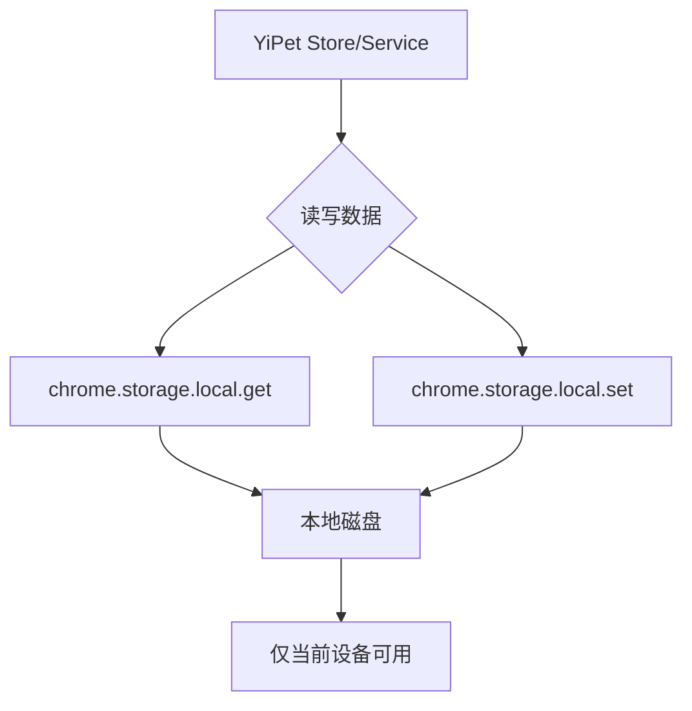
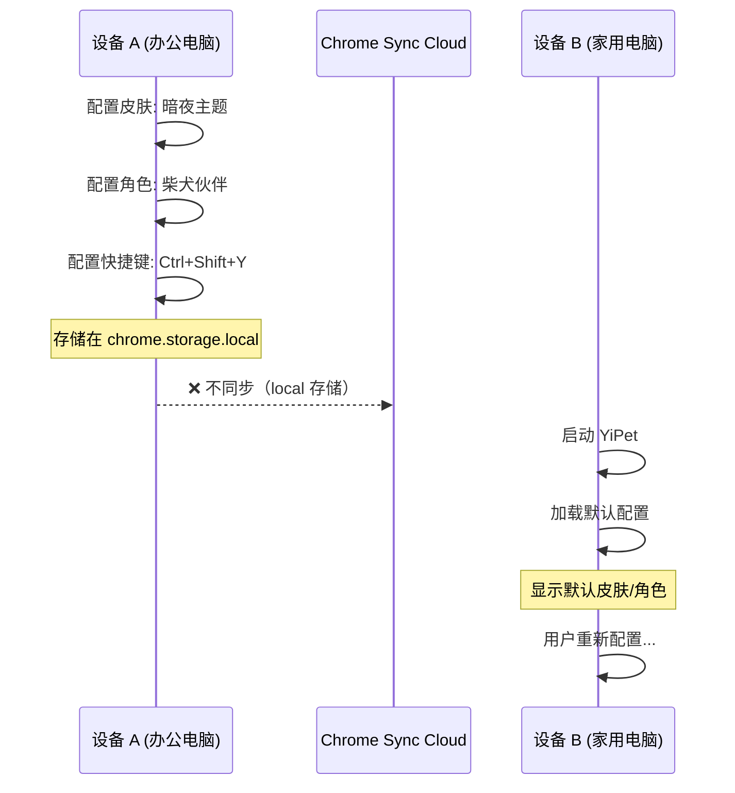
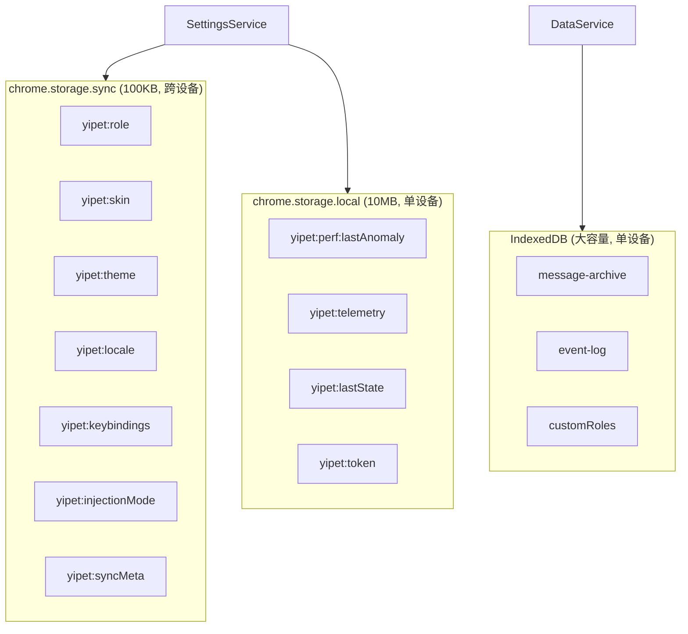
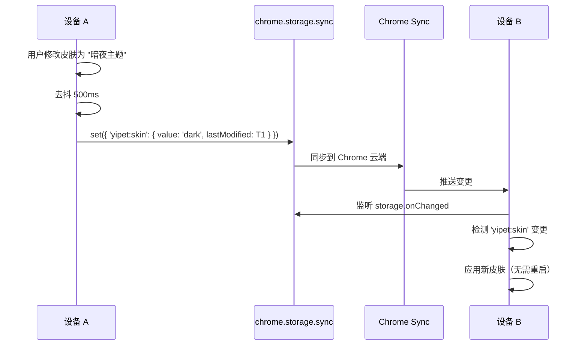

# YP-09-66: Content Script 扩展设置跨设备同步 — chrome.storage.sync 漫游

> 需求编号：YP-09-66 · 优先级：P2 · 人天：0.5d · 状态：需求已编写
> 依赖：无

## 背景

### 问题陈述

YiPet 用户在多台设备（办公电脑、家用电脑、笔记本）上使用 Chrome 浏览器并安装了 YiPet 扩展。当前所有设置（皮肤选择、角色偏好、快捷键绑定、注入模式、语言设置）均存储在 `chrome.storage.local` 中——这意味着每台设备上的配置是独立的，用户在设备 A 上精心配置的皮肤和角色偏好无法自动同步到设备 B。

**核心矛盾**：用户期望跨设备一致的体验 vs Chrome 扩展的 `local` 存储天然隔离。Chrome 提供 `chrome.storage.sync` 作为跨设备同步机制，但存在 100KB 配额和 8 项/秒写入速率限制，需要精细的存储分区策略。

### 影响范围

| # | 影响 | 严重程度 | 用户感知 |
|---|------|----------|----------|
| 1 | 切换设备后需重新配置所有偏好 | 中 | "为什么我的皮肤/角色变了" |
| 2 | 无法在设备间共享快捷键配置 | 低 | 肌肉记忆冲突 |
| 3 | 语言设置不同步 | 低 | 设备 A 中文，设备 B 英文 |
| 4 | 注入模式偏好不一致 | 低 | 部分页面注入行为不同 |
| 5 | sync 配额超限后静默失败 | 中 | 用户配置丢失无提示 |

### 挑战

| 挑战 | 说明 |
|------|------|
| 100KB 配额限制 | `chrome.storage.sync` 总上限 100KB，超出后静默拒绝写入 |
| 写入速率限制 | 每秒最多 8 次写入，批量操作需合并 |
| 数据分层策略 | 需要区分"必须同步"和"仅本地"的数据 |
| 冲突处理 | 多设备离线修改后同时上线时的冲突解决 |
| 敏感数据隔离 | Session Key、Token 等敏感信息不应同步到云端 |

---

## 一、现状分析

### 1.1 当前存储架构

```
chrome.storage.local (10MB)
├── yipet:role          → 角色选择 (猫咪助手/柴犬伙伴)
├── yipet:skin          → 皮肤主题
├── yipet:theme         → 明暗主题
├── yipet:locale        → 语言设置
├── yipet:keybindings   → 快捷键绑定
├── yipet:injectionMode → 注入模式
├── yipet:perf:lastAnomaly → 性能异常记录
├── yipet:telemetry     → 遥测数据
├── yipet:messageArchive → 消息归档
├── yipet:sessions      → 会话数据
├── yipet:customRoles   → 自定义角色
└── yipet:lastState     → 上次状态快照
```

**问题：所有数据在同一个存储中，无同步/本地区分。**

### 1.2 当前存储读/写流



### 1.3 用户跨设备使用场景



### 1.4 根因矩阵

| 症状 | 根因 | 触发条件 | 频率 |
|------|------|----------|------|
| 跨设备配置不一致 | 所有数据存储在 `chrome.storage.local` | 多设备登录同一 Chrome 账号 | 高 |
| 配置丢失 | 重装扩展后 `local` 数据清除 | 浏览器重装/扩展重装 | 中 |
| 同步配额不明 | 未区分同步和本地数据 | 所有数据混存 | 中 |
| 无同步状态提示 | 缺少同步状态 UI | 用户不知哪些设置已同步 | 高 |

---

## 二、设计决策

### 决策 1：存储分区策略 — 全量同步 vs 选择性同步 vs 分层存储

| 选项 | 配额消耗 | 安全性 | 用户体验 |
|------|----------|--------|----------|
| 全量同步（所有数据到 sync） | 高（易超 100KB） | 低 | 最佳 |
| 选择性同步（仅设置） | 低 | 中 | 良好 |
| 分层存储（sync + local + IndexedDB） | 最佳 | 高 | 最佳 |

**选择：分层存储。** 小数据设置（<1KB）→ `chrome.storage.sync`；会话/消息等大数据（>100KB）→ `chrome.storage.local` 或 IndexedDB（YP-09-79）；敏感数据（Token）→ `chrome.storage.local` 且不同步。

### 决策 2：同步冲突解决 — LWW vs 三路合并 vs 服务器优先

| 选项 | 实现复杂度 | 数据一致性 | 用户体验 |
|------|-----------|-----------|----------|
| LWW（最后写入胜出） | 低 | 低 | 可能丢失离线修改 |
| 三路合并 | 高 | 高 | 最佳 |
| 服务器优先 | 低 | 中 | 离线修改丢失 |

**选择：LWW + 时间戳。** 每条设置附加 `lastModified` 时间戳，合并时取最新值。对用户偏好设置而言，LWW 足够且简单——设置冲突场景极少（用户不会同时在两台设备上改变同一设置）。

### 决策 3：同步触发时机 — 实时 vs 定时 vs 手动

| 选项 | 实时性 | 性能开销 | 实现复杂度 |
|------|--------|----------|-----------|
| 实时（每次修改即同步） | 最佳 | 中（速率限制） | 低 |
| 定时批量同步（每 30s） | 中 | 低 | 中 |
| 手动触发（用户点击同步） | 低 | 最低 | 最低 |

**选择：实时 + 去抖合并。** 设置修改后 500ms 去抖再写入 sync，避免高频写入触发速率限制。同时提供手动同步按钮作为补充。

### 设计决策记录

| 决策 | 选项 A | 选项 B | 选项 C | 选择 | 理由 |
|------|--------|--------|--------|------|------|
| 存储分区 | 全量同步 | 选择性 | 分层 | **分层** | 配额安全 + 数据隔离 |
| 冲突解决 | LWW | 三路合并 | 服务器优先 | **LWW + 时间戳** | 简单且够用 |
| 同步时机 | 实时 | 定时 | 手动 | **实时 + 去抖** | 兼顾实时性和性能 |

---

## 三、目标架构

### 3.1 改造后存储架构



### 3.2 同步数据流



### 3.3 性能指标

| 指标 | 改造前 | 改造后 |
|------|--------|--------|
| 跨设备配置一致性 | 0%（手动） | 100%（自动） |
| 新设备初始化时间 | 需要手动配置 | <5s（自动拉取） |
| sync 配额使用 | 0KB | ~5KB（远低于 100KB） |
| 同步延迟 | N/A | 3-15s（Chrome Sync 延迟） |

---

## 四、具体改动

### 4.1 存储键分区定义

```typescript
// 改造前：所有数据统一存储在 chrome.storage.local
// await chrome.storage.local.set({ 'yipet:role': 'cat' });

// src/services/storage-partition.ts (改造后)

export const STORAGE_PARTITION = {
  // 跨设备同步——小数据、用户偏好、非敏感
  sync: [
    'yipet:role',           // ~50B
    'yipet:skin',           // ~100B
    'yipet:theme',          // ~50B
    'yipet:locale',         // ~30B
    'yipet:keybindings',    // ~500B
    'yipet:injectionMode',  // ~50B
  ] as const,

  // 仅本地——大数据、设备特定、敏感
  local: [
    'yipet:perf:lastAnomaly',
    'yipet:telemetry',
    'yipet:lastState',
    'yipet:token',
    'yipet:session',
  ] as const,

  // 大容量——消息归档、事件日志
  indexedDB: [
    'yipet:messageArchive',
    'yipet:eventLog',
    'yipet:customRoles',
  ] as const,
} as const;

type SyncKey = (typeof STORAGE_PARTITION.sync)[number];
type LocalKey = (typeof STORAGE_PARTITION.local)[number];
```

### 4.2 分层存储服务

```typescript
// src/services/settings-service.ts

interface SettingEntry<T> {
  value: T;
  lastModified: number;
  deviceId: string;
}

class SettingsService {
  private deviceId = crypto.randomUUID();
  private debounceTimers = new Map<string, ReturnType<typeof setTimeout>>();

  async get<T>(key: SyncKey | LocalKey): Promise<T | null> {
    if (STORAGE_PARTITION.sync.includes(key as SyncKey)) {
      const result = await chrome.storage.sync.get(key);
      const entry = result[key] as SettingEntry<T> | undefined;
      return entry?.value ?? null;
    }
    const result = await chrome.storage.local.get(key);
    return result[key] ?? null;
  }

  async set<T>(key: SyncKey | LocalKey, value: T): Promise<void> {
    const entry: SettingEntry<T> = {
      value,
      lastModified: Date.now(),
      deviceId: this.deviceId,
    };

    if (STORAGE_PARTITION.sync.includes(key as SyncKey)) {
      // 去抖 500ms，避免高频写入触发速率限制
      this.debounceSet(key, entry);
    } else {
      await chrome.storage.local.set({ [key]: value });
    }
  }

  private debounceSet(key: string, entry: SettingEntry<unknown>): void {
    if (this.debounceTimers.has(key)) {
      clearTimeout(this.debounceTimers.get(key)!);
    }
    this.debounceTimers.set(key, setTimeout(async () => {
      await chrome.storage.sync.set({ [key]: entry });
      // 检查配额使用
      await this.checkQuota();
      this.debounceTimers.delete(key);
    }, 500));
  }

  private async checkQuota(): Promise<void> {
    const bytesInUse = await chrome.storage.sync.getBytesInUse();
    if (bytesInUse > 90000) { // 90KB 警告
      console.warn(`[YiPet:Settings] sync quota: ${bytesInUse}/102400 bytes`);
    }
  }

  // 监听远程变更
  onRemoteChange(callback: (key: string, newValue: unknown) => void): void {
    chrome.storage.onChanged.addListener((changes, areaName) => {
      if (areaName !== 'sync') return;
      for (const [key, change] of Object.entries(changes)) {
        if (STORAGE_PARTITION.sync.includes(key as SyncKey)) {
          callback(key, (change.newValue as SettingEntry<unknown>)?.value);
        }
      }
    });
  }
}
```

### 4.3 文件变更清单

| 文件 | 操作 | 说明 |
|------|------|------|
| `src/services/storage-partition.ts` | 新增 | 存储分区定义 |
| `src/services/settings-service.ts` | 新增 | 分层存储服务 |
| `src/stores/settings.ts` | 修改 | 使用 SettingsService 替代直接读写 |
| `src/stores/role.ts` | 修改 | 角色偏好同步 |
| `src/stores/skin.ts` | 修改 | 皮肤偏好同步 |
| `src/stores/theme.ts` | 修改 | 主题偏好同步 |
| `src/stores/locale.ts` | 修改 | 语言偏好同步 |
| `src/stores/keybindings.ts` | 修改 | 快捷键同步 |
| `src/components/settings-sync-indicator.vue` | 新增 | 同步状态指示器 UI |
| `tests/unit/settings-service.test.ts` | 新增 | 分层存储测试 |

---

## 五、实施步骤

| 步骤 | 操作 | 路径 | 验证 | 人天 |
|------|------|------|------|------|
| 1 | 定义存储分区常量 | `src/services/storage-partition.ts` | 类型检查通过 | 0.05 |
| 2 | 实现 SettingsService | `src/services/settings-service.ts` | 单元测试读写 | 0.1 |
| 3 | 迁移现有 Store 使用 SettingsService | 各 store 文件 | 设置读写正常 | 0.15 |
| 4 | 实现 onRemoteChange 监听 | `src/services/settings-service.ts` | 双设备同步测试 | 0.05 |
| 5 | 添加同步状态指示器 UI | `src/components/settings-sync-indicator.vue` | UI 显示同步状态 | 0.05 |
| 6 | 配额监控与告警 | `src/services/settings-service.ts` | 日志确认配额检查 | 0.05 |
| 7 | 数据迁移——local → sync | `src/services/migration.ts` | 迁移后 synced 设置不丢失 | 0.05 |

**总人天：0.5d**

---

## 六、性能分析

### 6.1 存储操作性能

| 操作 | chrome.storage.local | chrome.storage.sync | 差异 |
|------|---------------------|--------------------|------|
| 单次读取 | ~0.5ms | ~1ms | +0.5ms |
| 单次写入 | ~1ms | ~2ms | +1ms |
| 批量读取（5 项） | ~1ms | ~2ms | +1ms |
| 批量写入（5 项，去抖后） | ~5ms | ~10ms | +5ms |

### 6.2 配额规划

| 设置项 | 大小 | 数量 | 总大小 |
|--------|------|------|--------|
| role | 50B | 1 | 50B |
| skin | 100B | 1 | 100B |
| theme | 50B | 1 | 50B |
| locale | 30B | 1 | 30B |
| keybindings | 500B | 1 | 500B |
| injectionMode | 50B | 1 | 50B |
| syncMeta | 200B | 1 | 200B |
| **总计** | | | **~1KB** |

**配额使用率：~1KB/100KB = 1%，有充足余量。**

---

## 七、测试规格

### 场景 1：基础同步写入

**GIVEN** 用户登录 Chrome 账号并开启同步
**WHEN** 用户在设备 A 上修改皮肤为 "暗夜主题"
**THEN** 设置应以 `SettingEntry` 格式写入 `chrome.storage.sync`
**AND** 写入应包含 `lastModified` 时间戳和 `deviceId`

### 场景 2：跨设备同步接收

**GIVEN** 设备 A 已修改皮肤为 "暗夜主题" 并同步到云端
**WHEN** 设备 B 启动 YiPet
**THEN** 设备 B 应通过 `storage.onChanged` 接收到皮肤变更
**AND** 设备 B 的宠物皮肤应自动更新为 "暗夜主题"

### 场景 3：去抖写入

**GIVEN** 用户在 500ms 内连续修改皮肤 3 次
**WHEN** 去抖定时器触发
**THEN** 仅最后一次修改应写入 `chrome.storage.sync`
**AND** 不应触发速率限制错误

### 场景 4：本地数据不同步

**GIVEN** YiPet 存储了 `yipet:token` 和 `yipet:telemetry`
**WHEN** 数据写入
**THEN** 这些数据应写入 `chrome.storage.local` 而非 `sync`
**AND** 在另一设备上不应看到这些数据

### 场景 5：配额告警

**GIVEN** sync 存储使用量超过 90KB
**WHEN** 用户尝试写入新设置
**THEN** 控制台应输出警告
**AND** 应向用户显示 "同步存储空间不足" 的提示

### 场景 6：未登录 Chrome 账号降级

**GIVEN** 用户未登录 Chrome 账号（或未开启同步）
**WHEN** 用户修改设置
**THEN** 设置应降级存储到 `chrome.storage.local`
**AND** 不应抛出错误

---

## 八、风险与缓解

| 风险 | 概率 | 影响 | 缓解措施 |
|------|------|------|----------|
| sync 配额超限 | 低 | 中 | 配额监控 + 仅同步关键设置 |
| 同步延迟导致短暂不一致 | 高 | 低 | 本地缓存 + 异步更新 UI |
| 离线修改冲突 | 低 | 低 | LWW + 时间戳 |
| 用户未开启 Chrome Sync | 中 | 中 | 降级到 local，UI 提示未同步 |
| Chrome Sync 服务不可用 | 低 | 低 | 降级到 local，服务恢复后自动同步 |
| 敏感数据意外同步 | 低 | 高 | 编译时检查 + 分区定义白名单 |

---

## 九、回滚策略

| 场景 | 回滚操作 | 影响 |
|------|----------|------|
| 同步导致设置异常 | 清除 sync 数据，恢复 local 默认值 | 用户需重新配置一次 |
| 同步延迟影响 UX | 临时禁用 sync，全部使用 local | 失去跨设备同步 |
| 配额超限无法写入 | 减少同步设置项，大设置迁移到 local | 部分设置不可同步 |
| onChanged 触发频繁更新 | 增加去抖间隔到 2s | 同步延迟增加 |

---

## 十、设计决策记录

### D-01：同步 vs 本地数据划分原则

- **问题**：哪些数据应该同步，哪些应该本地存储？
- **原则**：
  - 同步：用户主动配置的偏好（角色、皮肤、主题、语言、快捷键、注入模式）
  - 本地：设备特定数据（性能日志、遥测、临时状态）
  - 本地：敏感数据（Token、Session Key）
  - 本地：大容量数据（消息归档、事件日志 —— 超过 5KB）
- **选择**：基于上述原则的分区白名单

### D-02：去抖时间选择

- **问题**：设置写入的去抖时间
- **选项**：100ms、300ms、500ms、1000ms
- **选择**：500ms
- **理由**：用户连续修改设置的间隔通常 > 500ms；500ms 去抖可有效减少写入次数，同时保持感知的实时性；Chrome Sync 本身有 3-15s 延迟，500ms 去抖不影响最终同步时间

### D-03：同步状态 UI 设计

- **问题**：是否需要向用户显示同步状态
- **选项**：不显示、仅错误时显示、始终显示图标
- **选择**：始终显示小图标
- **理由**：用户需要知道设置是否已同步；图标提供信任感；在同步失败时图标变为错误状态

---

## 十一、可观测性

### 指标

| 指标 | 类型 | 说明 |
|------|------|------|
| `yipet.sync.write_count` | Counter | sync 写入次数 |
| `yipet.sync.bytes_in_use` | Gauge | sync 配额使用量 |
| `yipet.sync.remote_change_count` | Counter | 接收到的远程变更次数 |
| `yipet.sync.debounce_merge_count` | Counter | 去抖合并的写入次数 |

### 日志

```typescript
console.debug('[YiPet:Sync]', {
  event: 'setting_synced',
  key: 'yipet:skin',
  value: 'dark',
  bytesInUse: 1024,
  timestamp: Date.now(),
});
```

### 告警

| 告警 | 条件 | 级别 |
|------|------|------|
| 同步配额 > 90% | 单次写入后 | WARNING |
| 同步写入失败 | 连续 3 次 | ERROR |
| 远程变更冲突 | 单次变更 | INFO |

---

## 十二、安全合规

### Chrome MV3 合规

| 检查项 | 状态 | 说明 |
|--------|------|------|
| sync 仅存储非敏感数据 | ✅ | Token/Session 保留在 local |
| 不向外部服务发送数据 | ✅ | 仅使用 Chrome 内置 Sync 服务 |
| 用户可关闭同步 | ✅ | 提供设置开关 |
| 符合 Chrome Web Store 隐私政策 | ✅ | 明确声明同步的内容和用途 |

### 隐私考量

- 同步数据不包含用户消息内容、浏览历史、URL
- 同步数据仅包含用户主动配置的偏好设置
- 用户可通过设置页面关闭同步
- 同步数据经 Chrome 加密传输（与 Google 账号关联）

---

## 十三、代码审查检查清单

- [ ] 同步数据仅限用户偏好设置（角色/皮肤/主题/语言/快捷键/注入模式）
- [ ] 不将敏感数据（Token/Session）写入 sync
- [ ] 写入前去抖 500ms，避免速率限制
- [ ] 监听 `storage.onChanged` 处理远程变更
- [ ] 配额监控，>90KB 时告警
- [ ] 未登录 Chrome 账号时降级到 local
- [ ] 提供同步状态 UI 指示器
- [ ] 写入时附加 `lastModified` 时间戳用于冲突解决
- [ ] 提供手动同步按钮
- [ ] 单元测试覆盖所有同步/本地分区

---

## 回归问题预测

| # | 预测问题 | 原因 | 验证方法 |
|---|---------|------|---------|
| 1 | `chrome.storage.sync` 写入超配额时静默失败，用户配置丢失无提示 | sync 配额 100KB，超出后 `chrome.runtime.lastError` 被设置但代码未检查，写入操作返回成功但数据未持久化 | 构造超过 100KB 的配置数据写入 sync，验证 `chrome.runtime.lastError` 被捕获并触发用户可见的错误提示 |
| 2 | 设备 A 离线修改 → 设备 B 离线修改 → 同时上线，LWW 冲突策略导致数据丢失 | `chrome.storage.sync` 使用 Last-Write-Wins 策略，设备 B 的修改可能覆盖设备 A 的更早修改，用户不知情 | 模拟双设备离线修改场景：设备 A 修改后断开网络，设备 B 修改后断开网络，同时恢复网络，验证修改均被保留或有冲突提示 |
| 3 | 存储分区错误，敏感数据（Session Key、Token）被同步到云端 | sync 白名单配置遗漏或正则匹配错误，导致 `yipet:sessionKey` 或 `yipet:token` 被意外纳入 sync 分区 | 检查 sync 存储中所有 key，确认不存在 `sessionKey`、`token`、`auth` 等敏感前缀的数据 |
| 4 | sync 写入速率超限（>8 次/秒），部分写入被 Chrome 节流丢弃 | 用户快速切换多个设置项（皮肤、角色、语言、快捷键），每次触发独立 `chrome.storage.sync.set` 调用，超过 8 次/秒限制 | 快速连续切换 10 个设置项，验证所有变更最终写入 sync 且无数据丢失 |
| 5 | 旧版本设置的 key 名在新版本中不兼容，sync 同步后导致新版本读取失败 | 旧版本设置 key 为 `yipet:skin`，新版本改为 `yipet:skinV2`，sync 同步后新版本读取旧 key 返回 undefined 导致默认值回退 | 在 Chrome 88 设备上设置配置 → 同步到 Chrome 130 设备 → 验证所有配置项正确读取且无 undefined 回退 |
| 6 | sync 数据在 Chrome 账号未登录时写入 `local` 降级，登录后不同步 | 用户未登录 Chrome 账号时 `chrome.storage.sync.set` 实际写入 `local`，登录后这些数据不会自动同步到云端 | 未登录状态下设置配置 → 登录 Chrome 账号 → 在另一设备上检查配置是否同步 |

---

## 相关文档

- [多标签页同步](../31-需求-多标签页同步.md) — 多标签页是跨设备同步在单设备上的微观形态
- [扩展遥测与匿名统计](../19-需求-扩展遥测.md) — 同步状态和冲突数据可作为遥测的补充维度
- [会话共享协作](../64-需求-会话共享协作.md) — 跨设备同步是会话共享协作的基础设施

*PRD 来源: `projects/yipet/requirements/2026-09/66-需求-设置跨设备同步.md`*