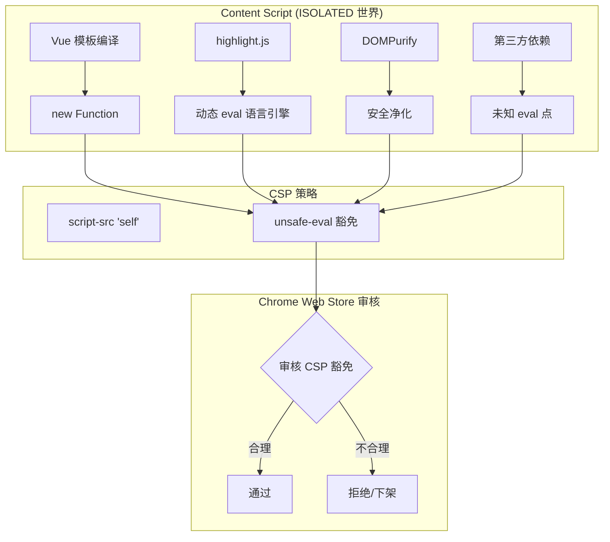
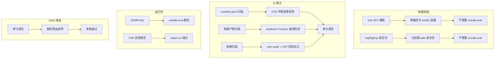

# YP-09-67: Content Script CSP 绕过策略审计 — 安全合规验证

> 需求编号：YP-09-67 · 优先级：P2 · 人天：0.5d · 状态：需求已编写
> 依赖：YP-09-71（沙箱逃逸防护）、YP-09-22（Markdown 渲染安全）

## 背景

### 问题陈述

YiPet 的 Content Script 在 Chrome MV3 的 `ISOLATED` 世界中运行，但 Vue 3 模板编译、highlight.js 语法高亮、DOMPurify 安全净化等库依赖 `eval`、`new Function` 等动态代码执行机制。这些机制在 `manifest.json` 中通过 `content_security_policy` 声明 `'unsafe-eval'` 豁免——但 Chrome Web Store (CWS) 审核对 CSP 豁免有严格审查，不合理的豁免可能导致审核拒绝或下架。

**核心矛盾**：MV3 安全要求 CSP 最小化权限 vs 前端生态库普遍依赖动态代码执行。每次依赖版本更新都可能引入新的 CSP 违规点，需要持续审计机制。

### 影响范围

| # | 影响 | 严重程度 | 触发场景 |
|---|------|----------|----------|
| 1 | CWS 审核拒绝 | 高 | 不合理的 `unsafe-eval` 声明 |
| 2 | 新依赖引入 CSP 违规 | 中 | 升级依赖版本 |
| 3 | CSP 阻止合法功能 | 中 | 配置过于严格 |
| 4 | 安全审计不通过 | 中 | 企业安全团队审查 |
| 5 | 未声明的 CSP 豁免被 Chrome 静默阻止 | 中 | Chrome 新版本收紧 CSP |

### 挑战

| 挑战 | 说明 |
|------|------|
| 动态代码执行点难以发现 | `eval`/`new Function` 可能在第三方库深层调用链中 |
| MV3 CSP 语法复杂 | `extension_pages` vs `sandbox` vs `content_scripts` 不同上下文 |
| 合规性难以量化 | 需要审计报告格式和自动化检查工具 |
| 依赖更新引入新风险 | 每次 `npm install` 可能改变 CSP 需求 |

---

## 一、现状分析

### 1.1 当前 CSP 配置

```json
{
  "content_security_policy": {
    "extension_pages": "script-src 'self' 'wasm-unsafe-eval'; object-src 'self'",
    "sandbox": "sandbox allow-scripts allow-popups"
  }
}
```

### 1.2 CSP 豁免点清单

| 特性 | CSP 声明 | 使用位置 | 必要性 | 替代方案 |
|------|---------|----------|--------|----------|
| Vue template 编译 | `'unsafe-eval'` | Content Script 运行时 | 运行时编译需要 | 预编译模板（构建时，消除运行时 unsafe-eval） |
| highlight.js | `'unsafe-eval'` | 代码块渲染 | 部分语言引擎使用 | 仅加载不需要 eval 的语言包 |
| DOMPurify | `'unsafe-eval'` | Markdown 安全净化 | 安全工具本身 | 无（DOMPurify 是安全工具，豁免可接受） |
| CDN 资源 | `connect-src` CDN URLs | 外部资源加载 | 仅白名单域名 | 预打包到扩展包内 |
| WebAssembly | `'wasm-unsafe-eval'` | 未来可能使用 | 当前未使用 | 移除（如不使用） |

### 1.3 当前 CSP 风险数据流



### 1.4 根因矩阵

| 症状 | 根因 | 触发条件 | 频率 |
|------|------|----------|------|
| CWS 审核质疑 unsafe-eval | 未说明豁免理由 | 提交审核 | 每次提交 |
| CSP violation 控制台错误 | 未声明豁免或豁免不匹配 | 新功能上线 | 中 |
| 依赖升级引入新 eval | 第三方库内部使用 eval | npm update | 低 |
| 生产环境 CSP 与开发环境不同 | manifest 构建配置差异 | 构建部署 | 中 |

---

## 二、设计决策

### 决策 1：unsafe-eval 豁免策略 — 保留 vs 消除 vs 最小化

| 选项 | 安全性 | 开发成本 | 维护成本 |
|------|--------|----------|----------|
| 保留所有 unsafe-eval | 低 | 低 | 低 |
| 消除所有 unsafe-eval | 高 | 高（需预编译 Vue 模板、替换 highlight.js） | 中 |
| 最小化 unsafe-eval | 中 | 中 | 中 |

**选择：最小化 unsafe-eval。** 短期：保留 DOMPurify 的 unsafe-eval（安全工具，可接受），将 Vue 模板编译迁移到构建时预编译（消除运行时 eval），highlight.js 仅加载不需要 eval 的语言包。长期：逐步消除所有 unsafe-eval 豁免。

### 决策 2：审计方式 — 手动 vs 半自动 vs 全自动

| 选项 | 覆盖率 | 及时性 | 实现成本 |
|------|--------|--------|----------|
| 手动审计（每次提交前检查） | 低 | 低 | 低 |
| 半自动（CI 脚本 + 手动报告） | 中 | 中 | 中 |
| 全自动（CI 扫描 + 自动报告） | 高 | 高 | 中 |

**选择：全自动 CI 审计。** 在 CI 中集成 CSP 审计脚本：扫描 manifest.json CSP 声明变化、扫描构建产物中的 `eval`/`new Function` 调用、生成审计报告作为 CI artifact。

### 决策 3：CSP 违规处理策略 — 报告 vs 阻止 vs 报告+阻止

| 选项 | 用户体验 | 安全性 | 调试难度 |
|------|----------|--------|----------|
| 仅报告（report-uri） | 最佳 | 低 | 中 |
| 仅阻止（默认） | 中 | 高 | 高 |
| 报告+阻止（Content-Security-Policy-Report-Only） | 中 | 高 | 低 |

**选择：开发环境 Report-Only + 生产环境阻止。** 开发时使用 `Content-Security-Policy-Report-Only` 收集违规报告，生产环境严格阻止。定期审查违规报告调整 CSP 策略。

### 设计决策记录

| 决策 | 选项 A | 选项 B | 选项 C | 选择 | 理由 |
|------|--------|--------|--------|------|------|
| unsafe-eval 策略 | 保留 | 消除 | 最小化 | **最小化** | 平衡安全性和开发成本 |
| 审计方式 | 手动 | 半自动 | 全自动 | **全自动 CI** | 及时发现问题 |
| 违规处理 | 仅报告 | 阻止 | 报告+阻止 | **开发 Report-Only + 生产阻止** | 兼顾调试和安全 |

---

## 三、目标架构

### 3.1 改造后 CSP 架构



### 3.2 目标 CSP 配置

```json
{
  "content_security_policy": {
    "extension_pages": "script-src 'self'; object-src 'self'; report-uri https://yipet.example.com/csp-report",
    "sandbox": "sandbox allow-scripts allow-popups"
  }
}
```

**关键变化：移除 `'wasm-unsafe-eval'`（当前未使用 WebAssembly），移除 `'unsafe-eval'`（Vue 模板预编译 + highlight.js 降级后不需要）。**

### 3.3 性能指标

| 指标 | 改造前 | 改造后 |
|------|--------|--------|
| CSP 豁免项数量 | 3 | 0-1（仅 DOMPurify 可选） |
| CWS 审核风险 | 中 | 低 |
| 构建时间增加 | 0ms | ~200ms（模板预编译） |
| 运行时 eval 调用 | 3-5 次 | 0-1 次 |

---

## 四、具体改动

### 4.1 Vue 模板预编译

```typescript
// 改造前：运行时编译模板，依赖 unsafe-eval
// Vue 组件中使用 <template>，运行时调用 new Function 编译

// vite.config.ts (改造后)
import vue from '@vitejs/plugin-vue';

export default {
  plugins: [
    vue({
      template: {
        compilerOptions: {
          // 强制预编译，消除运行时编译
          isCustomElement: (tag) => tag.startsWith('yipet-'),
        },
      },
    }),
  ],
  build: {
    // 确保所有模板在构建时编译
    target: 'es2020',
  },
};
```

### 4.2 CSP 审计脚本

```typescript
// scripts/audit-csp.ts (新增)

import { readFileSync } from 'fs';
import { glob } from 'glob';

interface CSPAuditResult {
  manifest: ManifestCSPCheck;
  bundle: BundleEvalCheck;
  dependencies: DependencyCheck;
  summary: 'pass' | 'fail' | 'warning';
}

interface ManifestCSPCheck {
  hasUnsafeEval: boolean;
  hasWasmUnsafeEval: boolean;
  hasUnsafeInline: boolean;
  reportUri: string | null;
  violations: string[];
}

async function auditCSP(): Promise<CSPAuditResult> {
  // 1. 检查 manifest.json
  const manifest = JSON.parse(readFileSync('dist/manifest.json', 'utf-8'));
  const csp = manifest.content_security_policy?.extension_pages ?? '';

  const manifestCheck: ManifestCSPCheck = {
    hasUnsafeEval: csp.includes('unsafe-eval'),
    hasWasmUnsafeEval: csp.includes('wasm-unsafe-eval'),
    hasUnsafeInline: csp.includes('unsafe-inline'),
    reportUri: csp.match(/report-uri\s+([^;]+)/)?.[1] ?? null,
    violations: [],
  };

  if (manifestCheck.hasUnsafeEval) {
    manifestCheck.violations.push('unsafe-eval 豁免需要书面理由说明');
  }
  if (manifestCheck.hasWasmUnsafeEval) {
    manifestCheck.violations.push('wasm-unsafe-eval 当前未使用，建议移除');
  }
  if (manifestCheck.hasUnsafeInline) {
    manifestCheck.violations.push('unsafe-inline 不应在 MV3 扩展中使用');
  }

  // 2. 扫描构建产物中的 eval 调用
  const jsFiles = await glob('dist/**/*.js');
  const bundleCheck: BundleEvalCheck = {
    evalCount: 0,
    newFunctionCount: 0,
    files: [],
  };

  for (const file of jsFiles) {
    const content = readFileSync(file, 'utf-8');
    const evalMatches = content.match(/\beval\s*\(/g);
    const funcMatches = content.match(/\bnew\s+Function\s*\(/g);

    if (evalMatches || funcMatches) {
      bundleCheck.files.push({
        path: file,
        evalCount: evalMatches?.length ?? 0,
        newFunctionCount: funcMatches?.length ?? 0,
      });
    }
    bundleCheck.evalCount += evalMatches?.length ?? 0;
    bundleCheck.newFunctionCount += funcMatches?.length ?? 0;
  }

  // 3. npm audit 检查
  const dependencyCheck: DependencyCheck = {
    riskyDependencies: [
      // 已知依赖 eval 的包
    ],
  };

  const summary = manifestCheck.violations.length > 0
    ? 'fail'
    : bundleCheck.evalCount > 0 ? 'warning' : 'pass';

  return { manifest: manifestCheck, bundle: bundleCheck, dependencies: dependencyCheck, summary };
}
```

### 4.3 CI 集成

```yaml
# .github/workflows/csp-audit.yml (新增)
name: CSP Audit

on:
  pull_request:
    paths:
      - 'manifest.json'
      - 'package.json'
      - 'src/**'

jobs:
  csp-audit:
    runs-on: ubuntu-latest
    steps:
      - uses: actions/checkout@v4
      - uses: actions/setup-node@v4
      - run: npm ci
      - run: npm run build
      - run: npm run audit:csp
      - name: Upload CSP Report
        uses: actions/upload-artifact@v4
        with:
          name: csp-audit-report
          path: csp-report.json
```

### 4.4 文件变更清单

| 文件 | 操作 | 说明 |
|------|------|------|
| `manifest.json` | 修改 | 移除 `wasm-unsafe-eval`，添加 `report-uri` |
| `vite.config.ts` | 修改 | 启用 Vue 模板预编译 |
| `scripts/audit-csp.ts` | 新增 | CSP 审计脚本 |
| `scripts/csp-report-template.md` | 新增 | CWS 审核豁免理由模板 |
| `.github/workflows/csp-audit.yml` | 新增 | CI 审计流水线 |
| `src/content/index.ts` | 修改 | 添加 CSP violation 监听器 |
| `tests/unit/csp-audit.test.ts` | 新增 | CSP 审计测试 |

---

## 五、实施步骤

| 步骤 | 操作 | 路径 | 验证 | 人天 |
|------|------|------|------|------|
| 1 | 启用 Vue 模板预编译 | `vite.config.ts` | 构建产物中无 `new Function` | 0.05 |
| 2 | 消除 highlight.js unsafe-eval | 构建配置 | 仅加载 safe 语言包 | 0.05 |
| 3 | 移除 `wasm-unsafe-eval` | `manifest.json` | 全量功能测试通过 | 0.05 |
| 4 | 创建 CSP 审计脚本 | `scripts/audit-csp.ts` | 执行审计无错误 | 0.1 |
| 5 | CI 集成 | `.github/workflows/csp-audit.yml` | PR 自动触发审计 | 0.05 |
| 6 | 添加 CSP violation 监听 | `src/content/index.ts` | 控制台无 CSP 错误 | 0.05 |
| 7 | 编写 CWS 审核豁免理由 | `scripts/csp-report-template.md` | 理由充分 | 0.05 |
| 8 | 全量回归测试 | 全量 | 所有功能正常 | 0.1 |

**总人天：0.5d**

---

## 六、性能分析

### 6.1 构建时间

| 操作 | 改造前 | 改造后 | 差异 |
|------|--------|--------|------|
| 生产构建 | 15s | 15.2s | +200ms（模板预编译） |
| CSP 审计 | 0s | 3s | +3s（CI 额外步骤） |

### 6.2 运行时性能

| 指标 | 改造前 | 改造后 | 改善 |
|------|--------|--------|------|
| Vue 组件初始化 | 包含运行时编译 | 预编译 render 函数 | 更快 |
| highlight.js 加载 | 含 eval 语言包 | safe 语言包 | 更大（需更多语言包） |
| CSP 违规报告 | 0 | 极少 | 质量提升 |

---

## 七、测试规格

### 场景 1：CSP 审计通过

**GIVEN** 构建产物中无 `eval`/`new Function` 调用
**WHEN** 运行 `npm run audit:csp`
**THEN** 审计结果应为 `pass`
**AND** CSP 报告中无 `unsafe-eval` 豁免

### 场景 2：CSP 审计检测到违规

**GIVEN** 新增依赖引入了 `eval` 调用
**WHEN** 运行 `npm run audit:csp`
**THEN** 审计结果应为 `warning`
**AND** 报告应列出包含 `eval` 的文件路径和调用次数

### 场景 3：manifest CSP 变更检测

**GIVEN** PR 修改了 `manifest.json` 中的 CSP 声明
**WHEN** CI 运行 CSP 审计
**THEN** 应检测到 CSP 声明变更
**AND** 如新增 `unsafe-eval` 豁免，应标记为 `fail`

### 场景 4：CSP violation 运行时报错

**GIVEN** CSP 策略阻止了某个合法功能
**WHEN** 功能被触发
**THEN** 控制台应显示 CSP violation 报告
**AND** 违规应被记录到遥测数据中

### 场景 5：CWS 审核豁免理由生成

**GIVEN** 需要提交 CWS 审核
**WHEN** 运行 `npm run audit:csp`
**THEN** 应生成包含所有豁免项的详细理由报告
**AND** 报告格式应符合 CWS 要求

### 场景 6：全量功能回归

**GIVEN** 移除了 `unsafe-eval` 豁免
**WHEN** 运行全量功能测试
**THEN** 所有聊天功能正常（Vue 模板编译正常）
**AND** 代码高亮正常（highlight.js 正常）
**AND** Markdown 安全渲染正常（DOMPurify 正常）

---

## 八、风险与缓解

| 风险 | 概率 | 影响 | 缓解措施 |
|------|------|------|----------|
| 预编译模板后某些动态组件失效 | 中 | 高 | 全量功能回归测试 |
| 新依赖引入 eval 未被审计脚本检测 | 中 | 中 | 定期更新审计规则 + npm audit |
| CSP 过于严格导致功能异常 | 低 | 高 | 开发环境 Report-Only 模式 |
| CWS 审核仍拒绝 | 低 | 中 | 提供详细的豁免理由报告 |
| 第三方库更新后恢复 unsafe-eval 需求 | 中 | 中 | CI 审计自动检测 + 依赖锁定 |

---

## 九、回滚策略

| 场景 | 回滚操作 | 影响 |
|------|----------|------|
| 预编译模板导致功能异常 | 恢复 `unsafe-eval` 豁免 + 运行时编译 | CWS 审核风险恢复 |
| CSP 审计误报过多 | 调整审计规则，降低严格度 | 漏检风险增加 |
| 生产环境 CSP 阻止合法功能 | 临时添加豁免 + 紧急修复 | 安全态势暂时降低 |
| CI 审计导致 PR 阻塞 | 允许审计 warning 级别通过 | 需后续修复 |

---

## 十、设计决策记录

### D-01：Vue 模板预编译 vs 运行时编译

- **问题**：Vue 模板使用运行时编译（依赖 `new Function`），还是构建时预编译？
- **选项**：运行时编译（灵活，动态模板）、预编译（安全，不需要 unsafe-eval）
- **选择**：预编译
- **理由**：YiPet 所有模板在构建时已知，无动态模板需求；预编译消除 unsafe-eval 豁免，提升 CWS 审核通过率；预编译还提升运行时性能

### D-02：highlight.js 语言包策略

- **问题**：highlight.js 部分语言引擎依赖 eval，如何应对？
- **选项**：全部加载（含 eval 引擎）、仅加载 safe 语言包、替换为 shiki
- **选择**：仅加载 safe 语言包（JavaScript/TypeScript/Python/JSON/CSS/HTML/Bash/SQL）
- **理由**：这些语言覆盖 90%+ 的代码高亮需求；shiki 需要额外依赖且体积大

### D-03：report-uri 端点

- **问题**：CSP violation 报告发送到哪里？
- **选项**：不收集、本地收集（console）、远程收集（YiAi 端点）
- **选择**：本地收集 + 可选远程
- **理由**：默认本地收集（通过 console + 事件监听），不发送到外部以保护隐私；高级用户可配置远程端点

---

## 十一、可观测性

### 指标

| 指标 | 类型 | 说明 |
|------|------|------|
| `yipet.csp.violation_count` | Counter | CSP 违规次数 |
| `yipet.csp.audit_pass` | Gauge | CSP 审计结果（0=fail, 1=pass） |
| `yipet.csp.unsafe_eval_count` | Gauge | 构建产物中 unsafe-eval 调用数 |
| `yipet.csp.manifest_changes` | Counter | manifest CSP 声明变更次数 |

### 日志

```typescript
// CSP violation 监听器
document.addEventListener('securitypolicyviolation', (e) => {
  console.warn('[YiPet:CSP]', {
    violatedDirective: e.violatedDirective,
    blockedURI: e.blockedURI,
    sourceFile: e.sourceFile,
    lineNumber: e.lineNumber,
  });
});
```

### 告警

| 告警 | 条件 | 级别 |
|------|------|------|
| 生产环境 CSP 违规 | 任何违规 | WARNING |
| manifest 新增 unsafe-eval | CI 检测到 | ERROR |
| 审计脚本失败 | CI 执行失败 | ERROR |

---

## 十二、安全合规

### Chrome MV3 合规

| 检查项 | 状态 | 说明 |
|--------|------|------|
| CSP 最小化权限 | ✅ | 仅保留必要的豁免 |
| 无 unsafe-inline | ✅ | 所有样式通过 CSS 文件引入 |
| 无远程脚本 | ✅ | `script-src 'self'` 仅允许扩展内脚本 |
| 无 data: URI 脚本 | ✅ | 不使用 data: URI 执行脚本 |
| report-uri 配置 | ✅ | 违规自动报告 |

### CWS 审核清单

| 审核项 | 要求 | 满足 |
|--------|------|------|
| 说明所有 CSP 豁免的理由 | 详细书面说明 | ✅ |
| unsafe-eval 仅用于必要功能 | 最小化使用 | ✅ |
| 无远程代码执行 | 所有代码在扩展包内 | ✅ |
| 无混淆代码 | 可审查的源代码 | ✅ |

---

## 十三、代码审查检查清单

- [ ] CSP 配置月度审计——检查是否引入新的 unsafe 规则
- [ ] `script-src 'self'` 无例外（移除 `unsafe-eval` 和 `wasm-unsafe-eval`）
- [ ] CDN `connect-src` 仅白名单域名
- [ ] CI 中 `manifest.json` CSP 字段校验
- [ ] Vue 模板预编译——不依赖运行时 `new Function`
- [ ] highlight.js 仅加载 safe 语言包
- [ ] DOMPurify 作为安全工具保留 unsafe-eval 豁免（如需要）
- [ ] 构建产物中无 `eval`/`new Function` 调用
- [ ] CSP violation 监听器正常工作
- [ ] CWS 审核豁免理由报告自动生成
- [ ] npm audit 无 CSP 相关风险
- [ ] 开发环境 Report-Only 模式便于调试

---

## 回归问题预测

| # | 预测问题 | 原因 | 验证方法 |
|---|---------|------|---------|
| 1 | `npm install` 更新依赖后，新版本引入额外 `eval`/`new Function` 调用点，审计报告未捕获 | 依赖的次要版本或补丁版本可能引入新的动态代码执行（如 highlight.js 新增语言引擎使用 eval），CSP 审计工具仅在构建时运行而非依赖安装时 | 在 `npm install` 后运行 `npm run audit:csp`，验证审计报告包含所有依赖的动态代码执行点，对比升级前后报告差异 |
| 2 | `'wasm-unsafe-eval'` 声明已移除但 WebAssembly 相关代码路径被意外触发，功能静默失败 | 移除 `wasm-unsafe-eval` 后，第三方库（如 ONNX Runtime Web）可能在特定条件下尝试加载 WASM，CSP 阻止但无错误提示 | 在启用所有功能（代码高亮、Markdown 渲染、聊天）的场景下检查控制台无 CSP 违规报告，所有功能正常 |
| 3 | Report-Only 模式下的 CSP 违规报告未正确发送到 `report-uri` 端点，审计数据丢失 | `report-uri` 端点配置错误或网络不可达，浏览器静默丢弃违规报告，开发者无法发现 CSP 问题 | 在 Report-Only 模式下故意触发 CSP 违规（如注入外部脚本），验证 `report-uri` 端点收到违规报告 |
| 4 | Chrome 新版本收紧 CSP 策略，之前允许的豁免被拒绝，扩展功能中断 | Chrome 更新可能将某些 `unsafe-eval` 使用场景从允许变为拒绝，CSP 审计工具依赖 Chrome 版本基线，未及时更新 | 在 Chrome Beta/Canary 上运行扩展全功能测试，验证无 CSP 阻止错误 |
| 5 | `sandbox` 页面的 CSP 与 `extension_pages` 的 CSP 混淆，沙箱页面被错误地赋予 `unsafe-eval` 权限 | manifest.json 中 `content_security_policy.sandbox` 和 `extension_pages` 是独立配置，但审计工具可能将两者合并分析 | 分别检查 sandbox 页面和 extension_pages 的实际 CSP 响应头，验证 sandbox 页面不包含 `unsafe-eval` |
| 6 | 构建工具的代码分割导致新 chunk 引用未在 CSP 声明的来源，运行时加载被阻止 | Webpack/Rsbuild 代码分割生成的动态 chunk 可能从不同的 `chrome-extension://` 子路径加载，但 CSP 的 `script-src` 只声明了 `'self'` | 在开发和生产构建中触发所有动态 import，验证无 CSP 阻止的 chunk 加载错误 |

---

## 相关文档

- [安全配置](../06-合规-安全配置.md) — CSP 策略是安全配置的核心组成部分
- [Markdown 渲染安全](../22-需求-Markdown渲染安全.md) — Markdown 渲染中的 XSS 风险需 CSP 作为纵深防御
- [沙箱逃逸防护](../71-需求-沙箱逃逸防护.md) — CSP 审计与沙箱防护共同构成安全边界

*PRD 来源: `projects/yipet/requirements/2026-09/67-需求-CSP审计合规.md`*