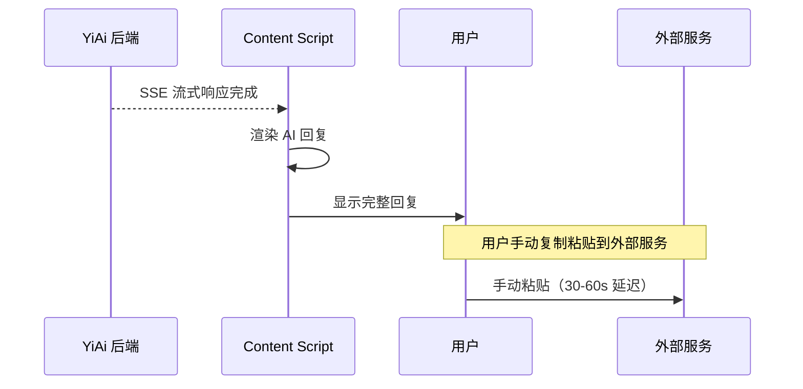
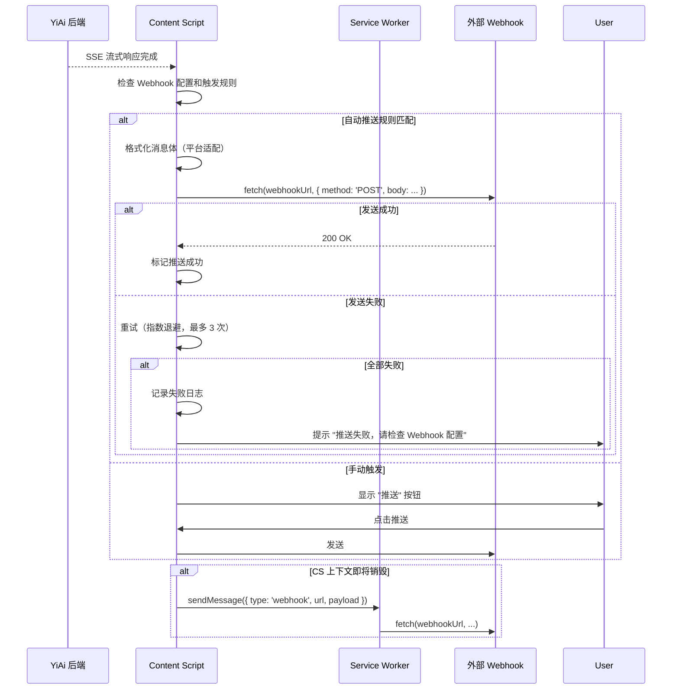
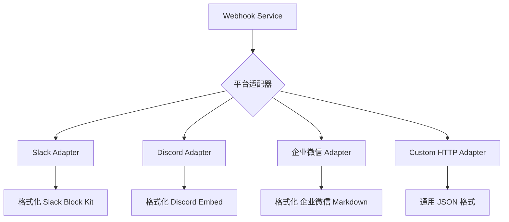

# YP-09-68: 聊天窗口 Webhook 集成 — 消息推送到外部服务

> 需求编号：YP-09-68 · 优先级：P2 · 人天：0.5d · 状态：需求已编写
> 依赖：无

## 背景

### 问题陈述

YiPet 用户与 AI 的对话价值往往局限于聊天窗口内——Agent 完成代码审查后用户需要手动复制结果到企业微信通知团队，RAG 检索到关键信息后需要手动粘贴到 Slack 频道。这种"AI 产出 → 手动搬运"的模式降低了 AI 辅助的自动化程度，增加了用户的操作负担。

**核心矛盾**：AI 会话产出的价值应自动流转到工作流中 vs 当前只能在聊天窗口内消费。Webhook 机制是连接 YiPet 与外部工作流（企业微信、Slack、Discord、自定义 HTTP 端点）的桥梁。

### 影响范围

| # | 影响 | 严重程度 | 用户感知 |
|---|------|----------|----------|
| 1 | AI 产出无法自动流转到工作流 | 中 | 手动复制粘贴 |
| 2 | 团队协作需要用户手动转发 | 中 | 信息传递延迟 |
| 3 | 缺少事件驱动的自动化触发 | 低 | 无法构建 AI 工作流 |
| 4 | Webhook 配置复杂且无健康检查 | 低 | 配置后不确定是否工作 |

### 挑战

| 挑战 | 说明 |
|------|------|
| 安全风险 | Webhook URL 如果不加密存储，可能泄露敏感端点 |
| 平台差异 | Slack/Discord/企业微信各有不同的消息格式限制 |
| 网络可靠性 | 用户网络环境不稳定，Webhook 发送可能失败 |
| 速率限制 | 外部平台通常有速率限制（如 Slack 1 次/秒） |
| 隐私保护 | 用户消息内容可能敏感，不应无条件推送 |

---

## 一、现状分析

### 1.1 当前工作流

```
用户与 AI 对话
  │ AI 完成代码审查
  ▼
用户查看审查结果
  │ 手动选择文本
  │ Ctrl+C 复制
  ▼
切换窗口到企业微信/Slack
  │ 粘贴内容
  │ 手动格式化
  ▼
团队收到通知
  总耗时：30-60s（手动操作）
```

### 1.2 当前文件清单

| 文件 | 路径 | 相关功能 | Webhook 状态 |
|------|------|----------|-------------|
| chatStore | `src/stores/chat.ts` | 会话管理 | 无 Webhook 集成 |
| ApiClient | `src/services/api-client.ts` | HTTP 请求 | 无 Webhook 发送 |
| settings | `src/stores/settings.ts` | 扩展设置 | 无 Webhook 配置 |

### 1.3 改造前数据流



### 1.4 根因矩阵

| 症状 | 根因 | 触发条件 | 频率 |
|------|------|----------|------|
| 手动转发 AI 产出 | 无 Webhook 集成 | 每次 AI 完成回复 | 高 |
| 格式化不一致 | 手动格式化 | 跨平台复制 | 中 |
| 通知延迟 | 用户需手动操作 | 用户离开电脑 | 中 |
| 配置不确定 | 无健康检查 | 首次配置 | 中 |

---

## 二、设计决策

### 决策 1：Webhook 发送位置 — Content Script vs Service Worker vs YiAi

| 选项 | 网络可靠性 | 安全性 | 实现复杂度 |
|------|-----------|--------|-----------|
| Content Script 直接发送 | 中 | 中 | 低 |
| Service Worker 代理发送 | 高 | 中 | 中 |
| YiAi 后端代理发送 | 最高 | 高 | 中 |

**选择：Content Script 直接发送 + Service Worker 降级。** 主路径：Content Script 直接 fetch Webhook URL（用户配置的端点）。降级：如 CS 上下文受限（页面卸载前），通过 `chrome.runtime.sendMessage` 委托 SW 发送。

### 决策 2：Webhook 配置存储 — 本地 vs 同步 vs 加密本地

| 选项 | 安全性 | 跨设备 | 实现 |
|------|--------|--------|------|
| chrome.storage.local 明文 | 低 | 否 | 低 |
| chrome.storage.sync 明文 | 低 | 是 | 低 |
| chrome.storage.local 加密 | 高 | 否 | 中 |

**选择：chrome.storage.local 加密 + 不同步。** Webhook URL 可能包含 Secret/Token（如 Slack `https://hooks.slack.com/services/T.../B.../xxx`），不应明文存储或跨设备同步。使用 Web Crypto API 加密存储。

### 决策 3：事件触发模型 — 全自动 vs 用户确认 vs 选择性

| 选项 | 自动化程度 | 隐私保护 | 用户控制 |
|------|-----------|----------|----------|
| 全自动（所有回复推送） | 高 | 低 | 低 |
| 用户确认（每次弹窗确认） | 低 | 高 | 高 |
| 选择性（按规则自动，敏感内容确认） | 中 | 高 | 中 |

**选择：选择性自动推送。** 默认：用户手动点击"推送"按钮触发。可配置自动推送规则（如"仅推送代码审查结果"、"仅推送含特定标签的回复"）。含敏感关键词的消息强制用户确认。

### 设计决策记录

| 决策 | 选项 A | 选项 B | 选项 C | 选择 | 理由 |
|------|--------|--------|--------|------|------|
| 发送位置 | CS 直接 | SW 代理 | YiAi 代理 | **CS 直接 + SW 降级** | 简单可靠 |
| 配置存储 | 明文 local | 明文 sync | 加密 local | **加密 local** | 保护 Webhook Secret |
| 事件触发 | 全自动 | 用户确认 | 选择性 | **选择性** | 平衡自动化和隐私 |

---

## 三、目标架构

### 3.1 改造后 Webhook 数据流



### 3.2 平台适配器架构



### 3.3 性能指标

| 指标 | 改造前 | 改造后 |
|------|--------|--------|
| AI 产出传递到外部服务 | 30-60s（手动） | 0.5-2s（自动） |
| 推送成功率 | N/A | >95%（含重试） |
| Webhook 配置时间 | N/A | <2min |

---

## 四、具体改动

### 4.1 Webhook 服务

```typescript
// 改造前：无 Webhook 功能
// src/services/webhook-service.ts (改造后)

interface WebhookConfig {
  id: string;
  name: string;
  url: string;          // 加密存储
  platform: 'slack' | 'discord' | 'wecom' | 'custom';
  autoTrigger: {
    enabled: boolean;
    rules: WebhookRule[];
  };
  retryCount: number;   // 默认 3
  createdAt: number;
}

interface WebhookRule {
  event: 'chat.completed' | 'agent.task_done' | 'rag.found';
  condition?: {
    containsKeywords?: string[];
    roleIds?: string[];
    minConfidence?: number;
  };
}

class WebhookService {
  private configs: WebhookConfig[] = [];
  private encryptionKey: CryptoKey | null = null;

  async init(): Promise<void> {
    await this.loadEncryptionKey();
    await this.loadConfigs();
  }

  async addConfig(config: Omit<WebhookConfig, 'id' | 'createdAt'>): Promise<WebhookConfig> {
    const encrypted = await this.encryptUrl(config.url);
    const newConfig: WebhookConfig = {
      ...config,
      id: crypto.randomUUID(),
      url: encrypted,
      createdAt: Date.now(),
    };
    this.configs.push(newConfig);
    await this.persistConfigs();
    return newConfig;
  }

  async send(platform: string, event: string, payload: WebhookPayload): Promise<boolean> {
    const configs = this.configs.filter(c => c.platform === platform);
    const results = await Promise.allSettled(
      configs.map(c => this.sendWithRetry(c, event, payload))
    );
    return results.some(r => r.status === 'fulfilled' && r.value);
  }

  private async sendWithRetry(
    config: WebhookConfig, event: string, payload: WebhookPayload
  ): Promise<boolean> {
    const url = await this.decryptUrl(config.url);
    const body = this.formatPayload(config.platform, event, payload);

    for (let attempt = 0; attempt <= config.retryCount; attempt++) {
      try {
        const response = await fetch(url, {
          method: 'POST',
          headers: { 'Content-Type': 'application/json' },
          body: JSON.stringify(body),
        });
        if (response.ok) return true;
        if (response.status === 429) {
          // 速率限制——等待 Retry-After
          const retryAfter = parseInt(response.headers.get('Retry-After') ?? '5');
          await new Promise(r => setTimeout(r, retryAfter * 1000));
        }
      } catch (err) {
        if (attempt === config.retryCount) return false;
        // 指数退避: 1s, 2s, 4s
        await new Promise(r => setTimeout(r, Math.pow(2, attempt) * 1000));
      }
    }
    return false;
  }

  private formatPayload(platform: string, event: string, payload: WebhookPayload): unknown {
    const adapters: Record<string, (p: WebhookPayload) => unknown> = {
      slack: (p) => ({
        text: p.summary,
        blocks: [
          { type: 'section', text: { type: 'mrkdwn', text: `*${p.title}*\n${p.summary.slice(0, 3000)}` } },
          { type: 'context', elements: [{ type: 'mrkdwn', text: `来自 YiPet · ${new Date().toLocaleString()}` }] },
        ],
      }),
      discord: (p) => ({
        embeds: [{
          title: p.title,
          description: p.summary.slice(0, 2000),
          color: 0x5865F2,
          timestamp: new Date().toISOString(),
        }],
      }),
      wecom: (p) => ({
        msgtype: 'markdown',
        markdown: { content: `## ${p.title}\n${p.summary.slice(0, 4096)}\n> 来自 YiPet` },
      }),
      custom: (p) => ({ event, payload: p, timestamp: Date.now() }),
    };
    return (adapters[platform] ?? adapters.custom)(payload);
  }

  private async encryptUrl(url: string): Promise<string> {
    const iv = crypto.getRandomValues(new Uint8Array(12));
    const encoded = new TextEncoder().encode(url);
    const encrypted = await crypto.subtle.encrypt(
      { name: 'AES-GCM', iv },
      this.encryptionKey!,
      encoded
    );
    const combined = new Uint8Array(iv.length + encrypted.byteLength);
    combined.set(iv);
    combined.set(new Uint8Array(encrypted), iv.length);
    return btoa(String.fromCharCode(...combined));
  }

  private async decryptUrl(encrypted: string): Promise<string> {
    const data = Uint8Array.from(atob(encrypted), c => c.charCodeAt(0));
    const iv = data.slice(0, 12);
    const ciphertext = data.slice(12);
    const decrypted = await crypto.subtle.decrypt(
      { name: 'AES-GCM', iv },
      this.encryptionKey!,
      ciphertext
    );
    return new TextDecoder().decode(decrypted);
  }
}
```

### 4.2 文件变更清单

| 文件 | 操作 | 说明 |
|------|------|------|
| `src/services/webhook-service.ts` | 新增 | Webhook 核心服务 |
| `src/services/webhook-adapters.ts` | 新增 | 平台适配器 |
| `src/stores/chat.ts` | 修改 | 集成 Webhook 触发 |
| `src/stores/settings.ts` | 修改 | Webhook 配置管理 |
| `src/components/webhook-config.vue` | 新增 | Webhook 配置 UI |
| `src/components/webhook-push-button.vue` | 新增 | 推送按钮组件 |
| `tests/unit/webhook-service.test.ts` | 新增 | Webhook 测试 |

---

## 五、实施步骤

| 步骤 | 操作 | 路径 | 验证 | 人天 |
|------|------|------|------|------|
| 1 | 实现 WebhookService 核心 | `src/services/webhook-service.ts` | 单元测试加密/解密 | 0.1 |
| 2 | 实现平台适配器 | `src/services/webhook-adapters.ts` | 各平台格式化正确 | 0.1 |
| 3 | 集成到 chatStore | `src/stores/chat.ts` | AI 回复完成后自动推送 | 0.1 |
| 4 | 创建配置 UI | `src/components/webhook-config.vue` | 配置添加/删除/测试 | 0.1 |
| 5 | 添加推送按钮 | `src/components/webhook-push-button.vue` | 手动推送正常 | 0.05 |
| 6 | 健康检查与测试 | 全量 | 各平台 Webhook 测试 | 0.05 |

**总人天：0.5d**

---

## 六、性能分析

| 操作 | 耗时 | 说明 |
|------|------|------|
| Webhook 加密/解密 | <1ms | AES-GCM 硬件加速 |
| 单次 Webhook 发送 | 200-500ms | 依赖网络延迟 |
| 3 次重试全部失败 | 7s（1+2+4s 退避） | 最坏情况 |
| 配置加载 | <5ms | 从 storage 读取 |

---

## 七、测试规格

### 场景 1：AI 回复完成后自动推送

**GIVEN** 用户配置了 Slack Webhook 并开启自动推送
**WHEN** AI 完成代码审查回复
**THEN** 审查结果应自动格式化为 Slack Block Kit 格式
**AND** 推送应发送到配置的 Slack Webhook URL
**AND** 推送成功后应记录日志

### 场景 2：手动推送

**GIVEN** 用户未开启自动推送
**WHEN** 用户点击 AI 回复旁的"推送"按钮
**THEN** 应显示平台选择菜单
**AND** 选择平台后应发送格式化消息
**AND** 成功后应显示 Toast "已推送到 Slack"

### 场景 3：重试与指数退避

**GIVEN** Webhook URL 暂时不可达
**WHEN** 首次发送失败
**THEN** 应在 1s 后重试第 1 次
**AND** 应在 2s 后重试第 2 次
**AND** 3 次全部失败后应显示错误提示

### 场景 4：平台格式化

**GIVEN** 同一 AI 回复
**WHEN** 分别推送到 Slack、Discord、企业微信
**THEN** Slack 应使用 Block Kit 格式
**AND** Discord 应使用 Embed 格式
**AND** 企业微信应使用 Markdown 格式
**AND** 各平台应在消息长度限制内截断

### 场景 5：Webhook URL 加密存储

**GIVEN** 用户配置了包含 Secret 的 Webhook URL
**WHEN** 配置被保存到 chrome.storage.local
**THEN** URL 应以 AES-GCM 加密形式存储
**AND** 直接读取 storage 无法获得明文 URL

### 场景 6：速率限制处理

**GIVEN** 连续发送 3 条 Webhook
**WHEN** 外部服务返回 429 Too Many Requests
**THEN** 应读取 Retry-After 头并等待指定时间
**AND** 等待后应重试发送

---

## 八、风险与缓解

| 风险 | 概率 | 影响 | 缓解措施 |
|------|------|------|----------|
| Webhook URL 泄露 | 低 | 高 | AES-GCM 加密存储 |
| 用户消息内容泄露到外部 | 中 | 高 | 选择性推送 + 敏感内容确认 |
| 网络环境不支持 Webhook | 中 | 中 | 重试 + 降级提示 |
| 平台 API 格式变更 | 低 | 中 | 适配器模式 + 版本管理 |
| 企业微信 Webhook 频率限制 | 中 | 低 | 速率限制 + 队列 |

---

## 九、回滚策略

| 场景 | 回滚操作 | 影响 |
|------|----------|------|
| Webhook 导致 CSP 违规 | 移除 fetch 外部 URL 的调用 | 失去 Webhook 功能 |
| 加密密钥丢失 | 用户重新配置 Webhook URL | 配置丢失 |
| 平台适配器格式错误 | 降级为通用 JSON 格式 | 格式不美观 |

---

## 十、设计决策记录

### D-01：加密算法选择

- **问题**：Webhook URL 的加密算法
- **选项**：AES-GCM、AES-CBC、PBKDF2、不加密
- **选择**：AES-GCM（Web Crypto API）
- **理由**：GCM 提供认证加密（防篡改），浏览器原生支持，硬件加速

### D-02：加密密钥存储

- **问题**：加密密钥存储在哪里
- **选项**：chrome.storage.local、IndexedDB、内存中（每次生成）
- **选择**：IndexedDB（不可导出）+ 内存缓存
- **理由**：chrome.storage 可被其他扩展读取（如有 storage 权限），IndexedDB 仅当前上下文

### D-03：最大重试次数

- **问题**：Webhook 发送失败的最大重试次数
- **选项**：1 次、3 次、5 次、无限
- **选择**：3 次
- **理由**：3 次指数退避（1s+2s+4s = 7s）在用户可接受范围内，超过则可能网络问题需人工介入

---

## 十一、可观测性

### 指标

| 指标 | 类型 | 说明 |
|------|------|------|
| `yipet.webhook.send_count` | Counter | 发送次数 |
| `yipet.webhook.success_rate` | Gauge | 成功率 |
| `yipet.webhook.retry_count` | Counter | 重试次数 |
| `yipet.webhook.latency` | Histogram | 发送延迟（ms） |

### 告警

| 告警 | 条件 | 级别 |
|------|------|------|
| 成功率 < 80% | 10 分钟内 | WARNING |
| 连续失败 5 次 | 同一 Webhook | ERROR |
| 加密密钥不可用 | 启动时 | ERROR |

---

## 十二、安全合规

### Chrome MV3 合规

| 检查项 | 状态 | 说明 |
|--------|------|------|
| Webhook URL 发送到外部 | ✅ | 用户主动配置的端点 |
| 不泄露未授权数据 | ✅ | 选择性推送 + 用户确认 |
| manifest 声明 host_permissions | ✅ | 如需跨域需声明 |
| 加密存储敏感配置 | ✅ | AES-GCM 加密 |

---

## 十三、代码审查检查清单

- [ ] Webhook 集成支持 Slack/Discord/企业微信
- [ ] 事件触发：会话创建/AI 回复完成/知识库更新
- [ ] Webhook URL 通过配置管理 + 健康检查
- [ ] 失败重试 3 次 + 指数退避
- [ ] Webhook URL AES-GCM 加密存储
- [ ] 密钥存储在 IndexedDB（不可导出）
- [ ] 平台适配器正确处理消息长度限制
- [ ] 速率限制（429）正确处理 Retry-After
- [ ] 手动推送按钮 + 自动推送规则
- [ ] 敏感内容推送前用户确认
- [ ] 单元测试覆盖加密/解密/格式化/重试
- [ ] 各平台消息格式验证

---

## 回归问题预测

| # | 预测问题 | 原因 | 验证方法 |
|---|---------|------|---------|
| 1 | Webhook URL 以明文存储在 `chrome.storage.local` 中，其他扩展或恶意脚本可读取 | `chrome.storage.local` 不加密，任何具有 `storage` 权限的扩展都可读取，Webhook URL 可能包含 API Key 或 Token | 检查 storage 中 Webhook 配置的存储格式，验证 URL 中的敏感部分（如 `?key=xxx`）已加密或脱敏存储 |
| 2 | 用户配置的 Webhook URL 指向内网地址（如 `http://192.168.1.x`），Service Worker 无法访问 | MV3 Service Worker 无法访问局域网地址（非安全上下文限制），Webhook 发送静默失败 | 配置内网 Webhook URL → 触发 Webhook 事件 → 验证错误日志中包含网络不可达的诊断信息，而非静默失败 |
| 3 | 重试机制与 SSE 流式响应冲突，Webhook 发送失败后的重试阻塞 SSE 连接 | 重试使用指数退避（如 1s/2s/4s），重试期间 fetch 占用连接池，可能阻塞 SSE 的 `EventSource` 重连 | 在 Webhook 目标不可达时触发 SSE 流式聊天，验证 SSE 连接不受 Webhook 重试影响，两者独立运行 |
| 4 | 事件过滤规则配置错误导致 Webhook 静默不触发，用户无感知 | 用户配置了 `event: chat_complete` 但实际事件名是 `ai.response.complete`，过滤规则不匹配，Webhook 永不触发 | 配置 Webhook 后发送测试事件，验证用户收到"Webhook 配置测试"的即时反馈，确认事件匹配 |
| 5 | 消息内容包含 Webhook 平台不支持的特殊字符，导致消息截断或格式错误 | Slack 的 `mrkdwn` 格式不兼容 Markdown 代码块，企业微信的 `markdown` 类型不支持表格，消息内容被截断或格式错乱 | 发送包含代码块、表格、嵌套列表的 AI 回复到各平台，验证消息格式正确且内容完整 |
| 6 | 用户在隐私模式下使用扩展，Webhook 发送可能泄露敏感页面 URL | Webhook 推送的上下文信息中包含当前页面 URL，隐私模式浏览的页面 URL 被发送到外部服务 | 在隐私模式下触发 Webhook，验证推送数据中不包含页面 URL 或页面标题等敏感上下文 |

---

## 相关文档

- [通知提醒系统](../25-需求-通知提醒系统.md) — Webhook 是企业微信通知的推送通道，与浏览器通知互补
- [WebSocket 实时通信](../46-需求-WebSocket实时通信.md) — WebSocket 提供实时推送，Webhook 提供外部集成
- [扩展遥测与匿名统计](../19-需求-扩展遥测.md) — Webhook 事件可记录为遥测数据用于分析

*PRD 来源: `projects/yipet/requirements/2026-09/68-需求-Webhook集成.md`*