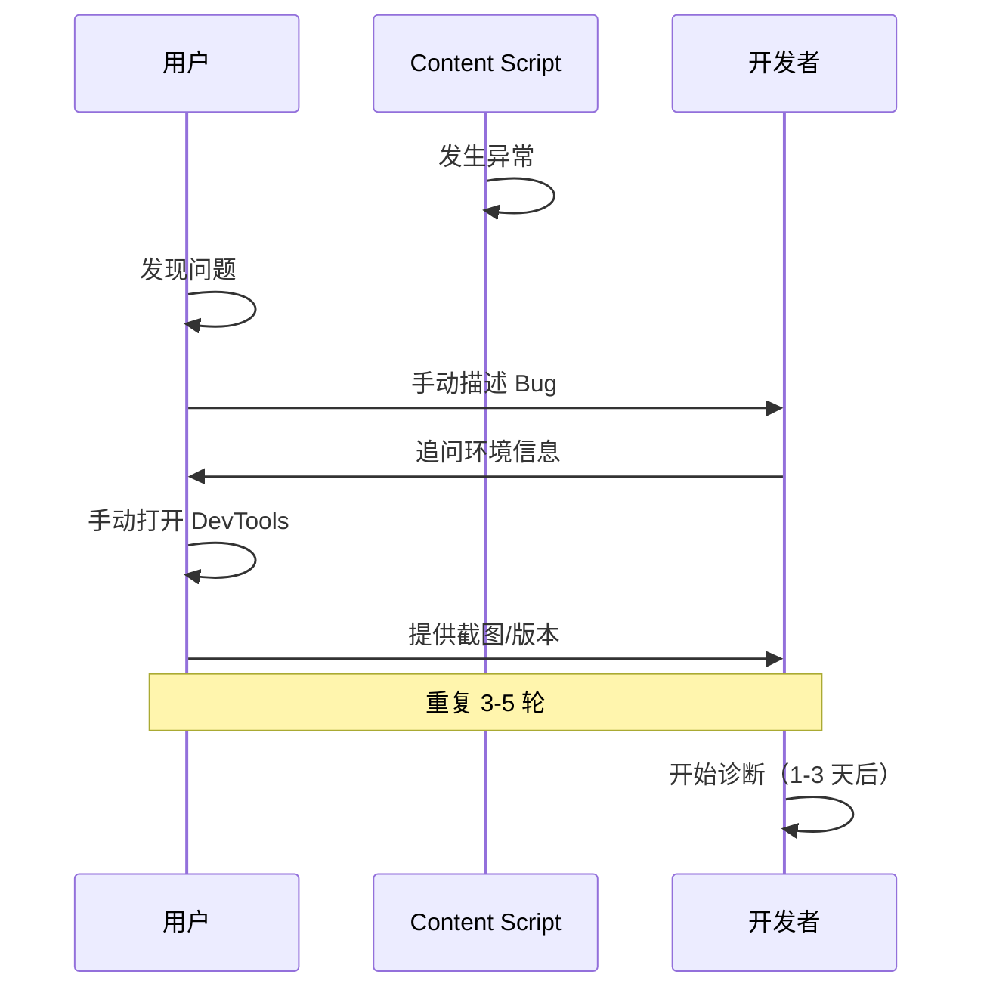
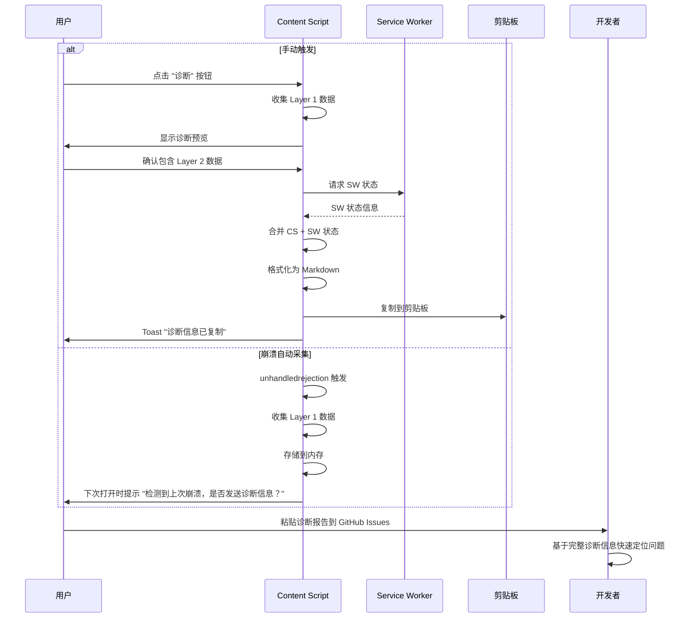
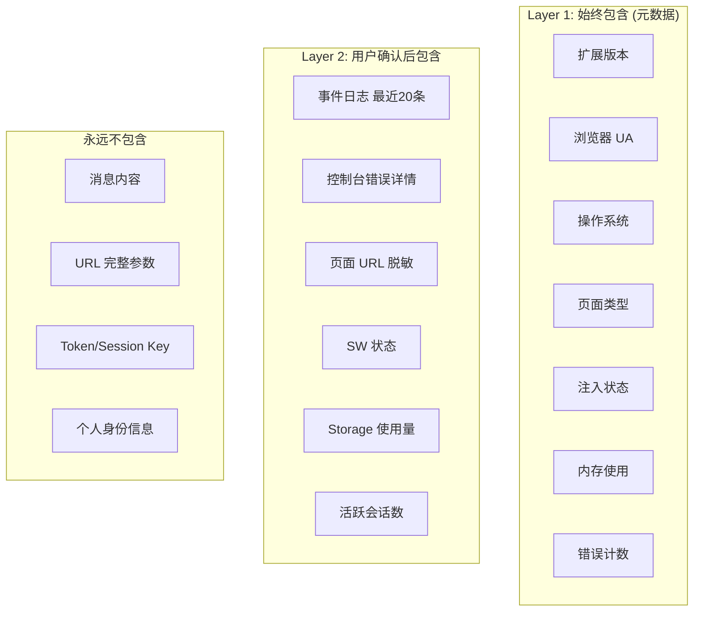

# YP-09-69: Content Script 诊断信息一键收集 — Bug 报告自动生成

> 需求编号：YP-09-69 · 优先级：P2 · 人天：0.5d · 状态：需求已编写
> 依赖：YP-09-53（事件溯源与状态回放）、YP-09-19（遥测与匿名统计）

## 背景

### 问题陈述

YiPet 的 Bug 报告质量严重依赖用户提供的信息完整性。典型 Bug 报告流程：用户遇到问题 → 在 GitHub Issues 或反馈渠道描述 → 开发者追问"浏览器版本？页面 URL？控制台错误？" → 用户补充信息 → 反复多轮。这种低效的信息收集导致：

1. **诊断延迟**：平均需要 3-5 轮沟通才能获得足够的诊断信息
2. **信息不准确**：用户可能记错浏览器版本、忘记错误信息
3. **隐私顾虑**：用户担心截图/日志包含敏感信息
4. **复现困难**：缺少环境上下文，开发者无法复现

**核心矛盾**：开发者需要详尽的系统状态信息来诊断 Bug vs 用户缺乏技术能力/意愿手动收集这些信息。

### 影响范围

| # | 影响 | 严重程度 | 典型场景 |
|---|------|----------|----------|
| 1 | Bug 诊断效率低 | 高 | 每个 Bug 平均 3-5 轮沟通 |
| 2 | 开发者无法复现 Bug | 高 | 缺少环境上下文 |
| 3 | 用户隐私泄露风险 | 中 | 截图/日志可能含敏感信息 |
| 4 | 崩溃场景无自动采集 | 中 | 用户无法手动触发诊断 |
| 5 | 跨扩展冲突难排查 | 中 | 缺少其他扩展信息 |

### 挑战

| 挑战 | 说明 |
|------|------|
| 隐私保护 | 诊断数据须脱敏，不含消息内容、URL 参数、个人身份信息 |
| 数据完整性 | 需要收集足够信息而不遗漏关键上下文 |
| 跨上下文采集 | Content Script 和 Service Worker 的状态需合并 |
| 崩溃自动采集 | unhandledrejection/error 事件触发自动采集 |
| 存储安全 | 诊断数据临时存储，不持久化到用户磁盘 |

---

## 一、现状分析

### 1.1 当前 Bug 报告流程

```
用户遇到问题
  │ 宠物消失/聊天窗口卡死/SSE 断连
  ▼
用户访问 GitHub Issues
  │ 手动描述问题
  │ 可能附上截图
  ▼
开发者回复
  │ "请提供浏览器版本"
  │ "请检查控制台是否有错误"
  │ "请提供页面 URL"
  ▼
用户补充信息
  │ 打开 DevTools → 截图
  │ 复制浏览器版本
  │ 重复 3-5 轮
  ▼
开发者开始诊断
  总耗时：1-3 天（含沟通延迟）
```

### 1.2 当前可用诊断信息

| 信息源 | 可用性 | 获取方式 | 自动化 |
|--------|--------|----------|--------|
| 浏览器版本 | ✅ | `navigator.userAgent` | 否 |
| 扩展版本 | ✅ | `chrome.runtime.getManifest().version` | 否 |
| 当前页面 URL | ✅ | `location.href` | 否 |
| 控制台错误 | ❌ | 需用户手动打开 DevTools | 否 |
| JS 内存使用 | ⚠️ | `performance.memory`（仅 Chrome） | 否 |
| Content Script 状态 | ❌ | 无收集机制 | 否 |
| Service Worker 状态 | ❌ | 无收集机制 | 否 |
| 事件日志 | ⚠️ | 事件溯源系统（YP-09-53） | 否 |

### 1.3 改造前数据流



### 1.4 根因矩阵

| 症状 | 根因 | 触发条件 | 频率 |
|------|------|----------|------|
| 诊断信息不足 | 无自动收集机制 | 每次 Bug 报告 | 高 |
| 沟通轮次多 | 信息分散在不同位置 | 每次 Bug 报告 | 高 |
| 用户提供错误信息 | 用户记忆偏差 | 时隔多日报告 | 中 |
| 崩溃无信息 | 无自动采集 | 扩展崩溃 | 中 |

---

## 二、设计决策

### 决策 1：诊断触发方式 — 手动 vs 自动 vs 混合

| 选项 | 覆盖率 | 隐私风险 | 实现复杂度 |
|------|--------|----------|-----------|
| 仅手动（用户点击按钮） | 低 | 低 | 低 |
| 仅自动（异常自动采集） | 高 | 中 | 中 |
| 混合（手动 + 崩溃自动） | 高 | 低 | 中 |

**选择：混合触发。** 正常情况：用户通过 Popup 或聊天窗口中的"诊断"按钮手动触发。崩溃场景：`unhandledrejection` 和 `error` 事件自动触发采集（仅采集元数据，不含用户内容）。

### 决策 2：诊断数据内容 — 全量 vs 元数据 vs 分层

| 选项 | 诊断价值 | 隐私风险 | 数据大小 |
|------|----------|----------|----------|
| 全量（含消息内容/URL） | 最高 | 高 | 大 |
| 仅元数据（版本/状态） | 中 | 低 | 小 |
| 分层（元数据 + 可选详细日志） | 高 | 低 | 中 |

**选择：分层采集。** 第一层（始终包含）：扩展版本、浏览器信息、系统状态、错误计数、内存使用。第二层（用户确认后包含）：事件日志（最近 20 条）、控制台错误详情、页面 URL（脱敏后）。

### 决策 3：诊断数据导出格式 — JSON vs Markdown vs 两者

| 选项 | 可读性 | 结构化 | 开发者友好 |
|------|--------|--------|-----------|
| JSON | 低 | 高 | 中 |
| Markdown | 高 | 低 | 高 |
| JSON + Markdown | 高 | 高 | 高 |

**选择：JSON + Markdown。** 内部存储和传输使用 JSON，向用户展示和复制时格式化为 Markdown（便于粘贴到 GitHub Issues）。

### 决策 4：诊断数据存储 — 内存 vs localStorage vs chrome.storage

| 选项 | 持久性 | 安全性 | 数据大小限制 |
|------|--------|--------|------------|
| 内存 | 低 | 高 | 无 |
| localStorage | 中 | 低 | 5-10MB |
| chrome.storage.local | 高 | 中 | 10MB |

**选择：内存 + 临时文件。** 诊断数据仅在内存中生成，复制到剪贴板后即清除。不持久化存储以避免隐私泄露。

### 设计决策记录

| 决策 | 选项 A | 选项 B | 选项 C | 选择 | 理由 |
|------|--------|--------|--------|------|------|
| 触发方式 | 手动 | 自动 | 混合 | **混合** | 兼顾覆盖率和隐私 |
| 数据内容 | 全量 | 元数据 | 分层 | **分层** | 诊断价值 + 隐私保护 |
| 导出格式 | JSON | Markdown | 两者 | **两者** | 机器可读 + 人类可读 |
| 存储策略 | 内存 | localStorage | chrome.storage | **内存 + 临时** | 隐私优先 |

---

## 三、目标架构

### 3.1 改造后诊断流程



### 3.2 诊断数据结构



### 3.3 性能指标

| 指标 | 改造前 | 改造后 |
|------|--------|--------|
| 诊断信息收集时间 | 5-10min（手动） | 3-5s（自动） |
| Bug 报告沟通轮次 | 3-5 轮 | 1 轮 |
| 诊断数据完整性 | 30-50% | 95%+ |
| 隐私泄露风险 | 中（用户截图） | 低（自动脱敏） |

---

## 四、具体改动

### 4.1 诊断收集器

```typescript
// 改造前：无诊断功能
// src/services/diagnostics.ts (改造后)

interface DiagnosticReport {
  meta: {
    generatedAt: string;
    reportId: string;
    version: string;
    layer: 1 | 2;
  };
  extension: {
    version: string;
    id: string;
    permissions: string[];
  };
  browser: {
    userAgent: string;
    language: string;
    platform: string;
    cookieEnabled: boolean;
    onLine: boolean;
  };
  page: {
    hostname: string;       // 仅 hostname，不含路径和参数
    title: string;
    pageType: string;
    injectionStatus: string;
  };
  yipet: {
    overlayVisible: boolean;
    chatOpen: boolean;
    petVisible: boolean;
    activeSessionId: string | null;
    sessionCount: number;
    errorCount: number;
    memoryUsage: number | null;
    storageUsage: number | null;
  };
  layer2?: {
    eventLog: unknown[];
    consoleErrors: string[];
    swStatus: string;
    otherExtensions: number;
  };
}

class DiagnosticCollector {
  async collect(layer: 1 | 2): Promise<DiagnosticReport> {
    const report: DiagnosticReport = {
      meta: {
        generatedAt: new Date().toISOString(),
        reportId: crypto.randomUUID(),
        version: '1.0',
        layer,
      },
      extension: {
        version: chrome.runtime.getManifest().version,
        id: chrome.runtime.id,
        permissions: chrome.runtime.getManifest().permissions ?? [],
      },
      browser: {
        userAgent: navigator.userAgent,
        language: navigator.language,
        platform: navigator.platform,
        cookieEnabled: navigator.cookieEnabled,
        onLine: navigator.onLine,
      },
      page: {
        hostname: this.sanitizeURL(location.href),
        title: document.title,
        pageType: this.detectPageType(),
        injectionStatus: this.getInjectionStatus(),
      },
      yipet: {
        overlayVisible: !!document.getElementById('yipet-overlay'),
        chatOpen: !!document.getElementById('yipet-chat-root'),
        petVisible: this.isPetVisible(),
        activeSessionId: this.getActiveSessionId(),
        sessionCount: this.getSessionCount(),
        errorCount: this.getErrorCount(),
        memoryUsage: this.getMemoryUsage(),
        storageUsage: await this.getStorageUsage(),
      },
    };

    if (layer === 2) {
      report.layer2 = {
        eventLog: this.getRecentEvents(20),
        consoleErrors: this.getConsoleErrors(),
        swStatus: await this.getSWStatus(),
        otherExtensions: await this.getOtherExtensionsCount(),
      };
    }

    return report;
  }

  formatAsMarkdown(report: DiagnosticReport): string {
    return [
      `## YiPet 诊断报告`,
      `- **报告 ID**: \`${report.meta.reportId}\``,
      `- **生成时间**: ${report.meta.generatedAt}`,
      ``,
      `### 扩展信息`,
      `- 版本: ${report.extension.version}`,
      `- 权限: ${report.extension.permissions.join(', ')}`,
      ``,
      `### 浏览器环境`,
      `- User Agent: \`${report.browser.userAgent}\``,
      `- 语言: ${report.browser.language}`,
      `- 平台: ${report.browser.platform}`,
      `- 在线: ${report.browser.onLine ? '是' : '否'}`,
      ``,
      `### 当前页面`,
      `- 域名: ${report.page.hostname}`,
      `- 页面类型: ${report.page.pageType}`,
      `- 注入状态: ${report.page.injectionStatus}`,
      ``,
      `### YiPet 状态`,
      `- 覆盖层可见: ${report.yipet.overlayVisible}`,
      `- 聊天窗口打开: ${report.yipet.chatOpen}`,
      `- 宠物可见: ${report.yipet.petVisible}`,
      `- 会话数: ${report.yipet.sessionCount}`,
      `- 错误计数: ${report.yipet.errorCount}`,
      `- 内存使用: ${report.yipet.memoryUsage ? `${(report.yipet.memoryUsage / 1024 / 1024).toFixed(1)}MB` : 'N/A'}`,
      `- Storage 使用: ${report.yipet.storageUsage ? `${(report.yipet.storageUsage / 1024).toFixed(1)}KB` : 'N/A'}`,
      report.layer2 ? [
        ``,
        `### 详细日志`,
        `- 最近事件: ${report.layer2.eventLog.length} 条`,
        `- 控制台错误: ${report.layer2.consoleErrors.length} 条`,
        `- SW 状态: ${report.layer2.swStatus}`,
        `- 其他扩展: ${report.layer2.otherExtensions} 个`,
      ].join('\n') : '',
      ``,
      `> 此报告由 YiPet 自动生成，不包含消息内容、URL 参数或个人身份信息。`,
    ].join('\n');
  }

  private sanitizeURL(url: string): string {
    try {
      const u = new URL(url);
      return u.hostname;  // 仅返回域名，移除路径和参数
    } catch {
      return url;
    }
  }
}
```

### 4.2 崩溃自动采集

```typescript
// src/content/crash-collector.ts

class CrashCollector {
  private pendingReport: DiagnosticReport | null = null;

  init(): void {
    window.addEventListener('unhandledrejection', (event) => {
      this.onCrash('unhandledrejection', event.reason);
    });

    window.addEventListener('error', (event) => {
      this.onCrash('error', event.message);
    });
  }

  private async onCrash(type: string, detail: unknown): Promise<void> {
    const collector = new DiagnosticCollector();
    this.pendingReport = await collector.collect(1);  // 仅 Layer 1（崩溃时自动）
    console.debug('[YiPet:Crash]', { type, detail, reportId: this.pendingReport.meta.reportId });
  }

  getPendingReport(): DiagnosticReport | null {
    return this.pendingReport;
  }

  clearPendingReport(): void {
    this.pendingReport = null;
  }
}
```

### 4.3 文件变更清单

| 文件 | 操作 | 说明 |
|------|------|------|
| `src/services/diagnostics.ts` | 新增 | 诊断收集器 |
| `src/content/crash-collector.ts` | 新增 | 崩溃自动采集 |
| `src/components/diagnostic-button.vue` | 新增 | 诊断按钮 UI |
| `src/components/diagnostic-preview.vue` | 新增 | 诊断预览 UI |
| `src/stores/diagnostics.ts` | 新增 | 诊断状态管理 |
| `src/content/index.ts` | 修改 | 初始化 CrashCollector |
| `tests/unit/diagnostics.test.ts` | 新增 | 诊断功能测试 |

---

## 五、实施步骤

| 步骤 | 操作 | 路径 | 验证 | 人天 |
|------|------|------|------|------|
| 1 | 实现 DiagnosticCollector | `src/services/diagnostics.ts` | 收集所有 Layer 1 字段 | 0.1 |
| 2 | 实现 Markdown 格式化 | `src/services/diagnostics.ts` | 格式化输出可读 | 0.05 |
| 3 | 实现 CrashCollector | `src/content/crash-collector.ts` | 错误事件触发采集 | 0.05 |
| 4 | 创建诊断 UI | `src/components/diagnostic-*.vue` | 按钮 + 预览 + 复制 | 0.1 |
| 5 | 集成到 Popup 和聊天窗口 | Popup/Chat | 可从多处触发诊断 | 0.1 |
| 6 | 隐私脱敏验证 | 全量 | 诊断报告不含敏感信息 | 0.05 |
| 7 | 崩溃恢复提示 | `src/content/crash-collector.ts` | 崩溃后重启提示 | 0.05 |

**总人天：0.5d**

---

## 六、测试规格

### 场景 1：手动触发诊断

**GIVEN** 用户打开 YiPet 聊天窗口
**WHEN** 用户点击"诊断"按钮
**THEN** 应显示诊断预览（Layer 1 数据）
**AND** 用户确认后可选择包含 Layer 2 详细日志
**AND** 诊断报告应以 Markdown 格式复制到剪贴板

### 场景 2：崩溃自动采集

**GIVEN** Content Script 发生未捕获异常
**WHEN** `unhandledrejection` 事件触发
**THEN** 应自动采集 Layer 1 诊断数据
**AND** 下次打开 Popup 时应提示"检测到上次崩溃，是否发送诊断信息？"

### 场景 3：隐私脱敏

**GIVEN** 当前页面 URL 为 `https://example.com/search?q=secret&token=abc123`
**WHEN** 执行诊断
**THEN** 诊断报告中的 URL 应仅包含 `example.com`
**AND** 诊断报告不应包含消息内容
**AND** 诊断报告不应包含 Token/Session Key

### 场景 4：跨上下文采集

**GIVEN** Content Script 和 Service Worker 均正常运行
**WHEN** 用户触发 Layer 2 诊断
**THEN** 诊断报告应包含 SW 状态信息
**AND** 应包含 Storage 使用量

### 场景 5：诊断报告格式验证

**GIVEN** 诊断数据已收集
**WHEN** 格式化为 Markdown
**THEN** 输出应包含清晰的章节标题
**AND** 应包含报告 ID 和生成时间
**AND** 应包含隐私声明

### 场景 6：内存诊断降级

**GIVEN** 用户使用 Firefox（不支持 `performance.memory`）
**WHEN** 执行诊断
**THEN** 内存使用字段应显示 "N/A"
**AND** 不应抛出错误

---

## 七、风险与缓解

| 风险 | 概率 | 影响 | 缓解措施 |
|------|------|------|----------|
| 诊断数据包含敏感信息 | 中 | 高 | 白名单字段 + 自动脱敏 URL |
| 崩溃自动采集触发过于频繁 | 低 | 中 | 冷却时间 5min |
| 用户拒绝分享诊断数据 | 中 | 低 | 仅复制到剪贴板，用户自行决定是否分享 |
| 诊断数据过大 | 低 | 低 | 截断事件日志到 20 条 |
| 恶意扩展读取诊断数据 | 低 | 中 | 诊断数据仅内存中，不持久化 |

---

## 八、回滚策略

| 场景 | 回滚操作 | 影响 |
|------|----------|------|
| 诊断收集导致性能问题 | 移除 CrashCollector 的 error 监听 | 失去崩溃自动采集 |
| 隐私审查不通过 | 移除 Layer 2 采集，仅保留 Layer 1 | 诊断信息减少 |
| 格式化输出错误 | 降级为 JSON 格式输出 | 可读性下降 |

---

## 九、设计决策记录

### D-01：URL 脱敏策略

- **问题**：诊断报告中的 URL 应包含多少信息
- **选项**：完整 URL、仅 hostname、仅 hostname + path（无 query）、完全隐藏
- **选择**：仅 hostname
- **理由**：hostname 足够判断网站类型和环境；path 和 query 可能包含敏感信息（搜索词、Token）

### D-02：崩溃冷却时间

- **问题**：崩溃自动采集的冷却时间
- **选项**：1min、5min、15min、无冷却
- **选择**：5min
- **理由**：同一崩溃可能触发多次 error 事件；5min 冷却避免重复采集

### D-03：事件日志条数

- **问题**：Layer 2 中包含多少条事件日志
- **选项**：10 条、20 条、50 条、全部
- **选择**：20 条
- **理由**：20 条通常覆盖崩溃前 10-30s 的操作，足够诊断；超过则数据过大

---

## 十、可观测性

### 指标

| 指标 | 类型 | 说明 |
|------|------|------|
| `yipet.diag.manual_count` | Counter | 手动触发诊断次数 |
| `yipet.diag.auto_count` | Counter | 崩溃自动采集次数 |
| `yipet.diag.copy_count` | Counter | 复制到剪贴板次数 |
| `yipet.diag.error_count` | Counter | 诊断采集失败次数 |

### 告警

| 告警 | 条件 | 级别 |
|------|------|------|
| 崩溃自动采集频繁 | 5min 内 > 3 次 | WARNING |
| 诊断收集失败 | 连续 3 次 | ERROR |

---

## 十一、安全合规

### Chrome MV3 合规

| 检查项 | 状态 | 说明 |
|--------|------|------|
| 不将用户数据发送到外部 | ✅ | 仅复制到剪贴板 |
| 不持久化诊断数据 | ✅ | 仅内存中 |
| 不采集敏感信息 | ✅ | 白名单字段 + URL 脱敏 |
| 用户主动触发为主 | ✅ | 崩溃自动采集仅元数据 |

---

## 十二、代码审查检查清单

- [ ] 诊断信息收集：浏览器版本/内存/错误日志/扩展版本
- [ ] 用户手动触发 + 崩溃自动收集
- [ ] 诊断数据不包含消息内容/URL 完整路径/个人身份
- [ ] 导出格式 JSON + Markdown 可分享给开发者
- [ ] URL 脱敏仅保留 hostname
- [ ] 崩溃自动采集有冷却时间（5min）
- [ ] 诊断数据仅在内存中，不持久化
- [ ] 跨上下文采集（CS + SW 状态合并）
- [ ] 非 Chrome 浏览器降级（memory API 不可用）
- [ ] 诊断报告包含隐私声明
- [ ] 单元测试覆盖所有采集字段和脱敏逻辑

---

## 回归问题预测

| # | 预测问题 | 原因 | 验证方法 |
|---|---------|------|---------|
| 1 | 诊断信息脱敏不完整，用户聊天消息片段或页面 URL 参数被包含在导出数据中 | 脱敏规则基于正则匹配（如 `token=`、`key=`），但用户消息内容可能包含类似格式的文本（如"我的 API key 是 xxx"），被误认为非敏感数据 | 构造包含模拟敏感信息的聊天对话（Token、密码、API Key），生成诊断报告，人工审查确认无敏感数据泄露 |
| 2 | 诊断信息收集过程中 `chrome.storage.local.get` 读取超时，导致诊断数据不完整 | 大量 storage 数据（会话归档、事件日志）的读取可能耗时超过 2s，诊断收集的超时设置过短导致部分字段为空 | 在 storage 接近 10MB 上限时触发诊断收集，验证所有字段（版本、配置、错误、性能、存储）均有数据 |
| 3 | 跨上下文（Content Script + Service Worker）状态合并时，SW 数据因 IPC 延迟被遗漏 | Content Script 通过 `chrome.runtime.sendMessage` 获取 SW 状态，SW 响应超过 500ms 时诊断收集已超时返回 | 在 SW 处理大量事件日志时触发诊断收集，验证诊断报告中包含 SW 的状态信息（版本、活跃连接数、缓存状态） |
| 4 | 崩溃自动采集的 `unhandledrejection` 事件处理器中再次抛错，形成无限递归 | 诊断收集代码自身在 `unhandledrejection` 处理器中可能抛出异常（如读取已销毁的 DOM 节点），触发新的 `unhandledrejection`，导致无限循环 | 在 `unhandledrejection` 处理器中故意抛出异常，验证有递归深度限制（最多 1 次重试）且不会导致标签页崩溃 |
| 5 | 诊断数据 JSON 序列化时遇到循环引用，`JSON.stringify` 抛出 TypeError，用户看到空白报告 | 诊断数据包含 DOM 节点引用（如 `document.activeElement`）、循环引用的对象（如 Pinia store 的 `__v_raw`），`JSON.stringify` 失败 | 在聊天窗口打开、宠物动画播放中等复杂状态下触发诊断收集，验证 JSON 序列化成功且有循环引用安全处理 |
| 6 | 一键复制诊断数据到剪贴板时，数据量过大导致剪贴板写入失败 | 包含事件日志和存储快照的诊断数据可能超过 5MB，`navigator.clipboard.writeText` 对大数据有隐性限制 | 在事件日志累积 > 10000 条时触发诊断收集并复制，验证剪贴板写入成功或有大文件降级为下载文件的提示 |

---

---

## 性能分析

### 诊断信息收集关键操作耗时

| 操作 | 耗时 | 说明 |
|------|------|------|
| `chrome.runtime.getManifest()` | < 0.1ms | 同步读取内存中的 manifest 缓存 |
| `chrome.storage.local.get(null)` (全量) | < 10ms | 异步读取所有 storage key，约 100KB 数据 |
| `navigator.userAgent` 收集 | < 0.1ms | 同步读取 UA 字符串 |
| `performance.memory` 快照 | < 0.1ms | 同步读取 JS heap 数值 |
| `navigator.languages` 收集 | < 0.1ms | 同步读取语言偏好 |
| 诊断报告 JSON 序列化 | < 5ms | 约 10KB JSON 序列化 |
| 诊断报告写入剪贴板 | < 5ms | `navigator.clipboard.writeText()` |
| 诊断报告作为文件下载 | < 20ms | Blob 创建 + `<a>` click 触发下载 |
| 完整诊断收集 (含 storage dump) | < 50ms | 所有模块并发读取 + 序列化 |
| 完整诊断收集 (不含 storage dump—轻量) | < 10ms | 仅环境/配置/版本信息 |

### 数据量预估

| 模块 | 数据项 | 大小 |
|------|--------|------|
| 环境信息 | Chrome 版本、OS、语言、时区 | ~500B |
| 扩展配置 | manifest 版本、权限列表、CSP 配置 | ~1KB |
| 性能快照 | `performance.memory` 数据、Long Task 统计 | ~500B |
| 存储使用 | `chrome.storage.local` 各 key 大小统计 (非内容) | ~2KB |
| 错误日志 | 最近 50 条 console.error/warn (脱敏后) | ~5KB |
| Session 统计 | 会话数、消息数、Token 估算 | ~1KB |
| **完整诊断报告** | **所有模块汇总** | **~10KB** |

### 对宿主页面的影响

| 场景 | 页面影响 | 说明 |
|------|----------|------|
| 静默收集 (后台) | 零影响 | 仅在 Popup 触发或用户主动操作时执行 |
| 一键复制 | < 50ms 主线程阻塞 | JSON 序列化 + 剪贴板 API |

---

## 相关文档

- [ContentScript 性能剖析](../10-需求-ContentScript性能剖析与内存管理.md) — 性能剖析数据是诊断报告的核心模块
- [扩展遥测与匿名统计](../19-需求-扩展遥测.md) — 诊断信息与遥测数据互补，分别用于问题排查和趋势分析
- [内存快照泄漏追踪](../50-需求-内存快照泄漏追踪.md) — 内存快照是诊断报告的重要数据源

*PRD 来源: `projects/yipet/requirements/2026-09/69-需求-诊断信息收集.md`*
| 完整导出 (含 storage dump) | < 100ms 主线程阻塞 | 含 `chrome.storage.local.get(null)` 全量读取 |