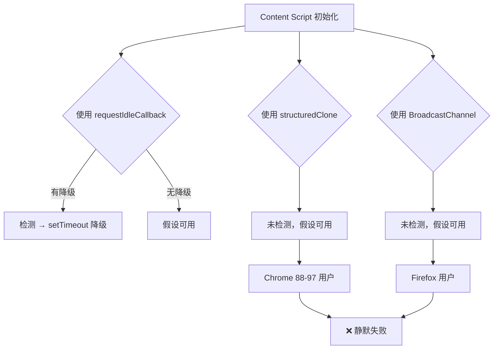
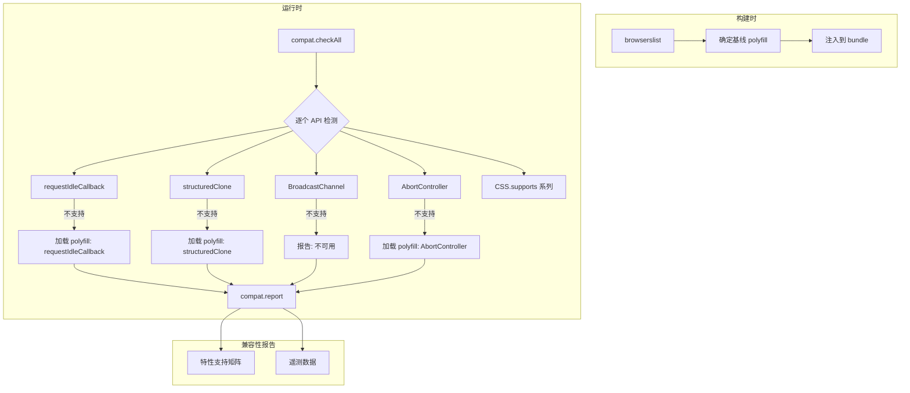

# YP-09-70: Content Script 兼容性工具链 — polyfill 管理与特性检测

> 需求编号：YP-09-70 · 优先级：P2 · 人天：0.5d · 状态：需求已编写
> 依赖：无

## 背景

### 问题陈述

YiPet 作为 Chrome MV3 扩展，最低支持 Chrome 88+。但用户实际使用的浏览器版本范围广泛（Chrome 88-130+、Edge 88-130+、Safari 15.4+、Firefox 109+）。YiPet 的多处代码依赖现代 Web API——`requestIdleCallback`（内容脚本初始化）、`structuredClone`（消息深拷贝）、`BroadcastChannel`（多标签页同步）、`AbortController`（SSE 中断）——这些 API 在不同浏览器和版本中的支持程度不同。

**核心矛盾**：使用现代 API 提升开发效率 vs 旧浏览器不支持导致功能静默失效。代码中已有零散的降级处理（如 `requestIdleCallback` 的 `setTimeout` 降级），但缺乏系统性的特性检测和按需 polyfill 加载机制。

### 影响范围

| # | 影响 | 严重程度 | 触发场景 |
|---|------|----------|----------|
| 1 | 旧浏览器功能静默失效 | 高 | Chrome 88-100 用户 |
| 2 | 零散降级代码不可维护 | 中 | 新增 API 使用时 |
| 3 | 无法判断哪些功能实际可用 | 中 | 用户反馈 Bug |
| 4 | Safari/Firefox 兼容性未知 | 中 | 未来扩展支持 |
| 5 | Polyfill 不必要地加载 | 低 | 现代浏览器也加载 polyfill |

### 挑战

| 挑战 | 说明 |
|------|------|
| 特性检测不全 | 代码中只检测了 `requestIdleCallback`，其他 API 假设可用 |
| Polyfill 体积 | 全量 polyfill 约 30-50KB，不应在现代浏览器加载 |
| 检测时机 | 特性检测需在应用初始化前完成 |
| CSS 特性检测 | JS 特性检测易，CSS 特性检测难（如 `contain`、`content-visibility`） |
| 版本矩阵维护 | 4 种浏览器 x 多个版本的兼容性矩阵需持续维护 |

---

## 一、现状分析

### 1.1 当前特性检测分布

```
代码中零散的降级处理：
├── src/content/index.ts
│   └── requestIdleCallback 降级（YP-09-01 已有）
├── src/services/api-client.ts
│   └── AbortController（假设可用）
├── src/stores/chat.ts
│   └── structuredClone（未检测）
├── src/content/tab-sync.ts
│   └── BroadcastChannel（未检测）
└── src/content/observer.ts
    └── IntersectionObserver / ResizeObserver（未检测）
```

### 1.2 检测矩阵

| 特性 | Chrome 88 | Edge 88 | Safari 15.4 | Firefox 109 | YiPet 使用 |
|------|-----------|---------|------------|-------------|-----------|
| `requestIdleCallback` | ✅ | ✅ | ❌ | ❌ | 是（已有降级） |
| `BroadcastChannel` | ✅ | ✅ | ✅ | ✅ | 是（无检测） |
| `structuredClone` | ✅ (98+) | ✅ (98+) | ✅ | ✅ | 是（无检测） |
| `AbortController` | ✅ | ✅ | ✅ | ✅ | 是（无检测） |
| `IntersectionObserver` | ✅ | ✅ | ✅ | ✅ | 是（无检测） |
| `ResizeObserver` | ✅ | ✅ | ✅ | ✅ | 是（无检测） |
| `CSS.supports(grid)` | ✅ | ✅ | ✅ | ✅ | 是（无检测） |
| `CSS.supports(contain)` | ✅ | ✅ | ✅ | ✅ | 是（无检测） |
| `CSS.supports(content-visibility)` | ✅ (85+) | ✅ (85+) | ❌ | ❌ | 否 |
| `crypto.randomUUID()` | ✅ (92+) | ✅ (92+) | ✅ | ✅ | 是（无检测） |

### 1.3 改造前数据流



### 1.4 根因矩阵

| 症状 | 根因 | 触发条件 | 频率 |
|------|------|----------|------|
| 功能静默失效 | 无特性检测 | 旧浏览器 | 中 |
| 降级代码分散 | 无统一管理 | 每次新增 API 使用 | 高 |
| 不必要的 polyfill | 无按需加载 | 现代浏览器 | 中 |
| 兼容性未知 | 无检测矩阵 | 跨浏览器测试 | 中 |

---

## 二、设计决策

### 决策 1：Polyfill 策略 — 全量预加载 vs 按需加载 vs 构建时注入

| 选项 | 体积 | 运行时开销 | 兼容性 |
|------|------|-----------|--------|
| 全量预加载（所有 polyfill 打包） | 高（+30-50KB） | 低 | 最佳 |
| 按需加载（特性检测后动态加载） | 低 | 中 | 最佳 |
| 构建时注入（按 browserslist 决定） | 中 | 低 | 中 |

**选择：特性检测 + 按需加载。** 构建时使用 `browserslist` 确定基线 polyfill。运行时对基线外的 API 进行特性检测，按需加载 polyfill。避免在现代浏览器加载不必要的代码。

### 决策 2：特性检测粒度 — 每个 API 单独 vs 分组 vs 全或无

| 选项 | 粒度 | 复杂度 | 加载效率 |
|------|------|--------|----------|
| 每个 API 单独检测 | 最细 | 高 | 最佳 |
| 按功能分组（DOM/网络/存储） | 中 | 中 | 中 |
| 全或无（检测 Chrome 版本） | 粗 | 低 | 最差 |

**选择：每个 API 单独检测。** 每个 API 的兼容性矩阵不同，单独检测可实现最精确的按需加载。虽然检测项多（~15 项），但每次检测 <0.1ms。

### 决策 3：Polyfill 来源 — 自实现 vs core-js vs 浏览器内置降级

| 选项 | 体积 | 可靠性 | 维护成本 |
|------|------|--------|----------|
| 自实现（如 setTimeout 降级） | 最小 | 中 | 高 |
| core-js / polyfill.io | 大 | 高 | 低 |
| 浏览器内置降级（仅用已有 API 模拟） | 最小 | 高 | 中 |

**选择：自实现 + 浏览器内置降级。** YiPet 依赖的 API 数量少（~8 个），每个 polyfill 实现简单（如 `structuredClone` 降级为 `JSON.parse(JSON.stringify())`），不需要引入 core-js 这样的重量级库。

### 设计决策记录

| 决策 | 选项 A | 选项 B | 选项 C | 选择 | 理由 |
|------|--------|--------|--------|------|------|
| Polyfill 策略 | 全量 | 按需 | 构建时 | **按需** | 最小体积 |
| 检测粒度 | 单独 | 分组 | 全或无 | **单独** | 最精确 |
| Polyfill 来源 | 自实现 | core-js | 内置降级 | **自实现 + 内置降级** | 轻量可控 |

---

## 三、目标架构

### 3.1 改造后兼容性工具链



### 3.2 性能指标

| 指标 | 改造前 | 改造后 |
|------|--------|--------|
| 兼容性检测覆盖率 | 1/8 API | 8/8 API |
| 旧浏览器功能失效 | 可能 | 降级可用 |
| 不必要 polyfill 加载 | 0KB（无 polyfill） | 0KB（按需检测） |
| 检测耗时 | 0ms | <1ms（15 项检测） |

---

## 四、具体改动

### 4.1 兼容性检测模块

```typescript
// 改造前：零散降级
// if (!('requestIdleCallback' in window)) { /* setTimeout 降级 */ }

// src/services/compatibility.ts (改造后)

interface FeatureCheck {
  name: string;
  check: () => boolean;
  severity: 'critical' | 'important' | 'optional';
  polyfill?: () => Promise<void>;
}

const FEATURE_CHECKS: FeatureCheck[] = [
  {
    name: 'requestIdleCallback',
    check: () => 'requestIdleCallback' in window,
    severity: 'important',
    polyfill: async () => {
      window.requestIdleCallback = (cb, opts) => {
        const start = Date.now();
        return setTimeout(() => cb({
          didTimeout: false,
          timeRemaining: () => Math.max(0, 50 - (Date.now() - start)),
        }), 1) as unknown as number;
      };
    },
  },
  {
    name: 'structuredClone',
    check: () => 'structuredClone' in window,
    severity: 'critical',
    polyfill: async () => {
      window.structuredClone = (obj) => JSON.parse(JSON.stringify(obj));
    },
  },
  {
    name: 'BroadcastChannel',
    check: () => 'BroadcastChannel' in window,
    severity: 'important',
    // 无 polyfill：不支持的浏览器无法使用多标签页同步
  },
  {
    name: 'AbortController',
    check: () => 'AbortController' in window,
    severity: 'critical',
    polyfill: async () => {
      const mod = await import('./polyfills/abort-controller');
      mod.polyfill();
    },
  },
  {
    name: 'IntersectionObserver',
    check: () => 'IntersectionObserver' in window,
    severity: 'optional',
  },
  {
    name: 'ResizeObserver',
    check: () => 'ResizeObserver' in window,
    severity: 'optional',
  },
  {
    name: 'crypto.randomUUID',
    check: () => 'crypto' in window && 'randomUUID' in crypto,
    severity: 'critical',
    polyfill: async () => {
      crypto.randomUUID = () => {
        return 'xxxxxxxx-xxxx-4xxx-yxxx-xxxxxxxxxxxx'.replace(/[xy]/g, (c) => {
          const r = Math.random() * 16 | 0;
          return (c === 'x' ? r : (r & 0x3 | 0x8)).toString(16);
        });
      };
    },
  },
  {
    name: 'CSS.grid',
    check: () => CSS.supports('display', 'grid'),
    severity: 'optional',
  },
  {
    name: 'CSS.contain',
    check: () => CSS.supports('contain', 'layout style paint'),
    severity: 'optional',
  },
];

interface CompatibilityReport {
  supported: string[];
  polyfilled: string[];
  unsupported: string[];
  criticalMissing: string[];
}

class CompatibilityService {
  private report: CompatibilityReport | null = null;

  async checkAll(): Promise<CompatibilityReport> {
    const supported: string[] = [];
    const polyfilled: string[] = [];
    const unsupported: string[] = [];
    const criticalMissing: string[] = [];

    for (const feature of FEATURE_CHECKS) {
      if (feature.check()) {
        supported.push(feature.name);
      } else if (feature.polyfill) {
        await feature.polyfill();
        polyfilled.push(feature.name);
      } else {
        unsupported.push(feature.name);
        if (feature.severity === 'critical') {
          criticalMissing.push(feature.name);
        }
      }
    }

    this.report = { supported, polyfilled, unsupported, criticalMissing };

    if (criticalMissing.length > 0) {
      console.error('[YiPet:Compat] Critical features missing:', criticalMissing);
    }

    return this.report;
  }

  getReport(): CompatibilityReport | null {
    return this.report;
  }

  isSupported(feature: string): boolean {
    return this.report?.supported.includes(feature) ?? false;
  }
}

export const compat = new CompatibilityService();
```

### 4.2 文件变更清单

| 文件 | 操作 | 说明 |
|------|------|------|
| `src/services/compatibility.ts` | 新增 | 兼容性检测服务 |
| `src/services/polyfills/abort-controller.ts` | 新增 | AbortController polyfill |
| `src/content/index.ts` | 修改 | 初始化时调用 compat.checkAll() |
| `src/stores/diagnostics.ts` | 修改 | 诊断报告包含兼容性信息 |
| `tests/unit/compatibility.test.ts` | 新增 | 兼容性检测测试 |

---

## 五、实施步骤

| 步骤 | 操作 | 路径 | 验证 | 人天 |
|------|------|------|------|------|
| 1 | 定义 FEATURE_CHECKS 矩阵 | `src/services/compatibility.ts` | 所有已知 API 覆盖 | 0.1 |
| 2 | 实现 polyfill 函数 | `src/services/compatibility.ts` | 各 polyfill 功能正确 | 0.1 |
| 3 | 集成到初始化流程 | `src/content/index.ts` | 启动时执行检测 | 0.1 |
| 4 | 兼容性报告集成到诊断 | `src/stores/diagnostics.ts` | 诊断报告含兼容性 | 0.05 |
| 5 | 跨浏览器测试 | 4 种浏览器 | 所有功能正常 | 0.15 |

**总人天：0.5d**

---

## 六、测试规格

### 场景 1：现代浏览器全支持

**GIVEN** Chrome 120+ 浏览器
**WHEN** 执行兼容性检测
**THEN** 所有 9 项特性应在 `supported` 列表中
**AND** `polyfilled` 和 `unsupported` 应为空
**AND** 检测耗时 < 1ms

### 场景 2：旧浏览器 Polyfill

**GIVEN** Chrome 88 浏览器（不支持 `structuredClone`）
**WHEN** 执行兼容性检测
**THEN** `structuredClone` 应在 `polyfilled` 列表中
**AND** `window.structuredClone` 应可用（JSON 降级）

### 场景 3：关键特性缺失

**GIVEN** 极旧浏览器（不支持 `AbortController` 且无 polyfill 加载）
**WHEN** 执行兼容性检测
**THEN** `AbortController` 应在 `criticalMissing` 列表中
**AND** 控制台应输出 ERROR 级别日志
**AND** 用户应看到 "浏览器版本过旧" 提示

### 场景 4：CSS 特性检测

**GIVEN** 旧浏览器不支持 CSS `contain`
**WHEN** 执行兼容性检测
**THEN** `CSS.contain` 应在 `unsupported` 列表中（optional 级别）
**AND** 不应阻塞应用启动

### 场景 5：兼容性报告集成

**GIVEN** 兼容性检测已完成
**WHEN** 用户触发诊断
**THEN** 诊断报告应包含兼容性矩阵
**AND** 矩阵应列出 supported/polyfilled/unsupported

---

## 七、风险与缓解

| 风险 | 概率 | 影响 | 缓解措施 |
|------|------|------|----------|
| 新 API 未加入检测矩阵 | 中 | 中 | CR 检查清单 + 定期审查 |
| polyfill 实现不完整 | 低 | 中 | 单元测试覆盖 polyfill 行为 |
| 检测耗时影响启动 | 低 | 低 | 检测项 < 15 个，总耗时 < 1ms |
| CSS 特性检测误报 | 低 | 低 | 使用 `CSS.supports` 标准 API |

---

## 八、回滚策略

| 场景 | 回滚操作 | 影响 |
|------|----------|------|
| 检测导致启动延迟 | 异步执行检测，不阻塞初始化 | 启动时兼容性未知 |
| polyfill 引入 bug | 移除有问题的 polyfill | 旧浏览器该功能不可用 |
| 检测矩阵过时 | 更新 FEATURE_CHECKS | 新 API 检测缺失 |

---

## 九、设计决策记录

### D-01：检测时机

- **问题**：兼容性检测在何时执行？
- **选项**：应用初始化前（同步）、应用初始化后（异步）、构建时
- **选择**：应用初始化前（同步），但 polyfill 加载可异步
- **理由**：部分 API（如 `structuredClone`）在初始化阶段就使用，必须同步检测；polyfill 加载可异步完成

### D-02：polyfill 实现方式

- **问题**：`structuredClone` 的 polyfill 使用 JSON 还是 MessageChannel？
- **选项**：JSON（`JSON.parse(JSON.stringify())`）、MessageChannel、自实现深拷贝
- **选择**：JSON
- **理由**：JSON 方法简单可靠，覆盖 YiPet 80%+ 的使用场景；MessageChannel 更完整但代码复杂

---

## 十、可观测性

### 指标

| 指标 | 类型 | 说明 |
|------|------|------|
| `yipet.compat.supported_count` | Gauge | 原生支持的 API 数 |
| `yipet.compat.polyfilled_count` | Gauge | 已 polyfill 的 API 数 |
| `yipet.compat.unsupported_count` | Gauge | 不可用的 API 数 |
| `yipet.compat.check_duration` | Histogram | 检测耗时 |

### 告警

| 告警 | 条件 | 级别 |
|------|------|------|
| 关键特性缺失 | `criticalMissing` 非空 | ERROR |
| 检测耗时 > 5ms | 初始化时 | WARNING |

---

## 十一、代码审查检查清单

- [ ] 所有使用的 Web API 均加入 FEATURE_CHECKS 矩阵
- [ ] 关键 API 有 polyfill 降级
- [ ] 检测在应用初始化前完成（同步）
- [ ] polyfill 加载不阻塞应用启动
- [ ] 兼容性报告集成到诊断系统
- [ ] 关键特性缺失时向用户提示
- [ ] CSS 特性检测使用 `CSS.supports` 标准 API
- [ ] 单元测试覆盖各浏览器的检测结果
- [ ] 新 API 使用前需更新检测矩阵

---

## 回归问题预测

| # | 预测问题 | 原因 | 验证方法 |
|---|---------|------|---------|
| 1 | 特性检测结果缓存后，浏览器升级新增 API 支持但检测结果仍为 `false`，用户被强制使用降级方案 | 特性检测在扩展首次安装时运行并缓存结果到 `chrome.storage`，浏览器从 Chrome 88 升级到 Chrome 130 后，`structuredClone` 等 API 已原生支持但缓存仍标记为不可用 | 在 Chrome 88 上安装扩展 → 升级浏览器到 Chrome 130 → 验证特性检测自动刷新，不再使用旧缓存，新 API 被正确使用 |
| 2 | `core-js` polyfill 全局污染 `Array.prototype` 和 `Promise`，与宿主页面的 polyfill 冲突 | 宿主页面可能已加载自己的 polyfill（如 `core-js@2`），双重 polyfill 导致 `Array.prototype.flat` 等方法的实现不一致，引发宿主页面功能异常 | 在已加载 polyfill 的宿主页面（如使用了 Babel 转译的老旧 SPA）上注入扩展，验证宿主页面功能无异常 |
| 3 | 按需 polyfill 加载时机晚于首次使用该 API 的代码，导致 `ReferenceError` | 代码在模块顶层使用了 `structuredClone`，但 polyfill 的 `<script>` 注入是异步的，模块顶层代码先执行，`structuredClone` 为 undefined | 在 Safari 15.4（不支持 `structuredClone`）上加载扩展，验证所有模块顶层代码不使用需要 polyfill 的 API |
| 4 | CSS 特性检测的 `@supports` 查询在 Shadow DOM 中行为不一致，误判特性可用性 | Shadow DOM 中的 `CSS.supports()` 和 `@supports` 查询结果可能与 Light DOM 不同（如 `container-type` 在 Shadow DOM 中不支持），导致降级策略误判 | 在 Firefox 109 上验证 Shadow DOM 中的 CSS 特性检测结果与实际渲染效果一致 |
| 5 | `browserslist` 配置与 `manifest.json` 的 `minimum_chrome_version` 不一致，构建产物包含不兼容语法 | `browserslist` 配置为 `> 0.5%`（可能包含 Chrome 60+），但 `minimum_chrome_version` 为 88，构建产物可能包含 Chrome 88 不支持的 ES2021 语法（如 `#private` 字段） | 检查构建产物中是否包含 `??=`、`#private`、`static{}` 等 Chrome 88 不支持的语法，与 `minimum_chrome_version` 对齐 |
| 6 | 特性检测矩阵中标记为"不支持"的 API 在代码中被静默使用，无 lint 规则阻止 | 开发者在新代码中使用了 `Array.prototype.at()`（Safari 15.4 不支持），但无 ESLint 规则或 TypeScript `lib` 配置阻止，仅在 Safari 上运行时崩溃 | 运行 `npm run compat:check` 验证有工具扫描代码中使用的 API 是否在检测矩阵的支持范围内 |

---

---

## 性能分析

### 特性检测运行时开销

| 操作 | 耗时 | 说明 |
|------|------|------|
| 单次特性检测 (`'IntersectionObserver' in window`) | < 0.001ms | 属性查找——零开销 |
| 完整特性矩阵检测 (30+ API) | < 0.1ms | 30 次 `in window` 检查 |
| `browserslist` 查询 (静态编译时) | 0ms (运行时) | 构建时通过 `browserslist` 确定目标浏览器范围 |
| `core-js` polyfill 加载 | 取决于 polyfill 数量 | 按需加载 (`import 'core-js/actual/url/can-parse'`) |
| Polyfill 注入 (单个) | < 5ms | polyfill 代码通常 1-3KB，极轻量 |
| 降级策略切换 | < 0.5ms | 运行时检查 → 条件分支 |

### Polyfill 体积预算

| Polyfill | 大小 (min+gzip) | 适用浏览器 | 触发条件 |
|----------|----------------|-----------|----------|
| `requestIdleCallback` | ~120B | Safari < 15.4, Firefox < 109 | 运行时 `typeof requestIdleCallback === 'undefined'` |
| `ResizeObserver` | ~800B | Safari < 13.1 | 降级为 `MutationObserver` |
| `IntersectionObserver` | ~600B | IE (不兼容 MV3) | MV3 不支持 IE，实际不需要 |
| `Intl.RelativeTimeFormat` | ~1.5KB | Safari < 14 | 降级为 `Intl.DateTimeFormat` |
| `URL.canParse` | ~200B | Chrome < 120 | 降级为 `try { new URL(str) } catch` |
| **总 polyfill 体积** | **< 5KB** | — | 按需动态加载，非全量 |

### 构建时兼容性开销

| 操作 | 耗时 | 说明 |
|------|------|------|
| `browserslist` 解析 | < 50ms (构建时) | 解析 `.browserslistrc` → 浏览器版本范围 |
| `@babel/preset-env` 语法转换 | +15% 构建时间 | 基于 `browserslist` 目标按需转换 ES 语法 |
| `core-js` polyfill 注入 | +5% 构建时间 | 扫描代码中使用但目标浏览器不支持的 API |
| 浏览器特性矩阵生成 | < 100ms (构建时) | 生成 `compatibility-matrix.json` |

---

## 相关文档

- [依赖版本管理](../63-需求-依赖版本管理.md) — 依赖版本锁定是兼容性工具链的上游输入
- [扩展构建优化](../13-需求-扩展构建优化与代码分割.md) — 构建时 polyfill 注入和 browserslist 是兼容性的核心手段
- [注入时机优化](../28-需求-注入时机优化.md) — 不同浏览器的注入时机差异需兼容性矩阵覆盖

*PRD 来源: `projects/yipet/requirements/2026-09/70-需求-兼容性工具链.md`*