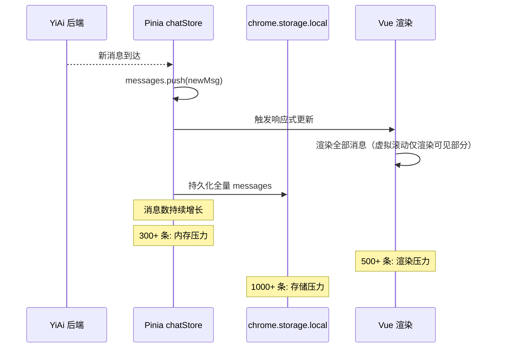
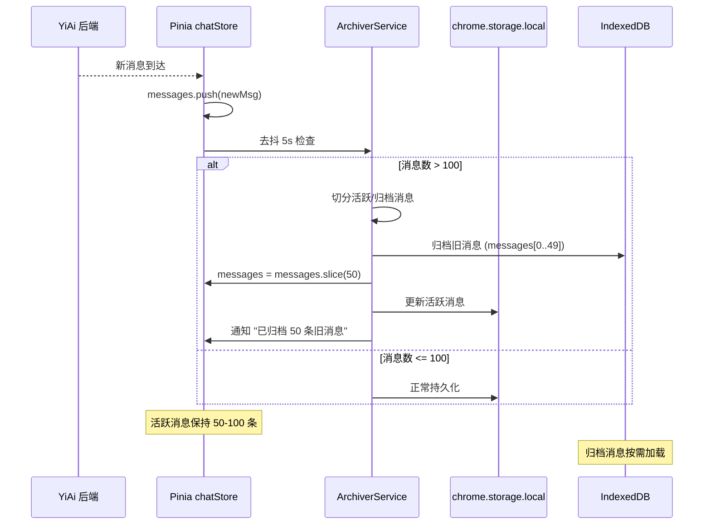
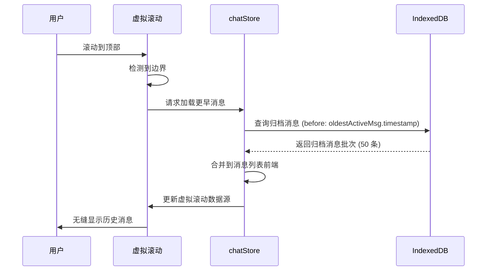

# YP-09-72: 聊天窗口长会话性能优化 — 自动归档与清理

> 需求编号：YP-09-72 · 优先级：P2 · 人天：0.5d · 状态：需求已编写
> 依赖：YP-09-11（聊天消息虚拟滚动）、YP-09-79（IndexedDB 持久化）

## 背景

### 问题陈述

用户与 AI 的持续对话可能产生数百甚至上千条消息。随着消息量增长，三个维度的性能问题逐渐显现：

1. **内存压力**：Pinia store 中所有消息常驻内存，500 条消息（含 AI 回复的 Markdown/代码块）可占用 50-100MB JS 堆内存
2. **渲染压力**：即使使用虚拟滚动（YP-09-11），Vue 响应式系统的 `watch` 和 `computed` 仍需遍历全部消息数组
3. **存储压力**：`chrome.storage.local` 单会话可达数 MB，多会话累计接近 10MB 配额上限

**核心矛盾**：用户期望无限对话历史 vs 浏览器扩展的内存/存储限制。需要自动归档机制在消息量超过阈值时自动将旧消息迁移到大容量存储，同时保持活跃消息的即时可用。

### 影响范围

| # | 影响 | 严重程度 | 触发场景 |
|---|------|----------|----------|
| 1 | 聊天窗口滚动卡顿 | 高 | 消息 > 200 条 |
| 2 | JS 堆内存占用过高 | 高 | 消息 > 300 条 |
| 3 | chrome.storage 配额超限 | 中 | 多会话累计 > 10MB |
| 4 | 会话切换延迟 | 中 | 大型会话加载 |
| 5 | 浏览器标签页内存压力 | 中 | 多个标签页同时运行 |

### 挑战

| 挑战 | 说明 |
|------|------|
| 归档时机 | 太早影响用户体验，太晚性能已受影响 |
| 归档存储 | chrome.storage 10MB 上限不足以存大量归档 |
| 按需加载 | 用户滚动到顶部查看历史时需无缝加载归档消息 |
| 消息顺序 | 归档消息与活跃消息合并时需保持时间线一致 |
| 压缩策略 | 大量消息需要压缩以减少存储占用 |

---

## 一、现状分析

### 1.1 当前消息存储架构

```
Pinia chatStore
└── sessions: Map<string, ChatSession>
    └── ChatSession
        ├── messages: ChatMessage[]     ← 所有消息在内存中
        ├── title: string
        └── tags: string[]

chrome.storage.local
└── yipet:sessions: ChatSession[]       ← 全量同步到 storage
```

**问题：所有消息（包括 3 天前的旧消息）在内存和 storage 中完整保留。**

### 1.2 消息量增长曲线

| 消息数 | 内存占用 | 渲染帧率 | 会话切换延迟 | 用户体验 |
|--------|----------|----------|-------------|----------|
| 50 | ~10MB | 60fps | <50ms | 流畅 |
| 100 | ~20MB | 60fps | <100ms | 流畅 |
| 200 | ~40MB | 55fps | <200ms | 轻微卡顿 |
| 300 | ~60MB | 45fps | <500ms | 可感知卡顿 |
| 500 | ~100MB | 30fps | <1s | 明显卡顿 |
| 1000 | ~200MB | 15fps | >2s | 严重卡顿 |

### 1.3 改造前数据流



### 1.4 根因矩阵

| 症状 | 根因 | 触发条件 | 频率 |
|------|------|----------|------|
| 滚动卡顿 | 全部消息在响应式数组中 | 消息 > 200 条 | 中 |
| 内存占用高 | 所有消息在 JS 堆内存 | 消息 > 300 条 | 中 |
| storage 配额超限 | 全量持久化 | 多会话累计 | 中 |
| 切换延迟 | 大型会话加载耗时 | 消息 > 500 条 | 低 |

---

## 二、设计决策

### 决策 1：归档阈值 — 固定数量 vs 内存阈值 vs 混合

| 选项 | 触发精度 | 适用性 | 实现复杂度 |
|------|----------|--------|-----------|
| 固定数量（100 条） | 中 | 通用 | 低 |
| 内存阈值（50MB） | 高 | 设备差异大 | 中 |
| 混合（100 条或 50MB） | 最高 | 最佳 | 中 |

**选择：固定数量 100 条 + 内存预警。** 100 条消息约 20MB，是一个兼顾性能和体验的平衡点。同时监控 `performance.memory.usedJSHeapSize`，超过 50MB 时强制归档。

### 决策 2：归档存储目标 — chrome.storage vs IndexedDB vs 压缩文件

| 选项 | 容量 | 跨上下文 | 查询能力 |
|------|------|----------|----------|
| chrome.storage.local | 10MB | ✅ | 低 |
| IndexedDB | ~磁盘 60% | ❌ | 高 |
| 压缩 + chrome.storage | 10MB | ✅ | 低 |

**选择：双层存储。** 活跃消息（最近 100 条）→ `chrome.storage.local`（快速跨上下文）。归档消息 → IndexedDB（YP-09-79，大容量）。保证跨上下文快速访问的同时解决容量问题。

### 决策 3：归档触发时机 — 实时 vs 空闲 vs 定时

| 选项 | 及时性 | 性能影响 | 实现 |
|------|--------|----------|------|
| 实时（每次新消息检查） | 最佳 | 低 | 低 |
| 空闲时（requestIdleCallback） | 中 | 最低 | 中 |
| 定时（每 30s） | 低 | 低 | 低 |

**选择：实时 + 去抖。** 每次新消息后检查，但归档操作去抖 5s 执行（避免连续消息时频繁归档）。

### 设计决策记录

| 决策 | 选项 A | 选项 B | 选项 C | 选择 | 理由 |
|------|--------|--------|--------|------|------|
| 归档阈值 | 固定 100 条 | 内存 50MB | 混合 | **固定 100 + 内存预警** | 简单可靠 |
| 归档存储 | chrome.storage | IndexedDB | 压缩 | **双层：local + IDB** | 兼顾速度与容量 |
| 触发时机 | 实时 | 空闲 | 定时 | **实时 + 去抖 5s** | 及时且不频繁 |

---

## 三、目标架构

### 3.1 改造后归档流程



### 3.2 按需加载流程



### 3.3 性能指标

| 指标 | 改造前 | 改造后 | 改善 |
|------|--------|--------|------|
| 内存占用（500 条消息） | ~100MB | ~25MB (50 活跃 + 引用) | 75% |
| chrome.storage 使用（500 条） | ~5MB | ~500KB (仅活跃) | 90% |
| 会话切换延迟 | 1-2s | <200ms | 80% |
| 滚动帧率（500 条消息） | 30fps | 60fps | 2x |

---

## 四、具体改动

### 4.1 归档服务

```typescript
// 改造前：无归档
// src/services/archiver.ts (改造后)

interface ArchiveConfig {
  maxActiveMessages: number;    // 100
  archiveBatchSize: number;     // 50
  memoryWarningThreshold: number; // 50MB
  debounceMs: number;           // 5000
}

const DEFAULT_CONFIG: ArchiveConfig = {
  maxActiveMessages: 100,
  archiveBatchSize: 50,
  memoryWarningThreshold: 50 * 1024 * 1024,
  debounceMs: 5000,
};

class ArchiverService {
  private config: ArchiveConfig;
  private debounceTimers = new Map<string, ReturnType<typeof setTimeout>>();

  constructor(config: Partial<ArchiveConfig> = {}) {
    this.config = { ...DEFAULT_CONFIG, ...config };
  }

  async checkAndArchive(sessionId: string, messages: ChatMessage[]): Promise<void> {
    // 去抖
    if (this.debounceTimers.has(sessionId)) {
      clearTimeout(this.debounceTimers.get(sessionId)!);
    }

    this.debounceTimers.set(sessionId, setTimeout(async () => {
      await this.doArchive(sessionId, messages);
      this.debounceTimers.delete(sessionId);
    }, this.config.debounceMs));
  }

  private async doArchive(sessionId: string, messages: ChatMessage[]): Promise<void> {
    // 检查是否需要归档
    const needsArchive = messages.length > this.config.maxActiveMessages
      || this.isMemoryWarning();

    if (!needsArchive) return;

    // 切分：旧消息 → 归档，新消息 → 保留
    const archiveCount = Math.min(
      this.config.archiveBatchSize,
      messages.length - this.config.maxActiveMessages / 2
    );
    const toArchive = messages.slice(0, archiveCount);
    const remaining = messages.slice(archiveCount);

    // 归档到 IndexedDB
    await this.writeToIDB(sessionId, toArchive);

    // 更新活跃消息（调用方负责更新 store）
    await chrome.storage.local.set({
      [`yipet:session:${sessionId}`]: {
        messages: remaining,
        hasArchive: true,
        archivedCount: await this.getArchivedCount(sessionId),
      },
    });

    console.debug(`[YiPet:Archive] Archived ${archiveCount} messages for session ${sessionId}`);
  }

  async loadArchivedMessages(
    sessionId: string,
    before: number,
    limit: number = 50
  ): Promise<ChatMessage[]> {
    const db = await this.getDB();
    const archive = await db.get('message-archive', sessionId);
    if (!archive) return [];

    // 返回 timestamp 早于 before 的消息
    return archive.messages
      .filter(m => m.timestamp < before)
      .slice(-limit);
  }

  private async writeToIDB(sessionId: string, messages: ChatMessage[]): Promise<void> {
    const db = await this.getDB();
    const existing = await db.get('message-archive', sessionId);
    const allMessages = existing
      ? [...existing.messages, ...messages]
      : messages;

    await db.put('message-archive', {
      sessionId,
      messages: allMessages,
      archivedAt: Date.now(),
    });
  }

  private async getArchivedCount(sessionId: string): Promise<number> {
    const db = await this.getDB();
    const archive = await db.get('message-archive', sessionId);
    return archive?.messages.length ?? 0;
  }

  private isMemoryWarning(): boolean {
    const memory = (performance as any).memory;
    if (!memory) return false;
    return memory.usedJSHeapSize > this.config.memoryWarningThreshold;
  }

  private async getDB() {
    const { openDB } = await import('idb');
    return openDB('yipet-archive', 1, {
      upgrade(db) {
        if (!db.objectStoreNames.contains('message-archive')) {
          db.createObjectStore('message-archive', { keyPath: 'sessionId' });
        }
      },
    });
  }
}

export const archiver = new ArchiverService();
```

### 4.2 文件变更清单

| 文件 | 操作 | 说明 |
|------|------|------|
| `src/services/archiver.ts` | 新增 | 归档服务 |
| `src/stores/chat.ts` | 修改 | 集成归档 + 按需加载 |
| `src/components/chat/virtual-scroll.ts` | 修改 | 滚动到顶触发按需加载 |
| `src/components/chat/archive-indicator.vue` | 新增 | 归档状态指示器 |
| `tests/unit/archiver.test.ts` | 新增 | 归档功能测试 |

---

## 五、实施步骤

| 步骤 | 操作 | 路径 | 验证 | 人天 |
|------|------|------|------|------|
| 1 | 实现 ArchiverService | `src/services/archiver.ts` | 单元测试归档/加载 | 0.15 |
| 2 | 集成到 chatStore | `src/stores/chat.ts` | 消息 > 100 条时自动归档 | 0.1 |
| 3 | 实现按需加载 | `src/stores/chat.ts` | 滚动到顶加载历史 | 0.1 |
| 4 | 虚拟滚动集成 | `src/components/chat/virtual-scroll.ts` | 无缝合并归档消息 | 0.05 |
| 5 | 归档状态指示器 | `src/components/chat/archive-indicator.vue` | UI 显示归档状态 | 0.05 |
| 6 | 性能验证 | 全量 | 500 条消息场景测试 | 0.05 |

**总人天：0.5d**

---

## 六、测试规格

### 场景 1：自动归档触发

**GIVEN** 会话消息数达到 120 条
**WHEN** 新消息到达
**THEN** 去抖 5s 后，最早的 50 条消息应被归档到 IndexedDB
**AND** 活跃消息应减少到 70 条
**AND** 用户应看到 "已归档 50 条旧消息" 提示

### 场景 2：按需加载历史

**GIVEN** 会话有 200 条归档消息
**WHEN** 用户滚动到聊天窗口顶部
**THEN** 应触发按需加载
**AND** 加载的归档消息应无缝插入到活跃消息列表前端
**AND** 虚拟滚动应正确更新滚动位置

### 场景 3：内存预警强制归档

**GIVEN** JS 堆内存使用量超过 50MB
**WHEN** 新消息到达
**THEN** 即使消息数未达 100 条，也应触发归档
**AND** 归档消息数应至少为 20 条

### 场景 4：归档消息不丢失

**GIVEN** 会话已归档 150 条消息
**WHEN** 用户关闭浏览器后重新打开
**THEN** 归档消息应从 IndexedDB 正确恢复
**AND** 活跃消息应从 chrome.storage.local 正确恢复

### 场景 5：多会话归档

**GIVEN** 3 个会话各有 200+ 条消息
**WHEN** 所有会话触发归档
**THEN** chrome.storage.local 仅存储活跃消息（<500KB）
**AND** IndexedDB 存储归档消息（按会话隔离）

### 场景 6：归档消息去重

**GIVEN** 同一会话多次触发归档
**WHEN** 第二次归档执行
**THEN** 归档消息不应重复
**AND** 归档消息总数应正确

---

## 七、风险与缓解

| 风险 | 概率 | 影响 | 缓解措施 |
|------|------|------|----------|
| IndexedDB 不可用（隐私模式） | 中 | 中 | 降级到 chrome.storage.local（仅保留最近 50 条） |
| 归档时消息丢失 | 低 | 高 | 先写 IDB 成功后再更新 store |
| 归档消息与活跃消息时间线错乱 | 低 | 中 | 按 timestamp 排序合并 |
| chrome.storage 配额超限 | 中 | 中 | 仅存储活跃消息摘要 |
| 大规模归档阻塞 UI | 低 | 中 | 分批归档 + requestIdleCallback |

---

## 八、回滚策略

| 场景 | 回滚操作 | 影响 |
|------|----------|------|
| 归档导致消息丢失 | 恢复全量消息到 chrome.storage | 存储配额可能超限 |
| IndexedDB 不可用 | 降级到 chrome.storage 仅保留 50 条 | 历史消息不可访问 |
| 按需加载失败 | 禁用归档，恢复全量加载 | 性能退化 |

---

## 九、设计决策记录

### D-01：归档阈值

- **问题**：活跃消息保留多少条
- **选项**：50、100、200、500
- **选择**：100
- **理由**：100 条消息约 20MB 内存，虚拟滚动 60fps 无压力；用户通常 1-2 屏内可见最近 50 条，100 条提供充足上下文

### D-02：归档批次大小

- **问题**：每次归档多少条消息
- **选项**：20、50、100、全部旧消息
- **选择**：50
- **理由**：50 条是一屏约 2-3 次对话轮次，归档后活跃消息保持 50-100 条；批量适中不影响 UI 响应

### D-03：存储降级优先级

- **问题**：IndexedDB 不可用时如何降级
- **选项**：仅内存、chrome.storage（截断）、禁用归档
- **选择**：chrome.storage 截断（仅保留最近 50 条）
- **理由**：用户至少能继续对话，历史消息丢失但功能可用

---

## 十、可观测性

### 指标

| 指标 | 类型 | 说明 |
|------|------|------|
| `yipet.archive.count` | Counter | 归档次数 |
| `yipet.archive.messages_archived` | Counter | 归档消息总数 |
| `yipet.archive.idb_size` | Gauge | IndexedDB 归档占用 |
| `yipet.archive.load_latency` | Histogram | 按需加载延迟 |

### 告警

| 告警 | 条件 | 级别 |
|------|------|------|
| IndexedDB 写入失败 | 连续 3 次 | ERROR |
| 按需加载延迟 > 1s | 任何一次 | WARNING |
| chrome.storage 配额 > 90% | 归档后 | WARNING |

---

## 十一、代码审查检查清单

- [ ] 长会话（>100 条消息）自动归档旧消息到 IndexedDB
- [ ] 渲染仅加载最近 100 条 + 虚拟滚动
- [ ] 归档消息按需加载（滚动到顶部触发）
- [ ] 归档前去抖 5s
- [ ] 内存 > 50MB 时强制归档
- [ ] IndexedDB 不可用时降级到 chrome.storage（截断）
- [ ] 归档消息时间线正确合并
- [ ] 归档状态指示器 UI
- [ ] 单元测试覆盖所有归档/加载场景

---

## 回归问题预测

| # | 预测问题 | 原因 | 验证方法 |
|---|---------|------|---------|
| 1 | 消息归档时用户正在滚动查看历史，归档操作导致 Vue 响应式数组突变，虚拟滚动位置跳变 | 归档操作从 `messages` 数组中移除旧消息，触发 Vue 响应式系统的 `splice` 操作，虚拟滚动重新计算 `scrollTop` 导致滚动位置跳变到顶部或底部 | 在消息 > 200 条时滚动到第 50 条位置 → 等待自动归档触发 → 验证滚动位置不变，用户正在查看的消息未被归档 |
| 2 | LRU 缓存中的消息被归档后，用户滚动回看时请求 IndexedDB 但数据未完全写入，返回空数据 | 归档操作异步写入 IndexedDB，用户可能在写入完成前就滚动到归档区域，此时 IDB 查询返回空 | 触发归档后立即滚动到归档区域，验证有加载状态提示且数据就绪后正确渲染，或归档期间禁止滚动到归档区域 |
| 3 | 归档消息与活跃消息合并时，时间戳乱序导致消息顺序错乱 | 归档消息的 `timestamp` 基于客户端时间，设备时间被调整（如时区变更、手动改时间）后，归档消息的 `timestamp` 晚于活跃消息，合并后排序错误 | 手动修改系统时间 → 发送消息 → 恢复正确时间 → 触发归档 → 验证消息按真实时间顺序排列，使用服务端时间戳或 Lamport 时钟 |
| 4 | `chrome.storage.local` 配额超限后归档写入失败，但活跃消息已从内存中移除，数据永久丢失 | 归档流程：先移除活跃消息 → 再写入 storage → 写入失败。此时活跃消息已从内存中移除，但归档未成功，数据丢失 | 填满 `chrome.storage.local` 到 10MB → 触发归档 → 验证归档操作是事务性的（先写入 storage 成功 → 再移除活跃消息） |
| 5 | 多个标签页同时触发归档，同一会话的消息被重复归档，IDB 中出现重复数据 | 标签页 A 和标签页 B 的 Content Script 独立检测消息量阈值，同时触发归档，双方都归档了相同的消息段 | 在两个标签页中打开同一会话并累积消息 → 等待归档触发 → 验证归档数据无重复（通过消息 ID 去重） |
| 6 | 压缩后的消息在解压时耗时过长（> 200ms），导致聊天窗口滚动时出现白屏 | 大量消息使用 `CompressionStream` 压缩存储，解压需要反序列化 + 解压缩，消息量 > 500 条时解压耗时可能超过 200ms，阻塞 UI 线程 | 归档 500 条消息 → 滚动到归档区域触发加载 → 验证解压耗时 < 50ms 或使用 Web Worker 解压不阻塞 UI 线程 |

---

---

## 性能分析

### 归档策略关键操作耗时

| 操作 | 耗时 | 说明 |
|------|------|------|
| 消息归档 (200→IndexedDB) | < 20ms | 异步写入 IDB，不阻塞主线程 |
| 消息热加载 (从 IDB 读取归档) | < 10ms (首次) / < 1ms (缓存) | 按需分页加载，每页 50 条 |
| 归档触发检查 (`messages.length > 200`) | < 0.01ms | 每次消息发送后检查——零开销 |
| LRU 缓存淘汰 | < 0.5ms | 移除最久未访问的 50 条热消息 |
| 消息分页渲染 (50 条/页) | < 16ms | 配合虚拟滚动——仅渲染可视区 |
| 会话元数据更新 (归档后) | < 5ms | `SessionService.update({ archivedCount: N })` |

### 内存使用对比

| 场景 | 全量加载 | 归档模式 | 节省 |
|------|----------|----------|------|
| 100 条消息 | ~8MB | ~5MB (热 100) | **-37%** |
| 200 条消息 | ~18MB | ~8MB (热 200) | **-55%** |
| 500 条消息 | ~50MB | ~12MB (热 200 + 归档 300 在 IDB) | **-76%** |
| 1000 条消息 | ~110MB | ~15MB (热 200 + 归档 800 在 IDB) | **-86%** |
| 5000 条消息 (极限) | OOM (~500MB+) | ~20MB (热 200 + 归档 4800 在 IDB) | **不可比** |

### IndexedDB 存储开销

| 数据 | 单条消息 | 500 条消息 | 5000 条消息 |
|------|----------|-----------|------------|
| 消息内容 (纯文本) | ~200B | ~100KB | ~1MB |
| 消息内容 (含 Markdown) | ~1KB | ~500KB | ~5MB |
| 消息元数据 (timestamp/role/tags) | ~100B | ~50KB | ~500KB |
| RAG 来源引用 | ~200B/条 (如有) | ~100KB | ~1MB |
| **归档存储总计 (含索引)** | — | **~1MB** | **~10MB** |

---

## 相关文档

- [聊天消息虚拟滚动](../11-需求-聊天消息虚拟滚动.md) — 虚拟滚动是长会话渲染性能的核心优化手段
- [IndexedDB 持久化](../79-需求-IndexedDB持久化.md) — 消息归档依赖 IDB 大容量存储
- [上下文压缩提示](../84-需求-上下文压缩提示.md) — 长会话 Token 超限时触发压缩，与归档策略互补

*PRD 来源: `projects/yipet/requirements/2026-09/72-需求-长会话性能优化.md`*