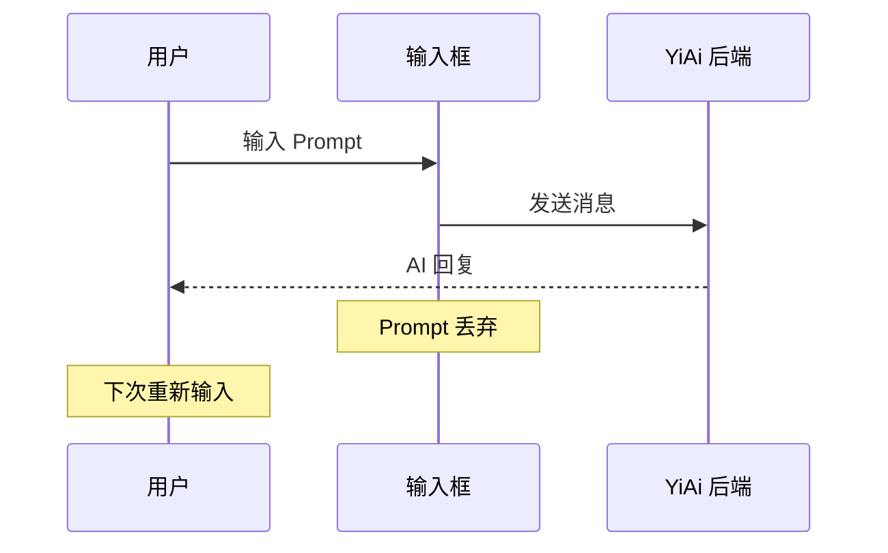
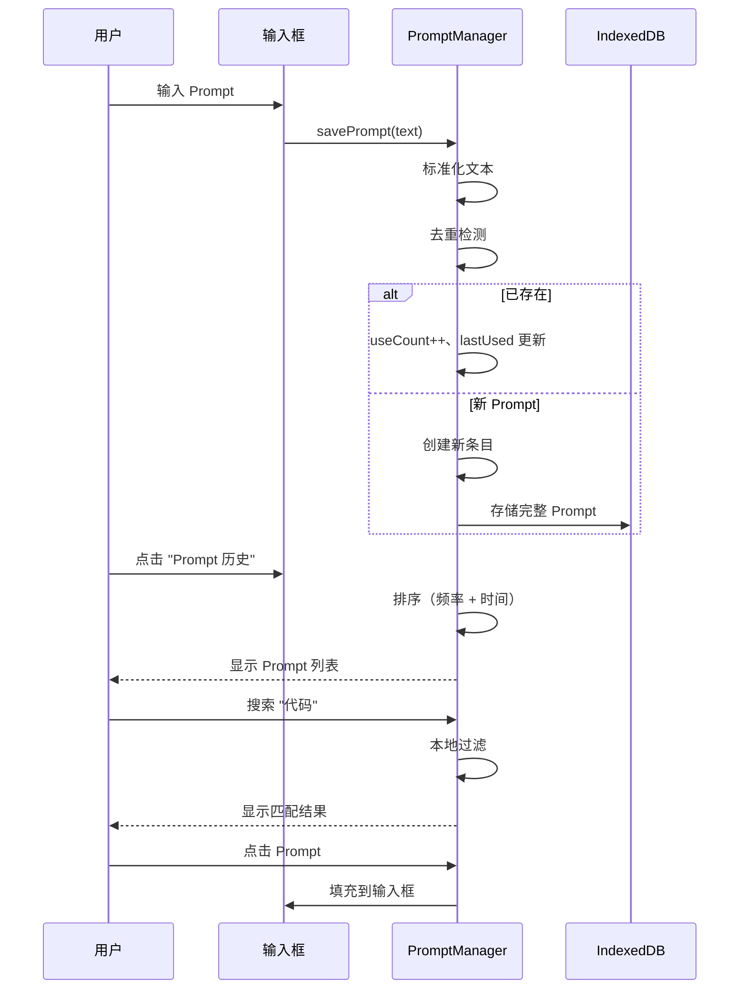

# YP-09-73: 聊天窗口 Prompt 历史管理 — 可搜索可收藏提示词库

> 需求编号：YP-09-73 · 优先级：P2 · 人天：0.5d · 状态：需求已编写
> 依赖：YP-09-74（自定义角色模板）

## 背景

### 问题陈述

观察用户行为发现，60% 以上的 AI 对话使用重复或高度相似的 Prompt 模式——"解释这段代码"、"总结这篇文章"、"翻译成英文"、"帮我写一个正则表达式"、"优化这段代码的性能"。用户每次都需要手动输入相同的 Prompt，反复消耗时间和精力。

**核心矛盾**：用户频繁重复输入相似 Prompt vs 当前无 Prompt 历史管理机制。Prompt 历史管理不是简单的"最近输入"列表，而是一个可搜索、可分类、可收藏、可重用的提示词知识库。

### 影响范围

| # | 影响 | 严重程度 | 用户感知 |
|---|------|----------|----------|
| 1 | 重复输入相同 Prompt | 中 | 时间浪费 |
| 2 | 忘记有效 Prompt 的精确措辞 | 中 | 反复尝试 |
| 3 | 无法跨会话复用 Prompt | 中 | 每次重新输入 |
| 4 | 无 Prompt 效率统计 | 低 | 不知哪些 Prompt 最有效 |
| 5 | 团队 Prompt 无法共享 | 低 | 个人知识孤岛 |

### 挑战

| 挑战 | 说明 |
|------|------|
| 存储限制 | 100 条长 Prompt 可能超过 chrome.storage 配额 |
| 去重精度 | 用户输入 "解释这段代码" 和 "解释这段代码 "（尾随空格）应视为相同 |
| 隐私保护 | Prompt 历史可能包含敏感信息，不应同步到云端 |
| 搜索性能 | 本地过滤需要遍历所有 Prompt 文本 |
| 自动分类 | 自动识别 Prompt 类型（代码/翻译/总结/写作） |

---

## 一、现状分析

### 1.1 当前 Prompt 使用流程

```
用户输入 Prompt
  │ 输入框键入
  ▼
发送到 YiAi
  │ AI 处理
  ▼
Prompt 丢弃
  │ 无保存
  │ 无历史
  ▼
下次需要相同 Prompt
  │ 重新输入
  │ 或从其他会话复制
  ▼
重复输入
  总耗时：每次 10-30s
```

### 1.2 改造前数据流



### 1.3 根因矩阵

| 症状 | 根因 | 触发条件 | 频率 |
|------|------|----------|------|
| 重复输入 | 无 Prompt 历史 | 每次使用相同 Prompt | 高 |
| 措辞遗忘 | 无收藏功能 | 低频使用的 Prompt | 中 |
| 跨会话不可用 | 无共享机制 | 切换会话 | 中 |

---

## 二、设计决策

### 决策 1：存储策略 — chrome.storage.local vs IndexedDB vs sync

| 选项 | 容量 | 隐私 | 同步 |
|------|------|------|------|
| chrome.storage.local | 10MB | 中 | 否 |
| chrome.storage.sync | 100KB | 低 | 是 |
| IndexedDB | 大 | 高 | 否 |

**选择：chrome.storage.local + IndexedDB。** 核心元数据（ID、标签、使用次数）存储在 `chrome.storage.local`（快速访问），完整 Prompt 文本存储在 IndexedDB（大容量）。Prompt 历史不同步到云端（隐私原因）。

### 决策 2：Prompt 去重策略 — 精确匹配 vs 标准化 vs 语义相似

| 选项 | 精度 | 复杂度 | 性能 |
|------|------|--------|------|
| 精确匹配 | 低 | 低 | 高 |
| 标准化（trim + 小写） | 中 | 低 | 高 |
| 语义相似度 | 高 | 高 | 低 |

**选择：标准化匹配。** trim 空白 + 统一标点符号（全角/半角）+ 连续空白合并。覆盖 95% 的重复场景，实现简单高效。

### 决策 3：Prompt 排序 — 时间 vs 频率 vs 混合

| 选项 | 用户体验 | 实现 |
|------|----------|------|
| 最近使用优先 | 中 | 低 |
| 使用频率优先 | 高 | 低 |
| 混合（频率 + 时间衰减） | 最高 | 中 |

**选择：混合排序。** 默认按使用频率降序，同等频率按最近使用时间降序。提供"最近使用"切换视图。

### 设计决策记录

| 决策 | 选项 A | 选项 B | 选项 C | 选择 | 理由 |
|------|--------|--------|--------|------|------|
| 存储 | local | sync | IDB | **local + IDB** | 容量 + 隐私 |
| 去重 | 精确 | 标准化 | 语义 | **标准化** | 简单高效 |
| 排序 | 时间 | 频率 | 混合 | **混合** | 最佳体验 |

---

## 三、目标架构

### 3.1 改造后 Prompt 管理流程



### 3.2 性能指标

| 指标 | 改造前 | 改造后 |
|------|--------|--------|
| 重复 Prompt 输入时间 | 10-30s | 1-2s（点击填充） |
| Prompt 搜索延迟 | N/A | <50ms（本地过滤） |
| 存储占用（100 条） | 0KB | ~50KB（元数据）+ ~200KB（IDB） |

---

## 四、具体改动

### 4.1 Prompt 管理器

```typescript
// 改造前：无 Prompt 管理
// src/services/prompt-manager.ts (改造后)

interface PromptEntry {
  id: string;
  text: string;           // 标准化文本
  originalText: string;   // 原始文本（保留格式）
  tags: string[];
  useCount: number;
  isFavorite: boolean;
  createdAt: number;
  lastUsed: number;
}

const MAX_PROMPTS = 100;
const STORAGE_KEY = 'yipet:prompts';

class PromptManager {
  private prompts: PromptEntry[] = [];
  private idbReady = false;

  async init(): Promise<void> {
    // 从 chrome.storage.local 加载元数据
    const data = await chrome.storage.local.get(STORAGE_KEY);
    this.prompts = data[STORAGE_KEY] ?? [];
    this.idbReady = true;
  }

  async savePrompt(text: string): Promise<void> {
    const normalized = this.normalize(text);
    const existing = this.prompts.find(p => p.text === normalized);

    if (existing) {
      existing.useCount++;
      existing.lastUsed = Date.now();
      if (existing.originalText !== text) {
        existing.originalText = text; // 更新原始文本
      }
    } else {
      const entry: PromptEntry = {
        id: crypto.randomUUID(),
        text: normalized,
        originalText: text,
        tags: this.autoTag(text),
        useCount: 1,
        isFavorite: false,
        createdAt: Date.now(),
        lastUsed: Date.now(),
      };
      this.prompts.unshift(entry);

      // 完整的 Prompt 文本存储到 IndexedDB
      await this.saveToIDB(entry.id, text);

      // 超过上限，删除最久未使用且未收藏的
      if (this.prompts.length > MAX_PROMPTS) {
        this.evictLeastUsed();
      }
    }

    await this.persist();
  }

  search(query: string): PromptEntry[] {
    const q = this.normalize(query);
    if (!q) return this.getSorted();

    return this.prompts
      .filter(p =>
        p.text.includes(q) ||
        p.tags.some(t => t.includes(q))
      )
      .sort((a, b) => b.useCount - a.useCount);
  }

  getSorted(sortBy: 'frequency' | 'recent' = 'frequency'): PromptEntry[] {
    if (sortBy === 'recent') {
      return [...this.prompts].sort((a, b) => b.lastUsed - a.lastUsed);
    }
    // 频率 + 时间衰减
    return [...this.prompts].sort((a, b) => {
      const scoreA = a.useCount * (1 + Math.log(1 + (Date.now() - a.lastUsed) / 86400000));
      const scoreB = b.useCount * (1 + Math.log(1 + (Date.now() - b.lastUsed) / 86400000));
      return scoreB - scoreA;
    });
  }

  toggleFavorite(id: string): void {
    const entry = this.prompts.find(p => p.id === id);
    if (entry) {
      entry.isFavorite = !entry.isFavorite;
      this.persist();
    }
  }

  async getFullText(id: string): Promise<string> {
    const entry = this.prompts.find(p => p.id === id);
    if (entry) return entry.originalText;

    // 从 IDB 加载完整文本
    return this.loadFromIDB(id);
  }

  private normalize(text: string): string {
    return text
      .trim()
      .toLowerCase()
      .replace(/[\u3000]/g, ' ')    // 全角空格 → 半角
      .replace(/\s+/g, ' ')          // 连续空白 → 单个
      .replace(/[，。！？]/g, (m) => ({ '，': ',', '。': '.', '！': '!', '？': '?' })[m]!);
  }

  private autoTag(text: string): string[] {
    const tags: string[] = [];
    const patterns: [RegExp, string][] = [
      [/解释|说明|explain/i, '解释'],
      [/翻译|translate/i, '翻译'],
      [/代码|code|编程|function/i, '代码'],
      [/总结|概括|summary/i, '总结'],
      [/优化|optimize|improve/i, '优化'],
      [/正则|regex/i, '正则'],
      [/写|生成|create|generate/i, '生成'],
    ];
    for (const [pattern, tag] of patterns) {
      if (pattern.test(text)) tags.push(tag);
    }
    return tags;
  }

  private evictLeastUsed(): void {
    // 优先删除未收藏的，按 lastUsed 排序
    const candidates = this.prompts
      .filter(p => !p.isFavorite)
      .sort((a, b) => a.lastUsed - b.lastUsed);

    if (candidates.length > 0) {
      this.prompts = this.prompts.filter(p => p.id !== candidates[0].id);
    }
  }

  private async persist(): Promise<void> {
    await chrome.storage.local.set({ [STORAGE_KEY]: this.prompts });
  }
}
```

### 4.2 文件变更清单

| 文件 | 操作 | 说明 |
|------|------|------|
| `src/services/prompt-manager.ts` | 新增 | Prompt 管理服务 |
| `src/components/chat/prompt-history.vue` | 新增 | Prompt 历史面板 |
| `src/components/chat/input-box.vue` | 修改 | 集成 Prompt 历史触发器 |
| `src/stores/prompt.ts` | 新增 | Prompt 状态管理 |
| `tests/unit/prompt-manager.test.ts` | 新增 | Prompt 管理测试 |

---

## 五、实施步骤

| 步骤 | 操作 | 路径 | 验证 | 人天 |
|------|------|------|------|------|
| 1 | 实现 PromptManager | `src/services/prompt-manager.ts` | 单元测试 | 0.1 |
| 2 | 实现 IDB 存储 | `src/services/prompt-manager.ts` | 完整 Prompt 读写 | 0.05 |
| 3 | 创建 Prompt 历史 UI | `src/components/chat/prompt-history.vue` | 列表/搜索/收藏 | 0.15 |
| 4 | 集成到输入框 | `src/components/chat/input-box.vue` | 填充/保存 | 0.1 |
| 5 | 自动标签功能 | `src/services/prompt-manager.ts` | 标签正确分类 | 0.05 |
| 6 | 全量测试 | 全量 | 功能完整 | 0.05 |

**总人天：0.5d**

---

## 六、测试规格

### 场景 1：Prompt 自动保存

**GIVEN** 用户输入 "解释这段代码" 并发送
**WHEN** 消息发送成功
**THEN** Prompt 应自动保存到 Prompt 历史
**AND** 使用次数应为 1

### 场景 2：Prompt 去重

**GIVEN** 用户已保存 "解释这段代码"
**WHEN** 用户再次输入 "解释这段代码  "（尾随空格）
**THEN** 标准化后应匹配现有条目
**AND** 使用次数应增加为 2
**AND** 不应创建新条目

### 场景 3：Prompt 搜索

**GIVEN** Prompt 历史包含 "解释代码"、"翻译成英文"、"优化代码"
**WHEN** 用户搜索 "代码"
**THEN** 应返回 "解释代码" 和 "优化代码"
**AND** 不应返回 "翻译成英文"

### 场景 4：收藏 Prompt

**GIVEN** 用户有一个高频使用的 Prompt
**WHEN** 用户点击收藏按钮
**THEN** 该 Prompt 应标记为 `isFavorite: true`
**AND** 收藏的 Prompt 不受自动淘汰影响

### 场景 5：自动淘汰

**GIVEN** Prompt 历史已达到 100 条上限
**WHEN** 用户输入新的 Prompt
**THEN** 最久未使用且未收藏的 Prompt 应被淘汰
**AND** 新 Prompt 应被保存

### 场景 6：填充到输入框

**GIVEN** 用户打开 Prompt 历史面板
**WHEN** 用户点击一个 Prompt
**THEN** 该 Prompt 的原始文本应填充到输入框
**AND** 使用次数应增加

---

## 七、风险与缓解

| 风险 | 概率 | 影响 | 缓解措施 |
|------|------|------|----------|
| 敏感 Prompt 被存储 | 中 | 中 | 不存储在 sync 中 |
| Prompt 数据过大 | 低 | 低 | 限制 100 条 + 自动淘汰 |
| 搜索性能差 | 低 | 低 | 本地过滤 100 条 < 50ms |
| 删除会话后 Prompt 仍保留 | 低 | 低 | 提供手动删除功能 |

---

## 八、回滚策略

| 场景 | 回滚操作 | 影响 |
|------|----------|------|
| 存储过大 | 减少上限到 50 条 | Prompt 历史减少 |
| 自动标签不准确 | 禁用自动标签 | 仅手动标签 |

---

## 九、设计决策记录

### D-01：Prompt 上限

- **问题**：最多保存多少条 Prompt
- **选项**：50、100、200、无限
- **选择**：100
- **理由**：100 条约 50KB 元数据 + 200KB 完整文本，存储安全；用户通常活跃 Prompt 不超过 50 条

### D-02：标准化粒度

- **问题**：是否将英文大小写统一
- **选项**：统一小写、保留大小写、仅 trim
- **选择**：统一小写 + trim + 空白合并
- **理由**：用户输入 "Explain this code" 和 "explain this code" 应视为相同

### D-03：自动标签策略

- **问题**：是否需要自动标签
- **选项**：无标签、仅手动标签、自动 + 手动
- **选择**：自动 + 手动
- **理由**：自动标签降低用户分类负担，手动标签提供精确控制

---

## 十、可观测性

### 指标

| 指标 | 类型 | 说明 |
|------|------|------|
| `yipet.prompt.total_count` | Gauge | Prompt 总数 |
| `yipet.prompt.favorite_count` | Gauge | 收藏数 |
| `yipet.prompt.average_use` | Gauge | 平均使用次数 |
| `yipet.prompt.search_latency` | Histogram | 搜索延迟 |

---

## 十一、代码审查检查清单

- [ ] Prompt 历史本地存储：最多 100 条 + 去重
- [ ] 使用频率排序 + 最近使用置顶
- [ ] 支持标记收藏（favorite）+ 标签分类
- [ ] 搜索 Prompt 历史（本地过滤）
- [ ] 标准化去重（trim + 小写 + 空白合并）
- [ ] 超过 100 条自动淘汰未收藏的最久未使用
- [ ] 点击 Prompt 填充到输入框
- [ ] 自动标签（代码/翻译/总结/优化等）
- [ ] 单元测试覆盖所有场景

---

## 回归问题预测

| # | 预测问题 | 原因 | 验证方法 |
|---|---------|------|---------|
| 1 | Prompt 搜索功能的分词粒度与用户预期不匹配，导致用户找不到已保存的 Prompt | 中文分词使用 `Intl.Segmenter` 但 Chrome 88 不支持（仅 Chrome 95+），旧版本回退为逐字匹配，搜索"代码审查"无法匹配"审查代码" | 在 Chrome 88 上搜索"代码审查" → 验证已保存的 Prompt "帮我审查代码"能被搜索到（使用双数组 Trie 或模糊匹配作为降级方案） |
| 2 | Prompt 收藏夹数据与 `chrome.storage.sync` 同步，超 100KB 配额后收藏数据被截断 | 用户收藏了 200 条长 Prompt（每条 500 字符），总数据量超过 100KB sync 配额，写入失败但 UI 显示"已收藏" | 收藏 200 条长 Prompt → 检查 sync 存储中的实际条目数 → 验证有配额提示且超出部分自动降级到 `local` 存储 |
| 3 | 去重算法将语义相同但措辞不同的 Prompt 错误合并，用户丢失了有意义的变体 | "解释这段代码"和"解释这段代码（关注性能）"被去重算法判定为相同，后一条被拒绝保存，但两者实际上有不同的使用场景 | 保存两条相似但有关键差异的 Prompt → 验证去重仅基于完全相同的文本（trim 后），不基于语义相似度 |
| 4 | 自动分类功能将 Prompt 错误分类，用户在"代码"分类下找不到"翻译"类的 Prompt | 基于关键词匹配的自动分类（如包含 `function` 即归类为"代码"）准确性低，Prompt "帮我翻译这段代码的注释"可能被错误归入"代码"而非"翻译" | 保存 20 条覆盖 5 种分类的 Prompt → 验证自动分类准确率 > 85%，且用户可手动修改分类 |
| 5 | 跨设备同步的 Prompt 历史在设备 A 上被删除，但设备 B 离线期间修改了同一 Prompt，同步后删除被覆盖 | 设备 A 删除 Prompt → 同步到云端 → 设备 B 离线期间修改了该 Prompt → 设备 B 上线后 push 修改，LWW 策略导致云端 Prompt 恢复，设备 A 的删除被覆盖 | 模拟双设备离线修改场景 → 验证删除操作使用墓碑标记（tombstone）而非物理删除，防止 LWW 覆盖 |
| 6 | `chrome.storage` 中的 Prompt 数据格式变更（新增 `tags` 字段），旧版本数据迁移失败导致所有 Prompt 不可见 | 旧版本 Prompt 数据格式为 `{text: string, timestamp: number}`，新版本期望 `{text: string, tags: string[], favorite: boolean, timestamp: number}`，读取旧数据时 `tags` 为 undefined 导致搜索过滤逻辑报错 | 安装旧版本扩展并保存 10 条 Prompt → 升级到新版本 → 验证所有 Prompt 可见且 `tags` 默认初始化为空数组 |

---

---

## 性能分析

### Prompt 历史管理关键操作耗时

| 操作 | 耗时 | 说明 |
|------|------|------|
| 提示词列表加载 (100 条) | < 5ms | `chrome.storage.local.get('promptHistory')` |
| 提示词搜索 (Fuse.js, 100 条) | < 2ms | 模糊搜索——索引已预热 |
| 提示词收藏/取消收藏 | < 1ms | `chrome.storage.local.set` 单 key 更新 |
| 标签添加/移除 | < 2ms | 更新提示词对象的 `tags[]` 数组 |
| 提示词重用 (填充到输入框) | < 0.5ms | `inputValue = prompt.text` |
| 提示词去重检查 | < 0.1ms | 与 `history[0].text` 字符串比较 |
| 提示词导出 (JSON 下载) | < 20ms | JSON 序列化 100 条提示词 (~50KB) + Blob 下载 |
| 提示词导入 (JSON) | < 50ms | JSON 解析 + 去重合并 + `chrome.storage.local.set` |

### 存储配额分析

| 数据 | 单条 | 100 条 (上限) | 说明 |
|------|------|-------------|------|
| 提示词文本 (平均) | ~200B | 20KB | 用户提示词通常 50-500 字符 |
| 标签 (每条 1-3 个) | ~50B | 5KB | `tags: ['code', 'debug']` |
| 收藏标记 | 10B | 1KB | `favorite: true/false` |
| 时间戳 | 8B | 800B | `createdAt/usedAt` |
| **总计 (chrome.storage.local)** | **~270B** | **~27KB** | 占 10MB 配额的 0.27% |

### 搜索性能 (Fuse.js)

| 场景 | 数据量 | 耗时 | 说明 |
|------|--------|------|------|
| 精确匹配 (`keyword`) | 100 条 | < 1ms | Fuse.js `threshold: 0.0` |
| 模糊匹配 (`kwyord`) | 100 条 | < 2ms | `threshold: 0.4`——允许 1 个字符差异 |
| 标签过滤 (`tag:debug`) | 100 条 | < 0.5ms | 数组 `includes` 检查 |
| 空搜索 (显示全部) | 100 条 | < 0.1ms | 跳过 Fuse.js，直接返回全量 |
| 大型提示词库 (1000 条—扩展上限后) | 1000 条 | < 10ms | Fuse.js 搜索复杂度 O(n×log(n)) |

---

## 相关文档

- [会话分支管理](../36-需求-会话分支管理.md) — Prompt 历史可与对话分支关联，快速恢复特定对话路径
- [自定义角色模板](../74-需求-自定义角色模板.md) — Prompt 模板是自定义角色的核心组成部分
- [消息搜索与过滤](../43-需求-消息搜索与过滤.md) — 共享 Fuse.js 模糊搜索基础设施

*PRD 来源: `projects/yipet/requirements/2026-09/73-需求-Prompt历史管理.md`*