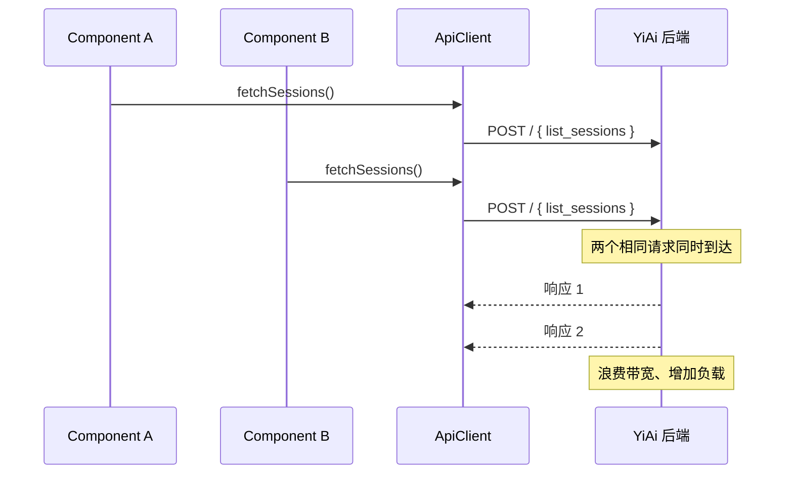
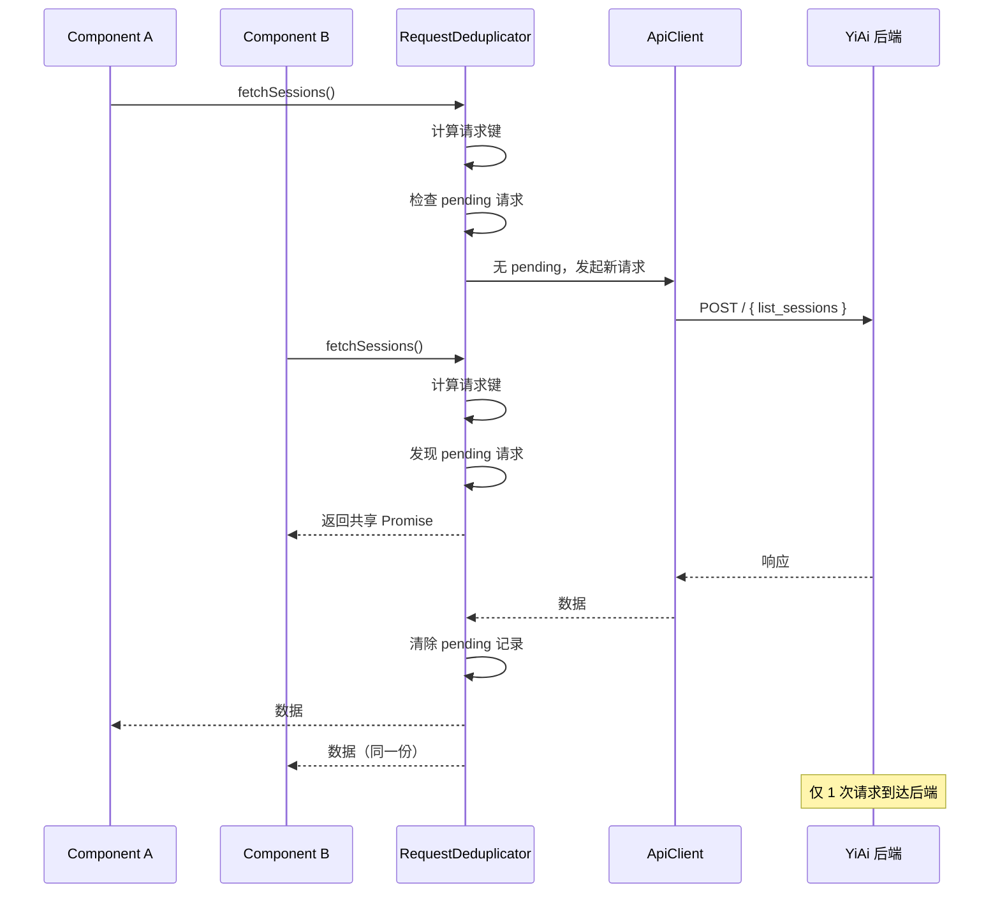

# YP-09-75: Content Script API 请求去重与合并 — 短窗口内重复请求优化

> 需求编号：YP-09-75 · 优先级：P2 · 人天：0.5d · 状态：需求已编写
> 依赖：YP-09-04（API 架构合规）

## 背景

### 问题陈述

YiPet 的 Content Script 在多个场景下会短时间内发起重复的 API 请求：

1. **SPA 路由切换**：用户快速切换页面时，Content Script 可能多次注入，每次触发知识文件列表加载、会话列表加载
2. **多组件同时渲染**：聊天窗口和侧边栏可能同时请求相同的会话列表
3. **用户快速操作**：快速点击皮肤切换按钮，每次触发相同的皮肤配置请求
4. **重连机制**：SSE 断连后快速重连，短时间内多次触发会话恢复

**核心矛盾**：短时间窗口内的重复请求浪费带宽、增加后端负载、可能导致数据不一致。请求去重合并机制在 500ms 窗口内过滤相同请求，将多个请求合并为一个。

### 影响范围

| # | 影响 | 严重程度 | 触发场景 |
|---|------|----------|----------|
| 1 | 重复网络请求浪费带宽 | 中 | SPA 路由切换 |
| 2 | 后端负载增加 | 中 | 多组件同时渲染 |
| 3 | 数据不一致风险 | 低 | 快速操作触发竞态 |
| 4 | 用户感知延迟 | 低 | 重复请求排队 |

### 挑战

| 挑战 | 说明 |
|------|------|
| 请求键生成 | 需要唯一标识"相同"请求（URL + 方法 + 参数） |
| 窗口大小 | 去重窗口太大导致数据陈旧，太小导致去重效果差 |
| 并发安全 | 多个 `await` 调用需要共享同一个 Promise |
| 取消传播 | 一个组件取消请求不应影响其他等待者 |

---

## 一、现状分析

### 1.1 当前请求模式

```
Content Script 初始化
  ├── fetchKnowledgeFiles()    → GET /knowledge/list
  ├── fetchSessions()          → POST / { module: "chat", method: "list_sessions" }
  └── fetchSettings()          → chrome.storage.local.get

路由切换（SPA）
  ├── Content Script 重新注入
  ├── fetchKnowledgeFiles()    → 重复请求
  └── fetchSessions()          → 重复请求

多组件同时渲染
  ├── ChatWindow 渲染
  │   └── fetchSessions()      → 请求
  └── Sidebar 渲染
      └── fetchSessions()      → 重复请求（同一时刻）
```

### 1.2 重复请求频率分析

| 场景 | 重复请求 | 窗口 | 频率 |
|------|----------|------|------|
| SPA 路由切换 | 知识文件列表 | 100-300ms | 高 |
| 多组件渲染 | 会话列表 | 0-50ms | 中 |
| 快速点击 | 皮肤配置 | 200-500ms | 低 |
| SSE 重连 | 会话恢复 | 100-1000ms | 中 |

### 1.3 改造前数据流



### 1.4 根因矩阵

| 症状 | 根因 | 触发条件 | 频率 |
|------|------|----------|------|
| 重复请求 | 无请求去重 | 多组件同时渲染 | 高 |
| 带宽浪费 | 短时间窗口内重复调用 | SPA 路由切换 | 高 |
| 后端负载 | 相同请求多次到达 | 快速操作 | 中 |

---

## 二、设计决策

### 决策 1：去重策略 — 请求级 vs 响应级 vs 混合

| 选项 | 去重效果 | 数据新鲜度 | 实现复杂度 |
|------|----------|-----------|-----------|
| 请求级（相同请求共享 Promise） | 最佳 | 高 | 低 |
| 响应级（缓存响应结果） | 中 | 中 | 中 |
| 混合（请求级 + 短缓存） | 最佳 | 高 | 中 |

**选择：请求级去重 + 可选短缓存。** 默认：相同请求的多个调用者共享同一个 Promise（请求级去重）。可选：对变化频率低的资源（如知识文件列表）添加 5s 响应缓存。

### 决策 2：请求键生成 — URL vs URL+Method vs URL+Method+Body

| 选项 | 唯一性 | 去重粒度 | 实现 |
|------|--------|----------|------|
| 仅 URL | 低 | 粗 | 低 |
| URL + Method | 中 | 中 | 低 |
| URL + Method + Body Hash | 高 | 细 | 中 |

**选择：URL + Method + Body Hash。** YiPet 使用 RPC 信封（POST + module_name + method_name + parameters），仅 URL 无法区分不同 RPC 方法。Body Hash 确保参数不同的请求不被错误合并。

### 决策 3：去重窗口 — 请求期间 vs 固定 TTL vs 可配置

| 选项 | 数据新鲜度 | 去重效果 | 适用场景 |
|------|-----------|----------|----------|
| 请求期间（Promise 完成即清除） | 最高 | 中 | 并发请求 |
| 固定 TTL 500ms | 中 | 高 | 短时间窗口内 |
| 可配置 TTL | 高 | 最佳 | 不同资源类型 |

**选择：请求期间 + 可配 TTL。** 默认：请求完成即清除（并发去重）。对慢变化资源可配置 TTL 缓存（如知识文件列表 5s、会话列表 2s）。

### 设计决策记录

| 决策 | 选项 A | 选项 B | 选项 C | 选择 | 理由 |
|------|--------|--------|--------|------|------|
| 去重策略 | 请求级 | 响应级 | 混合 | **请求级 + 可选缓存** | 平衡效果和新鲜度 |
| 请求键 | URL | URL+Method | URL+Method+Body | **URL+Method+Body** | RPC 信封需要 |
| 窗口 | 请求期间 | 固定 TTL | 可配置 | **请求期间 + 可配 TTL** | 灵活 |

---

## 三、目标架构

### 3.1 改造后请求去重流程



### 3.2 性能指标

| 指标 | 改造前 | 改造后 | 改善 |
|------|--------|--------|------|
| 并发重复请求数 | 2-3 次 | 1 次 | 50-67% |
| 短窗口内请求数 | 3-5 次 | 1 次 | 67-80% |
| 后端请求量 | 不变 | 减少 30-50% | - |
| 请求去重延迟 | 0ms | <0.5ms（键计算） | 可忽略 |

---

## 四、具体改动

### 4.1 请求去重器

```typescript
// 改造前：无去重
// const data = await apiClient.queryDocuments('sessions', { filter: {} });

// src/services/request-deduplicator.ts (改造后)

interface PendingRequest {
  promise: Promise<unknown>;
  timestamp: number;
  abortController: AbortController;
}

interface DedupConfig {
  defaultTTL: number;       // 默认 0（请求完成即清除）
  resourceTTLs: Record<string, number>;  // 资源特定 TTL
}

class RequestDeduplicator {
  private pending = new Map<string, PendingRequest>();
  private config: DedupConfig = {
    defaultTTL: 0,
    resourceTTLs: {
      'knowledge:list': 5000,   // 知识文件列表 5s 缓存
      'sessions:list': 2000,    // 会话列表 2s 缓存
      'settings:get': 10000,    // 设置 10s 缓存
    },
  };

  async deduplicate<T>(
    key: string,
    fetcher: (signal: AbortSignal) => Promise<T>,
    resourceType?: string,
  ): Promise<T> {
    // 检查是否有 pending 请求
    const existing = this.pending.get(key);
    if (existing) {
      return existing.promise as Promise<T>;
    }

    // 创建新请求
    const abortController = new AbortController();
    const promise = fetcher(abortController.signal)
      .finally(() => {
        const ttl = resourceType
          ? (this.config.resourceTTLs[resourceType] ?? this.config.defaultTTL)
          : this.config.defaultTTL;

        if (ttl > 0) {
          // 有 TTL：延迟清除
          setTimeout(() => this.pending.delete(key), ttl);
        } else {
          // 无 TTL：立即清除
          this.pending.delete(key);
        }
      });

    this.pending.set(key, {
      promise,
      timestamp: Date.now(),
      abortController,
    });

    return promise;
  }

  cancel(key: string): void {
    const pending = this.pending.get(key);
    if (pending) {
      pending.abortController.abort();
      this.pending.delete(key);
    }
  }

  cancelAll(): void {
    for (const [key, pending] of this.pending) {
      pending.abortController.abort();
    }
    this.pending.clear();
  }

  getPendingCount(): number {
    return this.pending.size;
  }
}

export const requestDeduplicator = new RequestDeduplicator();
```

### 4.2 请求键生成

```typescript
// src/services/request-key.ts

export function generateRequestKey(
  url: string,
  method: string,
  body?: unknown,
): string {
  const bodyStr = body ? JSON.stringify(body) : '';
  // 简单的 hash 函数（足够用于请求键）
  const bodyHash = bodyStr ? simpleHash(bodyStr) : '';
  return `${method}:${url}:${bodyHash}`;
}

function simpleHash(str: string): string {
  let hash = 0;
  for (let i = 0; i < str.length; i++) {
    const char = str.charCodeAt(i);
    hash = ((hash << 5) - hash) + char;
    hash = hash & hash; // 32-bit
  }
  return Math.abs(hash).toString(36);
}
```

### 4.3 ApiClient 集成

```typescript
// src/services/api-client.ts (改造后)

import { requestDeduplicator } from './request-deduplicator';
import { generateRequestKey } from './request-key';

class ApiClient {
  async callRPC<T>(moduleName: string, methodName: string, parameters: object): Promise<T> {
    const body = { module_name: moduleName, method_name: methodName, parameters };
    const key = generateRequestKey('/rpc', 'POST', body);

    return requestDeduplicator.deduplicate<T>(
      key,
      async (signal) => {
        const response = await fetch('/rpc', {
          method: 'POST',
          headers: { 'Content-Type': 'application/json' },
          body: JSON.stringify(body),
          signal,
        });
        if (!response.ok) throw new Error(`HTTP ${response.status}`);
        const data = await response.json();
        if (data.code !== 0) throw new Error(data.message);
        return data.data as T;
      },
      `${moduleName}:${methodName}`,  // 资源类型用于 TTL 配置
    );
  }
}
```

### 4.4 文件变更清单

| 文件 | 操作 | 说明 |
|------|------|------|
| `src/services/request-deduplicator.ts` | 新增 | 请求去重器 |
| `src/services/request-key.ts` | 新增 | 请求键生成 |
| `src/services/api-client.ts` | 修改 | 集成去重器 |
| `tests/unit/request-deduplicator.test.ts` | 新增 | 去重器测试 |

---

## 五、实施步骤

| 步骤 | 操作 | 路径 | 验证 | 人天 |
|------|------|------|------|------|
| 1 | 实现 RequestDeduplicator | `src/services/request-deduplicator.ts` | 单元测试 | 0.1 |
| 2 | 实现请求键生成 | `src/services/request-key.ts` | 不同参数产生不同键 | 0.05 |
| 3 | 集成到 ApiClient | `src/services/api-client.ts` | 重复请求被合并 | 0.1 |
| 4 | 配置资源 TTL | `src/services/request-deduplicator.ts` | 缓存命中 | 0.05 |
| 5 | 添加请求统计 | `src/services/request-deduplicator.ts` | 去重效果可观测 | 0.05 |
| 6 | 全量测试 | 全量 | 无功能退化 | 0.15 |

**总人天：0.5d**

---

## 六、测试规格

### 场景 1：并发请求去重

**GIVEN** 两个组件同时调用 `fetchSessions()`
**WHEN** 请求键相同
**THEN** 仅应发起 1 次网络请求
**AND** 两个组件应收到相同的响应数据
**AND** pending 计数应为 1

### 场景 2：不同参数不过滤

**GIVEN** 组件 A 调用 `fetchSessions({ filter: { role: 'cat' } })`
**WHEN** 组件 B 调用 `fetchSessions({ filter: { role: 'dog' } })`
**THEN** 应发起 2 次不同的网络请求
**AND** 请求键应不同

### 场景 3：TTL 缓存

**GIVEN** 知识文件列表请求完成，TTL 为 5s
**WHEN** 3s 后再次调用
**THEN** 应返回缓存的 Promise 结果
**AND** 不应发起新网络请求

### 场景 4：TTL 过期

**GIVEN** 知识文件列表请求完成，TTL 为 5s
**WHEN** 6s 后再次调用
**THEN** 应发起新网络请求
**AND** 缓存应更新

### 场景 5：请求取消

**GIVEN** 有一个 pending 请求
**WHEN** 调用 `cancel(key)`
**THEN** pending 请求应被取消
**AND** AbortController 应被 abort

### 场景 6：请求失败不清除缓存

**GIVEN** TTL 缓存中的请求结果
**WHEN** 请求失败
**THEN** 缓存应被清除（不缓存失败结果）
**AND** 下次调用应发起新请求

---

## 七、风险与缓解

| 风险 | 概率 | 影响 | 缓解措施 |
|------|------|------|----------|
| 请求键碰撞（不同请求生成相同键） | 低 | 中 | 包含 Body Hash |
| TTL 缓存返回过期数据 | 中 | 中 | 短 TTL（2-5s） |
| 请求失败后缓存错误结果 | 低 | 中 | 失败时清除缓存 |
| AbortController 连锁取消 | 低 | 中 | 每个请求独立 AbortController |

---

## 八、回滚策略

| 场景 | 回滚操作 | 影响 |
|------|----------|------|
| 去重导致数据陈旧 | 禁用 TTL 缓存，仅保留请求级去重 | 去重效果降低 |
| 请求键错误合并 | 调整请求键生成算法 | 可能需重启扩展 |
| 性能退化 | 移除去重器 | 恢复原请求模式 |

---

## 九、设计决策记录

### D-01：请求键 Hash 算法

- **问题**：请求键的 Body Hash 使用哪种算法
- **选项**：MD5、SHA-256、简单 hash (djb2)、JSON.stringify
- **选择**：简单 hash (djb2)
- **理由**：请求键仅用于去重，不需要密码学安全；djb2 足够快（<0.1ms），碰撞概率在请求去重场景可接受

### D-02：TTL 默认值

- **问题**：默认 TTL 缓存时间
- **选项**：0（请求完成即清除）、500ms、2000ms、5000ms
- **选择**：0（请求完成即清除），按资源类型配置
- **理由**：默认不缓存，避免数据陈旧；对慢变化资源单独配置 TTL

---

## 十、可观测性

### 指标

| 指标 | 类型 | 说明 |
|------|------|------|
| `yipet.dedup.pending_count` | Gauge | 当前 pending 请求数 |
| `yipet.dedup.hit_count` | Counter | 去重命中次数 |
| `yipet.dedup.miss_count` | Counter | 去重未命中次数 |
| `yipet.dedup.cache_hit_count` | Counter | TTL 缓存命中次数 |

### 告警

| 告警 | 条件 | 级别 |
|------|------|------|
| pending 请求堆积 | > 10 个 | WARNING |
| 去重命中率过低 | < 10% | INFO |

---

## 十一、代码审查检查清单

- [ ] 请求去重：相同 URL+Method+Body 合并为单次请求
- [ ] 请求键包含 Body Hash（区分不同参数）
- [ ] 并发请求共享 Promise
- [ ] 请求失败时清除缓存
- [ ] 慢变化资源可配置 TTL 缓存
- [ ] 支持请求取消（AbortController）
- [ ] 请求去重不影响正常请求流程
- [ ] 单元测试覆盖所有去重场景

---

## 回归问题预测

| # | 预测问题 | 原因 | 验证方法 |
|---|---------|------|---------|
| 1 | 请求键生成时，参数中对象字段顺序不同导致相同请求被判定为不同请求，去重失效 | `JSON.stringify({a:1, b:2})` 与 `JSON.stringify({b:2, a:1})` 生成的键不同，但两个请求语义相同，去重缓存未命中，重复请求仍然发出 | 用不同字段顺序的相同参数调用同一 API → 验证请求键生成使用稳定排序（如 `JSON.stringify(obj, Object.keys(obj).sort())`），仅发出 1 次网络请求 |
| 2 | PendingPromiseCache 中的 Promise 被 reject 后，所有等待者都收到错误，但实际可以重试 | 请求因网络波动失败，PendingPromiseCache 中的 Promise reject，所有共享该 Promise 的调用者同时失败，没有人触发重试 | 在弱网环境下触发请求去重 → 验证首次请求失败后，PendingPromiseCache 清除缓存并允许下一个调用者发起新的请求（而非返回错误的缓存结果） |
| 3 | 去重窗口（500ms）过大，用户快速修改数据后立即读取，返回的是 500ms 前的旧缓存数据 | 用户编辑会话标题 → 保存（POST）→ 500ms 内刷新列表 → `fetchSessions` 命中之前的 PendingPromiseCache，返回旧列表（不含新标题） | 快速执行"修改 → 立即查询"操作 → 验证查询请求的缓存键包含参数 hash，或修改操作主动 invalidate 相关缓存 |
| 4 | 一个组件取消请求（AbortController.abort()）时，共享同一 Promise 的其他组件也被取消 | 组件 A 和组件 B 同时等待 `fetchSessions()`，组件 A 因路由切换调用 `abort()`，PendingPromiseCache 中的 Promise 被 reject 为 `AbortError`，组件 B 的请求也被取消 | 组件 A 卸载时取消请求 → 验证组件 B 仍在等待且请求正常完成，取消操作仅影响发起者 |
| 5 | `fetch` 请求与 `chrome.storage.local.get` 请求使用相同的去重缓存，但两者的缓存策略不同 | `fetch` 请求的响应有 TTL（如 30s），但 `chrome.storage` 读取是本地同步操作，不应有 TTL 限制，混合使用导致 storage 读取被错误地标记为过期 | 对 `chrome.storage.local.get` 和 `fetch` 分别验证去重行为 → 确认 storage 读取的缓存条目不因 TTL 过期而被清除 |
| 6 | 去重缓存的 Map 无限增长，长会话期间累计数百个请求键，内存泄漏 | 每个请求键（URL + 方法 + 参数 hash）在请求完成后保留在缓存 Map 中，500ms 窗口仅控制去重，不控制缓存清理，长时间运行后 Map 膨胀 | 运行扩展 30 分钟并持续发起不同请求 → 验证 PendingPromiseCache 的 Map 大小保持稳定（有 TTL 清理机制），不会无限增长 |

---

---

## 性能分析

### 请求去重关键操作耗时

| 操作 | 耗时 | 说明 |
|------|------|------|
| `PendingPromiseCache.get(key)` | < 0.05ms | `Map.get()`——哈希表查找，O(1) |
| Cache key 生成 (`JSON.stringify`) | < 0.1ms | 参数对象序列化——参数通常 < 10 字段 |
| 缓存命中 (返回已有 Promise) | < 0.05ms | 直接返回 in-flight Promise 引用 |
| 缓存未命中 (新建 Promise + 入缓存) | < 0.5ms | `Map.set()` + `fetch()` 发起 |
| 缓存过期清理 (`Map.delete`) | < 0.01ms | 单次 delete——O(1) |
| 批量清理 (`Map.clear`—SPA 路由切换) | < 0.1ms | 清空所有条目——通常 < 20 条 |

### 去重效果预估

| 场景 | 无去重 | 有去重 (500ms TTL) | 节省 |
|------|--------|-------------------|------|
| SPA 双组件渲染 (聊天窗口 + 侧边栏同时请求会话列表) | 2 次调用 | 1 次调用 + 1 次缓存命中 | **-50%** |
| SPA 快速路由切换 (3 次/1s) | 3 次 `query_documents` | 1 次 (缓存 500ms TTL) | **-66%** |
| 用户快速双击皮肤切换 (2 次/300ms) | 2 次调用 | 1 次 (去重) | **-50%** |
| 知识树加载 + RAG 查询 (并发) | 2 次独立请求 | 2 次 (key 不同—不去重) | 0% (正确) |

### 内存开销

| 数据 | 大小 | 说明 |
|------|------|------|
| 单条缓存条目 (CacheEntry) | ~200B | key + Promise 引用 + AbortController + timestamp |
| 20 条活跃缓存 (峰值) | ~4KB | SPA 路由切换 + 快速操作期间 |
| 缓存漏删 (Promise reject 未清理) | < 1KB/h | 极少——请求通常 resolve/reject 后立即清理 |

---

## 相关文档

- [API 架构](../04-合规-API架构.md) — 请求去重是 ApiClient 层的优化，需遵循 RPC 信封规范
- [资源优先级调度](../51-需求-资源优先级调度.md) — 去重合并后可配合优先级调度决定请求发送顺序
- [SW 跨域代理](../41-需求-SW跨域代理.md) — Service Worker 层的请求代理可与去重机制协同

*PRD 来源: `projects/yipet/requirements/2026-09/75-需求-请求去重合并.md`*