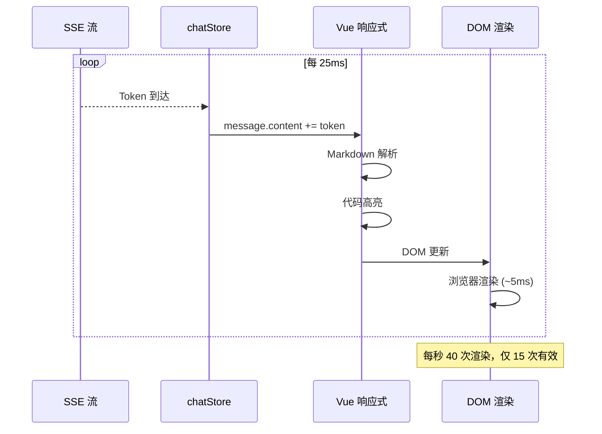
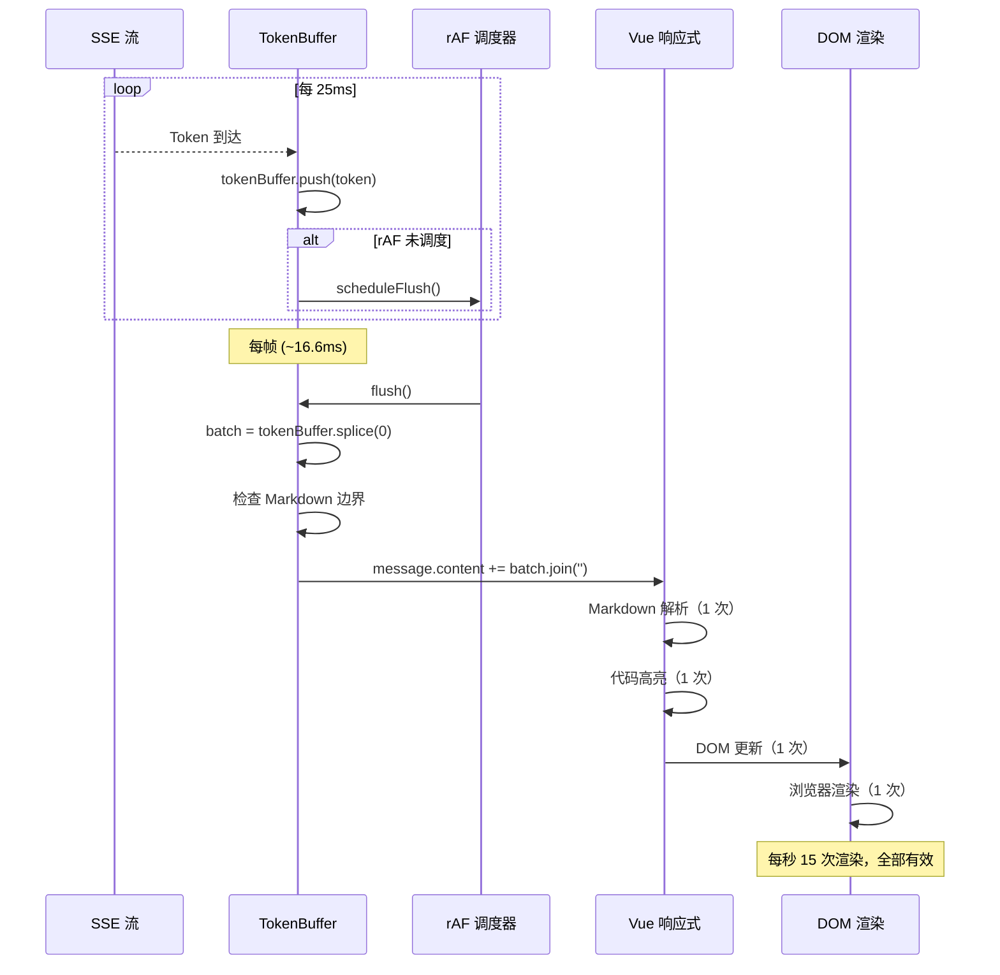

# YP-09-76: 聊天窗口流式响应动画优化 — Token 级渲染调度

> 需求编号：YP-09-76 · 优先级：P2 · 人天：0.5d · 状态：需求已编写
> 依赖：YP-09-03（SSE 流式通信稳定性）、YP-09-11（虚拟滚动）

## 背景

### 问题陈述

YiPet 聊天窗口的 SSE 流式响应中，YiAi 后端以约 40 Token/秒的速度推送文本片段。当前实现中，每个 Token 到达时直接触发 Vue 响应式更新——`message.content += newToken` ——导致每次 Token 都触发一次完整的 Vue 组件重新渲染（包括 Markdown 解析、代码高亮、虚拟滚动重新计算）。

**核心矛盾**：Token 到达速度（~40/秒）远超显示器刷新率（~60Hz，即 16.6ms/帧）。每个 Token 触发一次渲染意味着每帧可能渲染 2-3 次，但用户只能看到最后一次——中间渲染完全是浪费。这导致渲染抖动、CPU 占用高、虚拟滚动计算频繁。

### 影响范围

| # | 影响 | 严重程度 | 用户感知 |
|---|------|----------|----------|
| 1 | 渲染抖动 | 高 | 文字出现不流畅，逐字跳动 |
| 2 | CPU 占用过高 | 中 | 风扇加速、电池消耗 |
| 3 | 虚拟滚动频繁重算 | 中 | 长消息滚动卡顿 |
| 4 | 页面隐藏时资源浪费 | 低 | 后台标签页仍消耗 CPU |
| 5 | Markdown 解析频繁 | 中 | 代码块渲染闪烁 |

### 挑战

| 挑战 | 说明 |
|------|------|
| 批量渲染粒度 | 每帧渲染多少 Token？太少→效果差，太多→视觉延迟 |
| 页面隐藏处理 | `requestAnimationFrame` 在隐藏标签页时暂停 |
| 流式结束处理 | 流结束时需强制 flush 剩余 Token |
| Markdown 完整性 | 批量渲染可能打断 Markdown 语法结构（如代码块边界） |

---

## 一、现状分析

### 1.1 当前流式渲染流程

```
SSE Token 到达 (每 25ms)
  │ message.content += token
  ▼
Vue 响应式更新
  │ 触发 watch
  │ 触发 computed
  ├── Markdown 解析 (marked)
  │   └── 引入 highlight.js 代码高亮
  ├── 虚拟滚动重新计算
  │   └── 更新滚动位置
  └── DOM 更新
      └── 浏览器渲染

  频率：~40 次/秒
  每帧渲染：2-3 次
  有效渲染：1 次（用户只看到最后一帧）
  浪费：50-67%
```

### 1.2 渲染浪费分析

| Token 序号 | 到达时间 | 帧时间 | 触发渲染 | 用户可见 | 浪费 |
|-----------|----------|--------|----------|----------|------|
| 1 | 0ms | 0ms | 是 | 否 | 是 |
| 2 | 25ms | 0ms | 是 | 否 | 是 |
| 3 | 50ms | 50ms (16.6ms) | 是 | 是 | 否 |
| 4 | 75ms | 50ms | 是 | 否 | 是 |
| 5 | 100ms | 100ms (33.2ms) | 是 | 是 | 否 |

**结论：每 2-3 次渲染中只有 1 次对用户可见，浪费率 50-67%。**

### 1.3 改造前数据流



### 1.4 根因矩阵

| 症状 | 根因 | 触发条件 | 频率 |
|------|------|----------|------|
| 渲染抖动 | 每 Token 触发 Vue 更新 | 每次 SSE Token | 高 |
| CPU 占用高 | 频繁 Markdown 解析 | 代码块消息 | 中 |
| 虚拟滚动卡顿 | 频繁重算 | 长消息 | 中 |
| 后台浪费 | 隐藏标签页仍渲染 | 用户切换标签页 | 中 |

---

## 二、设计决策

### 决策 1：批量渲染策略 — rAF vs microtask vs setTimeout

| 选项 | 帧同步 | 渲染次数 | 复杂度 |
|------|--------|----------|--------|
| `requestAnimationFrame` | 是 | 1 次/帧 | 低 |
| `queueMicrotask` | 否 | 1 次/事件循环 | 低 |
| `setTimeout(fn, 16)` | 近似 | 近似 1 次/帧 | 低 |

**选择：`requestAnimationFrame`。** rAF 与浏览器渲染帧同步，保证每帧最多渲染一次。token 到达后收集到 buffer，rAF 回调时一次性 flush。

### 决策 2：页面隐藏处理 — 继续收集 vs 暂停 vs 强制 flush

| 选项 | 资源消耗 | 恢复体验 | 实现 |
|------|----------|----------|------|
| 继续收集（不渲染） | 低 | 最佳 | 中 |
| 暂停（不收集也不渲染） | 最低 | 差 | 低 |
| 强制 flush | 中 | 中 | 低 |

**选择：继续收集 + 恢复时一次性 flush。** 页面隐藏时 rAF 暂停，token 继续收集到 buffer。页面恢复时通过 `visibilitychange` 事件触发一次性 flush，用户看到完整内容。

### 决策 3：Markdown 智能边界 — 按 Token vs 按行 vs 按块

| 选项 | 渲染流畅度 | Markdown 完整性 | 实现 |
|------|-----------|----------------|------|
| 按 Token（任意位置） | 最佳 | 可能打断语法 | 低 |
| 按行（`\n` 边界） | 良好 | 行级完整 | 中 |
| 按块（段落/代码块边界） | 中 | 最佳 | 高 |

**选择：混合策略。** 普通文本按 Token 批量渲染（每帧）。检测到代码块开始（\`\`\`）时，等待代码块关闭（\`\`\`）后再渲染整块，避免代码高亮闪烁。

### 设计决策记录

| 决策 | 选项 A | 选项 B | 选项 C | 选择 | 理由 |
|------|--------|--------|--------|------|------|
| 批量策略 | rAF | microtask | setTimeout | **rAF** | 帧同步 |
| 隐藏处理 | 继续收集 | 暂停 | 强制 flush | **继续收集 + flush** | 最佳体验 |
| Markdown 边界 | Token | 行 | 块 | **混合** | 流畅 + 完整 |

---

## 三、目标架构

### 3.1 改造后流式渲染流程



### 3.2 性能指标

| 指标 | 改造前 | 改造后 | 改善 |
|------|--------|--------|------|
| 每秒渲染次数 | ~40 | ~15 | 62.5% |
| 每秒 Markdown 解析 | ~40 | ~15 | 62.5% |
| 渲染浪费率 | 50-67% | 0% | 100% |
| CPU 占用（流式渲染时） | 高 | 中 | ~40% |
| 每帧渲染耗时 | 1-3ms | <1ms | 2-3x |

---

## 四、具体改动

### 4.1 Token 批量渲染器

```typescript
// 改造前：每 Token 直接更新
// message.content += token;

// src/services/stream-renderer.ts (改造后)

interface StreamRendererConfig {
  maxTokensPerFrame: number;   // 每帧最多渲染 Token 数
  flushOnVisibilityChange: boolean;  // 页面恢复时强制 flush
  markdownAware: boolean;      // Markdown 边界感知
}

class StreamRenderer {
  private tokenBuffer: string[] = [];
  private rafScheduled = false;
  private config: StreamRendererConfig = {
    maxTokensPerFrame: 50,
    flushOnVisibilityChange: true,
    markdownAware: true,
  };
  private onFlush: ((batch: string) => void) | null = null;
  private codeBlockOpen = false;

  constructor(config?: Partial<StreamRendererConfig>) {
    this.config = { ...this.config, ...config };
    this.setupVisibilityListener();
  }

  registerFlushHandler(handler: (batch: string) => void): void {
    this.onFlush = handler;
  }

  feedToken(token: string): void {
    this.tokenBuffer.push(token);

    if (!this.rafScheduled) {
      this.rafScheduled = true;
      requestAnimationFrame(() => this.flush());
    }
  }

  private flush(): void {
    this.rafScheduled = false;

    if (this.tokenBuffer.length === 0) return;

    let batch: string[];

    if (this.config.markdownAware && this.tokenBuffer.length > 0) {
      batch = this.extractMarkdownSafeBatch();
    } else {
      batch = this.tokenBuffer.splice(0, this.config.maxTokensPerFrame);
    }

    const text = batch.join('');
    if (text && this.onFlush) {
      this.onFlush(text);
    }
  }

  private extractMarkdownSafeBatch(): string[] {
    const fullText = this.tokenBuffer.join('');
    const batch: string[] = [];

    // 检测代码块状态
    const codeBlockStarts = (fullText.match(/```/g) || []).length;

    if (codeBlockStarts % 2 === 1) {
      // 代码块未关闭——仅渲染代码块之前的内容
      this.codeBlockOpen = true;
      const codeBlockStart = fullText.lastIndexOf('```');
      if (codeBlockStart > 0) {
        const beforeCode = fullText.slice(0, codeBlockStart);
        for (let i = 0; i < beforeCode.length; i++) {
          batch.push(this.tokenBuffer.shift()!);
        }
      }
      // 代码块内的 token 留在 buffer 中
    } else if (this.codeBlockOpen && codeBlockStarts % 2 === 0) {
      // 代码块关闭——渲染完整代码块
      this.codeBlockOpen = false;
      batch = this.tokenBuffer.splice(0, this.config.maxTokensPerFrame);
    } else {
      // 正常模式——批量渲染
      batch = this.tokenBuffer.splice(0, this.config.maxTokensPerFrame);
    }

    return batch;
  }

  forceFlush(): void {
    if (this.tokenBuffer.length > 0) {
      const batch = this.tokenBuffer.splice(0);
      const text = batch.join('');
      if (text && this.onFlush) {
        this.onFlush(text);
      }
    }
    this.codeBlockOpen = false;
  }

  private setupVisibilityListener(): void {
    if (!this.config.flushOnVisibilityChange) return;

    document.addEventListener('visibilitychange', () => {
      if (document.visibilityState === 'visible') {
        // 页面恢复——一次性 flush 所有积压 token
        this.forceFlush();
      }
    });
  }

  getBufferedCount(): number {
    return this.tokenBuffer.length;
  }

  reset(): void {
    this.tokenBuffer = [];
    this.rafScheduled = false;
    this.codeBlockOpen = false;
  }
}

export const streamRenderer = new StreamRenderer();
```

### 4.2 文件变更清单

| 文件 | 操作 | 说明 |
|------|------|------|
| `src/services/stream-renderer.ts` | 新增 | 流式渲染调度器 |
| `src/stores/chat.ts` | 修改 | 使用 StreamRenderer 替代直接更新 |
| `src/services/sse-client.ts` | 修改 | 集成 StreamRenderer.feedToken |
| `tests/unit/stream-renderer.test.ts` | 新增 | 流式渲染测试 |

---

## 五、实施步骤

| 步骤 | 操作 | 路径 | 验证 | 人天 |
|------|------|------|------|------|
| 1 | 实现 StreamRenderer | `src/services/stream-renderer.ts` | 单元测试 | 0.1 |
| 2 | 集成到 SSE 处理 | `src/services/sse-client.ts` | feedToken 正常工作 | 0.1 |
| 3 | 集成到 chatStore | `src/stores/chat.ts` | 批量更新 message.content | 0.05 |
| 4 | 实现页面隐藏 flush | `src/services/stream-renderer.ts` | visibilitychange 测试 | 0.05 |
| 5 | 实现 Markdown 边界感知 | `src/services/stream-renderer.ts` | 代码块渲染测试 | 0.1 |
| 6 | 性能对比测试 | 全量 | 渲染次数减少 60%+ | 0.1 |

**总人天：0.5d**

---

## 六、测试规格

### 场景 1：rAF 批量渲染

**GIVEN** SSE 流以 40 Token/秒速度推送
**WHEN** 50ms 内到达 2 个 Token
**THEN** 应仅触发 1 次 flush（在下一帧）
**AND** 2 个 Token 应合并为单次 Vue 更新

### 场景 2：页面隐藏时收集

**GIVEN** 用户切换到其他标签页
**WHEN** SSE 继续推送 Token
**THEN** Token 应继续收集到 buffer
**AND** 不应触发 rAF 渲染
**AND** 页面恢复时 buffer 应一次性 flush

### 场景 3：代码块智能边界

**GIVEN** SSE 流推送包含代码块的内容
**WHEN** 代码块开始标记（\`\`\`）到达但未关闭
**THEN** 代码块之前的内容应正常渲染
**AND** 代码块内的 token 应保留在 buffer 中
**AND** 代码块关闭后应一次性渲染完整代码块

### 场景 4：流式结束强制 flush

**GIVEN** SSE 流结束
**WHEN** 最后一批 Token 到达
**THEN** 应调用 `forceFlush()` 清空 buffer
**AND** 所有剩余 Token 应被渲染

### 场景 5：每帧 Token 上限

**GIVEN** buffer 中积压了 200 个 Token
**WHEN** rAF 触发 flush
**THEN** 最多渲染 50 个 Token
**AND** 剩余 Token 留在 buffer 中等待下一帧

### 场景 6：重置状态

**GIVEN** 用户切换到新会话
**WHEN** 调用 `reset()`
**THEN** buffer 应清空
**AND** rAF 调度标志应重置
**AND** 代码块状态应重置

---

## 七、风险与缓解

| 风险 | 概率 | 影响 | 缓解措施 |
|------|------|------|----------|
| 批量渲染延迟用户感知 | 低 | 中 | 每帧 16.6ms 延迟人眼不可感知 |
| 代码块边界检测不准确 | 中 | 中 | 仅检测 \`\`\` 标记，简单可靠 |
| rAF 在低端设备上帧率低 | 中 | 低 | 每帧 Token 上限保证不阻塞 |
| 页面隐藏时 buffer 过大 | 低 | 低 | 最大 buffer 10KB 限制 |

---

## 八、回滚策略

| 场景 | 回滚操作 | 影响 |
|------|----------|------|
| 渲染延迟可感知 | 增加每帧 Token 上限 | 渲染更流畅但频率更高 |
| 代码块边界检测误判 | 禁用 Markdown 感知 | 代码块可能闪烁 |
| rAF 性能问题 | 降级为 setTimeout(fn, 16) | 帧同步精度降低 |

---

## 九、设计决策记录

### D-01：每帧 Token 上限

- **问题**：每帧最多渲染多少 Token
- **选项**：10、50、100、无限
- **选择**：50
- **理由**：50 Token 约 1-2 行文本，渲染耗时 < 1ms；过多 Token 可能在单帧中阻塞渲染

### D-02：Markdown 边界检测策略

- **问题**：是否检测 Markdown 语法边界
- **选项**：不检测、仅检测代码块、检测所有块级元素
- **选择**：仅检测代码块
- **理由**：代码块是最常见的 Markdown 渲染闪烁来源；其他元素（标题、列表）的闪烁不明显

---

## 十、可观测性

### 指标

| 指标 | 类型 | 说明 |
|------|------|------|
| `yipet.stream.flush_count` | Counter | flush 次数 |
| `yipet.stream.tokens_per_flush` | Histogram | 每次 flush 的 Token 数 |
| `yipet.stream.buffer_peak` | Gauge | 最大 buffer 大小 |
| `yipet.stream.codeblock_waits` | Counter | 代码块等待次数 |

### 告警

| 告警 | 条件 | 级别 |
|------|------|------|
| buffer 超过 500 Token | 任何时候 | WARNING |
| flush 频率 > 60/秒 | 持续 5s | WARNING |

---

## 十一、代码审查检查清单

- [ ] SSE token 批量收集 → `requestAnimationFrame` 一次性渲染
- [ ] 每帧批量渲染上限 50 个 token
- [ ] 避免每 token 触发 Vue 响应式更新（减少 re-render）
- [ ] 流式结束后强制 flush 剩余 token
- [ ] 页面隐藏时继续收集，恢复时 flush
- [ ] 代码块智能边界（\`\`\` 标记检测）
- [ ] 会话切换时重置 streamRenderer
- [ ] 单元测试覆盖所有渲染场景

---

## 回归问题预测

| # | 预测问题 | 原因 | 验证方法 |
|---|---------|------|---------|
| 1 | `requestAnimationFrame` 批处理期间用户切换到其他标签页，rAF 暂停，SSE 流式 Token 在缓冲区积压，切回后一次性渲染数百个 Token 导致卡顿 | 浏览器在隐藏标签页时暂停 rAF（节流到 1fps），SSE 持续推送 Token 到缓冲区，用户切回标签页时缓冲区积压 300+ Token，一次性批量渲染导致主线程阻塞 > 100ms | 在 SSE 流式输出期间切换到其他标签页 10 秒 → 切回 → 验证缓冲区有上限（如 50 Token），超出部分丢弃或使用节流渲染，不会一次性渲染所有积压 Token |
| 2 | 批量渲染中断了 Markdown 代码块边界，导致代码块的开头 ``` 和结尾 ``` 被分到不同帧渲染，中间帧显示为纯文本 | Token 流中的代码块标记（```javascript）和结束标记（```）被分到不同的 rAF 帧渲染，中间帧的 Markdown 解析结果将代码块渲染为普通段落 | 发送包含代码块的 AI 回复 → 在流式输出期间逐帧截图 → 验证代码块渲染不会出现"半解析"状态（开标记和闭标记在同一帧渲染） |
| 3 | `requestAnimationFrame` 回调中 `message.content` 的赋值触发了 Vue 的 `computed` 重新计算，但 `computed` 内部访问了 DOM 导致强制同步布局 | 虚拟滚动的 `computed` 属性在每次 Token 更新时重新计算 `scrollHeight` 和 `offsetHeight`，触发 Layout Thrashing，每帧渲染时间从 2ms 膨胀到 30ms | 在消息 > 100 条时进行 SSE 流式输出 → 使用 Performance 面板检查 rAF 回调中是否有 Forced Reflow 警告 |
| 4 | SSE 流结束后，`flush()` 强制渲染剩余 Token 时，`flush()` 与 `rAF` 回调中的渲染产生竞态，Token 被重复拼接 | SSE `oncomplete` 事件触发 `flush()` → `flush()` 中拼接缓冲区 Token → 同时最后一个 rAF 回调也在拼接缓冲区 → 同一 Token 被拼接两次，消息内容重复 | 在 SSE 流结束时检查消息内容 → 验证消息末尾的 Token 不重复，`flush()` 与 rAF 回调之间有互斥锁 |
| 5 | 增量 DOM 更新（`patch` 而非 `innerHTML` 全量替换）导致 Vue 虚拟 DOM 与实际 DOM 不同步，`nextTick` 后的 DOM 查询返回旧值 | 使用 `insertAdjacentText` 或 `textContent +=` 直接操作 DOM 绕过 Vue 响应式系统，但 Vue 的虚拟 DOM 未更新，后续组件通过 `ref` 读取 `textContent` 时读到旧值 | 在流式渲染期间通过 Vue DevTools 检查组件数据 → 验证 `message.content` 与实际 DOM 文本内容一致 |
| 6 | 虚拟滚动与 rAF 批处理交互时，新消息导致滚动容器高度变化，但虚拟滚动在 rAF 回调中重新计算时使用了旧的 `scrollTop` | Token 追加导致消息高度增加 → 虚拟滚动在 rAF 中重新计算 `startIndex` → 但此时 `scrollTop` 尚未更新（浏览器在下一帧才更新），导致视口内消息跳变 | 在消息 > 50 条且用户在底部时进行 SSE 流式输出 → 验证视口内消息稳定，无跳变，虚拟滚动使用 `scrollTo` 或 `ResizeObserver` 确保位置 |

---

---

## 性能分析

### 流式渲染优化前后对比

| 指标 | 优化前 (逐 Token 渲染) | 优化后 (rAF 批处理) | 改善 |
|------|----------------------|-------------------|------|
| 每 Token 渲染触发次数 | 1 次/Token (40 次/s) | ~1 次/帧 (约 4-6 Token/帧) | **-85%** |
| 渲染浪费 (未显示到屏幕) | 约 2/3 的渲染 | 0 | **-100%** |
| Markdown 解析次数 (100 Token) | 100 次 | ~15 次 (约 15 帧) | **-85%** |
| CPU 占用 (流式接收期间) | 15-25% | 5-8% | **-60%** |
| 虚拟滚动 `measure()` 调用 | 100 次 | ~15 次 | **-85%** |
| 帧率 (流式接收期间) | 30-45 fps | 55-60 fps | **+30%** |

### 批处理调度开销

| 操作 | 耗时 | 说明 |
|------|------|------|
| Token 入 buffer | < 0.01ms | 数组追加 |
| `requestAnimationFrame` 调度 | < 0.1ms | 浏览器原生 API |
| rAF 回调：`flushBuffer()` (6 Token) | < 3ms | Markdown 增量解析 + DOM patch |
| 超时兜底 `setTimeout(flush, 50)` | < 0.1ms | 仅在 rAF 不可用或 Tab 不可见时 |

### 极限场景

| 场景 | Token 速率 | 批次大小 | 帧耗时 | 帧率 | 风险 |
|------|-----------|----------|--------|------|------|
| 正常流式 (40 token/s) | 40/s | 4-6 | < 3ms | 60 fps | 无 |
| 快速流式 (80 token/s) | 80/s | 8-12 | < 5ms | 55-60 fps | 无 |
| 爆发式 (突发 50 token 同时到达) | — | 50 | < 20ms | 45-55 fps | 单帧略高 |
| Slow 3G (5 token/s) | 5/s | 1-2 | < 1ms | 60 fps | 超时兜底可能触发 |

---

## 相关文档

- [聊天消息虚拟滚动](../11-需求-聊天消息虚拟滚动.md) — 虚拟滚动是流式消息列表渲染的基础设施
- [流式渲染虚拟化结合](../87-需求-流式渲染虚拟化结合.md) — 流式渲染与虚拟滚动的深度结合方案
- [DOM 批处理优化](../61-需求-DOM批处理优化.md) — 流式 Token 的 DOM 追加需批处理避免抖动

*PRD 来源: `projects/yipet/requirements/2026-09/76-需求-流式渲染优化.md`*