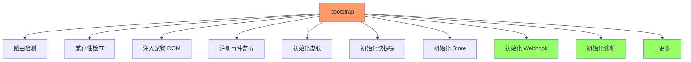

# YP-09-77: Content Script 插件化资源加载 — 钩子系统与扩展点

> 需求编号：YP-09-77 · 优先级：P2 · 人天：0.5d · 状态：需求已编写
> 依赖：YP-09-54（懒加载按需注入）

## 背景

### 问题陈述

YiPet 的 Content Script 初始化流程（bootstrap）是一个硬编码的线性过程：路由检测 → 兼容性检查 → 注入宠物 DOM → 注册事件监听 → 初始化皮肤 → 初始化快捷键 → 初始化 Store。每次新增功能模块（如 Webhook 集成、诊断收集、请求去重）都需要修改 bootstrap 核心代码，添加新的初始化步骤。

**核心矛盾**：功能模块的增长 vs bootstrap 核心代码的稳定性。当前架构下，功能模块与核心流程强耦合，新增功能 = 修改核心代码 = 引入回归风险。钩子系统（Hook System）通过定义扩展点，允许功能模块以插件形式注册到生命周期中，实现核心代码与功能模块的解耦。

### 影响范围

| # | 影响 | 严重程度 | 触发场景 |
|---|------|----------|----------|
| 1 | 新增功能需修改 bootstrap | 中 | 每次添加新模块 |
| 2 | 模块间初始化顺序不可控 | 中 | 模块 A 依赖模块 B |
| 3 | 无法按页面类型加载不同模块 | 中 | 不同页面需要不同功能集 |
| 4 | 缺少模块卸载机制 | 低 | 扩展更新/禁用功能 |
| 5 | 核心代码膨胀 | 中 | 功能增长 |

### 挑战

| 挑战 | 说明 |
|------|------|
| 钩子粒度 | 太细导致钩子过多，太粗导致灵活性不足 |
| 钩子执行顺序 | 确保钩子按注册顺序或优先级执行 |
| 异步钩子 | 部分钩子需要异步执行（如网络请求） |
| 错误隔离 | 一个钩子失败不应影响其他钩子 |
| 开发调试 | 开发者需要知道哪些钩子已注册、执行顺序 |

---

## 一、现状分析

### 1.1 当前 bootstrap 流程

```typescript
// src/content/index.ts (当前)
async function bootstrap() {
  // 1. 路由检测
  await checkRoute();
  // 2. 兼容性检查
  await compat.checkAll();
  // 3. 注入宠物 DOM
  await injectPetDOM();
  // 4. 注册事件监听
  registerEventListeners();
  // 5. 初始化皮肤
  await initSkin();
  // 6. 初始化快捷键
  initKeybindings();
  // 7. 初始化 Store
  initStores();
  // 8. 初始化 Webhook（新增 - 修改核心代码）
  await webhookService.init();
  // 9. 初始化诊断（新增 - 修改核心代码）
  crashCollector.init();
  // ... 更多功能都在这里
}
```

**问题：每个新功能都在 bootstrap 中添加一行，核心代码持续膨胀。**

### 1.2 改造前数据流



### 1.3 根因矩阵

| 症状 | 根因 | 触发条件 | 频率 |
|------|------|----------|------|
| 新增功能需修改核心 | 硬编码 bootstrap | 每次功能开发 | 高 |
| 初始化顺序不可控 | 线性执行 | 模块间有依赖 | 中 |
| 无法按页面类型裁剪 | 无页面类型感知 | 不同页面场景 | 中 |
| 模块无法卸载 | 无生命周期管理 | 设置变更 | 低 |

---

## 二、设计决策

### 决策 1：钩子系统架构 — EventEmitter vs 自定义 HookSystem vs 依赖注入

| 选项 | 类型安全 | 异步支持 | 可调试性 | 复杂度 |
|------|----------|----------|----------|--------|
| EventEmitter 模式 | 低 | 是 | 低 | 低 |
| 自定义 HookSystem | 高 | 是 | 高 | 中 |
| 依赖注入容器 | 高 | 是 | 中 | 高 |

**选择：自定义 HookSystem。** 为 YiPet 量身定制的钩子系统，提供类型安全的钩子定义、异步执行、优先级排序、错误隔离和调试日志。

### 决策 2：钩子粒度 — 粗粒度（生命周期） vs 细粒度（事件） vs 混合

| 选项 | 灵活性 | 钩子数量 | 学习成本 |
|------|--------|----------|----------|
| 粗粒度（3-5 个生命周期钩子） | 低 | 少 | 低 |
| 细粒度（20+ 个事件钩子） | 高 | 多 | 高 |
| 混合（生命周期 + 关键事件） | 中 | 适中 | 中 |

**选择：混合粒度。** 6 个生命周期钩子（`beforeInit`、`afterInit`、`beforeInject`、`afterInject`、`beforeDestroy`、`afterDestroy`）+ 5 个关键事件钩子（`route:changed`、`skin:applied`、`chat:opened`、`chat:closed`、`session:switched`）。

### 决策 3：钩子执行策略 — 串行 vs 并行 vs 优先级串行

| 选项 | 性能 | 确定性 | 依赖处理 |
|------|------|--------|----------|
| 串行（按注册顺序） | 慢 | 高 | 自然支持 |
| 并行（Promise.all） | 快 | 低 | 不支持 |
| 优先级串行 | 中 | 高 | 支持 |

**选择：优先级串行。** 钩子按优先级排序后串行执行。高优先级钩子先执行（如核心安全检查），低优先级后执行（如遥测上报）。依赖通过钩子返回值和执行顺序隐式处理。

### 设计决策记录

| 决策 | 选项 A | 选项 B | 选项 C | 选择 | 理由 |
|------|--------|--------|--------|------|------|
| 架构 | EventEmitter | 自定义 HookSystem | DI | **自定义 HookSystem** | 类型安全 + 可控 |
| 粒度 | 粗粒度 | 细粒度 | 混合 | **混合（11 个钩子）** | 覆盖关键场景 |
| 执行策略 | 串行 | 并行 | 优先级串行 | **优先级串行** | 确定性 + 有序 |

---

## 三、目标架构

### 3.1 改造后插件化架构

```mermaid
graph TD
    subgraph Core["核心系统 (不变)"]
        A[HookSystem]
        B[LifecycleManager]
    end

    subgraph Plugins["功能插件 (可扩展)"]
        C[RouteDetector]
        D[CompatChecker]
        E[PetInjector]
        F[SkinManager]
        G[KeybindingManager]
        H[WebhookService]
        I[CrashCollector]
        J[StreamRenderer]
        K[...更多]
    end

    A --> C
    A --> D
    A --> E
    A --> F
    A --> G
    A --> H
    A --> I
    A --> J
    A --> K

    subgraph Hooks["钩子扩展点"]
        L[beforeInit]
        M[afterInit]
        N[beforeInject]
        O[afterInject]
        P[route:changed]
        Q[skin:applied]
        R[chat:opened]
        S[chat:closed]
        T[beforeDestroy]
        U[afterDestroy]
        V[session:switched]
    end

    B --> L
    B --> M
    B --> N
    B --> O
    B --> P
    B --> Q
    B --> R
    B --> S
    B --> T
    B --> U
    B --> V
```



### 3.2 性能指标

| 指标 | 改造前 | 改造后 |
|------|--------|--------|
| 新增功能需修改核心代码 | 是 | 否 |
| 钩子注册开销 | 0ms | <0.5ms（11 个钩子） |
| 钩子执行开销 | N/A | <1ms（所有钩子） |
| 模块隔离性 | 低 | 高 |

---

## 四、具体改动

### 4.1 钩子系统实现

```typescript
// 改造前：硬编码 bootstrap
// async function bootstrap() { await step1(); await step2(); ... }

// src/services/hook-system.ts (改造后)

type HookName =
  | 'beforeInit'
  | 'afterInit'
  | 'beforeInject'
  | 'afterInject'
  | 'beforeDestroy'
  | 'afterDestroy'
  | 'route:changed'
  | 'skin:applied'
  | 'chat:opened'
  | 'chat:closed'
  | 'session:switched';

interface HookHandler {
  (ctx: HookContext): Promise<void> | void;
}

interface HookContext {
  hookName: HookName;
  pageType?: string;
  timestamp: number;
  [key: string]: unknown;
}

interface HookRegistration {
  name: string;
  handler: HookHandler;
  priority: number;  // 0 = 最高优先级
  pageTypes?: string[];  // 可选页面类型过滤
}

class HookSystem {
  private hooks = new Map<HookName, HookRegistration[]>();
  private debugMode = false;

  enableDebug(): void { this.debugMode = true; }
  disableDebug(): void { this.debugMode = false; }

  register(
    hookName: HookName,
    name: string,
    handler: HookHandler,
    options?: { priority?: number; pageTypes?: string[] },
  ): void {
    const registration: HookRegistration = {
      name,
      handler,
      priority: options?.priority ?? 100,
      pageTypes: options?.pageTypes,
    };

    const existing = this.hooks.get(hookName) ?? [];
    existing.push(registration);
    // 按优先级排序
    existing.sort((a, b) => a.priority - b.priority);
    this.hooks.set(hookName, existing);

    if (this.debugMode) {
      console.debug(`[YiPet:Hook] Registered "${name}" on "${hookName}" (priority: ${registration.priority})`);
    }
  }

  async trigger(
    hookName: HookName,
    ctx: HookContext = { hookName, timestamp: Date.now() },
  ): Promise<void> {
    const registrations = this.hooks.get(hookName);
    if (!registrations || registrations.length === 0) return;

    const startTime = performance.now();

    // 过滤页面类型
    const applicable = registrations.filter(r =>
      !r.pageTypes || !ctx.pageType || r.pageTypes.includes(ctx.pageType)
    );

    for (const reg of applicable) {
      try {
        await reg.handler(ctx);
      } catch (err) {
        console.error(`[YiPet:Hook] Error in "${reg.name}" on "${hookName}":`, err);
        // 错误隔离：一个钩子失败不影响其他钩子
      }
    }

    if (this.debugMode) {
      const duration = (performance.now() - startTime).toFixed(2);
      console.debug(`[YiPet:Hook] "${hookName}" completed (${applicable.length} handlers, ${duration}ms)`);
    }
  }

  unregister(hookName: HookName, name: string): void {
    const existing = this.hooks.get(hookName);
    if (existing) {
      this.hooks.set(hookName, existing.filter(r => r.name !== name));
    }
  }

  listHooks(): Map<HookName, string[]> {
    const result = new Map<HookName, string[]>();
    for (const [hookName, registrations] of this.hooks) {
      result.set(hookName, registrations.map(r => r.name));
    }
    return result;
  }
}

export const hookSystem = new HookSystem();
```

### 4.2 插件注册示例

```typescript
// src/content/plugins/route-detector.ts (改造后)
import { hookSystem } from '@/services/hook-system';

export function registerRouteDetector(): void {
  hookSystem.register('beforeInit', 'route-detector', async (ctx) => {
    const pageType = detectPageType();
    ctx.pageType = pageType;
    console.debug(`[YiPet:Route] Page type: ${pageType}`);
  }, { priority: 0 });  // 最高优先级——先检测页面类型
}

// src/content/plugins/compat-checker.ts
export function registerCompatChecker(): void {
  hookSystem.register('beforeInit', 'compat-checker', async (ctx) => {
    const report = await compat.checkAll();
    ctx.compatReport = report;
  }, { priority: 10 });
}

// src/content/plugins/pet-injector.ts
export function registerPetInjector(): void {
  hookSystem.register('afterInit', 'pet-injector', async (ctx) => {
    await injectPetDOM(ctx.pageType);
  }, { priority: 20 });
}

// src/content/plugins/webhook-service.ts
export function registerWebhookService(): void {
  hookSystem.register('afterInit', 'webhook-service', async () => {
    await webhookService.init();
  }, { priority: 100 });  // 低优先级——非关键功能
}

// src/content/plugins/crash-collector.ts
export function registerCrashCollector(): void {
  hookSystem.register('afterInit', 'crash-collector', async () => {
    crashCollector.init();
  }, { priority: 100 });
}
```

### 4.3 新的 bootstrap

```typescript
// src/content/index.ts (改造后)
import { hookSystem } from '@/services/hook-system';
import { registerRouteDetector } from './plugins/route-detector';
import { registerCompatChecker } from './plugins/compat-checker';
import { registerPetInjector } from './plugins/pet-injector';
// ... 更多插件注册

async function bootstrap(): Promise<void> {
  // 注册所有插件
  registerRouteDetector();
  registerCompatChecker();
  registerPetInjector();
  registerWebhookService();
  registerCrashCollector();
  // 新增功能只需添加一行注册

  // 执行生命周期
  await hookSystem.trigger('beforeInit');
  // ... 核心初始化逻辑
  await hookSystem.trigger('afterInit');

  // 注入宠物
  await hookSystem.trigger('beforeInject');
  await injectPetDOM();
  await hookSystem.trigger('afterInject');
}
```

### 4.4 文件变更清单

| 文件 | 操作 | 说明 |
|------|------|------|
| `src/services/hook-system.ts` | 新增 | 钩子系统核心 |
| `src/content/plugins/` | 新增 | 插件目录 |
| `src/content/plugins/route-detector.ts` | 新增 | 路由检测插件 |
| `src/content/plugins/compat-checker.ts` | 新增 | 兼容性检查插件 |
| `src/content/plugins/pet-injector.ts` | 新增 | 宠物注入插件 |
| `src/content/plugins/webhook-service.ts` | 新增 | Webhook 服务插件 |
| `src/content/plugins/crash-collector.ts` | 新增 | 崩溃收集插件 |
| `src/content/index.ts` | 修改 | 重构为插件化 bootstrap |
| `tests/unit/hook-system.test.ts` | 新增 | 钩子系统测试 |

---

## 五、实施步骤

| 步骤 | 操作 | 路径 | 验证 | 人天 |
|------|------|------|------|------|
| 1 | 实现 HookSystem | `src/services/hook-system.ts` | 单元测试 | 0.1 |
| 2 | 定义钩子名称和优先级 | `src/services/hook-system.ts` | 钩子列表 | 0.05 |
| 3 | 提取现有功能为插件 | `src/content/plugins/` | 每个插件独立测试 | 0.15 |
| 4 | 重构 bootstrap | `src/content/index.ts` | 功能不变 | 0.1 |
| 5 | 添加调试模式 | `src/services/hook-system.ts` | 日志输出 | 0.05 |
| 6 | 全量回归 | 全量 | 所有功能正常 | 0.05 |

**总人天：0.5d**

---

## 六、测试规格

### 场景 1：钩子注册和触发

**GIVEN** 注册了一个 `afterInit` 钩子
**WHEN** 触发 `afterInit`
**THEN** 钩子处理函数应被调用
**AND** 钩子上下文应包含 `hookName` 和 `timestamp`

### 场景 2：优先级排序

**GIVEN** 注册了 3 个 `beforeInit` 钩子，优先级分别为 100、0、50
**WHEN** 触发 `beforeInit`
**THEN** 钩子应按优先级 0 → 50 → 100 的顺序执行

### 场景 3：错误隔离

**GIVEN** 注册了 2 个 `afterInit` 钩子，第一个会抛出错误
**WHEN** 触发 `afterInit`
**THEN** 第一个钩子的错误应被捕获
**AND** 第二个钩子应正常执行
**AND** 钩子触发不应抛出异常

### 场景 4：页面类型过滤

**GIVEN** 注册了一个 `afterInject` 钩子，限制 `pageTypes: ['documentation']`
**WHEN** 在普通页面触发 `afterInject`（pageType: 'default'）
**THEN** 该钩子不应被调用
**WHEN** 在文档页面触发 `afterInject`（pageType: 'documentation'）
**THEN** 该钩子应被调用

### 场景 5：钩子注销

**GIVEN** 注册了一个钩子
**WHEN** 调用 `unregister`
**THEN** 后续触发该钩子时不应调用已注销的处理函数

### 场景 6：调试模式

**GIVEN** 启用调试模式
**WHEN** 注册和触发钩子
**THEN** 控制台应输出注册和触发日志
**AND** 日志应包含钩子名称、处理函数名称、优先级、耗时

---

## 七、风险与缓解

| 风险 | 概率 | 影响 | 缓解措施 |
|------|------|------|----------|
| 钩子执行顺序错误 | 中 | 中 | 优先级排序 + 调试日志 |
| 异步钩子阻塞生命周期 | 中 | 中 | 设置超时限制（30s） |
| 钩子过多导致初始化变慢 | 低 | 低 | 限制钩子数量 + 性能监控 |
| 插件间隐式依赖 | 中 | 中 | 通过钩子上下文传递数据 |

---

## 八、回滚策略

| 场景 | 回滚操作 | 影响 |
|------|----------|------|
| 钩子系统导致初始化异常 | 恢复硬编码 bootstrap | 失去插件化 |
| 性能退化 | 合并低优先级钩子 | 钩子数量减少 |
| 钩子顺序错误 | 调整优先级配置 | 无功能影响 |

---

## 九、设计决策记录

### D-01：钩子命名规范

- **问题**：钩子名称使用什么格式
- **选项**：`camelCase`、`domain:event`、`domain/event`
- **选择**：`domain:event`（如 `route:changed`、`chat:opened`）
- **理由**：清晰表达领域和事件，便于查找和文档化

### D-02：默认优先级

- **问题**：未指定优先级时的默认值
- **选项**：0（最高）、50（中等）、100（最低）
- **选择**：100（最低）
- **理由**：默认低优先级，避免新插件意外阻塞核心流程

### D-03：钩子上下文设计

- **问题**：钩子之间如何传递数据
- **选项**：无传递、返回值传递、共享上下文对象
- **选择**：共享上下文对象
- **理由**：钩子可以向 `ctx` 添加数据，后续钩子可读取，实现松耦合的数据传递

---

## 相关文档

- [资源生命周期管理](../32-需求-资源生命周期管理.md) — 插件需注册到生命周期钩子，随 Tab 创建/销毁
- [错误边界与降级](../34-需求-错误边界与降级.md) — 插件异常需被错误边界捕获，避免影响主流程
- [特性开关与 AB 实验](../40-需求-特性开关与AB实验.md) — 插件可通过 Feature Flag 控制启用/禁用

*PRD 来源: `projects/yipet/requirements/2026-09/77-需求-插件化钩子系统.md`*

---

## 十、可观测性

### 指标

| 指标 | 类型 | 说明 |
|------|------|------|
| `yipet.hook.registered_count` | Gauge | 已注册钩子数 |
| `yipet.hook.trigger_count` | Counter | 钩子触发次数 |
| `yipet.hook.error_count` | Counter | 钩子执行错误次数 |
| `yipet.hook.duration` | Histogram | 钩子执行耗时 |

---

## 十一、代码审查检查清单

- [ ] 钩子系统支持 6 个生命周期 + 5 个关键事件钩子
- [ ] 钩子按优先级排序执行
- [ ] 钩子错误隔离（一个失败不影响其他）
- [ ] 支持页面类型过滤
- [ ] 钩子上下文支持数据传递
- [ ] 调试模式输出注册和触发日志
- [ ] 新增功能以插件形式注册，不修改核心代码
- [ ] 钩子注销功能
- [ ] 单元测试覆盖所有钩子场景

---

## 回归问题预测

| # | 预测问题 | 原因 | 验证方法 |
|---|---------|------|---------|
| 1 | 钩子注册顺序依赖未被强制执行，模块 B 在钩子 `init` 中依赖模块 A 的初始化结果，但模块 A 的 `init` 钩子尚未执行 | 插件的 `register()` 调用顺序决定了钩子执行顺序，但注册顺序可能因动态 import 的完成时间不同而变化，导致隐式依赖的模块初始化失败 | 使用不同网络速度加载扩展（模拟慢速 CDN）→ 验证钩子执行顺序与注册顺序一致，且有显式的 `dependsOn` 声明机制 |
| 2 | 一个钩子的异步执行阻塞了后续钩子的触发，导致整个 bootstrap 流程超时 | 钩子 A 的 `init` 中发起网络请求耗时 5s，使用 `await` 等待，钩子 B 的 `init` 被阻塞，bootstrap 总耗时超过 10s 超时阈值 | 在钩子 A 中模拟 5s 网络延迟 → 验证其他钩子不受影响（并行执行），或钩子有独立超时限制（如 3s），超时后跳过并继续 |
| 3 | 钩子抛出的异常被 try-catch 吞掉，开发者无法发现钩子注册失败，功能静默失效 | 钩子执行器使用 `try { await hook() } catch { /* log */ }`，错误被记录到 debug 日志但生产环境日志级别为 `error`，开发者看不到 warn 级别的钩子失败 | 在钩子中故意抛出异常 → 验证错误被提升到 `console.error` 级别，且在诊断信息收集中可见钩子状态（成功/失败/跳过） |
| 4 | 插件卸载（`unregister`）时，钩子中注册的事件监听器和定时器未被清理，导致内存泄漏和僵尸回调 | 插件在 `init` 钩子中注册了 `document.addEventListener` 和 `setInterval`，但 `destroy` 钩子中未移除，`unregister` 后这些回调仍在运行 | 注册 → 卸载 → 再注册一个插件循环 10 次 → 验证 event listener 数量和 timer 数量不增长，`getEventListeners(document)` 无残留 |
| 5 | 插件注册时使用了错误的钩子名称（如 `onInitalized` 拼写错误），TypeScript 类型检查未捕获，钩子永不执行 | 钩子名称是字符串类型，`hooks.register('onInitalized', handler)` 拼写错误，TypeScript 未报错，但该钩子在实际生命周期中不存在 | 验证钩子注册 API 使用枚举或字符串字面量联合类型，`register('onInitalized' as any)` 在编译时报错 |
| 6 | 不同页面类型（普通页面/SPA/文档页）加载了不适用的插件，导致功能异常或性能浪费 | 插件的 `applicableTo` 声明为 `['*']`，但 Webhook 插件在 `about:blank` 页面初始化时尝试读取页面 URL 失败 | 在 `about:blank`、Chrome Web Store、`chrome://extensions` 等特殊页面加载扩展 → 验证插件根据 `applicableTo` 正确过滤，不适用的插件不初始化 |

---

---

## 性能分析

### 钩子执行预算

| 钩子点 | 最大插件数 | 每插件预算 | 总预算 | 触发频率 |
|--------|-----------|-----------|--------|----------|
| `preSend` | 5 | < 1ms | < 5ms | 每次发送消息 |
| `postSend` | 5 | < 0.5ms | < 3ms | 每次发送完成 |
| `onToken` | 3 | < 0.5ms | < 2ms | 每帧 (60fps) |
| `onDone` | 5 | < 1ms | < 5ms | 每次流式完成 |
| `onError` | 3 | < 2ms | < 6ms | 仅错误时 |
| `onRouteChange` | 3 | < 0.5ms | < 2ms | SPA 路由切换 |

### 插件内存预算

| 插件数 | 钩子数 | 内存 | 说明 |
|--------|--------|------|------|
| 0 (无插件) | 0 | 0 | 钩子系统跳过——零开销 |
| 1 个插件 | 1-3 | ~500B | 回调引用 + manifest |
| 5 个插件 | 5-15 | ~2KB | 中等插件数量 |
| 10 个插件 (上限) | 10-30 | ~5KB | 上限控制 |

### 运行时开销

| 操作 | 耗时 | 说明 |
|------|------|------|
| 插件注册 (`register`) | < 5ms | 解析 manifest + 注册钩子 |
| 钩子触发 (无插件) | < 0.01ms | 提前退出—零开销 |
| 钩子触发 (1 个插件) | < 1ms | 单回调 + 上下文传递 |
| 钩子触发 (10 个插件) | < 5ms | 链式调用—需限上限 |
| 插件卸载 (`unregister`) | < 1ms | Map.delete + 清理引用 |
| 插件沙箱初始化 | < 5ms | 一次性—常驻 |