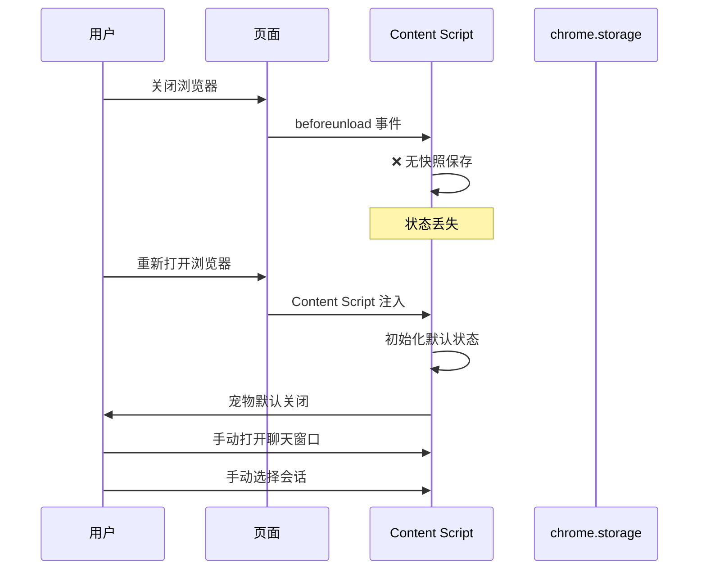
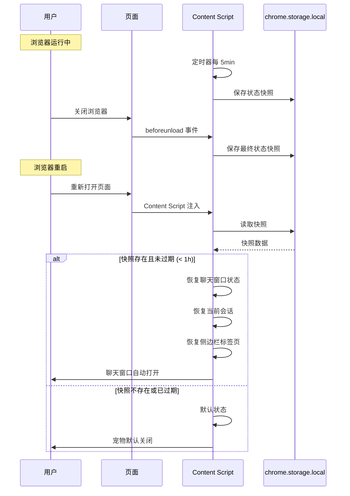

# YP-09-78: 浏览器启动时自动恢复 — 上次会话恢复策略

> 需求编号：YP-09-78 · 优先级：P2 · 人天：0.5d · 状态：需求已编写
> 依赖：YP-09-66（设置跨设备同步）、YP-09-79（IndexedDB 持久化）

## 背景

### 问题陈述

用户关闭浏览器后再打开时，YiPet 的聊天窗口状态完全丢失——之前打开的聊天窗口、正在进行的对话、侧边栏的活跃标签页全部重置为初始状态。用户需要重新打开聊天窗口、重新选择会话、重新定位到之前的对话位置。

**核心矛盾**：用户期望浏览器重启后从上次中断处继续 vs 扩展状态在浏览器关闭时全部丢失。Chrome 扩展没有原生的"会话恢复"机制，需要手动实现状态快照和恢复策略。

### 影响范围

| # | 影响 | 严重程度 | 用户感知 |
|---|------|----------|----------|
| 1 | 聊天窗口状态丢失 | 中 | 每次重启浏览器 |
| 2 | 正在进行的对话中断 | 中 | 需要重新打开会话 |
| 3 | 侧边栏状态丢失 | 低 | 需要重新选择标签页 |
| 4 | 快照数据过期 | 低 | 恢复过时的状态 |
| 5 | 频繁写入影响性能 | 低 | storage 写入每 5min |

### 挑战

| 挑战 | 说明 |
|------|------|
| 快照时机 | 何时保存状态快照（关闭前/定时/状态变更） |
| 快照过期 | 1 小时前的快照可能已过时 |
| 快照大小 | 会话数据可能很大，不应完整快照 |
| 恢复验证 | 恢复的会话可能已过期或数据不一致 |
| 多标签页 | 多个标签页的恢复顺序 |

---

## 一、现状分析

### 1.1 当前启动流程

```
浏览器启动
  │ 用户打开页面
  ▼
Content Script 注入
  │ bootstrap()
  │ 初始化宠物 DOM
  │ 默认状态：关闭
  ▼
用户手动操作
  │ 点击宠物 → 打开聊天窗口
  │ 选择会话 → 加载对话
  │ 选择侧边栏标签页
  ▼
恢复完成（手动）
  总耗时：10-30s
```

### 1.2 保存快照时机

| 时机 | 保存内容 | 频率 | 触发条件 |
|------|----------|------|----------|
| `beforeunload` | 完整状态快照 | 低 | 页面关闭/刷新 |
| 定时（每 5min） | 增量快照 | 低 | 定时器触发 |
| 状态变更 | 去抖快照 | 高 | 聊天窗口打开/关闭 |

### 1.3 改造前数据流



### 1.4 根因矩阵

| 症状 | 根因 | 触发条件 | 频率 |
|------|------|----------|------|
| 状态丢失 | 无快照保存 | 浏览器关闭 | 每次 |
| 手动恢复 | 无自动恢复 | 浏览器启动 | 每次 |
| 恢复过时 | 无过期机制 | 长时间未使用 | 中 |

---

## 二、设计决策

### 决策 1：快照保存时机 — beforeunload vs 定时 vs 混合

| 选项 | 可靠性 | 性能开销 | 实现 |
|------|--------|----------|------|
| 仅 `beforeunload` | 中（可能不触发） | 最低 | 低 |
| 仅定时（每 5min） | 中（可能丢失 5min） | 低 | 低 |
| 混合（beforeunload + 定时） | 高 | 低 | 中 |

**选择：混合（beforeunload + 定时 5min）。** `beforeunload` 提供最佳时机保存，但某些场景不触发（浏览器崩溃、强制关闭）。定时 5min 作为兜底，确保最多丢失 5min 状态。

### 决策 2：快照过期策略 — 固定时间 vs 会话级 vs 无过期

| 选项 | 数据新鲜度 | 用户体验 | 实现 |
|------|-----------|----------|------|
| 固定 1h 过期 | 高 | 中 | 低 |
| 会话级（当天有效） | 中 | 高 | 低 |
| 无过期 | 低 | 高 | 低 |

**选择：固定 1h 过期。** 1 小时内的快照可能是用户短期离开后返回；超过 1 小时则视为新的浏览会话，应从头开始。

### 决策 3：快照内容 — 完整状态 vs 仅元数据 vs 分层

| 选项 | 恢复精度 | 存储开销 | 实现 |
|------|----------|----------|------|
| 完整状态（含消息） | 高 | 大 | 低 |
| 仅元数据（聊天/会话 ID） | 中 | 小 | 低 |
| 分层（元数据 + 可选消息） | 高 | 中 | 中 |

**选择：仅元数据。** 快照仅保存聊天窗口是否打开、当前会话 ID、活跃标签页 ID。消息数据通过正常加载流程从存储中恢复，不随快照保存。

### 设计决策记录

| 决策 | 选项 A | 选项 B | 选项 C | 选择 | 理由 |
|------|--------|--------|--------|------|------|
| 保存时机 | beforeunload | 定时 | 混合 | **混合** | 可靠兜底 |
| 过期策略 | 1h | 当天 | 无过期 | **1h** | 数据新鲜度 |
| 快照内容 | 完整 | 元数据 | 分层 | **仅元数据** | 轻量可靠 |

---

## 三、目标架构

### 3.1 改造后恢复流程



### 3.2 性能指标

| 指标 | 改造前 | 改造后 |
|------|--------|--------|
| 启动恢复时间 | 10-30s（手动） | 1-3s（自动） |
| 状态丢失率 | 100% | <5%（5min 窗口） |
| 快照存储开销 | 0KB | <1KB（仅元数据） |
| 快照写入频率 | 0 | 1 次/5min |

---

## 四、具体改动

### 4.1 状态恢复服务

```typescript
// 改造前：无状态恢复
// src/services/state-restore.ts (改造后)

interface AppState {
  chatOpen: boolean;
  currentSessionId: string | null;
  lastActiveTab: string;
  petPosition: { x: number; y: number } | null;
  timestamp: number;
}

const STORAGE_KEY = 'yipet:lastState';
const SNAPSHOT_INTERVAL = 5 * 60 * 1000;  // 5min
const SNAPSHOT_EXPIRY = 60 * 60 * 1000;    // 1h

class StateRestoreService {
  private intervalId: ReturnType<typeof setInterval> | null = null;

  init(): void {
    this.setupBeforeUnload();
    this.startPeriodicSnapshot();
    this.restoreLastState();
  }

  private setupBeforeUnload(): void {
    window.addEventListener('beforeunload', () => {
      this.saveSnapshot();
    });
  }

  private startPeriodicSnapshot(): void {
    this.intervalId = setInterval(() => {
      this.saveSnapshot();
    }, SNAPSHOT_INTERVAL);
  }

  async saveSnapshot(): Promise<void> {
    const state: AppState = {
      chatOpen: this.isChatOpen(),
      currentSessionId: this.getCurrentSessionId(),
      lastActiveTab: this.getLastActiveTab(),
      petPosition: this.getPetPosition(),
      timestamp: Date.now(),
    };

    try {
      await chrome.storage.local.set({ [STORAGE_KEY]: state });
    } catch (err) {
      console.warn('[YiPet:Restore] Failed to save snapshot:', err);
    }
  }

  async restoreLastState(): Promise<boolean> {
    try {
      const data = await chrome.storage.local.get(STORAGE_KEY);
      const state = data[STORAGE_KEY] as AppState | undefined;

      if (!state) return false;

      // 检查过期
      if (Date.now() - state.timestamp > SNAPSHOT_EXPIRY) {
        await chrome.storage.local.remove(STORAGE_KEY);
        return false;
      }

      // 恢复聊天窗口
      if (state.chatOpen) {
        await this.openChatWindow();
      }

      // 恢复会话
      if (state.currentSessionId) {
        await this.loadSession(state.currentSessionId);
      }

      // 恢复侧边栏
      if (state.lastActiveTab) {
        this.setActiveTab(state.lastActiveTab);
      }

      // 恢复宠物位置
      if (state.petPosition) {
        this.setPetPosition(state.petPosition.x, state.petPosition.y);
      }

      console.debug('[YiPet:Restore] State restored successfully');
      return true;
    } catch (err) {
      console.warn('[YiPet:Restore] Failed to restore state:', err);
      return false;
    }
  }

  destroy(): void {
    if (this.intervalId) {
      clearInterval(this.intervalId);
      this.intervalId = null;
    }
  }
}
```

### 4.2 文件变更清单

| 文件 | 操作 | 说明 |
|------|------|------|
| `src/services/state-restore.ts` | 新增 | 状态恢复服务 |
| `src/content/index.ts` | 修改 | 初始化 StateRestoreService |
| `src/stores/chat.ts` | 修改 | 提供状态读取接口 |
| `src/stores/sidebar.ts` | 修改 | 提供标签页状态接口 |
| `tests/unit/state-restore.test.ts` | 新增 | 状态恢复测试 |

---

## 五、实施步骤

| 步骤 | 操作 | 路径 | 验证 | 人天 |
|------|------|------|------|------|
| 1 | 实现 StateRestoreService | `src/services/state-restore.ts` | 单元测试 | 0.1 |
| 2 | 集成 beforeunload 监听 | `src/services/state-restore.ts` | 关闭浏览器前保存 | 0.05 |
| 3 | 实现定时快照 | `src/services/state-restore.ts` | 每 5min 保存 | 0.05 |
| 4 | 实现恢复逻辑 | `src/services/state-restore.ts` | 启动时恢复 | 0.1 |
| 5 | 集成到 bootstrap | `src/content/index.ts` | 启动时自动恢复 | 0.05 |
| 6 | 过期验证 | `src/services/state-restore.ts` | 1h 后不恢复 | 0.05 |
| 7 | 全量测试 | 全量 | 所有场景 | 0.1 |

**总人天：0.5d**

---

## 六、测试规格

### 场景 1：正常恢复

**GIVEN** 用户上次关闭浏览器前聊天窗口打开，会话 ID 为 "session-123"
**WHEN** 用户 5 分钟后重新打开浏览器
**THEN** 聊天窗口应自动打开
**AND** 应自动加载 "session-123" 会话
**AND** 侧边栏应恢复到上次活跃标签页

### 场景 2：快照过期

**GIVEN** 快照的时间戳为 2 小时前
**WHEN** 用户重新打开浏览器
**THEN** 不应恢复快照
**AND** 快照应从 storage 中清除
**AND** 宠物应显示默认状态

### 场景 3：无快照

**GIVEN** storage 中无快照数据
**WHEN** 用户重新打开浏览器
**THEN** 应正常初始化默认状态
**AND** 不应抛出错误

### 场景 4：定时快照

**GIVEN** Content Script 已运行 10 分钟
**WHEN** 定时器触发
**THEN** 应保存当前状态快照
**AND** 快照 timestamp 应更新

### 场景 5：beforeunload 快照

**GIVEN** 用户关闭/刷新页面
**WHEN** beforeunload 事件触发
**THEN** 应立即保存最终状态快照
**AND** 快照应包含最新状态

### 场景 6：恢复失败降级

**GIVEN** 快照中的会话 ID 指向已删除的会话
**WHEN** 尝试恢复
**THEN** 应降级为默认状态
**AND** 不应抛出错误
**AND** 应清除无效快照

---

## 七、风险与缓解

| 风险 | 概率 | 影响 | 缓解措施 |
|------|------|------|----------|
| beforeunload 不触发 | 中 | 中 | 定时 5min 兜底快照 |
| 恢复的会话已过期 | 低 | 低 | 降级为默认状态 |
| 频繁写入 chrome.storage | 低 | 低 | 仅 5min 一次 + 状态变更去抖 |
| 多标签页快照冲突 | 中 | 低 | 最后写入胜出（LWW） |
| 快照数据过时 | 中 | 低 | 1h 过期 + 用户可感知 |

---

## 八、回滚策略

| 场景 | 回滚操作 | 影响 |
|------|----------|------|
| 恢复导致异常 | 禁用自动恢复，清除快照 | 失去自动恢复 |
| 定时快照影响性能 | 增加间隔到 10min | 状态丢失窗口增大 |
| 快照存储占用过大 | 仅保存聊天窗口状态 | 侧边栏/位置不恢复 |

---

## 九、设计决策记录

### D-01：快照过期时间

- **问题**：快照多久后视为过期
- **选项**：30min、1h、2h、4h
- **选择**：1h
- **理由**：1h 覆盖午餐/会议等短期离开，超过 1h 视为新会话更合理

### D-02：定时快照间隔

- **问题**：定时快照的间隔
- **选项**：1min、5min、10min、15min
- **选择**：5min
- **理由**：5min 间隔在状态丢失（最多 5min）和存储写入开销之间取得平衡

### D-03：beforeunload 可靠性

- **问题**：beforeunload 在移动端/崩溃时不可靠，如何兜底
- **选项**：仅定时快照、定时 + 状态变更、定时 + beforeunload
- **选择**：定时 + beforeunload
- **理由**：双层保障，beforeunload 覆盖正常关闭，定时覆盖异常场景

---

## 十、可观测性

### 指标

| 指标 | 类型 | 说明 |
|------|------|------|
| `yipet.restore.snapshot_count` | Counter | 快照保存次数 |
| `yipet.restore.restore_count` | Counter | 恢复次数 |
| `yipet.restore.restore_success` | Counter | 恢复成功次数 |
| `yipet.restore.expired_count` | Counter | 过期快照次数 |

### 告警

| 告警 | 条件 | 级别 |
|------|------|------|
| 恢复失败 | 连续 3 次 | WARNING |
| 快照保存失败 | 连续 3 次 | WARNING |

---

## 十一、代码审查检查清单

- [ ] 浏览器启动时恢复上次会话状态（聊天窗口+会话）
- [ ] 状态快照存储 `chrome.storage.local`（1h 过期）
- [ ] 快照每 5min 更新（减少 storage 写入）
- [ ] 恢复时校验存储容量
- [ ] beforeunload 保存最终快照
- [ ] 快照仅保存元数据（聊天窗口/会话 ID/标签页 ID）
- [ ] 恢复失败时降级为默认状态
- [ ] 过期快照自动清除
- [ ] 单元测试覆盖所有恢复场景

---

## 回归问题预测

| # | 预测问题 | 原因 | 验证方法 |
|---|---------|------|---------|
| 1 | `chrome.runtime.onStartup` 事件触发时，Content Script 尚未注入任何页面，恢复逻辑找不到目标页面 | 浏览器启动时只有空白标签页或 `chrome://newtab`，Content Script 不会在这些页面上注入，`onStartup` 中尝试恢复聊天窗口但找不到可注入的页面 | 关闭所有标签页 → 退出浏览器 → 重新启动 → 验证启动恢复逻辑等待第一个可注入页面出现后再恢复，而非在 `onStartup` 中直接恢复 |
| 2 | 保存的快照包含已过期的会话引用（Session Key 已失效），恢复后聊天窗口显示"会话不存在" | 用户在浏览器关闭前 1 小时保存了快照，但期间 Session Key 在服务端已过期（YiAi 的 Session TTL 为 30 分钟），恢复后尝试加载会话失败 | 保存快照 → 等待 30 分钟 → 重启浏览器 → 验证恢复逻辑检测 Session Key 过期，自动创建新会话而非显示错误 |
| 3 | 定时快照（每 5 分钟）在用户活跃操作期间触发，`chrome.storage` 写入阻塞 UI 线程 | 快照序列化包含 Pinia store 的完整状态快照，`JSON.stringify` 遍历大型响应式对象耗时 > 50ms，用户正在输入时感知到卡顿 | 在用户快速输入时等待快照保存 → 验证快照使用 `requestIdleCallback` 或 `navigator.scheduling.isInputPending()` 在空闲时写入，不阻塞用户交互 |
| 4 | 多标签页场景下，每个标签页的 Content Script 独立保存快照，`chrome.storage` 中被最后一个标签页的快照覆盖 | 标签页 A 打开了会话 X，标签页 B 打开了会话 Y，两者都定时保存快照，标签页 A 的快照被标签页 B 覆盖，恢复时只恢复了会话 Y | 在 3 个标签页中打开不同会话 → 重启浏览器 → 验证所有标签页的会话都被恢复，快照使用标签页 ID 作为 key 前缀 |
| 5 | 浏览器异常崩溃（如断电）时 `chrome.runtime.onSuspend` 未触发，最后的状态快照丢失 | 正常关闭流程依赖 `onSuspend` 事件保存最终快照，但崩溃时该事件不触发，用户重启后恢复的是 5 分钟前的过期快照 | 通过任务管理器强制结束 Chrome 进程 → 重新启动 → 验证恢复的是崩溃前最后一次定时快照的状态，数据丢失 < 5 分钟 |
| 6 | 恢复的聊天窗口中，SSE 连接自动重连但使用了旧的 `lastEventId`，服务端返回重复消息 | 快照中保存了 SSE 连接的 `lastEventId`，恢复后使用该 ID 重连，但服务端从该 ID 重新推送消息，导致已经渲染过的消息再次出现 | 重启浏览器并恢复会话 → 验证恢复后的 SSE 连接使用 `lastEventId + 1` 或服务端支持幂等去重，不出现重复消息 |

---

---

## 性能分析

### 会话恢复关键操作耗时

| 操作 | 耗时 | 说明 |
|------|------|------|
| `chrome.runtime.onStartup` 触发 | 浏览器启动后 50-200ms | Chrome 启动 SW 延迟 |
| `chrome.storage.session.get('snapshot')` | < 5ms | 读取上次会话快照 (~2KB) |
| `chrome.tabs.query({})` | < 10ms | 查询所有已恢复的标签页 |
| Tab 匹配 (URL 匹配) | < 1ms | 快照中的 URL 匹配到已恢复 Tab |
| 聊天窗口位置恢复 | < 5ms | `chatX/Y` 坐标应用 + 边界校验 |
| 会话列表恢复 (SessionService.list) | < 50ms | 从 MongoDB 加载 (网络延迟) |
| SSE 断点续传恢复 | < 500ms | 重新建立 SSE 连接 |
| 完整恢复流程 (端到端) | < 1s | 浏览器启动到聊天窗口可交互 |

### 快照存储开销

| 数据 | 大小 | 说明 |
|------|------|------|
| 会话快照 (单 Tab) | ~500B | tabId + URL + sessionId + 窗口状态 |
| 会话快照 (10 Tab) | ~5KB | `chrome.storage.session` 存储 |
| 完整状态快照 (含消息预览) | ~20KB | 每条会话前 3 条消息摘要 |

### 恢复策略对比

| 恢复策略 | 浏览器启动延迟 | 用户体验 |
|----------|-------------|----------|
| 仅恢复元数据 (URL + Tab 匹配) | < 100ms | 窗口打开——需手动选会话 |
| 恢复元数据 + 会话内容 | < 500ms | 窗口打开——消息已加载 |
| 恢复元数据 + 会话 + SSE 重连 | < 1s | 完全恢复——含流式对话 |

---

## 相关文档

- [SW 生命周期状态机](../12-需求-SW生命周期状态机.md) — 浏览器启动时 SW 的唤醒状态决定恢复时机
- [IndexedDB 持久化](../79-需求-IndexedDB持久化.md) — 会话数据持久化是启动恢复的数据基础
- [多标签页同步](../31-需求-多标签页同步.md) — 启动恢复需与多标签页状态同步协调

*PRD 来源: `projects/yipet/requirements/2026-09/78-需求-浏览器启动恢复.md`*